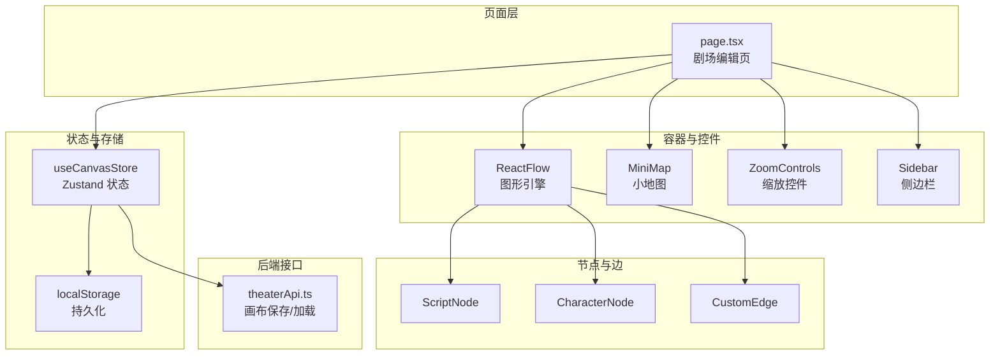
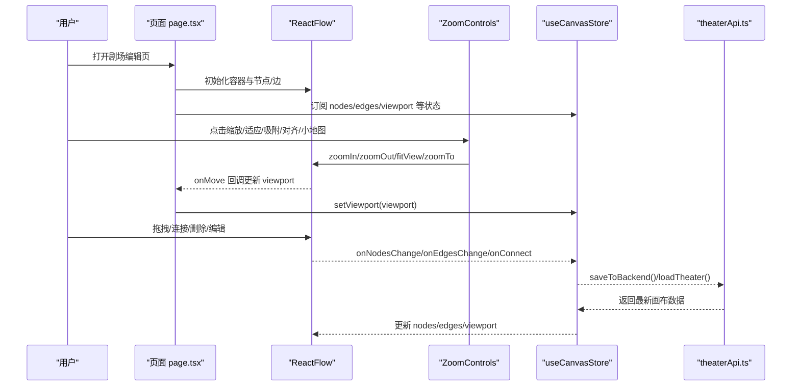
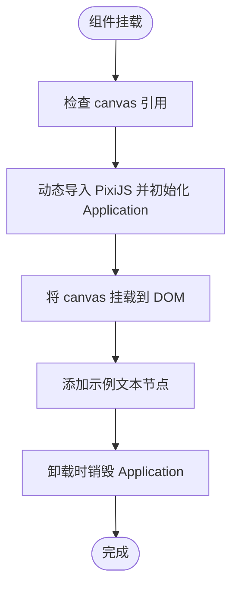
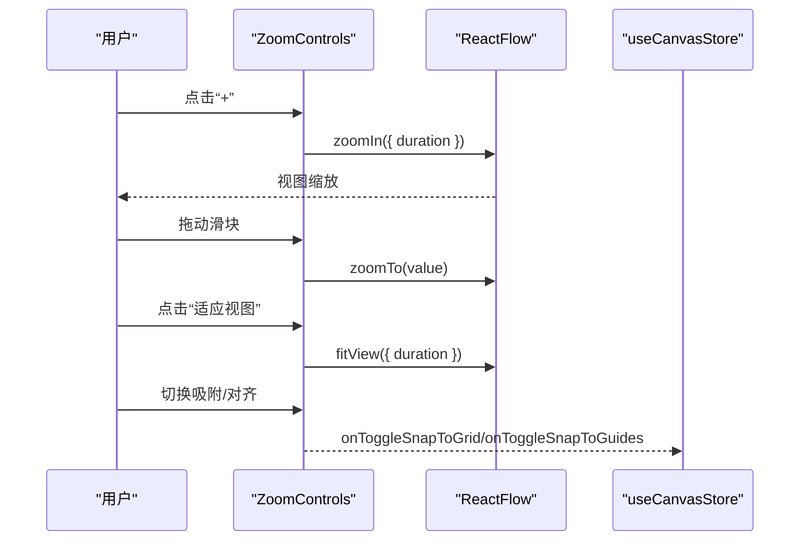
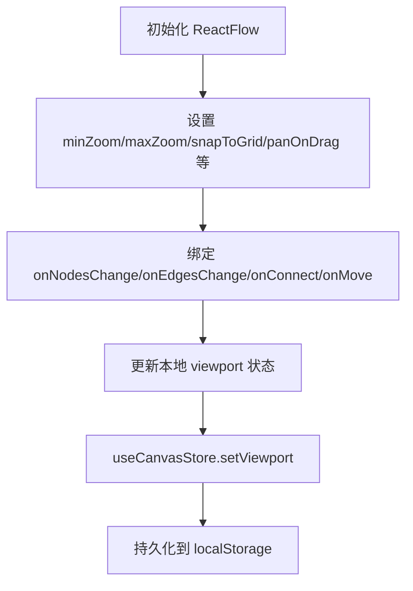
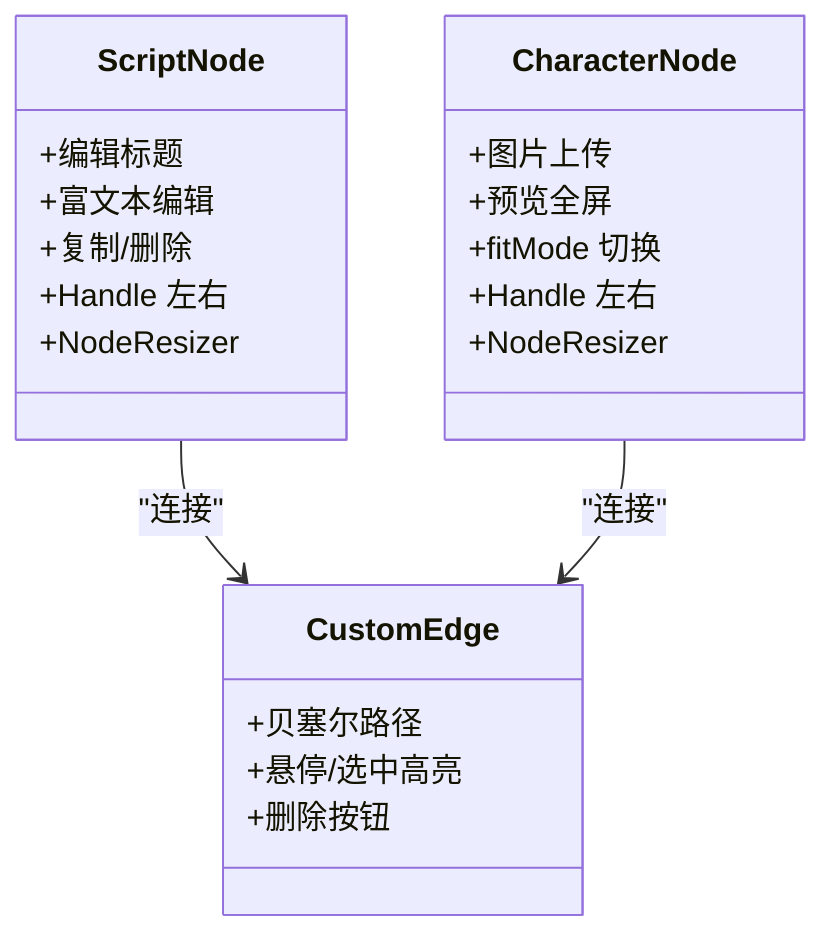
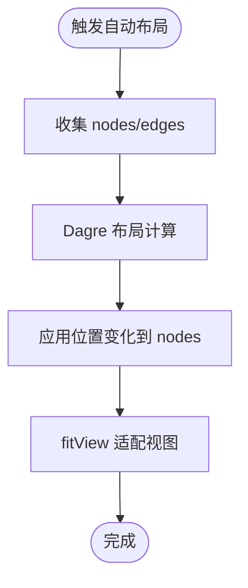
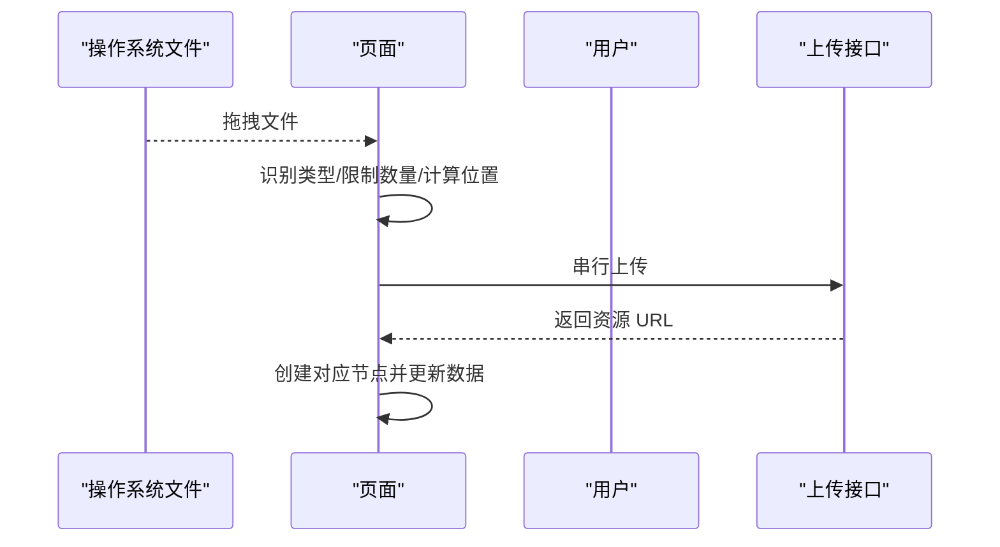
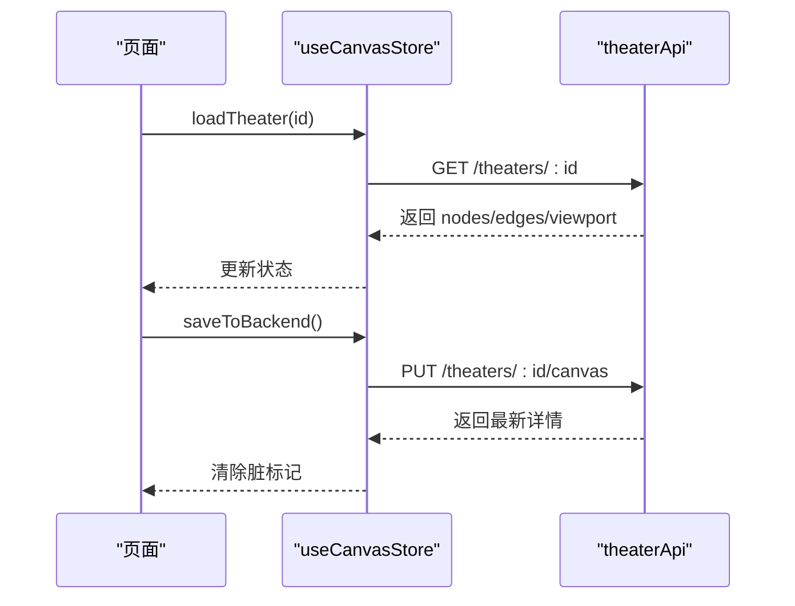
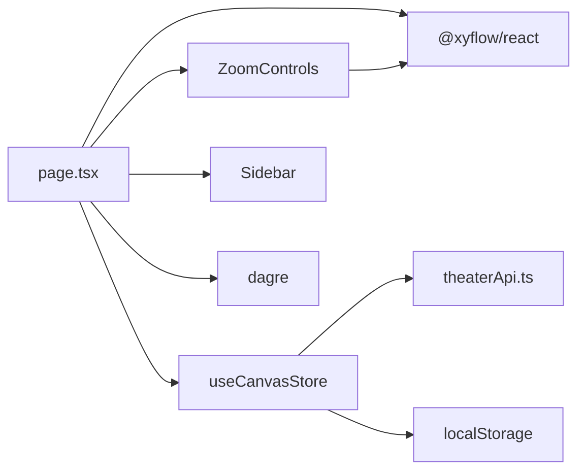

# 画布容器

<cite>
**本文引用的文件**
- [TheaterCanvas.tsx](file://frontend/src/components/TheaterCanvas.tsx)
- [ZoomControls.tsx](file://frontend/src/components/canvas/ZoomControls.tsx)
- [useCanvasStore.ts](file://frontend/src/store/useCanvasStore.ts)
- [page.tsx](file://frontend/src/app/theater/[id]/page.tsx)
- [theaterApi.ts](file://frontend/src/lib/theaterApi.ts)
- [graphUtils.ts](file://frontend/src/lib/graphUtils.ts)
- [ScriptNode.tsx](file://frontend/src/components/canvas/ScriptNode.tsx)
- [CharacterNode.tsx](file://frontend/src/components/canvas/CharacterNode.tsx)
- [CustomEdge.tsx](file://frontend/src/components/canvas/CustomEdge.tsx)
- [useAutoLayout.ts](file://frontend/src/app/theater/[id]/hooks/useAutoLayout.ts)
- [layoutUtils.ts](file://frontend/src/lib/layoutUtils.ts)
- [Sidebar.tsx](file://frontend/src/components/canvas/Sidebar.tsx)
</cite>

## 目录
1. [简介](#简介)
2. [项目结构](#项目结构)
3. [核心组件](#核心组件)
4. [架构总览](#架构总览)
5. [详细组件分析](#详细组件分析)
6. [依赖关系分析](#依赖关系分析)
7. [性能考量](#性能考量)
8. [故障排查指南](#故障排查指南)
9. [结论](#结论)
10. [附录](#附录)

## 简介
本文件聚焦“画布容器”主题，围绕 TheatherCanvas 主容器与 ZoomControls 缩放控件展开，系统性阐述其架构设计、初始化配置、视口状态管理、缩放与滚动行为、渲染机制、事件处理、性能优化与响应式设计，并给出可复用的配置项、事件监听器与扩展方法建议。文档同时覆盖 React Flow 集成、Zustand 状态管理、自动布局、吸附与对齐、文件拖拽导入、以及与后端的同步策略。

## 项目结构
画布容器位于前端应用的剧场编辑页，采用 React Flow 作为核心图形引擎，结合自研的 ZoomControls 控件与 Zustand 状态存储 useCanvasStore，形成“容器 + 控件 + 状态 + 渲染”的完整闭环。

图表来源
- [page.tsx:58-903](file://frontend/src/app/theater/[id]/page.tsx#L58-L903)
- [useCanvasStore.ts:185-539](file://frontend/src/store/useCanvasStore.ts#L185-L539)
- [ZoomControls.tsx:7-116](file://frontend/src/components/canvas/ZoomControls.tsx#L7-L116)
- [Sidebar.tsx:59-340](file://frontend/src/components/canvas/Sidebar.tsx#L59-L340)
- [theaterApi.ts:107-158](file://frontend/src/lib/theaterApi.ts#L107-L158)

章节来源
- [page.tsx:58-903](file://frontend/src/app/theater/[id]/page.tsx#L58-L903)

## 核心组件
- TheaterCanvas 主容器：基于 PixiJS 的 2D 渲染容器，负责初始化应用实例、挂载画布、清理资源。当前实现为占位文本渲染，便于验证客户端渲染链路。
- ZoomControls 缩放控件：封装 ReactFlow 的缩放、适应视图、网格吸附、对齐参考线、小地图开关、自动布局等功能入口。
- useCanvasStore 状态中心：集中管理节点/边、视口、历史快照、脏标记、与后端同步、吸附设置等。
- ReactFlow 容器：承载节点、边、背景、MiniMap、对齐线、事件回调等。
- 节点与边组件：ScriptNode、CharacterNode、CustomEdge，分别承担文本编辑、图片上传与预览、贝塞尔曲线边与删除交互。
- 自动布局与吸附：useAutoLayout + layoutUtils 提供 DAGre 布局；useCanvasSnapping 提供对齐线绘制与吸附逻辑（由页面组合使用）。

章节来源
- [TheaterCanvas.tsx:1-49](file://frontend/src/components/TheaterCanvas.tsx#L1-L49)
- [ZoomControls.tsx:7-116](file://frontend/src/components/canvas/ZoomControls.tsx#L7-L116)
- [useCanvasStore.ts:67-114](file://frontend/src/store/useCanvasStore.ts#L67-L114)
- [page.tsx:58-903](file://frontend/src/app/theater/[id]/page.tsx#L58-L903)
- [ScriptNode.tsx:12-250](file://frontend/src/components/canvas/ScriptNode.tsx#L12-L250)
- [CharacterNode.tsx:14-587](file://frontend/src/components/canvas/CharacterNode.tsx#L14-L587)
- [CustomEdge.tsx:5-99](file://frontend/src/components/canvas/CustomEdge.tsx#L5-L99)
- [useAutoLayout.ts:6-49](file://frontend/src/app/theater/[id]/hooks/useAutoLayout.ts#L6-L49)
- [layoutUtils.ts:16-126](file://frontend/src/lib/layoutUtils.ts#L16-L126)

## 架构总览
下图展示从页面到容器、控件、状态与后端的调用关系与数据流：

图表来源
- [page.tsx:745-865](file://frontend/src/app/theater/[id]/page.tsx#L745-L865)
- [ZoomControls.tsx:26-37](file://frontend/src/components/canvas/ZoomControls.tsx#L26-L37)
- [useCanvasStore.ts:378-505](file://frontend/src/store/useCanvasStore.ts#L378-L505)
- [theaterApi.ts:141-150](file://frontend/src/lib/theaterApi.ts#L141-L150)

## 详细组件分析

### TheaterCanvas 主容器
- 客户端动态引入 PixiJS，确保仅在浏览器端执行。
- 初始化 PIXI.Application，设置尺寸与背景色，将 canvas 元素挂载到 DOM。
- 渲染占位文本以验证渲染链路，随后销毁时清理资源。
- 适合后续扩展为通用画布容器（如替换为 React + Canvas 或 SVG 渲染），当前版本主要用于验证 SSR/CSR 分离与资源生命周期。

图表来源
- [TheaterCanvas.tsx:14-44](file://frontend/src/components/TheaterCanvas.tsx#L14-L44)

章节来源
- [TheaterCanvas.tsx:1-49](file://frontend/src/components/TheaterCanvas.tsx#L1-L49)

### ZoomControls 缩放控件
- 功能清单
  - 缩放：+/- 按钮与滑块联动，范围 0.25~3，支持动画过渡。
  - 适应视图：fitView，带动画时长。
  - 小地图：显示/隐藏 MiniMap。
  - 自动布局：触发 DAGre 布局并适配视图。
  - 网格吸附与对齐参考线：通过页面状态切换，配合 ReactFlow snapToGrid 与自绘对齐线。
- 交互细节
  - 滑块变更直接调用 zoomTo，保证与 ReactFlow store 的 zoom 值保持一致。
  - 按钮点击调用 zoomIn/zoomOut，带 duration 动画参数。
  - 对齐参考线在页面层根据 viewport 与对齐线坐标实时计算位置。

图表来源
- [ZoomControls.tsx:26-116](file://frontend/src/components/canvas/ZoomControls.tsx#L26-L116)
- [page.tsx:780-797](file://frontend/src/app/theater/[id]/page.tsx#L780-L797)

章节来源
- [ZoomControls.tsx:7-116](file://frontend/src/components/canvas/ZoomControls.tsx#L7-L116)

### ReactFlow 容器与视口管理
- 容器配置要点
  - 最小/最大缩放：0.25~3。
  - 连接模式：Loose，连接半径 20。
  - 网格吸附：snapToGrid 与 snapGrid。
  - 拖拽平移：panOnDrag，支持空格激活。
  - 多选/删除键：Shift 多选，Backspace/Delete 删除。
  - 初始适配：当节点数小于 2 时 fitView，maxZoom=1。
- 视口状态
  - onMove 回调中更新本地 viewport 状态，用于对齐线与 MiniMap。
  - useCanvasStore.setViewport 用于持久化与回放。

图表来源
- [page.tsx:745-776](file://frontend/src/app/theater/[id]/page.tsx#L745-L776)
- [page.tsx:755-756](file://frontend/src/app/theater/[id]/page.tsx#L755-L756)
- [useCanvasStore.ts:331-333](file://frontend/src/store/useCanvasStore.ts#L331-L333)

章节来源
- [page.tsx:745-776](file://frontend/src/app/theater/[id]/page.tsx#L745-L776)
- [useCanvasStore.ts:331-333](file://frontend/src/store/useCanvasStore.ts#L331-L333)

### 节点与边组件
- ScriptNode
  - 支持标题与富文本编辑，双击进入编辑态，失焦保存。
  - 提供复制、删除、AI 辅助等工具条动作。
  - NodeResizer 控制尺寸，Handle 连接左右两侧。
- CharacterNode
  - 图片上传、进度反馈、错误提示、预览全屏与拖拽缩放。
  - 支持 fitMode 切换（cover/contain）。
  - NodeResizer 控制尺寸，Handle 连接左右两侧。
- CustomEdge
  - 贝塞尔曲线路径，悬停/选中高亮，删除按钮内嵌于 SVG。

图表来源
- [ScriptNode.tsx:12-250](file://frontend/src/components/canvas/ScriptNode.tsx#L12-L250)
- [CharacterNode.tsx:14-587](file://frontend/src/components/canvas/CharacterNode.tsx#L14-L587)
- [CustomEdge.tsx:5-99](file://frontend/src/components/canvas/CustomEdge.tsx#L5-L99)

章节来源
- [ScriptNode.tsx:12-250](file://frontend/src/components/canvas/ScriptNode.tsx#L12-L250)
- [CharacterNode.tsx:14-587](file://frontend/src/components/canvas/CharacterNode.tsx#L14-L587)
- [CustomEdge.tsx:5-99](file://frontend/src/components/canvas/CustomEdge.tsx#L5-L99)

### 自动布局与吸附
- 自动布局
  - 使用 Dagre 布局算法，区分连通与孤立节点，连通节点按方向布局，孤立节点按类型分组网格排列。
  - 通过 onNodesChange 应用位置变化，随后 fitView 适配视图。
- 对齐吸附
  - 页面层根据 viewport 与对齐线坐标绘制垂直/水平辅助线，提升节点对齐体验。

图表来源
- [useAutoLayout.ts:20-46](file://frontend/src/app/theater/[id]/hooks/useAutoLayout.ts#L20-L46)
- [layoutUtils.ts:16-126](file://frontend/src/lib/layoutUtils.ts#L16-L126)

章节来源
- [useAutoLayout.ts:6-49](file://frontend/src/app/theater/[id]/hooks/useAutoLayout.ts#L6-L49)
- [layoutUtils.ts:16-126](file://frontend/src/lib/layoutUtils.ts#L16-L126)

### 文件拖拽与导入
- 支持外部文件拖拽到画布，自动识别文本/图片/视频/音频类型，限制批量数量与单文件大小。
- 文本文件读取并截断超长内容；图片/视频上传后更新节点数据，音频创建文本节点并插入 URL。
- 串行上传避免并发写入冲突。

图表来源
- [page.tsx:596-686](file://frontend/src/app/theater/[id]/page.tsx#L596-L686)
- [page.tsx:356-543](file://frontend/src/app/theater/[id]/page.tsx#L356-L543)

章节来源
- [page.tsx:596-686](file://frontend/src/app/theater/[id]/page.tsx#L596-L686)
- [page.tsx:356-543](file://frontend/src/app/theater/[id]/page.tsx#L356-L543)

### 后端同步与持久化
- 加载：首次进入页面时拉取剧场详情，合并节点/边/视口，保留用户当前视图。
- 保存：脏标记触发 2 秒防抖保存，写入节点、边与视口信息。
- 持久化：Zustand 结合 localStorage，仅持久化关键字段，避免冗余。

图表来源
- [page.tsx:135-148](file://frontend/src/app/theater/[id]/page.tsx#L135-L148)
- [useCanvasStore.ts:388-505](file://frontend/src/store/useCanvasStore.ts#L388-L505)
- [theaterApi.ts:124-150](file://frontend/src/lib/theaterApi.ts#L124-L150)

章节来源
- [useCanvasStore.ts:388-505](file://frontend/src/store/useCanvasStore.ts#L388-L505)
- [theaterApi.ts:124-150](file://frontend/src/lib/theaterApi.ts#L124-L150)

## 依赖关系分析
- 组件耦合
  - page.tsx 作为编排者，依赖 ReactFlow、MiniMap、ZoomControls、Sidebar、useCanvasStore。
  - ZoomControls 仅依赖 ReactFlow 与 UI 组件，低耦合。
  - useCanvasStore 作为状态中枢，被所有业务模块依赖。
- 外部依赖
  - React Flow：图形渲染、事件、缩放、吸附、MiniMap。
  - dagre：自动布局。
  - lucide-react：图标。
  - @xyflow/react：类型与工具函数。
  - Zustand：状态管理与持久化。

图表来源
- [page.tsx:4-25](file://frontend/src/app/theater/[id]/page.tsx#L4-L25)
- [useCanvasStore.ts:1-25](file://frontend/src/store/useCanvasStore.ts#L1-L25)
- [ZoomControls.tsx:1-5](file://frontend/src/components/canvas/ZoomControls.tsx#L1-L5)
- [Sidebar.tsx:1-8](file://frontend/src/components/canvas/Sidebar.tsx#L1-L8)

章节来源
- [page.tsx:4-25](file://frontend/src/app/theater/[id]/page.tsx#L4-L25)
- [useCanvasStore.ts:1-25](file://frontend/src/store/useCanvasStore.ts#L1-L25)

## 性能考量
- 渲染优化
  - 节点组件使用 memo 包装，减少重渲染。
  - 图片节点在 onload 后按自然尺寸计算合理宽高，避免频繁尺寸抖动。
- 事件与回调
  - onMove 仅更新本地 viewport，避免频繁写入状态。
  - 自动布局使用一次性位置变更，fitView 延迟触发，减少多次重排。
- 存储与同步
  - 脏标记 + 2 秒防抖保存，降低网络压力。
  - localStorage 持久化仅保存必要字段，避免膨胀。
- 布局算法
  - Dagre 布局在节点较多时可能有计算成本，建议在节点量大时延迟触发或节流。

## 故障排查指南
- 缩放无效
  - 检查 ReactFlow 容器是否正确设置 minZoom/maxZoom。
  - 确认 ZoomControls 的 zoomIn/zoomOut/zoomTo 调用链路。
- 连接循环
  - onConnect 中使用 hasCycle 检测，若出现循环连接需拦截。
- 节点尺寸异常
  - 图片 onload 后按自然宽高计算尺寸，注意最小尺寸阈值与更新频率。
- 保存失败
  - 查看 saveToBackend 抛错与 isSaving 状态，确认网络与鉴权头。
- 自动布局不生效
  - 确认 nodes/edges 是否为空，Dagre 输入是否有效。

章节来源
- [page.tsx:150-187](file://frontend/src/app/theater/[id]/page.tsx#L150-L187)
- [graphUtils.ts:4-38](file://frontend/src/lib/graphUtils.ts#L4-L38)
- [useCanvasStore.ts:238-254](file://frontend/src/store/useCanvasStore.ts#L238-L254)
- [CharacterNode.tsx:219-251](file://frontend/src/components/canvas/CharacterNode.tsx#L219-L251)
- [useCanvasStore.ts:478-505](file://frontend/src/store/useCanvasStore.ts#L478-L505)
- [useAutoLayout.ts:20-46](file://frontend/src/app/theater/[id]/hooks/useAutoLayout.ts#L20-L46)

## 结论
本画布容器以 React Flow 为核心，结合 ZoomControls、Zustand 状态与自动布局/吸附能力，构建了可扩展的可视化编辑环境。TheaterCanvas 当前作为占位容器，未来可替换为更高效的渲染方案。整体架构清晰、职责分明，具备良好的扩展性与维护性。

## 附录

### 配置选项与事件监听器
- ReactFlow 容器常用配置
  - 缩放范围：minZoom=0.25，maxZoom=3
  - 网格吸附：snapToGrid=true，snapGrid=[20,20]
  - 连接模式：ConnectionMode.Loose，connectionRadius=20
  - 删除键：deleteKeyCode=['Backspace','Delete']
  - 初始适配：fitView=nodes.length<2，fitViewOptions={maxZoom:1}
  - 平移：panOnDrag=[1,2]，panActivationKeyCode=['Space']
- ZoomControls 参数
  - showMap：是否显示小地图
  - onToggleMap：切换小地图
  - onAutoLayout：触发自动布局
  - isLayouting：布局中状态
  - snapToGrid/snapToGuides：吸附与对齐开关
  - onToggleSnapToGrid/onToggleSnapToGuides：切换回调
- useCanvasStore 行为
  - setViewport(viewport)：更新视口
  - saveToBackend()：保存画布
  - loadTheater(id)/syncTheater(id)：加载/同步
  - setSnapToGrid/setSnapToGuides：设置吸附

章节来源
- [page.tsx:745-776](file://frontend/src/app/theater/[id]/page.tsx#L745-L776)
- [ZoomControls.tsx:7-25](file://frontend/src/components/canvas/ZoomControls.tsx#L7-L25)
- [useCanvasStore.ts:94-114](file://frontend/src/store/useCanvasStore.ts#L94-L114)