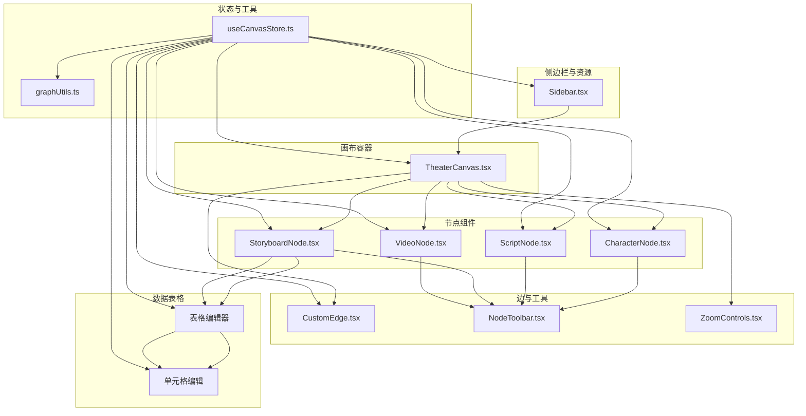
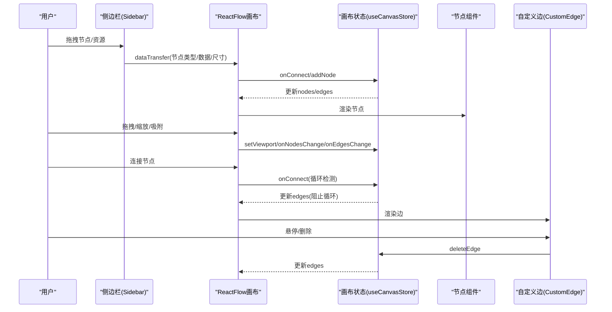
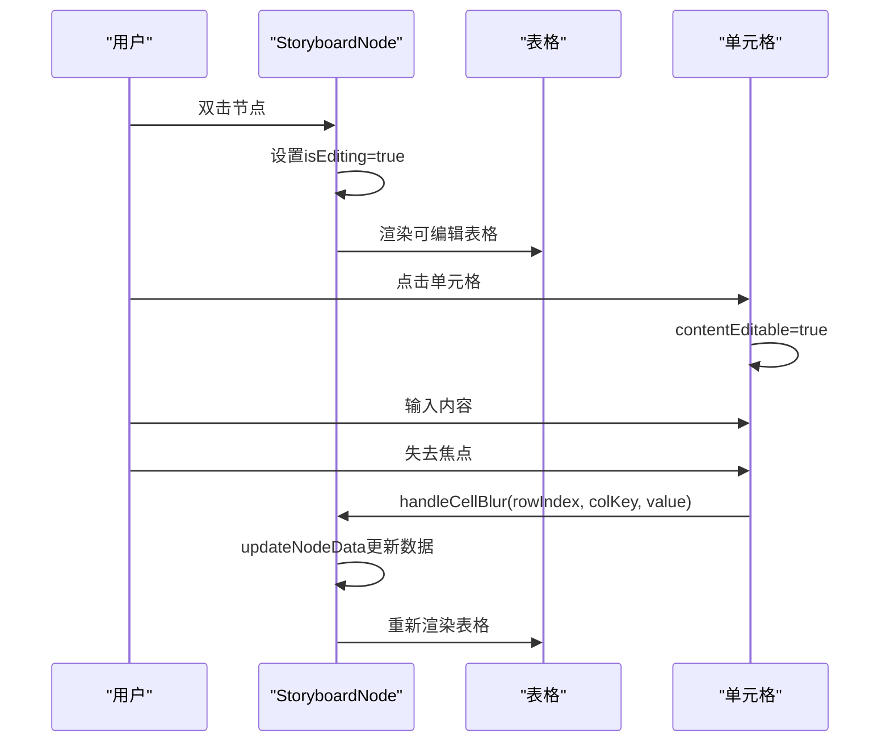
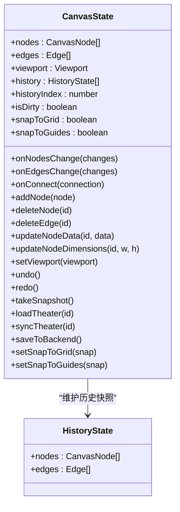
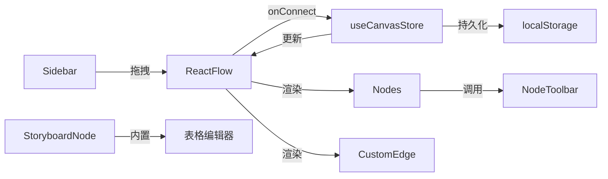

# 画布编辑器

<cite>
**本文档引用的文件**
- [TheaterCanvas.tsx](file://frontend/src/components/TheaterCanvas.tsx)
- [CharacterNode.tsx](file://frontend/src/components/canvas/CharacterNode.tsx)
- [ScriptNode.tsx](file://frontend/src/components/canvas/ScriptNode.tsx)
- [StoryboardNode.tsx](file://frontend/src/components/canvas/StoryboardNode.tsx)
- [VideoNode.tsx](file://frontend/src/components/canvas/VideoNode.tsx)
- [CustomEdge.tsx](file://frontend/src/components/canvas/CustomEdge.tsx)
- [Sidebar.tsx](file://frontend/src/components/canvas/Sidebar.tsx)
- [NodeToolbar.tsx](file://frontend/src/components/canvas/NodeToolbar.tsx)
- [ZoomControls.tsx](file://frontend/src/components/canvas/ZoomControls.tsx)
- [useCanvasStore.ts](file://frontend/src/store/useCanvasStore.ts)
- [graphUtils.ts](file://frontend/src/lib/graphUtils.ts)
- [PivotEditor.tsx](file://frontend/src/components/canvas/pivot/PivotEditor.tsx)
- [PivotTable.tsx](file://frontend/src/components/canvas/pivot/PivotTable.tsx)
- [usePivotEngine.ts](file://frontend/src/components/canvas/pivot/usePivotEngine.ts)
- [page.tsx](file://frontend/src/app/theater/[id]/page.tsx)
</cite>

## 更新摘要
**所做更改**
- 更新StoryboardNode章节，反映从复杂透视表编辑器到直接表格编辑界面的重大架构变更
- 移除PivotEditor、PivotTable和usePivotEngine相关章节，因为这些组件已被移除
- 新增StoryboardNode直接表格编辑功能的详细说明
- 更新StoryboardNode数据模型，移除pivotConfig和pivotData字段
- 更新架构图和组件关系图，反映新的简化结构

## 目录
1. [简介](#简介)
2. [项目结构](#项目结构)
3. [核心组件](#核心组件)
4. [架构总览](#架构总览)
5. [详细组件分析](#详细组件分析)
6. [依赖关系分析](#依赖关系分析)
7. [性能考虑](#性能考虑)
8. [故障排查指南](#故障排查指南)
9. [结论](#结论)
10. [附录](#附录)

## 简介
本文件面向KunFlix的画布编辑器，系统化阐述基于React Flow的可视化编辑器架构与实现。重点覆盖以下方面：
- 主容器与画布环境：TheaterCanvas主容器与React Flow画布集成
- 节点体系：CharacterNode、ScriptNode、StoryboardNode、VideoNode的实现细节与交互行为
- 连接边：CustomEdge的绘制与交互
- 工具栏与侧边栏：NodeToolbar、Sidebar的功能与拖拽集成
- 缩放与视图控制：ZoomControls的缩放、自适应、吸附与小地图
- 布局与预处理：节点尺寸预处理、拖拽到画布与AI能力集成
- 数据表格：StoryboardNode的直接表格编辑功能与单元格编辑
- 状态管理：useCanvasStore的状态模型、历史快照与后端同步
- 错误处理与最佳实践：循环检测、上传校验、事件冒泡与可访问性

## 项目结构
前端采用按功能域组织的组件结构，画布相关组件集中在frontend/src/components/canvas目录下，并通过store/useCanvasStore集中管理状态。

**图表来源**
- [TheaterCanvas.tsx:1-50](file://frontend/src/components/TheaterCanvas.tsx#L1-L50)
- [CharacterNode.tsx:1-588](file://frontend/src/components/canvas/CharacterNode.tsx#L1-L588)
- [ScriptNode.tsx:1-253](file://frontend/src/components/canvas/ScriptNode.tsx#L1-L253)
- [StoryboardNode.tsx:1-207](file://frontend/src/components/canvas/StoryboardNode.tsx#L1-L207)
- [VideoNode.tsx:1-429](file://frontend/src/components/canvas/VideoNode.tsx#L1-L429)
- [CustomEdge.tsx:1-100](file://frontend/src/components/canvas/CustomEdge.tsx#L1-L100)
- [NodeToolbar.tsx:1-95](file://frontend/src/components/canvas/NodeToolbar.tsx#L1-L95)
- [ZoomControls.tsx:1-117](file://frontend/src/components/canvas/ZoomControls.tsx#L1-L117)
- [Sidebar.tsx:1-341](file://frontend/src/components/canvas/Sidebar.tsx#L1-L341)
- [useCanvasStore.ts:1-547](file://frontend/src/store/useCanvasStore.ts#L1-L547)

**章节来源**
- [TheaterCanvas.tsx:1-50](file://frontend/src/components/TheaterCanvas.tsx#L1-L50)
- [Sidebar.tsx:1-341](file://frontend/src/components/canvas/Sidebar.tsx#L1-L341)
- [useCanvasStore.ts:1-547](file://frontend/src/store/useCanvasStore.ts#L1-L547)

## 核心组件
- 主容器 TheaterCanvas：负责初始化画布环境（Pixi.js），作为画布容器承载React Flow画布与UI元素。
- React Flow画布：由useCanvasStore驱动，管理节点、边、视口与历史快照；通过Sidebar拖拽添加节点；通过ZoomControls控制缩放与吸附。
- 节点组件：CharacterNode、ScriptNode、StoryboardNode、VideoNode分别实现不同媒体类型的节点编辑与交互。
- 自定义边 CustomEdge：贝塞尔曲线路径、悬停高亮、删除按钮与宽轨道增强交互。
- 工具栏 NodeToolbar：统一的节点工具条，支持分组与危险操作分离。
- 数据表格 StoryboardNode：直接的表格编辑界面，支持双击进入编辑模式和单元格直接编辑。

**章节来源**
- [TheaterCanvas.tsx:1-50](file://frontend/src/components/TheaterCanvas.tsx#L1-L50)
- [useCanvasStore.ts:1-547](file://frontend/src/store/useCanvasStore.ts#L1-L547)
- [CustomEdge.tsx:1-100](file://frontend/src/components/canvas/CustomEdge.tsx#L1-L100)
- [NodeToolbar.tsx:1-95](file://frontend/src/components/canvas/NodeToolbar.tsx#L1-L95)
- [StoryboardNode.tsx:1-207](file://frontend/src/components/canvas/StoryboardNode.tsx#L1-L207)

## 架构总览
画布编辑器采用"状态驱动 + 组件解耦"的架构：
- 状态层：useCanvasStore集中管理节点、边、视口、历史、脏标记与后端同步。
- 视图层：各节点组件通过React Flow渲染；Sidebar提供节点库与资源库拖拽；ZoomControls提供视图控制。
- 计算层：StoryboardNode内置表格编辑引擎，支持实时单元格编辑与数据更新。
- 工具层：graphUtils提供拓扑检测，防止循环连接；NodeToolbar统一交互体验。

**图表来源**
- [Sidebar.tsx:104-127](file://frontend/src/components/canvas/Sidebar.tsx#L104-L127)
- [useCanvasStore.ts:238-254](file://frontend/src/store/useCanvasStore.ts#L238-L254)
- [graphUtils.ts:4-38](file://frontend/src/lib/graphUtils.ts#L4-L38)
- [CustomEdge.tsx:29-32](file://frontend/src/components/canvas/CustomEdge.tsx#L29-L32)

## 详细组件分析

### 主容器 TheaterCanvas
- 功能：动态引入Pixi.js并在客户端初始化画布，挂载到容器元素，渲染基础文本以验证渲染链路。
- 关键点：生命周期清理销毁Pixi应用，避免内存泄漏；容器具备圆角与阴影样式类。

**章节来源**
- [TheaterCanvas.tsx:1-50](file://frontend/src/components/TheaterCanvas.tsx#L1-L50)

### 节点类型定义与数据模型
- ScriptNodeData：标题、富文本内容、标签、关联角色/场景等。
- CharacterNodeData：名称、描述、头像、图片URL、上传状态、适配模式。
- StoryboardNodeData：镜头号、描述、时长、表格数据与列定义。
- VideoNodeData：名称、描述、视频URL、上传状态、适配模式。
- CanvasNode：统一节点类型，联合上述四种数据类型。

**章节来源**
- [useCanvasStore.ts:26-62](file://frontend/src/store/useCanvasStore.ts#L26-L62)

### CharacterNode 图片节点
- 交互特性：
  - 双击图片卡片进入全屏预览，支持滚轮缩放与拖拽平移。
  - 工具栏支持AI编辑、切换适配模式、复制节点、删除节点。
  - 支持本地上传图片，带进度与错误反馈，上传成功后同步至后端并更新节点数据。
  - 自动根据图片自然尺寸计算节点尺寸，避免过小或过大。
- 事件与状态：
  - 标题双击进入编辑模式，失焦保存；点击外部区域退出编辑。
  - 上传过程禁止拖拽，避免冲突。
- 性能与体验：
  - 预览使用createPortal挂载到body，避免层级限制。
  - 预览容器监听wheel事件，非被动绑定以支持缩放。

**图表来源**
- [CharacterNode.tsx:137-215](file://frontend/src/components/canvas/CharacterNode.tsx#L137-L215)

**章节来源**
- [CharacterNode.tsx:1-588](file://frontend/src/components/canvas/CharacterNode.tsx#L1-L588)

### ScriptNode 文本节点
- 交互特性：
  - 双击卡片进入编辑模式，ESC退出；点击外部区域保存。
  - 工具栏支持AI辅助与编辑、复制节点、删除节点。
  - 内嵌ScriptEditor组件，支持字数统计与内容更新。
- 事件与状态：
  - 外部数据变更时同步到本地编辑态，避免覆盖未保存的修改。
  - 编辑完成触发状态更新与脏标记。

**章节来源**
- [ScriptNode.tsx:1-253](file://frontend/src/components/canvas/ScriptNode.tsx#L1-L253)

### VideoNode 视频节点
- 交互特性：
  - 与图片节点类似，支持上传、进度反馈、错误提示与自动尺寸计算。
  - 上传成功后同步资源到资源库，使侧边栏实时可见。
  - 视频控件区域保留交互，上方遮罩支持拖拽移动。
- 事件与状态：
  - metadata加载后计算尺寸，避免节点过小。
  - fitMode切换覆盖/适应两种模式。

**章节来源**
- [VideoNode.tsx:1-429](file://frontend/src/components/canvas/VideoNode.tsx#L1-L429)

### StoryboardNode 数据表格节点
**更新** StoryboardNode已从复杂的透视表编辑器重构为直接的表格编辑界面

- 交互特性：
  - 双击节点进入编辑模式，所有单元格变为可编辑状态
  - 单元格失去焦点时自动保存更改
  - 支持垂直和水平滚动条，编辑模式下阻止拖拽事件
  - 工具栏支持复制节点和删除节点
- 数据模型：
  - tableData：原始表格行数据数组
  - tableColumns：列定义数组，包含key、label和可选的type字段
  - 自动推导：如果没有显式列定义，将从第一行数据自动推导列名
- 表格渲染：
  - 使用原生HTML table元素，支持固定表头和悬停效果
  - 列宽限制为180px，超出内容截断显示
  - 无数据时显示"暂无数据"和"等待 Agent 填入数据"提示
- 编辑功能：
  - contentEditable属性启用单元格直接编辑
  - handleCellBlur回调处理编辑完成事件
  - 实时更新节点数据并标记脏状态

**图表来源**
- [StoryboardNode.tsx:87-96](file://frontend/src/components/canvas/StoryboardNode.tsx#L87-L96)
- [StoryboardNode.tsx:139-147](file://frontend/src/components/canvas/StoryboardNode.tsx#L139-L147)
- [StoryboardNode.tsx:59-64](file://frontend/src/components/canvas/StoryboardNode.tsx#L59-L64)

**章节来源**
- [StoryboardNode.tsx:1-207](file://frontend/src/components/canvas/StoryboardNode.tsx#L1-L207)

### CustomEdge 自定义边
- 特性：贝塞尔曲线路径、宽轨道增强hover命中区、悬停高亮、删除按钮。
- 交互：点击删除按钮触发状态删除，支持selected与hover状态切换。

**章节来源**
- [CustomEdge.tsx:1-100](file://frontend/src/components/canvas/CustomEdge.tsx#L1-L100)

### NodeToolbar 工具条
- 设计：统一的悬浮工具条，支持danger操作分组与分隔线；hover出现与位移动画。
- 行为：根据variant区分默认/危险/主要操作，提供图标与标题。

**章节来源**
- [NodeToolbar.tsx:1-95](file://frontend/src/components/canvas/NodeToolbar.tsx#L1-L95)

### Sidebar 侧边栏与拖拽
- 节点库：提供文本、图片、视频、多维表格节点的快捷添加。
- 资源库：按类型分组显示图片/视频/音频资源，支持拖拽到画布生成对应节点。
- 拖拽协议：通过dataTransfer传递节点类型、初始数据与尺寸；自定义半透明拖拽预览。

**章节来源**
- [Sidebar.tsx:1-341](file://frontend/src/components/canvas/Sidebar.tsx#L1-L341)

### ZoomControls 缩放与吸附
- 功能：缩放滑块、放大/缩小、适应屏幕、自动布局、网格吸附、对齐参考线、小地图开关。
- 与ReactFlow集成：通过useReactFlow提供的zoomIn/zoomOut/fitView/zoomTo控制视图。

**章节来源**
- [ZoomControls.tsx:1-117](file://frontend/src/components/canvas/ZoomControls.tsx#L1-L117)

### 状态管理 useCanvasStore
- 状态模型：nodes、edges、viewport、历史快照、脏标记、剧院ID/标题、加载/保存状态。
- 核心动作：
  - onNodesChange/onEdgesChange：应用变更并标记脏状态。
  - onConnect：循环检测（hasCycle）、添加自定义边、标记脏状态与快照。
  - addNode/deleteNode/deleteEdge：节点/边增删与联动清理。
  - updateNodeData/updateNodeDimensions：节点数据与尺寸更新。
  - setViewport：视口更新。
  - undo/redo：基于历史快照的撤销/重做。
  - 后端同步：loadTheater/syncTheater/saveToBackend，前后端节点/边映射与差异合并。
  - 设置项：snapToGrid/snapToGuides。
- 持久化：localStorage存储部分状态，合并去重逻辑保证一致性。

**图表来源**
- [useCanvasStore.ts:69-117](file://frontend/src/store/useCanvasStore.ts#L69-L117)
- [useCanvasStore.ts:188-547](file://frontend/src/store/useCanvasStore.ts#L188-L547)

**章节来源**
- [useCanvasStore.ts:1-547](file://frontend/src/store/useCanvasStore.ts#L1-L547)

### 循环检测与拓扑安全
- hasCycle：构建邻接表，DFS检查是否存在从目标指向源的路径，若存在则阻止连接形成环。

**章节来源**
- [graphUtils.ts:4-38](file://frontend/src/lib/graphUtils.ts#L4-L38)
- [useCanvasStore.ts:244-248](file://frontend/src/store/useCanvasStore.ts#L244-L248)

## 依赖关系分析
- 组件耦合：
  - 节点组件依赖NodeToolbar与React Flow Handles，实现连接端点与工具条。
  - CustomEdge依赖React Flow的getBezierPath与useCanvasStore删除边。
  - Sidebar与画布通过dataTransfer协议解耦，支持节点库与资源库拖拽。
  - StoryboardNode内部集成表格编辑功能，无需外部pivot组件依赖。
- 外部依赖：
  - React Flow：节点、边、视口与事件处理。
  - Zustand：状态持久化与快照管理。
  - Ant Design：表格渲染与UI组件。
  - Web Worker：透视计算异步化（已移除）。

**图表来源**
- [Sidebar.tsx:104-127](file://frontend/src/components/canvas/Sidebar.tsx#L104-L127)
- [useCanvasStore.ts:238-254](file://frontend/src/store/useCanvasStore.ts#L238-L254)
- [CustomEdge.tsx:1-100](file://frontend/src/components/canvas/CustomEdge.tsx#L1-L100)
- [StoryboardNode.tsx:1-207](file://frontend/src/components/canvas/StoryboardNode.tsx#L1-L207)

## 性能考虑
- Web Worker：透视计算在Worker中执行，避免主线程阻塞（已移除pivot相关功能）。
- 虚拟滚动：表格编辑器使用原生滚动，无需虚拟滚动优化。
- 事件优化：CustomEdge使用宽轨道增强命中区，减少误触；节点上传期间禁用拖拽，避免重复事件。
- 尺寸预处理：图片/视频metadata加载后计算合理尺寸，避免频繁重排。
- 历史快照：限制历史长度与增量快照，降低存储与回放成本。
- 持久化合并：去重与部分序列化，减少存储体积与合并复杂度。
- 实时更新：单元格编辑采用即时保存策略，减少数据同步延迟。

## 故障排查指南
- 无法连接节点：
  - 检查是否自连接或形成环路；确认hasCycle拦截生效。
  - 查看onConnect日志与阻止原因。
- 上传失败：
  - 检查文件类型与大小限制；查看上传错误提示与HTTP状态码。
  - 确认Authorization头与后端接口可用性。
- 预览异常：
  - 确认createPortal挂载成功；检查wheel事件监听与非被动绑定。
  - 预览容器指针捕获与释放逻辑。
- 表格编辑问题：
  - 确认isEditing状态正确切换；检查contentEditable属性设置。
  - 验证handleCellBlur回调是否正确更新节点数据。
  - 检查tableData和tableColumns数据格式是否正确。

**章节来源**
- [graphUtils.ts:4-38](file://frontend/src/lib/graphUtils.ts#L4-L38)
- [CharacterNode.tsx:137-215](file://frontend/src/components/canvas/CharacterNode.tsx#L137-L215)
- [VideoNode.tsx:109-190](file://frontend/src/components/canvas/VideoNode.tsx#L109-L190)
- [StoryboardNode.tsx:59-64](file://frontend/src/components/canvas/StoryboardNode.tsx#L59-L64)

## 结论
本画布编辑器通过React Flow与Zustand实现了高扩展性的可视化编辑平台。节点类型丰富、交互完善、状态管理清晰。StoryboardNode经过重大重构，从复杂的透视表编辑器转变为直观的直接表格编辑界面，大大提升了用户体验和开发效率。Sidebar与ZoomControls提供了良好的创作入口与视图控制体验。建议后续在节点预览卡与拖拽到AI能力上进一步完善，以提升创作效率与智能化水平。

## 附录
- 最佳实践：
  - 节点数据更新使用updateNodeData，避免直接修改节点对象。
  - 连接前进行hasCycle检测，确保图结构无环。
  - 上传流程中始终设置上传中状态并在finally中清理。
  - 使用NodeResizer与metadata回调控制节点尺寸，避免过小影响交互。
  - 表格编辑时注意编辑模式与拖拽事件的协调。
- 可访问性：
  - 为按钮与输入框提供aria-label与title属性。
  - 确保键盘可操作（ESC退出编辑、Enter激活按钮）。
  - 预览窗口支持Esc关闭，避免焦点丢失。
  - 表格单元格提供适当的语义化标记。