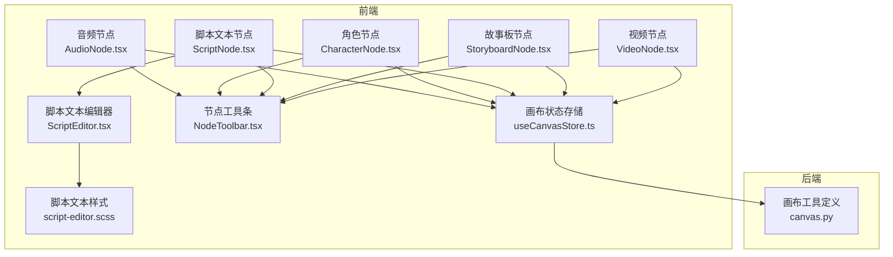
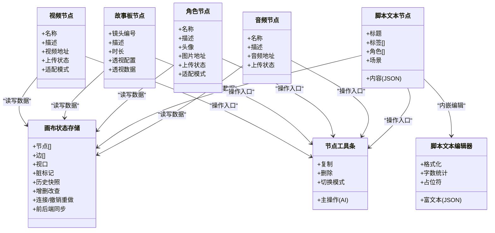
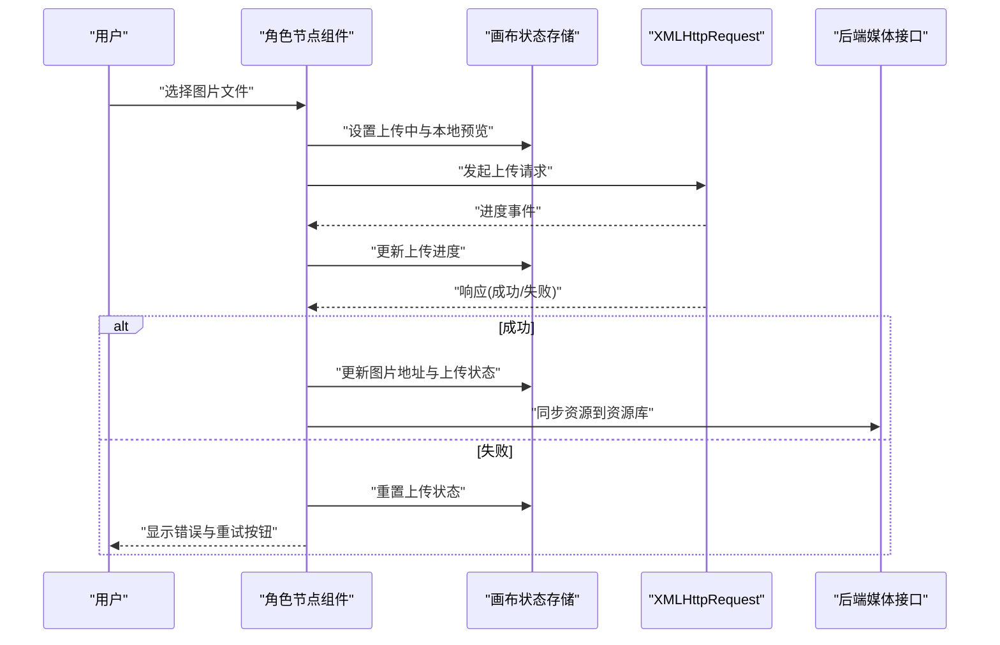
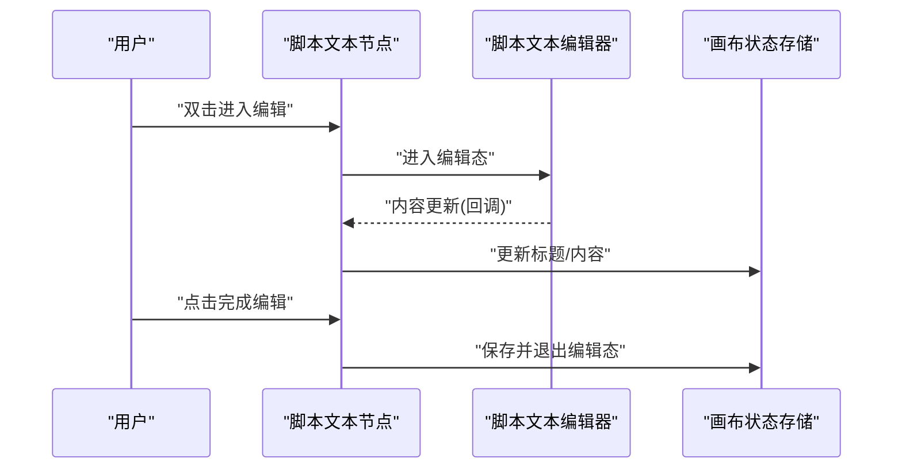
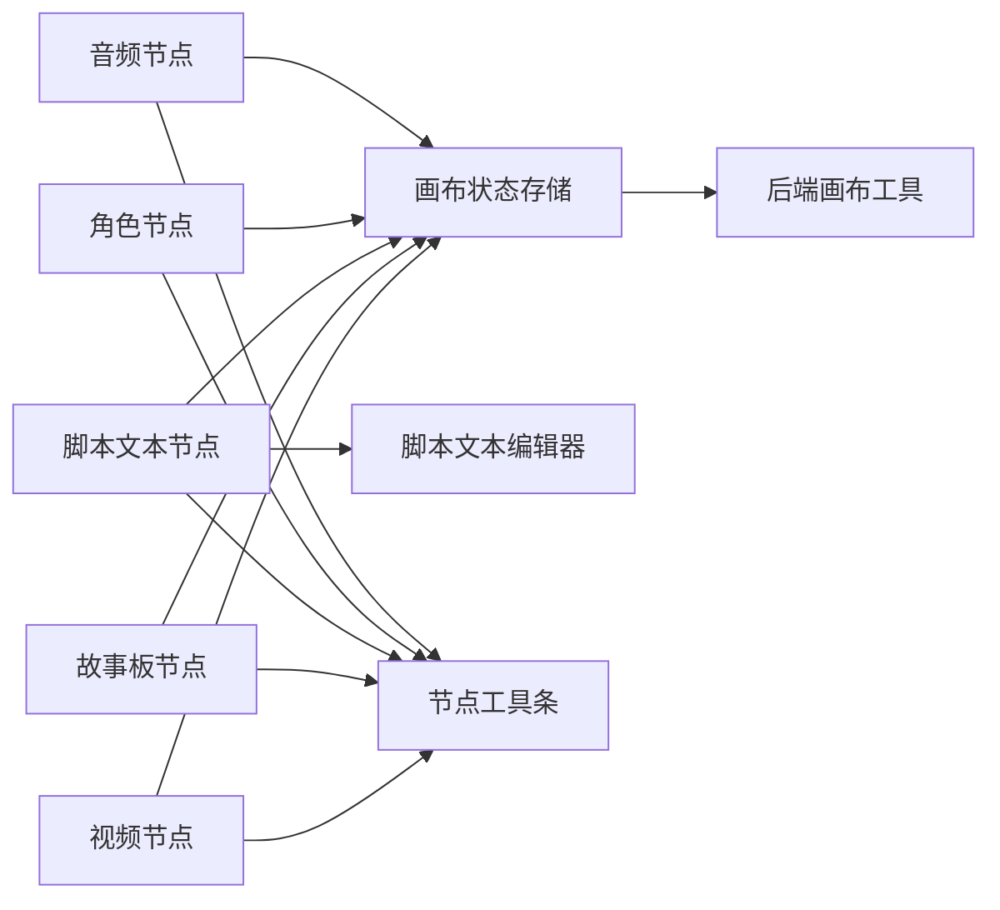

# 节点类型

<cite>
**本文引用的文件**
- [AudioNode.tsx](file://frontend/src/components/canvas/AudioNode.tsx)
- [CharacterNode.tsx](file://frontend/src/components/canvas/CharacterNode.tsx)
- [ScriptNode.tsx](file://frontend/src/components/canvas/ScriptNode.tsx)
- [StoryboardNode.tsx](file://frontend/src/components/canvas/StoryboardNode.tsx)
- [VideoNode.tsx](file://frontend/src/components/canvas/VideoNode.tsx)
- [ScriptEditor.tsx](file://frontend/src/components/canvas/ScriptEditor.tsx)
- [useCanvasStore.ts](file://frontend/src/store/useCanvasStore.ts)
- [NodeToolbar.tsx](file://frontend/src/components/canvas/NodeToolbar.tsx)
- [graphUtils.ts](file://frontend/src/lib/graphUtils.ts)
- [nodeAttachmentUtils.ts](file://frontend/src/lib/nodeAttachmentUtils.ts)
- [script-editor.scss](file://frontend/src/components/canvas/script-editor.scss)
- [CharacterNode.test.tsx](file://frontend/src/components/canvas/__tests__/CharacterNode.test.tsx)
- [ScriptNode.test.tsx](file://frontend/src/components/canvas/__tests__/ScriptNode.test.tsx)
- [canvas.py](file://backend/services/tool_manager/providers/canvas.py)
</cite>

## 目录
1. [简介](#简介)
2. [项目结构](#项目结构)
3. [核心组件](#核心组件)
4. [架构总览](#架构总览)
5. [详细组件分析](#详细组件分析)
6. [依赖关系分析](#依赖关系分析)
7. [性能考量](#性能考量)
8. [故障排查指南](#故障排查指南)
9. [结论](#结论)
10. [附录](#附录)

## 简介
本文件系统化梳理画布节点类型，围绕以下五种节点展开：音频节点（AudioNode）、角色节点（CharacterNode）、脚本文本节点（ScriptNode）、故事板节点（StoryboardNode）与视频节点（VideoNode）。文档从架构设计、渲染逻辑、属性配置、交互行为、样式定制、数据绑定与状态管理、事件处理与动画、扩展机制与自定义开发、性能优化与实践案例等方面进行深入说明，并辅以可视化图示帮助理解。

## 项目结构
前端采用基于组件的组织方式，节点类型位于画布模块；状态管理通过轻量状态库集中维护；节点工具条统一承载操作入口；脚本文本节点内嵌富文本编辑器；后端提供节点能力的工具定义与执行接口。

**图表来源**
- [AudioNode.tsx:1-375](file://frontend/src/components/canvas/AudioNode.tsx#L1-L375)
- [CharacterNode.tsx:1-596](file://frontend/src/components/canvas/CharacterNode.tsx#L1-L596)
- [ScriptNode.tsx:1-257](file://frontend/src/components/canvas/ScriptNode.tsx#L1-L257)
- [StoryboardNode.tsx:1-208](file://frontend/src/components/canvas/StoryboardNode.tsx#L1-L208)
- [VideoNode.tsx:1-429](file://frontend/src/components/canvas/VideoNode.tsx#L1-L429)
- [ScriptEditor.tsx:1-280](file://frontend/src/components/canvas/ScriptEditor.tsx#L1-L280)
- [NodeToolbar.tsx:1-95](file://frontend/src/components/canvas/NodeToolbar.tsx#L1-L95)
- [useCanvasStore.ts:1-554](file://frontend/src/store/useCanvasStore.ts#L1-L554)
- [script-editor.scss:1-313](file://frontend/src/components/canvas/script-editor.scss#L1-L313)
- [canvas.py:118-213](file://backend/services/tool_manager/providers/canvas.py#L118-L213)

**章节来源**
- [useCanvasStore.ts:26-60](file://frontend/src/store/useCanvasStore.ts#L26-L60)
- [NodeToolbar.tsx:12-91](file://frontend/src/components/canvas/NodeToolbar.tsx#L12-L91)

## 核心组件
- 节点数据类型与画布节点统一类型
  - 音频节点：包含名称、描述、音频地址、上传状态
  - 文本节点：包含标题、内容（富文本 JSON）、标签、角色、场景等字段
  - 角色节点：包含名称、描述、头像、图片地址、上传状态、适配模式
  - 故事板节点：包含镜头编号、描述、时长、透视配置与缓存数据
  - 视频节点：包含名称、描述、视频地址、上传状态、适配模式
- 画布状态存储
  - 维护节点列表、边列表、视口、脏标记、历史快照、剧院同步状态
  - 提供增删改查、连接、撤销重做、持久化、前后端同步等动作
- 节点工具条
  - 统一的悬浮工具条，支持默认、危险、主操作三类按钮，自动分组与分隔线

**章节来源**
- [useCanvasStore.ts:26-60](file://frontend/src/store/useCanvasStore.ts#L26-L60)
- [useCanvasStore.ts:67-114](file://frontend/src/store/useCanvasStore.ts#L67-L114)
- [NodeToolbar.tsx:4-10](file://frontend/src/components/canvas/NodeToolbar.tsx#L4-L10)

## 架构总览
节点类型遵循"组件-状态-工具条-编辑器"的分层设计：
- 组件层：各节点负责自身渲染、交互与工具条展示
- 状态层：统一通过画布状态存储进行数据读写与变更追踪
- 工具条层：统一承载复制、删除、切换模式等操作
- 编辑器层：脚本文本节点内嵌富文本编辑器，支持格式化、计数、占位符等

**图表来源**
- [useCanvasStore.ts:26-60](file://frontend/src/store/useCanvasStore.ts#L26-L60)
- [AudioNode.tsx:62-67](file://frontend/src/components/canvas/AudioNode.tsx#L62-L67)
- [ScriptNode.tsx:12-257](file://frontend/src/components/canvas/ScriptNode.tsx#L12-L257)
- [CharacterNode.tsx:14-596](file://frontend/src/components/canvas/CharacterNode.tsx#L14-L596)
- [StoryboardNode.tsx:12-208](file://frontend/src/components/canvas/StoryboardNode.tsx#L12-L208)
- [VideoNode.tsx:12-429](file://frontend/src/components/canvas/VideoNode.tsx#L12-L429)
- [ScriptEditor.tsx:117-280](file://frontend/src/components/canvas/ScriptEditor.tsx#L117-L280)
- [NodeToolbar.tsx:21-91](file://frontend/src/components/canvas/NodeToolbar.tsx#L21-L91)

## 详细组件分析

### 音频节点（AudioNode）
- 设计模式
  - 组件内部状态与外部状态同步：标题编辑态与预览态切换，避免焦点丢失
  - 文件上传流程：本地预览、进度上报、服务端回传、资源回收
- 渲染逻辑
  - 支持两种图片适配模式：填充卡片（裁剪）与适应卡片（留白），通过 Handle 控制
  - 上传中显示进度条，失败显示错误与重试按钮
  - 双击卡片进入全屏预览，支持键盘与指针交互
- 属性配置
  - 名称、描述、音频地址、上传状态
- 交互行为
  - 工具条：AI 编辑、切换适配模式、复制、删除
  - 边缘 Handle：左右两侧目标/源 Handle，用于连接
- 样式定制
  - 选中态高亮边框、尺寸调整器、工具条悬浮出现与位移
- 数据绑定与状态管理
  - 通过画布状态存储更新节点数据与尺寸，支持撤销重做与历史快照
- 事件处理与动画
  - 上传进度事件、键盘事件（ESC 关闭预览）、指针事件（拖拽、滚轮）
- 扩展机制
  - 新增属性：在数据类型中扩展字段，组件中渲染并在状态存储中持久化
  - 新增操作：在工具条中新增动作，调用状态存储或外部接口
- 性能优化
  - 上传完成后及时回收本地对象 URL
  - 图片加载后按自然宽高计算合理尺寸，避免频繁重排
  - 预览容器使用 Portal，减少 DOM 嵌套层级

**图表来源**
- [AudioNode.tsx:102-182](file://frontend/src/components/canvas/AudioNode.tsx#L102-L182)
- [useCanvasStore.ts:321-329](file://frontend/src/store/useCanvasStore.ts#L321-L329)

**章节来源**
- [AudioNode.tsx:12-375](file://frontend/src/components/canvas/AudioNode.tsx#L12-L375)
- [useCanvasStore.ts:62-67](file://frontend/src/store/useCanvasStore.ts#L62-L67)
- [NodeToolbar.tsx:474-500](file://frontend/src/components/canvas/NodeToolbar.tsx#L474-L500)

### 角色节点（CharacterNode）
- 设计模式
  - 组件内部状态与外部状态同步：标题编辑态与预览态切换，避免焦点丢失
  - 文件上传流程：本地预览、进度上报、服务端回传、资源回收
  - 预览模式：全屏预览、滚轮缩放、拖拽平移、ESC 关闭
- 渲染逻辑
  - 支持两种图片适配模式：填充卡片（裁剪）与适应卡片（留白），通过 Handle 控制
  - 上传中显示进度条，失败显示错误与重试按钮
  - 双击卡片进入全屏预览，支持键盘与指针交互
- 属性配置
  - 名称、描述、图片地址、上传状态、适配模式
- 交互行为
  - 工具条：AI 编辑、切换适配模式、复制、删除
  - 边缘 Handle：左右两侧目标/源 Handle，用于连接
- 样式定制
  - 选中态高亮边框、尺寸调整器、工具条悬浮出现与位移
- 数据绑定与状态管理
  - 通过画布状态存储更新节点数据与尺寸，支持撤销重做与历史快照
- 事件处理与动画
  - 上传进度事件、键盘事件（ESC 关闭预览）、指针事件（拖拽、滚轮）
- 扩展机制
  - 新增属性：在数据类型中扩展字段，组件中渲染并在状态存储中持久化
  - 新增操作：在工具条中新增动作，调用状态存储或外部接口
- 性能优化
  - 上传完成后及时回收本地对象 URL
  - 图片加载后按自然宽高计算合理尺寸，避免频繁重排
  - 预览容器使用 Portal，减少 DOM 嵌套层级

**图表来源**
- [CharacterNode.tsx:138-200](file://frontend/src/components/canvas/CharacterNode.tsx#L138-L200)
- [useCanvasStore.ts:310-318](file://frontend/src/store/useCanvasStore.ts#L310-L318)

**章节来源**
- [CharacterNode.tsx:14-596](file://frontend/src/components/canvas/CharacterNode.tsx#L14-L596)
- [useCanvasStore.ts:310-318](file://frontend/src/store/useCanvasStore.ts#L310-L318)
- [NodeToolbar.tsx:474-500](file://frontend/src/components/canvas/NodeToolbar.tsx#L474-L500)

### 脚本文本节点（ScriptNode）
- 设计模式
  - 双态编辑：预览态与编辑态，编辑态内嵌富文本编辑器
  - 外部数据同步：当外部数据变化时，非编辑态自动同步，避免打断用户输入
- 渲染逻辑
  - 标题区支持双击进入编辑，字数统计实时更新
  - 编辑态显示工具栏，预览态隐藏
  - 富文本编辑器支持标题、列表、强调、链接、高亮、对齐等
- 属性配置
  - 标题、内容（富文本 JSON）、标签、角色、场景
- 交互行为
  - 工具条：AI 辅助、编辑、完成编辑、复制、删除
  - 边缘 Handle：左右两侧目标/源 Handle
- 样式定制
  - 工具栏为浮动样式，滚动条与占位符样式独立于通用编辑器
- 数据绑定与状态管理
  - 通过状态存储更新标题与内容，支持撤销重做与历史快照
- 事件处理与动画
  - 点击外部区域保存并退出编辑，ESC 快速退出
- 扩展机制
  - 新增字段：在数据类型中扩展，组件中渲染并在状态存储中持久化
  - 新增编辑器功能：通过富文本扩展与 UI 组件组合
- 性能优化
  - 富文本编辑器延迟初始化，避免不必要的渲染
  - 内容同步时进行字符串比较，仅在变化时更新

**图表来源**
- [ScriptNode.tsx:68-112](file://frontend/src/components/canvas/ScriptNode.tsx#L68-L112)
- [ScriptEditor.tsx:159-168](file://frontend/src/components/canvas/ScriptEditor.tsx#L159-L168)
- [useCanvasStore.ts:310-318](file://frontend/src/store/useCanvasStore.ts#L310-L318)

**章节来源**
- [ScriptNode.tsx:12-257](file://frontend/src/components/canvas/ScriptNode.tsx#L12-L257)
- [ScriptEditor.tsx:117-280](file://frontend/src/components/canvas/ScriptEditor.tsx#L117-L280)
- [script-editor.scss:1-313](file://frontend/src/components/canvas/script-editor.scss#L1-L313)
- [useCanvasStore.ts:310-318](file://frontend/src/store/useCanvasStore.ts#L310-L318)
- [NodeToolbar.tsx:211-225](file://frontend/src/components/canvas/NodeToolbar.tsx#L211-L225)

### 故事板节点（StoryboardNode）
- 设计模式
  - 双态呈现：未配置时显示引导骨架，已配置时显示透视结果提示
  - 全屏编辑：双击或工具条打开多维表格编辑器
- 渲染逻辑
  - 未配置：显示骨架屏与引导提示
  - 已配置：显示透视维度与值数量，提示已配置状态
  - 全屏编辑器：固定定位、遮罩层、完成按钮
- 属性配置
  - 镜头编号、描述、时长、透视配置、透视数据
- 交互行为
  - 工具条：全屏编辑、复制、删除
  - 双击：进入全屏编辑
- 样式定制
  - 卡片阴影与悬停过渡，提示蒙层与图标组合
- 数据绑定与状态管理
  - 通过状态存储更新透视配置与数据，支持撤销重做
- 事件处理与动画
  - ESC 关闭全屏编辑器
- 扩展机制
  - 新增维度：在透视配置中扩展字段，组件中渲染并更新状态
- 性能优化
  - 骨架屏减少首屏渲染压力，提示层使用不可穿透的背景

**章节来源**
- [StoryboardNode.tsx:12-208](file://frontend/src/components/canvas/StoryboardNode.tsx#L12-L208)
- [NodeToolbar.tsx:159-178](file://frontend/src/components/canvas/NodeToolbar.tsx#L159-L178)

### 视频节点（VideoNode）
- 设计模式
  - 与角色节点相似的上传与预览流程，但针对视频元数据进行尺寸计算
  - 适配模式控制视频填充与适应
- 渲染逻辑
  - 支持两种视频适配模式：填充卡片（裁剪）与适应卡片（留白）
  - 上传中显示进度条，失败显示错误与重试按钮
  - 视频控件保留底部交互区域，上方遮罩支持拖拽
- 属性配置
  - 名称、描述、视频地址、上传状态、适配模式
- 交互行为
  - 工具条：切换适配模式、复制、删除
  - 边缘 Handle：左右两侧目标/源 Handle
- 样式定制
  - 选中态高亮边框、尺寸调整器、工具条悬浮出现与位移
- 数据绑定与状态管理
  - 通过画布状态存储更新节点数据与尺寸，支持撤销重做与历史快照
- 事件处理与动画
  - 上传进度事件、键盘事件（ESC 关闭预览）、指针事件（拖拽、滚轮）
- 扩展机制
  - 新增属性：在数据类型中扩展字段，组件中渲染并在状态存储中持久化
  - 新增操作：在工具条中新增动作，调用状态存储或外部接口
- 性能优化
  - 上传完成后及时回收本地对象 URL
  - 视频元数据加载后按自然宽高计算合理尺寸，避免频繁重排

**章节来源**
- [VideoNode.tsx:12-429](file://frontend/src/components/canvas/VideoNode.tsx#L12-L429)
- [useCanvasStore.ts:310-318](file://frontend/src/store/useCanvasStore.ts#L310-L318)
- [NodeToolbar.tsx:383-403](file://frontend/src/components/canvas/NodeToolbar.tsx#L383-L403)

### 节点工具条（NodeToolbar）
- 统一的悬浮工具条，支持默认、危险、主操作三类按钮
- 自动分组：危险操作置于末尾，中间以分隔线分隔
- 交互：悬停显示、点击触发、键盘可访问

**章节来源**
- [NodeToolbar.tsx:21-91](file://frontend/src/components/canvas/NodeToolbar.tsx#L21-L91)

### 脚本文本编辑器（ScriptEditor）
- 富文本编辑器：支持标题、列表、强调、链接、高亮、对齐、任务清单等
- 计数与占位符：字符计数与占位符提示
- 同步策略：外部内容变化时在非编辑态自动同步，避免打断用户输入
- 样式：浮动工具栏、滚动条、占位符主题化

**章节来源**
- [ScriptEditor.tsx:117-280](file://frontend/src/components/canvas/ScriptEditor.tsx#L117-L280)
- [script-editor.scss:38-88](file://frontend/src/components/canvas/script-editor.scss#L38-L88)

## 依赖关系分析
- 节点与状态存储
  - 五种节点均通过状态存储进行数据更新、尺寸调整、增删节点、连接边、撤销重做
- 节点与工具条
  - 工具条作为统一入口，承载复制、删除、切换模式、主操作等动作
- 节点与编辑器
  - 脚本文本节点内嵌富文本编辑器，编辑器与节点共享状态
- 节点与后端
  - 后端提供画布节点的工具定义，支持列出、获取、创建、更新、删除节点
  - 节点上传成功后同步资源到资源库

**图表来源**
- [useCanvasStore.ts:321-329](file://frontend/src/store/useCanvasStore.ts#L321-L329)
- [canvas.py:126-213](file://backend/services/tool_manager/providers/canvas.py#L126-L213)

**章节来源**
- [useCanvasStore.ts:321-329](file://frontend/src/store/useCanvasStore.ts#L321-L329)
- [canvas.py:341-459](file://backend/services/tool_manager/providers/canvas.py#L341-L459)

## 性能考量
- 上传优化
  - 本地预览与服务端回传分离，上传完成后立即回收对象 URL
  - 进度事件按长度可计算时才更新 UI，避免过度重绘
- 渲染优化
  - 节点尺寸按自然宽高与最大尺寸计算，避免频繁重排
  - 富文本编辑器延迟初始化，减少初始渲染开销
- 交互优化
  - 工具条悬浮显示，避免常驻 DOM
  - 骨架屏与提示层减少首屏压力
- 状态优化
  - 历史快照限制数量，避免内存膨胀
  - 外部数据同步时进行内容比较，仅在变化时更新

## 故障排查指南
- 上传失败
  - 检查文件类型与大小限制，确认服务端响应与错误信息
  - 查看上传状态与错误提示，确认是否重试
- 预览异常
  - 确认预览容器的指针事件与滚轮事件监听是否正确绑定与解绑
  - 检查 ESC 键盘事件是否被其他元素拦截
- 连接冲突
  - 检查是否存在自环或环路，必要时阻止连接或提示
- 编辑态无法退出
  - 确认点击外部区域与 ESC 事件是否正确触发保存与退出
- 资源不同步
  - 确认上传成功后是否调用资源同步方法

**章节来源**
- [AudioNode.tsx:102-182](file://frontend/src/components/canvas/AudioNode.tsx#L102-L182)
- [CharacterNode.tsx:138-200](file://frontend/src/components/canvas/CharacterNode.tsx#L138-L200)
- [VideoNode.tsx:109-190](file://frontend/src/components/canvas/VideoNode.tsx#L109-L190)
- [ScriptNode.tsx:32-66](file://frontend/src/components/canvas/ScriptNode.tsx#L32-L66)
- [graphUtils.ts:4-38](file://frontend/src/lib/graphUtils.ts#L4-L38)
- [nodeAttachmentUtils.ts:86-96](file://frontend/src/lib/nodeAttachmentUtils.ts#L86-L96)

## 结论
五种节点类型在统一的状态存储与工具条体系下实现了清晰的职责分离与良好的扩展性。音频节点新增了多媒体资源的音频处理能力，角色与视频节点侧重媒体资源的上传与预览，脚本文本节点提供富文本编辑体验，故事板节点提供数据透视的可视化入口。通过合理的事件处理、样式定制与性能优化，节点在复杂场景下仍能保持流畅与稳定。

## 附录

### 节点类型扩展与自定义开发指南
- 新增节点类型步骤
  - 在数据类型中定义新节点的数据结构
  - 在画布状态存储中扩展节点相关动作（增删改查、连接、撤销重做）
  - 创建节点组件，实现渲染、交互、工具条与编辑器（如需）
  - 在工具条中注册新节点的操作入口
  - 如需后端支持，扩展后端工具定义与执行逻辑
- 自定义节点开发要点
  - 明确数据字段与默认值
  - 实现必要的上传/预览/编辑逻辑
  - 保证与状态存储的双向绑定
  - 提供友好的错误提示与回退策略
  - 保持与现有样式与交互的一致性

**章节来源**
- [useCanvasStore.ts:26-60](file://frontend/src/store/useCanvasStore.ts#L26-L60)
- [useCanvasStore.ts:321-329](file://frontend/src/store/useCanvasStore.ts#L321-L329)
- [canvas.py:126-213](file://backend/services/tool_manager/providers/canvas.py#L126-L213)

### 节点配置示例与实际应用场景
- 音频节点
  - 场景：音频节点用于展示与预览音频素材
  - 配置：名称、描述、音频地址、上传状态
  - 应用：音频素材库、预览与审核、素材管理
- 角色节点
  - 场景：角色卡用于展示角色头像与描述，支持上传与预览
  - 配置：名称、描述、图片地址、适配模式
  - 应用：角色驱动的剧情分支、角色关系图谱
- 脚本文本节点
  - 场景：脚本文本卡用于编写与编辑剧本内容
  - 配置：标题、内容（富文本 JSON）、标签、角色、场景
  - 应用：分镜脚本、台词整理、场景描述
- 故事板节点
  - 场景：故事板卡用于数据透视与镜头规划
  - 配置：镜头编号、描述、时长、透视配置
  - 应用：镜头统计、场景调度、时长估算
- 视频节点
  - 场景：视频卡用于展示与预览视频素材
  - 配置：名称、描述、视频地址、适配模式
  - 应用：视频素材库、预览与审核、素材管理

**章节来源**
- [AudioNode.tsx:12-375](file://frontend/src/components/canvas/AudioNode.tsx#L12-L375)
- [CharacterNode.tsx:14-596](file://frontend/src/components/canvas/CharacterNode.tsx#L14-L596)
- [ScriptNode.tsx:12-257](file://frontend/src/components/canvas/ScriptNode.tsx#L12-L257)
- [StoryboardNode.tsx:12-208](file://frontend/src/components/canvas/StoryboardNode.tsx#L12-L208)
- [VideoNode.tsx:12-429](file://frontend/src/components/canvas/VideoNode.tsx#L12-L429)

### 测试与验证
- 音频节点测试
  - 上传成功/失败路径、删除节点、复制节点、边缘 Handle 渲染
- 角色节点测试
  - 上传成功/失败路径、删除节点、复制节点、边缘 Handle 渲染
- 脚本文本节点测试
  - 进入/退出编辑态、内容同步、删除节点、边缘 Handle 渲染

**章节来源**
- [AudioNode.tsx:102-182](file://frontend/src/components/canvas/AudioNode.tsx#L102-L182)
- [CharacterNode.test.tsx:73-181](file://frontend/src/components/canvas/__tests__/CharacterNode.test.tsx#L73-L181)
- [ScriptNode.test.tsx:78-161](file://frontend/src/components/canvas/__tests__/ScriptNode.test.tsx#L78-L161)