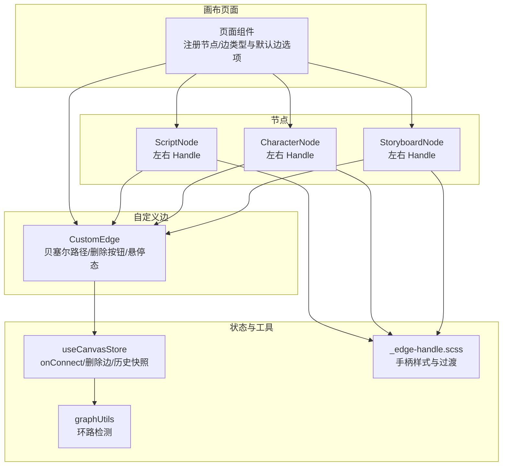
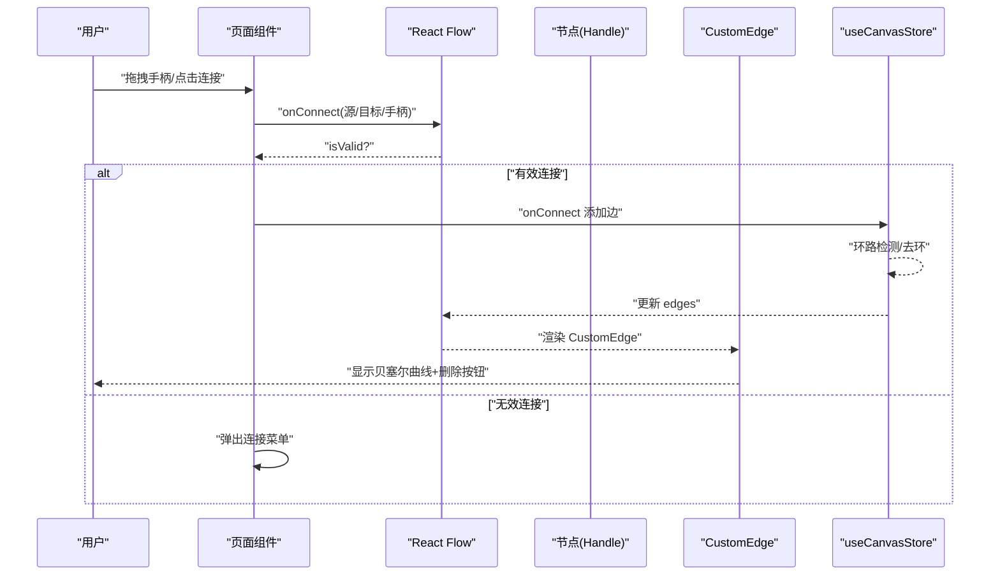
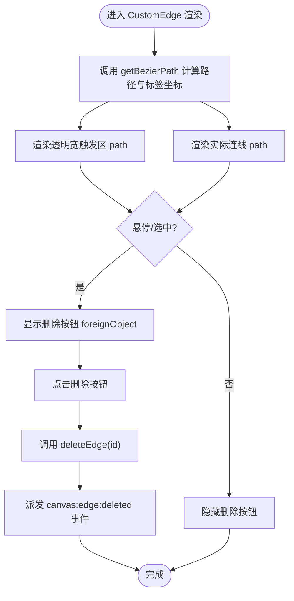
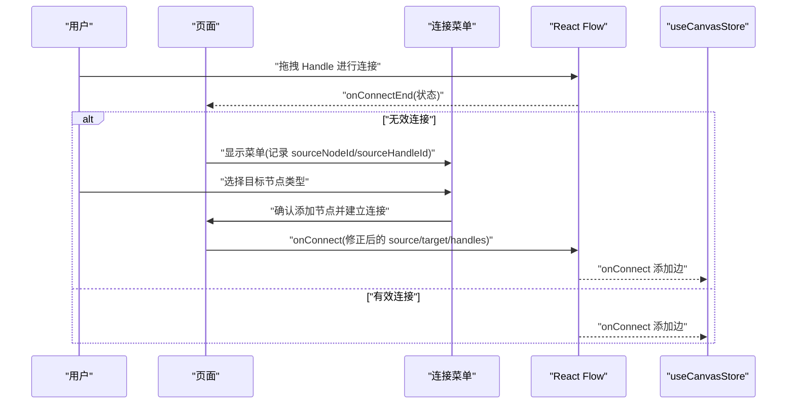
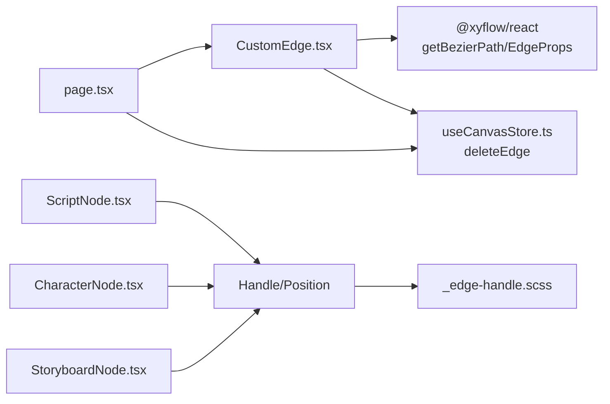

# 边连接系统

<cite>
**本文引用的文件**
- [CustomEdge.tsx](file://frontend/src/components/canvas/CustomEdge.tsx)
- [CustomEdge.test.tsx](file://frontend/src/components/canvas/__tests__/CustomEdge.test.tsx)
- [useCanvasStore.ts](file://frontend/src/store/useCanvasStore.ts)
- [page.tsx](file://frontend/src/app/theater/[id]/page.tsx)
- [_edge-handle.scss](file://frontend/src/components/canvas/_edge-handle.scss)
- [ScriptNode.tsx](file://frontend/src/components/canvas/ScriptNode.tsx)
- [CharacterNode.tsx](file://frontend/src/components/canvas/CharacterNode.tsx)
- [StoryboardNode.tsx](file://frontend/src/components/canvas/StoryboardNode.tsx)
- [graphUtils.ts](file://frontend/src/lib/graphUtils.ts)
</cite>

## 目录
1. [简介](#简介)
2. [项目结构](#项目结构)
3. [核心组件](#核心组件)
4. [架构总览](#架构总览)
5. [详细组件分析](#详细组件分析)
6. [依赖关系分析](#依赖关系分析)
7. [性能考量](#性能考量)
8. [故障排查指南](#故障排查指南)
9. [结论](#结论)
10. [附录](#附录)

## 简介
本文件系统性阐述“画布边连接系统”的实现与使用方法，重点围绕 CustomEdge 自定义边组件展开，覆盖以下方面：
- 边的绘制算法与路径计算（贝塞尔曲线）
- 样式配置与交互行为（悬停高亮、删除按钮、选中态）
- 起点/终点处理、曲线路径生成、箭头样式与标签显示
- 事件处理、拖拽调整、动态更新与视觉反馈
- 边连接的配置选项、自定义样式与扩展开发指南
- 实际应用示例与最佳实践

## 项目结构
画布边连接系统主要由以下部分组成：
- 自定义边组件：CustomEdge，负责绘制贝塞尔曲线、删除按钮与交互反馈
- 画布状态管理：useCanvasStore，负责节点/边的增删改查、连接校验与持久化
- 节点与手柄：各节点类型内置左右两侧的 Handle，作为连接的起止点
- 样式层：统一的边手柄样式与过渡动画
- 连接流程：页面级 onConnect 与连接菜单联动，确保正确的源/目标与手柄方向

图表来源
- [page.tsx:41-56](file://frontend/src/app/theater/[id]/page.tsx#L41-L56)
- [CustomEdge.tsx:1-100](file://frontend/src/components/canvas/CustomEdge.tsx#L1-L100)
- [useCanvasStore.ts:238-254](file://frontend/src/store/useCanvasStore.ts#L238-L254)
- [_edge-handle.scss:1-118](file://frontend/src/components/canvas/_edge-handle.scss#L1-L118)

章节来源
- [page.tsx:41-56](file://frontend/src/app/theater/[id]/page.tsx#L41-L56)
- [CustomEdge.tsx:1-100](file://frontend/src/components/canvas/CustomEdge.tsx#L1-L100)
- [_edge-handle.scss:1-118](file://frontend/src/components/canvas/_edge-handle.scss#L1-L118)

## 核心组件
- CustomEdge：基于 @xyflow/react 的 getBezierPath 计算贝塞尔曲线路径，渲染透明宽触发区、实际连线与删除按钮，并根据选中/悬停状态切换颜色与粗细。
- useCanvasStore：提供 onConnect、deleteEdge 等动作；在连接前进行自环与环路检测；删除边后派发自定义事件供外部监听。
- 节点 Handle：ScriptNode、CharacterNode、StoryboardNode 在左右两侧分别提供 target/source 两种 Handle，配合连接菜单实现方向一致的连接。
- 样式层：统一的 edge-handle 包装器、线条与圆点样式，以及悬停显示逻辑。

章节来源
- [CustomEdge.tsx:1-100](file://frontend/src/components/canvas/CustomEdge.tsx#L1-L100)
- [useCanvasStore.ts:238-288](file://frontend/src/store/useCanvasStore.ts#L238-L288)
- [ScriptNode.tsx:227-245](file://frontend/src/components/canvas/ScriptNode.tsx#L227-L245)
- [CharacterNode.tsx:512-521](file://frontend/src/components/canvas/CharacterNode.tsx#L512-L521)
- [StoryboardNode.tsx:180-199](file://frontend/src/components/canvas/StoryboardNode.tsx#L180-L199)
- [_edge-handle.scss:1-118](file://frontend/src/components/canvas/_edge-handle.scss#L1-L118)

## 架构总览
下图展示从用户发起连接到边渲染与状态更新的端到端流程：

图表来源
- [page.tsx:150-187](file://frontend/src/app/theater/[id]/page.tsx#L150-L187)
- [useCanvasStore.ts:238-254](file://frontend/src/store/useCanvasStore.ts#L238-L254)
- [CustomEdge.tsx:1-100](file://frontend/src/components/canvas/CustomEdge.tsx#L1-L100)

## 详细组件分析

### CustomEdge 组件
- 路径计算：调用 getBezierPath(sourceX/Y, sourcePosition, targetX/Y, targetPosition) 返回贝塞尔路径与标签坐标，用于删除按钮定位。
- 可见性与交互：
  - 透明宽触发区 path 提升悬停命中面积，提升交互体验
  - 实际连线 path 根据 selected/isHovered 切换颜色与线宽
  - 删除按钮采用 foreignObject 直接嵌入 SVG，居中于标签坐标，支持鼠标与触摸事件
- 事件处理：onMouseEnter/onMouseLeave 控制按钮显隐；点击删除按钮通过 useCanvasStore.deleteEdge 移除边并派发自定义事件

图表来源
- [CustomEdge.tsx:17-99](file://frontend/src/components/canvas/CustomEdge.tsx#L17-L99)
- [useCanvasStore.ts:276-288](file://frontend/src/store/useCanvasStore.ts#L276-L288)

章节来源
- [CustomEdge.tsx:1-100](file://frontend/src/components/canvas/CustomEdge.tsx#L1-L100)
- [CustomEdge.test.tsx:53-109](file://frontend/src/components/canvas/__tests__/CustomEdge.test.tsx#L53-L109)
- [useCanvasStore.ts:276-288](file://frontend/src/store/useCanvasStore.ts#L276-L288)

### 起点/终点与手柄方向
- 节点在左右两侧提供 Handle：target 与 source，形成“左-右”或“右-左”的连接组合
- 页面 onConnectEnd 在非有效连接时弹出连接菜单，菜单记录 sourceNodeId/sourceHandleId，随后根据手柄方向映射正确的 source/target 与 sourceHandle/targetHandle

图表来源
- [page.tsx:150-187](file://frontend/src/app/theater/[id]/page.tsx#L150-L187)
- [page.tsx:228-261](file://frontend/src/app/theater/[id]/page.tsx#L228-L261)
- [ScriptNode.tsx:227-245](file://frontend/src/components/canvas/ScriptNode.tsx#L227-L245)
- [CharacterNode.tsx:512-521](file://frontend/src/components/canvas/CharacterNode.tsx#L512-L521)
- [StoryboardNode.tsx:180-199](file://frontend/src/components/canvas/StoryboardNode.tsx#L180-L199)

章节来源
- [page.tsx:228-261](file://frontend/src/app/theater/[id]/page.tsx#L228-L261)
- [ScriptNode.tsx:227-245](file://frontend/src/components/canvas/ScriptNode.tsx#L227-L245)
- [CharacterNode.tsx:512-521](file://frontend/src/components/canvas/CharacterNode.tsx#L512-L521)
- [StoryboardNode.tsx:180-199](file://frontend/src/components/canvas/StoryboardNode.tsx#L180-L199)

### 样式与标签
- 样式配置：页面默认边选项 defaultEdgeOptions 设置 type='custom'、animated=true、style={ stroke, strokeWidth }，CustomEdge 会读取 style 并在 hover/selected 时切换颜色与线宽
- 标签显示：getBezierPath 返回的 labelX/labelY 用于定位删除按钮；若需要额外标签，可结合 EdgeLabelRenderer 使用（测试中已模拟）

章节来源
- [page.tsx:52-56](file://frontend/src/app/theater/[id]/page.tsx#L52-L56)
- [CustomEdge.tsx:17-24](file://frontend/src/components/canvas/CustomEdge.tsx#L17-L24)
- [CustomEdge.test.tsx:13-18](file://frontend/src/components/canvas/__tests__/CustomEdge.test.tsx#L13-L18)

### 事件处理与动态更新
- 删除事件：CustomEdge 点击删除按钮 -> useCanvasStore.deleteEdge -> 触发 takeSnapshot -> 派发 canvas:edge:deleted 事件
- 连接事件：useCanvasStore.onConnect -> addEdge -> set edges -> takeSnapshot -> 标记 isDirty
- 环路检测：连接前调用 hasCycle，避免新增边导致循环

章节来源
- [CustomEdge.tsx:29-32](file://frontend/src/components/canvas/CustomEdge.tsx#L29-L32)
- [useCanvasStore.ts:276-288](file://frontend/src/store/useCanvasStore.ts#L276-L288)
- [useCanvasStore.ts:238-254](file://frontend/src/store/useCanvasStore.ts#L238-L254)
- [graphUtils.ts:4-38](file://frontend/src/lib/graphUtils.ts#L4-L38)

## 依赖关系分析
- CustomEdge 依赖 @xyflow/react 的 getBezierPath 与 EdgeProps 类型
- CustomEdge 依赖 useCanvasStore 的 deleteEdge 动作
- 页面组件注册 edgeTypes.custom 与 defaultEdgeOptions，并在 onConnectEnd 中处理无效连接场景
- 节点组件提供 Handle，配合样式层统一的手柄外观与悬停效果

图表来源
- [CustomEdge.tsx:1-3](file://frontend/src/components/canvas/CustomEdge.tsx#L1-L3)
- [useCanvasStore.ts:276-288](file://frontend/src/store/useCanvasStore.ts#L276-L288)
- [page.tsx:48-56](file://frontend/src/app/theater/[id]/page.tsx#L48-L56)
- [ScriptNode.tsx:227-245](file://frontend/src/components/canvas/ScriptNode.tsx#L227-L245)
- [CharacterNode.tsx:512-521](file://frontend/src/components/canvas/CharacterNode.tsx#L512-L521)
- [StoryboardNode.tsx:180-199](file://frontend/src/components/canvas/StoryboardNode.tsx#L180-L199)
- [_edge-handle.scss:1-118](file://frontend/src/components/canvas/_edge-handle.scss#L1-L118)

章节来源
- [CustomEdge.tsx:1-3](file://frontend/src/components/canvas/CustomEdge.tsx#L1-L3)
- [useCanvasStore.ts:276-288](file://frontend/src/store/useCanvasStore.ts#L276-L288)
- [page.tsx:48-56](file://frontend/src/app/theater/[id]/page.tsx#L48-L56)
- [_edge-handle.scss:1-118](file://frontend/src/components/canvas/_edge-handle.scss#L1-L118)

## 性能考量
- 贝塞尔路径计算：getBezierPath 为纯函数，复杂度与节点数量无关；建议保持合理的节点密度，避免过多曲线重叠导致渲染压力
- 事件绑定：透明宽触发区仅用于提升命中面积，不参与绘制；删除按钮使用 pointerEvents 控制，减少不必要的事件开销
- 连接校验：环路检测使用邻接表 + DFS，时间复杂度 O(V+E)，在大型图中仍具备良好性能
- 状态更新：useCanvasStore 对 edges 变更进行批量处理并按需 takeSnapshot，避免频繁重绘

## 故障排查指南
- 删除按钮不显示
  - 检查 CustomEdge 是否处于 selected 或 isHovered 状态
  - 确认鼠标事件是否被上层元素拦截
- 连接无效
  - 确认 source/target 与 sourceHandle/targetHandle 方向匹配
  - 检查是否有自环或环路，环路检测会阻止连接
- 删除后无响应
  - 确认 deleteEdge 是否被调用，以及是否正确派发 canvas:edge:deleted 事件
- 手柄不可见或无法拖拽
  - 检查节点 Handle 的位置与样式，确保 edge-handle 包装器与内部 .react-flow__handle 正确显示

章节来源
- [CustomEdge.tsx:34-40](file://frontend/src/components/canvas/CustomEdge.tsx#L34-L40)
- [useCanvasStore.ts:244-248](file://frontend/src/store/useCanvasStore.ts#L244-L248)
- [useCanvasStore.ts:276-288](file://frontend/src/store/useCanvasStore.ts#L276-L288)
- [_edge-handle.scss:86-117](file://frontend/src/components/canvas/_edge-handle.scss#L86-L117)

## 结论
CustomEdge 通过简洁而高效的贝塞尔曲线路径与直观的交互反馈，实现了稳定可靠的画布边连接体验。结合 useCanvasStore 的连接校验与状态管理，以及节点 Handle 的统一设计，系统在易用性与可扩展性之间取得良好平衡。建议在复杂场景中进一步封装标签渲染与样式主题，以满足更多业务需求。

## 附录

### 配置选项与自定义样式
- 默认边选项
  - type: 'custom'
  - animated: true
  - style: stroke、strokeWidth
- 自定义样式
  - 通过 style 参数传递颜色与线宽
  - hover/selected 状态自动切换颜色与线宽
- 标签与箭头
  - 可通过 markerEnd 传入箭头样式
  - 如需额外标签，可结合 EdgeLabelRenderer 使用

章节来源
- [page.tsx:52-56](file://frontend/src/app/theater/[id]/page.tsx#L52-L56)
- [CustomEdge.tsx:13-16](file://frontend/src/components/canvas/CustomEdge.tsx#L13-L16)
- [CustomEdge.tsx:69-70](file://frontend/src/components/canvas/CustomEdge.tsx#L69-L70)

### 扩展开发指南
- 新增边类型
  - 复制 CustomEdge 的结构，替换路径计算或渲染策略
  - 在 edgeTypes 中注册新类型并在 defaultEdgeOptions 中设置默认样式
- 自定义标签
  - 在 CustomEdge 中引入 EdgeLabelRenderer，使用 labelX/labelY 定位
- 自定义交互
  - 在 CustomEdge 中扩展事件处理器，如双击编辑、右键菜单等
- 主题适配
  - 通过全局样式变量或主题上下文控制 stroke、activeColor 等颜色

章节来源
- [page.tsx:48-56](file://frontend/src/app/theater/[id]/page.tsx#L48-L56)
- [CustomEdge.tsx:17-24](file://frontend/src/components/canvas/CustomEdge.tsx#L17-L24)

### 实际应用示例与最佳实践
- 示例：从连接菜单添加节点并建立连接
  - 记录 sourceNodeId/sourceHandleId
  - 根据手柄方向映射 source/target 与 sourceHandle/targetHandle
  - 调用 onConnect 完成连接
- 最佳实践
  - 保持 Handle 方向一致性，避免混乱
  - 合理设置默认边样式，突出关键流程
  - 使用环路检测防止逻辑错误
  - 为删除按钮提供明确的视觉反馈与无障碍提示

章节来源
- [page.tsx:228-261](file://frontend/src/app/theater/[id]/page.tsx#L228-L261)
- [useCanvasStore.ts:244-248](file://frontend/src/store/useCanvasStore.ts#L244-L248)
- [CustomEdge.test.tsx:53-109](file://frontend/src/components/canvas/__tests__/CustomEdge.test.tsx#L53-L109)