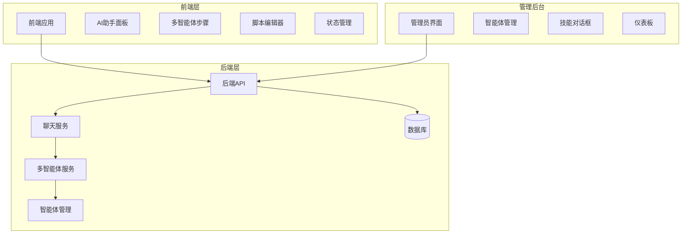
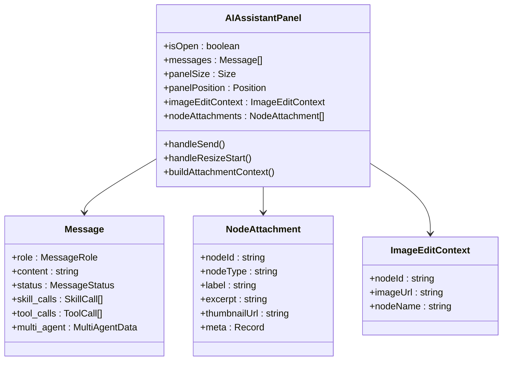
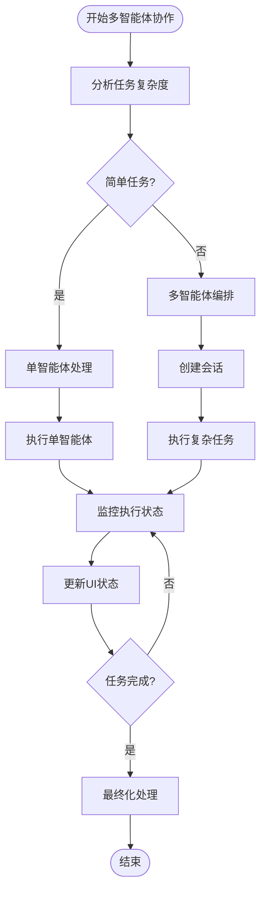
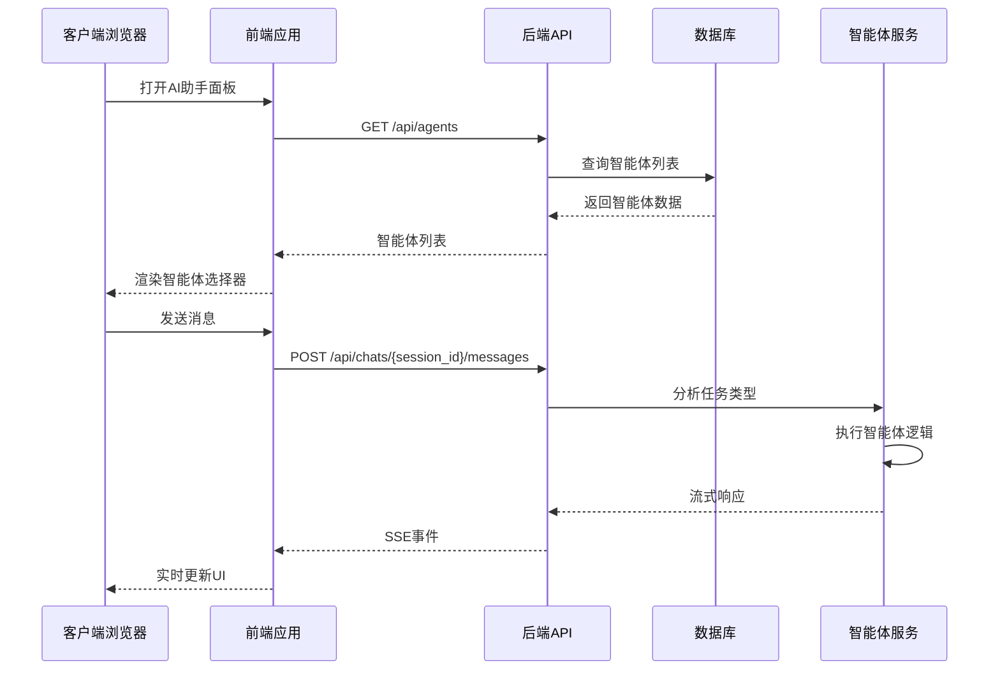
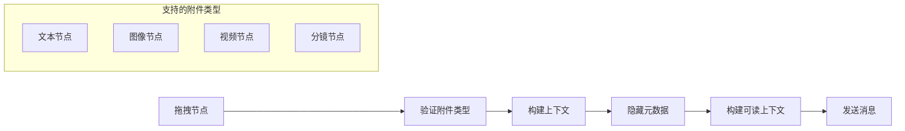
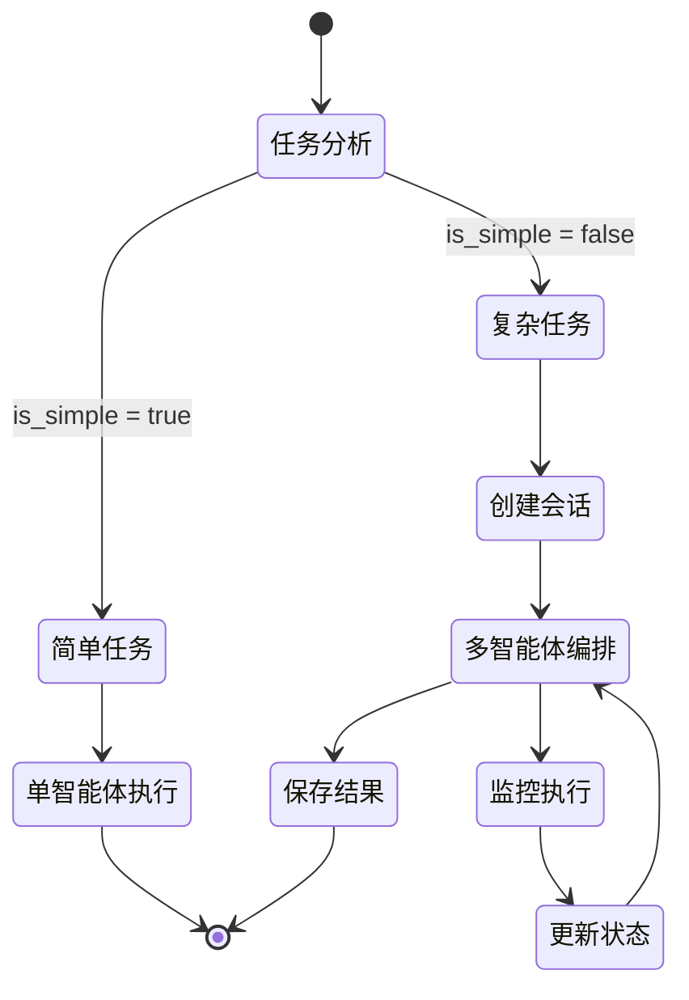
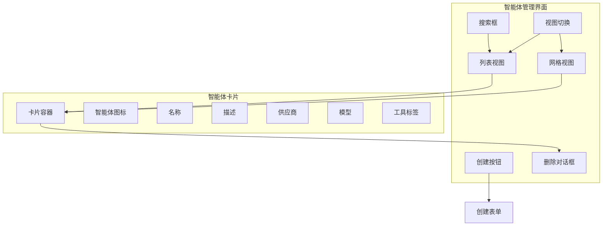
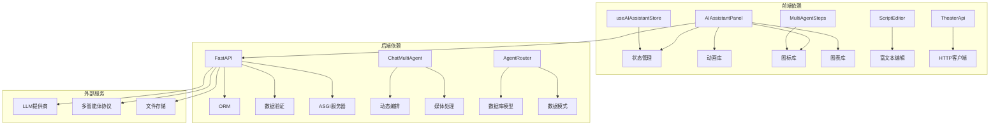

# 计划面板设计指南

<cite>
**本文档引用的文件**
- [AIAssistantPanel.tsx](file://frontend/src/components/canvas/AIAssistantPanel.tsx)
- [useAIAssistantStore.ts](file://frontend/src/store/useAIAssistantStore.ts)
- [MultiAgentSteps.tsx](file://frontend/src/components/canvas/MultiAgentSteps.tsx)
- [ScriptEditor.tsx](file://frontend/src/components/canvas/ScriptEditor.tsx)
- [theaterApi.ts](file://frontend/src/lib/theaterApi.ts)
- [chat_multi_agent.py](file://backend/services/chat_multi_agent.py)
- [agents.py](file://backend/routers/agents.py)
- [main.py](file://backend/main.py)
- [AdminDashboard.tsx](file://backend/admin/src/app/admin/page.tsx)
- [AgentsPage.tsx](file://backend/admin/src/app/admin/agents/page.tsx)
- [SkillDialog.tsx](file://backend/admin/src/app/admin/skills/SkillDialog.tsx)
</cite>

## 目录
1. [简介](#简介)
2. [项目结构](#项目结构)
3. [核心组件](#核心组件)
4. [架构概览](#架构概览)
5. [详细组件分析](#详细组件分析)
6. [依赖关系分析](#依赖关系分析)
7. [性能考虑](#性能考虑)
8. [故障排除指南](#故障排除指南)
9. [结论](#结论)

## 简介

计划面板是无限游戏项目中的核心交互组件，它为用户提供了一个可拖拽、可调整大小的AI助手面板，支持多智能体协作、节点附件、图像编辑等功能。该面板采用现代化的React技术栈构建，结合FastAPI后端服务，实现了完整的实时对话体验。

## 项目结构

该项目采用前后端分离的架构设计，主要分为以下层次：

**图表来源**
- [AIAssistantPanel.tsx:1-633](file://frontend/src/components/canvas/AIAssistantPanel.tsx#L1-L633)
- [chat_multi_agent.py:1-190](file://backend/services/chat_multi_agent.py#L1-L190)
- [main.py:110-180](file://backend/main.py#L110-L180)

**章节来源**
- [AIAssistantPanel.tsx:1-633](file://frontend/src/components/canvas/AIAssistantPanel.tsx#L1-L633)
- [main.py:110-180](file://backend/main.py#L110-L180)

## 核心组件

### AI助手面板组件

AI助手面板是整个计划面板的核心组件，提供了完整的AI交互体验：

**图表来源**
- [AIAssistantPanel.tsx:51-633](file://frontend/src/components/canvas/AIAssistantPanel.tsx#L51-L633)
- [useAIAssistantStore.ts:50-96](file://frontend/src/store/useAIAssistantStore.ts#L50-L96)

### 多智能体协作组件

多智能体协作组件展示了复杂的任务执行过程和结果：

**图表来源**
- [chat_multi_agent.py:22-190](file://backend/services/chat_multi_agent.py#L22-L190)
- [MultiAgentSteps.tsx:28-128](file://frontend/src/components/canvas/MultiAgentSteps.tsx#L28-L128)

**章节来源**
- [AIAssistantPanel.tsx:208-317](file://frontend/src/components/canvas/AIAssistantPanel.tsx#L208-L317)
- [MultiAgentSteps.tsx:28-128](file://frontend/src/components/canvas/MultiAgentSteps.tsx#L28-L128)

## 架构概览

系统采用客户端-服务器架构，前端使用Next.js框架，后端使用FastAPI：

**图表来源**
- [AIAssistantPanel.tsx:242-317](file://frontend/src/components/canvas/AIAssistantPanel.tsx#L242-L317)
- [chat_multi_agent.py:22-61](file://backend/services/chat_multi_agent.py#L22-L61)

## 详细组件分析

### AI助手面板实现

AI助手面板是一个高度复杂的组件，集成了多种功能特性：

#### 面板状态管理

面板使用Zustand状态管理库来维护复杂的状态：

| 状态类别 | 属性 | 类型 | 描述 |
|---------|------|------|------|
| 面板状态 | isOpen | boolean | 面板是否显示 |
| 面板尺寸 | panelSize | {width, height} | 面板宽高 |
| 面板位置 | panelPosition | {x, y} | 面板坐标 |
| 会话状态 | sessionId, agentId | string | 当前会话信息 |
| 消息状态 | messages | Message[] | 对话消息列表 |

#### 附件处理机制

面板支持多种类型的节点附件：

**图表来源**
- [AIAssistantPanel.tsx:36-49](file://frontend/src/components/canvas/AIAssistantPanel.tsx#L36-L49)

#### 多智能体协作流程

当处理复杂任务时，系统会自动路由到多智能体协作模式：

**图表来源**
- [chat_multi_agent.py:42-61](file://backend/services/chat_multi_agent.py#L42-L61)

**章节来源**
- [AIAssistantPanel.tsx:51-633](file://frontend/src/components/canvas/AIAssistantPanel.tsx#L51-L633)
- [useAIAssistantStore.ts:123-448](file://frontend/src/store/useAIAssistantStore.ts#L123-L448)

### 管理后台组件

管理后台提供了完整的智能体管理和监控功能：

#### 智能体管理界面

管理员可以通过直观的界面管理所有智能体：

**图表来源**
- [AgentsPage.tsx:48-315](file://backend/admin/src/app/admin/agents/page.tsx#L48-L315)

#### 技能管理对话框

技能管理提供了完整的技能创建和编辑功能：

| 字段 | 类型 | 必填 | 描述 |
|------|------|------|------|
| name | string | 是 | 技能标识符 |
| description | string | 是 | 技能描述 |
| version | string | 否 | 版本号 |
| content | string | 是 | 技能内容 |
| auto_enable | boolean | 否 | 自动启用 |

**章节来源**
- [AgentsPage.tsx:48-315](file://backend/admin/src/app/admin/agents/page.tsx#L48-L315)
- [SkillDialog.tsx:44-235](file://backend/admin/src/app/admin/skills/SkillDialog.tsx#L44-L235)

### 脚本编辑器组件

脚本编辑器基于Tiptap构建，提供了丰富的文本编辑功能：

#### 编辑器扩展系统

| 扩展类型 | 功能 | 描述 |
|----------|------|------|
| 基础扩展 | StarterKit | 标题、列表、代码块等 |
| 格式化 | Underline, Highlight | 下划线、高亮 |
| 链接 | Link | 链接处理 |
| 图片 | Image | 图片插入 |
| 对齐 | TextAlign | 文本对齐 |
| 任务 | TaskList, TaskItem | 任务列表 |

**章节来源**
- [ScriptEditor.tsx:118-296](file://frontend/src/components/canvas/ScriptEditor.tsx#L118-L296)

## 依赖关系分析

系统各组件之间的依赖关系如下：

**图表来源**
- [main.py:41-45](file://backend/main.py#L41-L45)
- [agents.py:1-151](file://backend/routers/agents.py#L1-L151)

**章节来源**
- [main.py:110-180](file://backend/main.py#L110-L180)
- [agents.py:1-151](file://backend/routers/agents.py#L1-L151)

## 性能考虑

### 前端性能优化

1. **虚拟滚动优化**
   - 使用虚拟滚动列表处理大量消息
   - 可配置的overscan数量减少重绘
   - 智能的滚动行为控制

2. **状态持久化**
   - 使用localStorage持久化面板状态
   - 智能的会话缓存机制
   - 防止重复渲染的优化策略

3. **资源管理**
   - 及时释放图片预览URL
   - 控制并发请求数量
   - 优化DOM节点数量

### 后端性能优化

1. **数据库优化**
   - 异步数据库连接池
   - 合理的索引设计
   - 查询结果缓存

2. **内存管理**
   - 任务队列管理
   - 连接超时控制
   - 内存泄漏防护

3. **网络优化**
   - SSE流式传输
   - 压缩响应数据
   - CDN静态资源

## 故障排除指南

### 常见问题及解决方案

#### 面板无法显示

**症状**: AI助手面板不显示或显示异常

**可能原因**:
1. WebSocket连接失败
2. 状态管理异常
3. 权限验证失败

**解决步骤**:
1. 检查网络连接和防火墙设置
2. 查看浏览器控制台错误信息
3. 验证用户认证状态
4. 检查后端服务日志

#### 消息发送失败

**症状**: 发送消息后无响应或报错

**可能原因**:
1. API接口不可用
2. 会话状态异常
3. 网络超时

**解决步骤**:
1. 检查API服务状态
2. 验证会话ID有效性
3. 查看SSE连接状态
4. 检查代理配置

#### 多智能体协作异常

**症状**: 多智能体任务执行失败或卡住

**可能原因**:
1. 智能体配置错误
2. 资源限制
3. 依赖服务不可用

**解决步骤**:
1. 检查智能体可用性
2. 查看任务执行日志
3. 验证资源配额
4. 检查依赖服务状态

**章节来源**
- [AIAssistantPanel.tsx:208-317](file://frontend/src/components/canvas/AIAssistantPanel.tsx#L208-L317)
- [chat_multi_agent.py:85-190](file://backend/services/chat_multi_agent.py#L85-L190)

## 结论

计划面板设计指南详细介绍了无限游戏项目中AI助手面板的设计理念、实现方案和最佳实践。通过模块化的组件设计、完善的错误处理机制和性能优化策略，该系统为用户提供了流畅、可靠的AI交互体验。

关键设计要点包括：
- **模块化架构**: 清晰的组件分离和职责划分
- **状态管理**: 基于Zustand的高效状态管理
- **实时通信**: 基于SSE的流式数据传输
- **性能优化**: 虚拟滚动、状态持久化等优化策略
- **错误处理**: 完善的异常捕获和用户反馈机制

该设计为类似项目的开发提供了宝贵的参考和指导。