# 资源管理组件

<cite>
**本文引用的文件**
- [frontend/src/components/resources/AssetCard.tsx](file://frontend/src/components/resources/AssetCard.tsx)
- [frontend/src/components/resources/AssetEditDialog.tsx](file://frontend/src/components/resources/AssetEditDialog.tsx)
- [frontend/src/components/resources/AssetDeleteDialog.tsx](file://frontend/src/components/resources/AssetDeleteDialog.tsx)
- [frontend/src/components/resources/AssetPreviewDialog.tsx](file://frontend/src/components/resources/AssetPreviewDialog.tsx)
- [frontend/src/components/resources/UploadZone.tsx](file://frontend/src/components/resources/UploadZone.tsx)
- [frontend/src/app/resources/page.tsx](file://frontend/src/app/resources/page.tsx)
- [frontend/src/lib/resourceApi.ts](file://frontend/src/lib/resourceApi.ts)
- [frontend/src/store/useResourceStore.ts](file://frontend/src/store/useResourceStore.ts)
- [frontend/src/components/ui/dialog.tsx](file://frontend/src/components/ui/dialog.tsx)
- [frontend/src/components/ui/dropdown-menu.tsx](file://frontend/src/components/ui/dropdown-menu.tsx)
- [backend/routers/media.py](file://backend/routers/media.py)
- [backend/services/media_utils.py](file://backend/services/media_utils.py)
- [frontend/src/context/AuthContext.tsx](file://frontend/src/context/AuthContext.tsx)
- [backend/auth.py](file://backend/auth.py)
</cite>

## 目录
1. [简介](#简介)
2. [项目结构](#项目结构)
3. [核心组件](#核心组件)
4. [架构总览](#架构总览)
5. [组件详解](#组件详解)
6. [依赖关系分析](#依赖关系分析)
7. [性能与可用性](#性能与可用性)
8. [故障排查指南](#故障排查指南)
9. [结论](#结论)
10. [附录](#附录)

## 简介
本文件面向KunFlix的“资源管理组件”，系统性梳理前端资源页面与后端媒体服务的协作方式，覆盖以下关键能力：
- 媒体资产卡片展示与操作（预览、重命名、替换、删除）
- 上传区域的拖拽上传、文件类型与大小限制、进度反馈
- 资源API封装、状态管理与本地存储策略
- 文件类型支持、大小限制、预览生成与批量操作思路
- 资源分类、搜索过滤、权限控制与共享机制的实现要点
- 实际使用示例与性能优化建议

## 项目结构
资源管理相关模块主要分布在前端与后端两侧：
- 前端负责UI交互、状态管理与API调用
- 后端提供媒体上传、资源列表、更新与删除等REST接口，并负责文件落地与鉴权

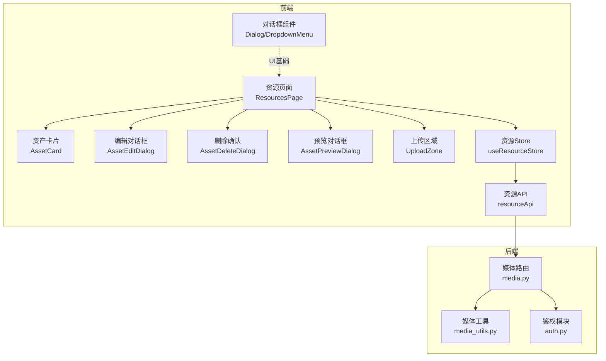

图表来源
- [frontend/src/app/resources/page.tsx:33-189](file://frontend/src/app/resources/page.tsx#L33-L189)
- [frontend/src/store/useResourceStore.ts:51-182](file://frontend/src/store/useResourceStore.ts#L51-L182)
- [frontend/src/lib/resourceApi.ts:40-109](file://frontend/src/lib/resourceApi.ts#L40-L109)
- [backend/routers/media.py:30-444](file://backend/routers/media.py#L30-L444)
- [backend/services/media_utils.py:1-79](file://backend/services/media_utils.py#L1-L79)
- [frontend/src/components/ui/dialog.tsx:1-121](file://frontend/src/components/ui/dialog.tsx#L1-L121)
- [frontend/src/components/ui/dropdown-menu.tsx:1-201](file://frontend/src/components/ui/dropdown-menu.tsx#L1-L201)

章节来源
- [frontend/src/app/resources/page.tsx:33-189](file://frontend/src/app/resources/page.tsx#L33-L189)
- [backend/routers/media.py:30-444](file://backend/routers/media.py#L30-L444)

## 核心组件
- 资产卡片 AssetCard：展示缩略预览、文件信息与操作菜单
- 编辑对话框 AssetEditDialog：支持重命名与替换文件
- 删除确认 AssetDeleteDialog：二次确认删除
- 预览对话框 AssetPreviewDialog：全屏预览与下载
- 上传区域 UploadZone：拖拽/点击上传、类型与大小限制、进度队列
- 资源Store useResourceStore：资源列表、分页、过滤、上传队列与CRUD动作
- 资源API resourceApi：封装XHR上传、进度回调、资源列表与更新删除

章节来源
- [frontend/src/components/resources/AssetCard.tsx:75-132](file://frontend/src/components/resources/AssetCard.tsx#L75-L132)
- [frontend/src/components/resources/AssetEditDialog.tsx:16-98](file://frontend/src/components/resources/AssetEditDialog.tsx#L16-L98)
- [frontend/src/components/resources/AssetDeleteDialog.tsx:16-72](file://frontend/src/components/resources/AssetDeleteDialog.tsx#L16-L72)
- [frontend/src/components/resources/AssetPreviewDialog.tsx:64-102](file://frontend/src/components/resources/AssetPreviewDialog.tsx#L64-L102)
- [frontend/src/components/resources/UploadZone.tsx:33-129](file://frontend/src/components/resources/UploadZone.tsx#L33-L129)
- [frontend/src/store/useResourceStore.ts:18-43](file://frontend/src/store/useResourceStore.ts#L18-L43)
- [frontend/src/lib/resourceApi.ts:40-109](file://frontend/src/lib/resourceApi.ts#L40-L109)

## 架构总览
前端通过资源Store与资源API与后端媒体路由交互；上传流程采用XMLHttpRequest并附带JWT令牌；后端对文件类型、大小进行严格校验，并将文件落盘与数据库记录关联。

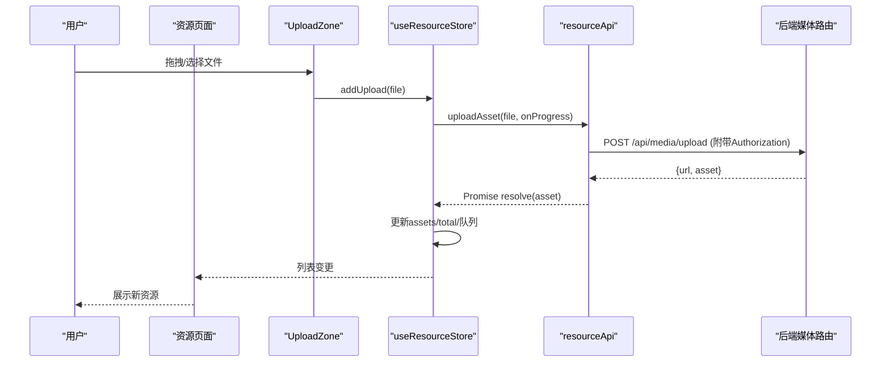

图表来源
- [frontend/src/components/resources/UploadZone.tsx:103-131](file://frontend/src/components/resources/UploadZone.tsx#L103-L131)
- [frontend/src/store/useResourceStore.ts:103-131](file://frontend/src/store/useResourceStore.ts#L103-L131)
- [frontend/src/lib/resourceApi.ts:54-87](file://frontend/src/lib/resourceApi.ts#L54-L87)
- [backend/routers/media.py:95-149](file://backend/routers/media.py#L95-L149)

## 组件详解

### 资产卡片 AssetCard
- 功能要点
  - 根据file_type选择图标与预览渲染器（图片/视频/音频/默认）
  - 鼠标悬停显示操作菜单（重命名、替换、删除）
  - 底部显示文件名与大小
- 性能与体验
  - 图片懒加载、视频仅预览首帧、音频内嵌播放控件
  - 使用组件映射表避免分支判断，提升渲染效率

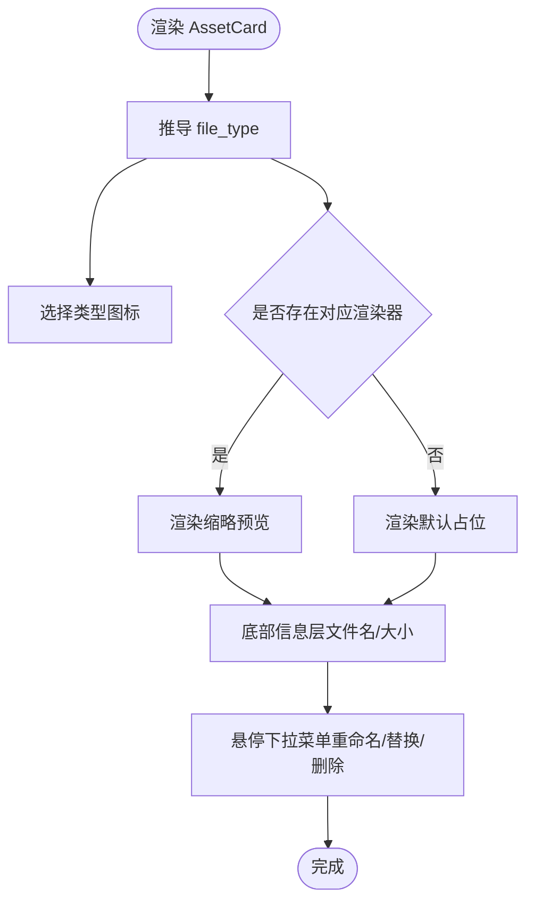

图表来源
- [frontend/src/components/resources/AssetCard.tsx:11-70](file://frontend/src/components/resources/AssetCard.tsx#L11-L70)
- [frontend/src/components/resources/AssetCard.tsx:83-132](file://frontend/src/components/resources/AssetCard.tsx#L83-L132)

章节来源
- [frontend/src/components/resources/AssetCard.tsx:75-132](file://frontend/src/components/resources/AssetCard.tsx#L75-L132)

### 编辑对话框 AssetEditDialog
- 功能要点
  - 重命名：输入框 + 提交按钮，禁用条件为名称为空
  - 替换文件：文件选择器，限制图片/视频/音频，禁用条件为未选择文件
  - 调用资源Store执行renameAsset或replaceAssetFile
- 交互细节
  - 对话框标题与描述随mode切换
  - 提交时loading态与错误日志

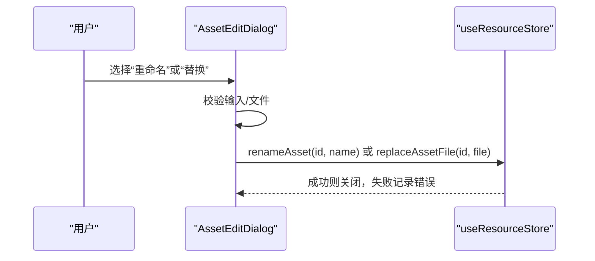

图表来源
- [frontend/src/components/resources/AssetEditDialog.tsx:16-42](file://frontend/src/components/resources/AssetEditDialog.tsx#L16-L42)
- [frontend/src/store/useResourceStore.ts:137-149](file://frontend/src/store/useResourceStore.ts#L137-L149)

章节来源
- [frontend/src/components/resources/AssetEditDialog.tsx:16-98](file://frontend/src/components/resources/AssetEditDialog.tsx#L16-L98)
- [frontend/src/store/useResourceStore.ts:37-39](file://frontend/src/store/useResourceStore.ts#L37-L39)

### 删除确认 AssetDeleteDialog
- 功能要点
  - 显示目标资源名称，强调不可恢复
  - 调用deleteAsset，成功后关闭对话框
- 错误处理
  - 捕获异常并记录日志

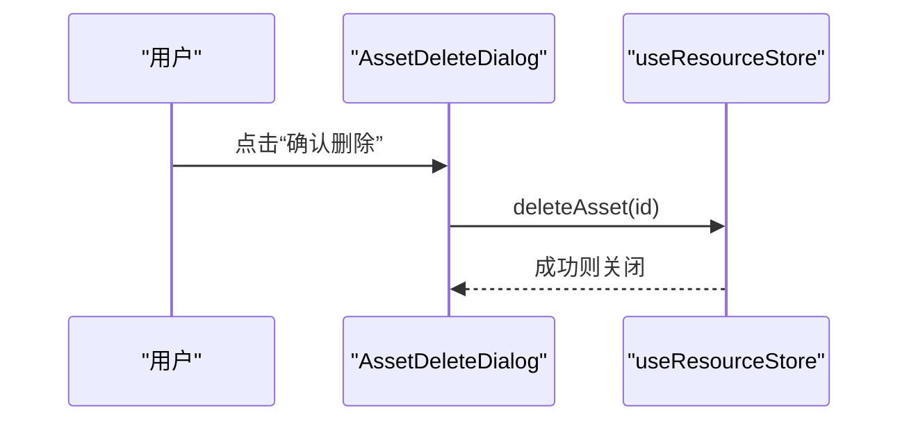

图表来源
- [frontend/src/components/resources/AssetDeleteDialog.tsx:16-32](file://frontend/src/components/resources/AssetDeleteDialog.tsx#L16-L32)
- [frontend/src/store/useResourceStore.ts:151-157](file://frontend/src/store/useResourceStore.ts#L151-L157)

章节来源
- [frontend/src/components/resources/AssetDeleteDialog.tsx:16-72](file://frontend/src/components/resources/AssetDeleteDialog.tsx#L16-L72)

### 预览对话框 AssetPreviewDialog
- 功能要点
  - 根据file_type选择全屏预览（图片/视频/音频）
  - 提供下载与关闭按钮
- 交互细节
  - 使用隐藏的DialogTitle语义化标签
  - 通过a标签download属性触发浏览器下载

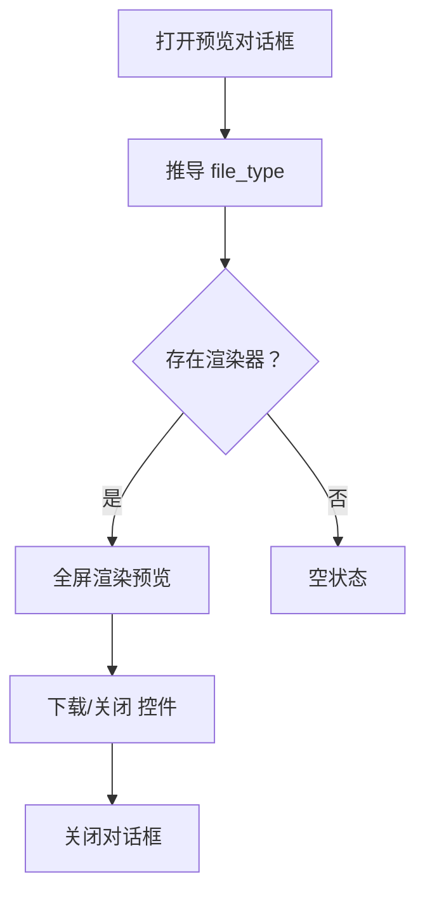

图表来源
- [frontend/src/components/resources/AssetPreviewDialog.tsx:64-102](file://frontend/src/components/resources/AssetPreviewDialog.tsx#L64-L102)

章节来源
- [frontend/src/components/resources/AssetPreviewDialog.tsx:64-102](file://frontend/src/components/resources/AssetPreviewDialog.tsx#L64-L102)

### 上传区域 UploadZone
- 功能要点
  - 支持拖拽进入与点击选择文件
  - 类型与大小限制（图片/视频/音频不同上限）
  - 上传队列展示与进度条、移除项
- 限制与提示
  - 超限文件以错误气泡提示并跳过
  - 通过MIME前缀推导类型，避免分支判断

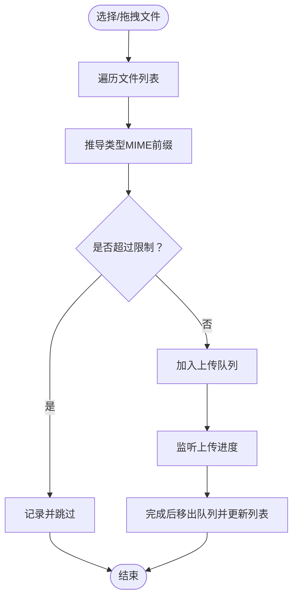

图表来源
- [frontend/src/components/resources/UploadZone.tsx:39-56](file://frontend/src/components/resources/UploadZone.tsx#L39-L56)
- [frontend/src/components/resources/UploadZone.tsx:108-125](file://frontend/src/components/resources/UploadZone.tsx#L108-L125)

章节来源
- [frontend/src/components/resources/UploadZone.tsx:33-129](file://frontend/src/components/resources/UploadZone.tsx#L33-L129)

### 资源页面 ResourcesPage
- 功能要点
  - 类型筛选（全部/图片/视频/音频）
  - 视图模式（网格/列表）
  - 无限滚动加载更多
  - 统一管理预览/编辑/删除对话框状态
- 生命周期
  - 首次加载fetchAssets
  - IntersectionObserver监听哨兵元素触发loadMore

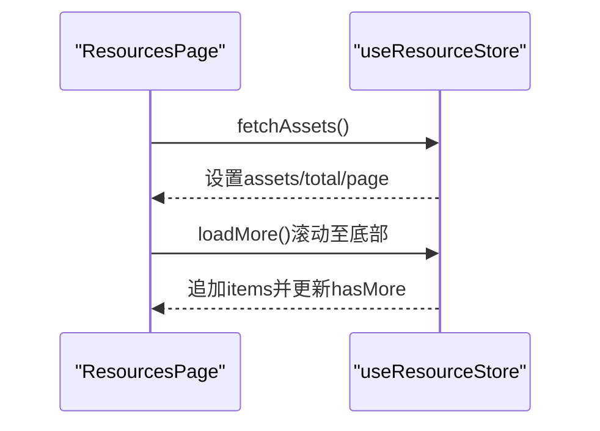

图表来源
- [frontend/src/app/resources/page.tsx:33-60](file://frontend/src/app/resources/page.tsx#L33-L60)
- [frontend/src/store/useResourceStore.ts:61-96](file://frontend/src/store/useResourceStore.ts#L61-L96)

章节来源
- [frontend/src/app/resources/page.tsx:33-189](file://frontend/src/app/resources/page.tsx#L33-L189)

### 资源API与状态管理
- 资源API resourceApi
  - listAssets：分页+类型筛选
  - uploadAsset：XHR上传，支持进度回调，附带Authorization头
  - updateAsset：重命名或替换文件
  - deleteAsset：硬删除
- 资源Store useResourceStore
  - 状态：assets、total、page、pageSize、typeFilter、isLoading、hasMore、uploadQueue
  - 动作：fetchAssets、loadMore、setTypeFilter、addUpload/removeUpload、renameAsset/replaceAssetFile/deleteAsset、syncAssetFromUpload、reset

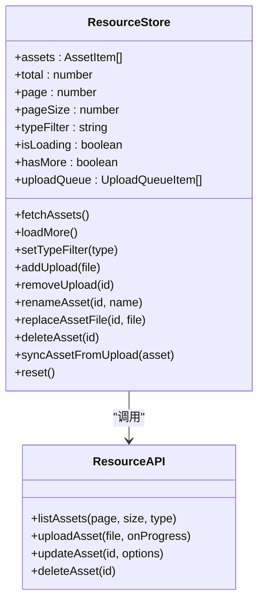

图表来源
- [frontend/src/store/useResourceStore.ts:18-43](file://frontend/src/store/useResourceStore.ts#L18-L43)
- [frontend/src/lib/resourceApi.ts:40-109](file://frontend/src/lib/resourceApi.ts#L40-L109)

章节来源
- [frontend/src/lib/resourceApi.ts:40-109](file://frontend/src/lib/resourceApi.ts#L40-L109)
- [frontend/src/store/useResourceStore.ts:51-182](file://frontend/src/store/useResourceStore.ts#L51-L182)

### 后端媒体服务
- 上传接口
  - 校验文件扩展名与MIME，按类型限制大小
  - 保存文件至本地目录，写入数据库记录，返回URL与资产信息
- 资源CRUD
  - listAssets：按用户与类型筛选，分页排序
  - updateAsset：重命名或替换文件（含旧文件清理）
  - deleteAsset：删除数据库记录与文件系统文件
- 静态文件服务
  - 通配符路由安全提供媒体文件，支持无扩展名回退

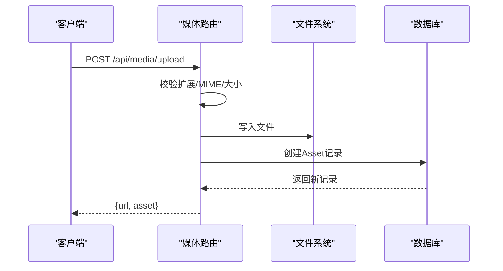

图表来源
- [backend/routers/media.py:95-149](file://backend/routers/media.py#L95-L149)
- [backend/routers/media.py:155-184](file://backend/routers/media.py#L155-L184)
- [backend/routers/media.py:187-240](file://backend/routers/media.py#L187-L240)
- [backend/routers/media.py:242-266](file://backend/routers/media.py#L242-L266)
- [backend/routers/media.py:272-299](file://backend/routers/media.py#L272-L299)

章节来源
- [backend/routers/media.py:30-444](file://backend/routers/media.py#L30-L444)

### 权限控制与鉴权
- 前端
  - AuthContext提供登录/登出、token刷新与受保护路由跳转
  - 资源API在上传时附带Authorization头
- 后端
  - get_current_active_user确保用户有效且启用
  - 媒体路由均需通过鉴权依赖，资源CRUD限定用户范围

章节来源
- [frontend/src/context/AuthContext.tsx:119-207](file://frontend/src/context/AuthContext.tsx#L119-L207)
- [frontend/src/lib/resourceApi.ts:63-67](file://frontend/src/lib/resourceApi.ts#L63-L67)
- [backend/auth.py:83-114](file://backend/auth.py#L83-L114)
- [backend/routers/media.py:96-100](file://backend/routers/media.py#L96-L100)

## 依赖关系分析
- 组件耦合
  - 资源页面聚合所有子组件并驱动Store
  - 对话框组件依赖通用UI组件（Dialog/DropdownMenu）
- 外部依赖
  - Store依赖Zustand；API依赖XMLHttpRequest与Axios（api.ts）
  - 后端依赖FastAPI、SQLAlchemy、bcrypt、jose（JWT）

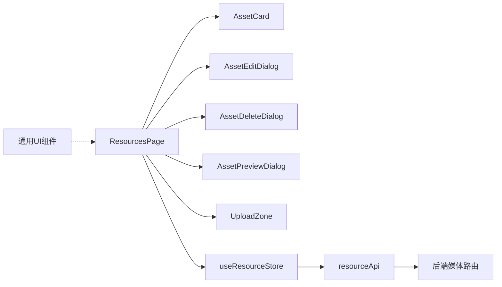

图表来源
- [frontend/src/app/resources/page.tsx:12-18](file://frontend/src/app/resources/page.tsx#L12-L18)
- [frontend/src/components/ui/dialog.tsx:1-121](file://frontend/src/components/ui/dialog.tsx#L1-L121)
- [frontend/src/components/ui/dropdown-menu.tsx:1-201](file://frontend/src/components/ui/dropdown-menu.tsx#L1-L201)

章节来源
- [frontend/src/app/resources/page.tsx:33-189](file://frontend/src/app/resources/page.tsx#L33-L189)
- [frontend/src/components/ui/dialog.tsx:1-121](file://frontend/src/components/ui/dialog.tsx#L1-L121)
- [frontend/src/components/ui/dropdown-menu.tsx:1-201](file://frontend/src/components/ui/dropdown-menu.tsx#L1-L201)

## 性能与可用性
- 渲染优化
  - 使用组件映射表替代分支判断，降低渲染成本
  - 图片懒加载、视频首帧预览、音频控件内嵌
- 上传体验
  - 上传队列与进度条即时反馈
  - 超限文件即时提示并跳过，避免阻塞
- 网络与缓存
  - 上传附带Authorization头，减少无效请求
  - 媒体文件提供Cache-Control头，利于CDN缓存
- 可靠性
  - Store中对上传错误状态与错误消息持久化，便于用户重试
  - 无限滚动结合哨兵元素，避免重复加载

[本节为通用指导，不直接分析具体文件]

## 故障排查指南
- 上传失败
  - 检查文件类型与大小限制（图片/视频/音频不同上限）
  - 查看前端错误气泡与控制台日志
  - 后端路由返回的HTTP状态与错误详情
- 401/403
  - 确认本地access_token存在且未过期
  - 若为401，尝试刷新token后重试
- 预览空白
  - 检查file_type与渲染器映射
  - 确认静态文件路由可访问且文件存在
- 删除后仍可见
  - 确认数据库记录与文件系统均已删除
  - 清除浏览器缓存或强制刷新

章节来源
- [frontend/src/components/resources/UploadZone.tsx:43-55](file://frontend/src/components/resources/UploadZone.tsx#L43-L55)
- [frontend/src/lib/resourceApi.ts:73-86](file://frontend/src/lib/resourceApi.ts#L73-L86)
- [backend/routers/media.py:117-123](file://backend/routers/media.py#L117-L123)
- [frontend/src/context/AuthContext.tsx:172-200](file://frontend/src/context/AuthContext.tsx#L172-L200)

## 结论
资源管理组件通过清晰的职责划分与状态管理，实现了从上传、展示到编辑/删除的完整闭环。前端采用映射表与惰性渲染提升性能，后端在类型与大小校验、文件落盘与鉴权方面提供了可靠保障。后续可在权限细化、批量操作与共享机制上进一步扩展。

[本节为总结性内容，不直接分析具体文件]

## 附录

### 文件类型支持与大小限制
- 支持扩展：jpg、png、webp、gif、mp4、webm、mov、mp3、wav
- 大小限制：图片50MB、视频500MB、音频100MB
- MIME前缀映射：image/、video/、audio/

章节来源
- [frontend/src/components/resources/UploadZone.tsx:15-22](file://frontend/src/components/resources/UploadZone.tsx#L15-L22)
- [backend/routers/media.py:32-38](file://backend/routers/media.py#L32-L38)

### 预览生成与静态服务
- 预览渲染器：图片、视频、音频分别渲染
- 静态文件服务：/api/media/{filename}，支持无扩展名回退

章节来源
- [frontend/src/components/resources/AssetCard.tsx:31-63](file://frontend/src/components/resources/AssetCard.tsx#L31-L63)
- [frontend/src/components/resources/AssetPreviewDialog.tsx:12-47](file://frontend/src/components/resources/AssetPreviewDialog.tsx#L12-L47)
- [backend/routers/media.py:272-299](file://backend/routers/media.py#L272-L299)

### 批量操作与共享机制（设计建议）
- 批量操作
  - 在前端Store中引入批量选择与队列处理，复用现有上传队列逻辑
  - 后端提供批量上传/更新端点，保持与单文件一致的鉴权与校验
- 共享机制
  - 新增共享字段与权限策略，后端路由增加共享读取与鉴权
  - 前端提供分享链接生成与权限设置入口

[本节为概念性建议，不直接分析具体文件]