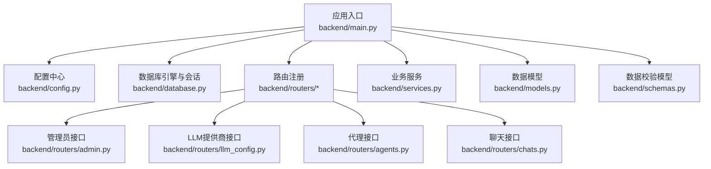
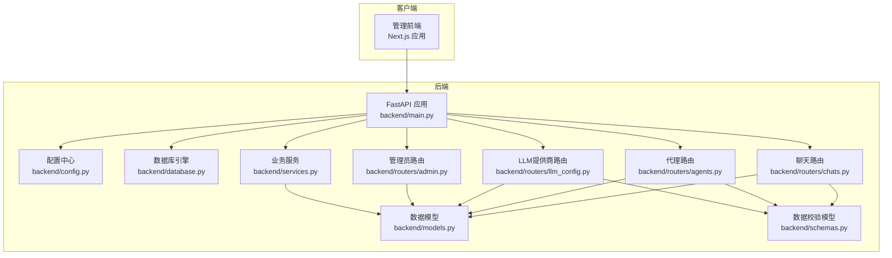
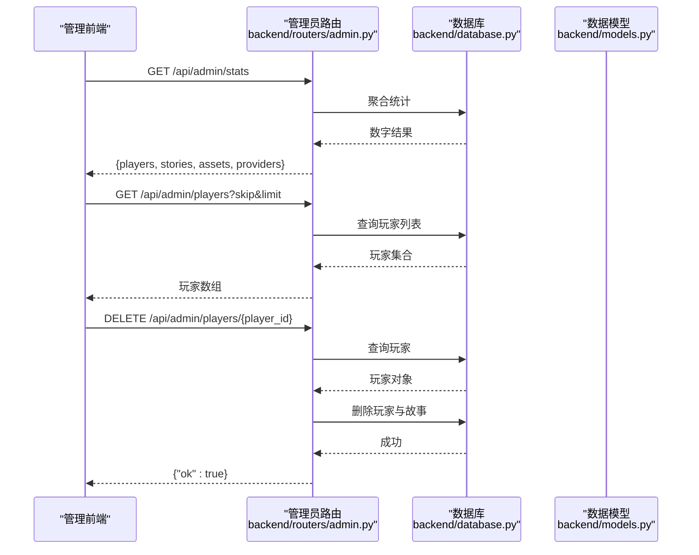
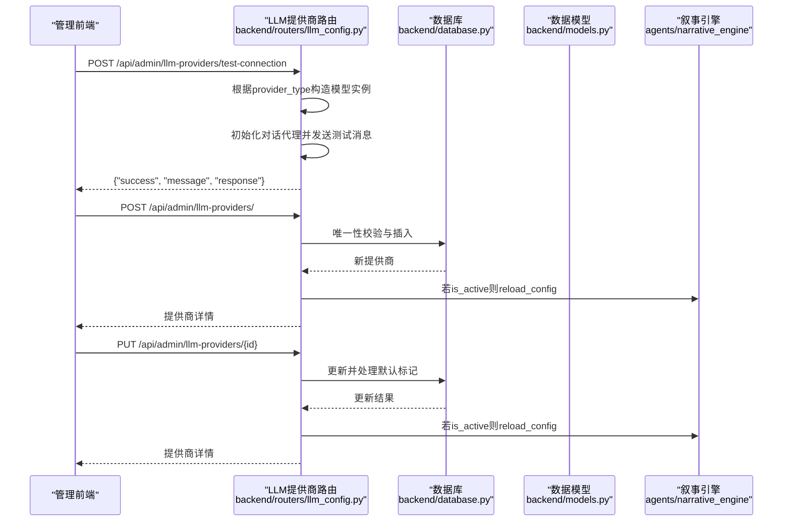
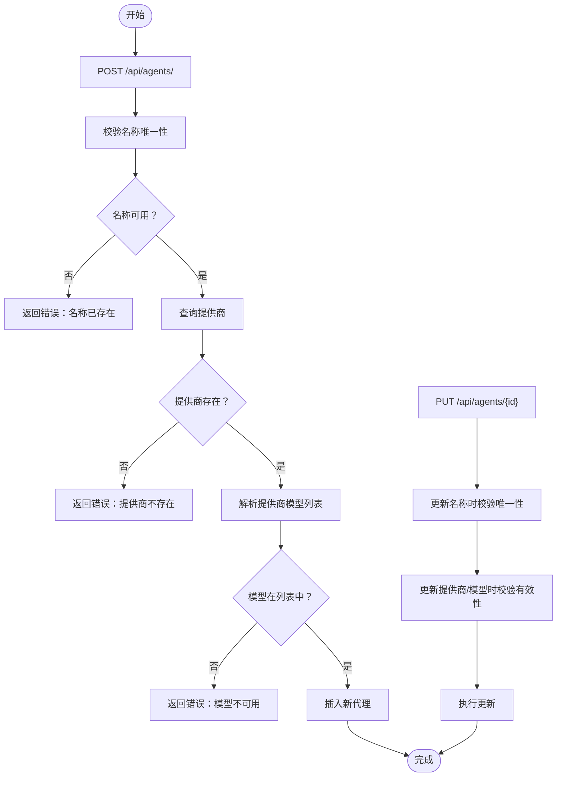
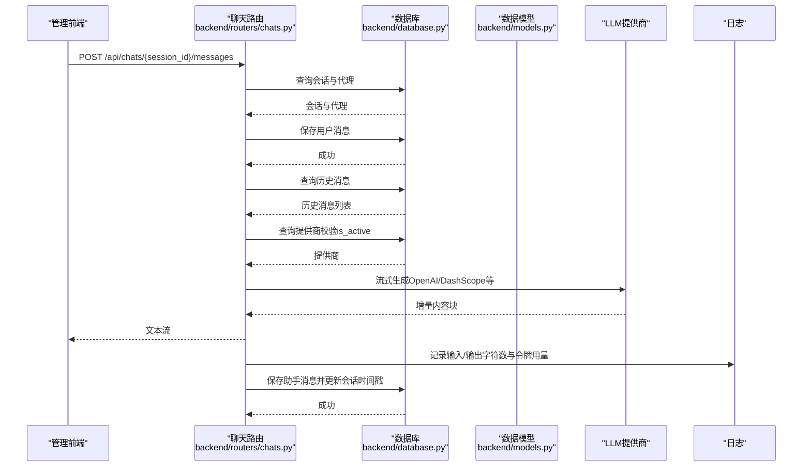
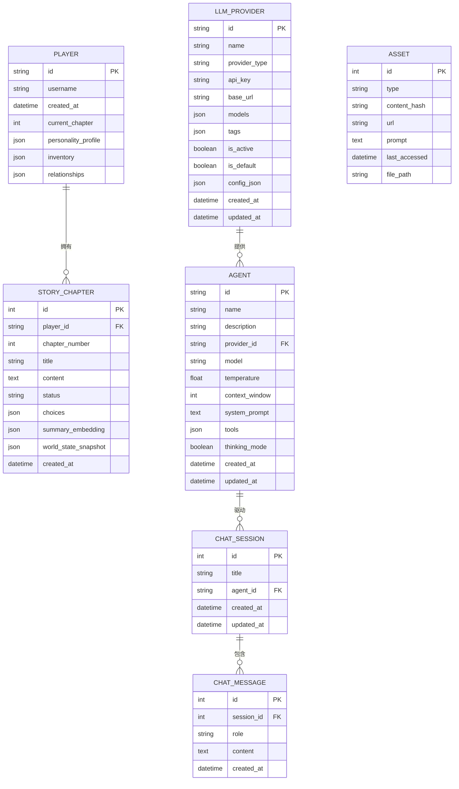
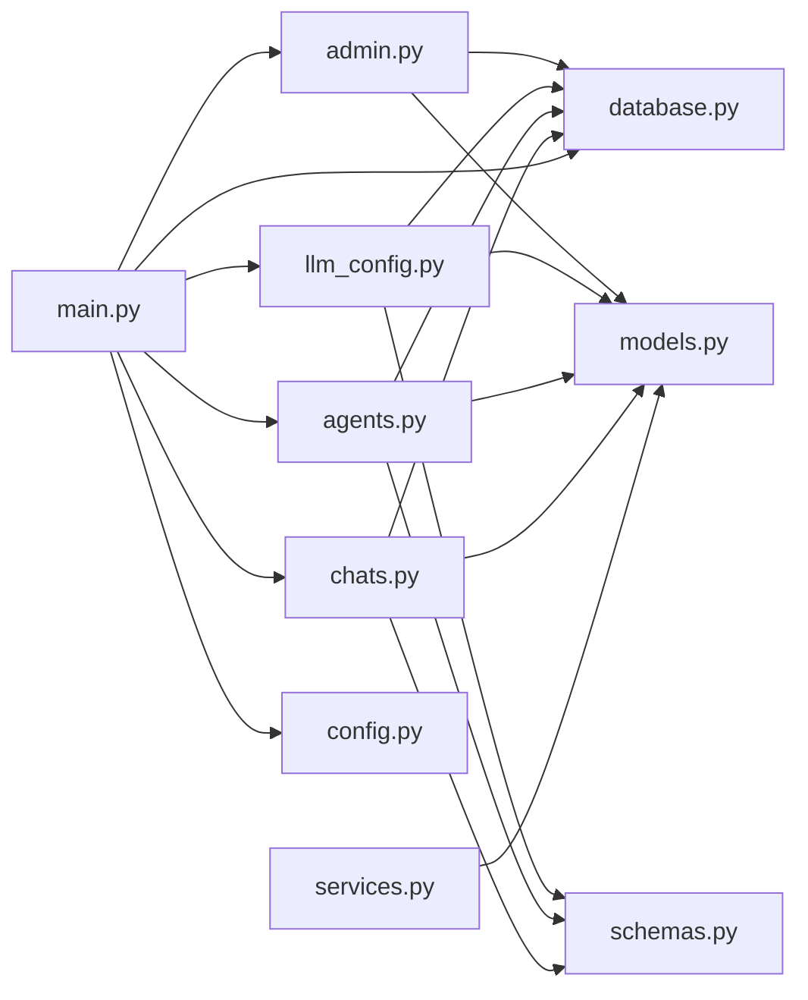

# 后台管理系统

<cite>
**本文引用的文件**
- [backend/main.py](file://backend/main.py)
- [backend/config.py](file://backend/config.py)
- [backend/database.py](file://backend/database.py)
- [backend/models.py](file://backend/models.py)
- [backend/schemas.py](file://backend/schemas.py)
- [backend/services.py](file://backend/services.py)
- [backend/routers/admin.py](file://backend/routers/admin.py)
- [backend/routers/llm_config.py](file://backend/routers/llm_config.py)
- [backend/routers/agents.py](file://backend/routers/agents.py)
- [backend/routers/chats.py](file://backend/routers/chats.py)
</cite>

## 目录
1. [简介](#简介)
2. [项目结构](#项目结构)
3. [核心组件](#核心组件)
4. [架构总览](#架构总览)
5. [详细组件分析](#详细组件分析)
6. [依赖关系分析](#依赖关系分析)
7. [性能考虑](#性能考虑)
8. [故障排查指南](#故障排查指南)
9. [结论](#结论)
10. [附录](#附录)

## 简介
本后台管理系统面向“无限叙事游戏”项目，提供管理员端的统一管理能力，包括：
- 管理界面设计理念：以数据驱动与实时交互为核心，支持统计概览、玩家与故事监控、LLM提供商与代理管理、聊天会话与消息流式处理。
- 用户角色与权限：当前路由未实现鉴权中间件，建议在生产环境引入认证与授权策略。
- LLM提供商管理：支持创建、查询、更新、删除与连接测试；支持默认提供商切换与运行时重载。
- 动态配置与API密钥管理：通过数据库持久化提供商配置，支持不同供应商与模型参数的灵活切换。
- 玩家监控与实时数据：提供玩家列表、故事章节列表与统计接口；聊天接口支持流式响应与令牌用量统计。
- 系统配置与日志：集中配置项、数据库连接池、日志级别控制；聊天模块记录详细的请求与用量日志。
- 安全与审计：当前未实现专用审计表，建议补充审计日志表与敏感字段加密。

## 项目结构
后端采用FastAPI + SQLAlchemy异步ORM架构，按功能模块划分：
- 应用入口与生命周期：应用启动时执行数据库迁移与叙事引擎初始化。
- 配置中心：集中管理数据库、Redis、AI密钥与生成模型等配置。
- 数据层：定义玩家、故事章节、资产、LLM提供商、代理、聊天会话与消息等模型。
- 路由层：分别提供管理员通用统计、LLM提供商管理、代理管理、聊天会话与消息流式接口。
- 服务层：封装业务逻辑，如玩家创建、世界初始化、一致性检查与章节生成等。

图表来源
- [backend/main.py](file://backend/main.py#L83-L98)
- [backend/config.py](file://backend/config.py#L1-L34)
- [backend/database.py](file://backend/database.py#L1-L31)
- [backend/routers/admin.py](file://backend/routers/admin.py#L1-L112)
- [backend/routers/llm_config.py](file://backend/routers/llm_config.py#L1-L203)
- [backend/routers/agents.py](file://backend/routers/agents.py#L1-L141)
- [backend/routers/chats.py](file://backend/routers/chats.py#L1-L275)
- [backend/services.py](file://backend/services.py#L1-L66)
- [backend/models.py](file://backend/models.py#L1-L122)
- [backend/schemas.py](file://backend/schemas.py#L1-L102)

章节来源
- [backend/main.py](file://backend/main.py#L1-L173)
- [backend/config.py](file://backend/config.py#L1-L34)
- [backend/database.py](file://backend/database.py#L1-L31)

## 核心组件
- 应用与生命周期：应用启动时执行数据库迁移与叙事引擎初始化，并注册各路由模块。
- 配置中心：集中管理数据库URL、Redis、AI密钥与生成模型等，支持从.env加载。
- 数据模型：涵盖玩家、故事章节、资产、LLM提供商、代理、聊天会话与消息。
- 路由与控制器：提供管理员统计、LLM提供商管理、代理管理、聊天会话与消息流式接口。
- 服务层：封装玩家创建、世界初始化、章节生成等业务逻辑。

章节来源
- [backend/main.py](file://backend/main.py#L45-L82)
- [backend/config.py](file://backend/config.py#L7-L34)
- [backend/models.py](file://backend/models.py#L9-L122)
- [backend/schemas.py](file://backend/schemas.py#L4-L102)
- [backend/services.py](file://backend/services.py#L8-L66)

## 架构总览
系统采用分层架构，前后端分离，管理端通过REST API与WebSocket进行交互。

图表来源
- [backend/main.py](file://backend/main.py#L83-L98)
- [backend/config.py](file://backend/config.py#L1-L34)
- [backend/database.py](file://backend/database.py#L1-L31)
- [backend/models.py](file://backend/models.py#L1-L122)
- [backend/schemas.py](file://backend/schemas.py#L1-L102)
- [backend/services.py](file://backend/services.py#L1-L66)
- [backend/routers/admin.py](file://backend/routers/admin.py#L1-L112)
- [backend/routers/llm_config.py](file://backend/routers/llm_config.py#L1-L203)
- [backend/routers/agents.py](file://backend/routers/agents.py#L1-L141)
- [backend/routers/chats.py](file://backend/routers/chats.py#L1-L275)

## 详细组件分析

### 管理员通用接口（统计与玩家/故事管理）
- 接口能力
  - 统计概览：玩家数、故事数、资产数、提供商数。
  - 玩家列表：分页查询，返回基础信息与计算字段。
  - 删除玩家：级联删除关联故事（当前实现为显式删除，建议在模型中启用外键级联）。
  - 故事列表：按玩家过滤，分页查询。
- 设计要点
  - 使用SQL聚合函数快速统计。
  - 分页参数skip/limit控制查询规模。
  - 删除操作需注意数据完整性与级联策略。

图表来源
- [backend/routers/admin.py](file://backend/routers/admin.py#L16-L112)
- [backend/database.py](file://backend/database.py#L28-L31)
- [backend/models.py](file://backend/models.py#L9-L44)

章节来源
- [backend/routers/admin.py](file://backend/routers/admin.py#L16-L112)

### LLM提供商管理（创建/查询/更新/删除/连接测试）
- 接口能力
  - 连接测试：根据提供商类型动态构造模型实例，发送测试消息验证可用性。
  - 创建提供商：名称唯一性校验，设置默认提供商时自动取消其他默认标记。
  - 查询提供商：分页查询所有提供商。
  - 更新提供商：更新默认标记时自动取消其他默认标记，若提供商处于活跃状态则触发运行时重载。
  - 删除提供商：删除指定提供商。
- 设计要点
  - 支持多种提供商类型（OpenAI/Azure、DashScope、Anthropic、Gemini），并可回退到OpenAI兼容模式。
  - 默认提供商切换与运行时重载确保配置变更即时生效。
  - API密钥明文存储，建议在生产环境进行加密存储与访问控制。

图表来源
- [backend/routers/llm_config.py](file://backend/routers/llm_config.py#L20-L138)
- [backend/database.py](file://backend/database.py#L28-L31)
- [backend/models.py](file://backend/models.py#L58-L79)

章节来源
- [backend/routers/llm_config.py](file://backend/routers/llm_config.py#L1-L203)

### 代理管理（创建/查询/更新/删除）
- 接口能力
  - 创建代理：名称唯一性校验；校验提供商存在且模型在提供商模型列表中。
  - 列表与搜索：支持按名称模糊搜索与分页。
  - 更新代理：名称唯一性校验；更新提供商或模型时进行可用性校验。
  - 删除代理：打印审计日志（建议改为专用审计表）。
- 设计要点
  - 对提供商模型列表进行严格校验，避免无效组合。
  - 更新时对名称冲突与提供商/模型有效性进行双重校验。

图表来源
- [backend/routers/agents.py](file://backend/routers/agents.py#L15-L141)

章节来源
- [backend/routers/agents.py](file://backend/routers/agents.py#L1-L141)

### 聊天会话与消息（会话管理、消息流式生成与统计）
- 接口能力
  - 会话管理：创建、列出、查询、删除（含消息级联删除）。
  - 消息发送：保存用户消息，准备历史上下文，调用对应提供商模型进行流式生成，返回增量内容；记录输入/输出字符数与令牌用量。
  - 流式响应：基于OpenAI/Azure、DashScope等提供商的流式接口，逐块推送响应。
- 设计要点
  - 上下文窗口与温度参数来自代理配置，日志中记录历史消息数量、输入字符数与上下文占用比例。
  - 保存助手回复与更新会话时间戳，保证会话状态一致。

图表来源
- [backend/routers/chats.py](file://backend/routers/chats.py#L72-L258)
- [backend/database.py](file://backend/database.py#L28-L31)
- [backend/models.py](file://backend/models.py#L80-L122)

章节来源
- [backend/routers/chats.py](file://backend/routers/chats.py#L1-L275)

### 数据模型与关系
- 模型概览
  - Player：玩家基本信息与偏好。
  - StoryChapter：故事章节与状态、分支选择、向量摘要与世界快照。
  - Asset：资源缓存与去重。
  - LLMProvider：提供商元数据、API密钥、模型列表、标签、默认与活跃标记。
  - Agent：代理与提供商绑定、参数与工具配置。
  - ChatSession/ChatMessage：会话与消息，支持历史检索与流式生成。
- 关系图

图表来源
- [backend/models.py](file://backend/models.py#L9-L122)

章节来源
- [backend/models.py](file://backend/models.py#L1-L122)

## 依赖关系分析
- 组件耦合
  - 路由层依赖数据库会话与数据模型，控制器负责参数校验与业务调用。
  - 服务层封装复杂业务逻辑并与模型交互。
  - LLM提供商路由与聊天路由依赖外部模型SDK（OpenAI、DashScope等）。
- 外部依赖
  - 数据库：SQLite/PostgreSQL（通过配置切换）。
  - Redis：用于缓存与会话存储（配置中提供URL）。
  - LLM SDK：OpenAI、Azure OpenAI、DashScope、Anthropic、Gemini。
- 潜在循环依赖
  - 当前模块间无明显循环导入；建议保持路由与服务分离，避免跨模块直接依赖。

图表来源
- [backend/routers/admin.py](file://backend/routers/admin.py#L1-L112)
- [backend/routers/llm_config.py](file://backend/routers/llm_config.py#L1-L203)
- [backend/routers/agents.py](file://backend/routers/agents.py#L1-L141)
- [backend/routers/chats.py](file://backend/routers/chats.py#L1-L275)
- [backend/services.py](file://backend/services.py#L1-L66)
- [backend/main.py](file://backend/main.py#L30-L41)
- [backend/config.py](file://backend/config.py#L1-L34)
- [backend/database.py](file://backend/database.py#L1-L31)
- [backend/models.py](file://backend/models.py#L1-L122)
- [backend/schemas.py](file://backend/schemas.py#L1-L102)

章节来源
- [backend/main.py](file://backend/main.py#L30-L41)
- [backend/routers/*.py](file://backend/routers/admin.py#L1-L112)

## 性能考虑
- 数据库连接池
  - 异步引擎配置了连接池大小与溢出连接数，SQLite场景设置线程检查参数，提升并发稳定性。
- 查询优化
  - 分页参数skip/limit控制结果集规模；统计接口使用聚合函数减少扫描开销。
- 流式响应
  - 聊天接口采用流式生成，降低首字节延迟；记录令牌用量便于成本控制。
- 缓存与会话
  - Redis配置可用于会话与缓存，建议结合业务场景启用。

章节来源
- [backend/database.py](file://backend/database.py#L8-L23)
- [backend/routers/admin.py](file://backend/routers/admin.py#L33-L57)
- [backend/routers/chats.py](file://backend/routers/chats.py#L112-L258)

## 故障排查指南
- 数据库连接失败
  - 现象：启动阶段连接数据库或执行迁移失败。
  - 排查：检查DATABASE_URL配置、网络连通性与凭据；观察重试日志与异常堆栈。
- 迁移失败
  - 现象：Alembic升级失败。
  - 排查：确认Python路径与工作目录正确；查看子进程返回码与标准输出。
- LLM提供商连接失败
  - 现象：连接测试返回错误。
  - 排查：核对API密钥、base_url、模型名称与提供商类型；检查网络与SDK版本。
- 代理创建/更新失败
  - 现象：提示提供商不存在或模型不可用。
  - 排查：确认提供商模型列表格式与内容；检查名称唯一性。
- 聊天流式生成异常
  - 现象：流式响应中断或报错。
  - 排查：查看日志中的输入/输出字符数与令牌用量；检查提供商SDK调用参数与限流情况。

章节来源
- [backend/main.py](file://backend/main.py#L45-L82)
- [backend/routers/llm_config.py](file://backend/routers/llm_config.py#L20-L111)
- [backend/routers/agents.py](file://backend/routers/agents.py#L15-L55)
- [backend/routers/chats.py](file://backend/routers/chats.py#L112-L258)

## 结论
该后台管理系统围绕“无限叙事游戏”的核心数据与业务流程构建，提供了完善的管理与监控能力。建议在生产环境中补充：
- 认证与授权中间件，限制接口访问范围；
- 审计日志表与敏感字段加密；
- 更严格的输入校验与异常处理；
- 缓存与限流策略以提升性能与稳定性。

## 附录

### 管理员界面使用指南
- 登录与权限
  - 当前路由未实现鉴权，建议在路由层添加认证中间件与权限校验。
- 统计面板
  - 访问管理员统计接口，获取玩家、故事、资产与提供商数量。
- 玩家与故事管理
  - 列表分页浏览；删除玩家时注意关联数据清理。
- LLM提供商管理
  - 创建/更新时选择提供商类型与模型；设置默认提供商后触发运行时重载。
- 代理管理
  - 选择有效提供商与模型；更新时进行名称与配置校验。
- 聊天与监控
  - 创建会话后发送消息，查看流式响应与日志统计。

章节来源
- [backend/routers/admin.py](file://backend/routers/admin.py#L16-L112)
- [backend/routers/llm_config.py](file://backend/routers/llm_config.py#L112-L188)
- [backend/routers/agents.py](file://backend/routers/agents.py#L15-L141)
- [backend/routers/chats.py](file://backend/routers/chats.py#L22-L258)

### API接口文档（概览）
- 管理员接口
  - GET /api/admin/stats：返回统计数字。
  - GET /api/admin/players：分页获取玩家列表。
  - DELETE /api/admin/players/{player_id}：删除玩家。
  - GET /api/admin/stories：分页获取故事列表，可按player_id过滤。
- LLM提供商接口
  - POST /api/admin/llm-providers/test-connection：测试连接。
  - POST /api/admin/llm-providers/：创建提供商。
  - GET /api/admin/llm-providers/：分页获取提供商列表。
  - GET /api/admin/llm-providers/{provider_id}：获取提供商详情。
  - PUT /api/admin/llm-providers/{provider_id}：更新提供商。
  - DELETE /api/admin/llm-providers/{provider_id}：删除提供商。
- 代理接口
  - POST /api/agents/：创建代理。
  - GET /api/agents/：分页与搜索代理。
  - GET /api/agents/{agent_id}：获取代理详情。
  - PUT /api/agents/{agent_id}：更新代理。
  - DELETE /api/agents/{agent_id}：删除代理。
- 聊天接口
  - POST /api/chats/：创建会话。
  - GET /api/chats/：分页获取会话列表。
  - GET /api/chats/{session_id}：获取会话详情。
  - GET /api/chats/{session_id}/messages：获取会话消息列表。
  - POST /api/chats/{session_id}/messages：发送消息并流式返回响应。
  - DELETE /api/chats/{session_id}：删除会话。

章节来源
- [backend/routers/admin.py](file://backend/routers/admin.py#L16-L112)
- [backend/routers/llm_config.py](file://backend/routers/llm_config.py#L20-L203)
- [backend/routers/agents.py](file://backend/routers/agents.py#L15-L141)
- [backend/routers/chats.py](file://backend/routers/chats.py#L22-L275)

### 集成示例（概念性）
- 管理员登录与鉴权
  - 在路由层添加认证中间件，校验管理员Token并注入用户上下文。
- LLM提供商接入
  - 通过LLM提供商接口创建新提供商，设置默认标记后触发运行时重载。
- 代理与聊天
  - 创建代理并绑定提供商与模型；通过聊天接口发起会话，接收流式响应。
- 监控与日志
  - 使用管理员统计接口与聊天日志，监控系统负载与成本。

[本节为概念性说明，不直接分析具体文件]