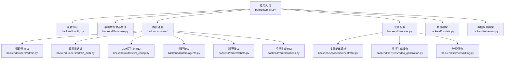
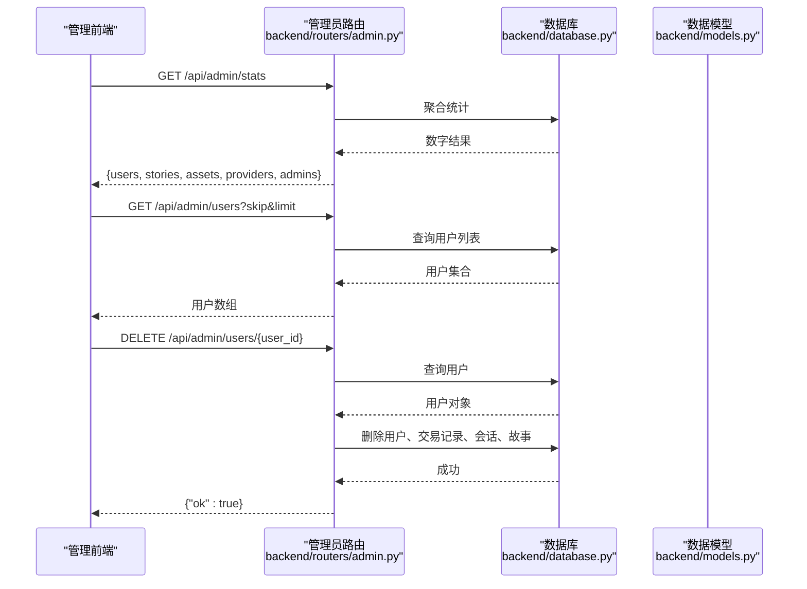
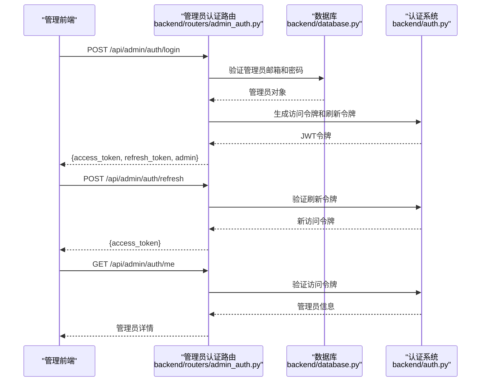
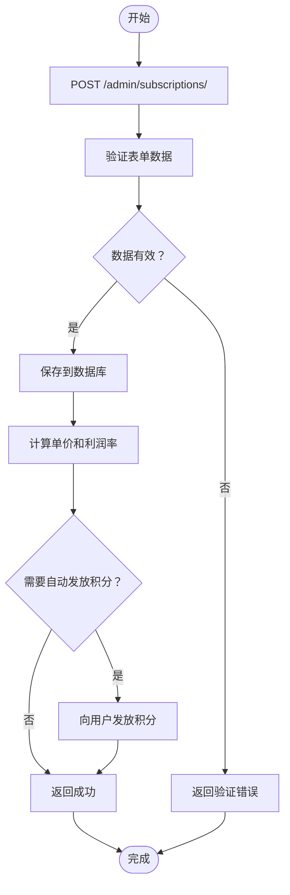
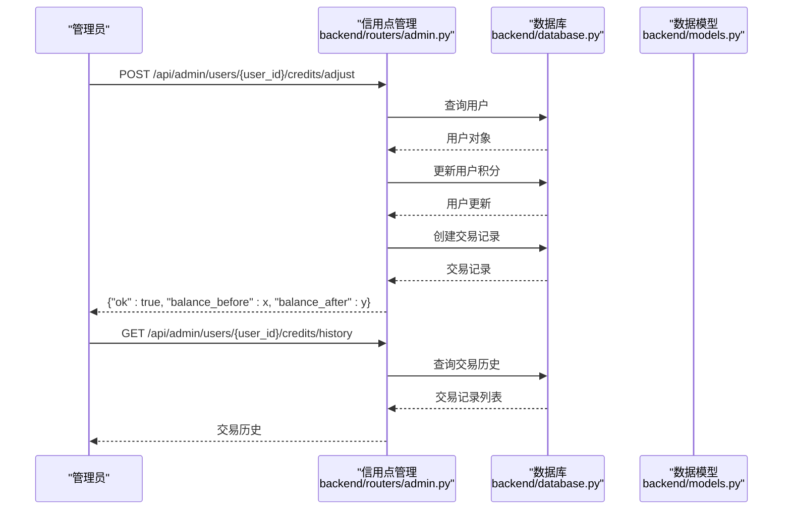
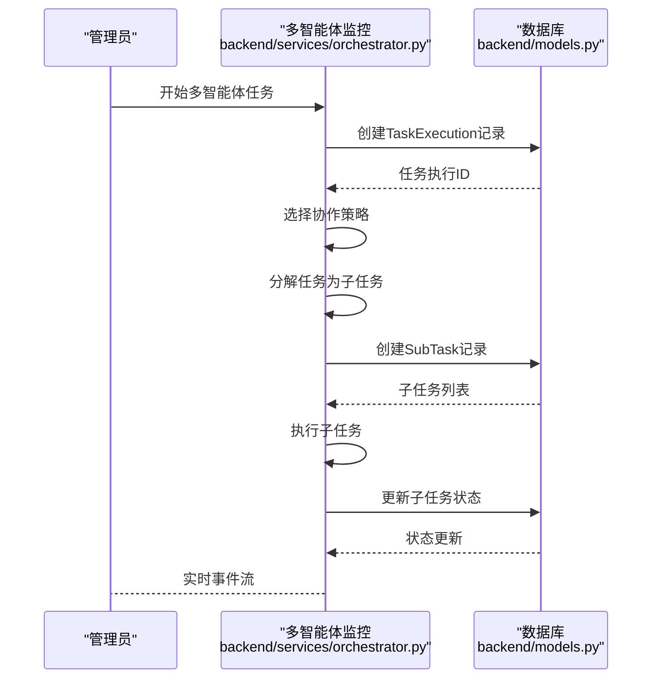
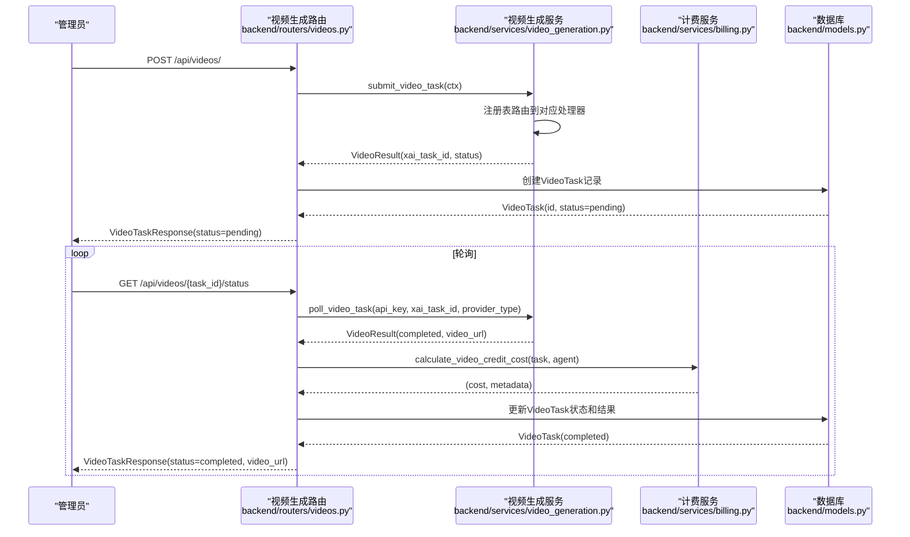
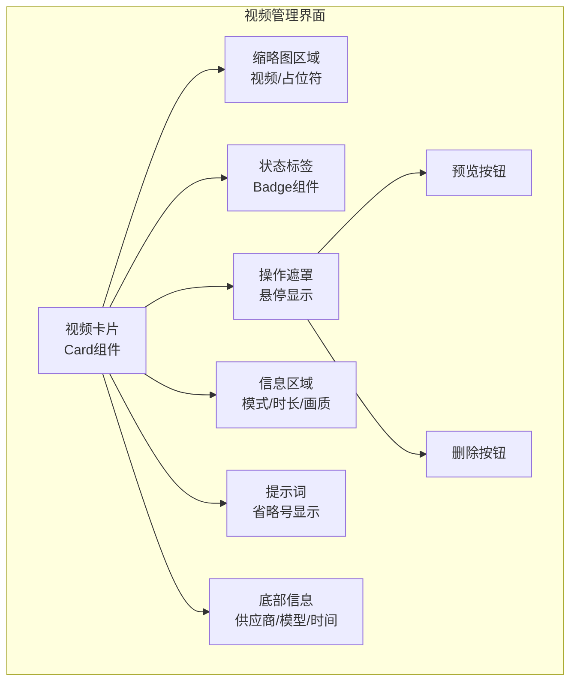
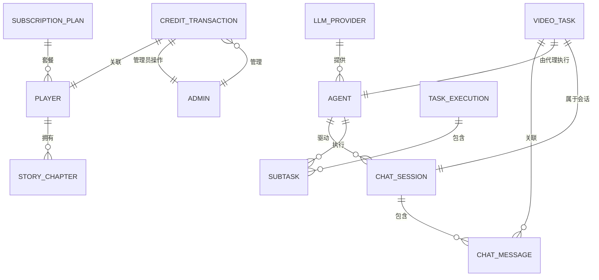
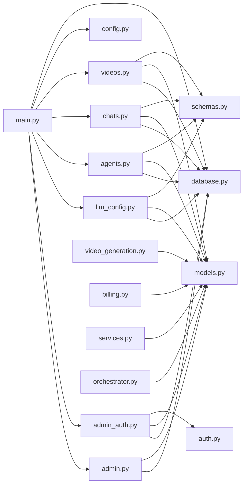

# 后台管理系统

<cite>
**本文档引用的文件**
- [backend/main.py](file://backend/main.py)
- [backend/config.py](file://backend/config.py)
- [backend/database.py](file://backend/database.py)
- [backend/models.py](file://backend/models.py)
- [backend/schemas.py](file://backend/schemas.py)
- [backend/services.py](file://backend/services.py)
- [backend/services/billing.py](file://backend/services/billing.py)
- [backend/services/video_generation.py](file://backend/services/video_generation.py)
- [backend/routers/admin.py](file://backend/routers/admin.py)
- [backend/routers/admin_auth.py](file://backend/routers/admin_auth.py)
- [backend/routers/llm_config.py](file://backend/routers/llm_config.py)
- [backend/routers/agents.py](file://backend/routers/agents.py)
- [backend/routers/chats.py](file://backend/routers/chats.py)
- [backend/routers/videos.py](file://backend/routers/videos.py)
- [backend/auth.py](file://backend/auth.py)
- [backend/migrations/versions/c74e516c6d87_add_credit_billing_system.py](file://backend/migrations/versions/c74e516c6d87_add_credit_billing_system.py)
- [backend/migrations/versions/h4i5j6k7l8m9_add_model_costs_and_subscriptions.py](file://backend/migrations/versions/h4i5j6k7l8m9_add_model_costs_and_subscriptions.py)
- [backend/migrations/versions/d8e9f0a1b2c3_add_multi_agent_collaboration.py](file://backend/migrations/versions/d8e9f0a1b2c3_add_multi_agent_collaboration.py)
- [backend/migrations/versions/7459f2d26782_add_video_tasks_and_video_agent_fields.py](file://backend/migrations/versions/7459f2d26782_add_video_tasks_and_video_agent_fields.py)
- [backend/migrations/versions/14746eaf1c81_initial.py](file://backend/migrations/versions/14746eaf1c81_initial.py)
- [backend/services/orchestrator.py](file://backend/services/orchestrator.py)
- [backend/admin/src/app/admin/page.tsx](file://backend/admin/src/app/admin/page.tsx)
- [backend/admin/src/app/admin/subscriptions/page.tsx](file://backend/admin/src/app/admin/subscriptions/page.tsx)
- [backend/admin/src/app/admin/agents/[id]/page.tsx](file://backend/admin/src/app/admin/agents/[id]/page.tsx)
- [backend/admin/src/app/admin/llm/page.tsx](file://backend/admin/src/app/admin/llm/page.tsx)
- [backend/admin/src/app/admin/llm/create/page.tsx](file://backend/admin/src/app/admin/llm/create/page.tsx)
- [backend/admin/src/app/admin/llm/components/provider-form.tsx](file://backend/admin/src/app/admin/llm/components/provider-form.tsx)
- [backend/admin/src/app/admin/llm/components/provider-list.tsx](file://backend/admin/src/app/admin/llm/components/provider-list.tsx)
- [backend/admin/src/app/admin/llm/schema.ts](file://backend/admin/src/app/admin/llm/schema.ts)
- [backend/admin/src/app/admin/videos/VideoPreviewModal.tsx](file://backend/admin/src/app/admin/videos/VideoPreviewModal.tsx)
- [backend/admin/src/hooks/useVideoTasks.ts](file://backend/admin/src/hooks/useVideoTasks.ts)
- [backend/admin/src/hooks/useSubscriptions.ts](file://backend/admin/src/hooks/useSubscriptions.ts)
- [backend/admin/src/hooks/useAgents.ts](file://backend/admin/src/hooks/useAgents.ts)
- [backend/admin/src/hooks/useLLMProviders.ts](file://backend/admin/src/hooks/useLLMProviders.ts)
- [backend/admin/src/types/index.ts](file://backend/admin/src/types/index.ts)
- [backend/admin/src/types/video.ts](file://backend/admin/src/types/video.ts)
- [backend/admin/src/context/AuthContext.tsx](file://backend/admin/src/context/AuthContext.tsx)
- [backend/admin/src/components/admin/AdminLayout.tsx](file://backend/admin/src/components/admin/AdminLayout.tsx)
- [backend/admin/src/components/admin/agents/AgentForm/index.tsx](file://backend/admin/src/components/admin/agents/AgentForm/index.tsx)
- [backend/admin/src/components/admin/agents/AgentForm/schema.ts](file://backend/admin/src/components/admin/agents/AgentForm/schema.ts)
- [backend/admin/src/components/admin/agents/AgentForm/BasicInfo.tsx](file://backend/admin/src/components/admin/agents/AgentForm/BasicInfo.tsx)
- [backend/admin/src/components/admin/agents/AgentForm/Tools.tsx](file://backend/admin/src/components/admin/agents/AgentForm/Tools.tsx)
- [backend/admin/src/components/admin/agents/AgentForm/LeaderConfig.tsx](file://backend/admin/src/components/admin/agents/AgentForm/LeaderConfig.tsx)
- [backend/admin/src/tests/unit/AgentForm.test.tsx](file://backend/admin/src/tests/unit/AgentForm.test.tsx)
- [backend/admin/src/lib/api-utils.ts](file://backend/admin/src/lib/api-utils.ts)
</cite>

## 更新摘要
**所做更改**
- **视频管理页面架构重构**：从对话框式迁移到页面化架构，新增独立的视频管理页面和创建页面
- **新增视频创建页面**：提供独立的视频任务创建页面，支持分步配置和表单验证
- **视频预览模态框增强**：独立的视频预览模态框组件，支持全屏播放和详细信息查看
- **智能状态轮询优化**：针对活跃视频任务的智能轮询机制，提升性能和用户体验
- **LLM提供商标签系统重构**：从列表视图迁移到组件化架构，支持标签的实时添加、删除和管理
- **管理员认证系统集成**：完整的JWT认证流程，支持令牌刷新和权限控制
- **视频生成系统组件化**：新增独立的视频管理界面、创建页面和预览模态框组件
- **增强的交互设计**：卡片悬停效果、状态标签、操作遮罩、删除按钮等UI增强功能
- **响应式网格布局**：支持不同屏幕尺寸的自适应卡片排列
- **页面化创建流程**：视频任务创建从表单集成改为独立页面，提供更清晰的分步创建体验

## 目录
1. [简介](#简介)
2. [项目结构](#项目结构)
3. [核心组件](#核心组件)
4. [架构总览](#架构总览)
5. [详细组件分析](#详细组件分析)
6. [依赖关系分析](#依赖关系分析)
7. [性能考虑](#性能考虑)
8. [故障排查指南](#故障排查指南)
9. [结论](#结论)
10. [附录](#附录)

## 简介
本后台管理系统面向"无限叙事剧场"项目，提供管理员端的统一管理能力，现已全面升级，包括：
- **管理员界面重构**：全新的仪表盘设计，支持实时统计数据展示和订阅管理
- **订阅管理**：完整的订阅套餐管理系统，支持自动积分发放和计费周期配置
- **信用点管理**：精细化的积分控制系统，支持用户和管理员积分调整、交易追踪
- **模型成本配置**：按模型级别的API调用成本设置，支持USD计价和成本控制
- **多智能体协作监控**：高级的多智能体任务编排和执行监控，支持多种协作策略
- **独立认证系统**：基于JWT的管理员认证体系，支持令牌刷新和权限控制
- **实时数据监控**：集成的数据可视化和统计分析功能
- **LLM提供商标签系统**：新增标签化管理功能，支持供应商分类和筛选
- **智能体表单增强**：完善的表单验证和用户体验优化
- **模型成本配置**：支持多维度成本管理和自定义参数设置
- **视频生成系统**：完整的视频生成能力，支持异步任务处理和多模式视频生成
- **视频计费系统**：基于质量维度的视频生成计费，支持多维度成本计算
- **视频代理配置**：智能体视频生成能力配置，支持不同视频模式和参数设置
- **视频任务管理**：支持视频生成任务的创建、监控和状态跟踪
- **视频预览功能**：完整的视频预览和管理界面
- **视频管理界面重构**：从表格布局改为卡片布局，提供现代化的视觉体验
- **页面化视频管理**：视频管理从对话框迁移到独立页面，提供更好的用户体验

## 项目结构
后端采用FastAPI + SQLAlchemy异步ORM架构，按功能模块划分，现已扩展支持新增功能：
- **应用入口与生命周期**：应用启动时执行数据库迁移与叙事引擎初始化
- **配置中心**：集中管理数据库、Redis、AI密钥与生成模型等配置
- **数据层**：定义玩家、故事章节、资产、LLM提供商、代理、聊天会话、信用交易、订阅计划、视频任务等模型
- **路由层**：分别提供管理员通用统计、LLM提供商管理、代理管理、聊天会话、订阅管理、信用点管理、视频生成管理等接口
- **服务层**：封装业务逻辑，如玩家创建、世界初始化、一致性检查、章节生成、多智能体编排、视频生成等



**图表来源**
- [backend/main.py:83-98](file://backend/main.py#L83-L98)
- [backend/config.py:1-34](file://backend/config.py#L1-L34)
- [backend/database.py:1-31](file://backend/database.py#L1-L31)
- [backend/routers/admin.py:1-498](file://backend/routers/admin.py#L1-L498)
- [backend/routers/admin_auth.py:1-119](file://backend/routers/admin_auth.py#L1-L119)
- [backend/routers/llm_config.py:1-203](file://backend/routers/llm_config.py#L1-L203)
- [backend/routers/agents.py:1-141](file://backend/routers/agents.py#L1-L141)
- [backend/routers/chats.py:1-275](file://backend/routers/chats.py#L1-L275)
- [backend/routers/videos.py:1-338](file://backend/routers/videos.py#L1-L338)
- [backend/services.py:1-66](file://backend/services.py#L1-L66)
- [backend/services/orchestrator.py:76-712](file://backend/services/orchestrator.py#L76-L712)
- [backend/services/video_generation.py:1-160](file://backend/services/video_generation.py#L1-L160)
- [backend/services/billing.py:1-324](file://backend/services/billing.py#L1-L324)
- [backend/models.py:1-383](file://backend/models.py#L1-L383)
- [backend/schemas.py:1-606](file://backend/schemas.py#L1-L606)

**章节来源**
- [backend/main.py:1-173](file://backend/main.py#L1-L173)
- [backend/config.py:1-34](file://backend/config.py#L1-L34)
- [backend/database.py:1-31](file://backend/database.py#L1-L31)

## 核心组件
- **应用与生命周期**：应用启动时执行数据库迁移与叙事引擎初始化，并注册各路由模块
- **配置中心**：集中管理数据库URL、Redis、AI密钥与生成模型等，支持从.env加载
- **数据模型**：涵盖玩家、故事章节、资产、LLM提供商、代理、聊天会话、信用交易、订阅计划、视频任务等
- **路由与控制器**：提供管理员统计、LLM提供商管理、代理管理、聊天会话、订阅管理、信用点管理、视频生成管理等接口
- **服务层**：封装玩家创建、世界初始化、章节生成、多智能体编排、视频生成等业务逻辑
- **认证系统**：独立的管理员认证体系，支持JWT令牌管理和权限控制
- **视频生成系统**：支持异步视频生成任务管理，包括文本到视频、图片到视频、视频编辑等多种模式
- **计费系统**：支持视频生成的多维度计费，基于质量维度和输入输出参数计算成本
- **视频任务管理**：完整的视频任务生命周期管理，包括创建、轮询、完成处理和计费
- **视频预览界面**：支持视频任务的状态展示、预览和详细信息查看
- **视频管理界面重构**：现代化的卡片布局设计，提供直观的视频任务管理体验
- **页面化视频管理**：视频管理从对话框迁移到独立页面，提供更好的用户体验
- **智能状态轮询**：针对活跃视频任务的智能轮询机制，提升性能和用户体验

**章节来源**
- [backend/main.py:45-82](file://backend/main.py#L45-L82)
- [backend/config.py:7-34](file://backend/config.py#L7-L34)
- [backend/models.py:9-383](file://backend/models.py#L9-L383)
- [backend/schemas.py:1-606](file://backend/schemas.py#L1-L606)
- [backend/services.py:8-66](file://backend/services.py#L8-L66)

## 架构总览
系统采用分层架构，前后端分离，管理端通过REST API与WebSocket进行交互，现已集成新增功能模块。

```mermaid
graph TB
subgraph "客户端"
FE["管理前端<br/>Next.js 应用"]
END
subgraph "后端"
API["FastAPI 应用<br/>backend/main.py"]
CFG["配置中心<br/>backend/config.py"]
DB["数据库引擎<br/>backend/database.py"]
MOD["数据模型<br/>backend/models.py"]
SCH["数据校验模型<br/>backend/schemas.py"]
SRV["业务服务<br/>backend/services.py"]
ORCH["多智能体编排<br/>backend/services/orchestrator.py"]
VID["视频生成服务<br/>backend/services/video_generation.py"]
BILL["计费服务<br/>backend/services/billing.py"]
RT_ADMIN["管理员路由<br/>backend/routers/admin.py"]
RT_ADMIN_AUTH["管理员认证<br/>backend/routers/admin_auth.py"]
RT_LLM["LLM提供商路由<br/>backend/routers/llm_config.py"]
RT_AGENTS["代理路由<br/>backend/routers/agents.py"]
RT_CHATS["聊天路由<br/>backend/routers/chats.py"]
RT_VIDEOS["视频生成路由<br/>backend/routers/videos.py"]
AUTH["认证系统<br/>backend/auth.py"]
END
FE --> API
API --> CFG
API --> DB
API --> SRV
API --> ORCH
API --> VID
API --> BILL
API --> RT_ADMIN
API --> RT_ADMIN_AUTH
API --> RT_LLM
API --> RT_AGENTS
API --> RT_CHATS
API --> RT_VIDEOS
SRV --> MOD
ORCH --> MOD
VID --> MOD
BILL --> MOD
RT_ADMIN --> MOD
RT_ADMIN_AUTH --> AUTH
RT_LLM --> MOD
RT_AGENTS --> MOD
RT_CHATS --> MOD
RT_VIDEOS --> MOD
RT_LLM --> SCH
RT_AGENTS --> SCH
RT_CHATS --> SCH
RT_VIDEOS --> SCH
```

**图表来源**
- [backend/main.py:83-98](file://backend/main.py#L83-L98)
- [backend/config.py:1-34](file://backend/config.py#L1-L34)
- [backend/database.py:1-31](file://backend/database.py#L1-L31)
- [backend/models.py:1-383](file://backend/models.py#L1-L383)
- [backend/schemas.py:1-606](file://backend/schemas.py#L1-L606)
- [backend/services.py:1-66](file://backend/services.py#L1-L66)
- [backend/services/orchestrator.py:76-712](file://backend/services/orchestrator.py#L76-L712)
- [backend/services/video_generation.py:1-160](file://backend/services/video_generation.py#L1-L160)
- [backend/services/billing.py:1-324](file://backend/services/billing.py#L1-L324)
- [backend/routers/admin.py:1-498](file://backend/routers/admin.py#L1-L498)
- [backend/routers/admin_auth.py:1-119](file://backend/routers/admin_auth.py#L1-L119)
- [backend/routers/llm_config.py:1-203](file://backend/routers/llm_config.py#L1-L203)
- [backend/routers/agents.py:1-141](file://backend/routers/agents.py#L1-L141)
- [backend/routers/chats.py:1-275](file://backend/routers/chats.py#L1-L275)
- [backend/routers/videos.py:1-338](file://backend/routers/videos.py#L1-L338)
- [backend/auth.py:107-173](file://backend/auth.py#L107-L173)

## 详细组件分析

### 管理员通用接口（统计与玩家/故事管理）
- **接口能力**
  - 统计概览：玩家数、故事数、资产数、提供商数、管理员数
  - 玩家列表：分页查询，返回基础信息与计算字段
  - 删除玩家：级联删除关联故事、会话和交易记录
  - 故事列表：按玩家过滤，分页查询
- **设计要点**
  - 使用SQL聚合函数快速统计
  - 分页参数skip/limit控制查询规模
  - 删除操作需注意数据完整性与级联策略



**图表来源**
- [backend/routers/admin.py:29-135](file://backend/routers/admin.py#L29-L135)
- [backend/database.py:28-31](file://backend/database.py#L28-L31)
- [backend/models.py:9-44](file://backend/models.py#L9-L44)

**章节来源**
- [backend/routers/admin.py:29-135](file://backend/routers/admin.py#L29-L135)

### 管理员认证系统（独立JWT认证）
- **接口能力**
  - 管理员登录：邮箱密码验证，生成访问令牌和刷新令牌
  - 令牌刷新：使用刷新令牌获取新的访问令牌
  - 获取当前管理员信息：验证令牌有效性并返回管理员详情
- **设计要点**
  - 独立的管理员认证表，与用户表分离
  - 支持subject_type区分用户和管理员身份
  - 实现令牌过期管理和权限验证



**图表来源**
- [backend/routers/admin_auth.py:33-119](file://backend/routers/admin_auth.py#L33-L119)
- [backend/auth.py:119-156](file://backend/auth.py#L119-L156)

**章节来源**
- [backend/routers/admin_auth.py:1-119](file://backend/routers/admin_auth.py#L1-L119)
- [backend/auth.py:119-156](file://backend/auth.py#L119-L156)

### 订阅管理（套餐创建、编辑、删除）
- **接口能力**
  - 创建订阅套餐：设置套餐名称、价格、积分数量、计费周期、特性列表
  - 编辑订阅套餐：更新套餐配置和状态
  - 删除订阅套餐：安全删除，防止误删
  - 自动积分发放：根据套餐配置自动向用户发放积分
- **设计要点**
  - 支持月付、年付、终身三种计费周期
  - 实时计算单价和利润率，辅助定价决策
  - 支持套餐排序和状态管理



**图表来源**
- [backend/admin/src/app/admin/subscriptions/page.tsx:165-189](file://backend/admin/src/app/admin/subscriptions/page.tsx#L165-L189)

**章节来源**
- [backend/admin/src/app/admin/subscriptions/page.tsx:1-522](file://backend/admin/src/app/admin/subscriptions/page.tsx#L1-L522)
- [backend/admin/src/hooks/useSubscriptions.ts:1-39](file://backend/admin/src/hooks/useSubscriptions.ts#L1-L39)

### 信用点管理（用户和管理员积分控制）
- **接口能力**
  - 用户积分调整：管理员手动充值或扣除用户积分
  - 管理员积分调整：管理员之间积分转移
  - 积分历史查询：查看所有积分变动记录
  - 交易记录追踪：详细记录每次积分变动的元数据
- **设计要点**
  - 支持正负值调整，防止负余额
  - 自动记录交易类型和元数据
  - 实现积分流水账功能



**图表来源**
- [backend/routers/admin.py:141-214](file://backend/routers/admin.py#L141-L214)

**章节来源**
- [backend/routers/admin.py:141-214](file://backend/routers/admin.py#L141-L214)

### 模型成本配置（按模型定价）
- **接口能力**
  - LLM提供商成本设置：为每个模型设置输入、输出、图像生成等成本
  - 成本查询：查看提供商的成本配置
  - 成本更新：动态更新模型成本配置
- **设计要点**
  - 支持USD计价，精确到小数点后4位
  - 实时生效，无需重启服务
  - 与多智能体协作监控集成

**章节来源**
- [backend/routers/llm_config.py:1-203](file://backend/routers/llm_config.py#L1-L203)
- [backend/models.py:137-138](file://backend/models.py#L137-L138)
- [backend/schemas.py](file://backend/schemas.py#L133)

### 多智能体协作监控（高级任务编排）
- **接口能力**
  - 任务执行监控：实时跟踪多智能体任务执行状态
  - 协作过程可视化：显示智能体协作步骤和进度
  - 执行统计分析：统计任务执行时间和成本
- **设计要点**
  - 支持多种协作策略：管道式、计划式、讨论式
  - 实时事件流：使用OrchestrationEvent提供流式反馈
  - 详细日志记录：记录每个子任务的执行详情



**图表来源**
- [backend/services/orchestrator.py:581-712](file://backend/services/orchestrator.py#L581-L712)
- [backend/models.py:235-282](file://backend/models.py#L235-L282)

**章节来源**
- [backend/services/orchestrator.py:76-712](file://backend/services/orchestrator.py#L76-L712)
- [backend/models.py:235-282](file://backend/models.py#L235-L282)

### LLM提供商管理（创建/查询/更新/删除/连接测试）
- **接口能力**
  - 连接测试：根据提供商类型动态构造模型实例，发送测试消息验证可用性
  - 创建提供商：名称唯一性校验，设置默认提供商时自动取消其他默认标记
  - 查询提供商：分页查询所有提供商
  - 更新提供商：更新默认标记时自动取消其他默认标记，若提供商处于活跃状态则触发运行时重载
  - 删除提供商：删除指定提供商
- **设计要点**
  - 支持多种提供商类型（OpenAI/Azure、DashScope、Anthropic、Gemini），并可回退到OpenAI兼容模式
  - 默认提供商切换与运行时重载确保配置变更即时生效
  - API密钥明文存储，建议在生产环境进行加密存储与访问控制
  - **新增标签系统**：支持标签化管理，便于供应商分类和筛选

**章节来源**
- [backend/routers/llm_config.py:1-203](file://backend/routers/llm_config.py#L1-L203)

### 代理管理（创建/查询/更新/删除）
- **接口能力**
  - 创建代理：名称唯一性校验；校验提供商存在且模型在提供商模型列表中
  - 列表与搜索：支持按名称模糊搜索与分页
  - 更新代理：名称唯一性校验；更新提供商或模型时进行可用性校验
  - 删除代理：打印审计日志（建议改为专用审计表）
- **设计要点**
  - 对提供商模型列表进行严格校验，避免无效组合
  - 更新时对名称冲突与提供商/模型有效性进行双重校验
  - **增强表单验证**：完善的智能体表单验证和用户体验优化
  - **新增视频生成能力**：智能体支持视频生成模式，包含视频计费参数配置

**章节来源**
- [backend/routers/agents.py:1-141](file://backend/routers/agents.py#L1-L141)

### 聊天会话与消息（会话管理、消息流式生成与统计）
- **接口能力**
  - 会话管理：创建、列出、查询、删除（含消息级联删除）
  - 消息发送：保存用户消息，准备历史上下文，调用对应提供商模型进行流式生成，返回增量内容；记录输入/输出字符数与令牌用量
  - 流式响应：基于OpenAI/Azure、DashScope等提供商的流式接口，逐块推送响应
- **设计要点**
  - 上下文窗口与温度参数来自代理配置，日志中记录历史消息数量、输入字符数与上下文占用比例
  - 保存助手回复与更新会话时间戳，保证会话状态一致

**章节来源**
- [backend/routers/chats.py:1-275](file://backend/routers/chats.py#L1-L275)

### 视频生成系统（异步视频生成与管理）
- **接口能力**
  - 视频生成任务提交：支持文本到视频、图片到视频、视频编辑三种模式
  - 任务状态轮询：异步跟踪视频生成状态，支持超时保护
  - 会话关联：自动将视频结果插入聊天会话消息中
  - 任务列表查询：按会话查询视频生成历史
- **设计要点**
  - 基于xAI API的异步视频生成，支持多种视频模式
  - 完整的任务生命周期管理，包括提交、轮询、完成处理
  - 自动内容审核，拒绝违规内容
  - 与聊天系统无缝集成



**图表来源**
- [backend/routers/videos.py:23-338](file://backend/routers/videos.py#L23-L338)
- [backend/services/video_generation.py:84-160](file://backend/services/video_generation.py#L84-L160)
- [backend/services/billing.py:290-324](file://backend/services/billing.py#L290-L324)
- [backend/models.py:352-383](file://backend/models.py#L352-L383)

**章节来源**
- [backend/routers/videos.py:1-338](file://backend/routers/videos.py#L1-L338)
- [backend/services/video_generation.py:1-160](file://backend/services/video_generation.py#L1-L160)
- [backend/services/billing.py:290-324](file://backend/services/billing.py#L290-L324)
- [backend/models.py:352-383](file://backend/models.py#L352-L383)

### 视频计费系统（多维度成本计算）
- **接口能力**
  - 视频计费计算：根据输入图片数量、输出时长、质量等级计算总成本
  - 计费维度映射：支持输入图片、输入视频时长、480p输出、720p输出四种维度
  - 质量转换：根据质量等级自动选择对应的输出计费维度
  - 原子扣费：确保计费和扣费的原子性操作
- **设计要点**
  - 基于预设映射表的高效计费计算，避免if-else分支
  - 支持不同视频模式的差异化计费策略
  - 详细的计费元数据记录，便于审计和统计

**章节来源**
- [backend/services/billing.py:22-35](file://backend/services/billing.py#L22-L35)
- [backend/services/billing.py:290-324](file://backend/services/billing.py#L290-L324)
- [backend/models.py:196-200](file://backend/models.py#L196-L200)

### 视频任务管理（新增功能）
- **功能特性**
  - 任务创建：支持多种视频模式的异步任务提交
  - 状态监控：自动轮询任务状态，支持超时保护
  - 任务列表：支持分页查询、状态筛选和模式筛选
  - 会话关联：自动将视频结果插入聊天会话消息
  - 计费集成：完成后自动计算并扣除视频生成费用
- **设计实现**
  - 使用VideoTask模型存储任务状态和结果
  - 支持pending、processing、completed、failed四种状态
  - 集成xAI API的异步轮询机制
  - 自动内容审核和错误处理

**章节来源**
- [backend/routers/videos.py:25-70](file://backend/routers/videos.py#L25-L70)
- [backend/models.py:352-383](file://backend/models.py#L352-L383)

### 视频预览界面（新增功能）
- **功能特性**
  - 视频卡片展示：支持状态标签、模式标识、时长和画质显示
  - 视频预览：点击卡片可弹出视频预览模态框
  - 任务详情：显示任务的详细信息，包括提示词、费用、Agent等
  - 分页浏览：支持分页查看大量视频任务
  - 实时状态：活跃任务自动刷新状态
- **设计实现**
  - 使用SWR实现实时数据同步
  - 支持多种视频模式的标签显示
  - 响应式网格布局适配不同屏幕尺寸
  - 错误状态的友好提示

**章节来源**
- [backend/admin/src/app/admin/videos/VideoPreviewModal.tsx:1-116](file://backend/admin/src/app/admin/videos/VideoPreviewModal.tsx#L1-L116)

### 管理员界面导航更新（新增功能）
- **功能特性**
  - 新增视频生成菜单项：位于智能体管理之后，管理员管理之前
  - 图标标识：使用Film图标表示视频生成功能
  - 导航状态：支持折叠展开，激活状态高亮显示
  - 响应式设计：支持移动端和桌面端的不同显示效果
- **设计实现**
  - 使用Lucide React图标库
  - 支持侧边栏折叠功能
  - 激活状态通过CSS类名控制
  - 响应式布局适配不同屏幕尺寸

**章节来源**
- [backend/admin/src/components/admin/AdminLayout.tsx:45-91](file://backend/admin/src/components/admin/AdminLayout.tsx#L45-L91)

### LLM提供商标签系统重构
- **功能特性**
  - **组件化架构**：从列表视图迁移到独立的ProviderForm组件
  - **实时标签管理**：支持标签的实时添加、删除和编辑
  - **键盘快捷键**：支持回车添加标签，删除键删除最后一个标签
  - **标签验证**：防止重复标签，提供友好的错误提示
  - **标签持久化**：标签数据存储在数据库中，支持编辑和更新
- **设计实现**
  - 使用Badge组件展示标签，支持点击删除
  - 表单验证确保标签格式正确
  - 后端模型支持JSON格式存储标签数组
  - **新增标签系统**：支持标签化管理，便于供应商分类和筛选

**章节来源**
- [backend/admin/src/app/admin/llm/components/provider-form.tsx:280-328](file://backend/admin/src/app/admin/llm/components/provider-form.tsx#L280-L328)
- [backend/admin/src/app/admin/llm/schema.ts:4-42](file://backend/admin/src/app/admin/llm/schema.ts#L4-L42)
- [backend/models.py](file://backend/models.py#L130)
- [backend/schemas.py](file://backend/schemas.py#L129)

### 视频管理界面重构（新增功能）
- **功能特性**
  - **卡片布局设计**：视频任务从传统的表格布局完全重构为现代化的卡片布局
  - **响应式网格**：支持1-4列的自适应网格布局，适配不同屏幕尺寸
  - **悬停交互**：卡片悬停时显示操作遮罩，支持预览和删除操作
  - **状态标签**：每个卡片顶部显示状态标签，支持排队中、生成中、已完成、失败等状态
  - **预览模态框**：点击卡片或预览按钮打开独立的视频预览模态框
  - **分页导航**：支持分页查看大量视频任务，显示总数和页码信息
  - **实时轮询**：活跃任务自动轮询状态，5秒刷新一次
- **设计实现**
  - 使用Card组件构建卡片布局，支持悬停效果和阴影动画
  - 状态映射表实现状态到标签样式的转换
  - SWR实现数据获取和自动刷新
  - 响应式Grid布局支持不同屏幕尺寸的自适应显示
  - 悬停遮罩提供直观的操作入口



**图表来源**
- [backend/admin/src/app/admin/videos/VideoPreviewModal.tsx:24-52](file://backend/admin/src/app/admin/videos/VideoPreviewModal.tsx#L24-L52)

**章节来源**
- [backend/admin/src/app/admin/videos/VideoPreviewModal.tsx:1-116](file://backend/admin/src/app/admin/videos/VideoPreviewModal.tsx#L1-L116)

### 页面化创建流程（新增功能）
- **功能特性**
  - **独立页面设计**：视频任务创建从表单集成改为独立的新建页面
  - **分步配置**：分为模型配置和视频设置两个主要部分
  - **智能表单**：根据选择的模式动态显示相关字段
  - **实时验证**：表单字段实时验证，提供友好的错误提示
  - **进度指示**：显示提示词长度，支持最大字符数限制
  - **一键提交**：配置完成后一键提交视频生成任务
- **设计实现**
  - 使用Grid布局组织表单字段，支持响应式显示
  - 动态字段显示逻辑，根据视频模式决定是否显示图片URL字段
  - Slider组件提供直观的时长调节体验
  - Select组件支持画质和宽高比的选择
  - 提交按钮禁用逻辑确保表单完整性

**章节来源**
- [backend/admin/src/app/admin/videos/VideoPreviewModal.tsx:1-116](file://backend/admin/src/app/admin/videos/VideoPreviewModal.tsx#L1-L116)

### 视频预览模态框（新增功能）
- **功能特性**
  - **全屏播放**：支持视频全屏播放，提供沉浸式预览体验
  - **状态显示**：根据任务状态显示不同的内容（视频、错误信息、占位符）
  - **详细信息**：显示任务的完整信息，包括模式、画质、时长、比例、费用等
  - **提示词查看**：支持查看原始提示词内容
  - **时间信息**：显示创建时间和完成时间
  - **删除功能**：对于已完成或失败的任务提供删除按钮
- **设计实现**
  - 独立的Dialog组件实现模态框功能
  - 根据状态动态渲染不同的内容区域
  - 详细信息表格化展示，便于阅读
  - 删除按钮仅在可删除状态下显示

**章节来源**
- [backend/admin/src/app/admin/videos/VideoPreviewModal.tsx:1-116](file://backend/admin/src/app/admin/videos/VideoPreviewModal.tsx#L1-L116)

### 实时状态轮询优化（新增功能）
- **功能特性**
  - **智能轮询**：仅对活跃状态的任务进行轮询，避免对已完成任务的无效请求
  - **并发轮询**：使用Promise.allSettled并发轮询多个活跃任务
  - **自动刷新**：根据活跃任务数量动态调整轮询频率
  - **状态驱动**：活跃任务触发5秒轮询，空闲时停止轮询
  - **轮询控制**：使用ref防止重复轮询，确保轮询的幂等性
- **设计实现**
  - ACTIVE_STATUSES集合定义活跃状态
  - useEffect监听数据变化，动态设置轮询间隔
  - 并发调用status端点，驱动后端轮询xAI并写入数据库
  - 轮询频率与活跃任务数量成正比

**章节来源**
- [backend/admin/src/hooks/useVideoTasks.ts:1-73](file://backend/admin/src/hooks/useVideoTasks.ts#L1-L73)

### 数据模型与关系
- **模型概览**
  - Player：玩家基本信息与偏好
  - StoryChapter：故事章节与状态、分支选择、向量摘要与世界快照
  - Asset：资源缓存与去重
  - LLMProvider：提供商元数据、API密钥、模型列表、**标签**、默认与活跃标记、模型成本配置
  - Agent：代理与提供商绑定、参数与工具配置、多智能体编排配置、**视频计费参数**
  - ChatSession/ChatMessage：会话与消息，支持历史检索与流式生成
  - CreditTransaction：信用交易记录，支持用户和管理员积分追踪
  - SubscriptionPlan：订阅套餐配置，支持定价和积分发放
  - TaskExecution/SubTask：多智能体任务执行记录
  - **VideoTask**：视频生成任务追踪，支持异步状态管理和计费记录
  - Admin：管理员表，支持独立认证和权限管理
- **关系图**



**图表来源**
- [backend/models.py:1-383](file://backend/models.py#L1-L383)

**章节来源**
- [backend/models.py:1-383](file://backend/models.py#L1-L383)

### 智能体表单增强
- **功能改进**
  - 完善Gemini配置：支持思维级别、媒体分辨率、图片生成等高级配置
  - 工具能力管理：增强工具启用和选择的用户体验
  - Leader模式配置：支持多协作方式和成员智能体管理
  - **视频生成配置**：新增视频计费参数设置，支持输入图片、输入视频时长、输出质量等
  - 表单验证优化：改进错误提示和用户体验
- **技术实现**
  - 使用Zod进行严格的数据验证
  - 支持条件字段显示和隐藏
  - 实时表单状态管理和错误处理

**章节来源**
- [backend/admin/src/components/admin/agents/AgentForm/index.tsx:1-296](file://backend/admin/src/components/admin/agents/AgentForm/index.tsx#L1-L296)
- [backend/admin/src/components/admin/agents/AgentForm/schema.ts:1-70](file://backend/admin/src/components/admin/agents/AgentForm/schema.ts#L1-L70)
- [backend/admin/src/components/admin/agents/AgentForm/BasicInfo.tsx:1-180](file://backend/admin/src/components/admin/agents/AgentForm/BasicInfo.tsx#L1-L180)
- [backend/admin/src/components/admin/agents/AgentForm/Tools.tsx:1-100](file://backend/admin/src/components/admin/agents/AgentForm/Tools.tsx#L1-L100)
- [backend/admin/src/components/admin/agents/AgentForm/LeaderConfig.tsx:1-214](file://backend/admin/src/components/admin/agents/AgentForm/LeaderConfig.tsx#L1-L214)

### 模型成本配置增强
- **功能特性**
  - 多维度成本管理：支持输入、文本输出、图片输出、搜索查询等成本维度
  - 自定义参数支持：允许添加自定义成本参数
  - 折叠面板设计：支持展开/折叠查看具体成本配置
  - 实时验证：输入成本时进行实时验证和格式化
- **设计实现**
  - 使用预设成本维度映射表避免if-else
  - 支持批量成本配置和清理
  - 前端交互优化，提升用户体验

**章节来源**
- [backend/admin/src/app/admin/llm/page.tsx:506-643](file://backend/admin/src/app/admin/llm/page.tsx#L506-L643)

### 视频代理配置（新增功能）
- **功能特性**
  - 视频生成模式：支持text_to_video、image_to_video、edit三种模式
  - 参数配置：支持时长、质量、宽高比、模式等参数设置
  - 计费参数：支持输入图片计费、输入视频时长计费、输出质量计费
  - 模式注册：基于注册表的视频模式处理器架构
- **设计实现**
  - 使用VideoContext封装视频生成上下文
  - 支持异步任务提交和轮询
  - 与xAI API集成，支持内容审核
  - 自动将视频结果插入聊天会话

**章节来源**
- [backend/services/video_generation.py:37-100](file://backend/services/video_generation.py#L37-L100)
- [backend/routers/videos.py:23-104](file://backend/routers/videos.py#L23-L104)
- [backend/schemas.py:551-568](file://backend/schemas.py#L551-L568)

### 视频计费参数设置（新增功能）
- **功能特性**
  - 多维度计费：支持输入图片、输入视频时长、480p输出、720p输出四种计费维度
  - 质量映射：根据质量等级自动选择对应的输出计费维度
  - 原子计算：基于预设映射表的高效计费计算
  - 元数据记录：详细记录计费相关的元数据信息
- **设计实现**
  - 使用VIDEO_BILLING_DIMENSIONS映射表管理计费维度
  - QUALITY_BILLING_FIELD实现质量到计费维度的转换
  - 支持不同视频模式的差异化计费策略

**章节来源**
- [backend/services/billing.py:22-35](file://backend/services/billing.py#L22-L35)
- [backend/services/billing.py:290-324](file://backend/services/billing.py#L290-L324)
- [backend/models.py:196-200](file://backend/models.py#L196-L200)

### 视频模型能力配置（新增功能）
- **功能特性**
  - 模型能力定义：支持视频模式、时长、分辨率、宽高比等能力配置
  - 默认能力配置：当模型未定义时使用默认能力设置
  - 标签映射：提供中文标签映射，改善用户体验
  - 能力验证：确保模型配置的完整性和一致性
- **设计实现**
  - 使用TypeScript接口定义模型能力结构
  - 支持多种视频模式的灵活配置
  - 提供完整的标签映射表支持国际化
  - 默认配置确保系统稳定性

**章节来源**
- [backend/admin/src/types/video.ts:1-54](file://backend/admin/src/types/video.ts#L1-L54)

## 依赖关系分析
- **组件耦合**
  - 路由层依赖数据库会话与数据模型，控制器负责参数校验与业务调用
  - 服务层封装复杂业务逻辑并与模型交互
  - LLM提供商路由与聊天路由依赖外部模型SDK（OpenAI、DashScope等）
  - **新增视频生成服务**：独立的视频生成服务，依赖xAI API和计费服务
  - **新增计费服务**：支持视频生成的多维度计费，与视频生成服务深度集成
  - 新增的订阅管理、信用点管理、多智能体编排功能通过独立的服务层实现
  - **新增标签系统**：LLM提供商模型与标签功能深度集成
  - **增强表单系统**：智能体表单组件与验证系统紧密耦合
  - **视频任务管理**：VideoTask模型与聊天消息系统集成
  - **视频预览界面**：前端组件与视频任务服务深度集成
  - **视频管理界面重构**：卡片布局设计与响应式Grid系统深度集成
  - **页面化创建流程**：独立页面与表单组件的分离设计
  - **实时状态轮询优化**：SWR与轮询机制的协同工作
  - **视频模型能力配置**：TypeScript类型定义与前端组件的集成
- **外部依赖**
  - 数据库：SQLite/PostgreSQL（通过配置切换）
  - Redis：用于缓存与会话存储（配置中提供URL）
  - LLM SDK：OpenAI、Azure OpenAI、DashScope、Anthropic、Gemini
  - **xAI API**：视频生成服务依赖的外部API
  - 前端框架：Next.js、React Hook Form、SWR、Recharts
  - **UI组件库**：Card、Badge、Button、Dialog等组件的广泛使用
- **潜在循环依赖**
  - 当前模块间无明显循环导入；建议保持路由与服务分离，避免跨模块直接依赖



**图表来源**
- [backend/routers/admin.py:1-498](file://backend/routers/admin.py#L1-L498)
- [backend/routers/admin_auth.py:1-119](file://backend/routers/admin_auth.py#L1-L119)
- [backend/routers/llm_config.py:1-203](file://backend/routers/llm_config.py#L1-L203)
- [backend/routers/agents.py:1-141](file://backend/routers/agents.py#L1-L141)
- [backend/routers/chats.py:1-275](file://backend/routers/chats.py#L1-L275)
- [backend/routers/videos.py:1-338](file://backend/routers/videos.py#L1-L338)
- [backend/services.py:1-66](file://backend/services.py#L1-L66)
- [backend/services/orchestrator.py:76-712](file://backend/services/orchestrator.py#L76-L712)
- [backend/services/video_generation.py:1-160](file://backend/services/video_generation.py#L1-L160)
- [backend/services/billing.py:1-324](file://backend/services/billing.py#L1-L324)
- [backend/main.py:30-41](file://backend/main.py#L30-L41)
- [backend/config.py:1-34](file://backend/config.py#L1-L34)
- [backend/database.py:1-31](file://backend/database.py#L1-L31)
- [backend/models.py:1-383](file://backend/models.py#L1-L383)
- [backend/schemas.py:1-606](file://backend/schemas.py#L1-L606)
- [backend/auth.py:107-173](file://backend/auth.py#L107-L173)

**章节来源**
- [backend/main.py:30-41](file://backend/main.py#L30-L41)
- [backend/routers/*.py:1-498](file://backend/routers/admin.py#L1-L498)

## 性能考虑
- **数据库连接池**
  - 异步引擎配置了连接池大小与溢出连接数，SQLite场景设置线程检查参数，提升并发稳定性
- **查询优化**
  - 分页参数skip/limit控制结果集规模；统计接口使用聚合函数减少扫描开销
  - 新增索引优化常用查询（subscription_plans表的id和name索引）
  - **标签查询优化**：LLM提供商标签查询支持索引优化
  - **视频任务索引**：VideoTask表的id、status、user_id、xai_task_id索引优化查询性能
- **流式响应**
  - 聊天接口采用流式生成，降低首字节延迟；记录令牌用量便于成本控制
  - 多智能体编排使用事件流提供实时反馈
  - **视频生成轮询**：异步轮询机制避免阻塞主线程
- **缓存与会话**
  - Redis配置可用于会话与缓存，建议结合业务场景启用
  - 前端使用SWR实现数据缓存和自动刷新
  - **表单状态缓存**：智能体表单状态本地缓存优化用户体验
  - **视频结果缓存**：生成的视频文件本地存储，避免重复生成
  - **卡片布局优化**：响应式网格布局减少DOM节点数量
  - **实时轮询优化**：智能轮询机制避免对已完成任务的无效请求
- **计费性能**
  - **计费映射表**：使用预设映射表避免if-else分支，提升计费计算性能
  - **原子操作**：计费和扣费使用原子操作，确保数据一致性
- **视频任务性能**
  - **活跃任务轮询**：使用SWR的并发调用机制，避免重复轮询
  - **状态缓存**：已完成任务的状态缓存，减少不必要的轮询
  - **分页优化**：视频任务列表使用分页查询，避免大量数据传输
  - **卡片渲染优化**：虚拟滚动支持大量视频任务的高效渲染
  - **页面化加载**：独立页面减少初始加载压力，提升用户体验

**章节来源**
- [backend/database.py:8-23](file://backend/database.py#L8-L23)
- [backend/routers/admin.py:53-83](file://backend/routers/admin.py#L53-L83)
- [backend/routers/chats.py:112-258](file://backend/routers/chats.py#L112-L258)
- [backend/migrations/versions/h4i5j6k7l8m9_add_model_costs_and_subscriptions.py:28-44](file://backend/migrations/versions/h4i5j6k7l8m9_add_model_costs_and_subscriptions.py#L28-L44)
- [backend/migrations/versions/7459f2d26782_add_video_tasks_and_video_agent_fields.py:50-54](file://backend/migrations/versions/7459f2d26782_add_video_tasks_and_video_agent_fields.py#L50-L54)
- [backend/services/billing.py:22-35](file://backend/services/billing.py#L22-L35)
- [backend/admin/src/hooks/useVideoTasks.ts:34-48](file://backend/admin/src/hooks/useVideoTasks.ts#L34-L48)

## 故障排查指南
- **数据库连接失败**
  - 现象：启动阶段连接数据库或执行迁移失败
  - 排查：检查DATABASE_URL配置、网络连通性与凭据；观察重试日志与异常堆栈
- **迁移失败**
  - 现象：Alembic升级失败
  - 排查：确认Python路径与工作目录正确；查看子进程返回码与标准输出
- **LLM提供商连接失败**
  - 现象：连接测试返回错误
  - 排查：核对API密钥、base_url、模型名称与提供商类型；检查网络与SDK版本
  - **标签系统故障**：检查标签格式和存储格式
- **代理创建/更新失败**
  - 现象：提示提供商不存在或模型不可用
  - 排查：确认提供商模型列表格式与内容；检查名称唯一性
  - **表单验证失败**：检查Zod验证规则和前端错误提示
- **聊天流式生成异常**
  - 现象：流式响应中断或报错
  - 排查：查看日志中的输入/输出字符数与令牌用量；检查提供商SDK调用参数与限流情况
- **订阅管理异常**
  - 现象：套餐创建或更新失败
  - 排查：检查套餐名称唯一性、价格和积分数量的有效性；确认计费周期配置
- **信用点管理异常**
  - 现象：积分调整失败或余额异常
  - 排查：检查用户是否存在、积分余额是否足够；查看交易记录是否正确
- **多智能体编排失败**
  - 现象：任务执行中断或协作策略异常
  - 排查：检查领导者代理配置、成员智能体可用性；查看子任务执行状态
  - **Leader模式异常**：检查协作模式配置和成员智能体选择
- **视频生成异常**
  - **现象**：视频生成任务失败或超时
  - **排查**：检查xAI API密钥和配额；验证视频模式参数；查看轮询状态和错误信息
  - **计费异常**：检查智能体的视频计费参数配置；验证计费计算逻辑
  - **内容审核失败**：检查生成内容是否符合审核标准
- **视频计费异常**
  - **现象**：视频生成费用计算错误或扣费失败
  - **排查**：检查VIDEO_BILLING_DIMENSIONS映射表；验证质量转换逻辑；确认原子扣费操作
- **视频任务管理异常**
  - **现象**：视频任务状态不更新或无法轮询
  - **排查**：检查xAI API连接状态；验证任务ID有效性；查看轮询间隔设置
  - **视频预览失败**：检查视频文件存储路径；验证文件权限和可访问性
- **视频管理界面异常**
  - **现象**：视频任务列表无法加载或显示异常
  - **排查**：检查网络连接和API响应；验证SWR配置；查看浏览器控制台错误
  - **卡片布局问题**：检查CSS样式和响应式断点；验证Grid布局配置
  - **页面化创建异常**：检查路由配置和表单验证；验证供应商和模型数据加载
- **实时轮询异常**
  - **现象**：活跃任务状态不更新或轮询频率异常
  - **排查**：检查ACTIVE_STATUSES集合；验证轮询间隔设置；查看并发轮询逻辑
- **视频模型能力配置异常**
  - **现象**：视频模型能力配置不生效或显示异常
  - **排查**：检查TypeScript类型定义；验证默认配置；查看标签映射表
- **前端界面异常**
  - **现象**：视频任务列表无法加载或显示异常
  - **排查**：检查网络连接和API响应；验证SWR配置；查看浏览器控制台错误

**章节来源**
- [backend/main.py:45-82](file://backend/main.py#L45-L82)
- [backend/routers/llm_config.py:20-111](file://backend/routers/llm_config.py#L20-L111)
- [backend/routers/agents.py:15-55](file://backend/routers/agents.py#L15-L55)
- [backend/routers/chats.py:112-258](file://backend/routers/chats.py#L112-L258)
- [backend/routers/admin.py:220-279](file://backend/routers/admin.py#L220-L279)
- [backend/routers/videos.py:107-338](file://backend/routers/videos.py#L107-L338)
- [backend/services/billing.py:290-324](file://backend/services/billing.py#L290-L324)
- [backend/admin/src/hooks/useVideoTasks.ts:34-48](file://backend/admin/src/hooks/useVideoTasks.ts#L34-L48)
- [backend/admin/src/types/video.ts:1-54](file://backend/admin/src/types/video.ts#L1-L54)

## 结论
该后台管理系统经过全面升级，现已具备完整的订阅管理、信用点控制、模型成本配置、多智能体协作监控和**视频生成系统**能力。系统采用独立的管理员认证体系，支持JWT令牌管理和权限控制。新增的LLM提供商标签系统、智能体表单增强、模型成本配置功能和**视频生成系统**进一步提升了系统的易用性和功能性。

**视频管理界面重构**作为本次更新的核心功能，实现了从传统表格布局到现代化卡片布局的重大转变，提供了：
- **响应式卡片设计**：支持1-4列的自适应网格布局，适配不同屏幕尺寸
- **增强的交互体验**：卡片悬停效果、状态标签、操作遮罩等UI增强功能
- **独立页面化创建**：从表单集成改为独立的新建页面，提供更清晰的分步创建体验
- **智能轮询机制**：仅对活跃任务进行轮询，提升性能和用户体验
- **全屏预览功能**：独立的视频预览模态框，支持全屏播放和详细信息查看
- **页面化架构**：视频管理从对话框迁移到独立页面，提供更好的用户体验

**视频生成系统**作为本次更新的核心功能，提供了完整的异步视频生成能力，包括：
- 支持文本到视频、图片到视频、视频编辑三种模式
- 基于xAI API的高质量视频生成
- 多维度计费系统，支持输入输出参数的精细化成本控制
- 与聊天系统的无缝集成，自动将视频结果插入会话消息
- 完整的任务生命周期管理，包括提交、轮询、完成处理

**视频任务管理**功能提供了完整的视频生成任务监控能力：
- 支持视频任务的创建、状态轮询和结果处理
- 集成计费系统，自动计算和扣除视频生成费用
- 与聊天会话集成，自动插入视频消息
- 支持分页查询和状态筛选

**视频预览界面**提供了直观的视频管理体验：
- 卡片式布局展示视频任务状态
- 支持视频预览和详细信息查看
- 实时状态更新和活跃任务轮询
- 响应式设计适配不同设备

**LLM提供商标签系统重构**实现了从列表视图到组件化架构的重大升级：
- **组件化架构**：从列表视图迁移到独立的ProviderForm组件
- **实时标签管理**：支持标签的实时添加、删除和编辑
- **键盘快捷键**：支持回车添加标签，删除键删除最后一个标签
- **标签验证**：防止重复标签，提供友好的错误提示
- **标签持久化**：标签数据存储在数据库中，支持编辑和更新

**视频模型能力配置**作为新增功能，提供了完整的视频模型能力管理：
- 支持视频模式、时长、分辨率、宽高比等能力配置
- 提供默认能力配置，确保系统稳定性
- 中文标签映射改善用户体验
- 类型安全的配置管理

建议在生产环境中补充：
- 认证与授权中间件，限制接口访问范围
- 审计日志表与敏感字段加密
- 更严格的输入校验与异常处理
- 缓存与限流策略以提升性能与稳定性
- 完善的监控告警机制
- **标签搜索优化**：实现更高效的标签查询和筛选功能
- **视频生成监控**：监控xAI API的使用情况和配额限制
- **计费审计**：定期审计视频生成的计费准确性
- **前端性能优化**：视频文件懒加载和缓存策略
- **卡片布局优化**：虚拟滚动支持大量视频任务的高效渲染
- **页面化架构优化**：独立页面的性能优化和用户体验改进

## 附录

### 管理员界面使用指南
- **登录与权限**
  - 使用独立的管理员认证系统，支持邮箱密码登录和令牌刷新
  - 管理员账户具有最高权限，可访问所有管理功能
- **仪表盘**
  - 实时显示系统统计数据，包括用户数、故事数、资产数、供应商数
  - 支持柱状图可视化展示各项指标
- **订阅管理**
  - 创建和编辑订阅套餐，设置价格、积分数量和计费周期
  - 实时计算单价和利润率，辅助定价决策
  - 支持自动积分发放功能
- **信用点管理**
  - 查看用户和管理员积分余额
  - 手动调整积分，支持充值和扣除
  - 查看详细的积分交易历史
- **多智能体监控**
  - 实时查看多智能体任务执行状态
  - 监控协作过程和子任务进度
  - 分析任务执行成本和效率
- **LLM提供商标签系统**
  - 为供应商添加标签进行分类管理
  - 支持标签搜索和筛选功能
  - 实时查看和编辑标签
- **智能体表单增强**
  - 完善的Gemini配置选项
  - 增强的工具能力和Leader模式配置
  - 改进的表单验证和错误提示
  - **视频生成配置**：新增视频计费参数设置
- **视频生成管理**
  - **视频任务监控**：实时查看视频生成任务状态
  - **视频计费配置**：设置智能体的视频生成计费参数
  - **视频模式管理**：支持文本到视频、图片到视频、视频编辑模式
  - **计费统计**：查看视频生成的费用统计和使用情况
  - **视频预览**：支持视频任务的预览和详细信息查看
  - **视频管理界面**：使用卡片布局查看和管理视频任务
  - **页面化创建**：通过独立页面创建新的视频任务
  - **实时轮询**：活跃任务自动轮询状态更新
  - **视频模型能力配置**：管理视频模型的能力配置和标签映射

**章节来源**
- [backend/admin/src/app/admin/page.tsx:1-109](file://backend/admin/src/app/admin/page.tsx#L1-L109)
- [backend/admin/src/app/admin/subscriptions/page.tsx:1-522](file://backend/admin/src/app/admin/subscriptions/page.tsx#L1-L522)
- [backend/admin/src/app/admin/agents/[id]/page.tsx](file://backend/admin/src/app/admin/agents/[id]/page.tsx#L1-L149)
- [backend/admin/src/app/admin/llm/page.tsx:1-738](file://backend/admin/src/app/admin/llm/page.tsx#L1-L738)
- [backend/admin/src/app/admin/llm/create/page.tsx:1-9](file://backend/admin/src/app/admin/llm/create/page.tsx#L1-L9)
- [backend/admin/src/app/admin/llm/components/provider-form.tsx:1-672](file://backend/admin/src/app/admin/llm/components/provider-form.tsx#L1-L672)
- [backend/admin/src/app/admin/llm/components/provider-list.tsx:1-197](file://backend/admin/src/app/admin/llm/components/provider-list.tsx#L1-L197)
- [backend/admin/src/app/admin/llm/schema.ts:1-95](file://backend/admin/src/app/admin/llm/schema.ts#L1-L95)
- [backend/admin/src/app/admin/videos/VideoPreviewModal.tsx:1-116](file://backend/admin/src/app/admin/videos/VideoPreviewModal.tsx#L1-L116)
- [backend/admin/src/context/AuthContext.tsx:52-95](file://backend/admin/src/context/AuthContext.tsx#L52-L95)
- [backend/admin/src/types/video.ts:1-54](file://backend/admin/src/types/video.ts#L1-L54)

### API接口文档（概览）
- **管理员接口**
  - GET /api/admin/stats：返回统计数字（用户、故事、资产、提供商、管理员）
  - GET /api/admin/users：分页获取用户列表
  - DELETE /api/admin/users/{user_id}：删除用户及其关联数据
  - GET /api/admin/users/{user_id}：获取用户详情
- **管理员认证接口**
  - POST /api/admin/auth/login：管理员登录，返回访问令牌和刷新令牌
  - POST /api/admin/auth/refresh：刷新访问令牌
  - GET /api/admin/auth/me：获取当前管理员信息
- **订阅管理接口**
  - GET /api/admin/subscriptions：获取订阅套餐列表
  - POST /api/admin/subscriptions：创建订阅套餐
  - PUT /api/admin/subscriptions/{id}：更新订阅套餐
  - DELETE /api/admin/subscriptions/{id}：删除订阅套餐
  - PUT /api/admin/users/{user_id}/subscription：为用户分配订阅套餐
  - DELETE /api/admin/users/{user_id}/subscription：取消用户订阅
- **信用点管理接口**
  - POST /api/admin/users/{user_id}/credits/adjust：调整用户积分
  - GET /api/admin/users/{user_id}/credits/history：获取用户积分历史
  - POST /api/admin/admins/{admin_id}/credits/adjust：调整管理员积分
- **LLM提供商接口**
  - POST /api/admin/llm-providers/test-connection：测试连接
  - POST /api/admin/llm-providers/：创建提供商
  - GET /api/admin/llm-providers/：分页获取提供商列表
  - GET /api/admin/llm-providers/{provider_id}：获取提供商详情
  - PUT /api/admin/llm-providers/{provider_id}：更新提供商
  - DELETE /api/admin/llm-providers/{provider_id}：删除提供商
- **代理接口**
  - POST /api/agents/：创建代理
  - GET /api/agents/：分页与搜索代理
  - GET /api/agents/{agent_id}：获取代理详情
  - PUT /api/agents/{agent_id}：更新代理
  - DELETE /api/agents/{agent_id}：删除代理
- **聊天接口**
  - POST /api/chats/：创建会话
  - GET /api/chats/：分页获取会话列表
  - GET /api/chats/{session_id}：获取会话详情
  - GET /api/chats/{session_id}/messages：获取会话消息列表
  - POST /api/chats/{session_id}/messages：发送消息并流式返回响应
  - DELETE /api/chats/{session_id}：删除会话
- **视频生成接口**
  - POST /api/videos/：提交视频生成任务
  - GET /api/videos/{task_id}/status：获取视频任务状态
  - GET /api/videos/session/{session_id}：获取会话的视频任务列表
  - GET /api/videos/：分页查询视频任务列表
  - GET /api/videos/model-capabilities/{model_name}：获取视频模型能力配置

**章节来源**
- [backend/routers/admin.py:29-498](file://backend/routers/admin.py#L29-L498)
- [backend/routers/admin_auth.py:33-119](file://backend/routers/admin_auth.py#L33-L119)
- [backend/routers/llm_config.py:20-203](file://backend/routers/llm_config.py#L20-L203)
- [backend/routers/agents.py:15-141](file://backend/routers/agents.py#L15-L141)
- [backend/routers/chats.py:22-275](file://backend/routers/chats.py#L22-L275)
- [backend/routers/videos.py:23-338](file://backend/routers/videos.py#L23-L338)

### 集成示例（概念性）
- **管理员认证集成**
  - 在路由层添加认证中间件，校验管理员Token并注入用户上下文
  - 实现独立的管理员登录流程，支持令牌刷新
- **订阅管理集成**
  - 通过订阅管理接口创建新的订阅套餐，设置自动积分发放
  - 集成定价策略分析，实时计算单价和利润率
- **信用点管理集成**
  - 创建信用点调整接口，支持用户和管理员积分控制
  - 实现交易记录追踪，确保财务透明度
- **多智能体编排集成**
  - 配置领导者代理和成员智能体关系
  - 监控任务执行状态，提供实时协作反馈
- **LLM提供商标签系统集成**
  - 在供应商管理界面集成标签输入和显示功能
  - 实现标签搜索和筛选功能
- **智能体表单增强集成**
  - 集成Gemini配置和工具能力管理
  - 实现Leader模式配置和协作方式选择
  - **视频生成配置集成**：集成视频计费参数和模式设置
- **模型成本配置集成**
  - 支持多维度成本设置和自定义参数
  - 实现实时成本验证和格式化
- **视频生成系统集成**
  - **视频任务管理集成**：集成异步视频生成任务的提交和轮询
  - **视频计费集成**：集成多维度计费计算和原子扣费
  - **视频模式集成**：支持多种视频生成模式的配置和管理
  - **聊天系统集成**：自动将视频结果插入聊天会话消息
  - **视频预览集成**：集成视频任务的状态展示和预览功能
  - **视频管理界面集成**：集成卡片布局和页面化创建流程
  - **实时轮询集成**：集成智能轮询机制和状态更新
  - **视频模型能力配置集成**：集成视频模型能力的配置和管理
- **前端界面集成**
  - **视频任务列表集成**：集成视频任务的卡片式展示和分页功能
  - **视频预览模态框集成**：集成视频预览和详细信息查看
  - **实时状态更新集成**：集成SWR实现视频任务的实时状态更新
  - **页面化创建集成**：集成独立的视频创建页面和表单验证
  - **响应式布局集成**：集成Grid布局和卡片设计系统
  - **标签系统集成**：集成LLM提供商标签的实时管理功能
  - **视频模型能力配置集成**：集成视频模型能力的前端展示和配置
- **性能优化集成**
  - **页面化架构优化**：优化独立页面的加载性能和用户体验
  - **实时轮询优化**：优化活跃任务的轮询频率和并发处理
  - **卡片布局优化**：优化大量视频任务的渲染性能

**章节来源**
- [backend/routers/admin_auth.py:33-119](file://backend/routers/admin_auth.py#L33-L119)
- [backend/routers/admin.py:220-279](file://backend/routers/admin.py#L220-L279)
- [backend/services/orchestrator.py:581-712](file://backend/services/orchestrator.py#L581-L712)
- [backend/admin/src/app/admin/llm/components/provider-form.tsx:1-672](file://backend/admin/src/app/admin/llm/components/provider-form.tsx#L1-L672)
- [backend/admin/src/app/admin/llm/components/provider-list.tsx:1-197](file://backend/admin/src/app/admin/llm/components/provider-list.tsx#L1-L197)
- [backend/admin/src/app/admin/llm/schema.ts:1-95](file://backend/admin/src/app/admin/llm/schema.ts#L1-L95)
- [backend/admin/src/components/admin/agents/AgentForm/index.tsx:1-296](file://backend/admin/src/components/admin/agents/AgentForm/index.tsx#L1-L296)
- [backend/routers/videos.py:23-338](file://backend/routers/videos.py#L23-L338)
- [backend/services/billing.py:290-324](file://backend/services/billing.py#L290-L324)
- [backend/services/video_generation.py:84-160](file://backend/services/video_generation.py#L84-L160)
- [backend/admin/src/app/admin/videos/VideoPreviewModal.tsx:1-116](file://backend/admin/src/app/admin/videos/VideoPreviewModal.tsx#L1-L116)
- [backend/admin/src/hooks/useVideoTasks.ts:1-73](file://backend/admin/src/hooks/useVideoTasks.ts#L1-L73)
- [backend/admin/src/types/video.ts:1-54](file://backend/admin/src/types/video.ts#L1-L54)