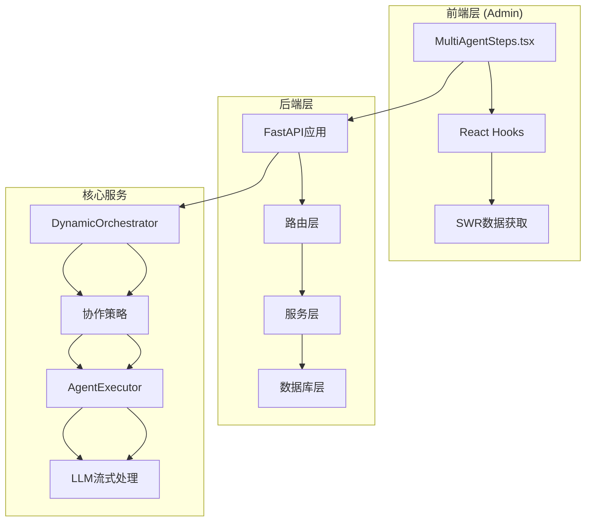
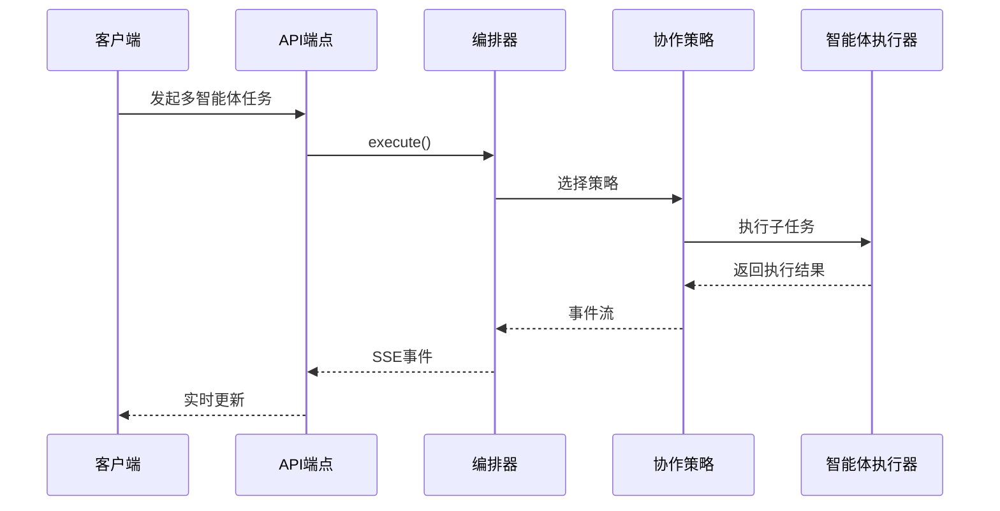
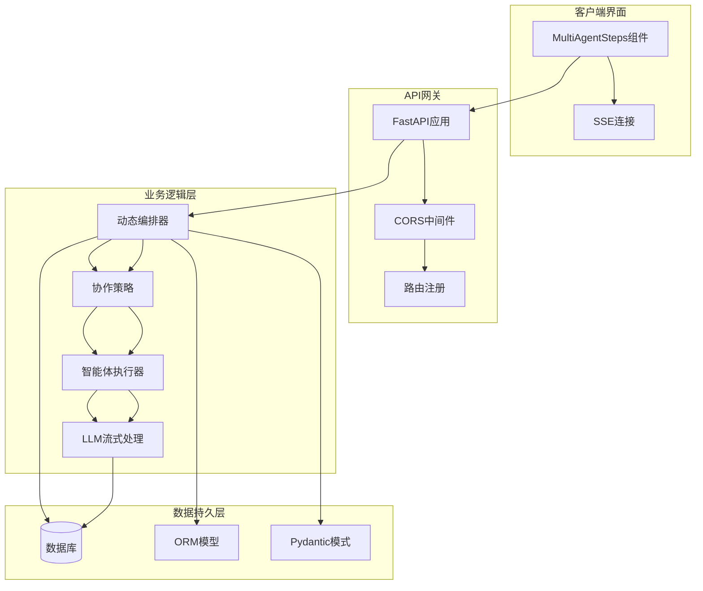
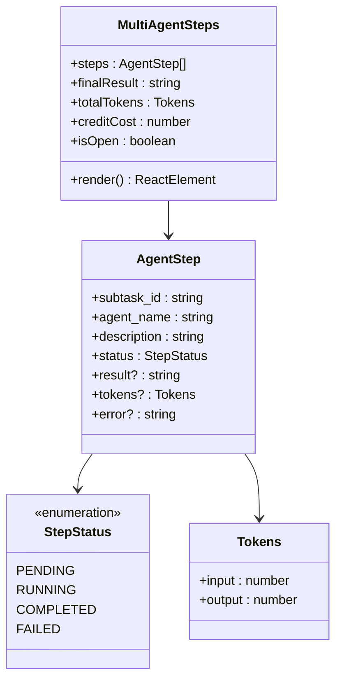
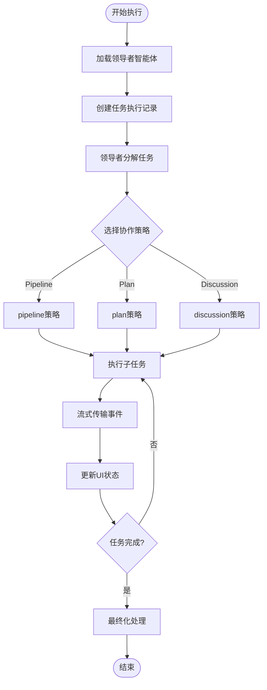
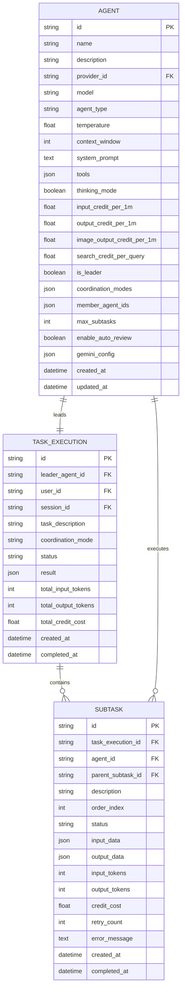
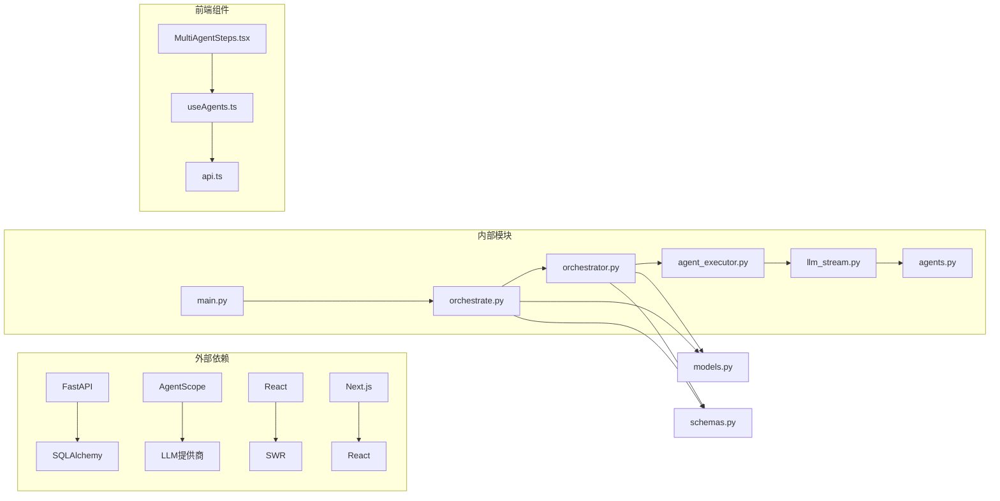

# 多智能体步骤显示

<cite>
**本文档引用的文件**
- [main.py](file://backend/main.py)
- [orchestrator.py](file://backend/services/orchestrator.py)
- [agent_executor.py](file://backend/services/agent_executor.py)
- [orchestrate.py](file://backend/routers/orchestrate.py)
- [models.py](file://backend/models.py)
- [schemas.py](file://backend/schemas.py)
- [llm_stream.py](file://backend/services/llm_stream.py)
- [agents.py](file://backend/agents.py)
- [MultiAgentSteps.tsx](file://backend/admin/src/components/admin/agents/MultiAgentSteps.tsx)
- [useAgents.ts](file://backend/admin/src/hooks/useAgents.ts)
</cite>

## 目录
1. [简介](#简介)
2. [项目结构](#项目结构)
3. [核心组件](#核心组件)
4. [架构概览](#架构概览)
5. [详细组件分析](#详细组件分析)
6. [依赖关系分析](#依赖关系分析)
7. [性能考虑](#性能考虑)
8. [故障排除指南](#故障排除指南)
9. [结论](#结论)

## 简介

这是一个基于FastAPI和React的多智能体协作系统，专门设计用于实时显示多智能体任务执行的步骤和进度。该系统实现了动态多智能体编排，支持管道式、计划式和讨论式三种协作策略，并通过Server-Sent Events (SSE) 实时流式传输执行状态。

系统的核心功能包括：
- 多智能体任务编排和执行
- 实时步骤跟踪和状态显示
- 流式事件传输
- 智能体生命周期管理
- 令牌使用统计和成本计算

## 项目结构

**图表来源**
- [main.py](file://backend/main.py#L84-L125)
- [orchestrator.py](file://backend/services/orchestrator.py#L560-L671)
- [MultiAgentSteps.tsx](file://backend/admin/src/components/admin/agents/MultiAgentSteps.tsx#L35-L118)

**章节来源**
- [main.py](file://backend/main.py#L1-L125)
- [orchestrate.py](file://backend/routers/orchestrate.py#L1-L183)

## 核心组件

### 动态编排器 (DynamicOrchestrator)

DynamicOrchestrator是整个系统的核心，负责协调智能体任务执行。它实现了以下关键功能：

- **任务分解**: 通过领导者智能体分析用户需求，将其分解为多个子任务
- **策略选择**: 根据任务特性自动选择最适合的协作策略
- **执行监控**: 实时跟踪每个子任务的执行状态
- **结果聚合**: 将多个智能体的输出整合为最终结果

### 协作策略系统

系统支持三种不同的协作策略：

1. **管道式 (Pipeline)**: 线性或并行的任务执行
2. **计划式 (Plan)**: 基于依赖关系的复杂任务编排
3. **讨论式 (Discussion)**: 多轮对话式的智能体讨论

### 事件驱动架构

系统采用事件驱动的方式，通过`OrchestrationEvent`类封装所有执行状态变化：

**图表来源**
- [orchestrator.py](file://backend/services/orchestrator.py#L580-L671)
- [orchestrate.py](file://backend/routers/orchestrate.py#L46-L70)

**章节来源**
- [orchestrator.py](file://backend/services/orchestrator.py#L560-L807)
- [agent_executor.py](file://backend/services/agent_executor.py#L62-L284)

## 架构概览

**图表来源**
- [main.py](file://backend/main.py#L84-L104)
- [orchestrator.py](file://backend/services/orchestrator.py#L1-L800)
- [models.py](file://backend/models.py#L167-L285)

## 详细组件分析

### 多智能体步骤显示组件

MultiAgentSteps.tsx是前端的核心组件，负责实时显示多智能体任务的执行状态：

**图表来源**
- [MultiAgentSteps.tsx](file://backend/admin/src/components/admin/agents/MultiAgentSteps.tsx#L11-L26)

组件特性：
- **折叠展开**: 支持折叠/展开显示详细的执行步骤
- **状态指示**: 不同状态使用不同的图标和颜色
- **实时更新**: 通过SSE接收实时事件更新
- **结果展示**: 支持Markdown渲染的富文本结果展示
- **统计信息**: 显示总令牌使用量和积分消耗

### 事件流处理

系统通过Server-Sent Events实现实时事件流：

**图表来源**
- [orchestrator.py](file://backend/services/orchestrator.py#L580-L671)

**章节来源**
- [MultiAgentSteps.tsx](file://backend/admin/src/components/admin/agents/MultiAgentSteps.tsx#L35-L118)
- [orchestrate.py](file://backend/routers/orchestrate.py#L26-L70)

### 数据模型设计

系统使用清晰的数据模型来管理多智能体协作：

**图表来源**
- [models.py](file://backend/models.py#L238-L285)

**章节来源**
- [models.py](file://backend/models.py#L167-L344)
- [schemas.py](file://backend/schemas.py#L333-L387)

## 依赖关系分析

**图表来源**
- [main.py](file://backend/main.py#L32-L46)
- [orchestrator.py](file://backend/services/orchestrator.py#L1-L25)
- [agent_executor.py](file://backend/services/agent_executor.py#L1-L15)

系统的关键依赖关系：
- **后端**: FastAPI提供Web框架，SQLAlchemy管理数据库，AgentScope处理智能体交互
- **前端**: React + Next.js提供用户界面，SWR处理数据获取和缓存
- **通信**: SSE实现实时事件传输，REST API提供数据接口

**章节来源**
- [main.py](file://backend/main.py#L32-L46)
- [useAgents.ts](file://backend/admin/src/hooks/useAgents.ts#L1-L52)

## 性能考虑

### 流式处理优化

系统采用异步流式处理来优化性能：

1. **内存效率**: 使用AsyncGenerator避免一次性加载大量数据
2. **网络优化**: SSE减少HTTP请求开销
3. **并发控制**: 智能体执行使用asyncio.gather实现并行处理

### 缓存策略

- **模型缓存**: AgentExecutor缓存智能体实例和模型配置
- **数据库连接**: 使用连接池管理数据库连接
- **前端缓存**: SWR提供智能的缓存和重新验证机制

### 成本控制

- **令牌统计**: 精确跟踪每个智能体的输入输出令牌使用
- **积分计算**: 基于实际使用量计算积分消耗
- **超时控制**: 设置合理的执行超时防止资源泄露

## 故障排除指南

### 常见问题及解决方案

1. **WebSocket连接失败**
   - 检查CORS配置
   - 验证代理服务器设置
   - 确认防火墙允许相关端口

2. **智能体执行超时**
   - 检查LLM提供商API密钥
   - 验证网络连接稳定性
   - 调整超时参数

3. **事件流中断**
   - 检查服务器日志
   - 验证SSE连接状态
   - 确认客户端网络状况

### 调试工具

- **服务器端**: 启用详细日志记录
- **客户端**: 使用浏览器开发者工具监控SSE连接
- **数据库**: 监控查询性能和连接池状态

**章节来源**
- [main.py](file://backend/main.py#L15-L30)
- [orchestrator.py](file://backend/services/orchestrator.py#L658-L671)

## 结论

多智能体步骤显示系统是一个高度模块化的分布式应用程序，成功实现了复杂的多智能体协作和实时状态展示。系统的主要优势包括：

1. **架构清晰**: 清晰的分层架构便于维护和扩展
2. **实时性强**: 基于SSE的事件驱动架构提供流畅的用户体验
3. **可扩展性**: 插件化的协作策略支持未来功能扩展
4. **性能优化**: 异步处理和缓存策略确保系统高效运行

该系统为多智能体应用场景提供了完整的解决方案，包括任务编排、状态跟踪、实时通信和成本控制等核心功能。通过模块化设计和清晰的接口定义，系统具有良好的可维护性和扩展性。