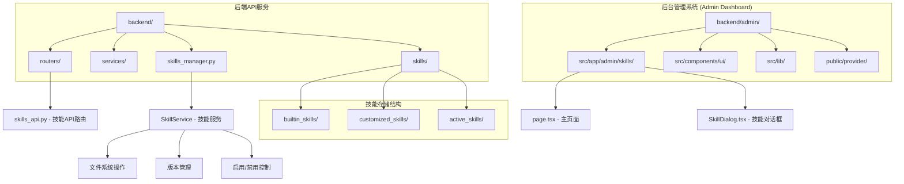
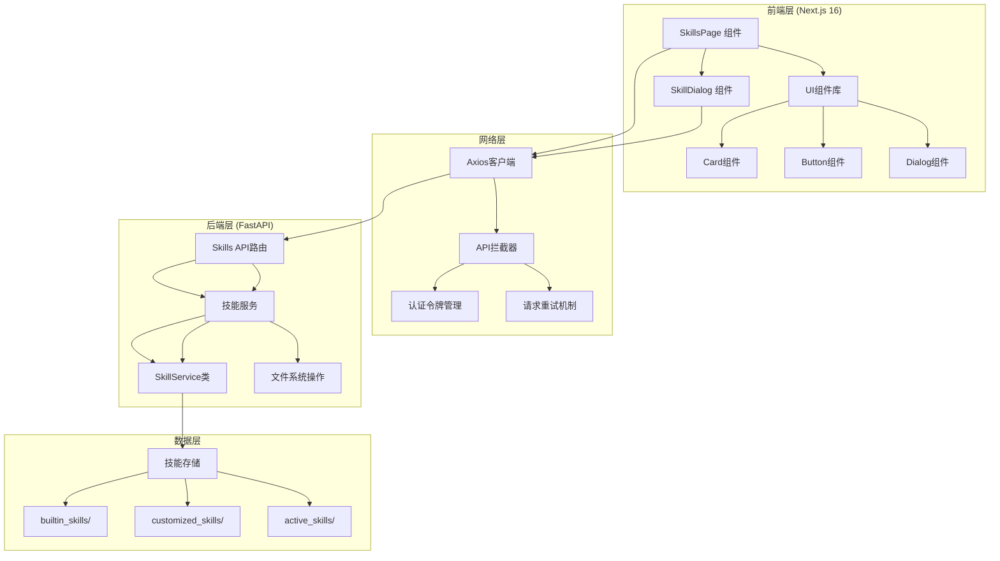
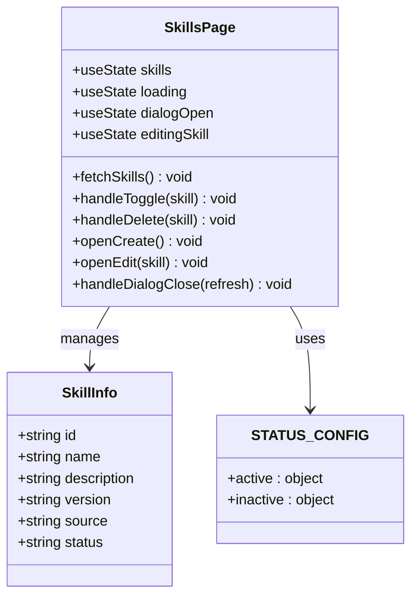
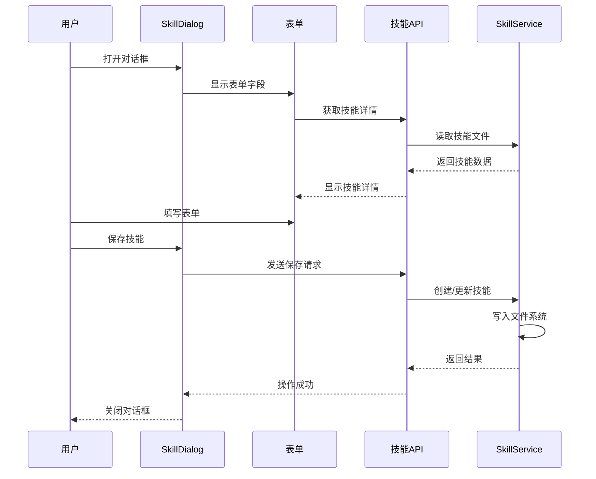
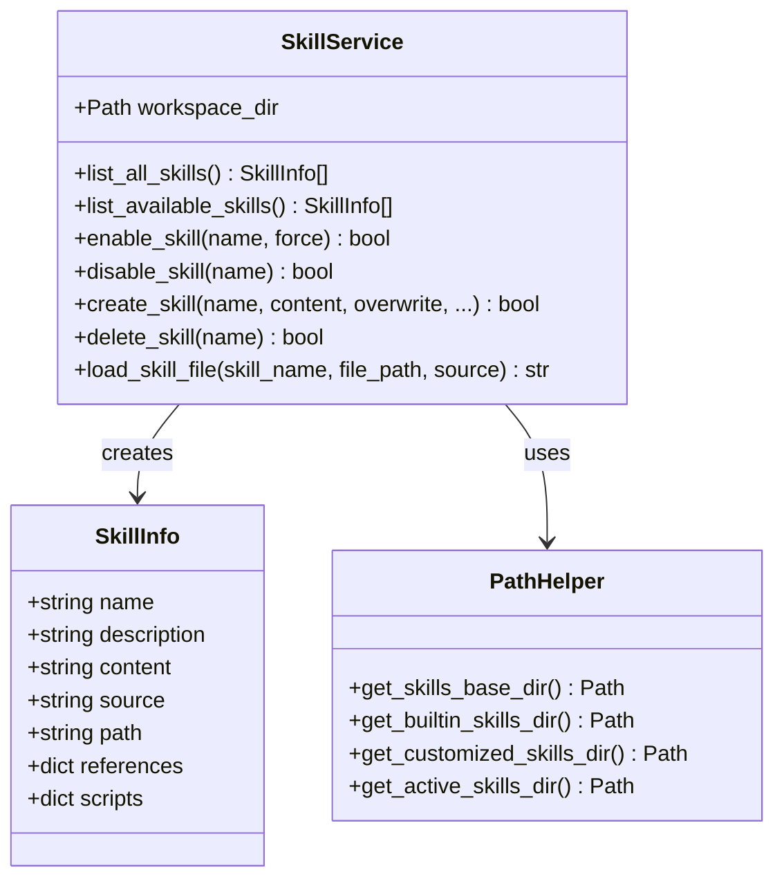
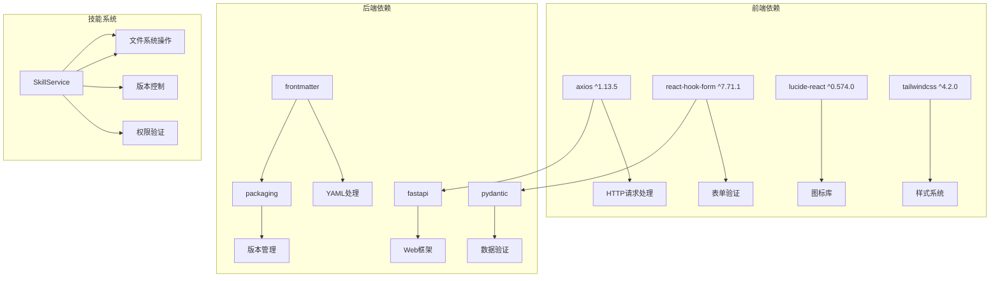
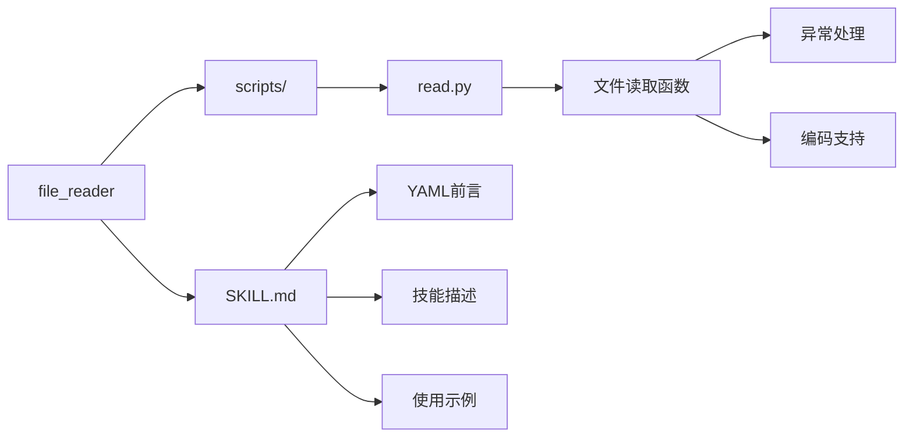
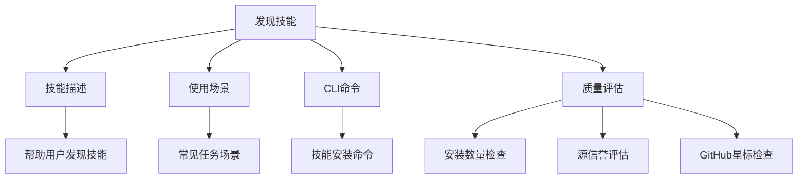

# 技能管理后台界面

<cite>
**本文档引用的文件**
- [backend/admin/src/app/admin/skills/page.tsx](file://backend/admin/src/app/admin/skills/page.tsx)
- [backend/admin/src/app/admin/skills/SkillDialog.tsx](file://backend/admin/src/app/admin/skills/SkillDialog.tsx)
- [backend/routers/skills_api.py](file://backend/routers/skills_api.py)
- [backend/skills_manager.py](file://backend/skills_manager.py)
- [backend/admin/src/lib/axios.ts](file://backend/admin/src/lib/axios.ts)
- [backend/main.py](file://backend/main.py)
- [backend/skills/builtin_skills/file_reader/scripts/read.py](file://backend/skills/builtin_skills/file_reader/scripts/read.py)
- [backend/skills/builtin_skills/file_reader/SKILL.md](file://backend/skills/builtin_skills/file_reader/SKILL.md)
- [backend/skills/customized_skills/found_SKILLs/SKILL.md](file://backend/skills/customized_skills/found_SKILLs/SKILL.md)
- [backend/skills/active_skills/found_SKILLs/SKILL.md](file://backend/skills/active_skills/found_SKILLs/SKILL.md)
- [backend/admin/src/components/ui/card.tsx](file://backend/admin/src/components/ui/card.tsx)
- [backend/admin/src/components/ui/button.tsx](file://backend/admin/src/components/ui/button.tsx)
- [backend/admin/package.json](file://backend/admin/package.json)
- [README.md](file://README.md)
</cite>

## 目录
1. [简介](#简介)
2. [项目结构](#项目结构)
3. [核心组件](#核心组件)
4. [架构概览](#架构概览)
5. [详细组件分析](#详细组件分析)
6. [依赖关系分析](#依赖关系分析)
7. [性能考虑](#性能考虑)
8. [故障排除指南](#故障排除指南)
9. [结论](#结论)

## 简介

技能管理后台界面是无限剧情剧场系统中的一个关键组件，负责管理Agent的扩展能力。该系统采用声明式工具包设计，支持热插拔和版本控制，允许管理员创建、编辑、删除和启用/停用各种技能。

系统的核心特性包括：
- 双重技能体系：内置技能和自定义技能
- 版本控制系统：支持技能版本管理和升级
- 热插拔机制：无需重启服务即可启用或停用技能
- 前端可视化管理界面：提供直观的技能管理体验

## 项目结构

该项目采用前后端分离的架构设计，主要包含以下目录结构：



**图表来源**
- [backend/admin/src/app/admin/skills/page.tsx:1-185](file://backend/admin/src/app/admin/skills/page.tsx#L1-L185)
- [backend/routers/skills_api.py:1-207](file://backend/routers/skills_api.py#L1-L207)
- [backend/skills_manager.py:1-408](file://backend/skills_manager.py#L1-L408)

**章节来源**
- [README.md:37-54](file://README.md#L37-L54)
- [backend/admin/package.json:1-73](file://backend/admin/package.json#L1-L73)

## 核心组件

技能管理后台界面由多个核心组件构成，每个组件都有特定的功能和职责：

### 前端组件层

1. **技能主页面** (`SkillsPage`)
   - 负责展示所有技能列表
   - 提供技能状态管理和操作按钮
   - 实现技能的启用/停用功能

2. **技能对话框** (`SkillDialog`)
   - 支持创建新技能和编辑现有技能
   - 提供技能内容的Markdown编辑器
   - 实现技能的版本控制和自动启用功能

3. **UI组件库**
   - 基于Radix UI和Tailwind CSS构建
   - 提供卡片、按钮、对话框等基础组件
   - 支持响应式设计和无障碍访问

### 后端服务层

1. **技能API路由器** (`skills_api.py`)
   - 定义RESTful API端点
   - 处理技能的CRUD操作
   - 实现权限验证和错误处理

2. **技能服务** (`SkillService`)
   - 管理技能的生命周期
   - 处理文件系统操作
   - 实现技能同步和版本控制

**章节来源**
- [backend/admin/src/app/admin/skills/page.tsx:37-185](file://backend/admin/src/app/admin/skills/page.tsx#L37-L185)
- [backend/admin/src/app/admin/skills/SkillDialog.tsx:44-235](file://backend/admin/src/app/admin/skills/SkillDialog.tsx#L44-L235)
- [backend/routers/skills_api.py:123-207](file://backend/routers/skills_api.py#L123-L207)
- [backend/skills_manager.py:263-408](file://backend/skills_manager.py#L263-L408)

## 架构概览

系统采用分层架构设计，从前端界面到后端服务形成清晰的层次结构：



**图表来源**
- [backend/admin/src/lib/axios.ts:1-105](file://backend/admin/src/lib/axios.ts#L1-L105)
- [backend/routers/skills_api.py:13-17](file://backend/routers/skills_api.py#L13-L17)
- [backend/skills_manager.py:263-287](file://backend/skills_manager.py#L263-L287)

系统的关键设计原则：
- **分离关注点**：前端负责用户界面，后端负责业务逻辑
- **API优先**：通过RESTful API实现前后端通信
- **文件系统驱动**：技能以文件形式存储，便于版本控制
- **权限控制**：管理员认证确保系统安全

## 详细组件分析

### 技能主页面组件分析

技能主页面是用户与技能系统交互的主要界面，实现了完整的技能管理功能：



**图表来源**
- [backend/admin/src/app/admin/skills/page.tsx:23-35](file://backend/admin/src/app/admin/skills/page.tsx#L23-L35)

#### 核心功能实现

1. **技能列表管理**
   - 通过API获取技能数据
   - 实时状态显示和更新
   - 加载状态指示器

2. **技能状态控制**
   - 启用/停用切换逻辑
   - 状态配置映射
   - 用户反馈机制

3. **操作权限控制**
   - 自定义技能删除保护
   - 内置技能只读保护
   - 权限验证机制

**章节来源**
- [backend/admin/src/app/admin/skills/page.tsx:37-185](file://backend/admin/src/app/admin/skills/page.tsx#L37-L185)

### 技能对话框组件分析

技能对话框提供了完整的技能创建和编辑功能：



**图表来源**
- [backend/admin/src/app/admin/skills/SkillDialog.tsx:90-119](file://backend/admin/src/app/admin/skills/SkillDialog.tsx#L90-L119)
- [backend/routers/skills_api.py:140-170](file://backend/routers/skills_api.py#L140-L170)

#### 表单验证和数据处理

1. **表单字段设计**
   - 技能标识符（只读，用于创建）
   - 技能描述（必填）
   - 版本号（默认1.0）
   - 技能内容（Markdown格式）

2. **数据验证规则**
   - 技能标识符格式验证（字母、数字、下划线、中划线）
   - 必填字段验证
   - 格式化输入处理

3. **自动启用功能**
   - 新建技能时的自动启用选项
   - 默认启用状态设置

**章节来源**
- [backend/admin/src/app/admin/skills/SkillDialog.tsx:44-235](file://backend/admin/src/app/admin/skills/SkillDialog.tsx#L44-L235)

### 后端API服务分析

后端API服务提供了完整的技能管理RESTful接口：

```mermaid
flowchart TD
A[技能API请求] --> B{请求类型}
B --> |GET /| C[列出所有技能]
B --> |GET /{skill_name}| D[获取技能详情]
B --> |POST /| E[创建新技能]
B --> |PUT /{skill_name}| F[更新技能]
B --> |DELETE /{skill_name}| G[删除技能]
B --> |POST /{skill_name}/toggle| H[切换技能状态]
C --> I[SkillService.list_all_skills]
D --> J[SkillService.list_available_skills]
E --> K[SkillService.create_skill]
F --> L[SkillService.create_skill overwrite]
G --> M[SkillService.disable_skill + delete_skill]
H --> N[enable_skill/disable_skill]
I --> O[返回技能列表]
J --> P[返回技能详情]
K --> Q[返回新技能信息]
L --> R[返回更新后的技能]
M --> S[返回删除成功信息]
N --> T[返回状态切换结果]
```

**图表来源**
- [backend/routers/skills_api.py:123-207](file://backend/routers/skills_api.py#L123-L207)
- [backend/skills_manager.py:269-367](file://backend/skills_manager.py#L269-L367)

#### 技能存储和版本管理

1. **文件系统结构**
   - `builtin_skills/`：内置技能目录
   - `customized_skills/`：自定义技能目录
   - `active_skills/`：当前启用的技能目录

2. **版本控制机制**
   - YAML前言元数据存储
   - 版本号提取和比较
   - 自动版本升级支持

3. **技能同步策略**
   - 自定义技能覆盖内置技能
   - 文件差异检测
   - 热插拔更新机制

**章节来源**
- [backend/routers/skills_api.py:26-117](file://backend/routers/skills_api.py#L26-L117)
- [backend/skills_manager.py:180-226](file://backend/skills_manager.py#L180-L226)

### 技能服务类分析

SkillService类是技能管理的核心业务逻辑组件：



**图表来源**
- [backend/skills_manager.py:263-408](file://backend/skills_manager.py#L263-L408)

#### 文件系统操作和安全控制

1. **路径遍历防护**
   - 严格的文件路径验证
   - 前缀检查防止目录遍历
   - 安全的文件读取机制

2. **技能文件结构**
   - `SKILL.md`：技能描述和元数据
   - `scripts/`：Python脚本文件
   - `references/`：引用文件和资源

3. **错误处理和日志记录**
   - 详细的错误信息
   - 操作日志记录
   - 异常情况下的回滚机制

**章节来源**
- [backend/skills_manager.py:370-408](file://backend/skills_manager.py#L370-L408)

## 依赖关系分析

系统各组件之间的依赖关系形成了清晰的层次结构：



**图表来源**
- [backend/admin/package.json:11-49](file://backend/admin/package.json#L11-L49)
- [backend/routers/skills_api.py:4-6](file://backend/routers/skills_api.py#L4-L6)

### 技能示例分析

系统包含多种类型的技能示例，展示了不同的功能实现：

#### 文件读取技能

内置的文件读取技能演示了基本的技能结构：



**图表来源**
- [backend/skills/builtin_skills/file_reader/SKILL.md:1-12](file://backend/skills/builtin_skills/file_reader/SKILL.md#L1-L12)
- [backend/skills/builtin_skills/file_reader/scripts/read.py:1-21](file://backend/skills/builtin_skills/file_reader/scripts/read.py#L1-L21)

#### 发现技能

自定义的发现技能展示了复杂技能的实现：



**图表来源**
- [backend/skills/customized_skills/found_SKILLs/SKILL.md:1-152](file://backend/skills/customized_skills/found_SKILLs/SKILL.md#L1-L152)

**章节来源**
- [backend/skills/builtin_skills/file_reader/SKILL.md:1-12](file://backend/skills/builtin_skills/file_reader/SKILL.md#L1-L12)
- [backend/skills/builtin_skills/file_reader/scripts/read.py:1-21](file://backend/skills/builtin_skills/file_reader/scripts/read.py#L1-L21)
- [backend/skills/customized_skills/found_SKILLs/SKILL.md:1-152](file://backend/skills/customized_skills/found_SKILLs/SKILL.md#L1-L152)

## 性能考虑

技能管理系统的性能优化主要体现在以下几个方面：

### 前端性能优化

1. **组件懒加载**
   - 技能对话框按需加载
   - 图标组件动态导入
   - 减少初始包体积

2. **状态管理优化**
   - 局部状态更新
   - 避免不必要的重新渲染
   - 使用React.memo优化组件

3. **网络请求优化**
   - 请求缓存机制
   - 并发请求限制
   - 错误重试策略

### 后端性能优化

1. **文件系统操作优化**
   - 批量文件操作
   - 缓存常用技能信息
   - 异步文件处理

2. **数据库查询优化**
   - 技能状态查询缓存
   - 分页查询支持
   - 索引优化

3. **内存管理**
   - 技能内容缓存控制
   - 大文件处理优化
   - 连接池管理

## 故障排除指南

### 常见问题和解决方案

#### 技能加载失败

**问题症状**：技能列表显示为空或加载超时

**可能原因**：
1. 技能文件格式错误
2. 文件权限问题
3. 网络连接异常

**解决步骤**：
1. 检查`SKILL.md`文件格式是否正确
2. 验证文件权限设置
3. 确认API服务正常运行

#### 技能启用失败

**问题症状**：技能无法启用或状态切换异常

**可能原因**：
1. 文件系统写权限不足
2. 技能内容验证失败
3. 版本冲突

**解决步骤**：
1. 检查目标目录写权限
2. 验证技能内容格式
3. 清理缓存后重试

#### 前端界面异常

**问题症状**：页面显示错误或功能失效

**可能原因**：
1. Axios配置问题
2. 认证令牌过期
3. 组件状态异常

**解决步骤**：
1. 检查API基础URL配置
2. 验证认证令牌有效性
3. 清除浏览器缓存

**章节来源**
- [backend/admin/src/lib/axios.ts:44-102](file://backend/admin/src/lib/axios.ts#L44-L102)
- [backend/admin/src/app/admin/skills/page.tsx:44-54](file://backend/admin/src/app/admin/skills/page.tsx#L44-L54)

## 结论

技能管理后台界面是一个功能完整、设计合理的系统组件，它成功地实现了以下目标：

### 技术成就

1. **模块化设计**：清晰的前后端分离架构
2. **可扩展性**：支持内置和自定义技能的混合管理
3. **安全性**：完善的权限控制和文件系统保护
4. **用户体验**：直观的界面设计和流畅的操作流程

### 系统优势

1. **版本控制**：基于文件系统的自然版本管理
2. **热插拔机制**：无需重启即可更新技能
3. **权限隔离**：内置技能的保护机制
4. **错误处理**：完善的异常处理和用户反馈

### 未来发展方向

1. **性能优化**：进一步优化大技能集的处理效率
2. **功能扩展**：添加技能依赖管理和自动更新功能
3. **监控增强**：增加技能使用统计和性能监控
4. **用户体验**：改进批量操作和搜索功能

该系统为无限剧情剧场平台提供了强大的技能管理能力，是整个多智能体系统的重要基础设施。