# 提示词模板管理系统

<cite>
**本文档引用的文件**
- [main.py](file://backend/main.py)
- [models.py](file://backend/models.py)
- [schemas.py](file://backend/schemas.py)
- [prompt_templates.py](file://backend/routers/prompt_templates.py)
- [skills_api.py](file://backend/routers/skills_api.py)
- [llm_stream.py](file://backend/services/llm_stream.py)
- [skill_tools.py](file://backend/services/skill_tools.py)
- [skills_manager.py](file://backend/skills_manager.py)
- [agents.py](file://backend/agents.py)
- [billing.py](file://backend/services/billing.py)
- [database.py](file://backend/database.py)
- [auth.py](file://backend/auth.py)
- [config.py](file://backend/config.py)
- [requirements.txt](file://backend/requirements.txt)
- [page.tsx](file://frontend/src/app/create-game/page.tsx)
- [TemplateList.tsx](file://frontend/src/components/create-game/TemplateList.tsx)
- [TemplateDetails.tsx](file://frontend/src/components/create-game/TemplateDetails.tsx)
- [PromptTemplateDialog.tsx](file://frontend/admin/src/app/admin/prompt-templates/PromptTemplateDialog.tsx)
- [SkillDialog.tsx](file://frontend/admin/src/app/admin/skills/SkillDialog.tsx)
- [data.ts](file://frontend/src/components/create-game/data.ts)
</cite>

## 更新摘要
**变更内容**
- 新增技能驱动方法替代旧任务提示系统
- 更新提示词模板与技能系统的集成架构
- 新增技能管理API和前端管理界面
- 移除对传统任务系统的依赖，转向CoPaw对齐的技能方法

## 目录
1. [项目概述](#项目概述)
2. [系统架构](#系统架构)
3. [核心组件](#核心组件)
4. [数据库设计](#数据库设计)
5. [API接口设计](#api接口设计)
6. [前端界面](#前端界面)
7. [服务层实现](#服务层实现)
8. [安全机制](#安全机制)
9. [部署配置](#部署配置)
10. [总结](#总结)

## 项目概述

提示词模板管理系统是一个基于FastAPI开发的AI内容生成平台，专门用于管理和使用预定义的提示词模板来生成各种类型的游戏内容。系统采用全新的技能驱动方法，替代了传统的任务提示系统，通过CoPaw对齐的技能架构为用户提供更灵活、更强大的AI内容创作工具。

该系统支持多种模板类型，包括故事基础设定、角色设定、场景描述、分镜脚本等，同时集成了完整的技能管理系统，支持内置技能、自定义技能和活动技能的动态加载和管理。

## 系统架构

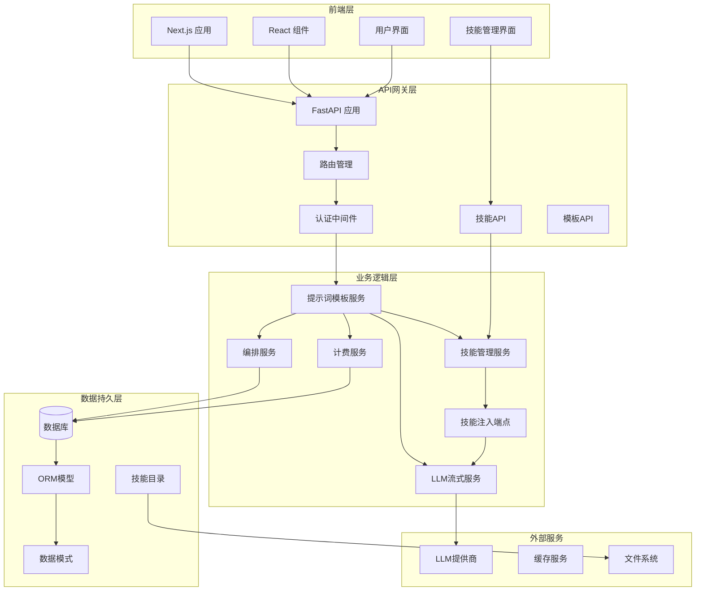

**图表来源**
- [main.py:84-104](file://backend/main.py#L84-L104)
- [prompt_templates.py:25-29](file://backend/routers/prompt_templates.py#L25-L29)
- [skills_api.py:123-128](file://backend/routers/skills_api.py#L123-L128)
- [database.py:25-30](file://backend/database.py#L25-L30)

## 核心组件

### 1. 提示词模板模型

系统的核心数据结构是`PromptTemplate`模型，它定义了AI内容生成的模板规范：

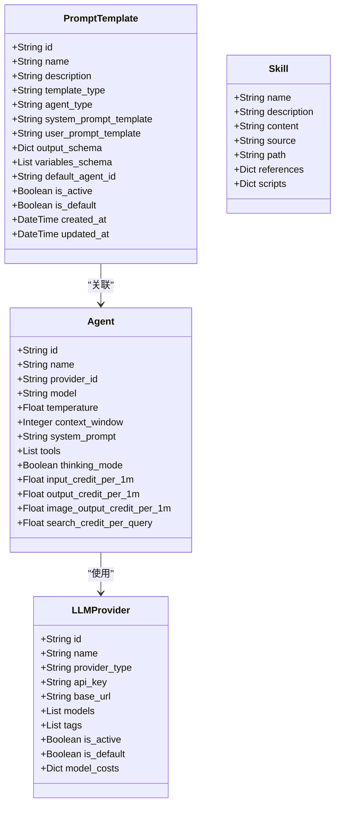

**图表来源**
- [models.py:287-322](file://backend/models.py#L287-L322)
- [models.py:167-207](file://backend/models.py#L167-L207)
- [models.py:118-142](file://backend/models.py#L118-L142)
- [skills_manager.py:19-37](file://backend/skills_manager.py#L19-L37)

### 2. 技能系统架构

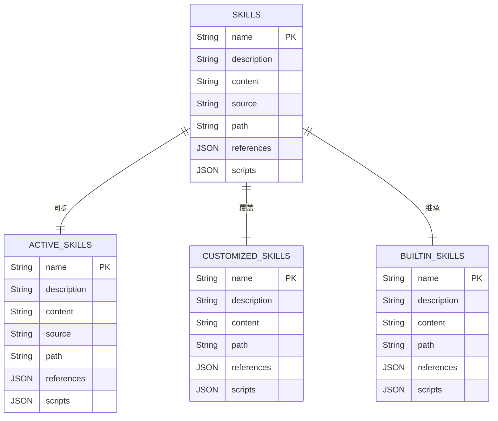

**图表来源**
- [skills_manager.py:19-37](file://backend/skills_manager.py#L19-L37)
- [skills_manager.py:263-408](file://backend/skills_manager.py#L263-L408)

**章节来源**
- [models.py:287-322](file://backend/models.py#L287-L322)
- [schemas.py:481-519](file://backend/schemas.py#L481-L519)
- [skills_manager.py:1-408](file://backend/skills_manager.py#L1-L408)

## 数据库设计

### 核心表结构

系统采用异步SQLAlchemy ORM进行数据库操作，主要数据表包括：

1. **PromptTemplate表** - 存储提示词模板定义
2. **Agent表** - 智能体配置信息
3. **LLMProvider表** - LLM提供商配置
4. **User表** - 用户信息和积分余额
5. **CreditTransaction表** - 积分交易记录
6. **技能相关表** - 支持技能的存储和管理

### 技能目录结构

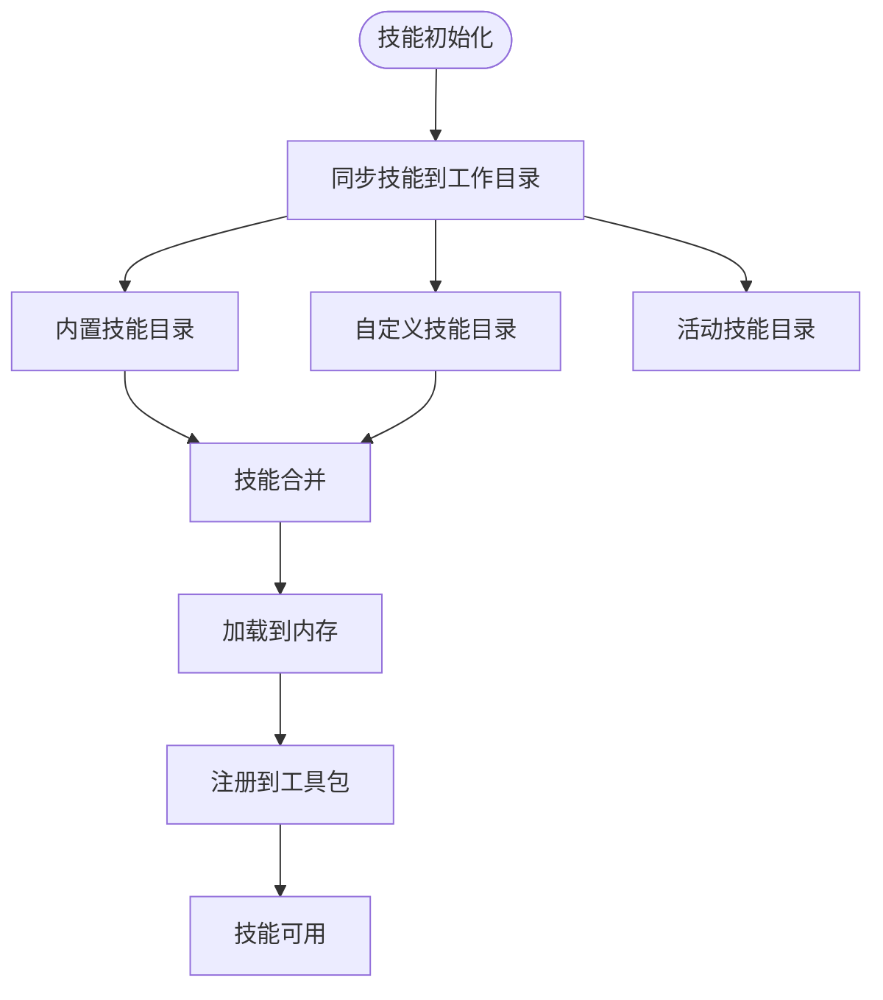

**图表来源**
- [skills_manager.py:180-225](file://backend/skills_manager.py#L180-L225)
- [skills_manager.py:228-231](file://backend/skills_manager.py#L228-L231)

**章节来源**
- [database.py:1-31](file://backend/database.py#L1-L31)
- [main.py:48-82](file://backend/main.py#L48-L82)
- [skills_manager.py:1-408](file://backend/skills_manager.py#L1-L408)

## API接口设计

### 提示词模板管理API

系统提供完整的提示词模板管理RESTful API：

| 方法 | 路径 | 功能 | 权限 |
|------|------|------|------|
| GET | `/api/prompt-templates/` | 获取模板列表 | 用户/管理员 |
| GET | `/api/prompt-templates/{template_id}` | 获取单个模板 | 用户/管理员 |
| POST | `/api/prompt-templates/` | 创建新模板 | 管理员 |
| PUT | `/api/prompt-templates/{template_id}` | 更新模板 | 管理员 |
| DELETE | `/api/prompt-templates/{template_id}` | 删除模板 | 管理员 |
| POST | `/api/prompt-templates/{template_id}/generate` | 使用模板生成内容 | 用户/管理员 |

### 技能管理API

新增技能管理相关API：

| 方法 | 路径 | 功能 | 权限 |
|------|------|------|------|
| GET | `/api/skills/` | 获取所有技能列表 | 管理员 |
| GET | `/api/skills/{skill_name}` | 获取单个技能详情 | 管理员 |
| POST | `/api/skills/` | 创建新技能 | 管理员 |
| PUT | `/api/skills/{skill_name}` | 更新技能 | 管理员 |
| DELETE | `/api/skills/{skill_name}` | 删除技能 | 管理员 |
| POST | `/api/skills/{skill_name}/toggle` | 切换技能状态 | 管理员 |

### API工作流程

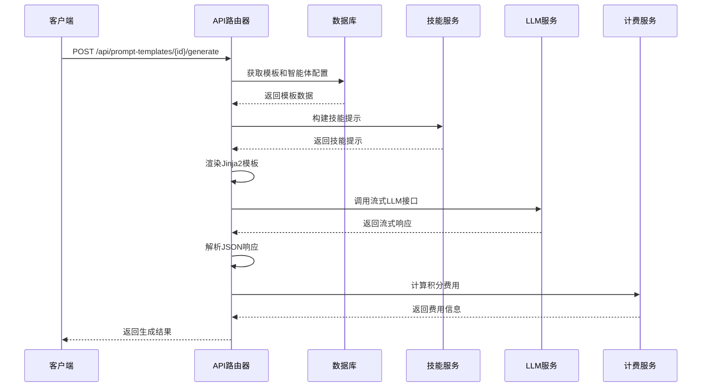

**图表来源**
- [prompt_templates.py:157-275](file://backend/routers/prompt_templates.py#L157-L275)
- [skills_api.py:123-206](file://backend/routers/skills_api.py#L123-L206)
- [llm_stream.py:502-551](file://backend/services/llm_stream.py#L502-L551)

**章节来源**
- [prompt_templates.py:32-154](file://backend/routers/prompt_templates.py#L32-L154)
- [prompt_templates.py:157-275](file://backend/routers/prompt_templates.py#L157-L275)
- [skills_api.py:49-206](file://backend/routers/skills_api.py#L49-L206)

## 前端界面

### 模板选择界面

前端使用Next.js构建了直观的模板选择界面：

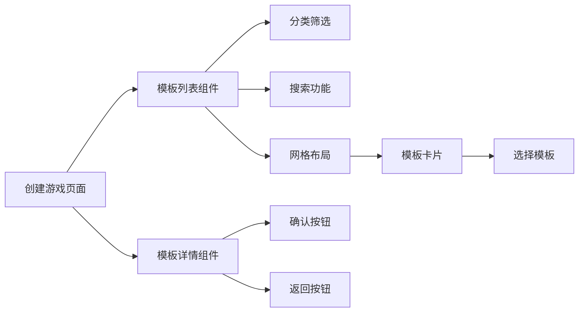

**图表来源**
- [page.tsx:11-23](file://frontend/src/app/create-game/page.tsx#L11-L23)
- [TemplateList.tsx:18-29](file://frontend/src/components/create-game/TemplateList.tsx#L18-L29)
- [TemplateDetails.tsx:15-143](file://frontend/src/components/create-game/TemplateDetails.tsx#L15-L143)

### 技能管理界面

新增技能管理界面，支持技能的创建、编辑和状态管理：

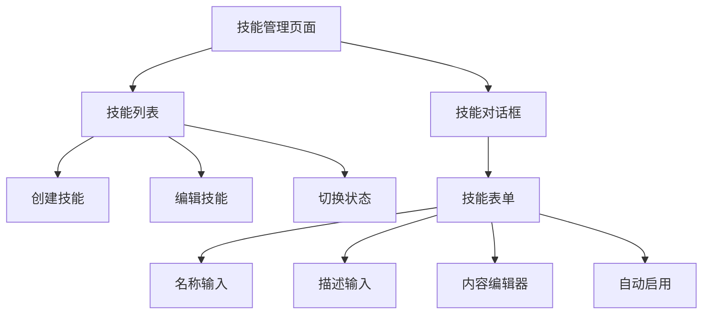

**图表来源**
- [SkillDialog.tsx:44-49](file://frontend/admin/src/app/admin/skills/SkillDialog.tsx#L44-L49)
- [PromptTemplateDialog.tsx:65-135](file://frontend/admin/src/app/admin/prompt-templates/PromptTemplateDialog.tsx#L65-L135)

### 模板数据结构

前端使用TypeScript定义了模板数据结构：

| 字段 | 类型 | 描述 |
|------|------|------|
| id | string | 模板唯一标识符 |
| category | TemplateCategory | 模板分类 |
| name | string | 模板名称 |
| description | string | 模板描述 |
| features | string[] | 特色元素列表 |
| scenarios | string[] | 适用场景列表 |
| color | string | 颜色主题 |
| iconName | string | 图标名称 |
| backgroundImage | string | 背景图片URL |

**章节来源**
- [page.tsx:1-61](file://frontend/src/app/create-game/page.tsx#L1-L61)
- [TemplateList.tsx:1-92](file://frontend/src/components/create-game/TemplateList.tsx#L1-L92)
- [TemplateDetails.tsx:1-143](file://frontend/src/components/create-game/TemplateDetails.tsx#L1-L143)
- [PromptTemplateDialog.tsx:1-417](file://frontend/admin/src/app/admin/prompt-templates/PromptTemplateDialog.tsx#L1-L417)
- [SkillDialog.tsx:1-49](file://frontend/admin/src/app/admin/skills/SkillDialog.tsx#L1-L49)
- [data.ts:1-94](file://frontend/src/components/create-game/data.ts#L1-L94)

## 服务层实现

### LLM流式调用服务

系统实现了统一的LLM流式调用服务，支持多种AI提供商：

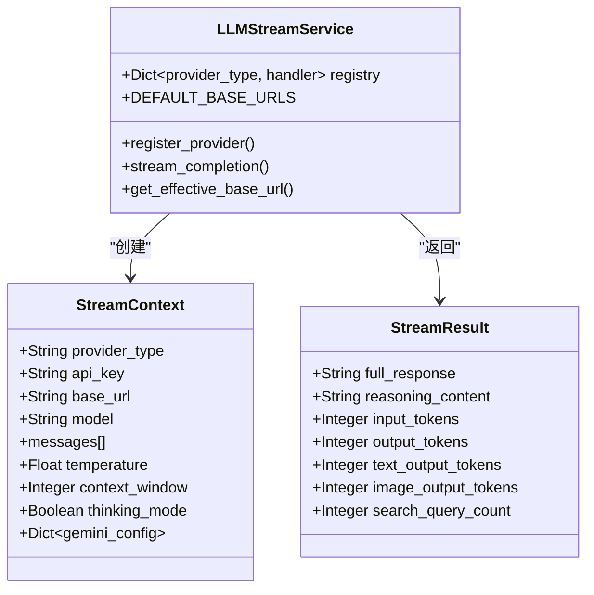

**图表来源**
- [llm_stream.py:11-35](file://backend/services/llm_stream.py#L11-L35)
- [llm_stream.py:47-53](file://backend/services/llm_stream.py#L47-L53)

### 技能注入服务

新增技能注入服务，负责将技能描述注入到系统提示词中：

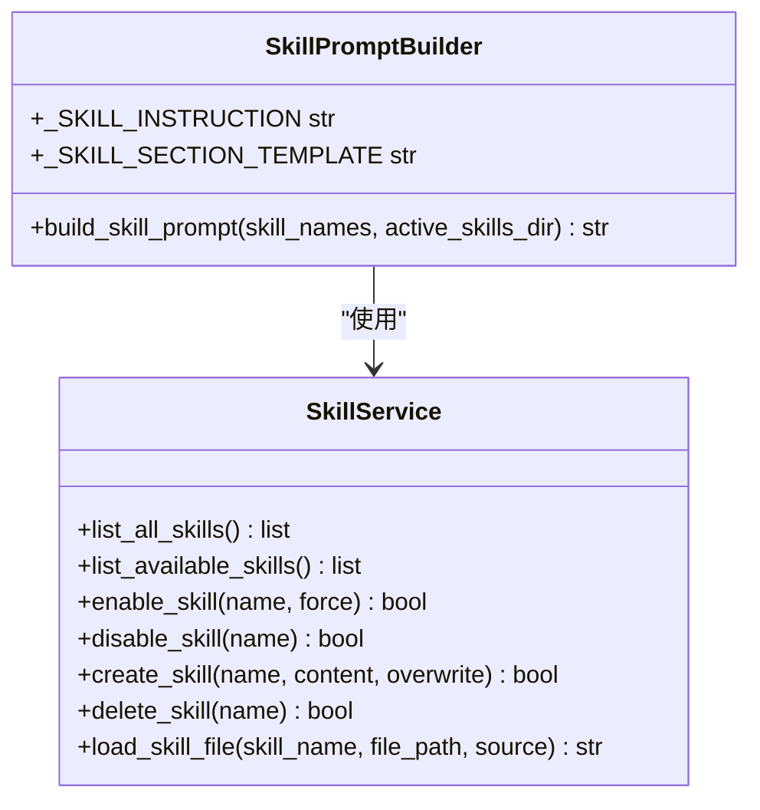

**图表来源**
- [skill_tools.py:28-67](file://backend/services/skill_tools.py#L28-L67)
- [skills_manager.py:263-408](file://backend/skills_manager.py#L263-L408)

### 计费系统

系统实现了灵活的多维度计费系统：

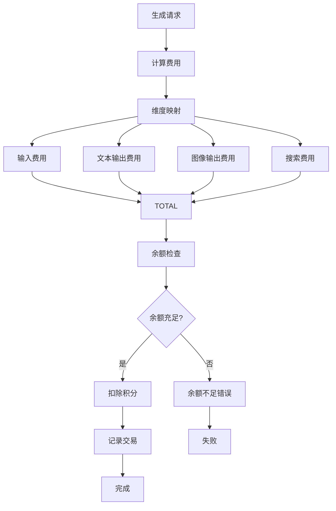

**图表来源**
- [billing.py:230-269](file://backend/services/billing.py#L230-L269)

**章节来源**
- [llm_stream.py:1-551](file://backend/services/llm_stream.py#L1-L551)
- [skill_tools.py:1-67](file://backend/services/skill_tools.py#L1-L67)
- [skills_manager.py:1-408](file://backend/skills_manager.py#L1-L408)
- [billing.py:1-270](file://backend/services/billing.py#L1-L270)

## 安全机制

### 认证授权

系统实现了多层次的安全机制：

1. **JWT令牌管理** - 使用RSA算法进行令牌签名
2. **用户/管理员双角色** - 独立的用户和管理员认证体系
3. **权限控制** - 基于角色的访问控制(RBAC)
4. **密码加密** - 使用bcrypt进行密码哈希

### 安全流程

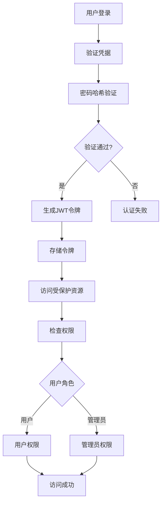

**图表来源**
- [auth.py:30-74](file://backend/auth.py#L30-L74)
- [auth.py:119-156](file://backend/auth.py#L119-L156)

**章节来源**
- [auth.py:1-229](file://backend/auth.py#L1-L229)

## 部署配置

### 环境配置

系统使用Pydantic Settings进行配置管理：

| 配置项 | 默认值 | 用途 |
|--------|--------|------|
| DATABASE_URL | sqlite:///infinite_game.db | 数据库连接字符串 |
| JWT_SECRET_KEY | change-me-in-production | JWT密钥 |
| ACCESS_TOKEN_EXPIRE_MINUTES | 30 | 访问令牌过期时间 |
| REFRESH_TOKEN_EXPIRE_DAYS | 7 | 刷新令牌过期时间 |
| OPENAI_API_KEY | 空 | OpenAI API密钥 |
| CLAUDE_API_KEY | 空 | Claude API密钥 |
| GEMINI_API_KEY | 空 | Gemini API密钥 |

### 依赖管理

系统使用pip进行依赖管理，主要依赖包括：

- **Web框架**: FastAPI 0.129.0+, Uvicorn 0.41.0+
- **数据库**: SQLAlchemy 2.0.46+, asyncpg 0.31.0+, aiosqlite 0.19.0
- **AI服务**: agentscope 1.0.16+, openai 2.21.0+, google-genai 1.65.0
- **认证**: bcrypt 4.0.0+, python-jose 3.3.0
- **前端**: Next.js 14+, React 18+
- **技能系统**: frontmatter 3.0.0+, packaging 21.3.0

**章节来源**
- [config.py:1-40](file://backend/config.py#L1-L40)
- [requirements.txt:1-24](file://backend/requirements.txt#L1-L24)

## 总结

提示词模板管理系统经过重大升级，成功从传统的任务提示系统转向了全新的技能驱动方法。系统的主要特点包括：

1. **技能驱动架构** - 采用CoPaw对齐的方法，技能作为知识/指令文档而非函数调用工具
2. **模块化设计** - 采用分层架构，职责分离明确
3. **多模态支持** - 支持文本、图像等多种AI模型
4. **灵活的模板系统** - 提供多种预定义模板类型
5. **完善的权限管理** - 用户和管理员双角色体系
6. **智能计费系统** - 基于使用量的精确计费
7. **动态技能管理** - 支持内置、自定义和活动技能的动态加载
8. **前后端分离** - 现代化的技术栈组合

该系统为游戏开发者和内容创作者提供了一个强大而易用的AI辅助工具，能够显著提高内容创作效率和质量。通过合理的架构设计和安全机制，系统能够在保证性能的同时确保数据安全和用户体验。

**更新** 系统现已完全支持技能驱动方法，移除了对旧任务提示系统的依赖，实现了与CoPaw框架的完全对齐，为未来的扩展和集成奠定了坚实的基础。