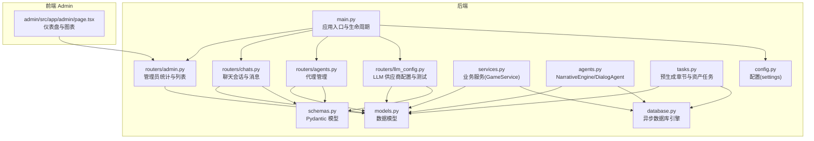
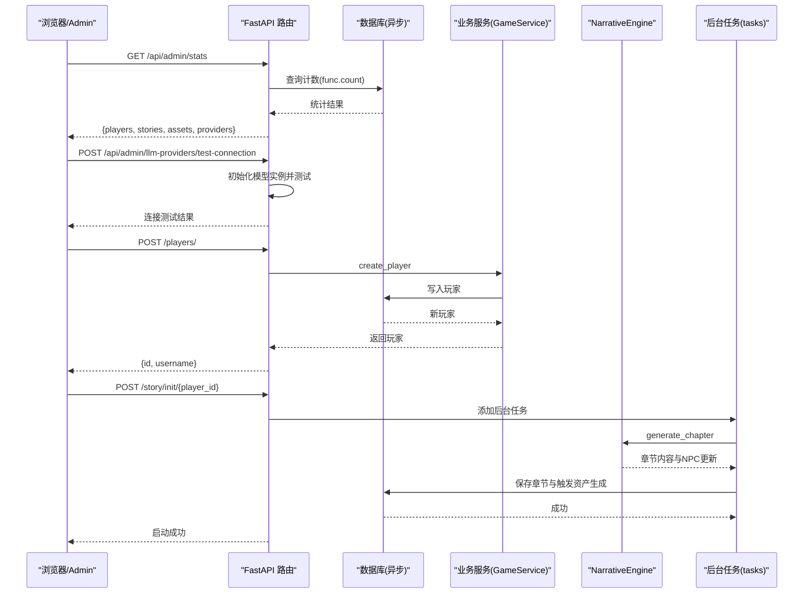
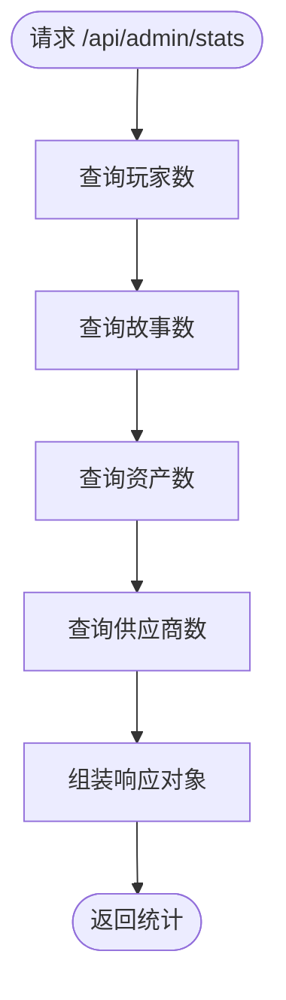
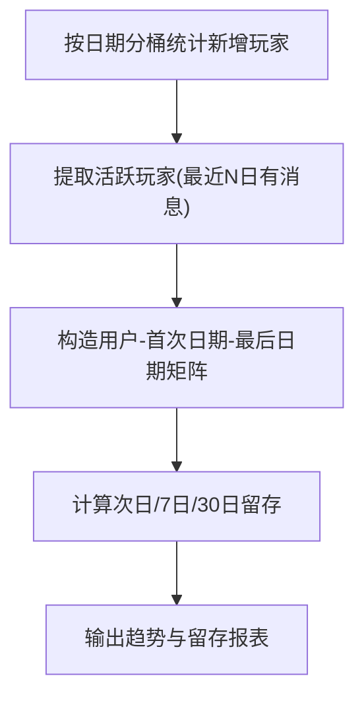
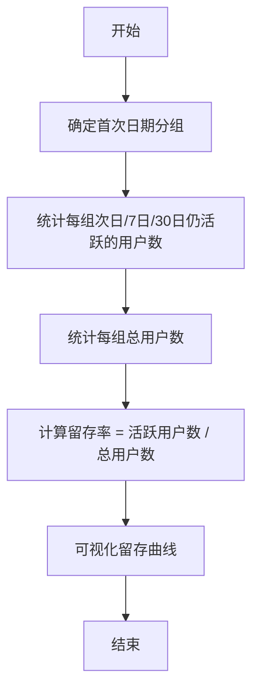
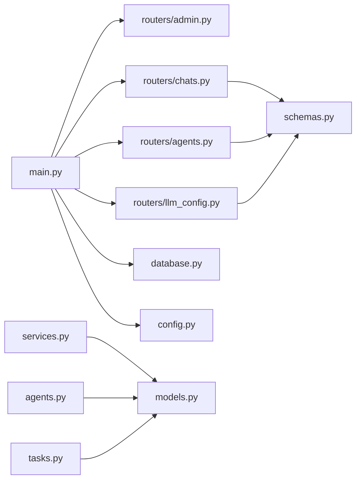

# 数据统计分析

<cite>
**本文引用的文件**
- [backend/models.py](file://backend/models.py)
- [backend/services.py](file://backend/services.py)
- [backend/main.py](file://backend/main.py)
- [backend/schemas.py](file://backend/schemas.py)
- [backend/database.py](file://backend/database.py)
- [backend/routers/admin.py](file://backend/routers/admin.py)
- [backend/routers/chats.py](file://backend/routers/chats.py)
- [backend/routers/agents.py](file://backend/routers/agents.py)
- [backend/routers/llm_config.py](file://backend/routers/llm_config.py)
- [backend/agents.py](file://backend/agents.py)
- [backend/tasks.py](file://backend/tasks.py)
- [backend/config.py](file://backend/config.py)
- [backend/admin/src/app/admin/page.tsx](file://backend/admin/src/app/admin/page.tsx)
- [README.md](file://README.md)
</cite>

## 目录
1. [简介](#简介)
2. [项目结构](#项目结构)
3. [核心组件](#核心组件)
4. [架构总览](#架构总览)
5. [详细组件分析](#详细组件分析)
6. [依赖关系分析](#依赖关系分析)
7. [性能考量](#性能考量)
8. [故障排查指南](#故障排查指南)
9. [结论](#结论)
10. [附录](#附录)

## 简介
本文件面向“数据统计分析”主题，聚焦于当前代码库中已实现的数据采集、聚合与可视化能力，并给出面向未来扩展的指标定义、计算方法与最佳实践建议。当前系统具备如下统计与分析相关能力：
- 基础仪表盘统计：玩家数、故事章节数、资产数、LLM 供应商数
- 玩家与故事列表查询与分页
- 聊天会话与消息的存储与流式生成，可用于后续的对话行为统计
- 动态 LLM 供应商配置与测试，便于评估不同提供商的性能与成本
- 前端 Admin Dashboard 使用图表库进行基础柱状图展示

在此基础上，本文将从“指标定义—数据采集—聚合计算—可视化—预测与洞察”的完整闭环角度，提出可落地的实施建议。

## 项目结构
后端采用 FastAPI + SQLAlchemy 异步 ORM + AgentScope 多智能体，数据库模型覆盖玩家、故事章节、资产、LLM 供应商、聊天会话与消息等核心实体；路由模块提供管理员统计、聊天、代理与 LLM 配置接口；前端 Admin 使用 Recharts 展示基础统计图表。

**图表来源**
- [backend/main.py](file://backend/main.py#L83-L98)
- [backend/routers/admin.py](file://backend/routers/admin.py#L10-L14)
- [backend/routers/chats.py](file://backend/routers/chats.py#L16-L20)
- [backend/routers/agents.py](file://backend/routers/agents.py#L9-L13)
- [backend/routers/llm_config.py](file://backend/routers/llm_config.py#L14-L18)
- [backend/services.py](file://backend/services.py#L8-L11)
- [backend/agents.py](file://backend/agents.py#L43-L47)
- [backend/tasks.py](file://backend/tasks.py#L7-L10)
- [backend/models.py](file://backend/models.py#L9-L122)
- [backend/schemas.py](file://backend/schemas.py#L4-L102)
- [backend/database.py](file://backend/database.py#L1-L31)
- [backend/config.py](file://backend/config.py#L7-L34)
- [backend/admin/src/app/admin/page.tsx](file://backend/admin/src/app/admin/page.tsx#L1-L108)

**章节来源**
- [backend/main.py](file://backend/main.py#L83-L98)
- [backend/routers/admin.py](file://backend/routers/admin.py#L10-L31)
- [backend/routers/chats.py](file://backend/routers/chats.py#L16-L275)
- [backend/routers/agents.py](file://backend/routers/agents.py#L9-L141)
- [backend/routers/llm_config.py](file://backend/routers/llm_config.py#L14-L203)
- [backend/services.py](file://backend/services.py#L8-L66)
- [backend/agents.py](file://backend/agents.py#L43-L196)
- [backend/tasks.py](file://backend/tasks.py#L7-L62)
- [backend/models.py](file://backend/models.py#L9-L122)
- [backend/schemas.py](file://backend/schemas.py#L4-L102)
- [backend/database.py](file://backend/database.py#L1-L31)
- [backend/config.py](file://backend/config.py#L7-L34)
- [backend/admin/src/app/admin/page.tsx](file://backend/admin/src/app/admin/page.tsx#L1-L108)
- [README.md](file://README.md#L1-L141)

## 核心组件
- 数据模型层：玩家、故事章节、资产、LLM 供应商、聊天会话与消息等，支撑统计与分析的基础数据源。
- 业务服务层：GameService 提供玩家创建、世界初始化、章节生成等业务流程，是统计口径的业务边界。
- 路由与接口：管理员统计接口返回基础计数；聊天接口记录对话历史，为后续行为分析提供数据；代理与 LLM 配置接口支持动态调整统计口径与模型表现。
- 前端仪表盘：Admin 页面通过 Recharts 展示基础柱状图，体现当前统计结果。

**章节来源**
- [backend/models.py](file://backend/models.py#L9-L122)
- [backend/services.py](file://backend/services.py#L8-L66)
- [backend/routers/admin.py](file://backend/routers/admin.py#L16-L31)
- [backend/routers/chats.py](file://backend/routers/chats.py#L63-L70)
- [backend/admin/src/app/admin/page.tsx](file://backend/admin/src/app/admin/page.tsx#L12-L108)

## 架构总览
下图展示了统计分析相关的端到端路径：数据采集（玩家、故事、聊天）、聚合计算（管理员统计接口）、可视化（Admin Dashboard）以及动态配置（LLM 供应商）。

**图表来源**
- [backend/routers/admin.py](file://backend/routers/admin.py#L16-L31)
- [backend/routers/llm_config.py](file://backend/routers/llm_config.py#L20-L111)
- [backend/main.py](file://backend/main.py#L138-L155)
- [backend/services.py](file://backend/services.py#L12-L17)
- [backend/tasks.py](file://backend/tasks.py#L7-L56)
- [backend/agents.py](file://backend/agents.py#L154-L191)

**章节来源**
- [backend/routers/admin.py](file://backend/routers/admin.py#L16-L31)
- [backend/routers/llm_config.py](file://backend/routers/llm_config.py#L20-L111)
- [backend/main.py](file://backend/main.py#L138-L155)
- [backend/services.py](file://backend/services.py#L12-L17)
- [backend/tasks.py](file://backend/tasks.py#L7-L56)
- [backend/agents.py](file://backend/agents.py#L154-L191)

## 详细组件分析

### 管理员统计与仪表盘
- 统计指标
  - 玩家总数：按玩家表主键计数
  - 故事章节总数：按章节表主键计数
  - 资产总数：按资产表主键计数
  - LLM 供应商总数：按供应商表主键计数
- 数据采集与聚合
  - 使用 SQLAlchemy 异步查询与聚合函数进行计数
  - 支持分页与筛选（如按玩家 ID 列表故事）
- 可视化
  - Admin 前端使用 Recharts 展示柱状图，标签与颜色已配置

**图表来源**
- [backend/routers/admin.py](file://backend/routers/admin.py#L16-L31)

**章节来源**
- [backend/routers/admin.py](file://backend/routers/admin.py#L16-L31)
- [backend/admin/src/app/admin/page.tsx](file://backend/admin/src/app/admin/page.tsx#L18-L105)

### 玩家增长趋势与活跃度分析
- 指标定义
  - 新增玩家数（日/周/月）
  - 活跃玩家数（最近 N 日登录/产生行为）
  - 玩家留存率（次日/7日/30日）
  - 平均游玩时长（可基于会话时长估算）
- 数据采集
  - 玩家注册时间来自玩家表创建时间字段
  - 对话行为可来自聊天消息表的时间戳与角色字段
- 聚合计算
  - 按日期分桶统计新增与活跃
  - 留存率通过首次日期分组与后续访问标记计算
- 可视化
  - 建议使用折线图展示趋势，堆叠面积图展示留存

**图表来源**
- [backend/models.py](file://backend/models.py#L13-L14)
- [backend/routers/chats.py](file://backend/routers/chats.py#L63-L70)

**章节来源**
- [backend/models.py](file://backend/models.py#L13-L14)
- [backend/routers/chats.py](file://backend/routers/chats.py#L63-L70)

### 留存率计算（概念性流程）

[此图为概念流程，不直接映射具体源码文件]

### 收入统计、付费转化与 ARPU 分析
- 当前仓库未包含支付与付费相关模型与接口
- 建议扩展方向
  - 新增支付订单模型与状态字段
  - 新增付费转化漏斗指标：浏览→试玩→付费→复购
  - ARPU = 总收入 / 付费用户数；或按自然日/自然月口径
- 数据采集与聚合
  - 通过订单表按日期与用户维度聚合
  - 结合活跃用户数计算 ARPU

[本小节为规划建议，不直接分析具体文件]

### 游戏内经济分析、物品交易统计与虚拟资产追踪
- 当前资产模型支持去重哈希、URL、提示词与最后访问时间
- 建议扩展方向
  - 虚拟物品模型（名称、类型、价值、归属）
  - 交易流水模型（买家、卖家、物品、价格、时间）
  - 资产生成与消耗统计（按时间与物品类型）
- 数据采集与聚合
  - 交易流水按时间与物品类型分组统计
  - 资产访问次数与去重统计

**章节来源**
- [backend/models.py](file://backend/models.py#L45-L56)

### 自定义报表、数据导出与可视化图表
- 自定义报表
  - 基于现有分页与筛选参数（skip/limit/search）扩展为报表模板
  - 将常用查询封装为 API，支持导出 CSV/Excel
- 数据导出
  - 在现有列表接口上增加导出开关，批量拉取并序列化
- 可视化图表
  - Admin 已使用 Recharts；可扩展为多维散点图、热力图、漏斗图等

**章节来源**
- [backend/routers/agents.py](file://backend/routers/agents.py#L57-L71)
- [backend/admin/src/app/admin/page.tsx](file://backend/admin/src/app/admin/page.tsx#L82-L105)

### 数据挖掘算法、预测模型与洞察报告
- 留存预测
  - 基于历史留存率与用户画像特征训练回归/分类模型
- 行为预测
  - 基于聊天消息与章节进度预测下一步行为
- 洞察报告
  - 自动生成周报/月报，包含趋势、异常与改进建议

[本小节为规划建议，不直接分析具体文件]

## 依赖关系分析
- 模块耦合
  - main.py 依赖 routers、services、agents、database 等模块
  - routers 依赖 models 与 schemas 进行数据校验与持久化
  - services 与 agents 依赖 database 进行事务操作
- 外部依赖
  - AgentScope 用于多智能体编排
  - Recharts 用于前端图表展示
  - SQLAlchemy 异步 ORM 与 Alembic 迁移

**图表来源**
- [backend/main.py](file://backend/main.py#L30-L42)
- [backend/routers/admin.py](file://backend/routers/admin.py#L1-L14)
- [backend/routers/chats.py](file://backend/routers/chats.py#L1-L20)
- [backend/routers/agents.py](file://backend/routers/agents.py#L1-L8)
- [backend/routers/llm_config.py](file://backend/routers/llm_config.py#L1-L9)
- [backend/services.py](file://backend/services.py#L1-L6)
- [backend/agents.py](file://backend/agents.py#L1-L8)
- [backend/tasks.py](file://backend/tasks.py#L1-L5)
- [backend/models.py](file://backend/models.py#L1-L4)
- [backend/schemas.py](file://backend/schemas.py#L1-L2)
- [backend/database.py](file://backend/database.py#L1-L3)
- [backend/config.py](file://backend/config.py#L1-L5)

**章节来源**
- [backend/main.py](file://backend/main.py#L30-L42)
- [backend/routers/admin.py](file://backend/routers/admin.py#L1-L14)
- [backend/routers/chats.py](file://backend/routers/chats.py#L1-L20)
- [backend/routers/agents.py](file://backend/routers/agents.py#L1-L8)
- [backend/routers/llm_config.py](file://backend/routers/llm_config.py#L1-L9)
- [backend/services.py](file://backend/services.py#L1-L6)
- [backend/agents.py](file://backend/agents.py#L1-L8)
- [backend/tasks.py](file://backend/tasks.py#L1-L5)
- [backend/models.py](file://backend/models.py#L1-L4)
- [backend/schemas.py](file://backend/schemas.py#L1-L2)
- [backend/database.py](file://backend/database.py#L1-L3)
- [backend/config.py](file://backend/config.py#L1-L5)

## 性能考量
- 数据库连接与池化
  - 异步引擎与连接池参数已在数据库配置中设置，有助于并发与稳定性
- 查询优化
  - 统计接口使用聚合函数与索引字段，避免全表扫描
  - 列表接口使用分页参数，避免一次性返回大量数据
- 流式响应
  - 聊天接口采用流式生成，降低首字延迟，提升用户体验
- 缓存与队列
  - 项目配置中包含 Redis URL，可用于会话缓存与后台任务队列

**章节来源**
- [backend/database.py](file://backend/database.py#L8-L23)
- [backend/routers/chats.py](file://backend/routers/chats.py#L112-L258)
- [backend/config.py](file://backend/config.py#L18-L19)

## 故障排查指南
- 数据库连接失败
  - 启动时会尝试迁移与连接，若失败会重试多次；检查数据库地址与凭据
- LLM 供应商配置错误
  - 使用测试连接接口验证提供商类型、模型与密钥；确认默认/激活状态
- 聊天接口异常
  - 检查会话是否存在、代理是否可用、提供商是否激活；查看日志中的错误信息
- 统计结果异常
  - 确认计数查询是否正确、分页参数是否合理；检查模型字段与索引

**章节来源**
- [backend/main.py](file://backend/main.py#L45-L81)
- [backend/routers/llm_config.py](file://backend/routers/llm_config.py#L20-L111)
- [backend/routers/chats.py](file://backend/routers/chats.py#L72-L275)
- [backend/routers/admin.py](file://backend/routers/admin.py#L16-L31)

## 结论
当前系统已具备基础统计与可视化能力，能够满足运营侧的日常监控需求。围绕“用户增长趋势、活跃度分析、留存率计算、收入与ARPU、游戏内经济与资产追踪、自定义报表与导出、可视化图表、预测与洞察”的完整闭环，建议在现有基础上逐步扩展数据模型、完善统计口径与算法，并引入缓存与队列以提升性能与稳定性。

## 附录
- 快速开始与环境配置参见项目根目录说明文档
- 后台管理前端页面已集成 Recharts，可直接使用

**章节来源**
- [README.md](file://README.md#L53-L127)
- [backend/admin/src/app/admin/page.tsx](file://backend/admin/src/app/admin/page.tsx#L1-L108)