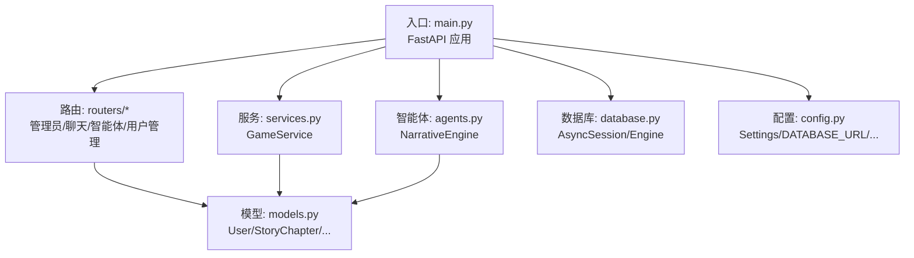
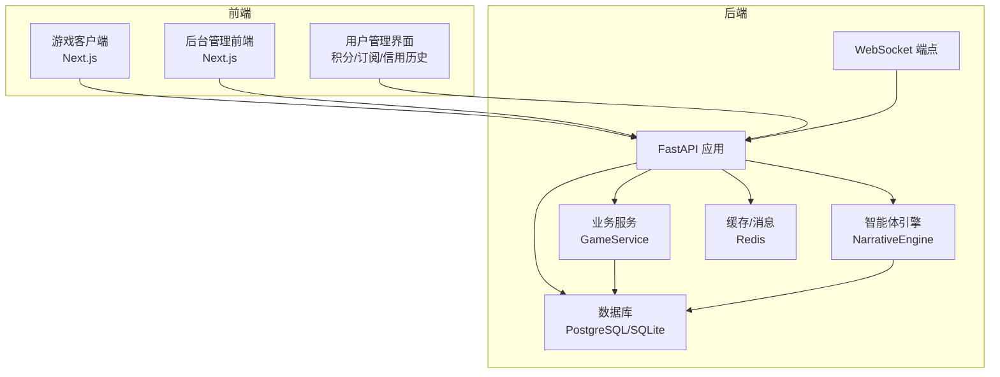
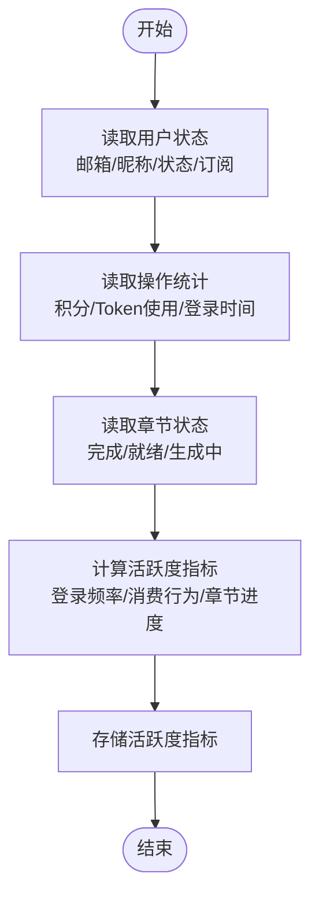
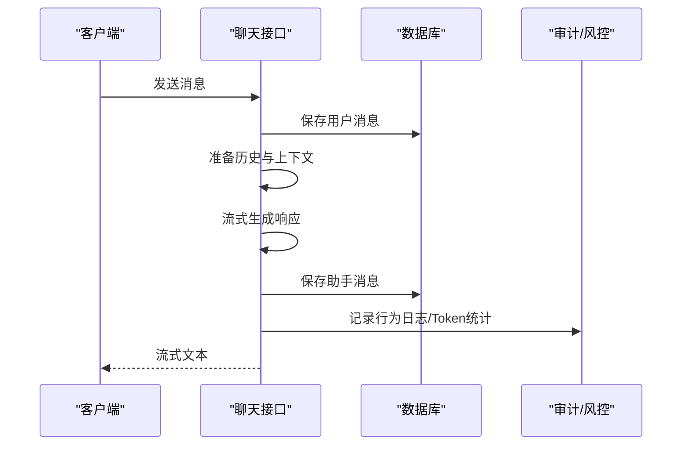
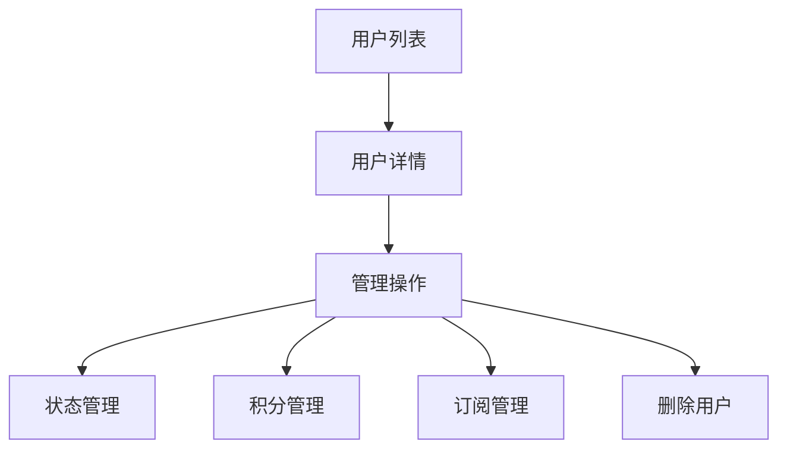
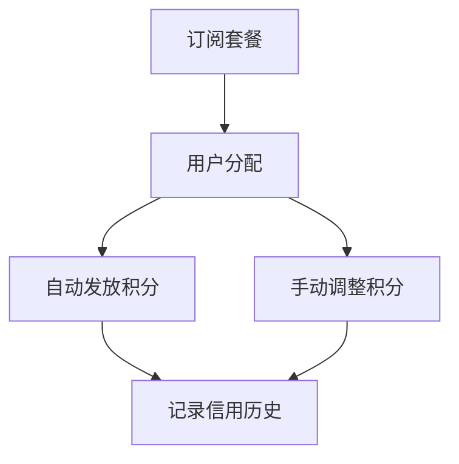
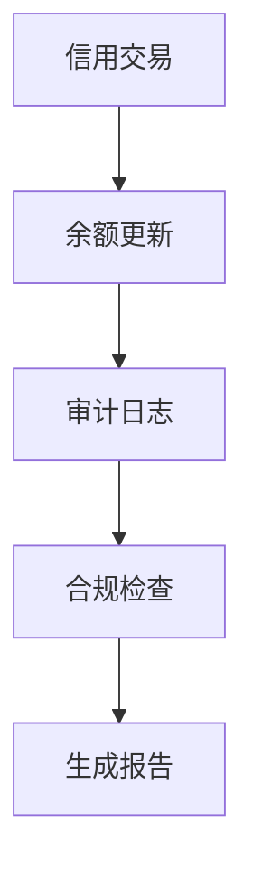
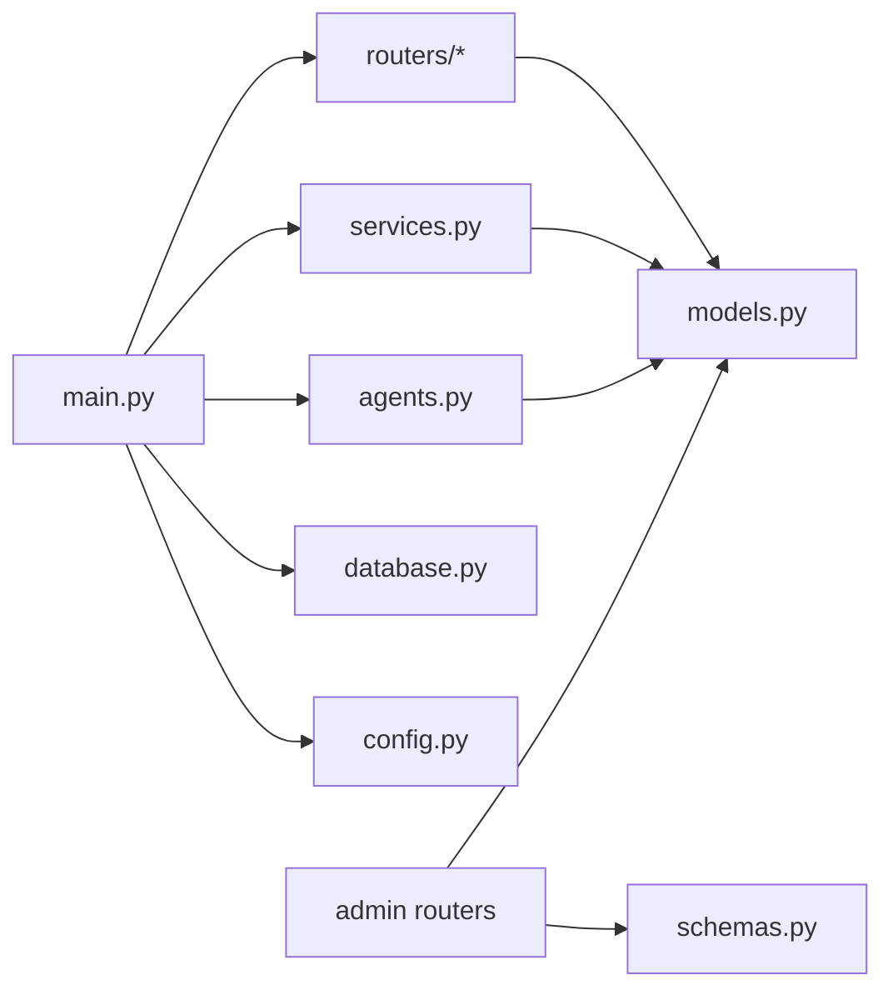

# 玩家监控系统

<cite>
**本文档引用的文件**
- [backend/main.py](file://backend/main.py)
- [backend/models.py](file://backend/models.py)
- [backend/schemas.py](file://backend/schemas.py)
- [backend/database.py](file://backend/database.py)
- [backend/agents.py](file://backend/agents.py)
- [backend/routers/admin.py](file://backend/routers/admin.py)
- [backend/routers/chats.py](file://backend/routers/chats.py)
- [backend/routers/agents.py](file://backend/routers/agents.py)
- [backend/config.py](file://backend/config.py)
- [backend/tasks.py](file://backend/tasks.py)
- [backend/admin/src/app/admin/users/page.tsx](file://backend/admin/src/app/admin/users/page.tsx)
- [backend/admin/src/app/admin/subscriptions/page.tsx](file://backend/admin/src/app/admin/subscriptions/page.tsx)
- [backend/admin/src/types/index.ts](file://backend/admin/src/types/index.ts)
- [docs/wiki/Backend-Guide.md](file://docs/wiki/Backend-Guide.md)
- [README.md](file://README.md)
</cite>

## 更新摘要
**变更内容**
- 更新了从玩家管理到用户管理的架构转变
- 新增了积分管理系统、订阅管理和信用历史功能
- 扩展了用户管理界面的监控能力
- 增强了用户状态跟踪和活跃度分析功能

## 目录
1. [简介](#简介)
2. [项目结构](#项目结构)
3. [核心组件](#核心组件)
4. [架构总览](#架构总览)
5. [详细组件分析](#详细组件分析)
6. [用户管理与监控](#用户管理与监控)
7. [积分与订阅管理](#积分与订阅管理)
8. [信用历史与审计](#信用历史与审计)
9. [依赖关系分析](#依赖关系分析)
10. [性能考虑](#性能考虑)
11. [故障排除指南](#故障排除指南)
12. [结论](#结论)
13. [附录](#附录)

## 简介
本文件为"无限剧情游戏系统"的用户监控系统提供全面的技术文档。系统以 FastAPI 为核心，结合 AgentScope 多智能体框架与 PostgreSQL 数据库存储，实现用户状态实时跟踪、在线人数统计、活跃度分析、用户行为日志、异常检测与风险评估、积分管理、订阅管理、信用历史追踪、用户画像与偏好分析、个性化推荐以及监控仪表板与预警通知等功能。

系统当前已具备：
- 用户档案与状态存储（含行为画像、物品栏、NPC 关系）
- 剧情章节生成与一致性校验（向量摘要）
- 动态 LLM 供应商配置与加载
- 后台管理统计接口与用户/剧情管理
- 聊天会话与消息流式响应
- 前端仪表板展示与可视化
- **新增**：积分管理系统、订阅套餐管理、信用历史追踪

尚未实现但具备扩展路径的功能：
- 实时在线人数统计与活跃度分析
- 行为日志记录与异常检测
- 等级/经验/成就系统
- 聊天内容审核与违规检测
- 用户画像与个性化推荐

## 项目结构
后端采用分层架构：
- 入口与生命周期管理：FastAPI 应用、CORS、数据库迁移与启动事件
- 数据层：SQLAlchemy 异步 ORM、数据库连接池
- 模型层：用户、剧情章节、资产、LLM 供应商、聊天会话与消息、积分交易、订阅计划
- 服务层：GameService 封装业务逻辑（用户创建、世界初始化、选择处理）
- 路由层：管理员接口、聊天接口、智能体接口、用户管理接口
- 智能体层：NarrativeEngine 与多智能体编排
- 配置层：环境变量与设置

**图表来源**
- [backend/main.py:83-173](file://backend/main.py#L83-L173)
- [backend/routers/admin.py:10-112](file://backend/routers/admin.py#L10-L112)
- [backend/routers/chats.py:16-275](file://backend/routers/chats.py#L16-L275)
- [backend/routers/agents.py:9-141](file://backend/routers/agents.py#L9-L141)
- [backend/services.py:8-66](file://backend/services.py#L8-L66)
- [backend/agents.py:43-196](file://backend/agents.py#L43-L196)
- [backend/models.py:9-122](file://backend/models.py#L9-L122)
- [backend/database.py:1-31](file://backend/database.py#L1-L31)
- [backend/config.py:7-34](file://backend/config.py#L7-L34)

**章节来源**
- [backend/main.py:1-173](file://backend/main.py#L1-L173)
- [backend/models.py:1-122](file://backend/models.py#L1-L122)
- [backend/services.py:1-66](file://backend/services.py#L1-L66)
- [backend/schemas.py:1-102](file://backend/schemas.py#L1-L102)
- [backend/database.py:1-31](file://backend/database.py#L1-L31)
- [backend/agents.py:1-196](file://backend/agents.py#L1-L196)
- [backend/routers/admin.py:1-112](file://backend/routers/admin.py#L1-L112)
- [backend/routers/chats.py:1-275](file://backend/routers/chats.py#L1-L275)
- [backend/routers/agents.py:1-141](file://backend/routers/agents.py#L1-L141)
- [backend/config.py:1-34](file://backend/config.py#L1-L34)
- [docs/wiki/Backend-Guide.md:1-108](file://docs/wiki/Backend-Guide.md#L1-L108)
- [README.md:1-141](file://README.md#L1-L141)

## 核心组件
- 用户模型与状态
  - 用户表包含邮箱、昵称、密码哈希、状态标志、订阅信息、积分余额、操作统计等字段
  - 可作为实时状态跟踪与活跃度分析的数据源
- 剧情章节模型
  - 包含章节编号、标题、内容、状态（待定/生成中/就绪/完成）、选择分支、摘要向量、世界状态快照
  - 支持一致性校验与预生成策略
- 数据库与会话
  - 异步引擎与会话工厂，SQLite/PostgreSQL 双栈支持
  - 连接池与 pre_ping，提升稳定性
- 业务服务
  - GameService 提供用户创建、世界初始化、选择处理（预留）
- 智能体与叙事引擎
  - NarrativeEngine 加载 LLM 供应商配置，创建导演、旁白、NPC 管理员智能体，协调章节生成
- 路由与接口
  - 管理员接口：统计、用户列表、删除、剧情列表
  - 聊天接口：会话创建、消息查询、流式回复
  - 智能体接口：智能体 CRUD 与模型可用性校验
  - **新增**：用户管理接口：用户查询、积分调整、订阅管理、信用历史

**章节来源**
- [backend/models.py:35-73](file://backend/models.py#L35-L73)
- [backend/database.py:1-31](file://backend/database.py#L1-L31)
- [backend/services.py:8-66](file://backend/services.py#L8-L66)
- [backend/agents.py:43-196](file://backend/agents.py#L43-L196)
- [backend/routers/admin.py:53-136](file://backend/routers/admin.py#L53-L136)
- [backend/routers/chats.py:22-275](file://backend/routers/chats.py#L22-L275)
- [backend/routers/agents.py:15-141](file://backend/routers/agents.py#L15-L141)

## 架构总览
系统采用前后端分离与后台管理前端的三层架构：
- 前端游戏客户端：Next.js，负责用户交互与实时推送
- 后端 API：FastAPI，提供游戏、聊天、管理接口
- 后台管理前端：Next.js，提供仪表板与系统配置
- 数据库：PostgreSQL（或 SQLite），存储结构化数据
- 缓存与消息：Redis（配置项存在）

**图表来源**
- [backend/main.py:157-170](file://backend/main.py#L157-L170)
- [backend/services.py:8-66](file://backend/services.py#L8-L66)
- [backend/agents.py:43-196](file://backend/agents.py#L43-L196)
- [backend/database.py:1-31](file://backend/database.py#L1-L31)
- [backend/config.py:18-24](file://backend/config.py#L18-L24)

**章节来源**
- [README.md:1-141](file://README.md#L1-L141)
- [docs/wiki/Backend-Guide.md:1-108](file://docs/wiki/Backend-Guide.md#L1-L108)
- [backend/main.py:1-173](file://backend/main.py#L1-L173)

## 详细组件分析

### 用户状态跟踪与活跃度分析
- 数据来源
  - 用户模型包含邮箱、昵称、状态、订阅信息、积分余额、操作统计等字段，可用于实时状态跟踪
  - 剧情章节模型包含状态字段，可用于判断章节是否完成或准备就绪
- 在线人数统计
  - 当前未实现专门的在线人数统计接口；可通过 WebSocket 连接数与会话状态进行估算
- 活跃度分析
  - 可基于用户最近登录时间、章节完成数、消息发送频率、积分消费等指标进行计算

**图表来源**
- [backend/models.py:35-73](file://backend/models.py#L35-L73)
- [backend/routers/admin.py:53-113](file://backend/routers/admin.py#L53-L113)

**章节来源**
- [backend/models.py:35-73](file://backend/models.py#L35-L73)
- [backend/routers/admin.py:53-113](file://backend/routers/admin.py#L53-L113)

### 实时用户行为日志与异常检测
- 行为日志
  - 可在聊天接口与选择处理流程中记录用户输入、响应、上下文长度、Token 使用等
- 异常检测与风险评估
  - 建议在聊天接口中增加敏感词过滤、重复输入检测、超长输入阈值告警等
  - 可结合 Redis 对高频请求与异常模式进行限流与标记

**图表来源**
- [backend/routers/chats.py:72-258](file://backend/routers/chats.py#L72-L258)

**章节来源**
- [backend/routers/chats.py:72-258](file://backend/routers/chats.py#L72-L258)

### 等级管理、经验值与成就系统
- 当前模型未包含等级、经验值、成就字段
- 建议扩展 User 模型，新增字段如等级、总经验值、已获得成就列表，并在章节完成、活跃度达标时进行更新

**章节来源**
- [backend/models.py:35-73](file://backend/models.py#L35-L73)

### 聊天监控、违规检测与内容审核
- 聊天监控
  - 已实现会话与消息的增删查，支持流式响应与 Token 统计
- 违规检测与内容审核
  - 建议在消息生成前/后增加敏感词检测、内容合规检查与人工复核通道

**章节来源**
- [backend/routers/chats.py:72-258](file://backend/routers/chats.py#L72-L258)

### 用户画像构建、偏好分析与个性化推荐
- 用户画像
  - 行为画像字段可用于记录偏好、倾向与历史行为
- 偏好分析
  - 可基于章节选择、NPC 关系变化、物品栏变化、积分消费模式进行聚类与关联规则挖掘
- 个性化推荐
  - 基于偏好与活跃度，推荐后续章节、对话 NPC 或生成内容主题

**章节来源**
- [backend/models.py:35-73](file://backend/models.py#L35-L73)

### 监控仪表板、预警通知与数据分析报告
- 仪表板
  - 后台管理前端已实现基础统计卡片与柱状图
- 预警通知
  - 建议在异常检测与高风险行为发生时，通过 Redis/消息队列推送告警
- 数据分析报告
  - 可定期汇总活跃度、章节完成率、资源消耗、积分流动等指标，生成周报/月报

**章节来源**
- [backend/routers/admin.py:29-47](file://backend/routers/admin.py#L29-L47)
- [README.md:30-33](file://README.md#L30-L33)

## 用户管理与监控

### 用户管理界面功能
- 用户列表管理
  - 支持用户基本信息查询、状态管理、删除操作
  - 显示用户注册信息、登录统计、订阅状态
- 用户状态监控
  - 实时显示用户在线状态、活跃度指标
  - 支持用户封禁/解封操作
- 用户行为审计
  - 记录用户关键操作、登录历史、消费记录

**图表来源**
- [backend/routers/admin.py:53-136](file://backend/routers/admin.py#L53-L136)
- [backend/admin/src/app/admin/users/page.tsx:87-127](file://backend/admin/src/app/admin/users/page.tsx#L87-L127)

**章节来源**
- [backend/routers/admin.py:53-136](file://backend/routers/admin.py#L53-L136)
- [backend/admin/src/app/admin/users/page.tsx:87-127](file://backend/admin/src/app/admin/users/page.tsx#L87-L127)

## 积分与订阅管理

### 积分管理系统
- 积分余额管理
  - 支持管理员手动调整用户积分（充值/扣除）
  - 实时显示用户积分余额、历史变动
- 积分消费追踪
  - 记录智能体调用、视频生成、图片生成等消费行为
  - 支持按类型、时间段统计积分使用情况

### 订阅套餐管理
- 套餐配置
  - 支持创建、编辑、删除订阅套餐
  - 配置价格、包含积分数量、计费周期（月/年/终身）
- 用户订阅管理
  - 支持为用户分配订阅套餐
  - 自动发放套餐包含的积分
  - 支持取消用户订阅

**图表来源**
- [backend/routers/admin.py:220-301](file://backend/routers/admin.py#L220-L301)
- [backend/models.py:355-375](file://backend/models.py#L355-L375)

**章节来源**
- [backend/routers/admin.py:141-188](file://backend/routers/admin.py#L141-L188)
- [backend/routers/admin.py:220-301](file://backend/routers/admin.py#L220-L301)
- [backend/models.py:247-267](file://backend/models.py#L247-L267)
- [backend/models.py:355-375](file://backend/models.py#L355-L375)
- [backend/admin/src/app/admin/subscriptions/page.tsx:64-83](file://backend/admin/src/app/admin/subscriptions/page.tsx#L64-L83)

## 信用历史与审计

### 信用交易记录
- 交易类型分类
  - 扣费（deduction）：智能体调用、内容生成等消费
  - 充值（recharge）：购买套餐、管理员充值等收入
  - 管理员调整（admin_adjust）：手动调整积分
- 交易详情追踪
  - 记录交易前/后余额、Token使用量
  - 保存元数据（操作者、关联会话、智能体等）
  - 支持按用户、类型、时间段查询

### 审计与合规
- 操作审计
  - 记录管理员的所有管理操作
  - 支持操作回溯与责任追踪
- 合规监控
  - 监控异常积分变动
  - 报告高价值用户行为
  - 支持合规报告生成

**图表来源**
- [backend/models.py:247-267](file://backend/models.py#L247-L267)
- [backend/schemas.py:318-334](file://backend/schemas.py#L318-L334)

**章节来源**
- [backend/models.py:247-267](file://backend/models.py#L247-L267)
- [backend/schemas.py:318-334](file://backend/schemas.py#L318-L334)
- [backend/routers/admin.py:190-214](file://backend/routers/admin.py#L190-L214)

## 依赖关系分析
- 组件耦合
  - main.py 作为入口，依赖数据库、服务、路由与智能体
  - services.py 与 models.py 强耦合，封装业务逻辑
  - routers 层依赖 models 与 schemas，负责数据验证与对外接口
  - agents.py 依赖 database 与 models，负责 LLM 配置加载与智能体编排
  - **新增**：admin 路由层扩展了用户管理、积分管理、订阅管理功能
- 外部依赖
  - AgentScope、OpenAI/DashScope SDK、SQLAlchemy、Alembic、Redis

**图表来源**
- [backend/main.py:30-43](file://backend/main.py#L30-L43)
- [backend/routers/admin.py:1-23](file://backend/routers/admin.py#L1-L23)
- [backend/routers/chats.py:1-20](file://backend/routers/chats.py#L1-L20)
- [backend/routers/agents.py:1-7](file://backend/routers/agents.py#L1-L7)
- [backend/services.py:1-10](file://backend/services.py#L1-L10)
- [backend/agents.py:1-10](file://backend/agents.py#L1-L10)
- [backend/models.py:1-4](file://backend/models.py#L1-L4)
- [backend/database.py:1-4](file://backend/database.py#L1-L4)
- [backend/config.py:1-6](file://backend/config.py#L1-L6)

**章节来源**
- [backend/main.py:1-173](file://backend/main.py#L1-L173)
- [backend/models.py:1-122](file://backend/models.py#L1-L122)
- [backend/services.py:1-66](file://backend/services.py#L1-L66)
- [backend/agents.py:1-196](file://backend/agents.py#L1-L196)
- [backend/routers/admin.py:1-112](file://backend/routers/admin.py#L1-L112)
- [backend/routers/chats.py:1-275](file://backend/routers/chats.py#L1-L275)
- [backend/routers/agents.py:1-141](file://backend/routers/agents.py#L1-L141)
- [backend/database.py:1-31](file://backend/database.py#L1-L31)
- [backend/config.py:1-34](file://backend/config.py#L1-L34)

## 性能考虑
- 异步与连接池
  - 使用 SQLAlchemy 异步引擎与连接池，提升并发与稳定性
- 流式响应
  - 聊天接口采用流式生成，降低首字节延迟
- 预生成策略
  - 通过预生成下一章，缩短等待时间
- 缓存与消息
  - Redis 可用于会话缓存、限流与消息队列
- **新增**：积分与订阅查询优化
  - 用户管理界面支持分页查询，避免大数据量影响性能
  - 信用历史查询支持时间范围筛选

**章节来源**
- [backend/database.py:8-23](file://backend/database.py#L8-L23)
- [backend/routers/chats.py:112-258](file://backend/routers/chats.py#L112-L258)
- [backend/tasks.py](file://backend/tasks.py)
- [backend/config.py:18-24](file://backend/config.py#L18-L24)

## 故障排除指南
- 数据库连接失败
  - 检查 DATABASE_URL 与 .env 配置，确认数据库可达
- LLM 供应商未初始化
  - 确认存在激活的 LLMProvider，或在启动时加载默认配置
- 聊天接口错误
  - 查看日志中的错误信息与 Token 统计，确认模型可用性与上下文长度
- WebSocket 连接异常
  - 检查 CORS 配置与网络连通性
- **新增**：积分管理问题
  - 检查用户积分余额是否为负数（系统会自动限制为0）
  - 确认订阅套餐配置正确，积分发放正常
- **新增**：信用历史查询异常
  - 检查查询参数（用户ID、时间范围、分页参数）
  - 确认用户存在且有权访问其信用历史

**章节来源**
- [backend/main.py:45-81](file://backend/main.py#L45-L81)
- [backend/agents.py:49-100](file://backend/agents.py#L49-L100)
- [backend/routers/chats.py:211-216](file://backend/routers/chats.py#L211-L216)
- [backend/routers/admin.py:141-188](file://backend/routers/admin.py#L141-L188)

## 结论
本系统已具备完善的用户状态存储、剧情生成与一致性校验能力，并提供了后台管理与聊天接口的基础能力。随着从玩家管理到用户管理的架构转变，系统现在集成了完整的积分管理系统、订阅管理和信用历史追踪功能，为用户提供更丰富的服务体验。建议在此基础上扩展在线人数统计、活跃度分析、行为日志与异常检测、等级/经验/成就体系、聊天内容审核、用户画像与个性化推荐，以及完善的监控仪表板与预警通知机制，以满足更全面的用户监控需求。

## 附录
- 快速开始与部署
  - 参考项目根目录 README 与 Wiki 文档，完成数据库、Redis、LLM 供应商配置与服务启动
- API 接口清单
  - 游戏接口：用户创建、故事初始化、WebSocket
  - 管理接口：统计、用户列表、删除、剧情列表
  - 聊天接口：会话创建、消息查询、流式回复
  - 智能体接口：智能体 CRUD、模型可用性校验
  - **新增**：用户管理接口：用户查询、积分调整、订阅管理、信用历史
- **新增**：用户管理界面功能
  - 积分调整：支持管理员手动调整用户积分余额
  - 订阅管理：支持套餐分配、自动积分发放、订阅取消
  - 信用历史：支持积分变动记录查询与审计

**章节来源**
- [README.md:53-127](file://README.md#L53-L127)
- [docs/wiki/Backend-Guide.md:83-107](file://docs/wiki/Backend-Guide.md#L83-L107)
- [backend/main.py:128-170](file://backend/main.py#L128-L170)
- [backend/routers/admin.py:53-301](file://backend/routers/admin.py#L53-L301)
- [backend/routers/chats.py:22-275](file://backend/routers/chats.py#L22-L275)
- [backend/routers/agents.py:15-141](file://backend/routers/agents.py#L15-L141)
- [backend/admin/src/app/admin/users/page.tsx:129-195](file://backend/admin/src/app/admin/users/page.tsx#L129-L195)
- [backend/admin/src/app/admin/subscriptions/page.tsx:165-189](file://backend/admin/src/app/admin/subscriptions/page.tsx#L165-L189)