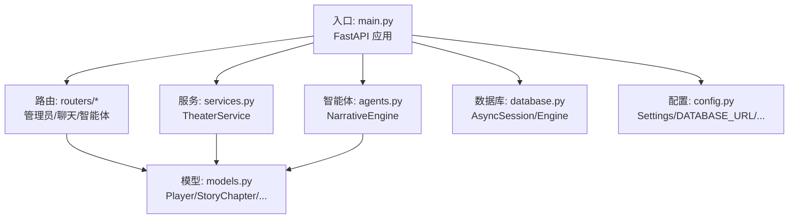
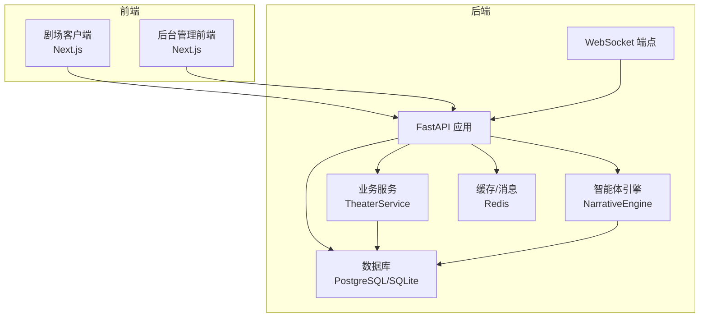
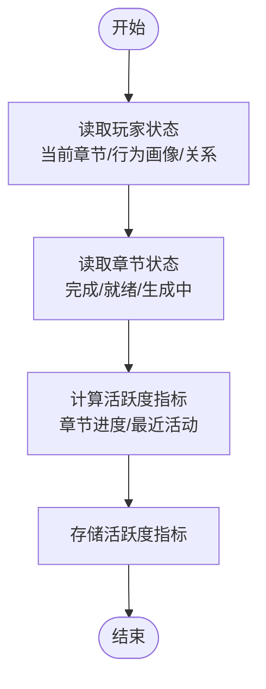
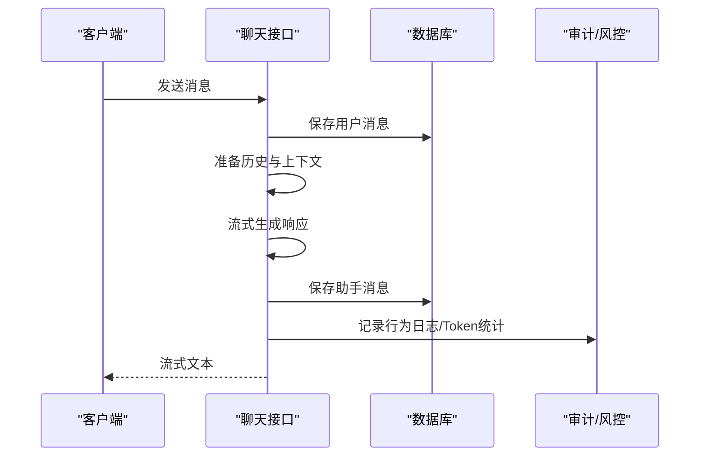
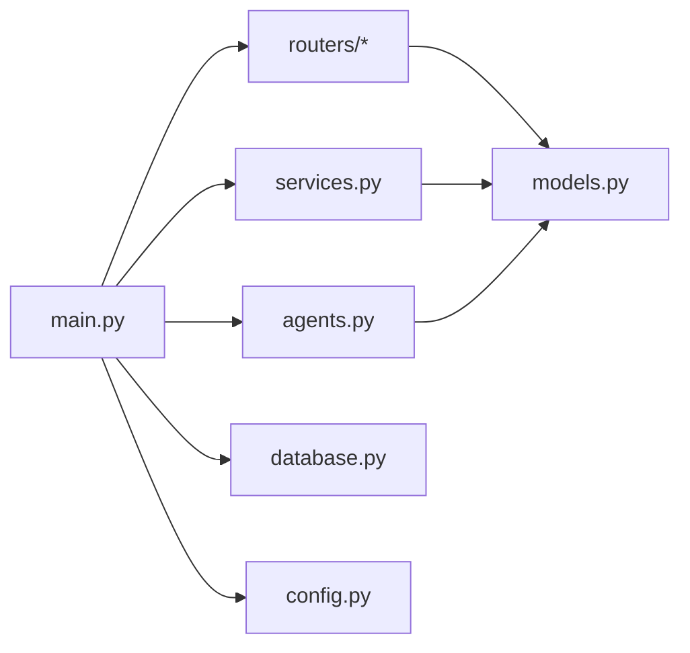

# 玩家监控系统

<cite>
**本文档引用的文件**
- [backend/main.py](file://backend/main.py)
- [backend/models.py](file://backend/models.py)
- [backend/services.py](file://backend/services.py)
- [backend/schemas.py](file://backend/schemas.py)
- [backend/database.py](file://backend/database.py)
- [backend/agents.py](file://backend/agents.py)
- [backend/routers/admin.py](file://backend/routers/admin.py)
- [backend/routers/chats.py](file://backend/routers/chats.py)
- [backend/routers/agents.py](file://backend/routers/agents.py)
- [backend/config.py](file://backend/config.py)
- [backend/tasks.py](file://backend/tasks.py)
- [docs/wiki/Backend-Guide.md](file://docs/wiki/Backend-Guide.md)
- [README.md](file://README.md)
</cite>

## 目录
1. [简介](#简介)
2. [项目结构](#项目结构)
3. [核心组件](#核心组件)
4. [架构总览](#架构总览)
5. [详细组件分析](#详细组件分析)
6. [依赖关系分析](#依赖关系分析)
7. [性能考虑](#性能考虑)
8. [故障排除指南](#故障排除指南)
9. [结论](#结论)
10. [附录](#附录)

## 简介
本文件为“无限剧情剧场系统”的玩家监控系统提供全面的技术文档。系统以 FastAPI 为核心，结合 AgentScope 多智能体框架与 PostgreSQL 数据库存储，实现玩家状态实时跟踪、在线人数统计、活跃度分析、玩家行为日志、异常检测与风险评估、等级与经验值管理、成就系统、聊天监控与内容审核、玩家画像与偏好分析、个性化推荐以及监控仪表板与预警通知等功能。

系统当前已具备：
- 玩家档案与状态存储（含行为画像、物品栏、NPC 关系）
- 剧情章节生成与一致性校验（向量摘要）
- 动态 LLM 供应商配置与加载
- 后台管理统计接口与玩家/剧情管理
- 聊天会话与消息流式响应
- 前端仪表板展示与可视化

尚未实现但具备扩展路径的功能：
- 实时在线人数统计与活跃度分析
- 行为日志记录与异常检测
- 等级/经验/成就系统
- 聊天内容审核与违规检测
- 玩家画像与个性化推荐

## 项目结构
后端采用分层架构：
- 入口与生命周期管理：FastAPI 应用、CORS、数据库迁移与启动事件
- 数据层：SQLAlchemy 异步 ORM、数据库连接池
- 模型层：玩家、剧情章节、资产、LLM 供应商、聊天会话与消息
- 服务层：TheaterService 封装业务逻辑（玩家创建、世界初始化、选择处理）
- 路由层：管理员接口、聊天接口、智能体接口
- 智能体层：NarrativeEngine 与多智能体编排
- 配置层：环境变量与设置

图表来源
- [backend/main.py](file://backend/main.py#L83-L173)
- [backend/routers/admin.py](file://backend/routers/admin.py#L10-L112)
- [backend/routers/chats.py](file://backend/routers/chats.py#L16-L275)
- [backend/routers/agents.py](file://backend/routers/agents.py#L9-L141)
- [backend/services.py](file://backend/services.py#L8-L66)
- [backend/agents.py](file://backend/agents.py#L43-L196)
- [backend/models.py](file://backend/models.py#L9-L122)
- [backend/database.py](file://backend/database.py#L1-L31)
- [backend/config.py](file://backend/config.py#L7-L34)

章节来源
- [backend/main.py](file://backend/main.py#L1-L173)
- [backend/models.py](file://backend/models.py#L1-L122)
- [backend/services.py](file://backend/services.py#L1-L66)
- [backend/schemas.py](file://backend/schemas.py#L1-L102)
- [backend/database.py](file://backend/database.py#L1-L31)
- [backend/agents.py](file://backend/agents.py#L1-L196)
- [backend/routers/admin.py](file://backend/routers/admin.py#L1-L112)
- [backend/routers/chats.py](file://backend/routers/chats.py#L1-L275)
- [backend/routers/agents.py](file://backend/routers/agents.py#L1-L141)
- [backend/config.py](file://backend/config.py#L1-L34)
- [docs/wiki/Backend-Guide.md](file://docs/wiki/Backend-Guide.md#L1-L108)
- [README.md](file://README.md#L1-L141)

## 核心组件
- 玩家模型与状态
  - 玩家表包含用户名、创建时间、当前章节、行为画像（JSON）、物品栏（JSON）、NPC 关系（JSON）
  - 可作为实时状态跟踪与活跃度分析的数据源
- 剧情章节模型
  - 包含章节编号、标题、内容、状态（待定/生成中/就绪/完成）、选择分支、摘要向量、世界状态快照
  - 支持一致性校验与预生成策略
- 数据库与会话
  - 异步引擎与会话工厂，SQLite/PostgreSQL 双栈支持
  - 连接池与 pre_ping，提升稳定性
- 业务服务
  - TheaterService 提供玩家创建、世界初始化、选择处理（预留）
- 智能体与叙事引擎
  - NarrativeEngine 加载 LLM 供应商配置，创建导演、旁白、NPC 管理员智能体，协调章节生成
- 路由与接口
  - 管理员接口：统计、玩家列表、删除、剧情列表
  - 聊天接口：会话创建、消息查询、流式回复
  - 智能体接口：智能体 CRUD 与模型可用性校验

章节来源
- [backend/models.py](file://backend/models.py#L9-L122)
- [backend/database.py](file://backend/database.py#L1-L31)
- [backend/services.py](file://backend/services.py#L8-L66)
- [backend/agents.py](file://backend/agents.py#L43-L196)
- [backend/routers/admin.py](file://backend/routers/admin.py#L16-L112)
- [backend/routers/chats.py](file://backend/routers/chats.py#L22-L275)
- [backend/routers/agents.py](file://backend/routers/agents.py#L15-L141)

## 架构总览
系统采用前后端分离与后台管理前端的三层架构：
- 前端剧场客户端：Next.js，负责用户交互与实时推送
- 后端 API：FastAPI，提供剧场、聊天、管理接口
- 后台管理前端：Next.js，提供仪表板与系统配置
- 数据库：PostgreSQL（或 SQLite），存储结构化数据
- 缓存与消息：Redis（配置项存在）

图表来源
- [backend/main.py](file://backend/main.py#L157-L170)
- [backend/services.py](file://backend/services.py#L8-L66)
- [backend/agents.py](file://backend/agents.py#L43-L196)
- [backend/database.py](file://backend/database.py#L1-L31)
- [backend/config.py](file://backend/config.py#L18-L24)

章节来源
- [README.md](file://README.md#L1-L141)
- [docs/wiki/Backend-Guide.md](file://docs/wiki/Backend-Guide.md#L1-L108)
- [backend/main.py](file://backend/main.py#L1-L173)

## 详细组件分析

### 玩家状态跟踪与活跃度分析
- 数据来源
  - 玩家模型包含当前章节、行为画像、物品栏、NPC 关系，可用于实时状态跟踪
  - 剧情章节模型包含状态字段，可用于判断章节是否完成或准备就绪
- 在线人数统计
  - 当前未实现专门的在线人数统计接口；可通过 WebSocket 连接数与会话状态进行估算
- 活跃度分析
  - 可基于玩家最近登录时间、章节完成数、消息发送频率等指标进行计算

图表来源
- [backend/models.py](file://backend/models.py#L9-L44)
- [backend/routers/admin.py](file://backend/routers/admin.py#L33-L57)

章节来源
- [backend/models.py](file://backend/models.py#L9-L44)
- [backend/routers/admin.py](file://backend/routers/admin.py#L16-L57)

### 实时玩家行为日志与异常检测
- 行为日志
  - 可在聊天接口与选择处理流程中记录用户输入、响应、上下文长度、Token 使用等
- 异常检测与风险评估
  - 建议在聊天接口中增加敏感词过滤、重复输入检测、超长输入阈值告警等
  - 可结合 Redis 对高频请求与异常模式进行限流与标记

图表来源
- [backend/routers/chats.py](file://backend/routers/chats.py#L72-L258)

章节来源
- [backend/routers/chats.py](file://backend/routers/chats.py#L72-L258)

### 等级管理、经验值与成就系统
- 当前模型未包含等级、经验值、成就字段
- 建议扩展 Player 模型，新增字段如等级、总经验值、已获得成就列表，并在章节完成、活跃度达标时进行更新

章节来源
- [backend/models.py](file://backend/models.py#L9-L23)

### 聊天监控、违规检测与内容审核
- 聊天监控
  - 已实现会话与消息的增删查，支持流式响应与 Token 统计
- 违规检测与内容审核
  - 建议在消息生成前/后增加敏感词检测、内容合规检查与人工复核通道

章节来源
- [backend/routers/chats.py](file://backend/routers/chats.py#L72-L258)

### 玩家画像构建、偏好分析与个性化推荐
- 玩家画像
  - 行为画像字段可用于记录偏好、倾向与历史行为
- 偏好分析
  - 可基于章节选择、NPC 关系变化、物品栏变化进行聚类与关联规则挖掘
- 个性化推荐
  - 基于偏好与活跃度，推荐后续章节、对话 NPC 或生成内容主题

章节来源
- [backend/models.py](file://backend/models.py#L16-L23)

### 监控仪表板、预警通知与数据分析报告
- 仪表板
  - 后台管理前端已实现基础统计卡片与柱状图
- 预警通知
  - 建议在异常检测与高风险行为发生时，通过 Redis/消息队列推送告警
- 数据分析报告
  - 可定期汇总活跃度、章节完成率、资源消耗等指标，生成周报/月报

章节来源
- [backend/routers/admin.py](file://backend/routers/admin.py#L16-L31)
- [README.md](file://README.md#L30-L33)

## 依赖关系分析
- 组件耦合
  - main.py 作为入口，依赖数据库、服务、路由与智能体
  - services.py 与 models.py 强耦合，封装业务逻辑
  - routers 层依赖 models 与 schemas，负责数据验证与对外接口
  - agents.py 依赖 database 与 models，负责 LLM 配置加载与智能体编排
- 外部依赖
  - AgentScope、OpenAI/DashScope SDK、SQLAlchemy、Alembic、Redis

图表来源
- [backend/main.py](file://backend/main.py#L30-L43)
- [backend/routers/admin.py](file://backend/routers/admin.py#L1-L14)
- [backend/routers/chats.py](file://backend/routers/chats.py#L1-L20)
- [backend/routers/agents.py](file://backend/routers/agents.py#L1-L7)
- [backend/services.py](file://backend/services.py#L1-L10)
- [backend/agents.py](file://backend/agents.py#L1-L10)
- [backend/models.py](file://backend/models.py#L1-L4)
- [backend/database.py](file://backend/database.py#L1-L4)
- [backend/config.py](file://backend/config.py#L1-L6)

章节来源
- [backend/main.py](file://backend/main.py#L1-L173)
- [backend/models.py](file://backend/models.py#L1-L122)
- [backend/services.py](file://backend/services.py#L1-L66)
- [backend/agents.py](file://backend/agents.py#L1-L196)
- [backend/routers/admin.py](file://backend/routers/admin.py#L1-L112)
- [backend/routers/chats.py](file://backend/routers/chats.py#L1-L275)
- [backend/routers/agents.py](file://backend/routers/agents.py#L1-L141)
- [backend/database.py](file://backend/database.py#L1-L31)
- [backend/config.py](file://backend/config.py#L1-L34)

## 性能考虑
- 异步与连接池
  - 使用 SQLAlchemy 异步引擎与连接池，提升并发与稳定性
- 流式响应
  - 聊天接口采用流式生成，降低首字节延迟
- 预生成策略
  - 通过预生成下一章，缩短等待时间
- 缓存与消息
  - Redis 可用于会话缓存、限流与消息队列

章节来源
- [backend/database.py](file://backend/database.py#L8-L23)
- [backend/routers/chats.py](file://backend/routers/chats.py#L112-L258)
- [backend/tasks.py](file://backend/tasks.py)
- [backend/config.py](file://backend/config.py#L18-L24)

## 故障排除指南
- 数据库连接失败
  - 检查 DATABASE_URL 与 .env 配置，确认数据库可达
- LLM 供应商未初始化
  - 确认存在激活的 LLMProvider，或在启动时加载默认配置
- 聊天接口错误
  - 查看日志中的错误信息与 Token 统计，确认模型可用性与上下文长度
- WebSocket 连接异常
  - 检查 CORS 配置与网络连通性

章节来源
- [backend/main.py](file://backend/main.py#L45-L81)
- [backend/agents.py](file://backend/agents.py#L49-L100)
- [backend/routers/chats.py](file://backend/routers/chats.py#L211-L216)

## 结论
本系统已具备完善的玩家状态存储、剧情生成与一致性校验能力，并提供了后台管理与聊天接口的基础能力。建议在此基础上扩展在线人数统计、活跃度分析、行为日志与异常检测、等级/经验/成就体系、聊天内容审核、玩家画像与个性化推荐，以及完善的监控仪表板与预警通知机制，以满足更全面的玩家监控需求。

## 附录
- 快速开始与部署
  - 参考项目根目录 README 与 Wiki 文档，完成数据库、Redis、LLM 供应商配置与服务启动
- API 接口清单
  - 剧场接口：玩家创建、故事初始化、WebSocket
  - 管理接口：统计、玩家列表、删除、剧情列表
  - 聊天接口：会话创建、消息查询、流式回复
  - 智能体接口：智能体 CRUD、模型可用性校验

章节来源
- [README.md](file://README.md#L53-L127)
- [docs/wiki/Backend-Guide.md](file://docs/wiki/Backend-Guide.md#L83-L107)
- [backend/main.py](file://backend/main.py#L128-L170)
- [backend/routers/admin.py](file://backend/routers/admin.py#L16-L112)
- [backend/routers/chats.py](file://backend/routers/chats.py#L22-L275)
- [backend/routers/agents.py](file://backend/routers/agents.py#L15-L141)