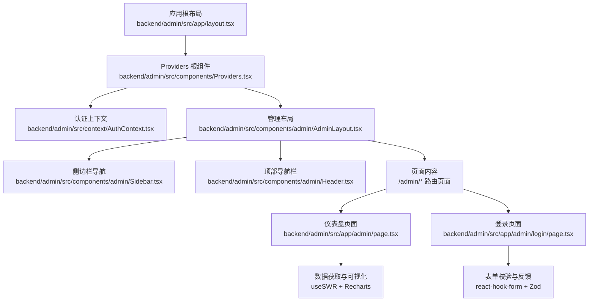
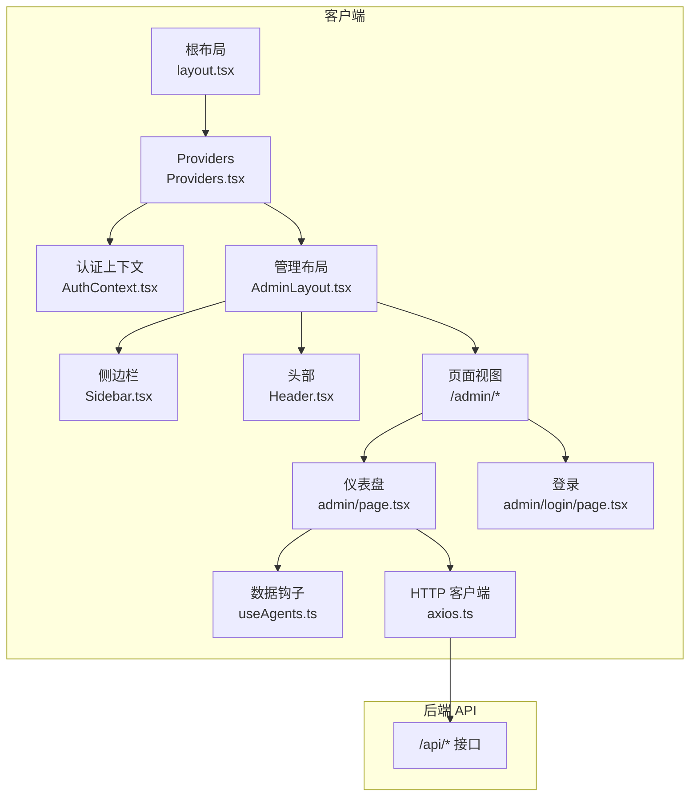
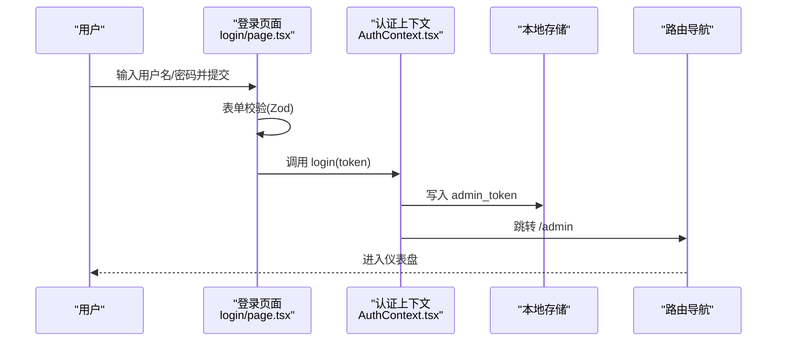
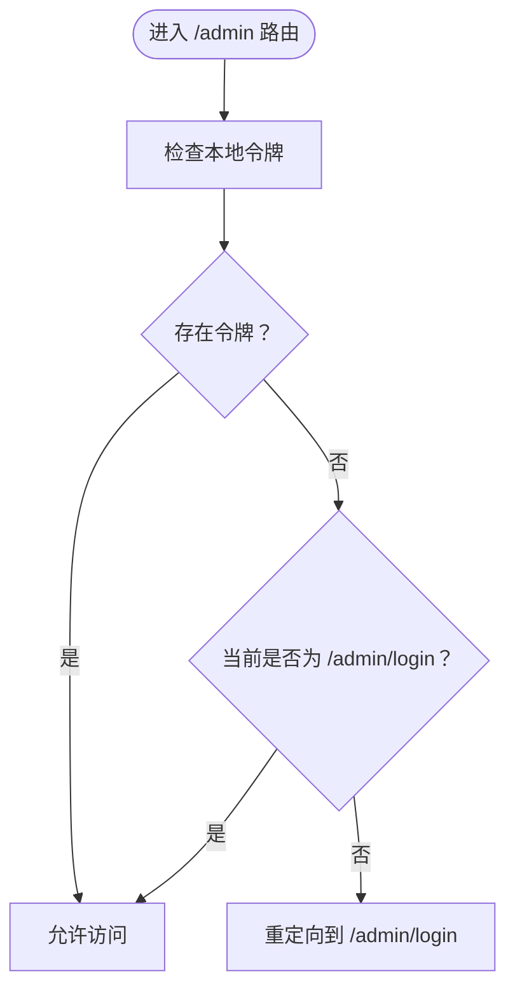
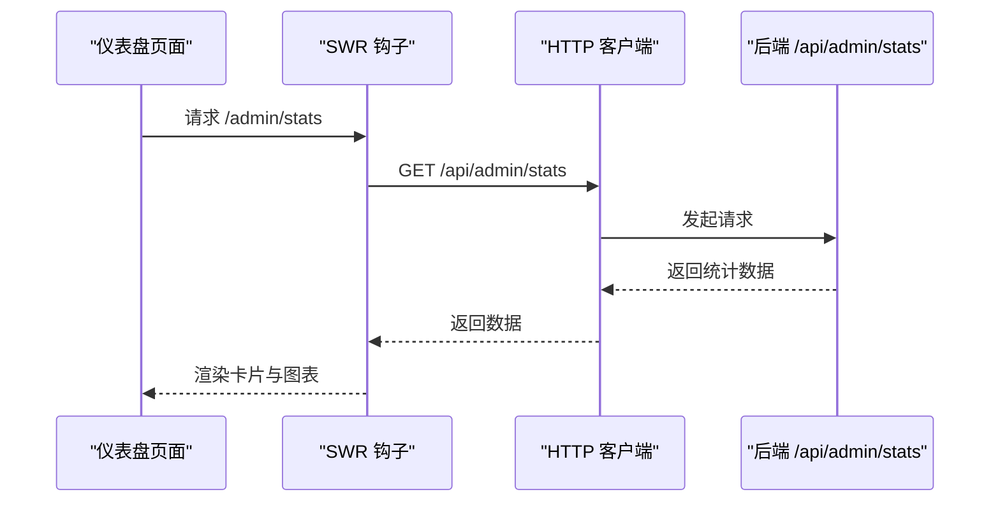
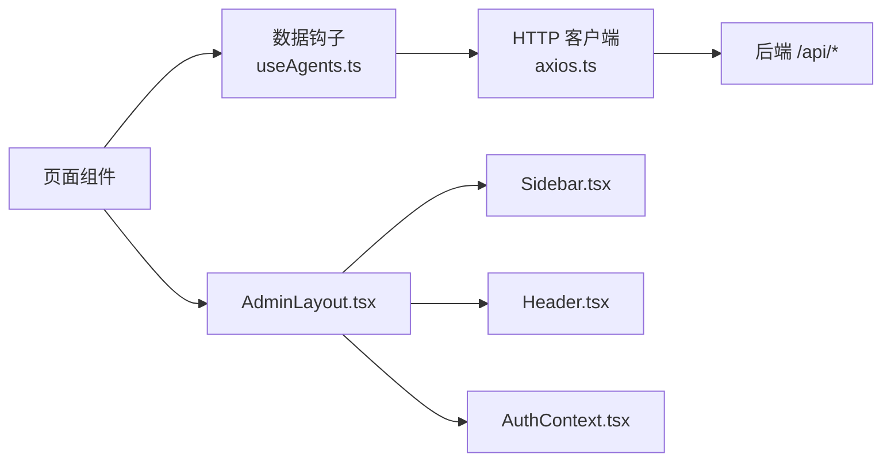

# 管理界面概览

<cite>
**本文引用的文件**
- [backend/admin/src/app/layout.tsx](file://backend/admin/src/app/layout.tsx)
- [backend/admin/src/components/Providers.tsx](file://backend/admin/src/components/Providers.tsx)
- [backend/admin/src/context/AuthContext.tsx](file://backend/admin/src/context/AuthContext.tsx)
- [backend/admin/src/components/admin/AdminLayout.tsx](file://backend/admin/src/components/admin/AdminLayout.tsx)
- [backend/admin/src/components/admin/Header.tsx](file://backend/admin/src/components/admin/Header.tsx)
- [backend/admin/src/components/admin/Sidebar.tsx](file://backend/admin/src/components/admin/Sidebar.tsx)
- [backend/admin/src/app/admin/page.tsx](file://backend/admin/src/app/admin/page.tsx)
- [backend/admin/src/app/admin/login/page.tsx](file://backend/admin/src/app/admin/login/page.tsx)
- [backend/admin/src/lib/axios.ts](file://backend/admin/src/lib/axios.ts)
- [backend/admin/src/hooks/useAgents.ts](file://backend/admin/src/hooks/useAgents.ts)
- [backend/admin/src/constants/agent.ts](file://backend/admin/src/constants/agent.ts)
- [backend/admin/src/types/index.ts](file://backend/admin/src/types/index.ts)
- [backend/admin/src/lib/utils.ts](file://backend/admin/src/lib/utils.ts)
</cite>

## 目录
1. [简介](#简介)
2. [项目结构](#项目结构)
3. [核心组件](#核心组件)
4. [架构总览](#架构总览)
5. [详细组件分析](#详细组件分析)
6. [依赖关系分析](#依赖关系分析)
7. [性能考虑](#性能考虑)
8. [故障排除指南](#故障排除指南)
9. [结论](#结论)
10. [附录](#附录)

## 简介
本文件面向后台管理界面概览，聚焦于整体架构设计、导航结构与用户体验理念，系统化阐述管理员登录认证流程、权限控制与会话管理机制；同时覆盖主题定制、响应式布局与可访问性设计；解释数据可视化图表、状态指示器与操作反馈系统；并提供界面元素使用指南、快捷键操作与批量管理功能建议，以及界面定制选项、插件扩展与第三方集成方法。

## 项目结构
后台管理前端采用 Next.js App Router 架构，根布局负责注入全局 Provider（认证与布局），页面按路由组织，组件以功能域拆分，UI 基于共享组件库与 TailwindCSS 实现响应式与主题化。

图示来源
- [backend/admin/src/app/layout.tsx](file://backend/admin/src/app/layout.tsx#L1-L25)
- [backend/admin/src/components/Providers.tsx](file://backend/admin/src/components/Providers.tsx#L1-L16)
- [backend/admin/src/context/AuthContext.tsx](file://backend/admin/src/context/AuthContext.tsx#L1-L55)
- [backend/admin/src/components/admin/AdminLayout.tsx](file://backend/admin/src/components/admin/AdminLayout.tsx#L1-L156)
- [backend/admin/src/components/admin/Sidebar.tsx](file://backend/admin/src/components/admin/Sidebar.tsx#L1-L88)
- [backend/admin/src/components/admin/Header.tsx](file://backend/admin/src/components/admin/Header.tsx#L1-L64)
- [backend/admin/src/app/admin/page.tsx](file://backend/admin/src/app/admin/page.tsx#L1-L109)
- [backend/admin/src/app/admin/login/page.tsx](file://backend/admin/src/app/admin/login/page.tsx#L1-L117)

章节来源
- [backend/admin/src/app/layout.tsx](file://backend/admin/src/app/layout.tsx#L1-L25)
- [backend/admin/src/components/Providers.tsx](file://backend/admin/src/components/Providers.tsx#L1-L16)

## 核心组件
- 认证上下文与会话管理：基于本地存储令牌的轻量认证，自动重定向至登录页，支持登出。
- 管理布局：固定侧边栏与可折叠菜单、顶部用户下拉菜单、全局通知提示。
- 页面级组件：仪表盘统计卡片与柱状图、登录表单与校验。
- 数据钩子：基于 SWR 的智能体列表、详情、增删改查封装。
- 工具函数：Tailwind 合并类名工具，简化样式组合。

章节来源
- [backend/admin/src/context/AuthContext.tsx](file://backend/admin/src/context/AuthContext.tsx#L1-L55)
- [backend/admin/src/components/admin/AdminLayout.tsx](file://backend/admin/src/components/admin/AdminLayout.tsx#L1-L156)
- [backend/admin/src/app/admin/page.tsx](file://backend/admin/src/app/admin/page.tsx#L1-L109)
- [backend/admin/src/app/admin/login/page.tsx](file://backend/admin/src/app/admin/login/page.tsx#L1-L117)
- [backend/admin/src/hooks/useAgents.ts](file://backend/admin/src/hooks/useAgents.ts#L1-L52)
- [backend/admin/src/lib/utils.ts](file://backend/admin/src/lib/utils.ts#L1-L7)

## 架构总览
系统采用“布局-导航-页面-数据”分层架构，认证与布局通过 Provider 注入，页面通过 SWR 获取后端数据，Recharts 展示可视化图表，UI 组件统一来自共享库。

图示来源
- [backend/admin/src/app/layout.tsx](file://backend/admin/src/app/layout.tsx#L1-L25)
- [backend/admin/src/components/Providers.tsx](file://backend/admin/src/components/Providers.tsx#L1-L16)
- [backend/admin/src/context/AuthContext.tsx](file://backend/admin/src/context/AuthContext.tsx#L1-L55)
- [backend/admin/src/components/admin/AdminLayout.tsx](file://backend/admin/src/components/admin/AdminLayout.tsx#L1-L156)
- [backend/admin/src/components/admin/Sidebar.tsx](file://backend/admin/src/components/admin/Sidebar.tsx#L1-L88)
- [backend/admin/src/components/admin/Header.tsx](file://backend/admin/src/components/admin/Header.tsx#L1-L64)
- [backend/admin/src/app/admin/page.tsx](file://backend/admin/src/app/admin/page.tsx#L1-L109)
- [backend/admin/src/app/admin/login/page.tsx](file://backend/admin/src/app/admin/login/page.tsx#L1-L117)
- [backend/admin/src/hooks/useAgents.ts](file://backend/admin/src/hooks/useAgents.ts#L1-L52)
- [backend/admin/src/lib/axios.ts](file://backend/admin/src/lib/axios.ts#L1-L20)

## 详细组件分析

### 认证与会话管理
- 令牌存储：登录成功后写入本地存储，登出时移除。
- 自动跳转：进入受保护路由但无令牌时自动跳转到登录页。
- 登录流程：表单校验通过后触发登录回调，写入令牌并跳转首页。
- 登出流程：移除令牌并跳转登录页。

图示来源
- [backend/admin/src/app/admin/login/page.tsx](file://backend/admin/src/app/admin/login/page.tsx#L31-L58)
- [backend/admin/src/context/AuthContext.tsx](file://backend/admin/src/context/AuthContext.tsx#L37-L47)

章节来源
- [backend/admin/src/context/AuthContext.tsx](file://backend/admin/src/context/AuthContext.tsx#L1-L55)
- [backend/admin/src/app/admin/login/page.tsx](file://backend/admin/src/app/admin/login/page.tsx#L1-L117)

### 权限控制与导航
- 受保护路由：当路径位于 /admin 且非登录页且无令牌时，强制跳转登录。
- 导航项：仪表盘、AI 供应商、智能体管理、玩家管理、故事管理。
- 侧边栏交互：支持折叠/展开，移动端可通过顶部按钮触发菜单（预留）。
- 用户菜单：顶部下拉菜单提供“退出登录”。

图示来源
- [backend/admin/src/context/AuthContext.tsx](file://backend/admin/src/context/AuthContext.tsx#L25-L35)
- [backend/admin/src/components/admin/AdminLayout.tsx](file://backend/admin/src/components/admin/AdminLayout.tsx#L44-L70)
- [backend/admin/src/components/admin/Sidebar.tsx](file://backend/admin/src/components/admin/Sidebar.tsx#L14-L40)

章节来源
- [backend/admin/src/components/admin/AdminLayout.tsx](file://backend/admin/src/components/admin/AdminLayout.tsx#L1-L156)
- [backend/admin/src/components/admin/Sidebar.tsx](file://backend/admin/src/components/admin/Sidebar.tsx#L1-L88)
- [backend/admin/src/components/admin/Header.tsx](file://backend/admin/src/components/admin/Header.tsx#L1-L64)

### 仪表盘与数据可视化
- 数据获取：使用 SWR 拉取 /admin/stats，错误/加载态分别处理。
- 卡片指标：玩家、故事、资产、供应商数量展示，带图标与颜色标识。
- 图表：基于 Recharts 的柱状图，响应式容器适配不同屏幕尺寸。
- 主题适配：Tooltip 与图形颜色使用主题变量，确保深浅色模式一致性。

图示来源
- [backend/admin/src/app/admin/page.tsx](file://backend/admin/src/app/admin/page.tsx#L10-L108)
- [backend/admin/src/lib/axios.ts](file://backend/admin/src/lib/axios.ts#L1-L20)

章节来源
- [backend/admin/src/app/admin/page.tsx](file://backend/admin/src/app/admin/page.tsx#L1-L109)

### 登录表单与反馈系统
- 表单校验：用户名与密码必填，使用 Zod 与 react-hook-form。
- 成功/失败反馈：Toast 提示，成功后写入令牌并跳转。
- 默认凭证：页面提示默认账号信息，便于演示与测试。

章节来源
- [backend/admin/src/app/admin/login/page.tsx](file://backend/admin/src/app/admin/login/page.tsx#L1-L117)

### 数据模型与工具常量
- 类型定义：Agent、LLMProvider、AgentFormValues 等接口，明确字段与可选时间戳。
- 智能体工具：可用工具集合与默认值常量，用于表单初始化与校验。

章节来源
- [backend/admin/src/types/index.ts](file://backend/admin/src/types/index.ts#L1-L26)
- [backend/admin/src/constants/agent.ts](file://backend/admin/src/constants/agent.ts#L1-L20)

### 响应式布局与可访问性
- 响应式断点：侧边栏在小屏隐藏，大屏显示；菜单折叠切换宽度。
- 可访问性：按钮包含 sr-only 文本；下拉菜单对齐与键盘可达；头像占位与替代文本。
- 主题与样式：Tailwind 与主题变量结合，cn 工具合并类名，保证一致风格。

章节来源
- [backend/admin/src/components/admin/AdminLayout.tsx](file://backend/admin/src/components/admin/AdminLayout.tsx#L73-L113)
- [backend/admin/src/components/admin/Header.tsx](file://backend/admin/src/components/admin/Header.tsx#L24-L61)
- [backend/admin/src/lib/utils.ts](file://backend/admin/src/lib/utils.ts#L1-L7)

### 批量管理与操作反馈
- 批量操作建议：在列表页增加全选/反选、批量删除、批量启用/禁用等交互。
- 操作反馈：使用 Toast 组件提供成功/失败提示；表格行内操作按钮配合确认对话框。
- 数据刷新：通过 SWR 的 mutate 触发局部刷新，减少全量请求。

章节来源
- [backend/admin/src/hooks/useAgents.ts](file://backend/admin/src/hooks/useAgents.ts#L1-L52)

## 依赖关系分析
- 组件耦合：AdminLayout 作为容器组件，聚合 Sidebar/Header 与页面内容；Providers 将认证与布局串联。
- 外部依赖：Next.js 路由、React Hook Form、Zod、SWR、Axios、Recharts、Lucide Icons、TailwindCSS。
- 数据流：页面 -> SWR -> Axios -> 后端 API；错误拦截集中处理。

图示来源
- [backend/admin/src/hooks/useAgents.ts](file://backend/admin/src/hooks/useAgents.ts#L1-L52)
- [backend/admin/src/lib/axios.ts](file://backend/admin/src/lib/axios.ts#L1-L20)
- [backend/admin/src/components/admin/AdminLayout.tsx](file://backend/admin/src/components/admin/AdminLayout.tsx#L1-L156)
- [backend/admin/src/components/admin/Sidebar.tsx](file://backend/admin/src/components/admin/Sidebar.tsx#L1-L88)
- [backend/admin/src/components/admin/Header.tsx](file://backend/admin/src/components/admin/Header.tsx#L1-L64)
- [backend/admin/src/context/AuthContext.tsx](file://backend/admin/src/context/AuthContext.tsx#L1-L55)

章节来源
- [backend/admin/src/hooks/useAgents.ts](file://backend/admin/src/hooks/useAgents.ts#L1-L52)
- [backend/admin/src/lib/axios.ts](file://backend/admin/src/lib/axios.ts#L1-L20)

## 性能考虑
- 数据缓存：SWR 提供缓存与去重，避免重复请求。
- 懒加载：页面按需渲染，登录页不加载布局装饰。
- 图表优化：Recharts 使用响应式容器，避免固定尺寸导致的重排。
- 样式合并：cn 工具减少类名冲突与重复计算。
- 本地存储：令牌读写为 O(1)，避免网络往返。

## 故障排除指南
- 登录失败：检查表单必填校验与默认凭证；查看 Toast 错误提示。
- 无权限访问：确认本地存储是否存在 admin_token；检查路由守卫逻辑。
- 数据加载异常：查看 SWR 错误分支与 Axios 拦截器输出；核对 /api 前缀代理配置。
- 图表不显示：确认 Recharts 依赖已安装；检查容器高度与宽比设置。

章节来源
- [backend/admin/src/app/admin/login/page.tsx](file://backend/admin/src/app/admin/login/page.tsx#L44-L58)
- [backend/admin/src/context/AuthContext.tsx](file://backend/admin/src/context/AuthContext.tsx#L25-L35)
- [backend/admin/src/lib/axios.ts](file://backend/admin/src/lib/axios.ts#L10-L17)

## 结论
该管理界面以清晰的分层架构实现认证、导航与数据展示，结合响应式布局与主题化设计，具备良好的可维护性与扩展性。后续可在权限细化、批量操作与第三方集成方面进一步完善。

## 附录

### 快捷键与交互建议
- 折叠侧边栏：顶部按钮点击切换。
- 退出登录：顶部用户菜单选择“退出登录”。

### 界面定制选项
- 主题变量：通过 Tailwind 主题变量统一颜色与间距。
- 组件样式：使用 cn 工具合并条件类名，保持一致性。
- 图标系统：Lucide Icons 提供统一视觉语言。

### 插件扩展与第三方集成
- 图表扩展：可替换为更高性能的可视化库或添加交互筛选。
- 表单增强：引入更丰富的字段类型与校验规则。
- 权限细化：结合后端 RBAC，前端按角色渲染菜单与按钮。
- 代理与网关：在 axios 中统一配置代理与鉴权头，便于对接企业网关。