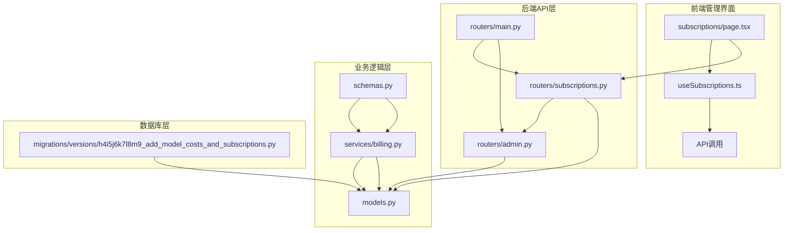
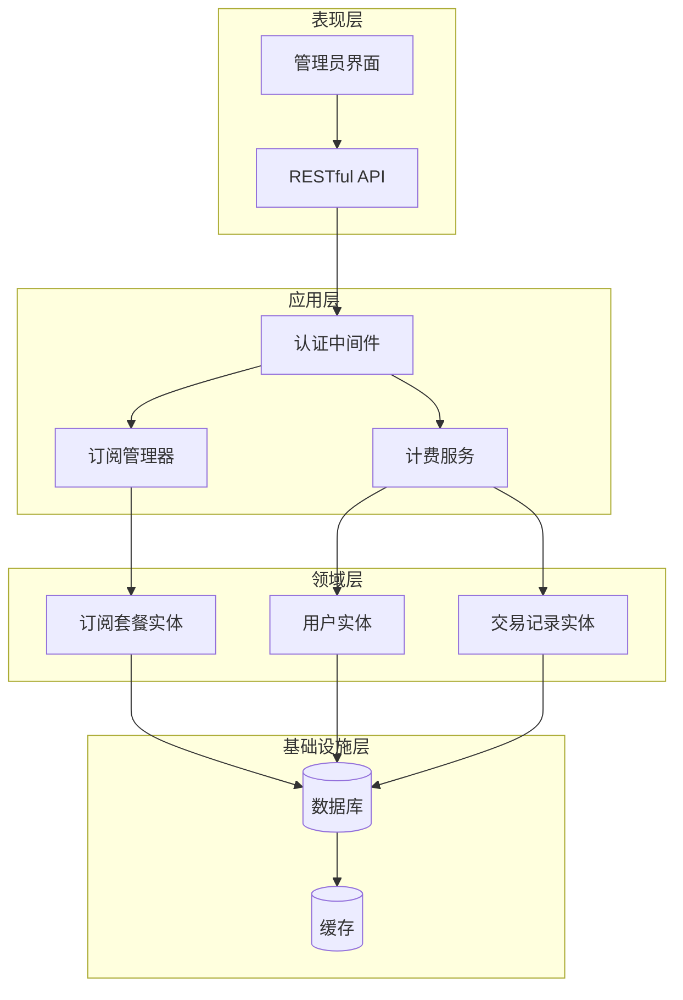
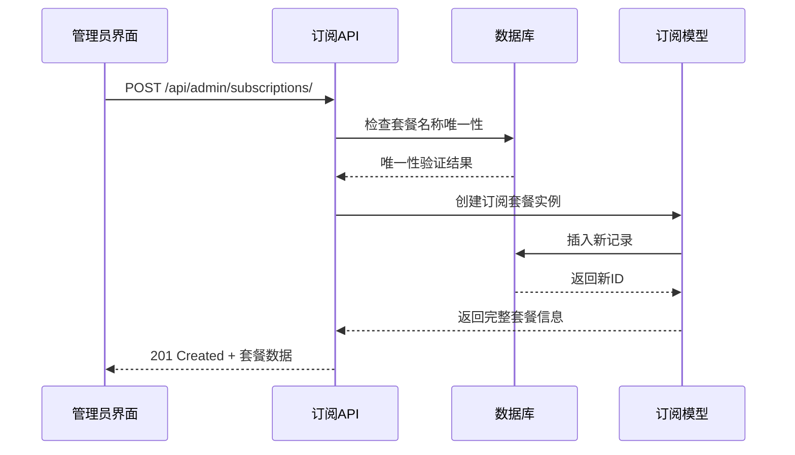
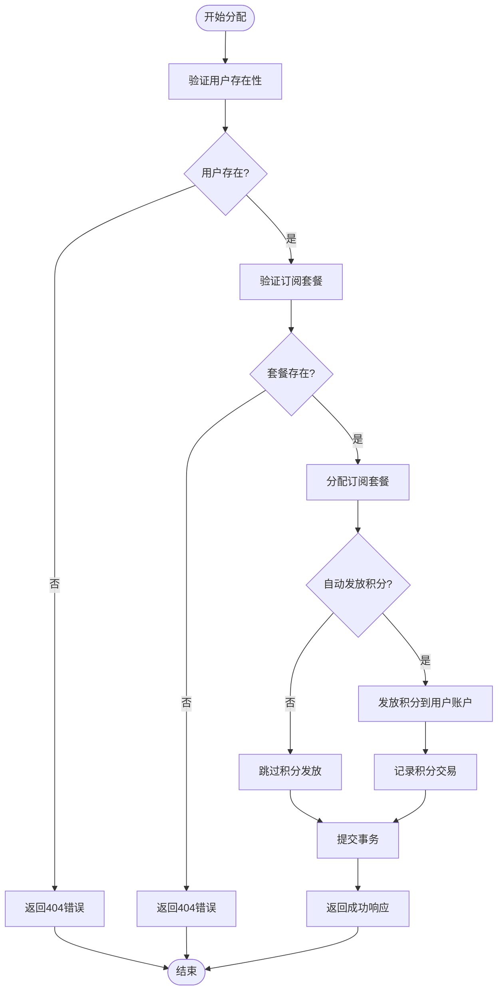
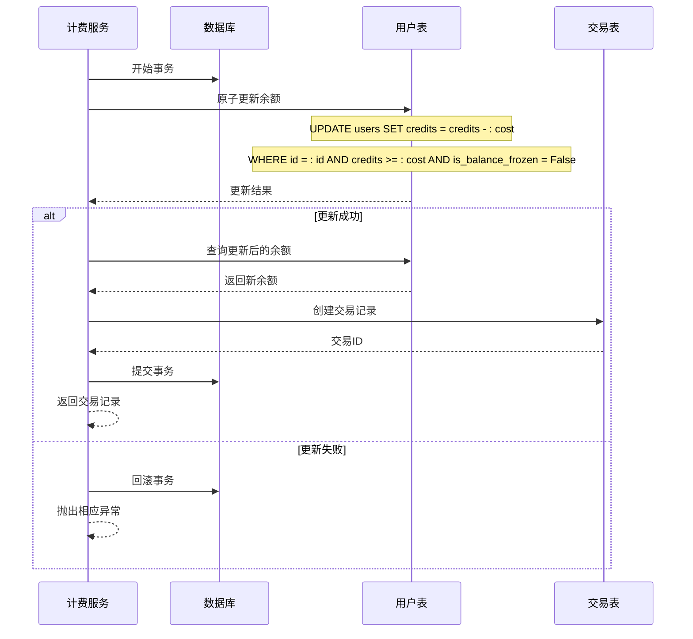
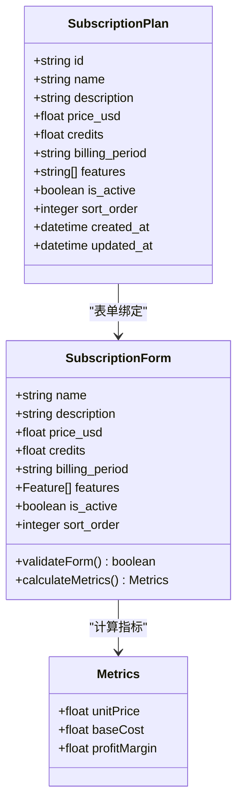
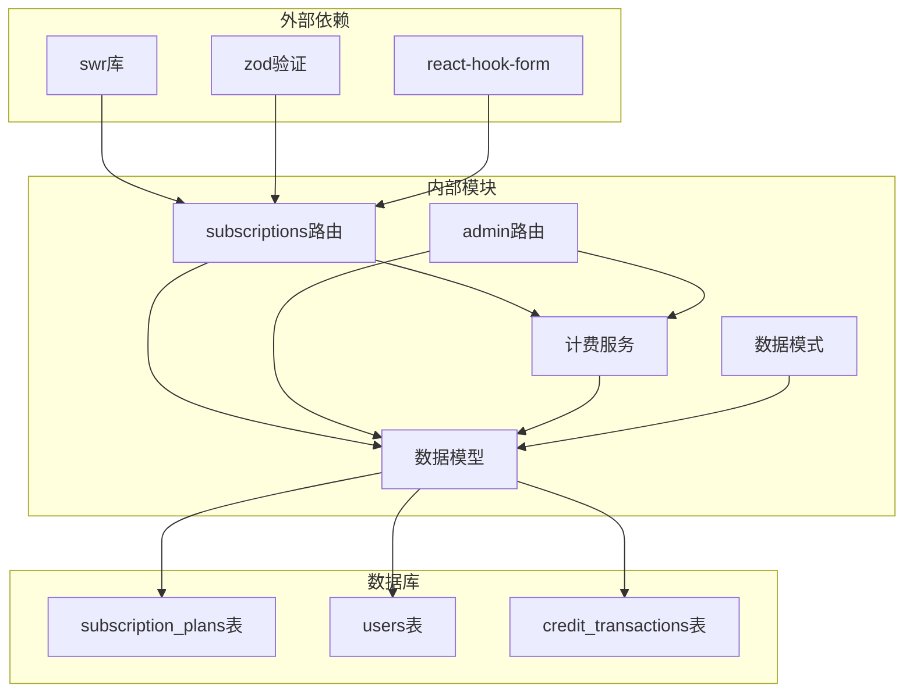

# 订阅管理

<cite>
**本文档引用的文件**
- [subscriptions.py](file://backend/routers/subscriptions.py)
- [billing.py](file://backend/services/billing.py)
- [models.py](file://backend/models.py)
- [schemas.py](file://backend/schemas.py)
- [useSubscriptions.ts](file://backend/admin/src/hooks/useSubscriptions.ts)
- [page.tsx](file://backend/admin/src/app/admin/subscriptions/page.tsx)
- [admin.py](file://backend/routers/admin.py)
- [main.py](file://backend/main.py)
- [h4i5j6k7l8m9_add_model_costs_and_subscriptions.py](file://backend/migrations/versions/h4i5j6k7l8m9_add_model_costs_and_subscriptions.py)
</cite>

## 目录
1. [简介](#简介)
2. [项目结构](#项目结构)
3. [核心组件](#核心组件)
4. [架构概览](#架构概览)
5. [详细组件分析](#详细组件分析)
6. [依赖关系分析](#依赖关系分析)
7. [性能考虑](#性能考虑)
8. [故障排除指南](#故障排除指南)
9. [结论](#结论)

## 简介

订阅管理系统是 Infinite Theater 剧场平台的核心功能模块之一，负责管理用户的订阅套餐、积分计费和自动扣费机制。该系统采用基于积分的计费模式，通过订阅套餐为用户提供不同级别的服务权限和资源配额。

系统主要包含三个核心层面：
- **前端管理界面**：管理员可以创建、编辑和管理订阅套餐
- **后端API接口**：提供完整的RESTful API用于订阅管理操作
- **计费服务**：实现原子化的积分扣费和退款机制

## 项目结构

订阅管理相关的文件分布如下：

**图表来源**
- [page.tsx](file://backend/admin/src/app/admin/subscriptions/page.tsx#L1-L522)
- [useSubscriptions.ts](file://backend/admin/src/hooks/useSubscriptions.ts#L1-L39)
- [subscriptions.py](file://backend/routers/subscriptions.py#L1-L119)
- [admin.py](file://backend/routers/admin.py#L220-L301)

**章节来源**
- [main.py](file://backend/main.py#L94-L103)
- [h4i5j6k7l8m9_add_model_costs_and_subscriptions.py](file://backend/migrations/versions/h4i5j6k7l8m9_add_model_costs_and_subscriptions.py#L21-L44)

## 核心组件

### 订阅套餐模型
订阅套餐是系统的基础实体，包含以下关键属性：
- **套餐标识**：唯一ID和名称
- **定价信息**：价格（美元）、包含积分数量
- **计费周期**：月付、年付或终身
- **功能特性**：套餐包含的功能列表
- **显示配置**：激活状态和排序顺序

### 计费维度映射表
系统采用映射表驱动的方式管理不同的计费维度：
- **输入令牌**：按100万令牌计费
- **文本输出**：按100万令牌计费  
- **图像输出**：按100万令牌计费
- **搜索查询**：按每次查询计费

### 积分交易记录
每个计费操作都会生成相应的交易记录，包含：
- **交易类型**：扣费、充值或管理员调整
- **金额变化**：正数表示收入，负数表示支出
- **余额快照**：交易前后的余额状态
- **元数据信息**：详细的计费统计和描述

**章节来源**
- [models.py](file://backend/models.py#L324-L344)
- [billing.py](file://backend/services/billing.py#L13-L20)
- [schemas.py](file://backend/schemas.py#L392-L424)

## 架构概览

订阅管理系统的整体架构采用分层设计：

**图表来源**
- [subscriptions.py](file://backend/routers/subscriptions.py#L14-L18)
- [admin.py](file://backend/routers/admin.py#L220-L279)
- [billing.py](file://backend/services/billing.py#L1-L12)

## 详细组件分析

### 订阅套餐管理API

#### 创建订阅套餐
管理员可以通过POST请求创建新的订阅套餐，系统会验证套餐名称的唯一性并进行数据校验。

**图表来源**
- [subscriptions.py](file://backend/routers/subscriptions.py#L21-L37)

#### 列表查询和详情获取
系统提供GET方法用于获取所有订阅套餐列表和特定套餐的详细信息。

**章节来源**
- [subscriptions.py](file://backend/routers/subscriptions.py#L40-L118)

### 用户订阅分配管理

#### 管理员手动分配订阅
管理员可以为任意用户手动分配订阅套餐，支持自动发放积分到用户账户。

**图表来源**
- [admin.py](file://backend/routers/admin.py#L220-L279)

**章节来源**
- [admin.py](file://backend/routers/admin.py#L220-L301)

### 积分计费服务

#### 原子化扣费机制
计费服务实现了高度可靠的原子化扣费，确保并发环境下的数据一致性。

**图表来源**
- [billing.py](file://backend/services/billing.py#L129-L228)

#### 计费维度计算
系统支持多种计费维度的灵活组合计算：

**章节来源**
- [billing.py](file://backend/services/billing.py#L230-L269)

### 前端管理界面

#### 订阅套餐管理面板
管理员界面提供了完整的订阅套餐管理功能，包括创建、编辑、删除和批量操作。

**图表来源**
- [page.tsx](file://backend/admin/src/app/admin/subscriptions/page.tsx#L74-L83)
- [schemas.py](file://backend/schemas.py#L392-L424)

**章节来源**
- [page.tsx](file://backend/admin/src/app/admin/subscriptions/page.tsx#L87-L189)
- [useSubscriptions.ts](file://backend/admin/src/hooks/useSubscriptions.ts#L1-L39)

## 依赖关系分析

订阅管理系统的依赖关系呈现清晰的分层结构：

**图表来源**
- [useSubscriptions.ts](file://backend/admin/src/hooks/useSubscriptions.ts#L1-L4)
- [subscriptions.py](file://backend/routers/subscriptions.py#L1-L12)
- [admin.py](file://backend/routers/admin.py#L1-L12)

**章节来源**
- [main.py](file://backend/main.py#L42-L103)
- [models.py](file://backend/models.py#L324-L344)

## 性能考虑

### 数据库优化策略
- **索引设计**：订阅套餐表的ID和名称字段都建立了唯一索引，确保查询性能
- **批量操作**：管理员界面支持批量操作，减少网络往返次数
- **缓存策略**：用户余额和套餐信息可以考虑引入Redis缓存

### 并发处理
- **原子操作**：积分扣费使用UPDATE语句的原子性保证，避免竞态条件
- **事务管理**：所有数据库操作都在事务中执行，确保数据一致性
- **锁机制**：高并发场景下考虑使用悲观锁或乐观锁策略

### 前端性能
- **数据缓存**：使用SWR库进行数据缓存和自动刷新
- **懒加载**：表格数据支持分页加载，避免一次性加载大量数据
- **表单优化**：使用React Hook Form进行高性能表单验证

## 故障排除指南

### 常见问题及解决方案

#### 订阅套餐创建失败
**问题症状**：创建订阅套餐时报错，提示名称已存在
**解决步骤**：
1. 检查套餐名称是否唯一
2. 验证价格和积分数量是否为正数
3. 确认计费周期参数有效

#### 用户订阅分配异常
**问题症状**：为用户分配订阅时出现余额不足错误
**解决步骤**：
1. 验证用户是否存在且状态正常
2. 检查订阅套餐是否有效
3. 确认用户账户未被冻结

#### 积分扣费失败
**问题症状**：API调用返回余额不足异常
**解决步骤**：
1. 检查用户当前积分余额
2. 验证计费金额计算是否正确
3. 确认用户账户状态正常

**章节来源**
- [subscriptions.py](file://backend/routers/subscriptions.py#L27-L31)
- [admin.py](file://backend/routers/admin.py#L234-L238)
- [billing.py](file://backend/services/billing.py#L182-L199)

## 结论

订阅管理系统通过模块化的设计和完善的错误处理机制，为Infinite Theater平台提供了稳定可靠的订阅服务。系统的关键优势包括：

1. **完整的生命周期管理**：从套餐创建到用户分配的全流程支持
2. **高可靠性的计费机制**：原子化操作确保数据一致性
3. **灵活的前端管理界面**：直观易用的管理员操作界面
4. **可扩展的架构设计**：清晰的分层结构便于功能扩展

未来可以考虑的改进方向：
- 增加订阅状态的自动化管理
- 实现更复杂的计费规则和优惠策略
- 添加订阅续费和到期提醒功能
- 优化移动端的管理体验