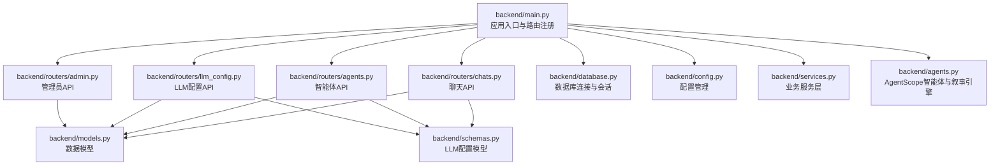
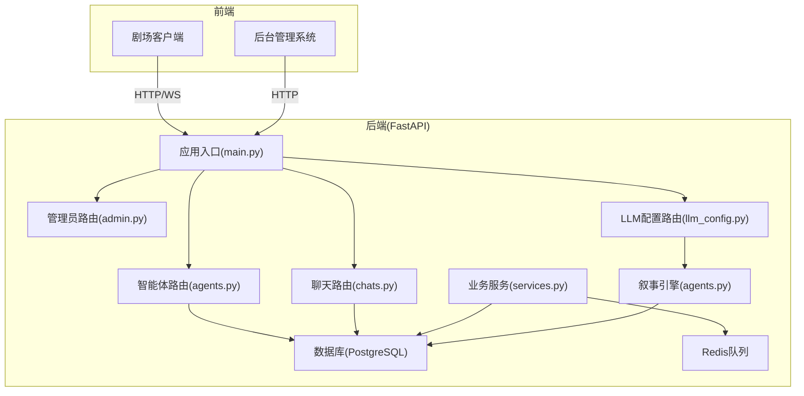
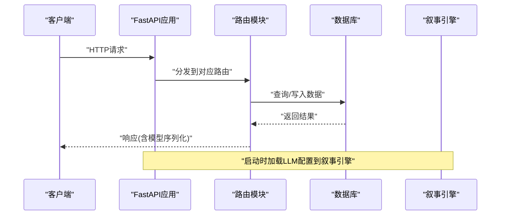
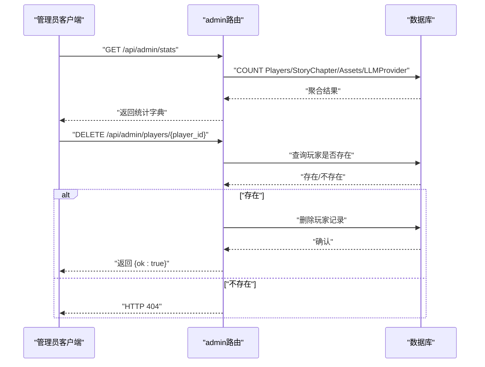
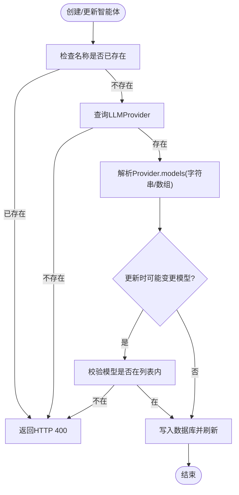
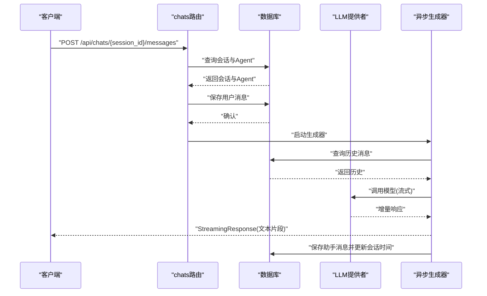

# API路由系统

<cite>
**本文档引用的文件**
- [backend/main.py](file://backend/main.py)
- [backend/routers/admin.py](file://backend/routers/admin.py)
- [backend/routers/agents.py](file://backend/routers/agents.py)
- [backend/routers/chats.py](file://backend/routers/chats.py)
- [backend/routers/llm_config.py](file://backend/routers/llm_config.py)
- [backend/schemas.py](file://backend/schemas.py)
- [backend/models.py](file://backend/models.py)
- [backend/database.py](file://backend/database.py)
- [backend/config.py](file://backend/config.py)
- [backend/agents.py](file://backend/agents.py)
- [backend/services.py](file://backend/services.py)
- [docs/wiki/Backend-Guide.md](file://docs/wiki/Backend-Guide.md)
- [docs/wiki/Architecture.md](file://docs/wiki/Architecture.md)
- [README.md](file://README.md)
</cite>

## 目录
1. [简介](#简介)
2. [项目结构](#项目结构)
3. [核心组件](#核心组件)
4. [架构总览](#架构总览)
5. [详细组件分析](#详细组件分析)
6. [依赖关系分析](#依赖关系分析)
7. [性能考虑](#性能考虑)
8. [故障排除指南](#故障排除指南)
9. [结论](#结论)
10. [附录](#附录)

## 简介
本文件为API路由系统的开发文档，围绕FastAPI路由注册机制、路径参数处理、请求验证、LLM配置API、管理员API、智能体API与聊天API展开，阐述HTTP方法映射、响应模型定义、错误处理策略，并提供路由中间件、权限验证与速率限制的实现方案建议。文档同时总结RESTful设计原则与最佳实践，帮助开发者构建可维护的API接口。

## 项目结构
后端采用FastAPI + SQLAlchemy异步ORM + AgentScope多智能体框架，API路由按功能模块拆分至routers目录，数据模型与Pydantic验证模型分别位于models.py与schemas.py，数据库连接与配置位于database.py与config.py，核心业务逻辑封装在services.py中，入口文件main.py负责应用生命周期与路由注册。



**图表来源**
- [backend/main.py](file://backend/main.py#L93-L97)
- [backend/routers/admin.py](file://backend/routers/admin.py#L1-L14)
- [backend/routers/llm_config.py](file://backend/routers/llm_config.py#L14-L18)
- [backend/routers/agents.py](file://backend/routers/agents.py#L9-L13)
- [backend/routers/chats.py](file://backend/routers/chats.py#L16-L20)
- [backend/schemas.py](file://backend/schemas.py#L1-L102)
- [backend/models.py](file://backend/models.py#L1-L122)
- [backend/database.py](file://backend/database.py#L1-L31)
- [backend/config.py](file://backend/config.py#L1-L34)
- [backend/services.py](file://backend/services.py#L1-L66)
- [backend/agents.py](file://backend/agents.py#L1-L196)

**章节来源**
- [backend/main.py](file://backend/main.py#L93-L97)
- [docs/wiki/Backend-Guide.md](file://docs/wiki/Backend-Guide.md#L41-L46)

## 核心组件
- FastAPI应用与生命周期：通过lifespan钩子完成数据库连接与迁移、叙事引擎初始化；注册CORS中间件；挂载各模块路由。
- 路由模块：admin、llm_config、agents、chats四个API模块，分别提供管理、LLM配置、智能体与聊天能力。
- 数据模型与验证：models.py定义SQLAlchemy模型，schemas.py定义Pydantic模型，统一约束与序列化。
- 数据库与配置：database.py提供异步引擎与会话工厂，config.py集中管理环境变量与默认值。
- 业务服务：services.py封装玩家创建、世界初始化等业务逻辑。
- 智能体与叙事：agents.py定义对话与叙事引擎，动态加载LLM配置并与AgentScope集成。

**章节来源**
- [backend/main.py](file://backend/main.py#L45-L82)
- [backend/routers/admin.py](file://backend/routers/admin.py#L1-L112)
- [backend/routers/llm_config.py](file://backend/routers/llm_config.py#L1-L203)
- [backend/routers/agents.py](file://backend/routers/agents.py#L1-L141)
- [backend/routers/chats.py](file://backend/routers/chats.py#L1-L275)
- [backend/schemas.py](file://backend/schemas.py#L1-L102)
- [backend/models.py](file://backend/models.py#L1-L122)
- [backend/database.py](file://backend/database.py#L1-L31)
- [backend/config.py](file://backend/config.py#L1-L34)
- [backend/services.py](file://backend/services.py#L1-L66)
- [backend/agents.py](file://backend/agents.py#L1-L196)

## 架构总览
系统采用前后端分离架构，后端以FastAPI为核心，提供HTTP与WebSocket接口；管理员与剧场客户端分别通过不同路由访问；AgentScope作为叙事引擎驱动内容生成；PostgreSQL与Redis支撑数据持久化与任务队列。



**图表来源**
- [docs/wiki/Architecture.md](file://docs/wiki/Architecture.md#L7-L36)
- [backend/main.py](file://backend/main.py#L83-L97)
- [backend/routers/admin.py](file://backend/routers/admin.py#L1-L112)
- [backend/routers/llm_config.py](file://backend/routers/llm_config.py#L1-L203)
- [backend/routers/agents.py](file://backend/routers/agents.py#L1-L141)
- [backend/routers/chats.py](file://backend/routers/chats.py#L1-L275)
- [backend/services.py](file://backend/services.py#L1-L66)
- [backend/agents.py](file://backend/agents.py#L43-L196)

## 详细组件分析

### FastAPI路由注册机制与中间件
- 应用生命周期：通过lifespan钩子在启动阶段执行数据库连接与迁移，失败重试；尝试从数据库加载LLM配置到叙事引擎。
- CORS中间件：允许指定来源、凭证、方法与头，满足跨域需求。
- 路由注册：在应用对象上include_router，分别注册管理员、LLM配置、智能体与聊天路由。
- 额外端点：根路径返回欢迎信息；/players/提供玩家创建；/story/init/{player_id}触发故事初始化；WebSocket /ws/{player_id}用于实时通信。



**图表来源**
- [backend/main.py](file://backend/main.py#L45-L82)
- [backend/main.py](file://backend/main.py#L93-L97)
- [backend/agents.py](file://backend/agents.py#L49-L76)

**章节来源**
- [backend/main.py](file://backend/main.py#L45-L82)
- [backend/main.py](file://backend/main.py#L83-L97)
- [backend/main.py](file://backend/main.py#L128-L170)

### LLM配置API设计与实现
- 路由前缀与标签：/api/admin/llm-providers，便于权限与文档分类。
- 方法映射与响应模型：
  - POST /test-connection：测试连接，返回成功/失败与简要响应内容。
  - POST /：创建LLMProvider，若设为默认则取消其他默认项。
  - GET /：分页列出LLMProvider。
  - GET /{provider_id}：按ID获取。
  - PUT /{provider_id}：更新，支持将某项设为默认并自动重载配置。
  - DELETE /{provider_id}：删除。
- 请求验证：TestConnectionRequest与LLMProviderCreate/Update/Response均由Pydantic模型定义，字段约束与默认值明确。
- 错误处理：未找到时抛出HTTP 404；重复名称或模型不匹配时抛出HTTP 400；异常统一由FastAPI处理。
- 动态配置：当LLMProvider被设为活跃时，触发叙事引擎重载配置。

```mermaid
flowchart TD
Start(["请求进入"]) --> Method{"HTTP方法"}
Method --> |POST /test-connection| Test["解析请求参数<br/>初始化AgentScope模型实例<br/>发送测试消息<br/>返回结果"]
Method --> |POST /| Create["校验名称唯一性<br/>必要时取消其他默认<br/>创建并刷新"]
Method --> |GET /| List["分页查询LLMProvider"]
Method --> |GET /{id}| GetOne["按ID查询并返回"]
Method --> |PUT /{id}| Update["校验更新字段<br/>必要时取消其他默认<br/>更新并刷新"]
Method --> |DELETE /{id}| Delete["删除并返回成功"]
Create --> Reload{"是否激活?"}
Reload --> |是| ReloadCfg["触发叙事引擎重载配置"]
Reload --> |否| End(["结束"])
Test --> End
List --> End
GetOne --> End
Update --> End
Delete --> End
ReloadCfg --> End
```

**图表来源**
- [backend/routers/llm_config.py](file://backend/routers/llm_config.py#L20-L111)
- [backend/routers/llm_config.py](file://backend/routers/llm_config.py#L112-L138)
- [backend/routers/llm_config.py](file://backend/routers/llm_config.py#L140-L147)
- [backend/routers/llm_config.py](file://backend/routers/llm_config.py#L149-L158)
- [backend/routers/llm_config.py](file://backend/routers/llm_config.py#L160-L188)
- [backend/routers/llm_config.py](file://backend/routers/llm_config.py#L190-L202)
- [backend/agents.py](file://backend/agents.py#L150-L152)

**章节来源**
- [backend/routers/llm_config.py](file://backend/routers/llm_config.py#L14-L18)
- [backend/routers/llm_config.py](file://backend/routers/llm_config.py#L20-L111)
- [backend/routers/llm_config.py](file://backend/routers/llm_config.py#L112-L138)
- [backend/routers/llm_config.py](file://backend/routers/llm_config.py#L140-L188)
- [backend/routers/llm_config.py](file://backend/routers/llm_config.py#L190-L202)
- [backend/schemas.py](file://backend/schemas.py#L4-L42)
- [backend/agents.py](file://backend/agents.py#L150-L152)

### 管理员API设计与实现
- 路由前缀与标签：/api/admin，便于统一权限控制。
- 方法映射与响应模型：
  - GET /stats：返回玩家数、故事数、资产数、提供商数。
  - GET /players：分页列出玩家，包含计算字段（如库存数量）。
  - DELETE /players/{player_id}：删除玩家与其关联故事（注释中提及级联或显式删除策略）。
  - GET /stories：分页列出故事，支持按player_id过滤。
- 请求验证：skip/limit等查询参数类型安全；响应模型为字典列表或单个字典。
- 错误处理：未找到玩家时返回HTTP 404；删除成功返回{"ok": true}。



**图表来源**
- [backend/routers/admin.py](file://backend/routers/admin.py#L16-L31)
- [backend/routers/admin.py](file://backend/routers/admin.py#L33-L57)
- [backend/routers/admin.py](file://backend/routers/admin.py#L59-L81)
- [backend/routers/admin.py](file://backend/routers/admin.py#L83-L111)

**章节来源**
- [backend/routers/admin.py](file://backend/routers/admin.py#L10-L14)
- [backend/routers/admin.py](file://backend/routers/admin.py#L16-L31)
- [backend/routers/admin.py](file://backend/routers/admin.py#L33-L57)
- [backend/routers/admin.py](file://backend/routers/admin.py#L59-L81)
- [backend/routers/admin.py](file://backend/routers/admin.py#L83-L111)

### 智能体API设计与实现
- 路由前缀与标签：/api/agents，便于统一权限控制。
- 方法映射与响应模型：
  - POST /：创建智能体，校验名称唯一性与模型可用性（基于LLMProvider.models）。
  - GET /：分页列出智能体，支持按名称模糊搜索。
  - GET /{agent_id}：按ID获取。
  - PUT /{agent_id}：更新，涉及名称唯一性与模型可用性校验。
  - DELETE /{agent_id}：删除并打印审计日志。
- 请求验证：AgentCreate/Update/Response由Pydantic模型定义，字段约束与默认值明确。
- 错误处理：未找到时返回HTTP 404；名称冲突或模型不可用返回HTTP 400。
- 模型可用性校验：支持字符串或JSON数组两种格式的models字段，兼容性处理。



**图表来源**
- [backend/routers/agents.py](file://backend/routers/agents.py#L15-L55)
- [backend/routers/agents.py](file://backend/routers/agents.py#L57-L71)
- [backend/routers/agents.py](file://backend/routers/agents.py#L73-L79)
- [backend/routers/agents.py](file://backend/routers/agents.py#L81-L126)
- [backend/routers/agents.py](file://backend/routers/agents.py#L128-L140)

**章节来源**
- [backend/routers/agents.py](file://backend/routers/agents.py#L9-L13)
- [backend/routers/agents.py](file://backend/routers/agents.py#L15-L55)
- [backend/routers/agents.py](file://backend/routers/agents.py#L57-L126)
- [backend/routers/agents.py](file://backend/routers/agents.py#L128-L140)
- [backend/schemas.py](file://backend/schemas.py#L43-L73)

### 聊天API设计与实现
- 路由前缀与标签：/api/chats，便于统一权限控制。
- 方法映射与响应模型：
  - POST /：创建会话，校验agent存在性。
  - GET /：分页列出会话，支持按agent_id过滤。
  - GET /{session_id}：按ID获取会话。
  - GET /{session_id}/messages：获取会话消息列表。
  - POST /{session_id}/messages：发送消息并流式返回LLM响应。
  - DELETE /{session_id}：删除会话及关联消息。
- 流式响应：send_message内部定义异步生成器，根据provider_type选择不同SDK，支持增量输出与token统计。
- 请求验证：ChatSessionCreate/Response、ChatMessageCreate/Response由Pydantic模型定义。
- 错误处理：未找到会话/智能体返回HTTP 404；提供者不可用返回HTTP 400；异常捕获并记录日志。
- 数据持久化：保存用户消息后，异步保存助手消息并更新会话时间戳。



**图表来源**
- [backend/routers/chats.py](file://backend/routers/chats.py#L72-L258)
- [backend/routers/chats.py](file://backend/routers/chats.py#L22-L37)
- [backend/routers/chats.py](file://backend/routers/chats.py#L55-L61)
- [backend/routers/chats.py](file://backend/routers/chats.py#L63-L70)
- [backend/routers/chats.py](file://backend/routers/chats.py#L260-L274)

**章节来源**
- [backend/routers/chats.py](file://backend/routers/chats.py#L16-L20)
- [backend/routers/chats.py](file://backend/routers/chats.py#L22-L37)
- [backend/routers/chats.py](file://backend/routers/chats.py#L39-L53)
- [backend/routers/chats.py](file://backend/routers/chats.py#L55-L61)
- [backend/routers/chats.py](file://backend/routers/chats.py#L63-L70)
- [backend/routers/chats.py](file://backend/routers/chats.py#L72-L258)
- [backend/routers/chats.py](file://backend/routers/chats.py#L260-L274)
- [backend/schemas.py](file://backend/schemas.py#L75-L102)

### 路径参数处理与请求验证
- 路径参数：如/{agent_id}、/{session_id}、/{provider_id}等，类型在FastAPI中自动解析与校验。
- 查询参数：如skip/limit、search、player_id等，类型安全并支持默认值。
- 请求体：Pydantic模型自动进行字段校验、类型转换与默认值填充。
- 响应模型：response_model参数确保序列化一致性与文档生成。

**章节来源**
- [backend/routers/agents.py](file://backend/routers/agents.py#L58-L61)
- [backend/routers/admin.py](file://backend/routers/admin.py#L34-L37)
- [backend/routers/chats.py](file://backend/routers/chats.py#L40-L44)
- [backend/routers/llm_config.py](file://backend/routers/llm_config.py#L140-L144)
- [backend/schemas.py](file://backend/schemas.py#L1-L102)

### HTTP方法映射与响应模型
- HTTP方法：GET（查询）、POST（创建）、PUT（更新）、DELETE（删除）遵循REST规范。
- 响应模型：统一使用Pydantic模型，from_attributes=True适配SQLAlchemy ORM对象。
- 流式响应：聊天API使用StreamingResponse返回增量文本，提升用户体验。

**章节来源**
- [backend/routers/admin.py](file://backend/routers/admin.py#L16-L31)
- [backend/routers/llm_config.py](file://backend/routers/llm_config.py#L140-L147)
- [backend/routers/agents.py](file://backend/routers/agents.py#L57-L71)
- [backend/routers/chats.py](file://backend/routers/chats.py#L72-L258)
- [backend/schemas.py](file://backend/schemas.py#L29-L34)
- [backend/schemas.py](file://backend/schemas.py#L68-L73)
- [backend/schemas.py](file://backend/schemas.py#L82-L87)
- [backend/schemas.py](file://backend/schemas.py#L96-L101)

### 错误处理策略
- 显式异常：未找到资源时抛出HTTP 404；违反约束（如名称冲突、模型不可用）时抛出HTTP 400。
- 统一异常：FastAPI自动将异常转换为JSON响应与合适的状态码。
- 日志记录：聊天API中对错误与统计信息进行日志记录，便于调试与监控。

**章节来源**
- [backend/routers/admin.py](file://backend/routers/admin.py#L66-L67)
- [backend/routers/agents.py](file://backend/routers/agents.py#L19-L20)
- [backend/routers/agents.py](file://backend/routers/agents.py#L94-L95)
- [backend/routers/chats.py](file://backend/routers/chats.py#L211-L215)

### 路由中间件、权限验证与速率限制
- CORS中间件：已在应用层面启用，允许指定来源与凭证。
- 权限验证：当前路由未内置鉴权逻辑，建议在APIRouter或全局中间件添加认证/授权中间件。
- 速率限制：当前未实现速率限制，建议引入限流中间件或装饰器（如基于IP或用户ID）。

**章节来源**
- [backend/main.py](file://backend/main.py#L85-L91)

## 依赖关系分析

```mermaid
graph LR
M["main.py"] --> R1["routers/admin.py"]
M --> R2["routers/llm_config.py"]
M --> R3["routers/agents.py"]
M --> R4["routers/chats.py"]
R2 --> SCH["schemas.py"]
R3 --> SCH
R4 --> SCH
R1 --> MOD["models.py"]
R2 --> MOD
R3 --> MOD
R4 --> MOD
M --> DB["database.py"]
M --> CFG["config.py"]
M --> SVC["services.py"]
M --> AG["agents.py"]
```



**图表来源**
- [backend/main.py](file://backend/main.py#L40-L42)
- [backend/routers/admin.py](file://backend/routers/admin.py#L1-L8)
- [backend/routers/llm_config.py](file://backend/routers/llm_config.py#L1-L9)
- [backend/routers/agents.py](file://backend/routers/agents.py#L1-L7)
- [backend/routers/chats.py](file://backend/routers/chats.py#L1-L12)
- [backend/schemas.py](file://backend/schemas.py#L1-L102)
- [backend/models.py](file://backend/models.py#L1-L122)
- [backend/database.py](file://backend/database.py#L1-L31)
- [backend/config.py](file://backend/config.py#L1-L34)
- [backend/services.py](file://backend/services.py#L1-L66)
- [backend/agents.py](file://backend/agents.py#L1-L196)

**章节来源**
- [backend/main.py](file://backend/main.py#L40-L42)
- [backend/routers/admin.py](file://backend/routers/admin.py#L1-L8)
- [backend/routers/llm_config.py](file://backend/routers/llm_config.py#L1-L9)
- [backend/routers/agents.py](file://backend/routers/agents.py#L1-L7)
- [backend/routers/chats.py](file://backend/routers/chats.py#L1-L12)

## 性能考虑
- 异步I/O：所有数据库与外部API调用采用异步模式，降低阻塞。
- 连接池：数据库连接池配置合理，避免频繁建立/断开连接。
- 流式响应：聊天API使用流式返回，减少等待时间，提升交互体验。
- 缓存与队列：建议结合Redis实现会话状态缓存与后台任务队列，减轻主请求压力。
- 日志级别：生产环境建议调整日志级别，避免过多IO开销。

[本节为通用指导，无需特定文件来源]

## 故障排除指南
- 启动失败（数据库连接/迁移）：检查DATABASE_URL与网络连通性；查看重试日志；确认Alembic迁移是否成功。
- LLM连接失败：检查API密钥、base_url与模型名称；使用/test-connection接口快速验证。
- 404错误：确认路径参数类型与资源ID；检查数据库中是否存在目标记录。
- 400错误：检查请求体字段类型与约束；关注名称唯一性与模型可用性校验。
- WebSocket异常：检查连接与消息循环，确保异常被捕获并关闭连接。

**章节来源**
- [backend/main.py](file://backend/main.py#L48-L74)
- [backend/routers/llm_config.py](file://backend/routers/llm_config.py#L20-L111)
- [backend/routers/admin.py](file://backend/routers/admin.py#L66-L67)
- [backend/routers/agents.py](file://backend/routers/agents.py#L19-L20)
- [backend/routers/chats.py](file://backend/routers/chats.py#L166-L169)

## 结论
本API路由系统以FastAPI为核心，结合Pydantic模型与SQLAlchemy ORM，实现了LLM配置、管理员、智能体与聊天四大功能模块。通过清晰的路由分层、严格的请求验证与完善的错误处理，系统具备良好的可维护性与扩展性。建议后续补充鉴权与限流中间件，结合Redis优化性能，并持续完善文档与测试覆盖。

[本节为总结，无需特定文件来源]

## 附录
- RESTful设计原则：资源命名、HTTP方法语义化、状态码使用、分页与过滤、幂等性与无状态。
- 实践建议：统一错误响应格式、版本化API、提供OpenAPI文档、实施监控与日志策略。

[本节为概念性内容，无需特定文件来源]