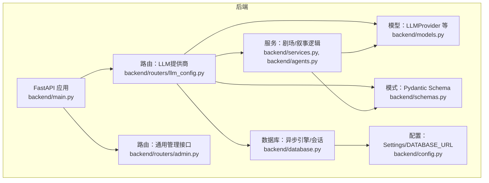
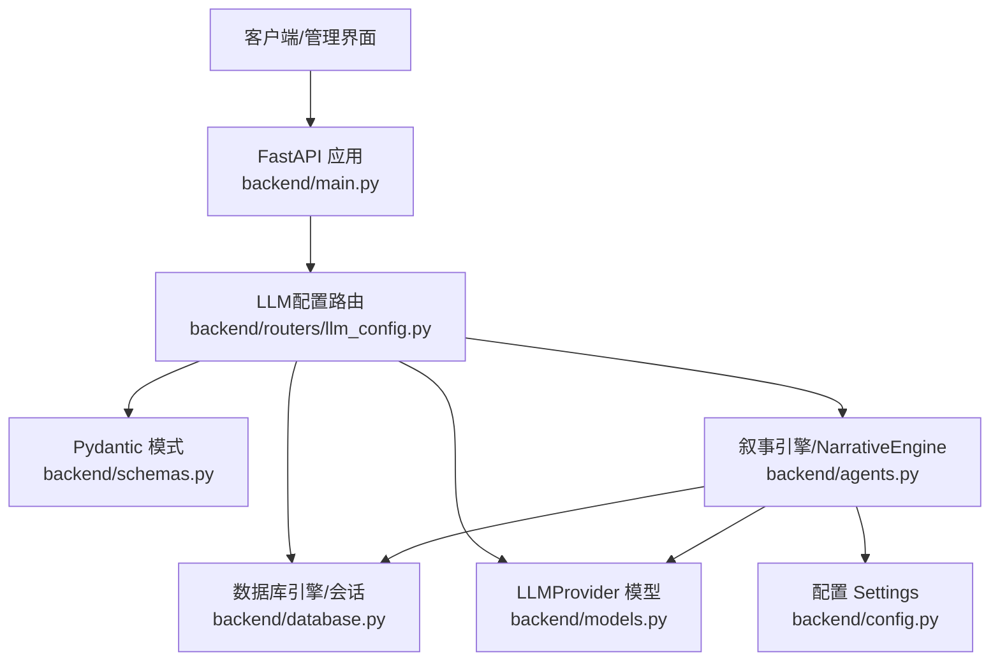
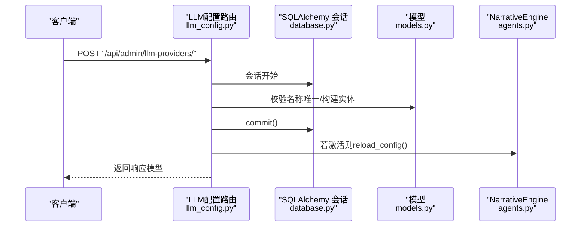
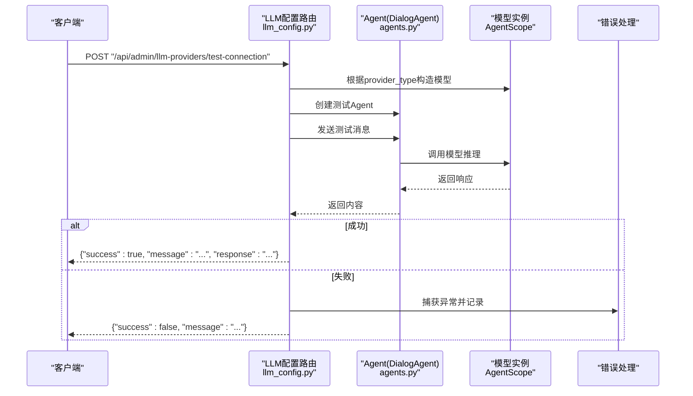
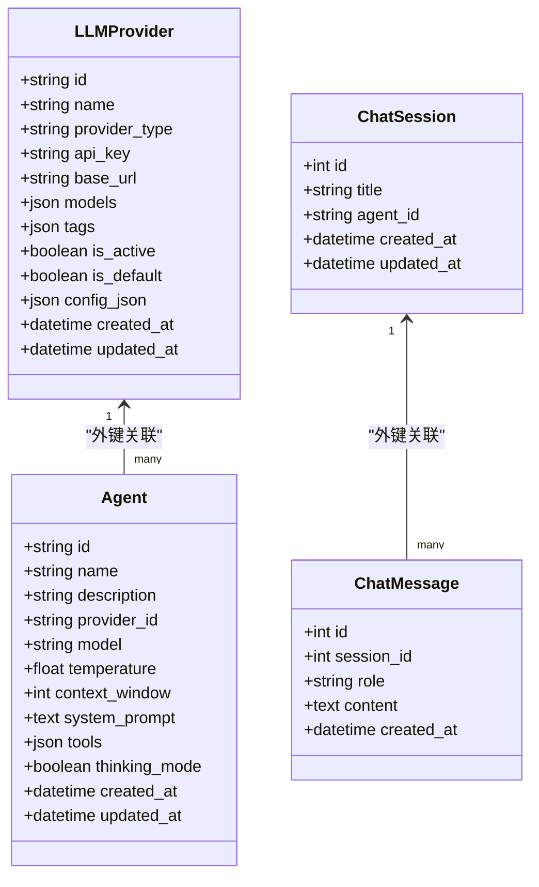
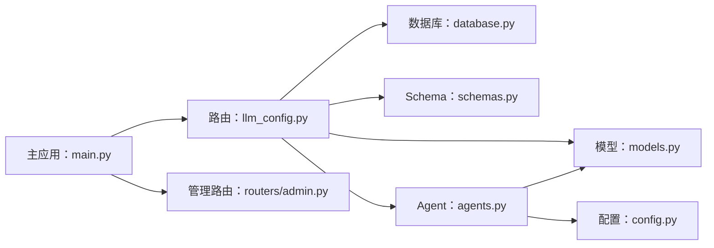

# LLM提供商API

<cite>
**本文引用的文件**
- [backend/main.py](file://backend/main.py)
- [backend/routers/llm_config.py](file://backend/routers/llm_config.py)
- [backend/models.py](file://backend/models.py)
- [backend/schemas.py](file://backend/schemas.py)
- [backend/database.py](file://backend/database.py)
- [backend/services.py](file://backend/services.py)
- [backend/agents.py](file://backend/agents.py)
- [backend/config.py](file://backend/config.py)
- [backend/routers/admin.py](file://backend/routers/admin.py)
- [backend/admin/src/hooks/useLLMProviders.ts](file://backend/admin/src/hooks/useLLMProviders.ts)
- [backend/admin/src/lib/api-utils.ts](file://backend/admin/src/lib/api-utils.ts)
</cite>

## 目录
1. [简介](#简介)
2. [项目结构](#项目结构)
3. [核心组件](#核心组件)
4. [架构总览](#架构总览)
5. [详细组件分析](#详细组件分析)
6. [依赖关系分析](#依赖关系分析)
7. [性能考虑](#性能考虑)
8. [故障排查指南](#故障排查指南)
9. [结论](#结论)
10. [附录](#附录)

## 简介
本文件面向后端与前端开发者，系统性梳理“LLM提供商API”的设计与实现，覆盖以下主题：
- LLM提供商的CRUD操作：创建、查询、更新、删除的完整流程与约束。
- 测试连接功能：针对OpenAI、Azure、DashScope、Anthropic、Gemini等提供商的连接测试机制。
- 数据库模型与SQLAlchemy异步会话管理：模型定义、会话生命周期与事务策略。
- 请求验证、响应序列化与错误处理最佳实践。
- 具体API端点示例与实际使用场景，指导安全地管理LLM提供商配置。

## 项目结构
后端采用FastAPI + SQLAlchemy异步引擎的分层架构：
- 路由层：集中于routers目录，按功能模块划分（如llm_config、admin、agents、chats）。
- 模型层：基于SQLAlchemy ORM定义数据模型（LLMProvider、Agent、ChatSession、ChatMessage等）。
- 服务层：封装业务逻辑（如玩家创建、故事初始化、叙事引擎交互）。
- 配置与数据库：统一从配置加载数据库URL，创建异步引擎与会话工厂。
- 前端Admin：通过SWR拉取LLM提供商列表，辅助配置与运维。

图表来源
- [backend/main.py](file://backend/main.py#L83-L97)
- [backend/routers/llm_config.py](file://backend/routers/llm_config.py#L1-L18)
- [backend/models.py](file://backend/models.py#L58-L79)
- [backend/schemas.py](file://backend/schemas.py#L4-L34)
- [backend/database.py](file://backend/database.py#L8-L23)
- [backend/services.py](file://backend/services.py#L8-L17)
- [backend/agents.py](file://backend/agents.py#L43-L126)
- [backend/config.py](file://backend/config.py#L11-L16)
- [backend/routers/admin.py](file://backend/routers/admin.py#L10-L14)

章节来源
- [backend/main.py](file://backend/main.py#L83-L97)
- [backend/routers/llm_config.py](file://backend/routers/llm_config.py#L1-L18)
- [backend/models.py](file://backend/models.py#L58-L79)
- [backend/schemas.py](file://backend/schemas.py#L4-L34)
- [backend/database.py](file://backend/database.py#L8-L23)
- [backend/services.py](file://backend/services.py#L8-L17)
- [backend/agents.py](file://backend/agents.py#L43-L126)
- [backend/config.py](file://backend/config.py#L11-L16)
- [backend/routers/admin.py](file://backend/routers/admin.py#L10-L14)

## 核心组件
- LLM提供商模型与Schema
  - 模型字段：名称、提供商类型、API密钥、基础URL、模型列表、标签、激活/默认状态、额外配置JSON、时间戳。
  - Pydantic模式：创建、更新、响应模型，确保输入校验与序列化一致性。
- 异步数据库会话
  - 使用SQLAlchemy异步引擎与async_sessionmaker，提供get_db依赖注入，保证每个请求的独立会话。
- 路由与控制器
  - 提供LLM提供商的CRUD与连接测试端点，结合NarrativeEngine进行配置热加载。
- 前端Hook
  - SWR拉取LLM提供商列表，过滤活跃提供商，便于前端配置面板使用。

章节来源
- [backend/models.py](file://backend/models.py#L58-L79)
- [backend/schemas.py](file://backend/schemas.py#L4-L34)
- [backend/database.py](file://backend/database.py#L8-L23)
- [backend/routers/llm_config.py](file://backend/routers/llm_config.py#L112-L202)
- [backend/admin/src/hooks/useLLMProviders.ts](file://backend/admin/src/hooks/useLLMProviders.ts#L5-L16)

## 架构总览
下图展示了LLM提供商API在系统中的位置与交互关系：

图表来源
- [backend/main.py](file://backend/main.py#L83-L97)
- [backend/routers/llm_config.py](file://backend/routers/llm_config.py#L1-L18)
- [backend/database.py](file://backend/database.py#L8-L23)
- [backend/models.py](file://backend/models.py#L58-L79)
- [backend/schemas.py](file://backend/schemas.py#L4-L34)
- [backend/agents.py](file://backend/agents.py#L43-L126)
- [backend/config.py](file://backend/config.py#L11-L16)

## 详细组件分析

### LLM提供商CRUD流程
- 创建提供商
  - 校验名称唯一性；若设置为默认，则取消其他默认标记；持久化后可触发NarrativeEngine重新加载配置。
- 查询提供商
  - 支持分页列表与按ID查询；ID为UUID字符串。
- 更新提供商
  - 支持部分字段更新；若更新为默认，则取消其他默认标记；若处于激活状态则触发配置重载。
- 删除提供商
  - 按ID查找并删除；返回成功标志。

图表来源
- [backend/routers/llm_config.py](file://backend/routers/llm_config.py#L112-L138)
- [backend/database.py](file://backend/database.py#L28-L30)
- [backend/models.py](file://backend/models.py#L58-L79)
- [backend/agents.py](file://backend/agents.py#L150-L152)

章节来源
- [backend/routers/llm_config.py](file://backend/routers/llm_config.py#L112-L202)
- [backend/database.py](file://backend/database.py#L28-L30)
- [backend/models.py](file://backend/models.py#L58-L79)
- [backend/agents.py](file://backend/agents.py#L150-L152)

### 测试连接功能实现机制
- 统一入口：POST /api/admin/llm-providers/test-connection
- 处理流程：
  - 初始化AgentScope运行环境。
  - 根据provider_type选择对应模型类（OpenAI/Azure、DashScope、Anthropic、Gemini），支持自定义base_url与额外生成参数。
  - 构造简单对话消息，调用模型推理，确保内容可序列化为字符串。
  - 成功时返回成功标志与简要响应内容；异常时捕获并返回服务器错误信息。

图表来源
- [backend/routers/llm_config.py](file://backend/routers/llm_config.py#L20-L111)
- [backend/agents.py](file://backend/agents.py#L11-L42)

章节来源
- [backend/routers/llm_config.py](file://backend/routers/llm_config.py#L20-L111)
- [backend/agents.py](file://backend/agents.py#L11-L42)

### 数据库模型设计与异步会话管理
- 模型设计要点
  - LLMProvider：以UUID为主键，name唯一索引；存储提供商类型、API密钥、基础URL、模型列表、标签、激活/默认状态、额外配置JSON及时间戳。
  - 其他相关模型：Player、StoryChapter、Asset、Agent、ChatSession、ChatMessage。
- 异步会话管理
  - 异步引擎与会话工厂：启用pool_pre_ping、连接池参数优化；SQLite场景设置线程检查参数。
  - 依赖注入：get_db提供异步上下文，确保每个请求拥有独立会话，避免跨请求污染。
  - 事务策略：每个路由内显式commit/refresh，保证数据一致性；删除操作后立即提交。

图表来源
- [backend/models.py](file://backend/models.py#L58-L122)

章节来源
- [backend/models.py](file://backend/models.py#L58-L122)
- [backend/database.py](file://backend/database.py#L8-L23)
- [backend/routers/llm_config.py](file://backend/routers/llm_config.py#L112-L202)

### 请求验证、响应序列化与错误处理最佳实践
- 请求验证
  - 使用Pydantic模式定义输入字段与约束（如温度范围、上下文窗口范围、最大长度限制），自动进行类型校验与字段过滤。
- 响应序列化
  - 使用响应模型（from_attributes=True）直接从ORM对象序列化，保持字段一致性与性能。
- 错误处理
  - 路由层：对未找到资源返回404，重复名称返回400；连接测试异常捕获并返回友好错误信息。
  - 服务层：业务异常向上抛出或转换为HTTP异常，避免静默失败。
  - 异常传播：FastAPI自动将HTTPException转换为标准响应格式。

章节来源
- [backend/schemas.py](file://backend/schemas.py#L4-L34)
- [backend/routers/llm_config.py](file://backend/routers/llm_config.py#L112-L202)

### API端点示例与使用场景
- 端点一览
  - POST /api/admin/llm-providers/test-connection：测试提供商连接，支持多提供商类型与自定义base_url。
  - POST /api/admin/llm-providers：创建提供商（名称唯一、默认标记互斥）。
  - GET /api/admin/llm-providers：分页查询提供商列表。
  - GET /api/admin/llm-providers/{provider_id}：按ID查询提供商。
  - PUT /api/admin/llm-providers/{provider_id}：更新提供商（部分字段、默认标记互斥、激活状态触发重载）。
  - DELETE /api/admin/llm-providers/{provider_id}：删除提供商。
- 实际使用场景
  - 新增提供商：填写名称、提供商类型、API密钥、模型列表、标签、是否激活/默认，提交后立即生效（若激活）。
  - 切换默认提供商：更新目标提供商为默认，系统自动取消其他默认标记，并触发配置重载。
  - 连接验证：在保存前先测试连接，确保密钥、URL与模型可用，避免无效配置进入生产环境。
  - 前端集成：通过SWR拉取列表，过滤活跃提供商用于选择与预览。

章节来源
- [backend/routers/llm_config.py](file://backend/routers/llm_config.py#L20-L202)
- [backend/admin/src/hooks/useLLMProviders.ts](file://backend/admin/src/hooks/useLLMProviders.ts#L5-L16)
- [backend/admin/src/lib/api-utils.ts](file://backend/admin/src/lib/api-utils.ts#L1-L19)

## 依赖关系分析
- 组件耦合
  - 路由层依赖数据库会话与模型，同时与服务层（NarrativeEngine）协作完成配置热加载。
  - 模型层与Schema层强绑定，确保数据结构与输入输出一致。
- 外部依赖
  - AgentScope：提供多提供商模型封装与消息接口，支撑连接测试与后续叙事生成。
  - Alembic：迁移工具在应用启动时执行，确保数据库结构与模型同步。
- 可能的循环依赖
  - 当前结构清晰，无明显循环导入；注意在新增模块时避免路由与服务互相导入。

图表来源
- [backend/routers/llm_config.py](file://backend/routers/llm_config.py#L1-L18)
- [backend/database.py](file://backend/database.py#L8-L23)
- [backend/models.py](file://backend/models.py#L58-L79)
- [backend/schemas.py](file://backend/schemas.py#L4-L34)
- [backend/agents.py](file://backend/agents.py#L43-L126)
- [backend/config.py](file://backend/config.py#L11-L16)
- [backend/main.py](file://backend/main.py#L83-L97)
- [backend/routers/admin.py](file://backend/routers/admin.py#L10-L14)

章节来源
- [backend/routers/llm_config.py](file://backend/routers/llm_config.py#L1-L18)
- [backend/database.py](file://backend/database.py#L8-L23)
- [backend/models.py](file://backend/models.py#L58-L79)
- [backend/schemas.py](file://backend/schemas.py#L4-L34)
- [backend/agents.py](file://backend/agents.py#L43-L126)
- [backend/config.py](file://backend/config.py#L11-L16)
- [backend/main.py](file://backend/main.py#L83-L97)
- [backend/routers/admin.py](file://backend/routers/admin.py#L10-L14)

## 性能考虑
- 异步I/O与连接池
  - 使用异步引擎与连接池参数（pool_pre_ping、pool_size、max_overflow）提升并发与稳定性。
- 会话生命周期
  - 通过依赖注入确保每个请求独立会话，避免共享状态引发的锁竞争与数据错乱。
- 序列化与校验
  - Pydantic模式在输入阶段完成严格校验，减少后续处理分支与异常开销。
- 连接测试
  - 尽量使用轻量级消息与短超时，避免阻塞主线程；必要时在后台任务中执行长耗时测试。

## 故障排查指南
- 数据库连接失败
  - 启动时自动重试并执行迁移；检查DATABASE_URL与网络可达性；确认Alembic版本与迁移脚本。
- 提供商连接测试失败
  - 核对API密钥、基础URL与模型名称；查看测试端点返回的错误信息；尝试不同提供商类型与base_url。
- 默认/激活状态冲突
  - 更新默认标记时会自动取消其他默认；若未生效，检查事务是否提交成功。
- 前端无法获取提供商列表
  - 确认路由前缀与端点路径一致；检查CORS配置；使用SWR调试器观察请求与响应。

章节来源
- [backend/main.py](file://backend/main.py#L45-L81)
- [backend/routers/llm_config.py](file://backend/routers/llm_config.py#L20-L111)
- [backend/routers/llm_config.py](file://backend/routers/llm_config.py#L112-L202)
- [backend/admin/src/hooks/useLLMProviders.ts](file://backend/admin/src/hooks/useLLMProviders.ts#L5-L16)

## 结论
本项目以清晰的分层架构实现了LLM提供商的全生命周期管理，结合AgentScope提供了多提供商的连接测试能力，并通过异步数据库会话与Pydantic模式保障了数据一致性与安全性。建议在生产环境中进一步强化：
- API密钥加密存储与访问控制；
- 连接测试的超时与重试策略；
- 完善审计日志与变更追踪；
- 前端表单的实时校验与提示。

## 附录
- 端点清单
  - POST /api/admin/llm-providers/test-connection：测试连接
  - POST /api/admin/llm-providers：创建提供商
  - GET /api/admin/llm-providers：查询提供商列表
  - GET /api/admin/llm-providers/{provider_id}：查询指定提供商
  - PUT /api/admin/llm-providers/{provider_id}：更新提供商
  - DELETE /api/admin/llm-providers/{provider_id}：删除提供商
- 前端Hook
  - useLLMProviders：拉取并过滤活跃提供商，便于配置面板使用。

章节来源
- [backend/routers/llm_config.py](file://backend/routers/llm_config.py#L20-L202)
- [backend/admin/src/hooks/useLLMProviders.ts](file://backend/admin/src/hooks/useLLMProviders.ts#L5-L16)
- [backend/admin/src/lib/api-utils.ts](file://backend/admin/src/lib/api-utils.ts#L1-L19)