# 智能体管理API

<cite>
**本文档引用的文件**
- [backend/main.py](file://backend/main.py)
- [backend/routers/agents.py](file://backend/routers/agents.py)
- [backend/routers/subscriptions.py](file://backend/routers/subscriptions.py)
- [backend/routers/chats.py](file://backend/routers/chats.py)
- [backend/routers/prompt_templates.py](file://backend/routers/prompt_templates.py)
- [backend/routers/videos.py](file://backend/routers/videos.py)
- [backend/routers/skills_api.py](file://backend/routers/skills_api.py)
- [backend/models.py](file://backend/models.py)
- [backend/schemas.py](file://backend/schemas.py)
- [backend/services/billing.py](file://backend/services/billing.py)
- [backend/services/video_generation.py](file://backend/services/video_generation.py)
- [backend/agents.py](file://backend/agents.py)
- [backend/database.py](file://backend/database.py)
- [backend/services/llm_stream.py](file://backend/services/llm_stream.py)
- [backend/services/agent_executor.py](file://backend/services/agent_executor.py)
- [backend/skills_manager.py](file://backend/skills_manager.py)
- [backend/mcp_manager/manager.py](file://backend/mcp_manager/manager.py)
- [backend/migrations/versions/h4i5j6k7l8m9_add_model_costs_and_subscriptions.py](file://backend/migrations/versions/h4i5j6k7l8m9_add_model_costs_and_subscriptions.py)
- [backend/migrations/versions/f2a3b4c5d6e7_add_image_search_billing.py](file://backend/migrations/versions/f2a3b4c5d6e7_add_image_search_billing.py)
- [backend/migrations/versions/d221879c21d9_add_agent_type_and_prompt_templates.py](file://backend/migrations/versions/d221879c21d9_add_agent_type_and_prompt_templates.py)
- [backend/migrations/versions/7459f2d26782_add_video_tasks_and_video_agent_fields.py](file://backend/migrations/versions/7459f2d26782_add_video_tasks_and_video_agent_fields.py)
- [frontend/src/hooks/useSocket.ts](file://frontend/src/hooks/useSocket.ts)
- [frontend/src/hooks/usePromptTemplates.ts](file://frontend/src/hooks/usePromptTemplates.ts)
- [frontend/src/app/admin/prompt-templates/PromptTemplateDialog.tsx](file://frontend/src/app/admin/prompt-templates/PromptTemplateDialog.tsx)
- [frontend/src/components/admin/agents/AgentForm/SystemPrompt.tsx](file://frontend/src/components/admin/agents/AgentForm/SystemPrompt.tsx)
- [frontend/src/components/admin/agents/AgentForm/Tools/index.tsx](file://frontend/src/components/admin/agents/AgentForm/Tools/index.tsx)
- [frontend/src/components/admin/agents/AgentForm/Tools/Skills.tsx](file://frontend/src/components/admin/agents/AgentForm/Tools/Skills.tsx)
- [frontend/src/components/admin/agents/AgentForm/Tools/MCPClients.tsx](file://frontend/src/components/admin/agents/AgentForm/Tools/MCPClients.tsx)
- [frontend/src/app/admin/skills/page.tsx](file://frontend/src/app/admin/skills/page.tsx)
- [frontend/src/app/admin/skills/SkillDialog.tsx](file://frontend/src/app/admin/skills/SkillDialog.tsx)
- [frontend/src/app/admin/mcp/page.tsx](file://frontend/src/app/admin/mcp/page.tsx)
- [README.md](file://README.md)
- [docs/wiki/Backend-Guide.md](file://docs/wiki/Backend-Guide.md)
</cite>

## 更新摘要
**所做更改**
- 新增智能体工具系统模块化重构：Skills 和 MCPClients 组件替代了原有的单一 Tools 组件
- 新增技能管理API，支持技能的创建、查询、更新、删除和启用/禁用
- 新增MCP客户端管理功能，支持Model Context Protocol客户端的动态连接
- 增强智能体对外部能力的管理，支持声明式技能包和热插拔机制
- 新增MCP客户端热重载支持，实现无感的客户端替换和连接恢复

## 目录
1. [简介](#简介)
2. [项目结构](#项目结构)
3. [核心组件](#核心组件)
4. [架构总览](#架构总览)
5. [详细组件分析](#详细组件分析)
6. [智能体执行服务](#智能体执行服务)
7. [xAI兼容性增强](#xai兼容性增强)
8. [错误处理与异常管理](#错误处理与异常管理)
9. [提示词模板系统](#提示词模板系统)
10. [智能体类型增强](#智能体类型增强)
11. [视频代理类型支持](#视频代理类型支持)
12. [视频生成API](#视频生成api)
13. [视频计费系统](#视频计费系统)
14. [视频生成服务](#视频生成服务)
15. [计费系统增强](#计费系统增强)
16. [订阅管理API](#订阅管理api)
17. [智能体工具系统](#智能体工具系统)
18. [技能管理系统](#技能管理系统)
19. [MCP客户端管理](#mcp客户端管理)
20. [依赖关系分析](#依赖关系分析)
21. [性能考虑](#性能考虑)
22. [故障排除指南](#故障排除指南)
23. [结论](#结论)
24. [附录](#附录)

## 简介
本文件为智能体管理API的专业技术文档，聚焦于多智能体系统的生命周期管理与协作机制。系统基于AgentScope多智能体框架，结合FastAPI后端与异步数据库访问，提供智能体创建、配置、启动与销毁的完整API；同时实现智能体状态同步、事件通知、配置热切换与性能优化能力。**本次更新重点集成了模块化的智能体工具系统，包括Skills和MCPClients组件，增强了智能体对外部能力的管理，新增了技能管理和MCP客户端管理功能。**

## 项目结构
后端采用分层架构：入口文件负责应用生命周期与路由注册，路由层提供REST API与WebSocket，服务层封装业务逻辑，模型层定义数据结构，工具层提供数据库连接与配置管理。前端通过WebSocket与后端进行实时通信。**新增智能体工具系统模块化重构，Skills和MCPClients组件替代了原有的单一Tools组件。**

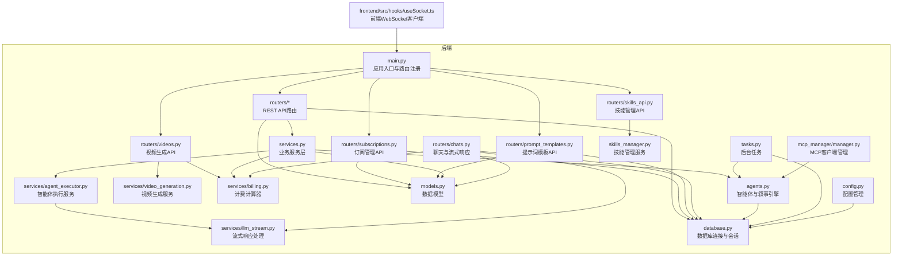

**图表来源**
- [backend/main.py:41-105](file://backend/main.py#L41-L105)
- [backend/routers/subscriptions.py:1-119](file://backend/routers/subscriptions.py#L1-L119)
- [backend/routers/prompt_templates.py:1-303](file://backend/routers/prompt_templates.py#L1-L303)
- [backend/routers/videos.py:1-232](file://backend/routers/videos.py#L1-L232)
- [backend/routers/skills_api.py:1-207](file://backend/routers/skills_api.py#L1-L207)
- [backend/services/billing.py:1-324](file://backend/services/billing.py#L1-L324)
- [backend/services/agent_executor.py:1-150](file://backend/services/agent_executor.py#L1-L150)
- [backend/services/video_generation.py:1-203](file://backend/services/video_generation.py#L1-L203)
- [backend/services/llm_stream.py:1-552](file://backend/services/llm_stream.py#L1-L552)
- [backend/routers/chats.py:1-393](file://backend/routers/chats.py#L1-L393)
- [backend/models.py:1-382](file://backend/models.py#L1-L382)
- [backend/skills_manager.py:1-408](file://backend/skills_manager.py#L1-L408)
- [backend/mcp_manager/manager.py:1-138](file://backend/mcp_manager/manager.py#L1-L138)

**章节来源**
- [README.md:34-51](file://README.md#L34-L51)
- [docs/wiki/Backend-Guide.md:1-21](file://docs/wiki/Backend-Guide.md#L1-L21)

## 核心组件
- 应用入口与生命周期：负责数据库迁移、Lifespan钩子、CORS配置、路由注册与WebSocket端点。
- 智能体管理路由：提供智能体的增删改查、名称唯一性校验、提供商与模型可用性校验。
- **智能体执行服务**：提供统一的智能体执行接口，支持消息格式化、xAI兼容处理和异常管理。
- **xAI兼容性支持**：优化xAI平台的消息格式化，处理name字段的特殊要求，确保与其他LLM提供商的兼容性。
- **错误处理与异常管理**：改进智能体创建和处理逻辑，增强异常捕获和错误恢复机制。
- **提示词模板路由**：提供模板的创建、查询、更新、删除和AI生成功能，支持Jinja2模板渲染。
- **计费服务层**：实现多维度积分计算、费率映射表驱动的计费算法和实时扣费逻辑。
- **订阅管理路由**：提供套餐计划的创建、查询、更新和删除操作，支持管理员权限控制。
- **视频生成API**：提供视频生成任务的提交、状态查询和结果获取，支持异步处理。
- **视频计费系统**：实现视频任务的积分计费，支持按输入图片数量和输出时长的精确计费。
- **视频生成服务**：基于xAI平台实现视频生成，支持文本到视频、图片到视频、视频编辑三种模式。
- **智能体工具系统**：模块化重构的工具管理，包含Skills和MCPClients两个独立组件。
- **技能管理系统**：支持技能的创建、查询、更新、删除和启用/禁用，实现声明式工具包管理。
- **MCP客户端管理**：支持Model Context Protocol客户端的动态连接、热重载和无感替换。
- 数据模型与序列化：定义智能体、LLM提供商、聊天会话、消息、**CreditTransaction**、**SubscriptionPlan**、**PromptTemplate**、**VideoTask**和**VideoConfig**的数据结构及Pydantic验证模型。
- 叙事引擎与AgentScope：封装多智能体协作（导演、旁白、NPC管理），支持动态配置加载与章节生成。
- 聊天与流式响应：支持OpenAI/DashScope等提供商的流式对话，记录上下文与Token统计，并集成实时计费扣费。
- 后台管理接口：提供统计、玩家与剧情管理等管理功能。
- 任务调度：实现章节预生成与资源生成的后台任务。

**章节来源**
- [backend/main.py:45-82](file://backend/main.py#L45-L82)
- [backend/routers/agents.py:15-55](file://backend/routers/agents.py#L15-L55)
- [backend/services/agent_executor.py:77-112](file://backend/services/agent_executor.py#L77-L112)
- [backend/agents.py:71-74](file://backend/agents.py#L71-L74)
- [backend/routers/prompt_templates.py:1-303](file://backend/routers/prompt_templates.py#L1-L303)
- [backend/services/billing.py:1-324](file://backend/services/billing.py#L1-L324)
- [backend/routers/subscriptions.py:1-119](file://backend/routers/subscriptions.py#L1-L119)
- [backend/routers/videos.py:1-232](file://backend/routers/videos.py#L1-L232)
- [backend/models.py:100-122](file://backend/models.py#L100-L122)
- [backend/schemas.py:43-73](file://backend/schemas.py#L43-L73)
- [backend/agents.py:43-196](file://backend/agents.py#L43-L196)
- [backend/routers/chats.py:72-258](file://backend/routers/chats.py#L72-L258)
- [backend/tasks.py:7-55](file://backend/tasks.py#L7-L55)
- [backend/routers/skills_api.py:1-207](file://backend/routers/skills_api.py#L1-L207)
- [backend/skills_manager.py:1-408](file://backend/skills_manager.py#L1-L408)
- [backend/mcp_manager/manager.py:1-138](file://backend/mcp_manager/manager.py#L1-L138)

## 架构总览
系统采用"路由层-服务层-模型层-基础设施层"的分层设计，智能体管理API位于路由层，通过服务层与数据库交互，使用AgentScope进行多智能体编排。**新增模块化的智能体工具系统，Skills和MCPClients组件提供更精细的外部能力管理。**WebSocket用于实时状态推送，后台任务实现章节预生成与资源生成。

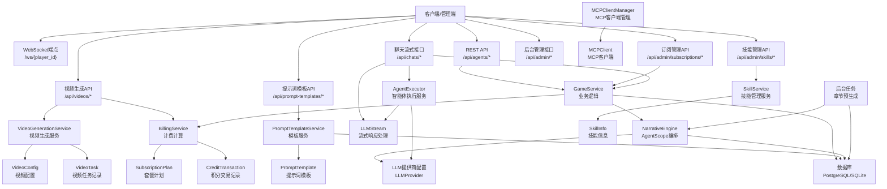

**图表来源**
- [backend/main.py:157-169](file://backend/main.py#L157-L169)
- [backend/routers/agents.py:1-141](file://backend/routers/agents.py#L1-L141)
- [backend/routers/subscriptions.py:1-119](file://backend/routers/subscriptions.py#L1-L119)
- [backend/routers/prompt_templates.py:1-303](file://backend/routers/prompt_templates.py#L1-L303)
- [backend/routers/chats.py:1-393](file://backend/routers/chats.py#L1-L393)
- [backend/routers/videos.py:1-232](file://backend/routers/videos.py#L1-L232)
- [backend/routers/skills_api.py:1-207](file://backend/routers/skills_api.py#L1-L207)
- [backend/services/billing.py:1-324](file://backend/services/billing.py#L1-L324)
- [backend/services/agent_executor.py:1-150](file://backend/services/agent_executor.py#L1-L150)
- [backend/services/video_generation.py:1-203](file://backend/services/video_generation.py#L1-L203)
- [backend/services/llm_stream.py:1-552](file://backend/services/llm_stream.py#L1-L552)
- [backend/models.py:180-382](file://backend/models.py#L180-L382)
- [backend/skills_manager.py:263-408](file://backend/skills_manager.py#L263-L408)
- [backend/mcp_manager/manager.py:28-138](file://backend/mcp_manager/manager.py#L28-L138)

## 详细组件分析

### 智能体生命周期管理API
- 创建智能体
  - 接口：POST /api/agents/
  - 校验：名称唯一性、提供商存在性、模型在提供商模型列表中
  - 返回：创建后的智能体对象
- 列表查询
  - 接口：GET /api/agents/?skip=&limit=&search=
  - 功能：分页与模糊搜索
- 获取单个智能体
  - 接口：GET /api/agents/{agent_id}
- 更新智能体
  - 接口：PUT /api/agents/{agent_id}
  - 校验：名称唯一性、提供商与模型有效性
  - 支持字段：名称、描述、提供商、模型、温度、上下文窗口、系统提示、工具、思考模式、**积分费率字段**、**智能体类型**
- 删除智能体
  - 接口：DELETE /api/agents/{agent_id}
  - 行为：审计日志打印并删除

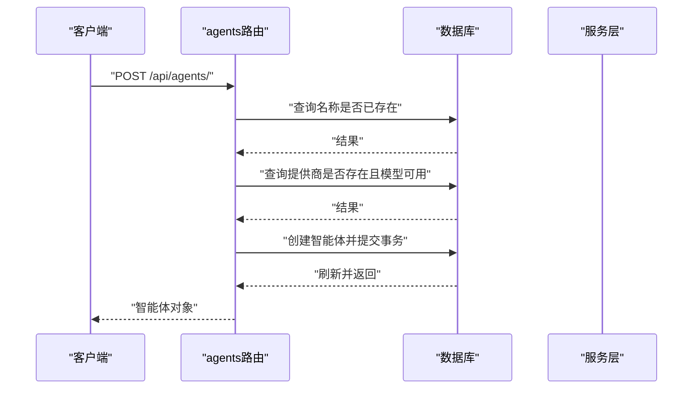

**图表来源**
- [backend/routers/agents.py:15-55](file://backend/routers/agents.py#L15-L55)

**章节来源**
- [backend/routers/agents.py:15-141](file://backend/routers/agents.py#L15-L141)
- [backend/schemas.py:54-73](file://backend/schemas.py#L54-L73)
- [backend/models.py:134-177](file://backend/models.py#L134-L177)

### 智能体状态同步与事件通知
- WebSocket端点
  - 接口：GET /ws/{player_id}
  - 功能：接受客户端消息并回显，预留剧情更新推送通道
- 实时状态更新
  - 建议：在故事初始化与章节生成完成后，通过WebSocket向对应player_id推送状态事件
  - 事件格式：包含章节状态、内容片段、选择分支等
- 事件通知最佳实践
  - 使用房间概念按player_id隔离消息
  - 在后台任务完成后触发推送，避免阻塞请求线程

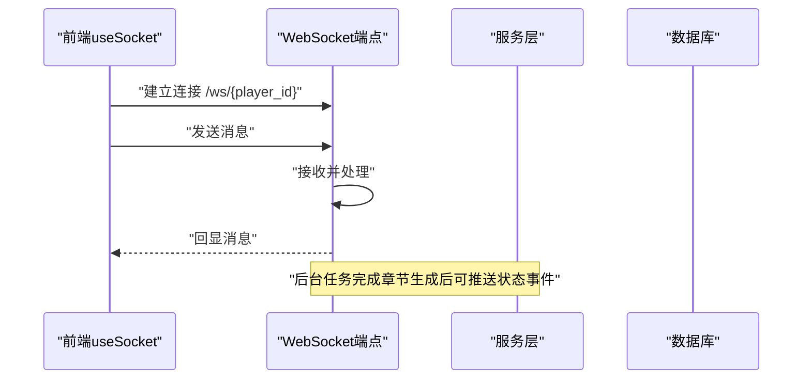

**图表来源**
- [backend/main.py:157-169](file://backend/main.py#L157-L169)
- [frontend/src/hooks/useSocket.ts:1-43](file://frontend/src/hooks/useSocket.ts#L1-L43)

**章节来源**
- [backend/main.py:157-169](file://backend/main.py#L157-L169)
- [frontend/src/hooks/useSocket.ts:1-43](file://frontend/src/hooks/useSocket.ts#L1-L43)

### 智能体配置管理与热切换
- 配置来源
  - 数据库：LLMProvider表存储提供商类型、API密钥、基础URL、模型列表、标签、启用状态、默认标记与**模型成本配置**与额外配置
  - 环境变量：作为回退配置（如OPENAI_API_KEY、STORY_GENERATION_MODEL）
- 加载流程
  - 应用启动或首次使用时，NarrativeEngine从数据库加载活动提供商，解析模型列表并初始化AgentScope模型
  - 支持动态重载：通过reload_config触发配置刷新
- 参数调整接口
  - 智能体更新接口支持调整温度、上下文窗口、系统提示、工具与思考模式
  - **新增积分费率字段**：input_credit_per_1m、output_credit_per_1m、image_output_credit_per_1m、search_credit_per_query
  - **新增智能体类型字段**：text、image、multimodal、**video**
  - LLM提供商接口支持增删改查与连接测试

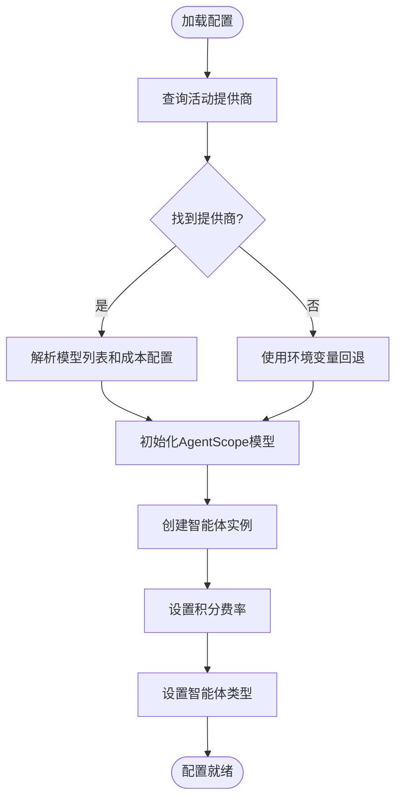

**图表来源**
- [backend/agents.py:49-99](file://backend/agents.py#L49-L99)
- [backend/config.py:22-28](file://backend/config.py#L22-L28)

**章节来源**
- [backend/agents.py:43-196](file://backend/agents.py#L43-L196)
- [backend/config.py:1-34](file://backend/config.py#L1-L34)
- [backend/routers/admin.py:16-31](file://backend/routers/admin.py#L16-L31)

### 智能体间通信协议与消息传递
- 消息结构
  - 使用Msg对象承载角色、名称与内容，支持system、user、assistant等角色
  - 对话历史按角色映射组织，系统提示优先
- 协作流程
  - 导演（Director）负责剧情大纲与一致性校验
  - 旁白（Narrator）根据大纲生成详细文本
  - NPC管理（NPC_Manager）维护角色关系与反应
- 流式响应
  - OpenAI/Azure：使用流式补全，增量返回token统计
  - DashScope：增量输出，聚合完整响应后保存

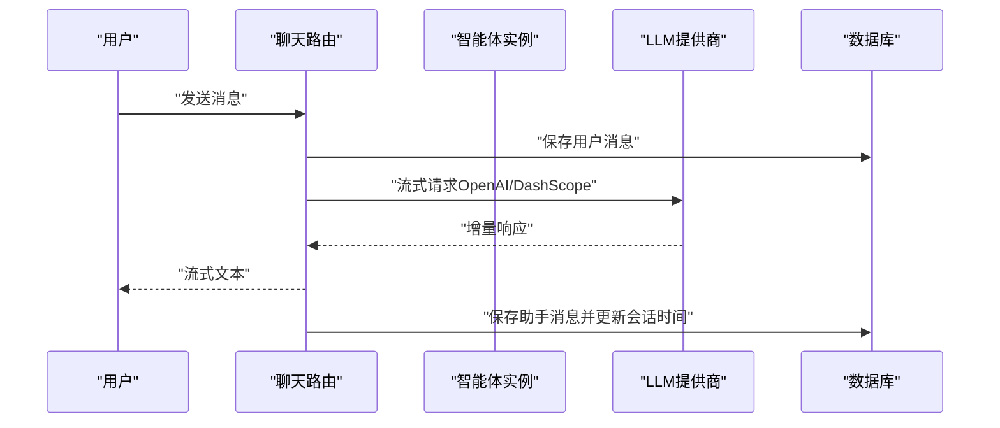

**图表来源**
- [backend/routers/chats.py:72-258](file://backend/routers/chats.py#L72-L258)
- [backend/agents.py:11-42](file://backend/agents.py#L11-L42)

**章节来源**
- [backend/routers/chats.py:72-258](file://backend/routers/chats.py#L72-L258)
- [backend/agents.py:11-42](file://backend/agents.py#L11-L42)

### 性能优化与后台任务
- 连接池与超时
  - 异步引擎配置连接池、预检与溢出连接数，提升并发稳定性
- 上下文窗口与温度
  - 通过智能体参数限制输入长度与随机性，平衡质量与成本
- 预生成策略
  - N+2预生成：当前章节完成后，预生成下一章内容，降低等待延迟
  - 资源生成：章节内容分析后触发图像等资源生成任务

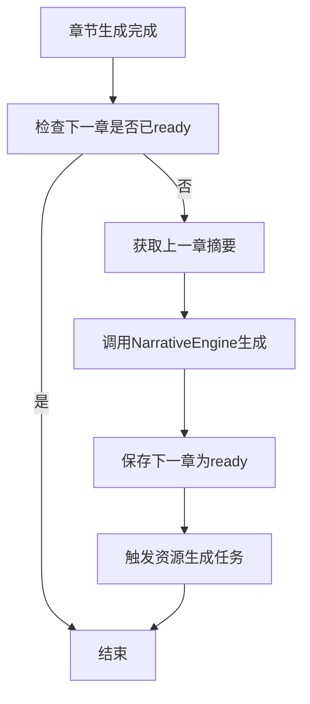

**图表来源**
- [backend/tasks.py:7-55](file://backend/tasks.py#L7-L55)
- [backend/agents.py:154-191](file://backend/agents.py#L154-L191)

**章节来源**
- [backend/database.py:8-23](file://backend/database.py#L8-L23)
- [backend/tasks.py:7-55](file://backend/tasks.py#L7-L55)

## 智能体执行服务

### 统一智能体执行接口
智能体执行服务提供了统一的智能体处理接口，简化了智能体的创建、配置和执行流程。

- **AgentExecutor类**
  - 负责智能体的生命周期管理
  - 提供标准化的消息处理接口
  - 支持智能体配置的动态加载和缓存

- **执行流程**
  - 加载智能体配置
  - 加载LLM提供商配置
  - 获取或创建DialogAgent实例
  - 准备输入消息
  - 执行智能体回复
  - 提取使用统计信息

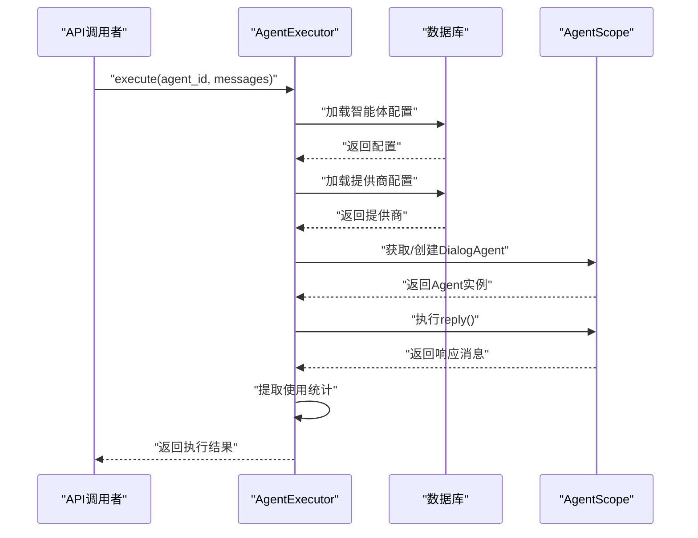

**图表来源**
- [backend/services/agent_executor.py:77-112](file://backend/services/agent_executor.py#L77-L112)

**章节来源**
- [backend/services/agent_executor.py:77-112](file://backend/services/agent_executor.py#L77-L112)

### 智能体回复处理增强
改进的智能体回复处理机制增强了xAI平台的兼容性，优化了消息格式化和异常处理。

- **xAI兼容性处理**
  - 特殊处理xAI平台的消息格式要求
  - 仅在user角色消息中保留name字段
  - 其他角色消息自动移除name字段

- **消息格式化优化**
  - 统一的消息角色映射
  - 输入字符数计算优化
  - 响应内容提取和标准化

**章节来源**
- [backend/agents.py:71-74](file://backend/agents.py#L71-L74)
- [backend/agents.py:106-108](file://backend/agents.py#L106-L108)

## xAI兼容性增强

### 平台支持扩展
系统现在支持xAI平台，通过专门的配置和消息格式化处理确保与xAI API的兼容性。

- **xAI平台配置**
  - 默认base_url：https://api.x.ai/v1
  - 支持的供应商类型：xai
  - 兼容OpenAI API格式

- **消息格式化优化**
  - xAI平台对消息格式有特殊要求
  - 仅允许user角色消息包含name字段
  - 其他角色消息需要移除name字段

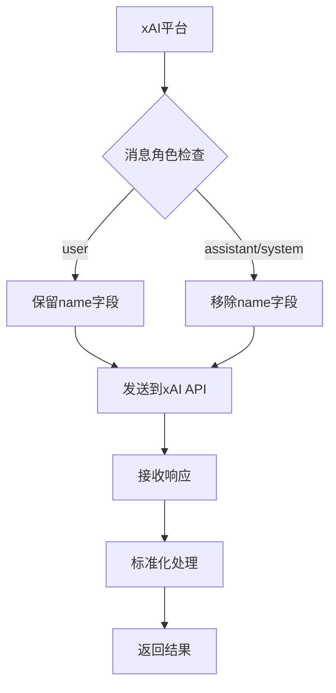

**图表来源**
- [backend/agents.py:71-74](file://backend/agents.py#L71-L74)
- [backend/services/llm_stream.py:41-42](file://backend/services/llm_stream.py#L41-L42)

**章节来源**
- [backend/agents.py:71-74](file://backend/agents.py#L71-L74)
- [backend/services/llm_stream.py:41-42](file://backend/services/llm_stream.py#L41-L42)
- [backend/agents.py:179-187](file://backend/agents.py#L179-L187)

### 流式响应处理优化
改进的流式响应处理机制增强了xAI平台的兼容性和错误处理能力。

- **xAI流式响应支持**
  - 支持xAI平台的流式响应格式
  - 正确处理xAI特有的响应结构
  - 优化响应内容提取和拼接

- **错误处理增强**
  - 改进的异常捕获和处理
  - 错误信息的标准化输出
  - 响应内容的完整性检查

**章节来源**
- [backend/services/llm_stream.py:65-109](file://backend/services/llm_stream.py#L65-L109)
- [backend/services/llm_stream.py:544-552](file://backend/services/llm_stream.py#L544-L552)

## 错误处理与异常管理

### 智能体创建错误处理
改进的智能体创建逻辑增强了错误处理和异常管理能力。

- **增强的异常处理**
  - 捕获HTTPException并重新抛出
  - 捕获通用异常并记录详细错误信息
  - 使用traceback打印堆栈跟踪

- **错误恢复机制**
  - 数据库事务的正确提交和回滚
  - 错误状态码的标准化
  - 用户友好的错误消息

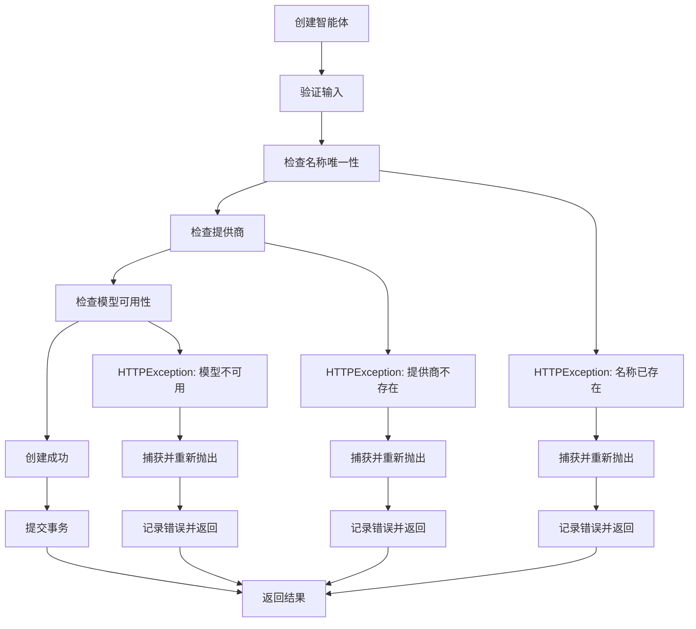

**图表来源**
- [backend/routers/agents.py:18-64](file://backend/routers/agents.py#L18-L64)

**章节来源**
- [backend/routers/agents.py:18-64](file://backend/routers/agents.py#L18-L64)

### 流式响应异常处理
改进的流式响应处理增强了异常捕获和错误恢复能力。

- **异常捕获机制**
  - 捕获流式响应过程中的所有异常
  - 记录详细的错误信息和上下文
  - 提供用户友好的错误消息

- **错误恢复策略**
  - 生成失败时不保存消息
  - 不进行积分扣费
  - 清晰的错误状态报告

**章节来源**
- [backend/routers/chats.py:378-386](file://backend/routers/chats.py#L378-L386)
- [backend/services/llm_stream.py:544-552](file://backend/services/llm_stream.py#L544-L552)

### 计费系统异常处理
增强的计费系统异常处理机制确保了积分扣费的可靠性和一致性。

- **原子扣费机制**
  - 使用UPDATE语句的原子性保证
  - 多条件检查确保扣费安全性
  - 详细的错误诊断信息

- **异常分类处理**
  - 余额不足异常
  - 余额冻结异常
  - 用户不存在异常
  - 其他未知异常

**章节来源**
- [backend/services/billing.py:167-200](file://backend/services/billing.py#L167-L200)

## 提示词模板系统

### 模板管理API
系统提供了完整的提示词模板管理系统，支持模板的创建、查询、更新、删除和AI生成功能。

- **API端点**
  - POST /api/prompt-templates/：创建新的提示词模板
  - GET /api/prompt-templates/：获取模板列表（支持过滤）
  - GET /api/prompt-templates/{template_id}：获取模板详情
  - PUT /api/prompt-templates/{template_id}：更新模板
  - DELETE /api/prompt-templates/{template_id}：删除模板
  - POST /api/prompt-templates/{template_id}/generate：基于模板生成AI内容

- **模板类型**
  - story_basic：故事基础设定
  - character：角色设定
  - scene：场景描述
  - storyboard：分镜脚本
  - custom：自定义

- **智能体类型**
  - text：文本处理智能体
  - image：图像处理智能体
  - multimodal：多模态智能体
  - **video：视频处理智能体**

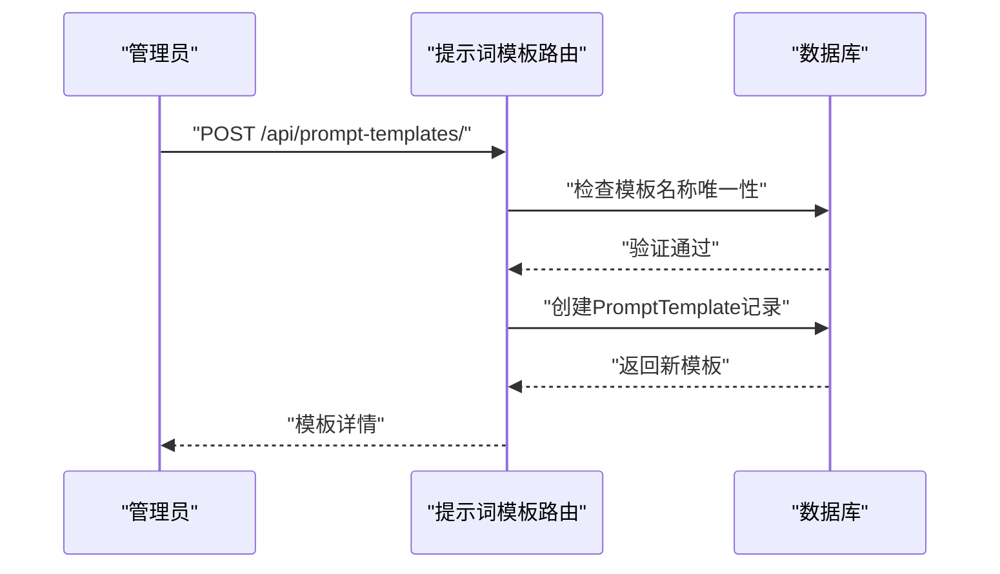

**图表来源**
- [backend/routers/prompt_templates.py:32-58](file://backend/routers/prompt_templates.py#L32-L58)

### 模板变量系统
模板支持Jinja2格式的变量替换，管理员可以定义输入变量及其类型。

- **变量类型**
  - string：单行文本
  - textarea：多行文本
  - number：数字
  - boolean：布尔值
  - select：下拉选择

- **变量定义**
  - name：变量名（英文）
  - label：显示标签
  - type：变量类型
  - required：是否必填
  - options：选项列表（select类型）
  - default：默认值
  - description：变量说明

**章节来源**
- [backend/routers/prompt_templates.py:1-303](file://backend/routers/prompt_templates.py#L1-L303)
- [backend/models.py:287-322](file://backend/models.py#L287-L322)
- [backend/schemas.py:468-538](file://backend/schemas.py#L468-L538)

### AI内容生成流程
系统提供基于模板的AI内容生成功能，支持流式响应和计费计算。

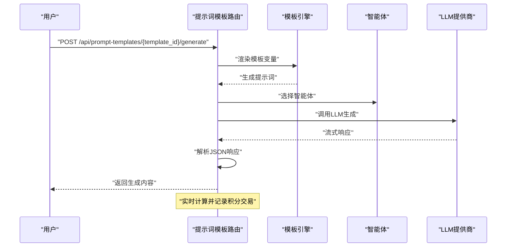

**图表来源**
- [backend/routers/prompt_templates.py:157-275](file://backend/routers/prompt_templates.py#L157-L275)

**章节来源**
- [backend/routers/prompt_templates.py:157-275](file://backend/routers/prompt_templates.py#L157-L275)

### 前端模板管理界面
前端提供了完整的模板管理界面，支持模板的创建、编辑、删除和导入。

- **模板对话框**
  - 基础信息：名称、描述、模板分类
  - 智能体类型：text、image、multimodal、**video**选择
  - 提示词内容：系统提示词和用户提示词（可选）
  - 输入变量：动态变量定义和管理
  - 状态设置：启用状态和默认模板设置

- **模板导入功能**
  - 支持从模板库导入系统提示词
  - 智能体类型过滤和模板类型筛选
  - 搜索和分页功能

**章节来源**
- [frontend/src/hooks/usePromptTemplates.ts:1-53](file://frontend/src/hooks/usePromptTemplates.ts#L1-L53)
- [frontend/src/app/admin/prompt-templates/PromptTemplateDialog.tsx:1-416](file://frontend/src/app/admin/prompt-templates/PromptTemplateDialog.tsx#L1-L416)
- [frontend/src/components/admin/agents/AgentForm/SystemPrompt.tsx:49-173](file://frontend/src/components/admin/agents/AgentForm/SystemPrompt.tsx#L49-L173)

## 智能体类型增强

### 多模态智能体支持
系统现在支持四种智能体类型，满足不同的AI应用场景。

- **文本智能体（text）**
  - 适用于纯文本生成和对话
  - 支持标准的system/user/assistant消息格式
  - 适合故事创作、角色对话等场景

- **图像智能体（image）**
  - 专门用于图像生成和处理
  - 支持图像生成、编辑和分析
  - 适合游戏场景、角色设计等视觉内容

- **多模态智能体（multimodal）**
  - 支持文本和图像的综合处理
  - 可以同时处理多种类型的内容
  - 适合复杂的游戏创作场景

- **视频智能体（video）**
  - 专门用于视频生成和处理
  - 支持多种视频生成模式
  - 适合动态内容创作和多媒体场景

### 智能体类型与模板匹配
模板系统会根据智能体类型自动匹配合适的模板，确保生成内容的质量。

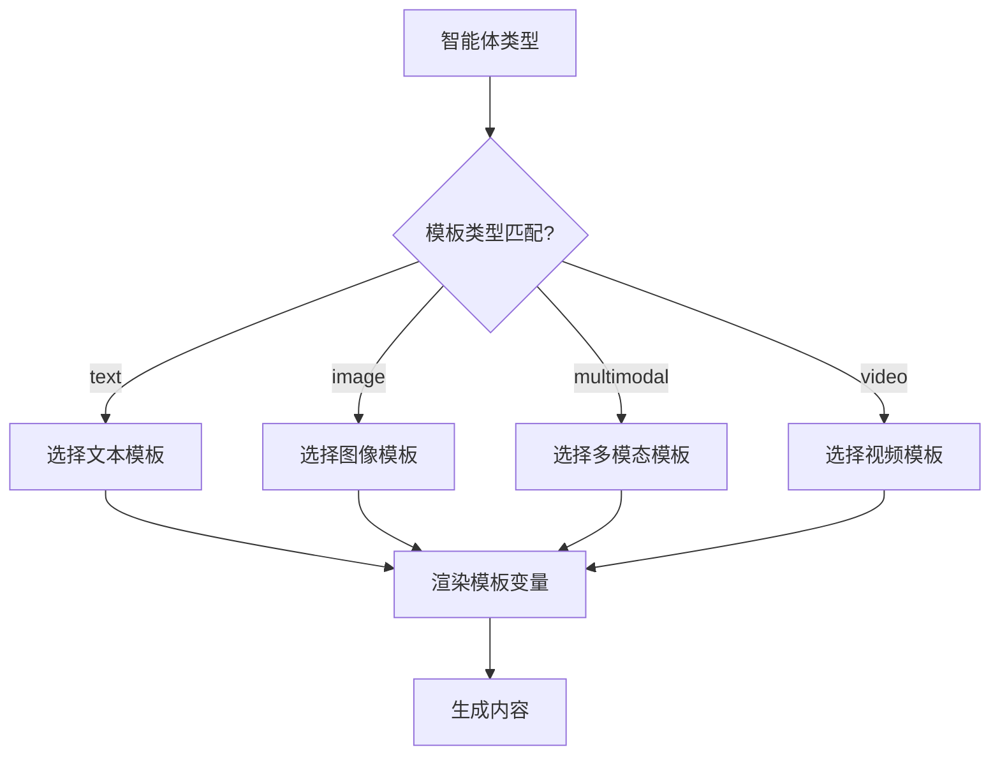

**图表来源**
- [backend/routers/prompt_templates.py:182-196](file://backend/routers/prompt_templates.py#L182-L196)

**章节来源**
- [backend/models.py:178-179](file://backend/models.py#L178-L179)
- [backend/models.py:298-299](file://backend/models.py#L298-L299)
- [backend/routers/prompt_templates.py:182-196](file://backend/routers/prompt_templates.py#L182-L196)

## 视频代理类型支持

### 视频智能体类型
系统新增了视频智能体类型，专门处理视频相关的AI任务。

- **视频智能体特征**
  - 专用于视频生成和处理
  - 支持多种视频生成模式
  - 集成视频计费系统
  - 与xAI平台深度集成

- **视频智能体配置**
  - 支持视频输入图片计费
  - 支持视频输入时长计费
  - 支持不同输出画质计费
  - 集成视频生成参数配置

**章节来源**
- [backend/models.py:196-200](file://backend/models.py#L196-L200)
- [backend/schemas.py:211-215](file://backend/schemas.py#L211-L215)

### 视频智能体计费字段
视频智能体支持四种计费维度，提供精确的成本控制。

- **计费维度**
  - video_input_image：按输入图片数量计费
  - video_input_second：按输入视频时长计费
  - video_output_480p：按480p输出时长计费
  - video_output_720p：按720p输出时长计费

- **计费字段**
  - video_input_image_credit：每张输入图片积分
  - video_input_second_credit：每秒输入视频积分
  - video_output_480p_credit：每秒480p输出积分
  - video_output_720p_credit：每秒720p输出积分

**章节来源**
- [backend/models.py:196-200](file://backend/models.py#L196-L200)
- [backend/schemas.py:211-215](file://backend/schemas.py#L211-L215)

## 视频生成API

### 视频生成任务管理
系统提供了完整的视频生成API，支持异步视频生成任务的提交、查询和管理。

- **API端点**
  - POST /api/videos/：提交视频生成任务
  - GET /api/videos/{task_id}/status：查询任务状态
  - GET /api/videos/session/{session_id}：获取会话视频任务列表

- **视频生成模式**
  - text_to_video：文本生成视频
  - image_to_video：图片生成视频
  - edit：视频编辑

- **任务状态管理**
  - pending：待处理
  - processing：处理中
  - completed：已完成
  - failed：失败

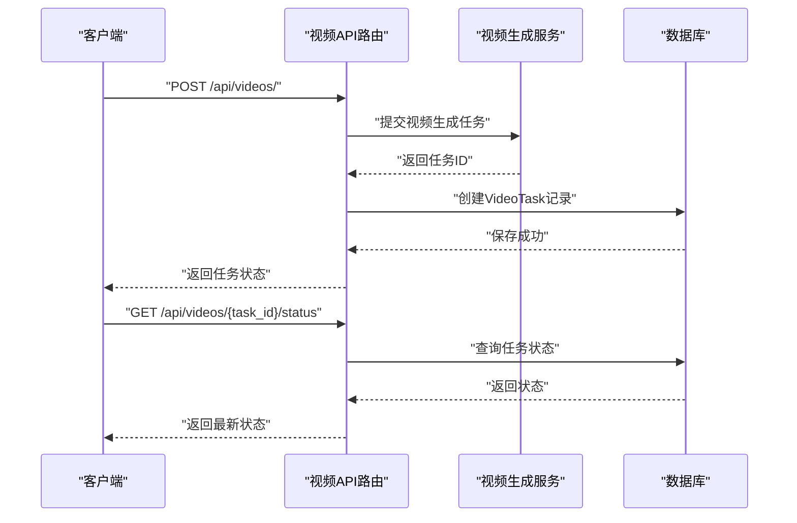

**图表来源**
- [backend/routers/videos.py:23-104](file://backend/routers/videos.py#L23-L104)
- [backend/routers/videos.py:107-185](file://backend/routers/videos.py#L107-L185)

### 视频生成请求处理
视频生成API提供了完整的请求处理流程，包括配置合并、任务创建和状态轮询。

- **请求处理流程**
  - 验证智能体存在性
  - 合并视频配置
  - 构建视频上下文
  - 提交到xAI平台
  - 创建数据库记录
  - 返回初始状态

- **状态轮询机制**
  - 终态直接返回缓存结果
  - 非终态查询xAI状态
  - 超时保护机制
  - 自动失败处理

**章节来源**
- [backend/routers/videos.py:23-104](file://backend/routers/videos.py#L23-L104)
- [backend/routers/videos.py:107-185](file://backend/routers/videos.py#L107-L185)

### 视频任务状态管理
系统实现了完整的视频任务状态管理，支持异步处理和状态追踪。

- **状态转换**
  - created → pending → processing → completed/failed
  - 支持超时检测和自动失败
  - 内容审核失败自动标记失败

- **任务完成处理**
  - 下载视频到本地存储
  - 计算视频时长和积分
  - 扣费并记录交易
  - 在聊天会话中插入消息

**章节来源**
- [backend/routers/videos.py:147-185](file://backend/routers/videos.py#L147-L185)

## 视频计费系统

### 视频计费算法
系统实现了基于映射表驱动的视频计费算法，支持多种计费维度的精确计算。

- **计费维度映射表**
  - video_input_image：按输入图片数量计费
  - video_input_second：按输入视频时长计费
  - video_output_480p：按480p输出时长计费
  - video_output_720p：按720p输出时长计费

- **计费计算流程**
  - 根据输出画质选择对应计费字段
  - 计算各维度的数量和费率
  - 应用scale因子进行转换
  - 汇总得到总费用

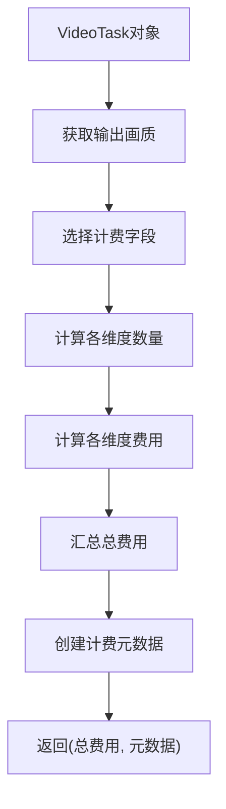

**图表来源**
- [backend/services/billing.py:287-324](file://backend/services/billing.py#L287-L324)

### 计费元数据记录
视频计费系统会详细记录每个计费维度的元数据，便于审计和分析。

- **元数据字段**
  - agent_name：智能体名称
  - model：使用的模型
  - video_mode：视频生成模式
  - quality：输出画质
  - video_input_image_quantity：输入图片数量
  - video_input_image_rate：图片计费费率
  - video_output_480p_quantity：480p输出时长
  - video_output_480p_rate：480p计费费率
  - video_output_720p_quantity：720p输出时长
  - video_output_720p_rate：720p计费费率

**章节来源**
- [backend/services/billing.py:287-324](file://backend/services/billing.py#L287-L324)

### 视频计费字段映射
系统通过映射表实现视频计费字段的动态选择，避免复杂的条件判断。

- **质量到字段映射**
  - 480p → video_output_480p
  - 720p → video_output_720p

- **维度到字段映射**
  - video_input_image → video_input_image_credit
  - video_input_second → video_input_second_credit
  - video_output_480p → video_output_480p_credit
  - video_output_720p → video_output_720p_credit

**章节来源**
- [backend/services/billing.py:22-35](file://backend/services/billing.py#L22-L35)

## 视频生成服务

### xAI视频生成集成
系统基于xAI平台实现了完整的视频生成服务，支持多种视频生成模式。

- **支持的视频模式**
  - text_to_video：文本生成视频
  - image_to_video：图片生成视频
  - edit：视频编辑

- **API集成**
  - 提交接口：POST /v1/videos/generations
  - 轮询接口：GET /v1/videos/{request_id}
  - 状态映射：队列/待处理/处理中/完成/失败

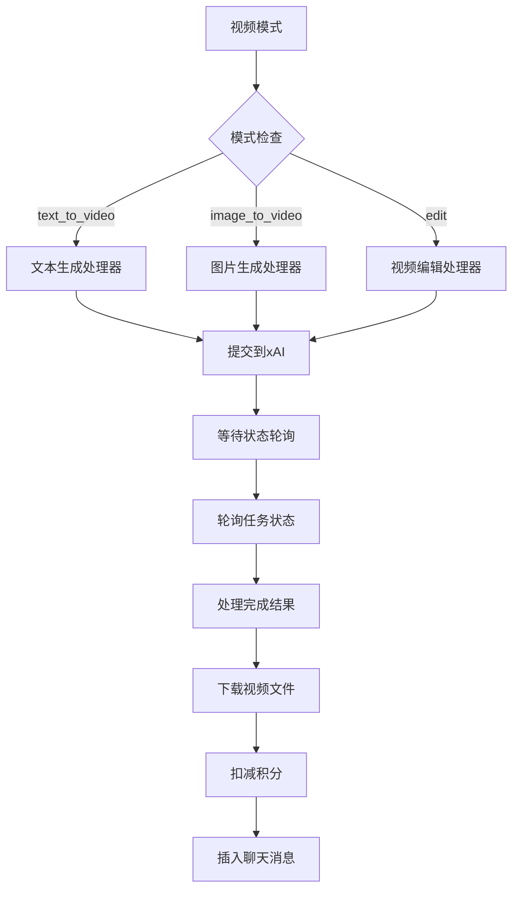

**图表来源**
- [backend/services/video_generation.py:62-138](file://backend/services/video_generation.py#L62-L138)
- [backend/services/video_generation.py:147-181](file://backend/services/video_generation.py#L147-L181)

### 视频生成上下文
视频生成服务使用VideoContext封装生成所需的全部参数。

- **上下文参数**
  - api_key：xAI API密钥
  - model：使用的模型（默认grok-imagine-video）
  - prompt：生成提示词
  - image_url：输入图片URL（可选）
  - duration：视频时长（1-15秒）
  - quality：输出画质（480p/720p）
  - aspect_ratio：画面比例（默认16:9）
  - video_mode：视频生成模式

- **模式处理器注册**
  - 使用装饰器注册不同模式的处理器
  - 通过模式名称路由到对应处理器
  - 支持扩展新的视频生成模式

**章节来源**
- [backend/services/video_generation.py:37-138](file://backend/services/video_generation.py#L37-L138)

### 视频状态轮询与处理
视频生成服务实现了完整的状态轮询和结果处理机制。

- **轮询机制**
  - 支持最大轮询失败次数限制
  - 自动超时检测（5分钟）
  - 状态映射表处理xAI状态

- **结果处理**
  - 完成时提取视频URL和时长
  - 内容审核检查
  - 失败状态处理和错误记录

**章节来源**
- [backend/services/video_generation.py:147-203](file://backend/services/video_generation.py#L147-L203)

## 计费系统增强

### 多维度积分计费模型
系统实现了基于积分的多维度计费模型，支持文本输入、文本输出、图像输出、搜索查询和视频生成五种计费维度。计费算法采用映射表驱动，避免复杂的if分支判断。

- **计费维度映射表**
  - input：输入tokens计费，每1M tokens计费
  - text_output：文本输出tokens计费，每1M tokens计费  
  - image_output：图像输出tokens计费，每1M tokens计费
  - search：搜索查询计费，每次查询计费
  - **video_input_image：输入图片计费，每张计费**
  - **video_input_second：输入视频时长计费，每秒计费**
  - **video_output_480p：480p输出时长计费，每秒计费**
  - **video_output_720p：720p输出时长计费，每秒计费**

- **费率字段**
  - input_credit_per_1m：每1M输入tokens的积分费率
  - output_credit_per_1m：每1M输出tokens的积分费率
  - image_output_credit_per_1m：每1M图像输出tokens的积分费率
  - search_credit_per_query：每次搜索查询的积分费率
  - **video_input_image_credit：每张输入图片的积分费率**
  - **video_input_second_credit：每秒输入视频的积分费率**
  - **video_output_480p_credit：每秒480p输出的积分费率**
  - **video_output_720p_credit：每秒720p输出的积分费率**

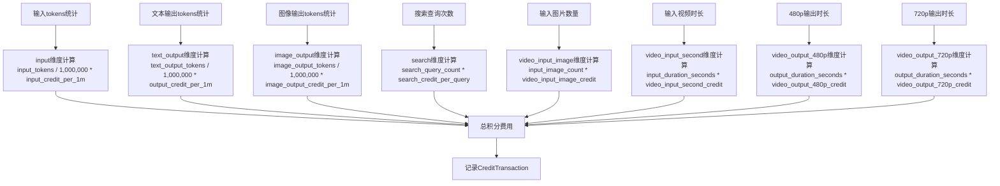

**图表来源**
- [backend/services/billing.py:13-35](file://backend/services/billing.py#L13-L35)

### CreditTransaction积分交易记录
系统自动记录所有积分交易，包括扣费、充值和管理员调整。每笔交易都包含详细的元数据信息。

- **交易类型**
  - deduction：扣费交易
  - recharge：充值交易  
  - admin_adjust：管理员调整

- **交易记录字段**
  - user_id：用户标识
  - agent_id：关联的智能体
  - session_id：关联的聊天会话
  - transaction_type：交易类型
  - amount：交易金额（负数表示扣费，正数表示充值）
  - balance_before：交易前余额
  - balance_after：交易后余额
  - input_tokens/output_tokens：关联的tokens统计
  - metadata_json：费率快照和扩展信息
  - description：交易描述

**章节来源**
- [backend/services/billing.py:1-56](file://backend/services/billing.py#L1-L56)
- [backend/models.py:222-242](file://backend/models.py#L222-L242)
- [backend/routers/chats.py:351-368](file://backend/routers/chats.py#L351-L368)

### 聊天流式响应的计费集成
聊天接口集成了实时计费功能，在对话过程中动态计算并扣除积分费用。

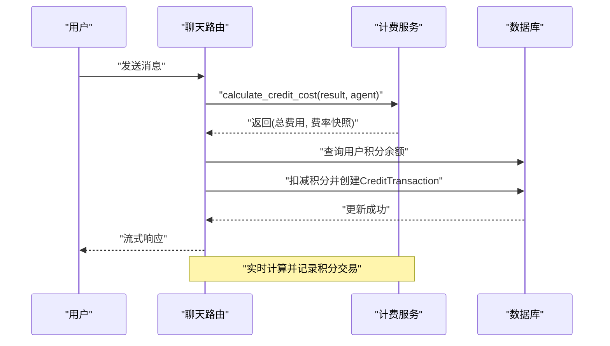

**图表来源**
- [backend/routers/chats.py:351-368](file://backend/routers/chats.py#L351-L368)
- [backend/services/billing.py:16-56](file://backend/services/billing.py#L16-L56)

**章节来源**
- [backend/routers/chats.py:340-373](file://backend/routers/chats.py#L340-L373)
- [backend/services/billing.py:1-56](file://backend/services/billing.py#L1-L56)

## 订阅管理API

### 套餐计划管理
系统提供了完整的订阅管理API，允许管理员创建、查询、更新和删除套餐计划。

- **API端点**
  - POST /api/admin/subscriptions/：创建新的套餐计划
  - GET /api/admin/subscriptions/：获取所有套餐计划列表
  - GET /api/admin/subscriptions/{plan_id}：获取指定套餐计划详情
  - PUT /api/admin/subscriptions/{plan_id}：更新套餐计划
  - DELETE /api/admin/subscriptions/{plan_id}：删除套餐计划

- **套餐计划字段**
  - name：套餐名称（唯一）
  - description：套餐描述
  - price_usd：套餐价格（美元）
  - credits：包含的积分数
  - billing_period：计费周期（monthly/yearly/lifetime）
  - features：套餐特性列表
  - is_active：是否激活
  - sort_order：显示排序

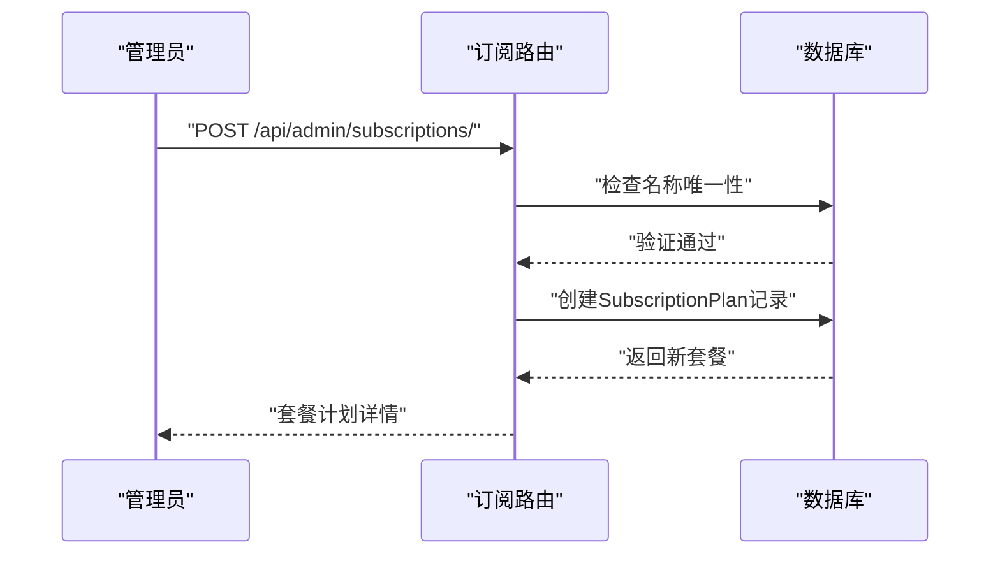

**图表来源**
- [backend/routers/subscriptions.py:21-37](file://backend/routers/subscriptions.py#L21-L37)

### 权限控制与数据验证
- 所有订阅管理操作都需要管理员权限
- 套餐名称必须唯一，防止重复
- 计费周期仅允许指定的枚举值
- 价格和积分数必须大于0

**章节来源**
- [backend/routers/subscriptions.py:1-119](file://backend/routers/subscriptions.py#L1-L119)
- [backend/schemas.py:320-352](file://backend/schemas.py#L320-L352)

## 智能体工具系统

### 模块化重构概述
系统实现了智能体工具系统的模块化重构，Skills和MCPClients组件替代了原有的单一Tools组件，提供了更精细的外部能力管理。

- **Skills组件**
  - 管理声明式技能包
  - 支持热插拔和版本控制
  - 提供技能启用/禁用功能

- **MCPClients组件**
  - 管理Model Context Protocol客户端
  - 支持动态连接和热重载
  - 提供无感的客户端替换

- **工具配置结构**
  - tools_enabled：工具开关
  - tools：工具列表（技能ID或MCP客户端ID）

**章节来源**
- [frontend/src/components/admin/agents/AgentForm/Tools/index.tsx:1-57](file://frontend/src/components/admin/agents/AgentForm/Tools/index.tsx#L1-L57)
- [frontend/src/components/admin/agents/AgentForm/Tools/Skills.tsx:1-79](file://frontend/src/components/admin/agents/AgentForm/Tools/Skills.tsx#L1-L79)
- [frontend/src/components/admin/agents/AgentForm/Tools/MCPClients.tsx:1-97](file://frontend/src/components/admin/agents/AgentForm/Tools/MCPClients.tsx#L1-L97)

### 工具配置界面
前端提供了直观的工具配置界面，支持Skills和MCPClients的选择和管理。

- **工具开关**
  - tools_enabled：启用/禁用所有工具
  - 实时影响智能体的能力范围

- **技能选择**
  - 勾选框选择所需技能
  - 显示技能描述和状态
  - 支持批量操作

- **MCP客户端选择**
  - 勾选框选择所需客户端
  - 显示客户端状态和描述
  - 支持动态加载

**章节来源**
- [frontend/src/components/admin/agents/AgentForm/Tools/index.tsx:12-54](file://frontend/src/components/admin/agents/AgentForm/Tools/index.tsx#L12-L54)
- [frontend/src/components/admin/agents/AgentForm/Tools/Skills.tsx:28-75](file://frontend/src/components/admin/agents/AgentForm/Tools/Skills.tsx#L28-L75)
- [frontend/src/components/admin/agents/AgentForm/Tools/MCPClients.tsx:43-93](file://frontend/src/components/admin/agents/AgentForm/Tools/MCPClients.tsx#L43-L93)

## 技能管理系统

### 技能管理API
系统提供了完整的技能管理API，支持技能的创建、查询、更新、删除和启用/禁用操作。

- **API端点**
  - GET /api/admin/skills/：获取所有技能列表
  - GET /api/admin/skills/{skill_name}：获取技能详情
  - POST /api/admin/skills/：创建新技能
  - PUT /api/admin/skills/{skill_name}：更新技能
  - DELETE /api/admin/skills/{skill_name}：删除技能
  - POST /api/admin/skills/{skill_name}/toggle：切换技能状态

- **技能类型**
  - builtin：内置技能（系统自带）
  - customized：自定义技能（用户创建）
  - active：已启用技能（在active_skills目录中）

- **技能状态**
  - active：运行中（已启用）
  - inactive：已停用（未启用）

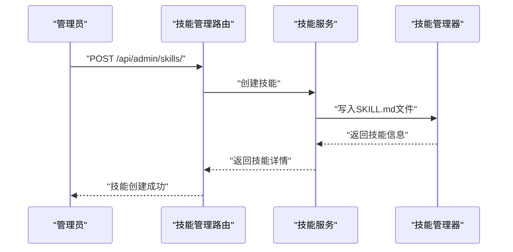

**图表来源**
- [backend/routers/skills_api.py:140-153](file://backend/routers/skills_api.py#L140-L153)

### 技能文件结构
技能使用声明式文件格式，支持Markdown语法和元数据管理。

- **SKILL.md结构**
  - YAML头部：name、description、metadata
  - Markdown正文：技能详细说明
  - 支持代码示例和使用指导

- **元数据字段**
  - name：技能标识符（英文）
  - description：技能描述
  - metadata.builtin_skill_version：版本号
  - 支持自定义元数据

- **文件组织**
  - builtin_skills：系统内置技能
  - customized_skills：用户自定义技能
  - active_skills：已启用技能（运行时）

**章节来源**
- [backend/routers/skills_api.py:26-47](file://backend/routers/skills_api.py#L26-L47)
- [backend/skills_manager.py:19-37](file://backend/skills_manager.py#L19-L37)
- [backend/skills_manager.py:107-143](file://backend/skills_manager.py#L107-L143)

### 技能启用/禁用机制
系统实现了智能的技能启用/禁用机制，支持热插拔和版本控制。

- **启用流程**
  - 将技能从builtin或customized复制到active_skills
  - 支持强制覆盖和差异检测
  - 自动同步相关文件和脚本

- **禁用流程**
  - 从active_skills目录删除技能
  - 保持builtin技能不变
  - 支持批量禁用

- **版本控制**
  - 内置技能版本管理
  - 自定义技能版本覆盖
  - 差异检测和更新

**章节来源**
- [backend/routers/skills_api.py:190-206](file://backend/routers/skills_api.py#L190-L206)
- [backend/skills_manager.py:284-301](file://backend/skills_manager.py#L284-L301)
- [backend/skills_manager.py:180-226](file://backend/skills_manager.py#L180-L226)

### 前端技能管理界面
前端提供了完整的技能管理界面，支持技能的创建、编辑、删除和状态切换。

- **技能列表**
  - 显示技能名称、描述、版本和状态
  - 支持按状态和类型筛选
  - 实时状态更新

- **技能详情**
  - 显示技能完整内容和元数据
  - 支持Markdown预览
  - 版本信息展示

- **技能操作**
  - 创建新技能（自定义）
  - 编辑现有技能
  - 删除自定义技能
  - 启用/禁用技能

**章节来源**
- [frontend/src/app/admin/skills/page.tsx:37-185](file://frontend/src/app/admin/skills/page.tsx#L37-L185)
- [frontend/src/app/admin/skills/SkillDialog.tsx:44-235](file://frontend/src/app/admin/skills/SkillDialog.tsx#L44-L235)

## MCP客户端管理

### MCP客户端架构
系统实现了完整的MCP（Model Context Protocol）客户端管理，支持动态连接和热重载。

- **MCP客户端类型**
  - stdio：本地进程通信
  - http：HTTP REST API
  - 支持自定义传输协议

- **客户端配置**
  - name：客户端名称
  - transport：传输协议（stdio/http）
  - enabled：启用状态
  - 连接参数：命令、URL、头信息等

- **热重载机制**
  - 双阶段锁定：连接新客户端（锁外）+ 替换（锁内）
  - 无感替换：最小化阻塞时间
  - 连接恢复：自动重连和错误处理

```mermaid
sequenceDiagram
participant M as "MCP管理器"
participant NC as "新客户端"
participant OC as "旧客户端"
M->>NC : "构建新客户端"
NC->>NC : "连接新客户端"
NC-->>M : "连接成功"
M->>M : "获取互斥锁"
M->>OC : "关闭旧客户端"
M->>M : "交换客户端引用"
M-->>M : "释放互斥锁"
M-->>NC : "热重载完成"
```

**图表来源**
- [backend/mcp_manager/manager.py:57-86](file://backend/mcp_manager/manager.py#L57-L86)

### MCP客户端生命周期
系统提供了完整的MCP客户端生命周期管理，包括初始化、连接、替换和关闭。

- **初始化流程**
  - 从配置加载客户端
  - 按启用状态初始化
  - 异常处理和日志记录

- **连接管理**
  - 超时控制（默认60秒）
  - 连接状态监控
  - 自动重连机制

- **客户端替换**
  - 双阶段锁定策略
  - 最小阻塞时间
  - 优雅关闭旧客户端

**章节来源**
- [backend/mcp_manager/manager.py:40-56](file://backend/mcp_manager/manager.py#L40-L56)
- [backend/mcp_manager/manager.py:87-104](file://backend/mcp_manager/manager.py#L87-L104)

### 前端MCP管理界面
前端提供了MCP客户端管理界面，支持客户端的添加、配置和状态监控。

- **客户端列表**
  - 显示客户端ID、名称、传输协议
  - 状态指示器（连接/断开）
  - 工具数量统计

- **客户端操作**
  - 添加新客户端
  - 编辑客户端配置
  - 启用/禁用客户端
  - 删除客户端

- **状态监控**
  - 实时连接状态
  - 传输协议显示
  - 详细信息面板

**章节来源**
- [frontend/src/app/admin/mcp/page.tsx:11-53](file://frontend/src/app/admin/mcp/page.tsx#L11-L53)

## 依赖关系分析
- 组件耦合
  - 路由层依赖数据库会话与模型定义
  - 服务层依赖模型与AgentScope引擎
  - **智能体执行服务依赖LLM流式处理和xAI兼容性支持**
  - **计费服务层依赖聊天路由、智能体模型和视频计费系统**
  - **订阅路由依赖数据库会话和管理员权限验证**
  - **提示词模板路由依赖数据库会话、模板引擎和智能体模型**
  - **视频生成路由依赖视频生成服务和计费服务**
  - **技能管理路由依赖技能管理器和技能文件系统**
  - **MCP客户端管理依赖MCP客户端管理器和AgentScope集成**
  - 聊天路由依赖提供商类型分支、数据库会话和计费服务
  - 后台任务依赖引擎与数据库
- 外部依赖
  - AgentScope：多智能体编排与模型初始化
  - OpenAI/DashScope：流式对话与增量输出
  - **xAI：视频生成平台API兼容性支持**
  - **agentscope.mcp：MCP客户端SDK**
  - SQLAlchemy异步ORM：数据库访问
  - FastAPI：路由与WebSocket
  - **Jinja2：模板渲染引擎**

```mermaid
graph LR
ROUTERS["路由层"] --> MODELS["模型层"]
ROUTERS --> DB["数据库"]
ROUTERS --> SERVICES["服务层"]
SERVICES --> AGENTS["AgentScope引擎"]
SERVICES --> BILLING["计费服务"]
SERVICES --> AGENT_EXEC["智能体执行服务"]
AGENT_EXEC --> LLM_STREAM["LLM流式处理"]
PROMPT_TEMPLATES["提示词模板路由"] --> MODELS
PROMPT_TEMPLATES --> DB
PROMPT_TEMPLATES --> TEMPLATES["Jinja2模板引擎"]
SUBSCRIPTIONS["订阅路由"] --> MODELS
SUBSCRIPTIONS --> DB
VIDEOS["视频生成路由"] --> VIDEO_GEN["视频生成服务"]
VIDEOS --> BILLING
SKILLS_API["技能管理路由"] --> SKILLS_SVC["技能服务"]
SKILLS_SVC --> SKILLS_MGR["技能管理器"]
MCP_API["MCP管理路由"] --> MCP_MGR["MCP客户端管理器"]
MCP_MGR --> AGENTS
CHATS["聊天路由"] --> PROVIDERS["LLM提供商"]
CHATS --> DB
CHATS --> BILLING
CHATS --> LLM_STREAM
BILLING --> MODELS
TASKS["后台任务"] --> AGENTS
TASKS --> DB
```

**图表来源**
- [backend/routers/agents.py:1-141](file://backend/routers/agents.py#L1-L141)
- [backend/routers/subscriptions.py:1-119](file://backend/routers/subscriptions.py#L1-L119)
- [backend/routers/prompt_templates.py:1-303](file://backend/routers/prompt_templates.py#L1-L303)
- [backend/routers/chats.py:1-393](file://backend/routers/chats.py#L1-L393)
- [backend/routers/videos.py:1-232](file://backend/routers/videos.py#L1-L232)
- [backend/routers/skills_api.py:1-207](file://backend/routers/skills_api.py#L1-L207)
- [backend/services/billing.py:1-324](file://backend/services/billing.py#L1-L324)
- [backend/services/agent_executor.py:1-150](file://backend/services/agent_executor.py#L1-L150)
- [backend/services/video_generation.py:1-203](file://backend/services/video_generation.py#L1-L203)
- [backend/services/llm_stream.py:1-552](file://backend/services/llm_stream.py#L1-L552)
- [backend/agents.py:1-196](file://backend/agents.py#L1-L196)
- [backend/database.py:1-31](file://backend/database.py#L1-L31)
- [backend/skills_manager.py:1-408](file://backend/skills_manager.py#L1-L408)
- [backend/mcp_manager/manager.py:1-138](file://backend/mcp_manager/manager.py#L1-L138)

**章节来源**
- [backend/routers/agents.py:1-141](file://backend/routers/agents.py#L1-L141)
- [backend/routers/subscriptions.py:1-119](file://backend/routers/subscriptions.py#L1-L119)
- [backend/routers/prompt_templates.py:1-303](file://backend/routers/prompt_templates.py#L1-L303)
- [backend/routers/chats.py:1-393](file://backend/routers/chats.py#L1-L393)
- [backend/routers/videos.py:1-232](file://backend/routers/videos.py#L1-L232)
- [backend/routers/skills_api.py:1-207](file://backend/routers/skills_api.py#L1-L207)
- [backend/services/billing.py:1-324](file://backend/services/billing.py#L1-L324)
- [backend/services/agent_executor.py:1-150](file://backend/services/agent_executor.py#L1-L150)
- [backend/services/video_generation.py:1-203](file://backend/services/video_generation.py#L1-L203)
- [backend/services/llm_stream.py:1-552](file://backend/services/llm_stream.py#L1-L552)
- [backend/agents.py:1-196](file://backend/agents.py#L1-L196)
- [backend/database.py:1-31](file://backend/database.py#L1-L31)
- [backend/skills_manager.py:1-408](file://backend/skills_manager.py#L1-L408)
- [backend/mcp_manager/manager.py:1-138](file://backend/mcp_manager/manager.py#L1-L138)

## 性能考虑
- 异步I/O与连接池：使用异步SQLAlchemy与连接池，避免阻塞
- 流式响应：减少首字节延迟，提升用户体验
- 上下文裁剪：合理设置上下文窗口与温度，控制Token消耗
- 预生成策略：提前生成下一章内容，降低用户等待
- 缓存与去重：资源表使用内容哈希去重，减少重复生成
- **计费计算优化**：使用映射表驱动的计算方式，避免复杂条件判断
- **实时扣费**：在聊天流式响应中实时计算和扣费，提升用户体验
- **模板渲染优化**：Jinja2模板渲染使用缓存机制，避免重复编译
- **智能体类型匹配**：模板系统自动匹配智能体类型，减少人工配置错误
- **xAI兼容性优化**：专门的消息格式化处理，减少不必要的数据转换
- **异常处理优化**：改进的错误捕获和恢复机制，提升系统稳定性
- **智能体执行缓存**：智能体实例的缓存和重用，减少初始化开销
- **视频生成异步处理**：视频任务异步处理，避免阻塞主请求线程
- **视频计费精确计算**：基于映射表的计费算法，提升计算效率
- **视频状态轮询优化**：智能轮询策略，减少API调用频率
- **技能管理优化**：技能文件差异检测，避免不必要的文件复制
- **MCP客户端热重载**：双阶段锁定策略，最小化阻塞时间
- **工具系统模块化**：Skills和MCPClients分离，提升系统可维护性

## 故障排除指南
- 数据库连接失败
  - 现象：启动时报数据库连接错误
  - 处理：检查DATABASE_URL与权限；确认PostgreSQL运行；查看连接池配置
- LLM提供商未配置
  - 现象：章节生成返回错误提示
  - 处理：在后台创建活动提供商并设置默认模型；检查API密钥与基础URL
- WebSocket无法连接
  - 现象：前端无法建立/维持连接
  - 处理：检查CORS配置、端口开放与防火墙；确认路径与player_id正确
- 流式响应异常
  - 现象：响应中断或无增量输出
  - 处理：检查提供商类型分支、网络与API配额；查看日志中的Usage统计
- 智能体更新失败
  - 现象：更新名称或提供商/模型时报错
  - 处理：确保名称唯一、提供商存在且模型在提供商模型列表中
- **智能体执行异常**
  - 现象：智能体回复处理失败或响应异常
  - 处理：检查智能体配置、提供商连接和xAI兼容性设置
- **xAI平台兼容性问题**
  - 现象：xAI平台响应格式异常或消息丢失
  - 处理：确认xAI API密钥有效、检查消息格式化逻辑、验证base_url配置
- **智能体类型不匹配**
  - 现象：模板无法正确匹配智能体类型
  - 处理：确认模板的agent_type与智能体类型一致
- **计费计算错误**
  - 现象：积分扣费不准确或交易记录异常
  - 处理：检查智能体的积分费率配置；验证计费维度映射表；查看CreditTransaction记录
- **订阅管理权限问题**
  - 现象：无法访问订阅管理API或操作被拒绝
  - 处理：确认用户具有管理员角色；检查权限验证逻辑
- **智能体创建异常**
  - 现象：智能体创建失败或返回500错误
  - 处理：检查提供商配置、模型可用性、数据库连接和异常处理逻辑
- **视频生成任务失败**
  - 现象：视频生成任务长时间处于pending状态
  - 处理：检查xAI API密钥有效性；验证视频配置参数；查看轮询状态
- **视频计费不准确**
  - 现象：视频生成费用计算错误
  - 处理：检查智能体的视频计费费率；验证视频任务的输入输出参数；查看计费元数据
- **视频状态轮询异常**
  - 现象：视频任务状态无法正常轮询
  - 处理：检查xAI API连接；验证任务ID有效性；查看轮询超时设置
- **技能管理异常**
  - 现象：技能创建、更新或删除失败
  - 处理：检查SKILL.md格式；验证文件权限；确认技能名称唯一性
- **MCP客户端连接失败**
  - 现象：MCP客户端无法连接或频繁断开
  - 处理：检查传输配置；验证连接参数；查看客户端日志；尝试重启客户端
- **工具系统配置错误**
  - 现象：智能体无法使用技能或MCP客户端
  - 处理：确认工具开关开启；检查技能启用状态；验证MCP客户端连接

**章节来源**
- [backend/main.py:45-82](file://backend/main.py#L45-L82)
- [backend/agents.py:49-99](file://backend/agents.py#L49-L99)
- [backend/routers/chats.py:145-209](file://backend/routers/chats.py#L145-L209)
- [backend/routers/agents.py:96-119](file://backend/routers/agents.py#L96-L119)
- [backend/services/agent_executor.py:77-112](file://backend/services/agent_executor.py#L77-L112)
- [backend/agents.py:71-74](file://backend/agents.py#L71-L74)
- [backend/services/billing.py:16-56](file://backend/services/billing.py#L16-L56)
- [backend/routers/subscriptions.py:1-119](file://backend/routers/subscriptions.py#L1-L119)
- [backend/routers/videos.py:1-232](file://backend/routers/videos.py#L1-L232)
- [backend/services/video_generation.py:1-203](file://backend/services/video_generation.py#L1-L203)
- [backend/routers/skills_api.py:1-207](file://backend/routers/skills_api.py#L1-L207)
- [backend/skills_manager.py:1-408](file://backend/skills_manager.py#L1-L408)
- [backend/mcp_manager/manager.py:1-138](file://backend/mcp_manager/manager.py#L1-L138)

## 结论
本智能体管理API以AgentScope为核心，结合FastAPI与异步数据库访问，提供了完整的智能体生命周期管理、状态同步与配置热切换能力。**本次更新显著增强了系统功能，新增了模块化的智能体工具系统，包括Skills和MCPClients组件，替代了原有的单一Tools组件，增强了智能体对外部能力的管理。**通过流式响应、预生成策略与后台任务，系统在保证实时性的同时兼顾性能与可扩展性。**新增的智能体执行服务为智能体管理提供了统一的接口，xAI兼容性支持确保了与xAI平台的无缝集成，改进的错误处理机制提升了系统的稳定性和可靠性。**新增的技能管理系统和MCP客户端管理功能，实现了声明式工具包管理和动态客户端连接，为智能体提供了更强大的外部能力扩展。建议在生产环境中完善事件推送、监控告警与资源缓存策略，持续优化上下文窗口与Token成本，加强视频生成任务的监控与优化，以及完善技能和MCP客户端的版本管理与热重载机制。

## 附录
- API端点概览
  - 智能体管理：/api/agents/*
  - 聊天与流式响应：/api/chats/*
  - 后台管理：/api/admin/*
  - **智能体执行**：/api/agents/execute/*
  - **提示词模板管理**：/api/prompt-templates/*
  - **订阅管理**：/api/admin/subscriptions/*
  - **视频生成**：/api/videos/*
  - **技能管理**：/api/admin/skills/*
  - 实时通信：/ws/{player_id}
- **计费相关字段**
  - 智能体：input_credit_per_1m、output_credit_per_1m、image_output_credit_per_1m、search_credit_per_query、**video_input_image_credit、video_input_second_credit、video_output_480p_credit、video_output_720p_credit**
  - 用户：credits（积分余额）
  - **视频任务**：video_mode、prompt、image_url、duration、quality、aspect_ratio、status、result_video_url、error_message、input_image_count、output_duration_seconds、credit_cost
  - **视频配置**：duration、quality、aspect_ratio、mode
  - **模板**：name、description、template_type、agent_type、system_prompt_template、variables_schema
  - **套餐计划**：name、price_usd、credits、billing_period、features
  - **技能信息**：id、name、description、version、source、status、content
  - **MCP客户端**：name、transport、enabled、url、headers、command、args、env、cwd
- **xAI兼容性字段**
  - provider_type：xai
  - base_url：https://api.x.ai/v1
  - 消息格式：仅user角色包含name字段
- **视频生成模式**
  - text_to_video：文本生成视频
  - image_to_video：图片生成视频
  - edit：视频编辑
- **工具系统字段**
  - tools_enabled：工具开关
  - tools：工具列表（技能ID或MCP客户端ID）
  - **技能状态**：active/inactive
  - **MCP客户端状态**：connected/disconnected
- 最佳实践
  - 使用后台任务进行章节预生成
  - 通过WebSocket推送状态事件
  - 合理设置上下文窗口与温度
  - 使用提供商模型列表进行严格校验
  - 记录流式响应的Usage统计用于成本控制
  - **配置合理的积分费率和套餐计划**
  - **定期审查CreditTransaction记录确保计费准确性**
  - **利用提示词模板系统提升内容生成效率**
  - **根据智能体类型选择合适的模板**
  - **监控xAI平台的响应质量和成本控制**
  - **实施完善的异常处理和错误恢复机制**
  - **合理设置视频生成参数，控制成本和质量**
  - **监控视频任务状态，及时处理失败任务**
  - **优化视频计费策略，平衡成本与质量**
  - **使用模块化的工具系统管理智能体能力**
  - **定期同步和更新技能文件**
  - **监控MCP客户端连接状态**
  - **实施技能和MCP客户端的版本控制**
  - **利用热重载机制实现无感更新**