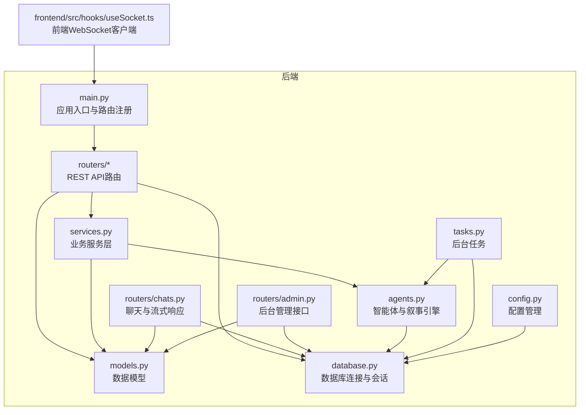
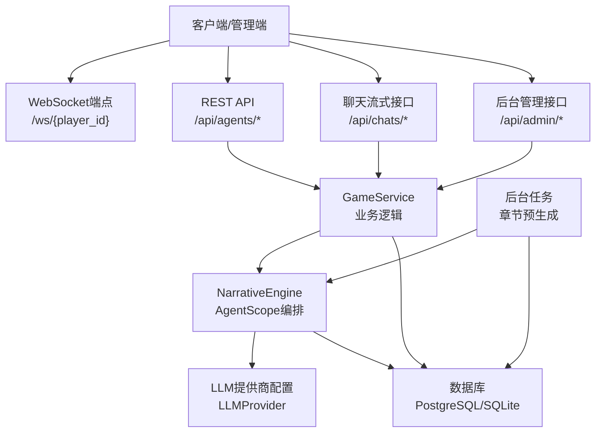
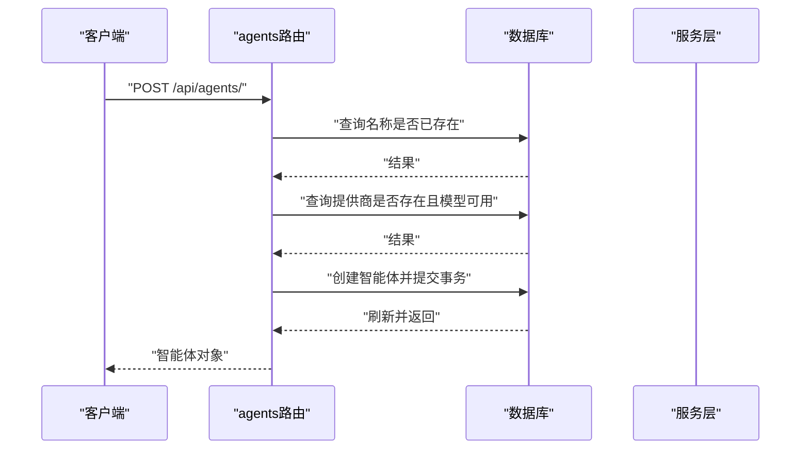
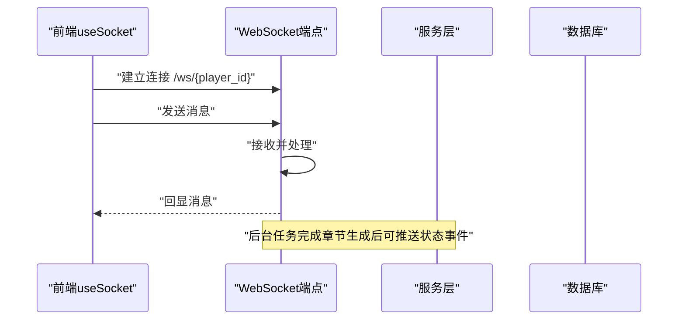
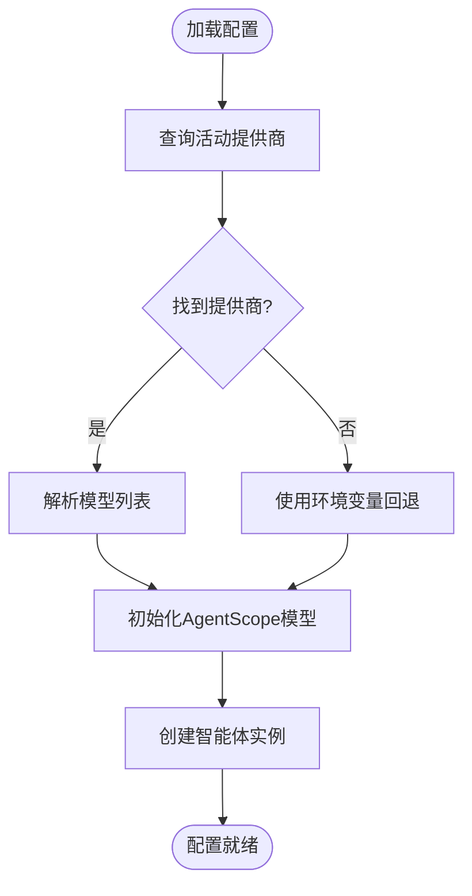
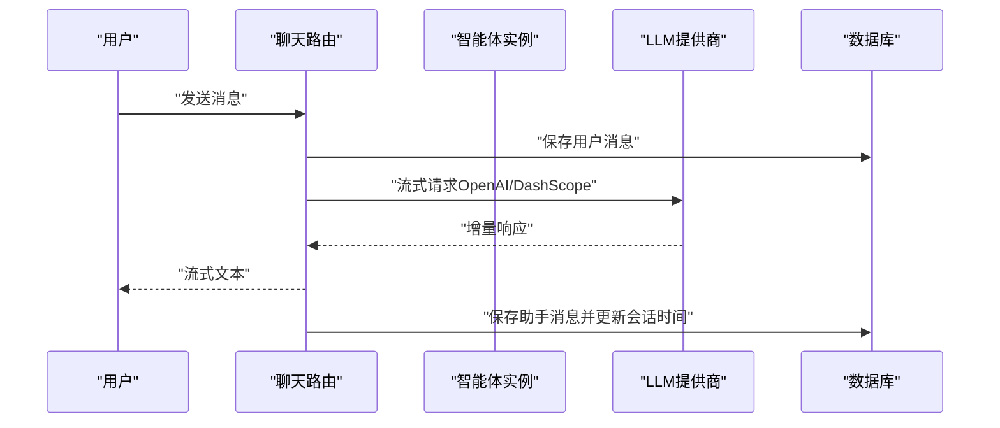
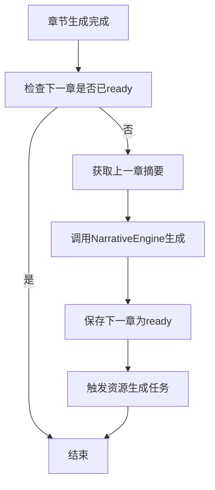
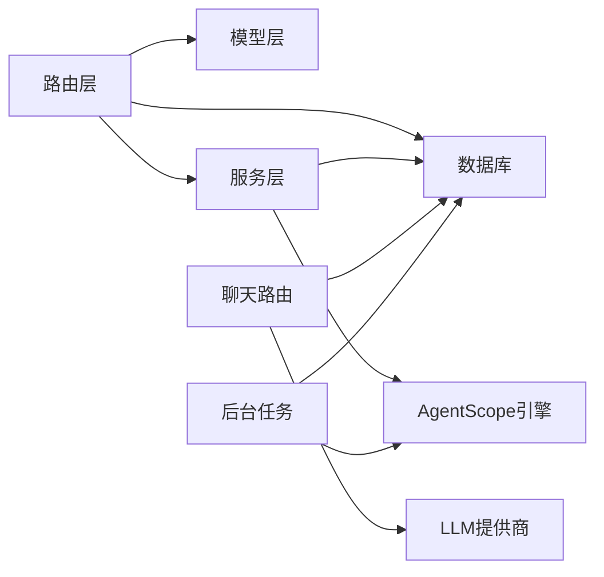

# 智能体管理API

<cite>
**本文档引用的文件**
- [backend/main.py](file://backend/main.py)
- [backend/routers/agents.py](file://backend/routers/agents.py)
- [backend/models.py](file://backend/models.py)
- [backend/schemas.py](file://backend/schemas.py)
- [backend/agents.py](file://backend/agents.py)
- [backend/database.py](file://backend/database.py)
- [backend/routers/chats.py](file://backend/routers/chats.py)
- [backend/routers/admin.py](file://backend/routers/admin.py)
- [backend/services.py](file://backend/services.py)
- [backend/tasks.py](file://backend/tasks.py)
- [backend/config.py](file://backend/config.py)
- [frontend/src/hooks/useSocket.ts](file://frontend/src/hooks/useSocket.ts)
- [README.md](file://README.md)
- [docs/wiki/Backend-Guide.md](file://docs/wiki/Backend-Guide.md)
</cite>

## 目录
1. [简介](#简介)
2. [项目结构](#项目结构)
3. [核心组件](#核心组件)
4. [架构总览](#架构总览)
5. [详细组件分析](#详细组件分析)
6. [依赖关系分析](#依赖关系分析)
7. [性能考虑](#性能考虑)
8. [故障排除指南](#故障排除指南)
9. [结论](#结论)
10. [附录](#附录)

## 简介
本文件为智能体管理API的专业技术文档，聚焦于多智能体系统的生命周期管理与协作机制。系统基于AgentScope多智能体框架，结合FastAPI后端与异步数据库访问，提供智能体创建、配置、启动与销毁的完整API；同时实现智能体状态同步、事件通知、配置热切换与性能优化能力。文档将从架构、组件、数据流、处理逻辑到最佳实践与故障排除进行系统化阐述。

## 项目结构
后端采用分层架构：入口文件负责应用生命周期与路由注册，路由层提供REST API与WebSocket，服务层封装业务逻辑，模型层定义数据结构，工具层提供数据库连接与配置管理。前端通过WebSocket与后端进行实时通信。

图表来源
- [backend/main.py](file://backend/main.py#L83-L98)
- [backend/routers/agents.py](file://backend/routers/agents.py#L1-L141)
- [backend/routers/chats.py](file://backend/routers/chats.py#L1-L275)
- [backend/routers/admin.py](file://backend/routers/admin.py#L1-L112)
- [backend/services.py](file://backend/services.py#L1-L66)
- [backend/agents.py](file://backend/agents.py#L1-L196)
- [backend/database.py](file://backend/database.py#L1-L31)
- [backend/config.py](file://backend/config.py#L1-L34)
- [backend/tasks.py](file://backend/tasks.py#L1-L62)
- [frontend/src/hooks/useSocket.ts](file://frontend/src/hooks/useSocket.ts#L1-L43)

章节来源
- [README.md](file://README.md#L34-L51)
- [docs/wiki/Backend-Guide.md](file://docs/wiki/Backend-Guide.md#L1-L21)

## 核心组件
- 应用入口与生命周期：负责数据库迁移、Lifespan钩子、CORS配置、路由注册与WebSocket端点。
- 智能体管理路由：提供智能体的增删改查、名称唯一性校验、提供商与模型可用性校验。
- 数据模型与序列化：定义智能体、LLM提供商、聊天会话与消息的数据结构及Pydantic验证模型。
- 叙事引擎与AgentScope：封装多智能体协作（导演、旁白、NPC管理），支持动态配置加载与章节生成。
- 聊天与流式响应：支持OpenAI/DashScope等提供商的流式对话，记录上下文与Token统计。
- 后台管理接口：提供统计、玩家与剧情管理等管理功能。
- 任务调度：实现章节预生成与资源生成的后台任务。

章节来源
- [backend/main.py](file://backend/main.py#L45-L82)
- [backend/routers/agents.py](file://backend/routers/agents.py#L15-L55)
- [backend/models.py](file://backend/models.py#L100-L122)
- [backend/schemas.py](file://backend/schemas.py#L43-L73)
- [backend/agents.py](file://backend/agents.py#L43-L196)
- [backend/routers/chats.py](file://backend/routers/chats.py#L72-L258)
- [backend/routers/admin.py](file://backend/routers/admin.py#L16-L31)
- [backend/tasks.py](file://backend/tasks.py#L7-L55)

## 架构总览
系统采用“路由层-服务层-模型层-基础设施层”的分层设计，智能体管理API位于路由层，通过服务层与数据库交互，使用AgentScope进行多智能体编排。WebSocket用于实时状态推送，后台任务实现章节预生成与资源生成。

图表来源
- [backend/main.py](file://backend/main.py#L157-L169)
- [backend/routers/agents.py](file://backend/routers/agents.py#L1-L141)
- [backend/routers/chats.py](file://backend/routers/chats.py#L1-L275)
- [backend/routers/admin.py](file://backend/routers/admin.py#L1-L112)
- [backend/services.py](file://backend/services.py#L8-L66)
- [backend/agents.py](file://backend/agents.py#L43-L196)
- [backend/tasks.py](file://backend/tasks.py#L7-L55)

## 详细组件分析

### 智能体生命周期管理API
- 创建智能体
  - 接口：POST /api/agents/
  - 校验：名称唯一性、提供商存在性、模型在提供商模型列表中
  - 返回：创建后的智能体对象
- 列表查询
  - 接口：GET /api/agents/?skip=&limit=&search=
  - 功能：分页与模糊搜索
- 获取单个智能体
  - 接口：GET /api/agents/{agent_id}
- 更新智能体
  - 接口：PUT /api/agents/{agent_id}
  - 校验：名称唯一性、提供商与模型有效性
  - 支持字段：名称、描述、提供商、模型、温度、上下文窗口、系统提示、工具、思考模式
- 删除智能体
  - 接口：DELETE /api/agents/{agent_id}
  - 行为：审计日志打印并删除

图表来源
- [backend/routers/agents.py](file://backend/routers/agents.py#L15-L55)

章节来源
- [backend/routers/agents.py](file://backend/routers/agents.py#L15-L141)
- [backend/schemas.py](file://backend/schemas.py#L54-L73)
- [backend/models.py](file://backend/models.py#L100-L122)

### 智能体状态同步与事件通知
- WebSocket端点
  - 接口：GET /ws/{player_id}
  - 功能：接受客户端消息并回显，预留剧情更新推送通道
- 实时状态更新
  - 建议：在故事初始化与章节生成完成后，通过WebSocket向对应player_id推送状态事件
  - 事件格式：包含章节状态、内容片段、选择分支等
- 事件通知最佳实践
  - 使用房间概念按player_id隔离消息
  - 在后台任务完成后触发推送，避免阻塞请求线程

图表来源
- [backend/main.py](file://backend/main.py#L157-L169)
- [frontend/src/hooks/useSocket.ts](file://frontend/src/hooks/useSocket.ts#L1-L43)

章节来源
- [backend/main.py](file://backend/main.py#L157-L169)
- [frontend/src/hooks/useSocket.ts](file://frontend/src/hooks/useSocket.ts#L1-L43)

### 智能体配置管理与热切换
- 配置来源
  - 数据库：LLMProvider表存储提供商类型、API密钥、基础URL、模型列表、标签、启用状态、默认标记与额外配置
  - 环境变量：作为回退配置（如OPENAI_API_KEY、STORY_GENERATION_MODEL）
- 加载流程
  - 应用启动或首次使用时，NarrativeEngine从数据库加载活动提供商，解析模型列表并初始化AgentScope模型
  - 支持动态重载：通过reload_config触发配置刷新
- 参数调整接口
  - 智能体更新接口支持调整温度、上下文窗口、系统提示、工具与思考模式
  - LLM提供商接口支持增删改查与连接测试

图表来源
- [backend/agents.py](file://backend/agents.py#L49-L99)
- [backend/config.py](file://backend/config.py#L22-L28)

章节来源
- [backend/agents.py](file://backend/agents.py#L43-L196)
- [backend/config.py](file://backend/config.py#L1-L34)
- [backend/routers/admin.py](file://backend/routers/admin.py#L16-L31)

### 智能体间通信协议与消息传递
- 消息结构
  - 使用Msg对象承载角色、名称与内容，支持system、user、assistant等角色
  - 对话历史按角色映射组织，系统提示优先
- 协作流程
  - 导演（Director）负责剧情大纲与一致性校验
  - 旁白（Narrator）根据大纲生成详细文本
  - NPC管理（NPC_Manager）维护角色关系与反应
- 流式响应
  - OpenAI/Azure：使用流式补全，增量返回token统计
  - DashScope：增量输出，聚合完整响应后保存

图表来源
- [backend/routers/chats.py](file://backend/routers/chats.py#L72-L258)
- [backend/agents.py](file://backend/agents.py#L11-L42)

章节来源
- [backend/routers/chats.py](file://backend/routers/chats.py#L72-L258)
- [backend/agents.py](file://backend/agents.py#L11-L42)

### 性能优化与后台任务
- 连接池与超时
  - 异步引擎配置连接池、预检与溢出连接数，提升并发稳定性
- 上下文窗口与温度
  - 通过智能体参数限制输入长度与随机性，平衡质量与成本
- 预生成策略
  - N+2预生成：当前章节完成后，预生成下一章内容，降低等待延迟
  - 资源生成：章节内容分析后触发图像等资源生成任务

图表来源
- [backend/tasks.py](file://backend/tasks.py#L7-L55)
- [backend/agents.py](file://backend/agents.py#L154-L191)

章节来源
- [backend/database.py](file://backend/database.py#L8-L23)
- [backend/tasks.py](file://backend/tasks.py#L7-L55)

## 依赖关系分析
- 组件耦合
  - 路由层依赖数据库会话与模型定义
  - 服务层依赖模型与AgentScope引擎
  - 聊天路由依赖提供商类型分支与数据库会话
  - 后台任务依赖引擎与数据库
- 外部依赖
  - AgentScope：多智能体编排与模型初始化
  - OpenAI/DashScope：流式对话与增量输出
  - SQLAlchemy异步ORM：数据库访问
  - FastAPI：路由与WebSocket

图表来源
- [backend/routers/agents.py](file://backend/routers/agents.py#L1-L141)
- [backend/routers/chats.py](file://backend/routers/chats.py#L1-L275)
- [backend/services.py](file://backend/services.py#L1-L66)
- [backend/agents.py](file://backend/agents.py#L1-L196)
- [backend/database.py](file://backend/database.py#L1-L31)

章节来源
- [backend/routers/agents.py](file://backend/routers/agents.py#L1-L141)
- [backend/routers/chats.py](file://backend/routers/chats.py#L1-L275)
- [backend/services.py](file://backend/services.py#L1-L66)
- [backend/agents.py](file://backend/agents.py#L1-L196)
- [backend/database.py](file://backend/database.py#L1-L31)

## 性能考虑
- 异步I/O与连接池：使用异步SQLAlchemy与连接池，避免阻塞
- 流式响应：减少首字节延迟，提升用户体验
- 上下文裁剪：合理设置上下文窗口与温度，控制Token消耗
- 预生成策略：提前生成下一章内容，降低用户等待
- 缓存与去重：资源表使用内容哈希去重，减少重复生成

## 故障排除指南
- 数据库连接失败
  - 现象：启动时报数据库连接错误
  - 处理：检查DATABASE_URL与权限；确认PostgreSQL运行；查看连接池配置
- LLM提供商未配置
  - 现象：章节生成返回错误提示
  - 处理：在后台创建活动提供商并设置默认模型；检查API密钥与基础URL
- WebSocket无法连接
  - 现象：前端无法建立/维持连接
  - 处理：检查CORS配置、端口开放与防火墙；确认路径与player_id正确
- 流式响应异常
  - 现象：响应中断或无增量输出
  - 处理：检查提供商类型分支、网络与API配额；查看日志中的Usage统计
- 智能体更新失败
  - 现象：更新名称或提供商/模型时报错
  - 处理：确保名称唯一、提供商存在且模型在提供商模型列表中

章节来源
- [backend/main.py](file://backend/main.py#L45-L82)
- [backend/agents.py](file://backend/agents.py#L49-L99)
- [backend/routers/chats.py](file://backend/routers/chats.py#L145-L209)
- [backend/routers/agents.py](file://backend/routers/agents.py#L96-L119)

## 结论
本智能体管理API以AgentScope为核心，结合FastAPI与异步数据库访问，提供了完整的智能体生命周期管理、状态同步与配置热切换能力。通过流式响应、预生成策略与后台任务，系统在保证实时性的同时兼顾性能与可扩展性。建议在生产环境中完善事件推送、监控告警与资源缓存策略，持续优化上下文窗口与Token成本。

## 附录
- API端点概览
  - 智能体管理：/api/agents/*
  - 聊天与流式响应：/api/chats/*
  - 后台管理：/api/admin/*
  - 实时通信：/ws/{player_id}
- 最佳实践
  - 使用后台任务进行章节预生成
  - 通过WebSocket推送状态事件
  - 合理设置上下文窗口与温度
  - 使用提供商模型列表进行严格校验
  - 记录流式响应的Usage统计用于成本控制