# 管理员管理API

<cite>
**本文档引用的文件**
- [main.py](file://backend/main.py)
- [admin_auth.py](file://backend/routers/admin_auth.py)
- [admin.py](file://backend/routers/admin.py)
- [auth.py](file://backend/auth.py)
- [models.py](file://backend/models.py)
- [schemas.py](file://backend/schemas.py)
- [config.py](file://backend/config.py)
- [AuthContext.tsx](file://backend/admin/src/context/AuthContext.tsx)
- [axios.ts](file://backend/admin/src/lib/axios.ts)
- [api-utils.ts](file://backend/admin/src/lib/api-utils.ts)
- [login page.tsx](file://backend/admin/src/app/admin/login/page.tsx)
- [types/index.ts](file://backend/admin/src/types/index.ts)
- [b5d7e2f8a1c3_player_to_user_auth.py](file://backend/migrations/versions/b5d7e2f8a1c3_player_to_user_auth.py)
- [users page.tsx](file://backend/admin/src/app/admin/players/page.tsx)
</cite>

## 更新摘要
**所做更改**
- 更新术语从"player"到"user"的完整转换，反映数据库模型和API的现代化
- 更新管理员用户CRUD操作的实现细节，包括用户创建、角色分配和权限验证
- 更新后台管理界面的数据接口设计，涵盖用户监控、系统配置和资源管理的API实现
- 新增用户管理相关的积分调整、订阅管理和故事管理功能
- 更新前端管理界面的用户管理页面，提供完整的用户操作界面

## 目录
1. [简介](#简介)
2. [项目结构](#项目结构)
3. [核心组件](#核心组件)
4. [架构总览](#架构总览)
5. [详细组件分析](#详细组件分析)
6. [管理员认证系统](#管理员认证系统)
7. [用户管理功能](#用户管理功能)
8. [依赖关系分析](#依赖关系分析)
9. [性能考虑](#性能考虑)
10. [故障排除指南](#故障排除指南)
11. [结论](#结论)

## 简介
本文件为管理员管理API的全面技术文档，重点覆盖以下方面：
- 独立的管理员认证系统，包括登录路由、JWT令牌管理和权限验证
- 管理员账户的认证与会话管理机制
- 权限控制与访问限制策略
- 管理员用户CRUD操作的实现细节（创建、删除、查询等）
- 用户管理功能，包括积分调整、订阅管理和故事管理
- 后台管理界面的数据接口设计（用户监控、统计信息、资源管理等）
- 安全策略：JWT令牌处理、密码加密存储、会话管理
- 管理员操作的完整工作流程与错误处理机制

**更新** 完成从"player"到"user"的术语转换，新增用户管理功能模块，包括积分管理、订阅管理和用户操作界面。

## 项目结构
后端采用FastAPI + SQLAlchemy异步ORM架构，数据库使用SQLite（默认）或PostgreSQL（可配置）。管理员功能通过独立的路由模块提供REST接口，前端使用Next.js构建管理界面。新增的管理员认证系统提供独立的认证流程，与用户认证系统完全分离。

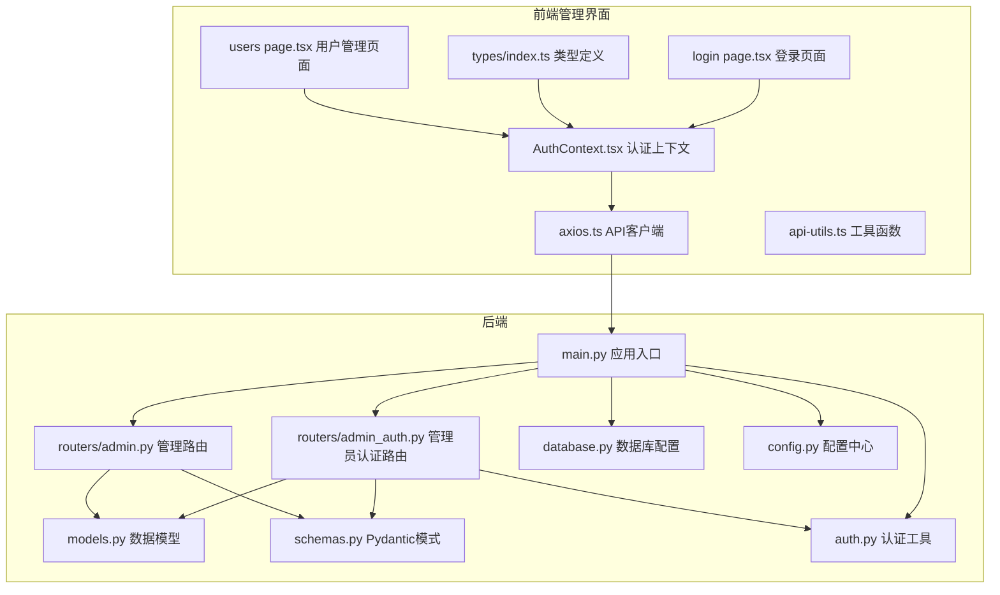

**图表来源**
- [main.py:121-132](file://backend/main.py#L121-L132)
- [admin_auth.py:29-33](file://backend/routers/admin_auth.py#L29-L33)
- [admin.py:10-14](file://backend/routers/admin.py#L10-L14)
- [auth.py:30-75](file://backend/auth.py#L30-L75)
- [models.py:10-32](file://backend/models.py#L10-L32)
- [schemas.py:65-107](file://backend/schemas.py#L65-L107)
- [config.py:26-30](file://backend/config.py#L26-L30)
- [AuthContext.tsx:39-116](file://backend/admin/src/context/AuthContext.tsx#L39-L116)
- [axios.ts:1-100](file://backend/admin/src/lib/axios.ts#L1-L100)
- [login page.tsx:51-118](file://backend/admin/src/app/admin/login/page.tsx#L51-L118)
- [types/index.ts:93-123](file://backend/admin/src/types/index.ts#L93-L123)
- [users page.tsx:87-450](file://backend/admin/src/app/admin/players/page.tsx#L87-L450)

**章节来源**
- [main.py:121-132](file://backend/main.py#L121-L132)
- [admin_auth.py:29-33](file://backend/routers/admin_auth.py#L29-L33)
- [database.py:6-31](file://backend/database.py#L6-L31)
- [config.py:26-30](file://backend/config.py#L26-L30)

## 核心组件
- 应用入口与生命周期管理：负责数据库迁移、CORS配置、路由注册与静态文件挂载
- 管理员认证路由模块：提供独立的管理员登录、令牌刷新和信息获取接口
- 管理路由模块：提供统计信息、用户列表、用户删除、故事列表等接口
- 认证工具模块：包含JWT令牌创建、验证和解码功能
- 数据模型层：定义管理员、用户、故事章节、资产、LLM供应商、聊天会话与消息等实体
- 模式定义层：Pydantic模式用于请求/响应校验与序列化
- 业务服务层：封装用户创建、世界初始化等业务逻辑
- 数据库与配置：异步引擎、会话工厂、连接池参数与环境变量配置
- 前端认证与API：本地存储令牌、路由守卫、Axios拦截器与SWR数据拉取

**章节来源**
- [main.py:121-132](file://backend/main.py#L121-L132)
- [admin_auth.py:36-136](file://backend/routers/admin_auth.py#L36-L136)
- [admin.py:16-498](file://backend/routers/admin.py#L16-L498)
- [auth.py:30-229](file://backend/auth.py#L30-L229)
- [models.py:10-383](file://backend/models.py#L10-L383)
- [schemas.py:65-107](file://backend/schemas.py#L65-L107)
- [AuthContext.tsx:39-116](file://backend/admin/src/context/AuthContext.tsx#L39-L116)
- [axios.ts:1-100](file://backend/admin/src/lib/axios.ts#L1-L100)

## 架构总览
管理员管理API采用分层架构，新增了独立的管理员认证系统和用户管理功能：
- 表现层：FastAPI路由与Next.js管理界面
- 认证层：独立的管理员认证路由和JWT令牌管理
- 业务层：GameService封装核心业务流程
- 数据访问层：SQLAlchemy异步ORM与数据库配置
- 安全层：JWT令牌验证、密码哈希存储和前端路由守卫

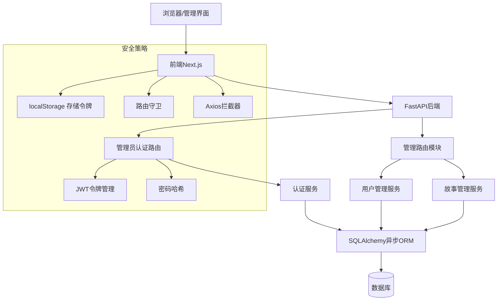

**图表来源**
- [main.py:121-132](file://backend/main.py#L121-L132)
- [admin_auth.py:36-136](file://backend/routers/admin_auth.py#L36-L136)
- [admin.py:16-498](file://backend/routers/admin.py#L16-L498)
- [auth.py:30-75](file://backend/auth.py#L30-L75)
- [AuthContext.tsx:47-104](file://backend/admin/src/context/AuthContext.tsx#L47-L104)
- [axios.ts:12-97](file://backend/admin/src/lib/axios.ts#L12-L97)

## 详细组件分析

### 管理员认证路由模块（/api/admin/auth）
管理员认证系统提供独立的认证流程，与用户认证完全分离：

- 管理员登录接口：验证邮箱和密码，生成访问令牌和刷新令牌
- 令牌刷新接口：使用刷新令牌获取新的访问令牌
- 获取当前管理员信息接口：验证访问令牌并返回管理员详情

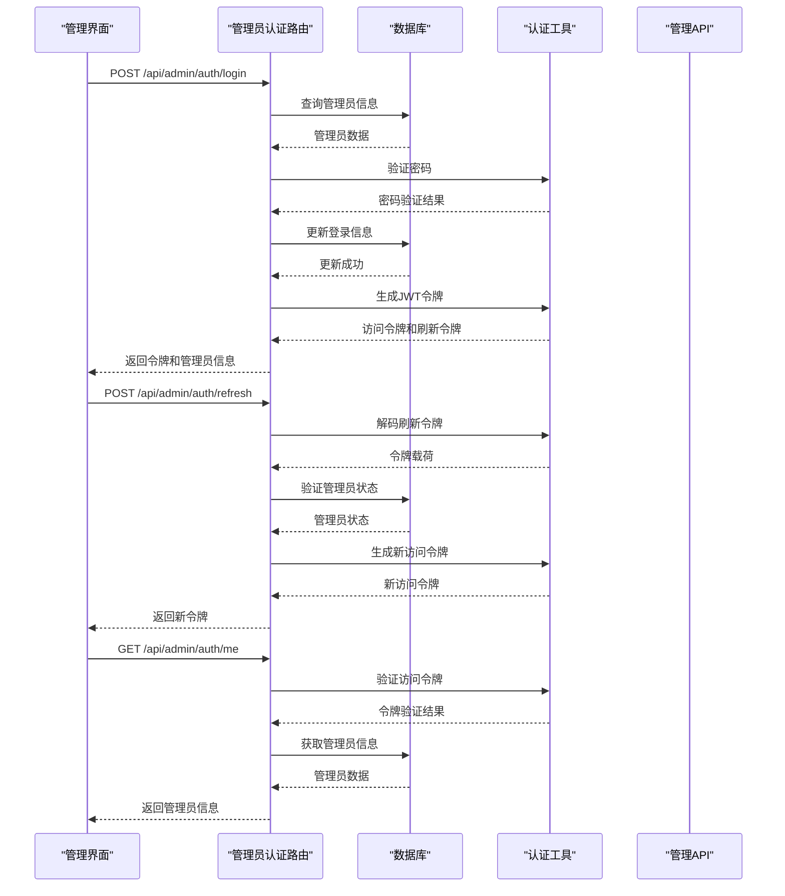

**图表来源**
- [admin_auth.py:36-136](file://backend/routers/admin_auth.py#L36-L136)
- [auth.py:30-75](file://backend/auth.py#L30-L75)
- [models.py:10-32](file://backend/models.py#L10-L32)

**章节来源**
- [admin_auth.py:36-136](file://backend/routers/admin_auth.py#L36-L136)

### 管理路由模块（/api/admin）
- 统计信息接口：返回用户、故事、资产、供应商数量
- 用户列表接口：支持分页与排序
- 用户删除接口：删除指定用户及其关联数据
- 故事列表接口：支持按用户过滤与分页
- 用户积分管理：管理员手动调整用户积分
- 用户订阅管理：管理员设置用户订阅计划

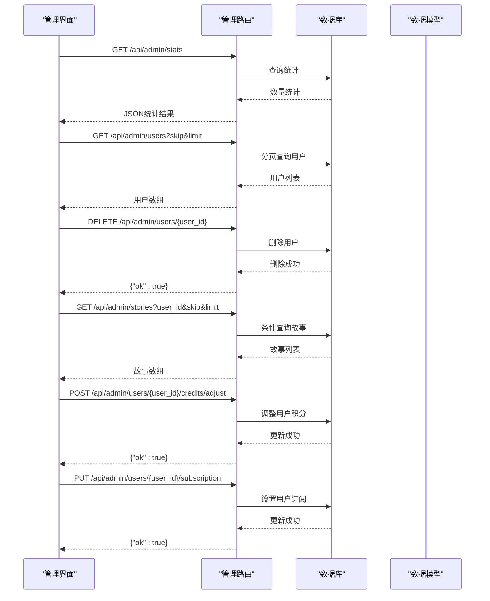

**图表来源**
- [admin.py:16-498](file://backend/routers/admin.py#L16-L498)
- [models.py:35-83](file://backend/models.py#L35-L83)

**章节来源**
- [admin.py:16-498](file://backend/routers/admin.py#L16-L498)

### 数据模型与关系
- Admin：管理员基本信息与认证数据
- User：用户基本信息与状态（替代之前的Player）
- StoryChapter：故事章节内容与元数据（外键从player_id改为user_id）
- Asset：生成资源（图片/音频等）（外键从player_id改为user_id）
- LLMProvider：AI供应商配置
- Agent/ChatSession/ChatMessage：聊天与代理相关实体

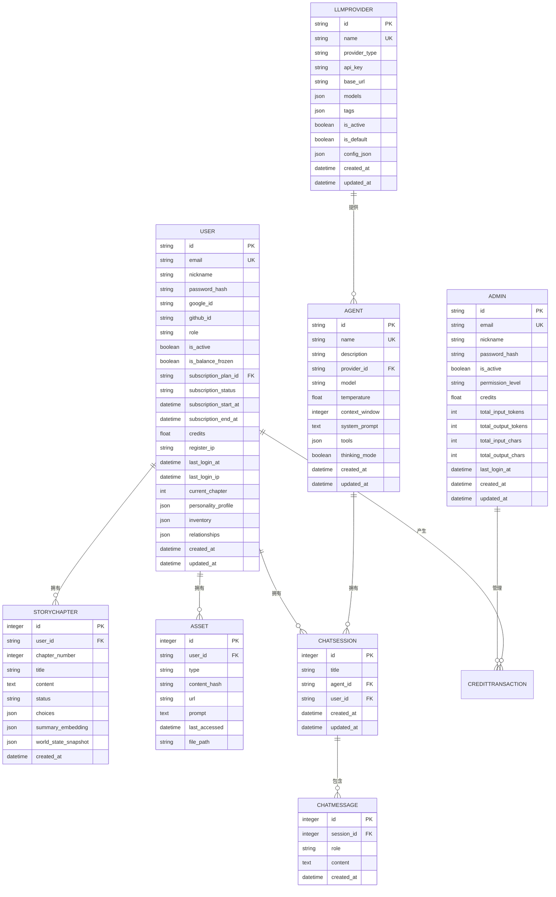

**图表来源**
- [models.py:10-32](file://backend/models.py#L10-L32)
- [models.py:35-83](file://backend/models.py#L35-L83)
- [models.py:81-122](file://backend/models.py#L81-L122)
- [models.py:167-221](file://backend/models.py#L167-L221)

**章节来源**
- [models.py:10-32](file://backend/models.py#L10-L32)
- [models.py:35-83](file://backend/models.py#L35-L83)
- [models.py:81-122](file://backend/models.py#L81-L122)
- [models.py:167-221](file://backend/models.py#L167-L221)

### 前端认证与会话管理
- 使用localStorage存储管理员令牌（access_token、refresh_token、admin）
- 路由守卫：访问/admin路径且未登录时自动跳转至登录页
- Axios拦截器统一处理错误和令牌刷新
- 管理员登录页面提供表单验证和错误处理
- SWR用于仪表盘统计数据的获取与缓存
- 用户管理页面提供完整的用户操作界面

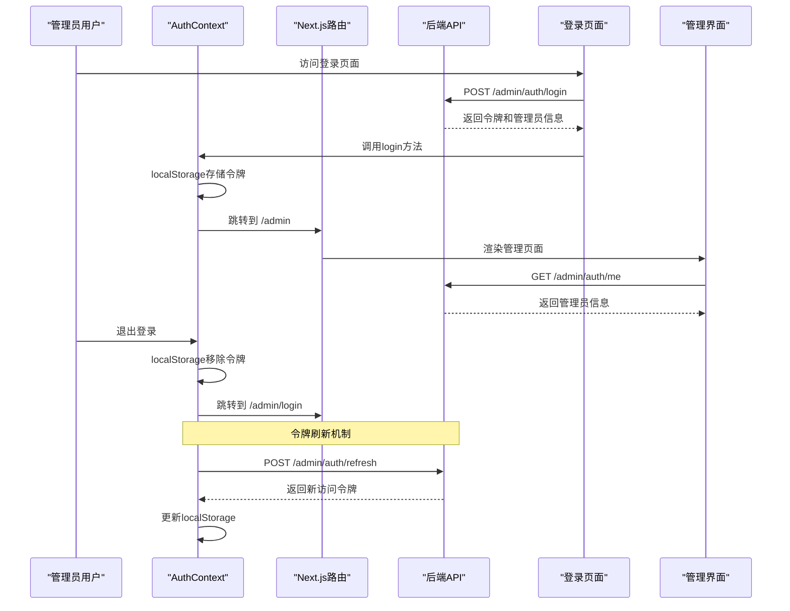

**图表来源**
- [AuthContext.tsx:47-104](file://backend/admin/src/context/AuthContext.tsx#L47-L104)
- [axios.ts:42-97](file://backend/admin/src/lib/axios.ts#L42-L97)
- [login page.tsx:76-118](file://backend/admin/src/app/admin/login/page.tsx#L76-L118)
- [types/index.ts:93-123](file://backend/admin/src/types/index.ts#L93-L123)

**章节来源**
- [AuthContext.tsx:39-116](file://backend/admin/src/context/AuthContext.tsx#L39-L116)
- [axios.ts:1-100](file://backend/admin/src/lib/axios.ts#L1-L100)
- [api-utils.ts:1-19](file://backend/admin/src/lib/api-utils.ts#L1-L19)
- [login page.tsx:51-254](file://backend/admin/src/app/admin/login/page.tsx#L51-L254)
- [types/index.ts:93-123](file://backend/admin/src/types/index.ts#L93-L123)

## 管理员认证系统

### JWT令牌管理
管理员认证系统采用JWT（JSON Web Token）进行身份验证，提供完整的令牌生命周期管理：

- 访问令牌（Access Token）：短期有效令牌，用于API访问
- 刷新令牌（Refresh Token）：长期有效令牌，用于获取新的访问令牌
- 令牌载荷：包含管理员ID、角色、主体类型和过期时间
- 令牌验证：支持管理员类型验证和账户状态检查

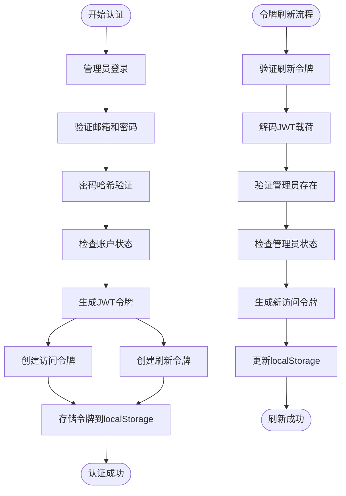

**图表来源**
- [admin_auth.py:36-91](file://backend/routers/admin_auth.py#L36-L91)
- [auth.py:30-75](file://backend/auth.py#L30-L75)
- [AuthContext.tsx:85-104](file://backend/admin/src/context/AuthContext.tsx#L85-L104)

### 密码加密存储
管理员密码采用bcrypt算法进行哈希存储，确保安全性：

- 密码哈希：使用12轮加密强度
- 密码验证：实时验证输入密码与存储哈希
- 安全存储：密码以哈希形式存储，不存储明文密码

**章节来源**
- [admin_auth.py:58-64](file://backend/routers/admin_auth.py#L58-L64)
- [auth.py:19-25](file://backend/auth.py#L19-L25)
- [models.py:17](file://backend/models.py#L17)

### 会话管理
前端采用localStorage进行会话管理，提供完整的会话生命周期：

- 令牌存储：同时存储访问令牌和刷新令牌
- 自动刷新：Axios拦截器自动处理令牌过期和刷新
- 路由保护：防止未认证用户访问受保护路由
- 错误处理：统一处理认证相关的HTTP错误

**章节来源**
- [AuthContext.tsx:47-104](file://backend/admin/src/context/AuthContext.tsx#L47-L104)
- [axios.ts:42-97](file://backend/admin/src/lib/axios.ts#L42-L97)

### 管理员权限验证
系统支持管理员权限验证，确保只有授权管理员可以访问特定功能：

- 管理员依赖注入：`get_current_active_admin`依赖
- 权限检查：验证管理员账户状态和权限级别
- 装饰器使用：`require_admin`装饰器保护敏感操作

**章节来源**
- [auth.py:147-157](file://backend/auth.py#L147-L157)
- [admin.py:421-440](file://backend/routers/admin.py#L421-L440)

## 用户管理功能

### 用户CRUD操作
管理员现在可以管理用户账户，包括创建、更新、删除和查询用户信息：

- 用户列表接口：支持分页与排序，返回用户基本信息
- 用户详情接口：获取单个用户的完整信息
- 用户删除接口：删除指定用户及其关联数据
- 用户搜索过滤：支持按邮箱、昵称等条件过滤

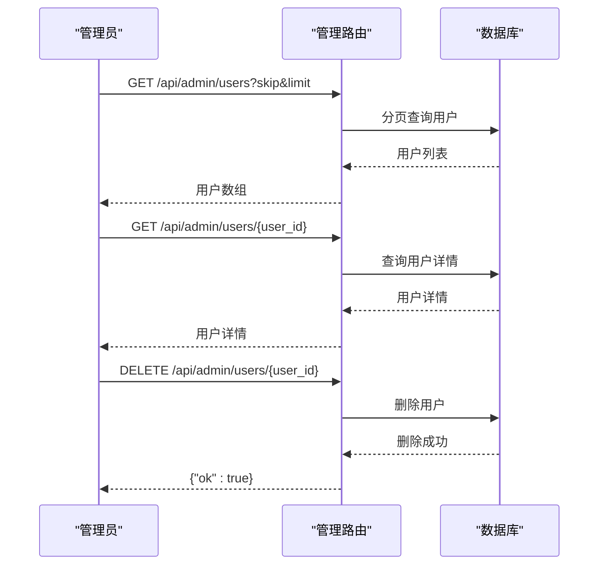

**图表来源**
- [admin.py:53-136](file://backend/routers/admin.py#L53-L136)

### 用户积分管理
管理员可以手动调整用户的积分余额，支持充值和扣除操作：

- 积分调整接口：管理员手动调整用户积分
- 交易记录：自动记录积分变动历史
- 余额验证：确保积分余额不低于0

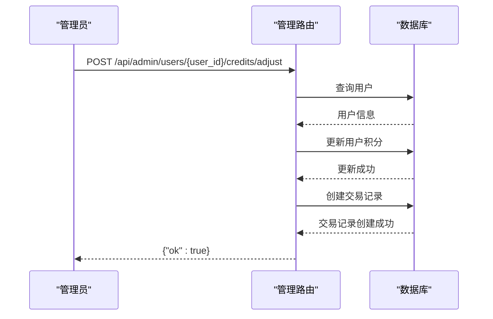

**图表来源**
- [admin.py:141-188](file://backend/routers/admin.py#L141-L188)

### 用户订阅管理
管理员可以为用户设置订阅计划，包括自动发放积分等功能：

- 订阅设置接口：管理员设置用户订阅计划
- 订阅取消接口：取消用户的订阅状态
- 自动积分发放：根据订阅套餐自动发放积分
- 订阅状态跟踪：实时跟踪订阅状态变化

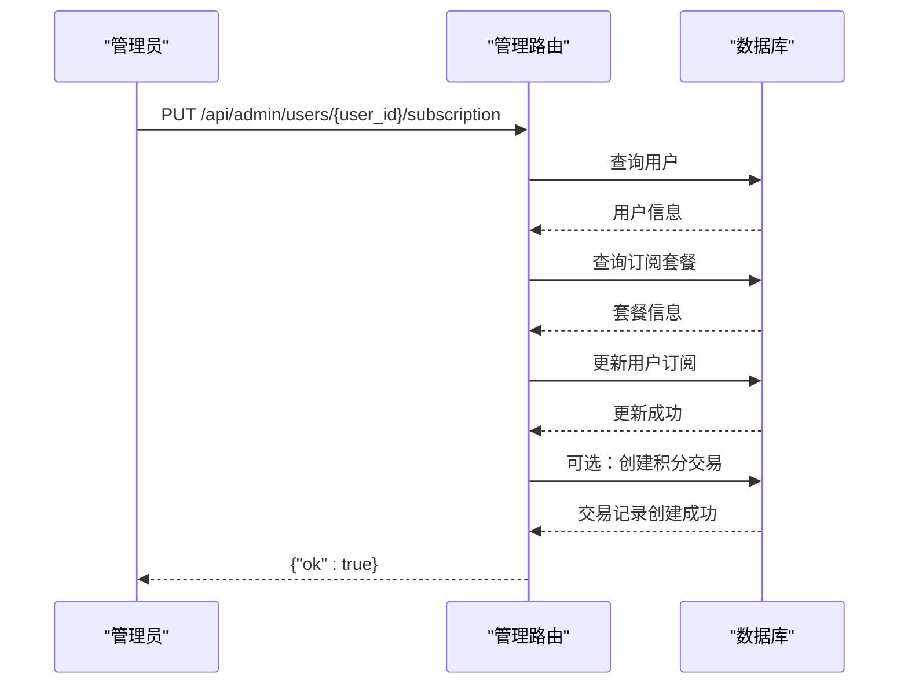

**图表来源**
- [admin.py:220-302](file://backend/routers/admin.py#L220-L302)

### 前端用户管理界面
用户管理页面提供完整的用户操作界面，包括积分调整、订阅管理和用户删除功能：

- 用户列表展示：显示用户的基本信息和状态
- 积分管理对话框：支持充值和扣除操作
- 订阅管理对话框：设置用户订阅计划
- 用户删除确认：防止误删用户数据
- 实时数据更新：使用SWR进行数据缓存和刷新

**章节来源**
- [admin.py:53-498](file://backend/routers/admin.py#L53-L498)
- [users page.tsx:87-450](file://backend/admin/src/app/admin/players/page.tsx#L87-L450)

## 依赖关系分析
- 应用入口依赖数据库与配置模块，注册管理员认证路由和其他子路由
- 管理员认证路由依赖数据库会话、数据模型和认证工具
- 管理路由依赖数据库会话与数据模型，支持用户管理、积分管理和订阅管理
- 认证工具提供JWT令牌创建、验证和密码哈希功能
- 前端依赖Axios与SWR进行数据交互，集成AuthContext进行认证管理

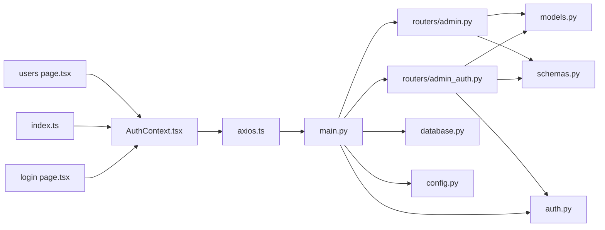

**图表来源**
- [main.py:121-132](file://backend/main.py#L121-L132)
- [admin_auth.py:1-25](file://backend/routers/admin_auth.py#L1-L25)
- [admin.py:1-14](file://backend/routers/admin.py#L1-L14)
- [auth.py:1-25](file://backend/auth.py#L1-L25)
- [database.py:28-31](file://backend/database.py#L28-L31)
- [config.py:33-34](file://backend/config.py#L33-L34)
- [AuthContext.tsx:1-55](file://backend/admin/src/context/AuthContext.tsx#L1-L55)
- [axios.ts:1-20](file://backend/admin/src/lib/axios.ts#L1-L20)
- [login page.tsx:1-50](file://backend/admin/src/app/admin/login/page.tsx#L1-L50)
- [types/index.ts:1-50](file://backend/admin/src/types/index.ts#L1-L50)
- [users page.tsx:1-50](file://backend/admin/src/app/admin/players/page.tsx#L1-L50)

**章节来源**
- [main.py:121-132](file://backend/main.py#L121-L132)
- [admin_auth.py:1-25](file://backend/routers/admin_auth.py#L1-L25)
- [admin.py:1-14](file://backend/routers/admin.py#L1-L14)
- [auth.py:1-25](file://backend/auth.py#L1-L25)
- [database.py:28-31](file://backend/database.py#L28-L31)
- [config.py:33-34](file://backend/config.py#L33-L34)

## 性能考虑
- 异步数据库连接：使用SQLAlchemy异步引擎与连接池，提升并发处理能力
- 分页查询：管理接口支持skip/limit参数，避免一次性返回大量数据
- 缓存策略：前端使用SWR进行数据缓存与自动刷新
- CORS配置：允许特定来源访问，减少跨域安全风险
- JWT令牌优化：合理的过期时间设置，平衡安全性和用户体验
- 日志级别：SQLAlchemy与Uvicorn访问日志降级，降低I/O开销

**章节来源**
- [database.py:8-23](file://backend/database.py#L8-L23)
- [admin.py:33-57](file://backend/routers/admin.py#L33-L57)
- [main.py:113-119](file://backend/main.py#L113-L119)
- [config.py:26-30](file://backend/config.py#L26-L30)
- [AuthContext.tsx:107-109](file://backend/admin/src/context/AuthContext.tsx#L107-L109)

## 故障排除指南
- 数据库连接失败：启动时执行迁移并重试，检查DATABASE_URL配置
- CORS错误：确认前端域名已在CORS白名单中
- API 404：检查路由前缀与路径是否正确
- 管理员认证失败：检查邮箱和密码格式，确认账户状态
- 令牌过期：检查JWT配置，确认ACCESS_TOKEN_EXPIRE_MINUTES设置
- 前端路由跳转：未登录访问/admin将被重定向至/login
- Axios错误拦截：全局错误会在控制台打印，便于定位问题
- 密码哈希问题：确认bcrypt库版本兼容性
- 用户管理错误：检查用户ID格式，确认用户存在且状态正常

**章节来源**
- [main.py:50-98](file://backend/main.py#L50-L98)
- [main.py:113-119](file://backend/main.py#L113-L119)
- [admin_auth.py:50-71](file://backend/routers/admin_auth.py#L50-L71)
- [AuthContext.tsx:67-74](file://backend/admin/src/context/AuthContext.tsx#L67-L74)
- [axios.ts:48-52](file://backend/admin/src/lib/axios.ts#L48-L52)
- [config.py:26-30](file://backend/config.py#L26-L30)

## 结论
管理员管理API现已具备完整的认证系统和用户管理功能，包括独立的管理员认证路由、JWT令牌管理、用户CRUD操作和积分管理。系统提供了安全可靠的后台管理功能，支持管理员登录、令牌刷新、用户管理、积分调整和订阅管理。为满足生产环境需求，建议补充以下能力：

- 完善的权限管理：实现更细粒度的管理员权限控制
- 审计日志：记录管理员关键操作与异常事件
- 安全增强：实施CSRF保护、速率限制和IP白名单
- 监控告警：添加认证失败监控和异常检测
- 测试覆盖：增加认证相关的单元测试和集成测试
- 文档完善：补充API文档和开发指南

这些增强将显著提升系统的安全性与可维护性，确保后台管理功能稳定可靠地服务于运营与管理工作。