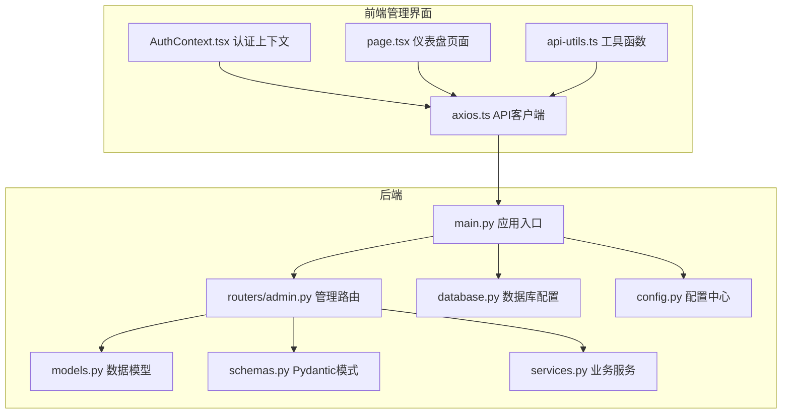
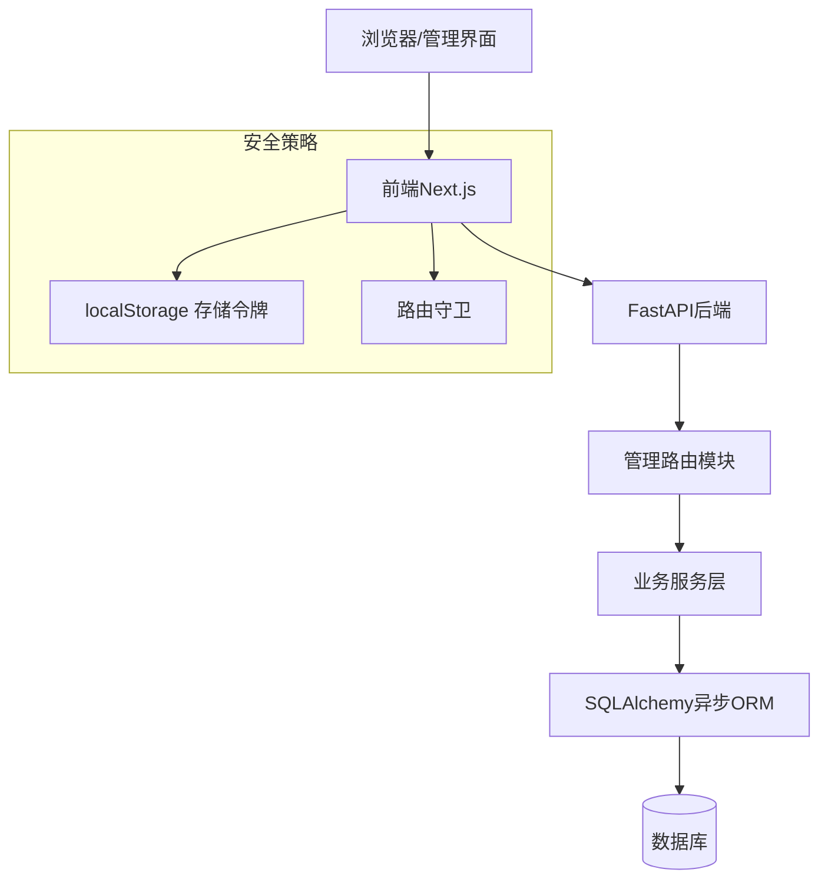
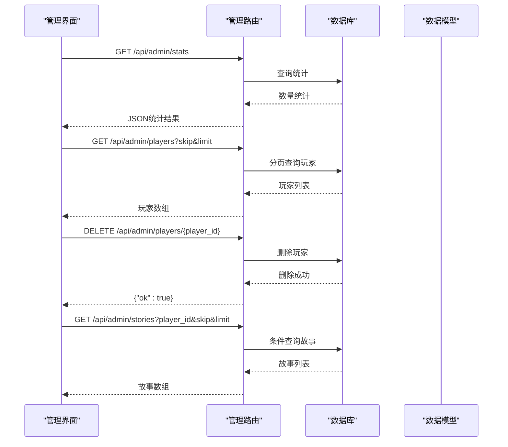
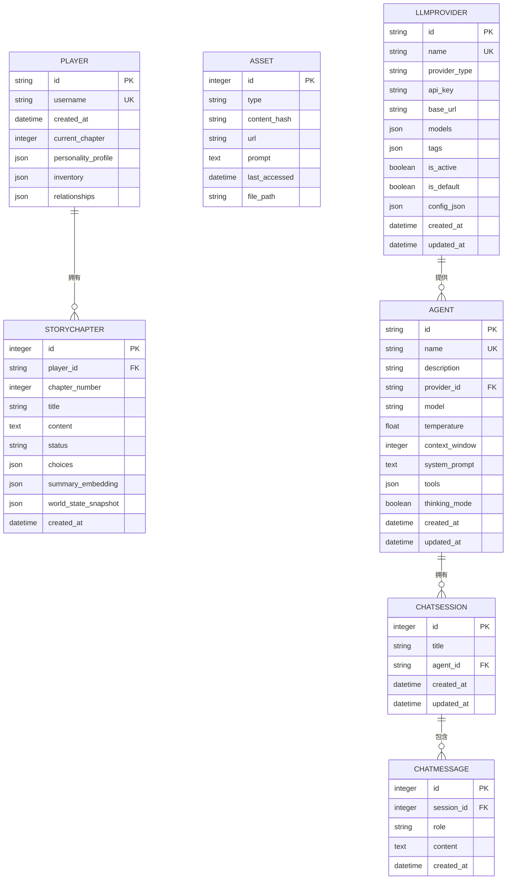
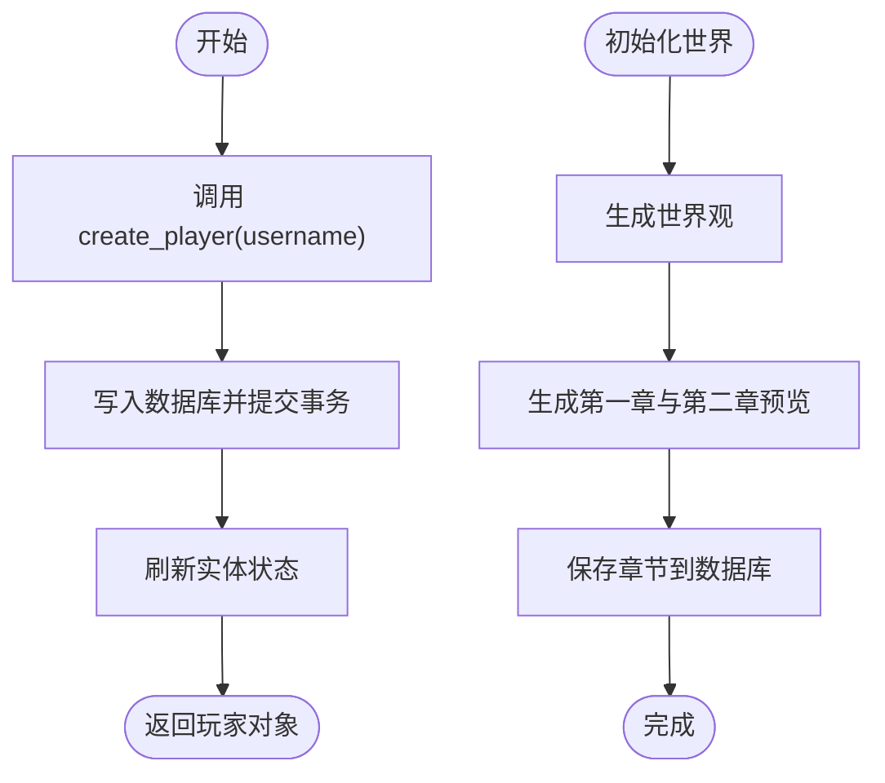
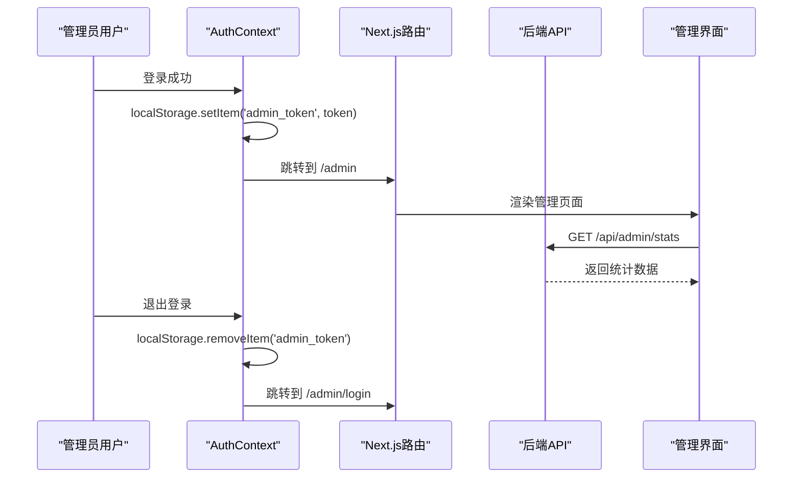
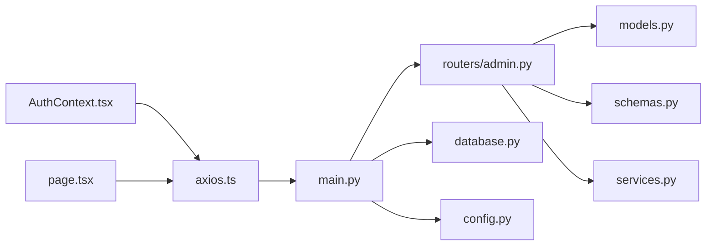

# 管理员管理API

<cite>
**本文档引用的文件**
- [main.py](file://backend/main.py)
- [admin.py](file://backend/routers/admin.py)
- [models.py](file://backend/models.py)
- [schemas.py](file://backend/schemas.py)
- [services.py](file://backend/services.py)
- [database.py](file://backend/database.py)
- [config.py](file://backend/config.py)
- [AuthContext.tsx](file://backend/admin/src/context/AuthContext.tsx)
- [api-utils.ts](file://backend/admin/src/lib/api-utils.ts)
- [axios.ts](file://backend/admin/src/lib/axios.ts)
- [page.tsx](file://backend/admin/src/app/admin/page.tsx)
</cite>

## 目录
1. [简介](#简介)
2. [项目结构](#项目结构)
3. [核心组件](#核心组件)
4. [架构总览](#架构总览)
5. [详细组件分析](#详细组件分析)
6. [依赖关系分析](#依赖关系分析)
7. [性能考虑](#性能考虑)
8. [故障排除指南](#故障排除指南)
9. [结论](#结论)

## 简介
本文件为管理员管理API的全面技术文档，重点覆盖以下方面：
- 管理员账户的认证与会话管理机制
- 权限控制与访问限制策略
- 管理员用户CRUD操作的实现细节（创建、删除、查询等）
- 后台管理界面的数据接口设计（玩家监控、统计信息、故事管理等）
- 安全策略：JWT令牌处理、密码加密存储、会话管理
- 管理员操作的完整工作流程与错误处理机制

当前代码库中未发现显式的管理员认证路由或JWT实现，但提供了完整的后台管理前端框架与基础数据接口。本文在现有代码基础上，给出可扩展的认证授权与安全实现建议。

## 项目结构
后端采用FastAPI + SQLAlchemy异步ORM架构，数据库使用SQLite（默认）或PostgreSQL（可配置）。管理员功能通过独立的路由模块提供REST接口，前端使用Next.js构建管理界面。

**图表来源**
- [main.py](file://backend/main.py#L83-L98)
- [admin.py](file://backend/routers/admin.py#L10-L14)
- [models.py](file://backend/models.py#L9-L122)
- [schemas.py](file://backend/schemas.py#L4-L102)
- [services.py](file://backend/services.py#L8-L66)
- [database.py](file://backend/database.py#L6-L31)
- [config.py](file://backend/config.py#L7-L34)
- [AuthContext.tsx](file://backend/admin/src/context/AuthContext.tsx#L20-L54)
- [axios.ts](file://backend/admin/src/lib/axios.ts#L3-L8)
- [page.tsx](file://backend/admin/src/app/admin/page.tsx#L12-L23)

**章节来源**
- [main.py](file://backend/main.py#L83-L98)
- [admin.py](file://backend/routers/admin.py#L10-L14)
- [database.py](file://backend/database.py#L6-L31)
- [config.py](file://backend/config.py#L7-L34)

## 核心组件
- 应用入口与生命周期管理：负责数据库迁移、CORS配置、路由注册与静态文件挂载。
- 管理路由模块：提供统计信息、玩家列表、玩家删除、故事列表等接口。
- 数据模型层：定义玩家、故事章节、资产、LLM供应商、聊天会话与消息等实体。
- 模式定义层：Pydantic模式用于请求/响应校验与序列化。
- 业务服务层：封装玩家创建、世界初始化等业务逻辑。
- 数据库与配置：异步引擎、会话工厂、连接池参数与环境变量配置。
- 前端认证与API：本地存储令牌、路由守卫、Axios拦截器与SWR数据拉取。

**章节来源**
- [main.py](file://backend/main.py#L45-L82)
- [admin.py](file://backend/routers/admin.py#L16-L112)
- [models.py](file://backend/models.py#L9-L122)
- [schemas.py](file://backend/schemas.py#L4-L102)
- [services.py](file://backend/services.py#L8-L66)
- [database.py](file://backend/database.py#L6-L31)
- [config.py](file://backend/config.py#L7-L34)
- [AuthContext.tsx](file://backend/admin/src/context/AuthContext.tsx#L20-L54)
- [axios.ts](file://backend/admin/src/lib/axios.ts#L3-L8)
- [page.tsx](file://backend/admin/src/app/admin/page.tsx#L12-L23)

## 架构总览
管理员管理API采用分层架构：
- 表现层：FastAPI路由与Next.js管理界面
- 业务层：GameService封装核心业务流程
- 数据访问层：SQLAlchemy异步ORM与数据库配置
- 安全层：前端本地令牌存储与路由守卫（当前未集成后端JWT）

**图表来源**
- [main.py](file://backend/main.py#L83-L98)
- [admin.py](file://backend/routers/admin.py#L16-L112)
- [services.py](file://backend/services.py#L8-L66)
- [database.py](file://backend/database.py#L6-L31)
- [AuthContext.tsx](file://backend/admin/src/context/AuthContext.tsx#L25-L35)

## 详细组件分析

### 管理路由模块（/api/admin）
- 统计信息接口：返回玩家、故事、资产、供应商数量
- 玩家列表接口：支持分页与排序
- 玩家删除接口：删除指定玩家及其关联数据
- 故事列表接口：支持按玩家过滤与分页

**图表来源**
- [admin.py](file://backend/routers/admin.py#L16-L112)
- [models.py](file://backend/models.py#L9-L44)

**章节来源**
- [admin.py](file://backend/routers/admin.py#L16-L112)

### 数据模型与关系
- Player：玩家基本信息与状态
- StoryChapter：故事章节内容与元数据
- Asset：生成资源（图片/音频等）
- LLMProvider：AI供应商配置
- Agent/ChatSession/ChatMessage：聊天与代理相关实体

**图表来源**
- [models.py](file://backend/models.py#L9-L122)

**章节来源**
- [models.py](file://backend/models.py#L9-L122)

### 业务服务层（GameService）
- create_player：创建新玩家并持久化
- init_world：初始化世界设定与前两章内容
- process_player_choice：预留玩家选择处理与一致性检查

**图表来源**
- [services.py](file://backend/services.py#L12-L59)

**章节来源**
- [services.py](file://backend/services.py#L8-L66)

### 前端认证与会话管理
- 使用localStorage存储管理员令牌
- 路由守卫：访问/admin路径且未登录时自动跳转至登录页
- Axios拦截器统一处理错误
- SWR用于仪表盘统计数据的获取与缓存

**图表来源**
- [AuthContext.tsx](file://backend/admin/src/context/AuthContext.tsx#L25-L47)
- [axios.ts](file://backend/admin/src/lib/axios.ts#L10-L17)
- [page.tsx](file://backend/admin/src/app/admin/page.tsx#L12-L23)

**章节来源**
- [AuthContext.tsx](file://backend/admin/src/context/AuthContext.tsx#L20-L54)
- [axios.ts](file://backend/admin/src/lib/axios.ts#L3-L19)
- [api-utils.ts](file://backend/admin/src/lib/api-utils.ts#L1-L19)
- [page.tsx](file://backend/admin/src/app/admin/page.tsx#L12-L23)

## 依赖关系分析
- 应用入口依赖数据库与配置模块，注册管理路由与其他子路由
- 管理路由依赖数据库会话与数据模型
- 业务服务依赖模型与外部叙事引擎
- 前端依赖Axios与SWR进行数据交互

**图表来源**
- [main.py](file://backend/main.py#L30-L42)
- [admin.py](file://backend/routers/admin.py#L1-L14)
- [database.py](file://backend/database.py#L28-L31)
- [config.py](file://backend/config.py#L33-L34)
- [models.py](file://backend/models.py#L1-L4)
- [schemas.py](file://backend/schemas.py#L1-L2)
- [services.py](file://backend/services.py#L1-L6)
- [AuthContext.tsx](file://backend/admin/src/context/AuthContext.tsx#L1-L55)
- [axios.ts](file://backend/admin/src/lib/axios.ts#L1-L20)
- [page.tsx](file://backend/admin/src/app/admin/page.tsx#L1-L109)

**章节来源**
- [main.py](file://backend/main.py#L30-L42)
- [admin.py](file://backend/routers/admin.py#L1-L14)
- [database.py](file://backend/database.py#L28-L31)
- [config.py](file://backend/config.py#L33-L34)

## 性能考虑
- 异步数据库连接：使用SQLAlchemy异步引擎与连接池，提升并发处理能力
- 分页查询：管理接口支持skip/limit参数，避免一次性返回大量数据
- 缓存策略：前端使用SWR进行数据缓存与自动刷新
- CORS配置：允许特定来源访问，减少跨域安全风险
- 日志级别：SQLAlchemy与Uvicorn访问日志降级，降低I/O开销

**章节来源**
- [database.py](file://backend/database.py#L8-L23)
- [admin.py](file://backend/routers/admin.py#L33-L57)
- [main.py](file://backend/main.py#L85-L91)
- [page.tsx](file://backend/admin/src/app/admin/page.tsx#L12-L23)

## 故障排除指南
- 数据库连接失败：启动时执行迁移并重试，检查DATABASE_URL配置
- CORS错误：确认前端域名已在CORS白名单中
- API 404：检查路由前缀与路径是否正确
- 前端路由跳转：未登录访问/admin将被重定向至/login
- Axios错误拦截：全局错误会在控制台打印，便于定位问题

**章节来源**
- [main.py](file://backend/main.py#L45-L82)
- [main.py](file://backend/main.py#L85-L91)
- [AuthContext.tsx](file://backend/admin/src/context/AuthContext.tsx#L31-L34)
- [axios.ts](file://backend/admin/src/lib/axios.ts#L10-L17)

## 结论
当前管理员管理API提供了基础的统计与玩家/故事管理接口，配合前端Next.js实现了仪表盘与数据展示。为满足生产环境需求，建议补充以下能力：
- 后端认证与授权：引入JWT令牌签发与校验、权限中间件与角色管理
- 密码安全：采用哈希算法存储管理员口令，启用HTTPS与安全头
- 会话管理：令牌过期与刷新机制、黑名单与强制登出
- 接口鉴权：为所有管理接口添加权限校验装饰器
- 审计日志：记录管理员关键操作与异常事件
- 输入校验：结合Pydantic模式强化请求参数验证

这些增强将显著提升系统的安全性与可维护性，确保后台管理功能稳定可靠地服务于运营与管理工作。