# 聊天交互API

<cite>
**本文档引用的文件**
- [backend/main.py](file://backend/main.py)
- [backend/routers/chats.py](file://backend/routers/chats.py)
- [backend/routers/media.py](file://backend/routers/media.py)
- [backend/routers/skills_api.py](file://backend/routers/skills_api.py)
- [backend/models.py](file://backend/models.py)
- [backend/schemas.py](file://backend/schemas.py)
- [backend/database.py](file://backend/database.py)
- [backend/config.py](file://backend/config.py)
- [backend/services/media_utils.py](file://backend/services/media_utils.py)
- [backend/services/llm_stream.py](file://backend/services/llm_stream.py)
- [backend/services/batch_image_gen.py](file://backend/services/batch_image_gen.py)
- [backend/services/skill_tools.py](file://backend/services/skill_tools.py)
- [backend/skills_manager.py](file://backend/skills_manager.py)
- [backend/admin/src/components/admin/agents/ChatInterface.tsx](file://backend/admin/src/components/admin/agents/ChatInterface.tsx)
- [backend/admin/src/app/admin/skills/SkillDialog.tsx](file://backend/admin/src/app/admin/skills/SkillDialog.tsx)
- [frontend/src/hooks/useSocket.ts](file://frontend/src/hooks/useSocket.ts)
</cite>

## 更新摘要
**变更内容**
- 优化聊天路由逻辑：在对话的最后轮次中智能地避免传递工具定义，减少计算开销并提高响应速度
- 新增技能驱动聊天架构：引入技能注入服务、工具调用处理、多轮执行管理
- 添加实时技能加载指示器：前端显示技能加载和工具执行状态
- 新增技能管理API：支持技能的创建、编辑、激活/停用和版本管理
- 扩展聊天路由：支持多轮工具调用和技能加载的SSE事件流
- 增强管理员界面：提供完整的技能管理功能
- **新增技能和工具调用跟踪**：现在支持skill_calls和tool_calls的完整序列化和反序列化，包括SSE事件流的完整跟踪机制

## 目录
1. [简介](#简介)
2. [项目结构](#项目结构)
3. [核心组件](#核心组件)
4. [架构总览](#架构总览)
5. [详细组件分析](#详细组件分析)
6. [依赖关系分析](#依赖关系分析)
7. [性能考虑](#性能考虑)
8. [故障排查指南](#故障排查指南)
9. [结论](#结论)
10. [附录](#附录)

## 简介
本项目提供了一个完整的聊天交互API，支持：
- 实时聊天：基于FastAPI的异步流式响应，结合前端fetch的ReadableStream实现边读边渲染
- 聊天室管理：会话创建、列表查询、消息查询与删除
- 多模型提供商：OpenAI、Azure OpenAI、DashScope、Gemini等
- 多模态支持：文本与图片混合消息，Gemini 3.1图片生动生成
- 媒体文件服务：安全的媒体文件存储与访问，支持批量图片生成
- 技能驱动架构：基于技能注入的服务，支持工具调用和多轮执行管理
- 实时状态指示：技能加载和工具执行的可视化反馈
- 安全与合规：输入校验、角色约束、上下文窗口控制
- 历史记录：消息持久化、按会话检索、时间排序
- **技能调用跟踪**：完整的skill_calls和tool_calls序列化/反序列化机制，支持SSE事件流的实时跟踪

**更新** 系统现已支持技能驱动的聊天架构，通过技能注入服务实现动态能力扩展，支持工具调用的多轮执行和实时状态反馈。新增的技能调用跟踪机制确保所有技能加载和工具执行过程都得到完整记录和可视化展示。**优化后的聊天路由逻辑在对话最后轮次智能避免传递工具定义，显著减少计算开销并提高响应速度。**

## 项目结构
后端采用FastAPI + SQLAlchemy异步ORM + Alembic迁移的现代Python架构；前端使用React + SWR进行数据拉取与缓存；管理员界面集成在Next.js中。

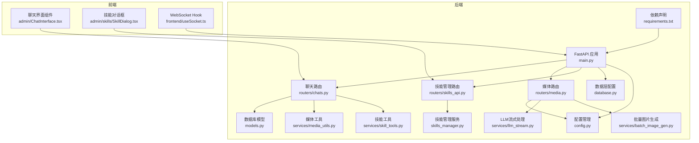

**图表来源**
- [backend/main.py:83-97](file://backend/main.py#L83-L97)
- [backend/routers/chats.py:1-689](file://backend/routers/chats.py#L1-L689)
- [backend/routers/media.py:1-130](file://backend/routers/media.py#L1-L130)
- [backend/routers/skills_api.py:1-207](file://backend/routers/skills_api.py#L1-L207)
- [backend/services/skill_tools.py:1-142](file://backend/services/skill_tools.py#L1-L142)
- [backend/skills_manager.py:1-408](file://backend/skills_manager.py#L1-L408)
- [backend/admin/src/components/admin/agents/ChatInterface.tsx:1-711](file://backend/admin/src/components/admin/agents/ChatInterface.tsx#L1-L711)
- [backend/admin/src/app/admin/skills/SkillDialog.tsx:1-235](file://backend/admin/src/app/admin/skills/SkillDialog.tsx#L1-L235)

## 核心组件
- 聊天路由：提供会话创建、列表查询、会话详情、消息查询、消息发送（流式）、会话删除
- 媒体路由：提供安全的媒体文件访问服务，支持批量图片生成
- 技能管理路由：提供技能的CRUD操作、状态管理和版本控制
- 数据模型：ChatSession、ChatMessage、Agent、LLMProvider、CreditTransaction
- 数据库配置：异步引擎、连接池、会话工厂
- 配置管理：数据库URL、Redis、API密钥、默认模型
- 媒体工具：内联图片保存、文件名安全验证
- LLM流式处理：多模态消息转换、Gemini 3.1配置支持、多供应商适配
- 批量图片生成：并行图片生成服务，支持Gemini 3.1图片生成功能
- 技能工具：技能索引构建、技能内容加载、工具定义生成
- 技能管理服务：技能同步、目录管理、文件操作
- 前端聊天界面：会话列表、消息流式渲染、发送消息、图片上传、多模态渲染
- 管理员技能对话框：技能创建、编辑、版本管理
- WebSocket示例：基础连接、消息收发、断开处理
- **技能调用跟踪**：完整的skill_calls和tool_calls序列化/反序列化机制，支持SSE事件流的实时跟踪
- **聊天路由优化**：智能工具定义传递策略，在最后轮次避免传递工具定义，减少计算开销

**章节来源**
- [backend/routers/chats.py:22-689](file://backend/routers/chats.py#L22-L689)
- [backend/routers/media.py:1-130](file://backend/routers/media.py#L1-L130)
- [backend/routers/skills_api.py:1-207](file://backend/routers/skills_api.py#L1-L207)
- [backend/services/skill_tools.py:1-142](file://backend/services/skill_tools.py#L1-L142)
- [backend/skills_manager.py:263-408](file://backend/skills_manager.py#L263-L408)
- [backend/admin/src/components/admin/agents/ChatInterface.tsx:280-711](file://backend/admin/src/components/admin/agents/ChatInterface.tsx#L280-L711)
- [backend/admin/src/app/admin/skills/SkillDialog.tsx:1-235](file://backend/admin/src/app/admin/skills/SkillDialog.tsx#L1-L235)

## 架构总览
聊天API采用"请求-流式响应"的实时模式，后端根据会话历史与Agent参数调用外部LLM提供商，前端以ReadableStream增量接收文本块并实时更新UI。新增的技能驱动架构通过技能注入服务实现动态能力扩展，支持工具调用的多轮执行和实时状态反馈。媒体服务提供安全的文件访问和批量图片生成能力。**新增的技能调用跟踪机制确保所有技能加载和工具执行过程都得到完整记录和可视化展示。** **优化后的聊天路由逻辑在对话最后轮次智能避免传递工具定义，显著减少计算开销并提高响应速度。**

**更新** 系统现已支持技能驱动的聊天架构，通过技能注入服务实现动态能力扩展，支持工具调用的多轮执行和实时状态反馈。新增的技能调用跟踪机制确保所有技能加载和工具执行过程都得到完整记录和可视化展示。**优化后的聊天路由逻辑在对话最后轮次智能避免传递工具定义，显著减少计算开销并提高响应速度。**

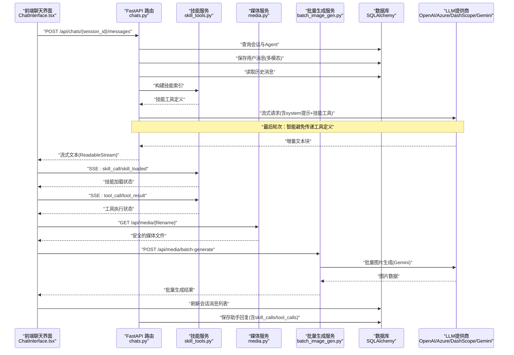

**图表来源**
- [backend/routers/chats.py:470-518](file://backend/routers/chats.py#L470-L518)
- [backend/services/skill_tools.py:36-141](file://backend/services/skill_tools.py#L36-L141)
- [backend/routers/media.py:58-130](file://backend/routers/media.py#L58-L130)
- [backend/services/batch_image_gen.py:113-187](file://backend/services/batch_image_gen.py#L113-L187)
- [backend/admin/src/components/admin/agents/ChatInterface.tsx:280-383](file://backend/admin/src/components/admin/agents/ChatInterface.tsx#L280-L383)

## 详细组件分析

### 聊天路由与流式消息发送
- 会话验证：确保会话存在且关联Agent存在
- 用户消息入库：先保存用户消息，再准备历史上下文
- 多模态内容处理：支持文本和图片混合消息的序列化和反序列化
- 历史准备：按时间升序拼装messages数组，支持system、user、assistant三种角色
- 技能工具集成：构建技能索引和工具定义，支持动态能力扩展
- **聊天路由优化**：在最后轮次智能避免传递工具定义，减少计算开销
- 提供商适配：OpenAI/Azure OpenAI、DashScope、Gemini分别处理流式响应与token统计
- 流式生成器：逐块yield增量文本，最终保存assistant消息并更新会话时间戳
- 多轮执行管理：支持工具调用的多轮处理和实时状态反馈
- **技能调用跟踪**：完整的skill_calls和tool_calls序列化/反序列化机制，支持SSE事件流的实时跟踪

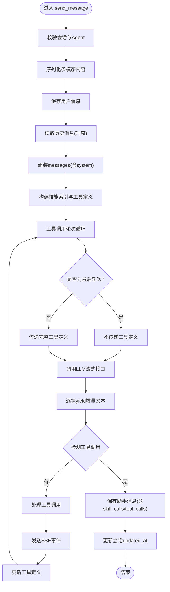

**图表来源**
- [backend/routers/chats.py:470-518](file://backend/routers/chats.py#L470-L518)

**章节来源**
- [backend/routers/chats.py:470-518](file://backend/routers/chats.py#L470-L518)

### 聊天路由优化：最后轮次智能工具定义传递
**更新** 系统现已实现聊天路由逻辑优化，在对话的最后轮次中智能地避免传递工具定义，显著减少计算开销并提高响应速度。

- **优化原理**：在MAX_TOOL_ROUNDS轮次的最后一次迭代中，is_last_round标志为True，此时current_tools被设置为None，从而避免向LLM传递任何工具定义
- **性能收益**：减少最后轮次的API调用开销，因为LLM通常不需要工具定义来完成最终回答
- **逻辑实现**：通过`is_last_round = _round == MAX_TOOL_ROUNDS`判断是否为最后轮次，然后`current_tools = None if is_last_round else tool_defs`智能控制工具定义传递
- **兼容性保证**：此优化不影响工具调用的完整执行流程，仅在最后轮次省略工具定义传递

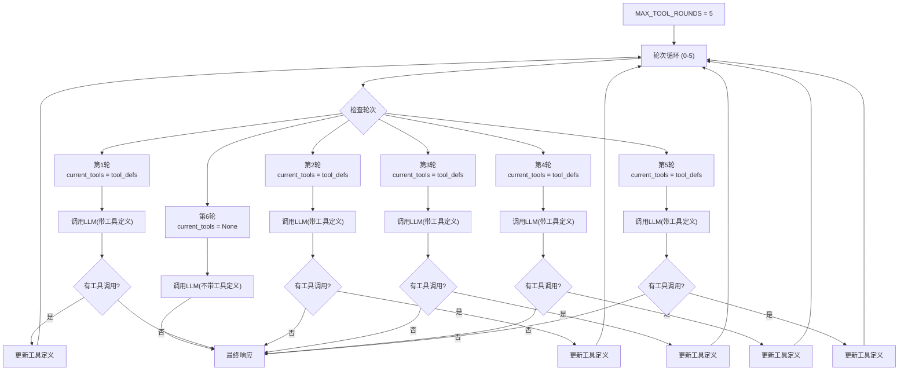

**图表来源**
- [backend/routers/chats.py:485-495](file://backend/routers/chats.py#L485-L495)

**章节来源**
- [backend/routers/chats.py:485-495](file://backend/routers/chats.py#L485-L495)

### 技能驱动架构与工具调用处理
- 技能索引构建：轻量级技能索引，仅包含技能名称和描述
- 技能内容加载：通过load_skill元工具按需加载完整技能内容
- 工具定义生成：为每个可用技能生成对应的工具定义
- 多轮执行管理：支持工具调用的多轮处理，动态更新可用技能列表
- 实时状态反馈：通过SSE事件流提供技能加载和工具执行状态
- 技能同步：支持内置技能和自定义技能的同步与管理
- **技能调用跟踪**：完整的skill_calls序列化/反序列化机制，支持SSE事件流的实时跟踪

**更新** 新增技能驱动架构，通过技能注入服务实现动态能力扩展，支持工具调用的多轮执行和实时状态反馈。新增的技能调用跟踪机制确保所有技能加载过程都得到完整记录和可视化展示。

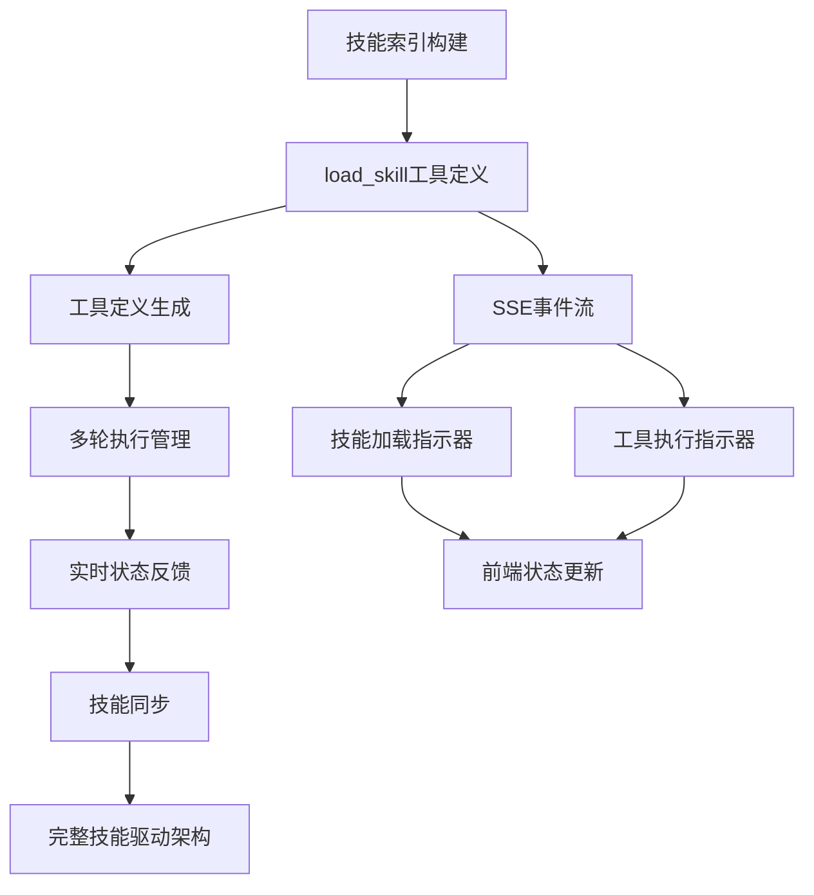

**图表来源**
- [backend/services/skill_tools.py:36-141](file://backend/services/skill_tools.py#L36-L141)
- [backend/routers/chats.py:485-516](file://backend/routers/chats.py#L485-L516)
- [backend/skills_manager.py:180-225](file://backend/skills_manager.py#L180-L225)

**章节来源**
- [backend/services/skill_tools.py:1-142](file://backend/services/skill_tools.py#L1-L142)
- [backend/routers/chats.py:485-516](file://backend/routers/chats.py#L485-L516)
- [backend/skills_manager.py:180-225](file://backend/skills_manager.py#L180-L225)

### 技能管理API与管理员界面
- 技能CRUD操作：支持技能的创建、读取、更新、删除
- 技能状态管理：支持技能的激活和停用状态切换
- 版本控制：支持技能版本管理和差异比较
- 自动启用：创建技能时可自动启用到活动技能目录
- 前端管理界面：提供完整的技能编辑和管理功能
- 安全验证：防止路径遍历和非法文件访问

**更新** 新增完整的技能管理API，支持技能的生命周期管理，包括创建、编辑、激活/停用和版本控制。

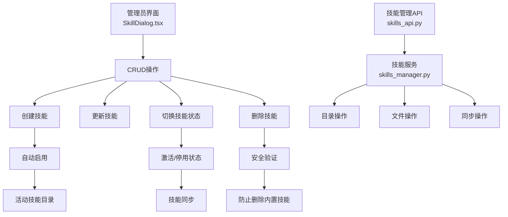

**图表来源**
- [backend/admin/src/app/admin/skills/SkillDialog.tsx:90-119](file://backend/admin/src/app/admin/skills/SkillDialog.tsx#L90-L119)
- [backend/routers/skills_api.py:140-206](file://backend/routers/skills_api.py#L140-L206)
- [backend/skills_manager.py:263-408](file://backend/skills_manager.py#L263-L408)

**章节来源**
- [backend/routers/skills_api.py:1-207](file://backend/routers/skills_api.py#L1-L207)
- [backend/admin/src/app/admin/skills/SkillDialog.tsx:1-235](file://backend/admin/src/app/admin/skills/SkillDialog.tsx#L1-L235)
- [backend/skills_manager.py:263-408](file://backend/skills_manager.py#L263-L408)

### 媒体文件服务与多模态支持
- 媒体路由：提供安全的媒体文件访问，支持PNG、JPG、JPEG、WEBP、GIF格式
- 文件名安全验证：使用正则表达式确保文件名符合UUID格式
- 内联图片处理：支持data URL格式的图片，自动保存为文件并返回访问路径
- 多模态消息：前端可以发送包含图片和文本的混合消息
- 批量图片生成：支持Gemini 3.1的批量图片生成功能，支持并发控制
- Gemini 3.1集成：支持图片生成、思考模式、Google搜索等功能

**更新** 系统仍支持多模态消息（文本和图片）的处理和渲染，包括图片上传、预览和编辑功能。

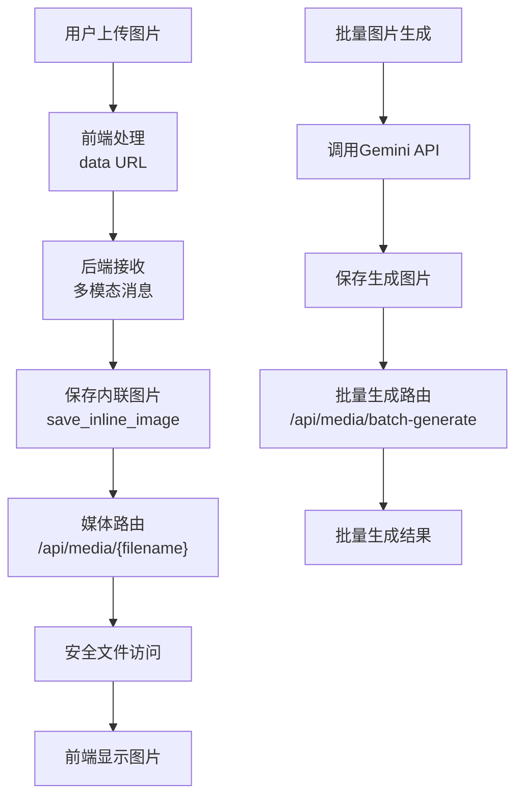

**图表来源**
- [backend/routers/media.py:39-130](file://backend/routers/media.py#L39-L130)
- [backend/services/media_utils.py:20-29](file://backend/services/media_utils.py#L20-L29)
- [backend/services/batch_image_gen.py:113-187](file://backend/services/batch_image_gen.py#L113-L187)
- [backend/services/llm_stream.py:261-292](file://backend/services/llm_stream.py#L261-L292)

**章节来源**
- [backend/routers/media.py:1-130](file://backend/routers/media.py#L1-L130)
- [backend/services/media_utils.py:1-29](file://backend/services/media_utils.py#L1-L29)
- [backend/services/batch_image_gen.py:1-187](file://backend/services/batch_image_gen.py#L1-L187)
- [backend/services/llm_stream.py:261-292](file://backend/services/llm_stream.py#L261-L292)

### 数据模型与关系
- ChatSession：会话表，包含标题、关联Agent
- ChatMessage：消息表，包含会话ID、角色、内容（支持多模态JSON）、时间
- Agent：智能体表，包含模型、温度、上下文窗口、system提示、工具等，支持Gemini 3.1配置
- LLMProvider：提供商表，包含类型、base_url、模型列表、状态等
- CreditTransaction：积分交易表，记录token使用和费用计算
- Skill：技能表，包含技能名称、描述、内容、来源、版本等信息

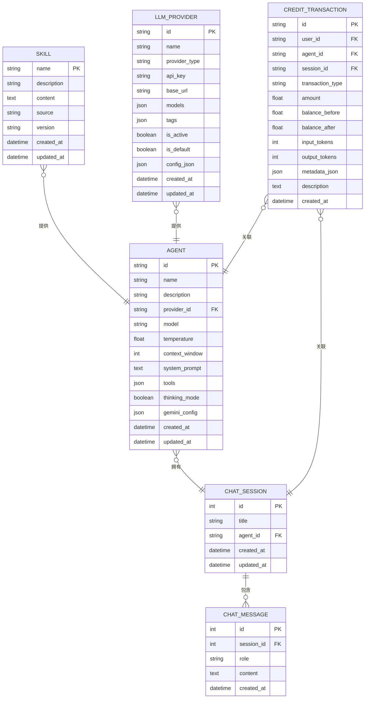

**图表来源**
- [backend/models.py:80-122](file://backend/models.py#L80-L122)

**章节来源**
- [backend/models.py:80-122](file://backend/models.py#L80-L122)

### 数据库与配置
- 异步引擎：SQLite/PostgreSQL可选，连接池与预检
- 会话工厂：AsyncSessionLocal
- 配置项：DATABASE_URL、REDIS_URL、各类API密钥、默认模型

**章节来源**
- [backend/database.py:8-23](file://backend/database.py#L8-L23)
- [backend/config.py:11-29](file://backend/config.py#L11-L29)

### 前端聊天界面与多模态渲染
- 会话列表：通过SWR拉取agent_id过滤的会话
- 消息列表：GET /api/chats/{session_id}/messages
- 发送消息：POST /api/chats/{session_id}/messages，使用fetch的ReadableStream增量解码
- 图片上传：支持多文件选择，预览并转换为data URL
- 多模态渲染：支持纯文本和图片混合消息的渲染
- 实时滚动：消息变更时自动滚动到底部
- 编辑模式：支持基于现有图片进行修改
- 技能加载指示器：实时显示技能加载状态
- 工具执行指示器：实时显示工具执行状态
- **技能调用跟踪**：完整的skill_calls和tool_calls可视化展示

**更新** 系统现已支持技能加载和工具执行的实时状态指示，通过SSE事件流提供可视化反馈。新增的技能调用跟踪机制确保所有技能加载和工具执行过程都得到完整记录和可视化展示。

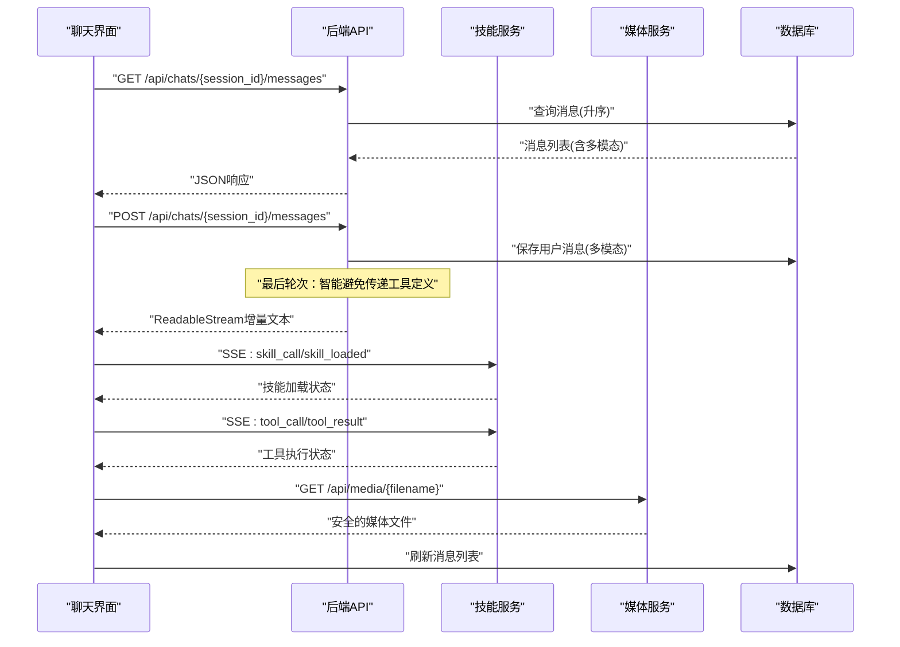

**图表来源**
- [backend/admin/src/components/admin/agents/ChatInterface.tsx:280-383](file://backend/admin/src/components/admin/agents/ChatInterface.tsx#L280-L383)
- [backend/routers/chats.py:63-70](file://backend/routers/chats.py#L63-L70)

**章节来源**
- [backend/admin/src/components/admin/agents/ChatInterface.tsx:280-711](file://backend/admin/src/components/admin/agents/ChatInterface.tsx#L280-L711)
- [backend/routers/chats.py:63-70](file://backend/routers/chats.py#L63-L70)

### WebSocket示例（概念性）
当前聊天API未使用WebSocket推送，而是通过HTTP流式响应实现近实时体验。WebSocket端点已存在，可用于后续扩展（如房间广播、状态通知）。

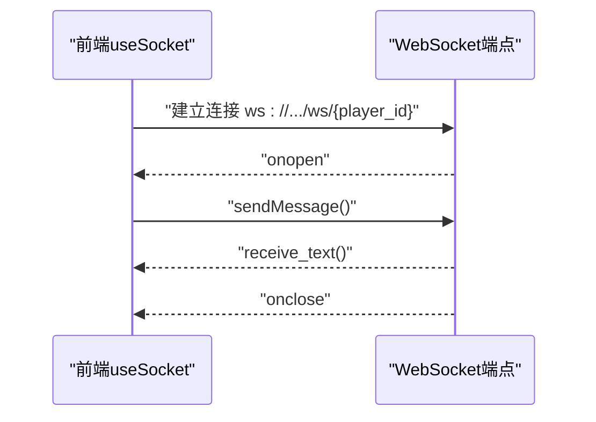

**图表来源**
- [frontend/src/hooks/useSocket.ts:8-33](file://frontend/src/hooks/useSocket.ts#L8-L33)
- [backend/main.py:157-169](file://backend/main.py#L157-L169)

**章节来源**
- [frontend/src/hooks/useSocket.ts:3-42](file://frontend/src/hooks/useSocket.ts#L3-L42)
- [backend/main.py:157-169](file://backend/main.py#L157-L169)

### 技能调用跟踪机制
**新增功能** 系统现在支持完整的技能调用跟踪机制，包括skill_calls和tool_calls的序列化和反序列化：

- **序列化机制**：在保存助手消息时，将技能调用和工具调用信息序列化为JSON格式
- **反序列化机制**：在获取消息列表时，将JSON格式的技能调用和工具调用信息还原为结构化数据
- **SSE事件流**：通过Server-Sent Events实时传输技能加载和工具执行状态
- **前端可视化**：前端组件实时更新技能加载和工具执行的可视化状态

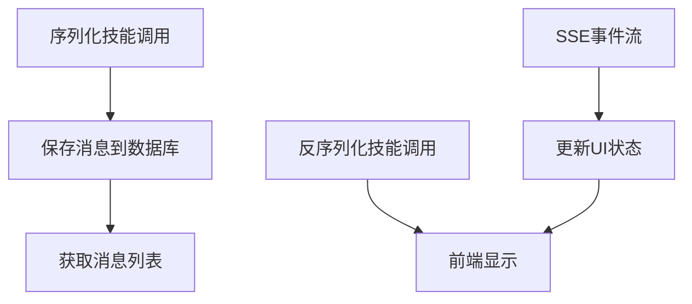

**图表来源**
- [backend/routers/chats.py:158-180](file://backend/routers/chats.py#L158-L180)
- [backend/routers/chats.py:581-590](file://backend/routers/chats.py#L581-L590)

**章节来源**
- [backend/routers/chats.py:158-180](file://backend/routers/chats.py#L158-L180)
- [backend/routers/chats.py:581-590](file://backend/routers/chats.py#L581-L590)

## 依赖关系分析
- 后端依赖：FastAPI、SQLAlchemy异步、Alembic、OpenAI SDK、DashScope SDK、AgentScope、Google Genai等
- 前端依赖：SWR、React、React Markdown、Tailwind UI组件库
- 数据库迁移：通过Alembic管理chat_sessions与chat_messages表
- 媒体处理：依赖Google Genai SDK进行多模态处理和批量图片生成
- 批量生成：支持并发控制和错误处理
- 技能管理：依赖frontmatter库进行技能内容解析和管理
- **技能调用跟踪**：依赖完整的SSE事件流机制和前端解析逻辑
- **聊天路由优化**：依赖智能工具定义传递策略和轮次控制逻辑

**更新** 系统现已集成了技能驱动架构，新增了技能管理相关的依赖和服务。新增的技能调用跟踪机制依赖完整的SSE事件流和前端解析逻辑。**优化后的聊天路由逻辑依赖智能工具定义传递策略。**

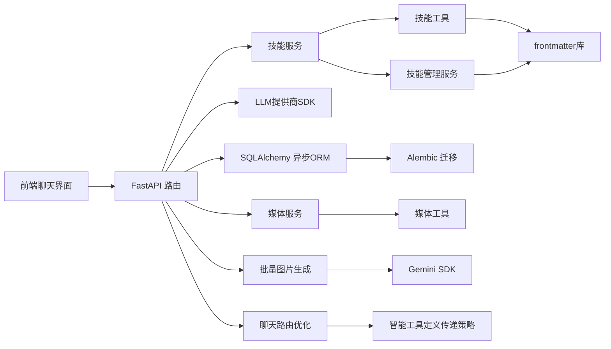

**图表来源**
- [backend/requirements.txt:1-20](file://backend/requirements.txt#L1-L20)
- [backend/admin/src/components/admin/agents/ChatInterface.tsx:1-711](file://backend/admin/src/components/admin/agents/ChatInterface.tsx#L1-L711)
- [backend/routers/chats.py:1-689](file://backend/routers/chats.py#L1-L689)

**章节来源**
- [backend/requirements.txt:1-20](file://backend/requirements.txt#L1-L20)
- [backend/admin/src/components/admin/agents/ChatInterface.tsx:1-711](file://backend/admin/src/components/admin/agents/ChatInterface.tsx#L1-L711)
- [backend/routers/chats.py:1-689](file://backend/routers/chats.py#L1-L689)

## 性能考虑
- 异步I/O：使用async/await与异步数据库连接，避免阻塞
- 连接池：合理设置pool_size与max_overflow，提升并发吞吐
- 流式传输：后端逐块yield，前端增量渲染，降低首屏延迟
- 上下文窗口：Agent的context_window限制历史长度，避免超限
- 缓存与索引：消息表按session_id建立索引，加速查询
- 多模态优化：图片使用data URL格式，避免额外的HTTP请求
- 媒体缓存：媒体文件设置长期缓存头，减少重复访问
- 批量生成优化：使用信号量控制并发数，避免API限制
- 技能索引优化：轻量级技能索引，按需加载完整内容
- SSE事件流：实时状态反馈，避免轮询开销
- 日志级别：生产环境降低SQLAlchemy与uvicorn访问日志级别
- CORS：仅允许必要域名，减少跨域风险
- **聊天路由优化**：智能工具定义传递策略显著减少最后轮次的API调用开销
- **技能调用跟踪优化**：使用高效的JSON序列化/反序列化机制，减少内存占用

**更新** 系统现已考虑技能驱动架构的性能优化，包括轻量级技能索引和按需加载机制。新增的技能调用跟踪机制已优化JSON序列化/反序列化性能。**优化后的聊天路由逻辑通过智能工具定义传递策略显著减少计算开销。**

**章节来源**
- [backend/database.py:8-23](file://backend/database.py#L8-L23)
- [backend/routers/chats.py:129-131](file://backend/routers/chats.py#L129-L131)
- [backend/main.py:20-28](file://backend/main.py#L20-L28)

## 故障排查指南
- 会话不存在：检查session_id是否正确，确认Agent是否存在
- 提供商不可用：确认LLMProvider.is_active为True，API密钥有效
- 流式响应异常：查看后端日志中的错误信息，确认提供商SDK版本兼容性
- 数据库连接失败：检查DATABASE_URL与网络连通性，确认Alembic迁移成功
- 前端无法接收流：确认浏览器支持ReadableStream，检查CORS配置
- 媒体文件访问失败：检查文件名格式是否符合UUID格式，确认文件存在
- 多模态消息错误：检查消息内容格式是否符合多模态规范
- Gemini配置冲突：注意图片生成与思考模式不能同时启用
- 批量生成失败：检查并发数限制，确认Gemini API可用性
- 媒体目录权限：确保媒体目录有写入权限
- 技能加载失败：检查技能文件完整性，确认SKILL.md格式正确
- 工具调用错误：检查工具定义和参数格式，确认提供商支持相应工具
- SSE事件流异常：检查后端SSE事件生成和前端解析逻辑
- 技能同步问题：确认技能目录权限和文件同步状态
- **聊天路由优化问题**：检查轮次控制逻辑，确认最后轮次工具定义传递策略正常工作
- **技能调用跟踪问题**：检查skill_calls和tool_calls的序列化/反序列化逻辑，确认SSE事件流正常工作

**更新** 故障排查指南已扩展至技能驱动架构相关的错误处理，包括技能加载、工具调用和SSE事件流的问题诊断。新增的技能调用跟踪问题排查已包含在内。**新增聊天路由优化相关的问题排查指导。**

**章节来源**
- [backend/routers/chats.py:27-28](file://backend/routers/chats.py#L27-L28)
- [backend/routers/chats.py:109-110](file://backend/routers/chats.py#L109-L110)
- [backend/main.py:85-91](file://backend/main.py#L85-L91)

## 结论
本聊天交互API通过异步流式响应实现了低延迟的实时聊天体验，并新增了强大的技能驱动架构、多模态支持和批量图片生成功能。系统具备良好的扩展性与安全性，支持文本和图片的混合消息处理，以及Gemini 3.1的高级功能。

**更新** 系统现已支持技能驱动的聊天架构，通过技能注入服务实现动态能力扩展，支持工具调用的多轮执行和实时状态反馈，为用户提供更加智能化和可视化的聊天体验。新增的技能调用跟踪机制确保所有技能加载和工具执行过程都得到完整记录和可视化展示。**优化后的聊天路由逻辑通过智能工具定义传递策略显著减少计算开销，提高响应速度。**

未来可在以下方面进一步增强：
- 引入WebSocket用于房间广播与状态通知
- 增加消息内容过滤与安全检查
- 支持分页加载与游标分页
- 引入Redis缓存热点会话
- 增强多租户与权限控制
- 扩展更多多模态媒体类型支持
- 增加图片生成质量控制和审核功能
- 实现技能版本管理和依赖关系追踪
- 增强多轮执行的错误恢复机制
- 扩展更多LLM提供商的工具支持
- **优化技能调用跟踪的性能和可靠性**
- **进一步优化聊天路由的工具定义传递策略**

## 附录

### API定义概览
- 创建会话：POST /api/chats/
- 列出会话：GET /api/chats/?agent_id={id}&skip={n}&limit={m}
- 获取会话：GET /api/chats/{session_id}
- 删除会话：DELETE /api/chats/{session_id}
- 获取消息：GET /api/chats/{session_id}/messages
- 发送消息（流式）：POST /api/chats/{session_id}/messages
- 媒体文件访问：GET /api/media/{filename}
- 批量图片生成：POST /api/media/batch-generate
- 技能列表：GET /api/admin/skills/
- 获取技能详情：GET /api/admin/skills/{skill_name}
- 创建技能：POST /api/admin/skills/
- 更新技能：PUT /api/admin/skills/{skill_name}
- 删除技能：DELETE /api/admin/skills/{skill_name}
- 切换技能状态：POST /api/admin/skills/{skill_name}/toggle

**更新** 系统现已提供完整的技能管理API，支持技能的全生命周期管理。

**章节来源**
- [backend/routers/chats.py:22-689](file://backend/routers/chats.py#L22-L689)
- [backend/routers/media.py:24-130](file://backend/routers/media.py#L24-L130)
- [backend/routers/skills_api.py:123-206](file://backend/routers/skills_api.py#L123-L206)

### 消息格式规范
- 角色限定：user、assistant、system
- 内容字段：字符串或数组，支持多模态消息
- 多模态消息格式：`[{type: "text", text: "..."}, {type: "image_url", image_url: {url: "data:..."}}]`
- 时间字段：created_at（服务端自动生成）
- 技能调用格式：`{"type": "skill_call", "skill_name": "..."}`

**更新** 消息格式规范已扩展至技能调用的支持，包括技能加载和工具执行的状态表示。新增的技能调用跟踪机制确保skill_calls和tool_calls字段得到完整序列化和反序列化。

**章节来源**
- [backend/schemas.py:217-231](file://backend/schemas.py#L217-L231)
- [backend/models.py:90-99](file://backend/models.py#L90-L99)

### 权限与安全
- 输入校验：Pydantic模型限制字段长度与范围
- 角色约束：历史消息角色清洗为合法值
- 上下文窗口：防止过长历史导致超限
- CORS：严格限制允许的源
- 媒体安全：文件名安全验证，仅允许特定扩展名
- 多模态验证：确保消息内容格式正确
- 批量生成安全：限制并发数和请求频率
- 技能安全：防止路径遍历，验证技能文件完整性
- 工具调用安全：验证工具参数和权限控制
- **技能调用跟踪安全**：确保skill_calls和tool_calls数据的完整性和安全性

**更新** 权限与安全检查已扩展至技能驱动架构，包括技能文件的安全验证和工具调用的权限控制。新增的技能调用跟踪机制已包含安全检查。

**章节来源**
- [backend/schemas.py:43-73](file://backend/schemas.py#L43-L73)
- [backend/routers/chats.py:124-127](file://backend/routers/chats.py#L124-L127)
- [backend/main.py:85-91](file://backend/main.py#L85-L91)
- [backend/routers/media.py:11-12](file://backend/routers/media.py#L11-L12)
- [backend/skills_manager.py:370-407](file://backend/skills_manager.py#L370-L407)

### 多模态功能特性
- 图片上传：支持PNG、JPG、JPEG、WEBP、GIF格式
- 内联图片：自动保存data URL格式的图片
- Gemini 3.1集成：支持图片生成、思考模式、Google搜索
- 批量图片生成：支持1-8张图片并行生成，可配置尺寸和比例
- 多模态消息：前后端统一的多模态消息格式
- 媒体缓存：长期缓存策略减少重复访问
- 编辑模式：支持基于现有图片进行修改

**更新** 多模态功能特性保持不变，继续支持文本和图片的处理和渲染。

**章节来源**
- [backend/services/media_utils.py:10-17](file://backend/services/media_utils.py#L10-L17)
- [backend/services/llm_stream.py:322-376](file://backend/services/llm_stream.py#L322-L376)
- [backend/services/batch_image_gen.py:17-37](file://backend/services/batch_image_gen.py#L17-L37)
- [backend/admin/src/components/admin/agents/ChatInterface.tsx:116-149](file://backend/admin/src/components/admin/agents/ChatInterface.tsx#L116-L149)

### 技能驱动架构特性
- 技能索引：轻量级技能索引，仅包含名称和描述
- 动态加载：按需加载完整技能内容，节省token成本
- 工具定义：为每个技能生成对应的工具定义
- 多轮执行：支持工具调用的多轮处理和状态反馈
- 实时指示器：前端显示技能加载和工具执行状态
- 版本管理：支持技能版本控制和差异比较
- 目录管理：支持内置和自定义技能的目录结构
- 文件安全：防止路径遍历，验证文件访问权限
- **技能调用跟踪**：完整的skill_calls序列化/反序列化机制，支持SSE事件流的实时跟踪

**更新** 新增技能驱动架构的完整特性说明，包括技能索引、动态加载、工具定义生成等核心功能。新增的技能调用跟踪机制确保所有技能加载和工具执行过程都得到完整记录和可视化展示。

**章节来源**
- [backend/services/skill_tools.py:1-142](file://backend/services/skill_tools.py#L1-L142)
- [backend/skills_manager.py:1-408](file://backend/skills_manager.py#L1-L408)
- [backend/admin/src/app/admin/skills/SkillDialog.tsx:1-235](file://backend/admin/src/app/admin/skills/SkillDialog.tsx#L1-L235)

### Gemini 3.1配置选项
- 思考模式：high、medium、low、minimal四个级别
- 媒体分辨率：ultra_high、high、medium、low四个级别
- 图片生成：支持aspect_ratio、image_size、output_format配置
- Google搜索：可启用文本搜索和图片搜索功能
- 并发控制：批量生成支持1-8的并发数限制

**更新** Gemini 3.1配置选项保持不变，专注于文本和图片的多模态处理。

**章节来源**
- [backend/schemas.py:170-191](file://backend/schemas.py#L170-L191)
- [backend/models.py:200-201](file://backend/models.py#L200-L201)
- [backend/services/llm_stream.py:225-233](file://backend/services/llm_stream.py#L225-L233)
- [backend/services/batch_image_gen.py:18-26](file://backend/services/batch_image_gen.py#L18-L26)

### 技能调用跟踪技术细节
**新增章节** 系统现在支持完整的技能调用跟踪机制，包括以下技术细节：

- **序列化机制**：在保存助手消息时，将技能调用和工具调用信息序列化为JSON格式，包含技能名称、工具名称、参数和状态信息
- **反序列化机制**：在获取消息列表时，将JSON格式的技能调用和工具调用信息还原为结构化数据，支持前端直接使用
- **SSE事件流**：通过Server-Sent Events实时传输技能加载和工具执行状态，包括skill_call、skill_loaded、tool_call、tool_result等事件类型
- **前端可视化**：前端组件实时更新技能加载和工具执行的可视化状态，包括加载指示器、执行状态和完成状态
- **状态管理**：维护技能调用和工具调用的完整状态链，确保用户能够看到完整的执行过程

**章节来源**
- [backend/routers/chats.py:158-180](file://backend/routers/chats.py#L158-L180)
- [backend/routers/chats.py:581-590](file://backend/routers/chats.py#L581-L590)
- [backend/admin/src/components/admin/agents/ChatInterface.tsx:286-303](file://backend/admin/src/components/admin/agents/ChatInterface.tsx#L286-L303)

### 聊天路由优化技术细节
**新增章节** 系统现已实现聊天路由逻辑优化，在对话的最后轮次中智能避免传递工具定义，具体技术实现如下：

- **轮次控制**：MAX_TOOL_ROUNDS = 5，定义最大工具调用轮次
- **最后轮次检测**：`is_last_round = _round == MAX_TOOL_ROUNDS`判断是否为最后轮次
- **智能工具定义传递**：`current_tools = None if is_last_round else tool_defs`在最后轮次设置为None
- **性能优化效果**：避免最后轮次的工具定义传递，减少API调用开销和计算成本
- **兼容性保证**：不影响工具调用的完整执行流程，仅在最后轮次省略工具定义传递
- **逻辑完整性**：确保工具调用在最后轮次之前已完成，最终响应无需工具定义

**章节来源**
- [backend/routers/chats.py:485-495](file://backend/routers/chats.py#L485-L495)
- [backend/routers/chats.py:493-495](file://backend/routers/chats.py#L493-L495)