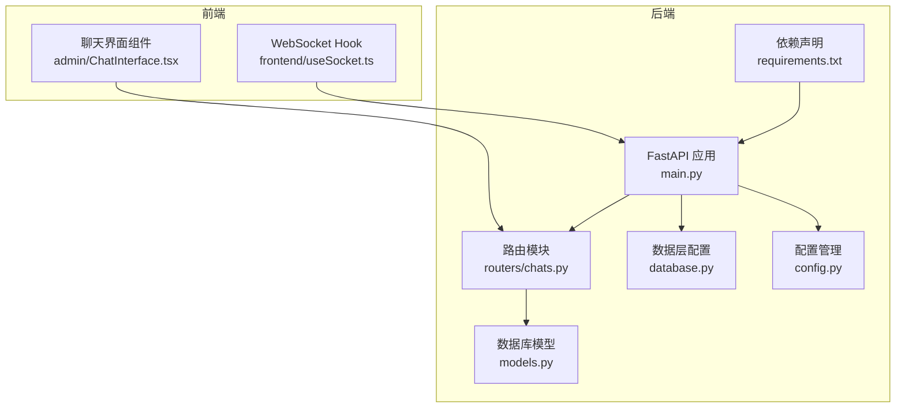
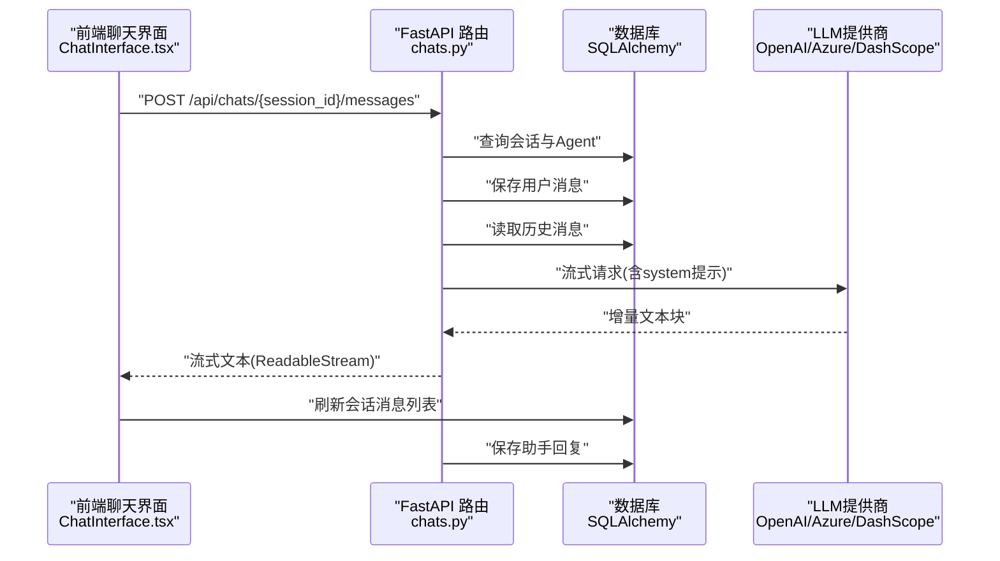
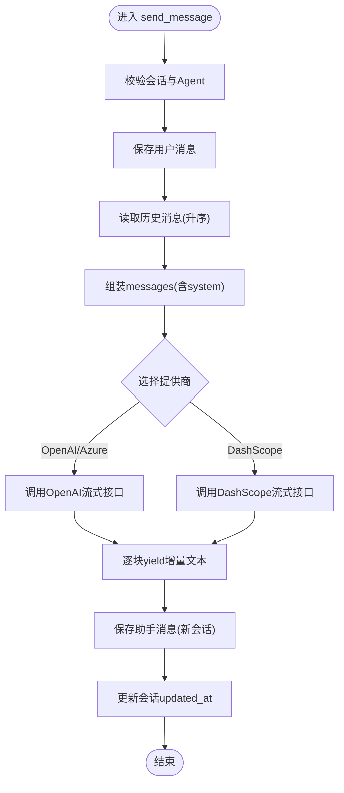
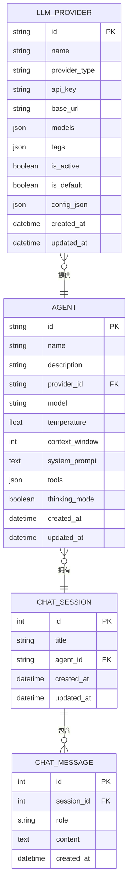
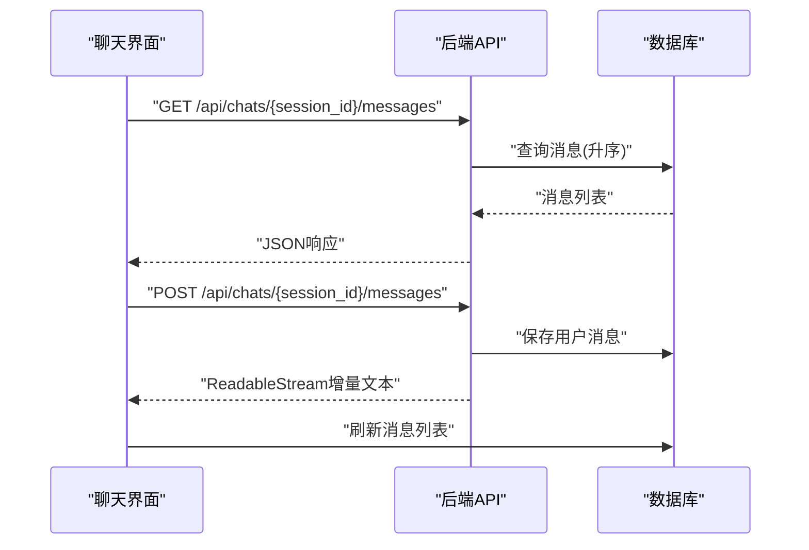
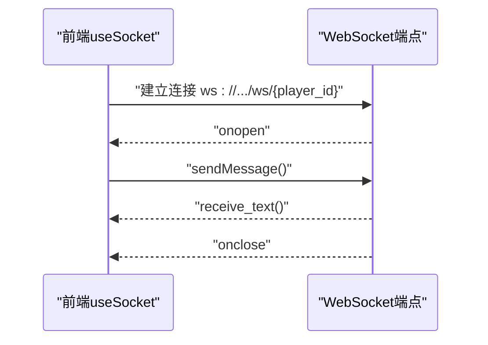
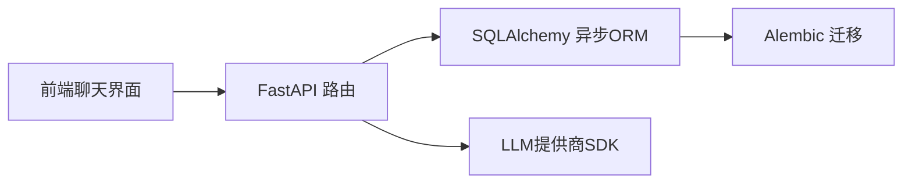

# 聊天交互API

<cite>
**本文档引用的文件**
- [backend/main.py](file://backend/main.py)
- [backend/routers/chats.py](file://backend/routers/chats.py)
- [backend/models.py](file://backend/models.py)
- [backend/schemas.py](file://backend/schemas.py)
- [backend/database.py](file://backend/database.py)
- [backend/config.py](file://backend/config.py)
- [backend/requirements.txt](file://backend/requirements.txt)
- [backend/admin/src/components/admin/agents/ChatInterface.tsx](file://backend/admin/src/components/admin/agents/ChatInterface.tsx)
- [frontend/src/hooks/useSocket.ts](file://frontend/src/hooks/useSocket.ts)
</cite>

## 目录
1. [简介](#简介)
2. [项目结构](#项目结构)
3. [核心组件](#核心组件)
4. [架构总览](#架构总览)
5. [详细组件分析](#详细组件分析)
6. [依赖关系分析](#依赖关系分析)
7. [性能考虑](#性能考虑)
8. [故障排查指南](#故障排查指南)
9. [结论](#结论)
10. [附录](#附录)

## 简介
本项目提供了一个完整的聊天交互API，支持：
- 实时聊天：基于FastAPI的异步流式响应，结合前端fetch的ReadableStream实现边读边渲染
- 聊天室管理：会话创建、列表查询、消息查询与删除
- 多模型提供商：OpenAI、Azure OpenAI、DashScope等
- 安全与合规：输入校验、角色约束、上下文窗口控制
- 历史记录：消息持久化、按会话检索、时间排序

同时，项目还包含一个基础的WebSocket示例端点，用于演示实时通信能力，但当前聊天API主要通过HTTP流式接口提供实时体验。

## 项目结构
后端采用FastAPI + SQLAlchemy异步ORM + Alembic迁移的现代Python架构；前端使用React + SWR进行数据拉取与缓存；管理员界面集成在Next.js中。

图表来源
- [backend/main.py](file://backend/main.py#L83-L97)
- [backend/routers/chats.py](file://backend/routers/chats.py#L1-L275)
- [backend/models.py](file://backend/models.py#L80-L122)
- [backend/database.py](file://backend/database.py#L1-L31)
- [backend/config.py](file://backend/config.py#L1-L34)
- [backend/requirements.txt](file://backend/requirements.txt#L1-L20)
- [backend/admin/src/components/admin/agents/ChatInterface.tsx](file://backend/admin/src/components/admin/agents/ChatInterface.tsx#L1-L297)
- [frontend/src/hooks/useSocket.ts](file://frontend/src/hooks/useSocket.ts#L1-L43)

章节来源
- [backend/main.py](file://backend/main.py#L83-L97)
- [backend/routers/chats.py](file://backend/routers/chats.py#L1-L275)
- [backend/models.py](file://backend/models.py#L80-L122)
- [backend/database.py](file://backend/database.py#L1-L31)
- [backend/config.py](file://backend/config.py#L1-L34)
- [backend/requirements.txt](file://backend/requirements.txt#L1-L20)
- [backend/admin/src/components/admin/agents/ChatInterface.tsx](file://backend/admin/src/components/admin/agents/ChatInterface.tsx#L1-L297)
- [frontend/src/hooks/useSocket.ts](file://frontend/src/hooks/useSocket.ts#L1-L43)

## 核心组件
- 聊天路由：提供会话创建、列表查询、会话详情、消息查询、消息发送（流式）、会话删除
- 数据模型：ChatSession、ChatMessage、Agent、LLMProvider
- 数据库配置：异步引擎、连接池、会话工厂
- 配置管理：数据库URL、Redis、API密钥、默认模型
- 前端聊天界面：会话列表、消息流式渲染、发送消息
- WebSocket示例：基础连接、消息收发、断开处理

章节来源
- [backend/routers/chats.py](file://backend/routers/chats.py#L22-L275)
- [backend/models.py](file://backend/models.py#L80-L122)
- [backend/database.py](file://backend/database.py#L8-L23)
- [backend/config.py](file://backend/config.py#L7-L34)
- [backend/admin/src/components/admin/agents/ChatInterface.tsx](file://backend/admin/src/components/admin/agents/ChatInterface.tsx#L44-L147)
- [frontend/src/hooks/useSocket.ts](file://frontend/src/hooks/useSocket.ts#L3-L42)

## 架构总览
聊天API采用“请求-流式响应”的实时模式，后端根据会话历史与Agent参数调用外部LLM提供商，前端以ReadableStream增量接收文本块并实时更新UI。

图表来源
- [backend/routers/chats.py](file://backend/routers/chats.py#L72-L258)
- [backend/admin/src/components/admin/agents/ChatInterface.tsx](file://backend/admin/src/components/admin/agents/ChatInterface.tsx#L110-L147)

## 详细组件分析

### 聊天路由与流式消息发送
- 会话验证：确保会话存在且关联Agent存在
- 用户消息入库：先保存用户消息，再准备历史上下文
- 历史准备：按时间升序拼装messages数组，支持system、user、assistant三种角色
- 提供商适配：OpenAI/Azure OpenAI、DashScope分别处理流式响应与token统计
- 流式生成器：逐块yield增量文本，最终保存assistant消息并更新会话时间戳

图表来源
- [backend/routers/chats.py](file://backend/routers/chats.py#L72-L258)

章节来源
- [backend/routers/chats.py](file://backend/routers/chats.py#L72-L258)

### 数据模型与关系
- ChatSession：会话表，包含标题、关联Agent
- ChatMessage：消息表，包含会话ID、角色、内容、时间
- Agent：智能体表，包含模型、温度、上下文窗口、system提示、工具等
- LLMProvider：提供商表，包含类型、base_url、模型列表、状态等

图表来源
- [backend/models.py](file://backend/models.py#L80-L122)

章节来源
- [backend/models.py](file://backend/models.py#L80-L122)

### 数据库与配置
- 异步引擎：SQLite/PostgreSQL可选，连接池与预检
- 会话工厂：AsyncSessionLocal
- 配置项：DATABASE_URL、REDIS_URL、各类API密钥、默认模型

章节来源
- [backend/database.py](file://backend/database.py#L8-L23)
- [backend/config.py](file://backend/config.py#L11-L29)

### 前端聊天界面与流式渲染
- 会话列表：通过SWR拉取agent_id过滤的会话
- 消息列表：GET /api/chats/{session_id}/messages
- 发送消息：POST /api/chats/{session_id}/messages，使用fetch的ReadableStream增量解码
- 实时滚动：消息变更时自动滚动到底部

图表来源
- [backend/admin/src/components/admin/agents/ChatInterface.tsx](file://backend/admin/src/components/admin/agents/ChatInterface.tsx#L44-L147)
- [backend/routers/chats.py](file://backend/routers/chats.py#L63-L70)

章节来源
- [backend/admin/src/components/admin/agents/ChatInterface.tsx](file://backend/admin/src/components/admin/agents/ChatInterface.tsx#L44-L147)
- [backend/routers/chats.py](file://backend/routers/chats.py#L63-L70)

### WebSocket示例（概念性）
当前聊天API未使用WebSocket推送，而是通过HTTP流式响应实现近实时体验。WebSocket端点已存在，可用于后续扩展（如房间广播、状态通知）。

图表来源
- [frontend/src/hooks/useSocket.ts](file://frontend/src/hooks/useSocket.ts#L8-L33)
- [backend/main.py](file://backend/main.py#L157-L169)

章节来源
- [frontend/src/hooks/useSocket.ts](file://frontend/src/hooks/useSocket.ts#L3-L42)
- [backend/main.py](file://backend/main.py#L157-L169)

## 依赖关系分析
- 后端依赖：FastAPI、SQLAlchemy异步、Alembic、OpenAI SDK、DashScope SDK、AgentScope等
- 前端依赖：SWR、React、React Markdown、Tailwind UI组件库
- 数据库迁移：通过Alembic管理chat_sessions与chat_messages表

图表来源
- [backend/requirements.txt](file://backend/requirements.txt#L1-L20)
- [backend/admin/src/components/admin/agents/ChatInterface.tsx](file://backend/admin/src/components/admin/agents/ChatInterface.tsx#L1-L297)
- [backend/routers/chats.py](file://backend/routers/chats.py#L1-L275)

章节来源
- [backend/requirements.txt](file://backend/requirements.txt#L1-L20)
- [backend/admin/src/components/admin/agents/ChatInterface.tsx](file://backend/admin/src/components/admin/agents/ChatInterface.tsx#L1-L297)
- [backend/routers/chats.py](file://backend/routers/chats.py#L1-L275)

## 性能考虑
- 异步I/O：使用async/await与异步数据库连接，避免阻塞
- 连接池：合理设置pool_size与max_overflow，提升并发吞吐
- 流式传输：后端逐块yield，前端增量渲染，降低首屏延迟
- 上下文窗口：Agent的context_window限制历史长度，避免超限
- 缓存与索引：消息表按session_id建立索引，加速查询
- 日志级别：生产环境降低SQLAlchemy与uvicorn访问日志级别
- CORS：仅允许必要域名，减少跨域风险

章节来源
- [backend/database.py](file://backend/database.py#L8-L23)
- [backend/routers/chats.py](file://backend/routers/chats.py#L129-L131)
- [backend/main.py](file://backend/main.py#L20-L28)

## 故障排查指南
- 会话不存在：检查session_id是否正确，确认Agent是否存在
- 提供商不可用：确认LLMProvider.is_active为True，API密钥有效
- 流式响应异常：查看后端日志中的错误信息，确认提供商SDK版本兼容性
- 数据库连接失败：检查DATABASE_URL与网络连通性，确认Alembic迁移成功
- 前端无法接收流：确认浏览器支持ReadableStream，检查CORS配置

章节来源
- [backend/routers/chats.py](file://backend/routers/chats.py#L27-L28)
- [backend/routers/chats.py](file://backend/routers/chats.py#L109-L110)
- [backend/main.py](file://backend/main.py#L85-L91)

## 结论
本聊天交互API通过异步流式响应实现了低延迟的实时聊天体验，具备良好的扩展性与安全性。未来可在以下方面进一步增强：
- 引入WebSocket用于房间广播与状态通知
- 增加消息内容过滤与安全检查
- 支持分页加载与游标分页
- 引入Redis缓存热点会话
- 增强多租户与权限控制

## 附录

### API定义概览
- 创建会话：POST /api/chats/
- 列出会话：GET /api/chats/?agent_id={id}&skip={n}&limit={m}
- 获取会话：GET /api/chats/{session_id}
- 删除会话：DELETE /api/chats/{session_id}
- 获取消息：GET /api/chats/{session_id}/messages
- 发送消息（流式）：POST /api/chats/{session_id}/messages

章节来源
- [backend/routers/chats.py](file://backend/routers/chats.py#L22-L275)

### 消息格式规范
- 角色限定：user、assistant、system
- 内容字段：字符串，支持Markdown渲染（前端）
- 时间字段：created_at（服务端自动生成）

章节来源
- [backend/schemas.py](file://backend/schemas.py#L89-L102)
- [backend/models.py](file://backend/models.py#L90-L99)

### 权限与安全
- 输入校验：Pydantic模型限制字段长度与范围
- 角色约束：历史消息角色清洗为合法值
- 上下文窗口：防止过长历史导致超限
- CORS：严格限制允许的源

章节来源
- [backend/schemas.py](file://backend/schemas.py#L43-L73)
- [backend/routers/chats.py](file://backend/routers/chats.py#L124-L127)
- [backend/main.py](file://backend/main.py#L85-L91)