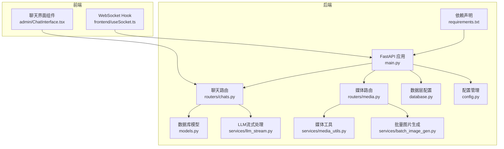
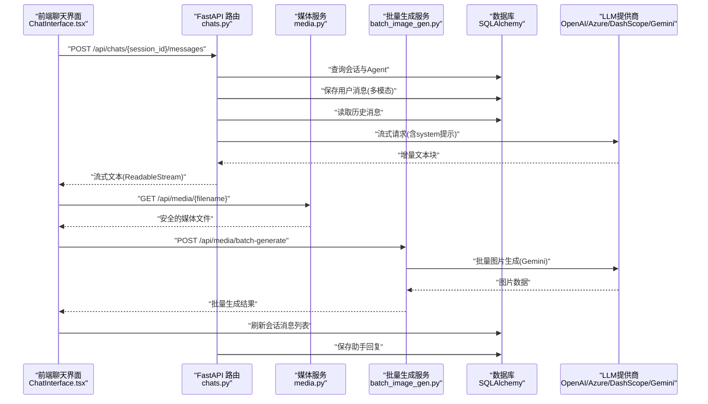
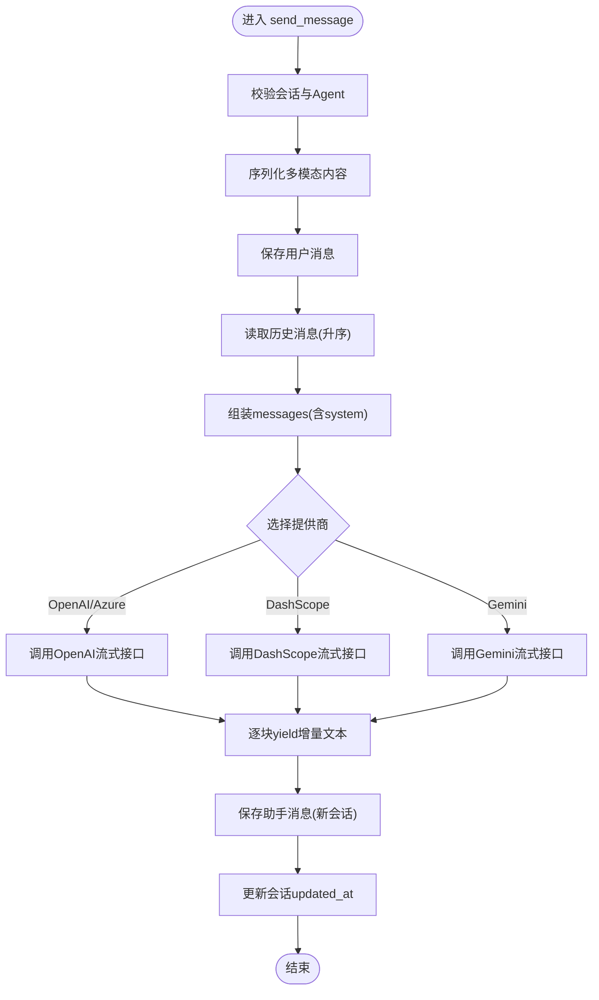
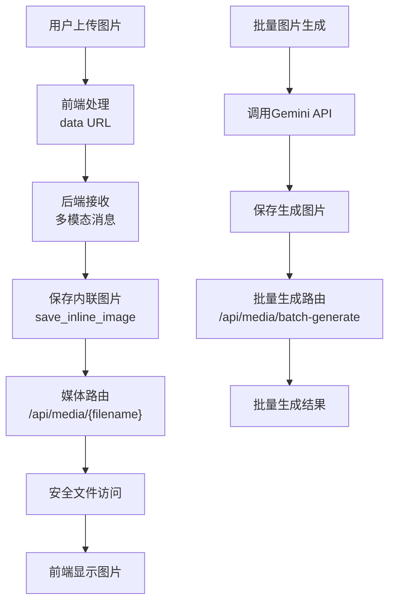
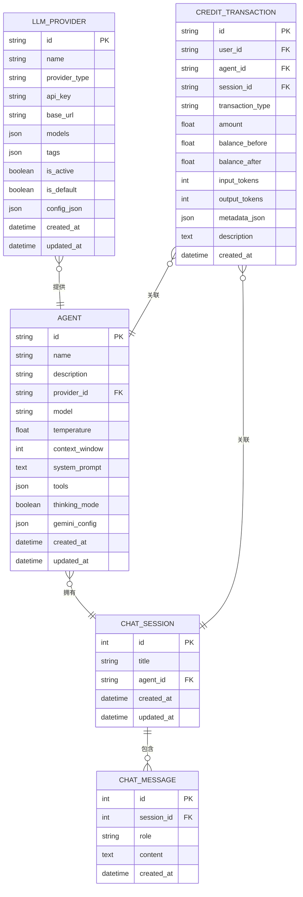
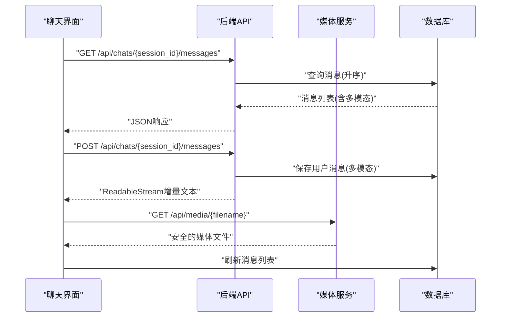
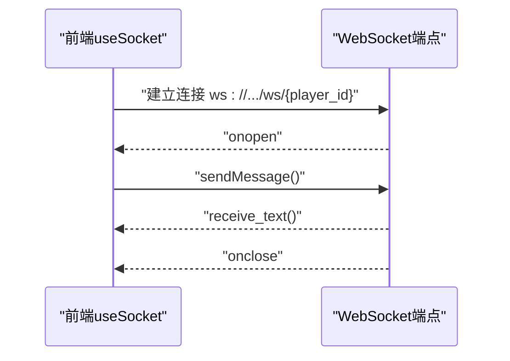
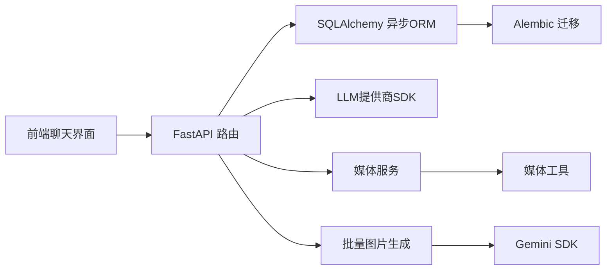

# 聊天交互API

<cite>
**本文档引用的文件**
- [backend/main.py](file://backend/main.py)
- [backend/routers/chats.py](file://backend/routers/chats.py)
- [backend/routers/media.py](file://backend/routers/media.py)
- [backend/models.py](file://backend/models.py)
- [backend/schemas.py](file://backend/schemas.py)
- [backend/database.py](file://backend/database.py)
- [backend/config.py](file://backend/config.py)
- [backend/services/media_utils.py](file://backend/services/media_utils.py)
- [backend/services/llm_stream.py](file://backend/services/llm_stream.py)
- [backend/services/batch_image_gen.py](file://backend/services/batch_image_gen.py)
- [backend/admin/src/components/admin/agents/ChatInterface.tsx](file://backend/admin/src/components/admin/agents/ChatInterface.tsx)
- [frontend/src/hooks/useSocket.ts](file://frontend/src/hooks/useSocket.ts)
</cite>

## 更新摘要
**变更内容**
- 从聊天界面移除视频生成功能，包括视频配置面板、消息解析逻辑、视频任务提交流程和实时状态轮询系统
- 聊天界面现在专注于文本通信，支持多模态消息（文本和图片）
- 移除视频生成相关的API路由、服务和前端组件
- 保持现有的媒体文件服务和批量图片生成功能

## 目录
1. [简介](#简介)
2. [项目结构](#项目结构)
3. [核心组件](#核心组件)
4. [架构总览](#架构总览)
5. [详细组件分析](#详细组件分析)
6. [依赖关系分析](#依赖关系分析)
7. [性能考虑](#性能考虑)
8. [故障排查指南](#故障排查指南)
9. [结论](#结论)
10. [附录](#附录)

## 简介
本项目提供了一个完整的聊天交互API，支持：
- 实时聊天：基于FastAPI的异步流式响应，结合前端fetch的ReadableStream实现边读边渲染
- 聊天室管理：会话创建、列表查询、消息查询与删除
- 多模型提供商：OpenAI、Azure OpenAI、DashScope、Gemini等
- 多模态支持：文本与图片混合消息，Gemini 3.1图片生成功能
- 媒体文件服务：安全的媒体文件存储与访问，支持批量图片生成
- 安全与合规：输入校验、角色约束、上下文窗口控制
- 历史记录：消息持久化、按会话检索、时间排序

**更新** 聊天界面现已专注于文本通信，移除了视频生成功能。系统仍支持多模态消息（文本和图片），并通过HTTP流式接口提供实时体验。

## 项目结构
后端采用FastAPI + SQLAlchemy异步ORM + Alembic迁移的现代Python架构；前端使用React + SWR进行数据拉取与缓存；管理员界面集成在Next.js中。

**图表来源**
- [backend/main.py](file://backend/main.py#L83-L97)
- [backend/routers/chats.py](file://backend/routers/chats.py#L1-L275)
- [backend/routers/media.py](file://backend/routers/media.py#L1-L130)
- [backend/models.py](file://backend/models.py#L80-L122)
- [backend/database.py](file://backend/database.py#L1-L31)
- [backend/config.py](file://backend/config.py#L1-L34)
- [backend/services/media_utils.py](file://backend/services/media_utils.py#L1-L29)
- [backend/services/llm_stream.py](file://backend/services/llm_stream.py#L1-L551)
- [backend/services/batch_image_gen.py](file://backend/services/batch_image_gen.py#L1-L187)
- [backend/admin/src/components/admin/agents/ChatInterface.tsx](file://backend/admin/src/components/admin/agents/ChatInterface.tsx#L1-L637)
- [frontend/src/hooks/useSocket.ts](file://frontend/src/hooks/useSocket.ts#L1-L43)

## 核心组件
- 聊天路由：提供会话创建、列表查询、会话详情、消息查询、消息发送（流式）、会话删除
- 媒体路由：提供安全的媒体文件访问服务，支持批量图片生成
- 数据模型：ChatSession、ChatMessage、Agent、LLMProvider、CreditTransaction
- 数据库配置：异步引擎、连接池、会话工厂
- 配置管理：数据库URL、Redis、API密钥、默认模型
- 媒体工具：内联图片保存、文件名安全验证
- LLM流式处理：多模态消息转换、Gemini 3.1配置支持、多供应商适配
- 批量图片生成：并行图片生成服务，支持Gemini 3.1图片生成功能
- 前端聊天界面：会话列表、消息流式渲染、发送消息、图片上传、多模态渲染
- WebSocket示例：基础连接、消息收发、断开处理

**章节来源**
- [backend/routers/chats.py](file://backend/routers/chats.py#L22-L275)
- [backend/routers/media.py](file://backend/routers/media.py#L1-L130)
- [backend/models.py](file://backend/models.py#L80-L122)
- [backend/database.py](file://backend/database.py#L8-L23)
- [backend/config.py](file://backend/config.py#L7-L34)
- [backend/services/media_utils.py](file://backend/services/media_utils.py#L1-L29)
- [backend/services/llm_stream.py](file://backend/services/llm_stream.py#L271-L320)
- [backend/services/batch_image_gen.py](file://backend/services/batch_image_gen.py#L1-L187)
- [backend/admin/src/components/admin/agents/ChatInterface.tsx](file://backend/admin/src/components/admin/agents/ChatInterface.tsx#L44-L147)
- [frontend/src/hooks/useSocket.ts](file://frontend/src/hooks/useSocket.ts#L3-L42)

## 架构总览
聊天API采用"请求-流式响应"的实时模式，后端根据会话历史与Agent参数调用外部LLM提供商，前端以ReadableStream增量接收文本块并实时更新UI。新增的多模态支持允许用户发送包含图片的消息，系统会将图片转换为Gemini兼容的格式并处理Gemini 3.1的图片生成功能。媒体服务提供安全的文件访问和批量图片生成能力。

**更新** 聊天界面现已专注于文本通信，移除了视频生成功能。系统仍支持多模态消息（文本和图片）的处理和渲染。

**图表来源**
- [backend/routers/chats.py](file://backend/routers/chats.py#L72-L258)
- [backend/routers/media.py](file://backend/routers/media.py#L58-L130)
- [backend/services/batch_image_gen.py](file://backend/services/batch_image_gen.py#L113-L187)
- [backend/admin/src/components/admin/agents/ChatInterface.tsx](file://backend/admin/src/components/admin/agents/ChatInterface.tsx#L110-L147)

## 详细组件分析

### 聊天路由与流式消息发送
- 会话验证：确保会话存在且关联Agent存在
- 用户消息入库：先保存用户消息，再准备历史上下文
- 多模态内容处理：支持文本和图片混合消息的序列化和反序列化
- 历史准备：按时间升序拼装messages数组，支持system、user、assistant三种角色
- 提供商适配：OpenAI/Azure OpenAI、DashScope、Gemini分别处理流式响应与token统计
- 流式生成器：逐块yield增量文本，最终保存assistant消息并更新会话时间戳

**图表来源**
- [backend/routers/chats.py](file://backend/routers/chats.py#L72-L258)

**章节来源**
- [backend/routers/chats.py](file://backend/routers/chats.py#L72-L258)

### 媒体文件服务与多模态支持
- 媒体路由：提供安全的媒体文件访问，支持PNG、JPG、JPEG、WEBP、GIF格式
- 文件名安全验证：使用正则表达式确保文件名符合UUID格式
- 内联图片处理：支持data URL格式的图片，自动保存为文件并返回访问路径
- 多模态消息：前端可以发送包含图片和文本的混合消息
- 批量图片生成：支持Gemini 3.1的批量图片生成功能，支持并发控制
- Gemini 3.1集成：支持图片生成、思考模式、Google搜索等功能

**更新** 聊天界面现已专注于文本通信，移除了视频生成功能。系统仍支持多模态消息（文本和图片）的处理和渲染。

**图表来源**
- [backend/routers/media.py](file://backend/routers/media.py#L39-L130)
- [backend/services/media_utils.py](file://backend/services/media_utils.py#L20-L29)
- [backend/services/batch_image_gen.py](file://backend/services/batch_image_gen.py#L113-L187)
- [backend/services/llm_stream.py](file://backend/services/llm_stream.py#L261-L292)

**章节来源**
- [backend/routers/media.py](file://backend/routers/media.py#L1-L130)
- [backend/services/media_utils.py](file://backend/services/media_utils.py#L1-L29)
- [backend/services/batch_image_gen.py](file://backend/services/batch_image_gen.py#L1-L187)
- [backend/services/llm_stream.py](file://backend/services/llm_stream.py#L261-L292)

### 数据模型与关系
- ChatSession：会话表，包含标题、关联Agent
- ChatMessage：消息表，包含会话ID、角色、内容（支持多模态JSON）、时间
- Agent：智能体表，包含模型、温度、上下文窗口、system提示、工具等，支持Gemini 3.1配置
- LLMProvider：提供商表，包含类型、base_url、模型列表、状态等
- CreditTransaction：积分交易表，记录token使用和费用计算

**图表来源**
- [backend/models.py](file://backend/models.py#L80-L122)

**章节来源**
- [backend/models.py](file://backend/models.py#L80-L122)

### 数据库与配置
- 异步引擎：SQLite/PostgreSQL可选，连接池与预检
- 会话工厂：AsyncSessionLocal
- 配置项：DATABASE_URL、REDIS_URL、各类API密钥、默认模型

**章节来源**
- [backend/database.py](file://backend/database.py#L8-L23)
- [backend/config.py](file://backend/config.py#L11-L29)

### 前端聊天界面与多模态渲染
- 会话列表：通过SWR拉取agent_id过滤的会话
- 消息列表：GET /api/chats/{session_id}/messages
- 发送消息：POST /api/chats/{session_id}/messages，使用fetch的ReadableStream增量解码
- 图片上传：支持多文件选择，预览并转换为data URL
- 多模态渲染：支持纯文本和图片混合消息的渲染
- 实时滚动：消息变更时自动滚动到底部
- 编辑模式：支持基于现有图片进行修改

**更新** 聊天界面现已专注于文本通信，移除了视频生成功能。系统仍支持多模态消息（文本和图片）的处理和渲染，包括图片上传、预览和编辑功能。

**图表来源**
- [backend/admin/src/components/admin/agents/ChatInterface.tsx](file://backend/admin/src/components/admin/agents/ChatInterface.tsx#L44-L147)
- [backend/routers/chats.py](file://backend/routers/chats.py#L63-L70)

**章节来源**
- [backend/admin/src/components/admin/agents/ChatInterface.tsx](file://backend/admin/src/components/admin/agents/ChatInterface.tsx#L44-L147)
- [backend/routers/chats.py](file://backend/routers/chats.py#L63-L70)

### WebSocket示例（概念性）
当前聊天API未使用WebSocket推送，而是通过HTTP流式响应实现近实时体验。WebSocket端点已存在，可用于后续扩展（如房间广播、状态通知）。

**图表来源**
- [frontend/src/hooks/useSocket.ts](file://frontend/src/hooks/useSocket.ts#L8-L33)
- [backend/main.py](file://backend/main.py#L157-L169)

**章节来源**
- [frontend/src/hooks/useSocket.ts](file://frontend/src/hooks/useSocket.ts#L3-L42)
- [backend/main.py](file://backend/main.py#L157-L169)

## 依赖关系分析
- 后端依赖：FastAPI、SQLAlchemy异步、Alembic、OpenAI SDK、DashScope SDK、AgentScope、Google Genai等
- 前端依赖：SWR、React、React Markdown、Tailwind UI组件库
- 数据库迁移：通过Alembic管理chat_sessions与chat_messages表
- 媒体处理：依赖Google Genai SDK进行多模态处理和批量图片生成
- 批量生成：支持并发控制和错误处理

**更新** 聊天界面现已专注于文本通信，移除了视频生成功能相关的依赖。系统仍依赖于媒体处理和批量图片生成功能。

**图表来源**
- [backend/requirements.txt](file://backend/requirements.txt#L1-L20)
- [backend/admin/src/components/admin/agents/ChatInterface.tsx](file://backend/admin/src/components/admin/agents/ChatInterface.tsx#L1-L637)
- [backend/routers/chats.py](file://backend/routers/chats.py#L1-L275)

**章节来源**
- [backend/requirements.txt](file://backend/requirements.txt#L1-L20)
- [backend/admin/src/components/admin/agents/ChatInterface.tsx](file://backend/admin/src/components/admin/agents/ChatInterface.tsx#L1-L637)
- [backend/routers/chats.py](file://backend/routers/chats.py#L1-L275)

## 性能考虑
- 异步I/O：使用async/await与异步数据库连接，避免阻塞
- 连接池：合理设置pool_size与max_overflow，提升并发吞吐
- 流式传输：后端逐块yield，前端增量渲染，降低首屏延迟
- 上下文窗口：Agent的context_window限制历史长度，避免超限
- 缓存与索引：消息表按session_id建立索引，加速查询
- 多模态优化：图片使用data URL格式，避免额外的HTTP请求
- 媒体缓存：媒体文件设置长期缓存头，减少重复访问
- 批量生成优化：使用信号量控制并发数，避免API限制
- 日志级别：生产环境降低SQLAlchemy与uvicorn访问日志级别
- CORS：仅允许必要域名，减少跨域风险

**更新** 聊天界面现已专注于文本通信，移除了视频生成功能。系统仍需考虑多模态消息（文本和图片）的性能优化。

**章节来源**
- [backend/database.py](file://backend/database.py#L8-L23)
- [backend/routers/chats.py](file://backend/routers/chats.py#L129-L131)
- [backend/main.py](file://backend/main.py#L20-L28)

## 故障排查指南
- 会话不存在：检查session_id是否正确，确认Agent是否存在
- 提供商不可用：确认LLMProvider.is_active为True，API密钥有效
- 流式响应异常：查看后端日志中的错误信息，确认提供商SDK版本兼容性
- 数据库连接失败：检查DATABASE_URL与网络连通性，确认Alembic迁移成功
- 前端无法接收流：确认浏览器支持ReadableStream，检查CORS配置
- 媒体文件访问失败：检查文件名格式是否符合UUID格式，确认文件存在
- 多模态消息错误：检查消息内容格式是否符合多模态规范
- Gemini配置冲突：注意图片生成与思考模式不能同时启用
- 批量生成失败：检查并发数限制，确认Gemini API可用性
- 媒体目录权限：确保媒体目录有写入权限

**更新** 聊天界面现已专注于文本通信，移除了视频生成功能。故障排查指南已相应调整，不再涉及视频生成相关的错误。

**章节来源**
- [backend/routers/chats.py](file://backend/routers/chats.py#L27-L28)
- [backend/routers/chats.py](file://backend/routers/chats.py#L109-L110)
- [backend/main.py](file://backend/main.py#L85-L91)

## 结论
本聊天交互API通过异步流式响应实现了低延迟的实时聊天体验，并新增了强大的多模态支持和批量图片生成功能。系统具备良好的扩展性与安全性，支持文本和图片的混合消息处理，以及Gemini 3.1的高级功能。

**更新** 聊天界面现已专注于文本通信，移除了视频生成功能。系统仍支持多模态消息（文本和图片）的处理和渲染，为用户提供简洁高效的聊天体验。

未来可在以下方面进一步增强：
- 引入WebSocket用于房间广播与状态通知
- 增加消息内容过滤与安全检查
- 支持分页加载与游标分页
- 引入Redis缓存热点会话
- 增强多租户与权限控制
- 扩展更多多模态媒体类型支持
- 增加图片生成质量控制和审核功能

## 附录

### API定义概览
- 创建会话：POST /api/chats/
- 列出会话：GET /api/chats/?agent_id={id}&skip={n}&limit={m}
- 获取会话：GET /api/chats/{session_id}
- 删除会话：DELETE /api/chats/{session_id}
- 获取消息：GET /api/chats/{session_id}/messages
- 发送消息（流式）：POST /api/chats/{session_id}/messages
- 媒体文件访问：GET /api/media/{filename}
- 批量图片生成：POST /api/media/batch-generate

**更新** 聊天界面现已专注于文本通信，移除了视频生成功能相关的API。系统仍提供完整的聊天和媒体服务API。

**章节来源**
- [backend/routers/chats.py](file://backend/routers/chats.py#L22-L275)
- [backend/routers/media.py](file://backend/routers/media.py#L24-L130)

### 消息格式规范
- 角色限定：user、assistant、system
- 内容字段：字符串或数组，支持多模态消息
- 多模态消息格式：`[{type: "text", text: "..."}, {type: "image_url", image_url: {url: "data:..."}}]`
- 时间字段：created_at（服务端自动生成）

**更新** 聊天界面现已专注于文本通信，移除了视频生成功能。消息格式规范已相应调整，专注于文本和图片的多模态消息处理。

**章节来源**
- [backend/schemas.py](file://backend/schemas.py#L217-L231)
- [backend/models.py](file://backend/models.py#L90-L99)

### 权限与安全
- 输入校验：Pydantic模型限制字段长度与范围
- 角色约束：历史消息角色清洗为合法值
- 上下文窗口：防止过长历史导致超限
- CORS：严格限制允许的源
- 媒体安全：文件名安全验证，仅允许特定扩展名
- 多模态验证：确保消息内容格式正确
- 批量生成安全：限制并发数和请求频率

**更新** 聊天界面现已专注于文本通信，移除了视频生成功能。权限与安全检查已相应调整，专注于多模态消息（文本和图片）的安全处理。

**章节来源**
- [backend/schemas.py](file://backend/schemas.py#L43-L73)
- [backend/routers/chats.py](file://backend/routers/chats.py#L124-L127)
- [backend/main.py](file://backend/main.py#L85-L91)
- [backend/routers/media.py](file://backend/routers/media.py#L11-L12)

### 多模态功能特性
- 图片上传：支持PNG、JPG、JPEG、WEBP、GIF格式
- 内联图片：自动保存data URL格式的图片
- Gemini 3.1集成：支持图片生成、思考模式、Google搜索
- 批量图片生成：支持1-8张图片并行生成，可配置尺寸和比例
- 多模态消息：前后端统一的多模态消息格式
- 媒体缓存：长期缓存策略减少重复访问
- 编辑模式：支持基于现有图片进行修改

**更新** 聊天界面现已专注于文本通信，移除了视频生成功能。多模态功能特性已相应调整，专注于文本和图片的处理和渲染。

**章节来源**
- [backend/services/media_utils.py](file://backend/services/media_utils.py#L10-L17)
- [backend/services/llm_stream.py](file://backend/services/llm_stream.py#L322-L376)
- [backend/services/batch_image_gen.py](file://backend/services/batch_image_gen.py#L17-L37)
- [backend/admin/src/components/admin/agents/ChatInterface.tsx](file://backend/admin/src/components/admin/agents/ChatInterface.tsx#L116-L149)

### Gemini 3.1配置选项
- 思考模式：high、medium、low、minimal四个级别
- 媒体分辨率：ultra_high、high、medium、low四个级别
- 图片生成：支持aspect_ratio、image_size、output_format配置
- Google搜索：可启用文本搜索和图片搜索功能
- 并发控制：批量生成支持1-8的并发数限制

**更新** 聊天界面现已专注于文本通信，移除了视频生成功能。Gemini 3.1配置选项已相应调整，专注于文本和图片的多模态处理。

**章节来源**
- [backend/schemas.py](file://backend/schemas.py#L170-L191)
- [backend/models.py](file://backend/models.py#L200-L201)
- [backend/services/llm_stream.py](file://backend/services/llm_stream.py#L225-L233)
- [backend/services/batch_image_gen.py](file://backend/services/batch_image_gen.py#L18-L26)