# 聊天交互API

<cite>
**本文档引用的文件**
- [backend/main.py](file://backend/main.py)
- [backend/routers/chats.py](file://backend/routers/chats.py)
- [backend/routers/orchestrate.py](file://backend/routers/orchestrate.py)
- [backend/routers/media.py](file://backend/routers/media.py)
- [backend/routers/skills_api.py](file://backend/routers/skills_api.py)
- [backend/models.py](file://backend/models.py)
- [backend/schemas.py](file://backend/schemas.py)
- [backend/database.py](file://backend/database.py)
- [backend/config.py](file://backend/config.py)
- [backend/services/media_utils.py](file://backend/services/media_utils.py)
- [backend/services/llm_stream.py](file://backend/services/llm_stream.py)
- [backend/services/batch_image_gen.py](file://backend/services/batch_image_gen.py)
- [backend/services/skill_tools.py](file://backend/services/skill_tools.py)
- [backend/services/canvas_tools.py](file://backend/services/canvas_tools.py)
- [backend/services/orchestrator.py](file://backend/services/orchestrator.py)
- [backend/skills_manager.py](file://backend/skills_manager.py)
- [backend/admin/src/components/admin/agents/ChatInterface.tsx](file://backend/admin/src/components/admin/agents/ChatInterface.tsx)
- [backend/admin/src/app/admin/skills/SkillDialog.tsx](file://backend/admin/src/app/admin/skills/SkillDialog.tsx)
- [frontend/src/hooks/useSocket.ts](file://frontend/src/hooks/useSocket.ts)
- [frontend/src/components/canvas/AIAssistantPanel.tsx](file://frontend/src/components/canvas/AIAssistantPanel.tsx)
- [frontend/src/store/useCanvasStore.ts](file://frontend/src/store/useCanvasStore.ts)
</cite>

## 更新摘要
**变更内容**
- 新增会话消息清除端点：`DELETE /api/chats/{session_id}/messages`，支持清空会话消息记录
- 增强SSE事件支持：新增`canvas_updated`事件类型，用于画布工具执行后的实时刷新
- 完善画布工具集成：支持完整的画布节点CRUD操作，包括自动位置计算和边缘处理
- 多智能体协作API：新增`/api/orchestrate`路由，支持多智能体任务编排和实时进度监控
- Leader多智能体模式：在聊天路由中集成Leader智能体协作，支持管道、计划和讨论三种协作策略
- 增强的实时状态反馈：通过SSE事件流提供完整的多智能体协作状态

## 目录
1. [简介](#简介)
2. [项目结构](#项目结构)
3. [核心组件](#核心组件)
4. [架构总览](#架构总览)
5. [详细组件分析](#详细组件分析)
6. [依赖关系分析](#依赖关系分析)
7. [性能考虑](#性能考虑)
8. [故障排查指南](#故障排查指南)
9. [结论](#结论)
10. [附录](#附录)

## 简介
本项目提供了一个完整的聊天交互API，支持：
- 实时聊天：基于FastAPI的异步流式响应，结合前端fetch的ReadableStream实现边读边渲染
- 聊天室管理：会话创建、列表查询、消息查询与删除
- 多模型提供商：OpenAI、Azure OpenAI、DashScope、Gemini等
- 多模态支持：文本与图片混合消息，Gemini 3.1图片生动生成
- 媒体文件服务：安全的媒体文件存储与访问，支持批量图片生成
- 技能驱动架构：基于技能注入的服务，支持工具调用和多轮执行管理
- 实时状态指示：技能加载和工具执行的可视化反馈
- 安全与合规：输入校验、角色约束、上下文窗口控制
- 历史记录：消息持久化、按会话检索、时间排序
- **会话消息清除**：支持清空会话消息记录，保留会话本身
- **多智能体协作**：支持Leader多智能体模式，提供管道、计划和讨论三种协作策略
- **增强SSE事件**：完整的Server-Sent Events机制，支持canvas_updated事件实现画布实时同步

**更新** 系统现已支持会话消息清除功能、多智能体协作API和增强的SSE事件支持。新增的会话消息清除端点允许用户清空会话的历史消息记录，同时保留会话本身。多智能体协作API提供了完整的任务编排能力，支持Leader智能体协调多个成员智能体的协作。

## 项目结构
后端采用FastAPI + SQLAlchemy异步ORM + Alembic迁移的现代Python架构；前端使用React + SWR进行数据拉取与缓存；管理员界面集成在Next.js中。

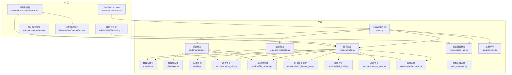

**图表来源**
- [backend/main.py:83-97](file://backend/main.py#L83-L97)
- [backend/routers/chats.py:1-757](file://backend/routers/chats.py#L1-L757)
- [backend/routers/orchestrate.py:1-184](file://backend/routers/orchestrate.py#L1-L184)
- [backend/routers/media.py:1-130](file://backend/routers/media.py#L1-L130)
- [backend/routers/skills_api.py:1-207](file://backend/routers/skills_api.py#L1-L207)
- [backend/services/skill_tools.py:1-142](file://backend/services/skill_tools.py#L1-L142)
- [backend/services/canvas_tools.py:1-481](file://backend/services/canvas_tools.py#L1-L481)
- [backend/services/orchestrator.py:1-890](file://backend/services/orchestrator.py#L1-L890)
- [backend/skills_manager.py:1-408](file://backend/skills_manager.py#L1-L408)
- [backend/admin/src/components/admin/agents/ChatInterface.tsx:1-711](file://backend/admin/src/components/admin/agents/ChatInterface.tsx#L1-L711)
- [backend/admin/src/app/admin/skills/SkillDialog.tsx:1-235](file://backend/admin/src/app/admin/skills/SkillDialog.tsx#L1-L235)

## 核心组件
- 聊天路由：提供会话创建、列表查询、会话详情、消息查询、消息发送（流式）、会话删除、**消息清除**
- 编排路由：提供多智能体协作任务的创建、查询、取消和实时进度监控
- 媒体路由：提供安全的媒体文件访问服务，支持批量图片生成
- 技能管理路由：提供技能的CRUD操作、状态管理和版本控制
- 画布工具服务：提供完整的画布节点CRUD操作，支持自动位置计算和边缘处理
- 多智能体编排服务：实现Leader多智能体协作，支持管道、计划和讨论三种策略
- 数据模型：ChatSession、ChatMessage、Agent、LLMProvider、CreditTransaction、TheaterNode、TheaterEdge、**TaskExecution、SubTask**
- 数据库配置：异步引擎、连接池、会话工厂
- 配置管理：数据库URL、Redis、API密钥、默认模型
- 媒体工具：内联图片保存、文件名安全验证
- LLM流式处理：多模态消息转换、Gemini 3.1配置支持、多供应商适配
- 批量图片生成：并行图片生成服务，支持Gemini 3.1图片生成功能
- 技能工具：技能索引构建、技能内容加载、工具定义生成
- 技能管理服务：技能同步、目录管理、文件操作
- 前端聊天界面：会话列表、消息流式渲染、发送消息、图片上传、多模态渲染
- 管理员技能对话框：技能创建、编辑、版本管理
- WebSocket示例：基础连接、消息收发、断开处理
- **增强SSE事件支持**：完整的Server-Sent Events机制，支持text、skill_call、skill_loaded、tool_call、tool_result、canvas_updated、**subtask_*等多种事件类型
- **多智能体协作API**：完整的多智能体任务编排和实时监控能力

**章节来源**
- [backend/routers/chats.py:22-757](file://backend/routers/chats.py#L22-L757)
- [backend/routers/orchestrate.py:1-184](file://backend/routers/orchestrate.py#L1-L184)
- [backend/routers/media.py:1-130](file://backend/routers/media.py#L1-L130)
- [backend/routers/skills_api.py:1-207](file://backend/routers/skills_api.py#L1-L207)
- [backend/services/skill_tools.py:1-142](file://backend/services/skill_tools.py#L1-L142)
- [backend/services/canvas_tools.py:1-481](file://backend/services/canvas_tools.py#L1-L481)
- [backend/services/orchestrator.py:1-890](file://backend/services/orchestrator.py#L1-L890)
- [backend/skills_manager.py:263-408](file://backend/skills_manager.py#L263-L408)
- [backend/admin/src/components/admin/agents/ChatInterface.tsx:280-711](file://backend/admin/src/components/admin/agents/ChatInterface.tsx#L280-L711)
- [backend/admin/src/app/admin/skills/SkillDialog.tsx:1-235](file://backend/admin/src/app/admin/skills/SkillDialog.tsx#L1-L235)

## 架构总览
聊天API采用"请求-流式响应"的实时模式，后端根据会话历史与Agent参数调用外部LLM提供商，前端以ReadableStream增量接收文本块并实时更新UI。新增的会话消息清除功能允许用户清空历史消息记录。多智能体协作通过编排服务实现，支持Leader智能体协调多个成员智能体的协作。SSE事件支持提供完整的实时状态反馈机制，包括技能加载状态、工具执行状态、画布更新通知和多智能体协作进度。媒体服务提供安全的文件访问和批量图片生成能力。

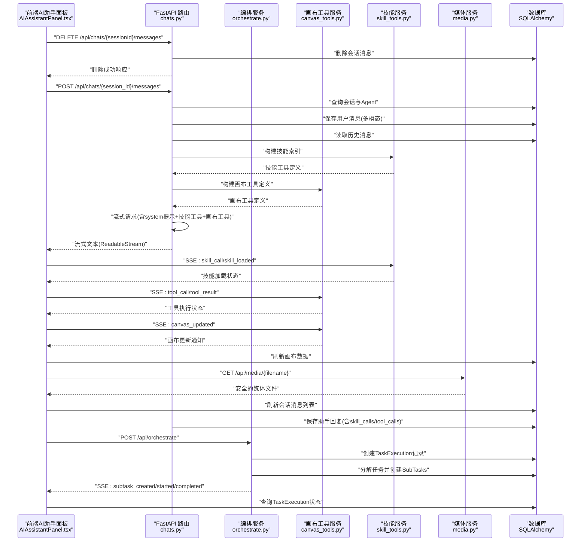

**图表来源**
- [backend/routers/chats.py:715-736](file://backend/routers/chats.py#L715-L736)
- [backend/routers/chats.py:470-518](file://backend/routers/chats.py#L470-L518)
- [backend/routers/orchestrate.py:26-71](file://backend/routers/orchestrate.py#L26-L71)
- [backend/services/skill_tools.py:36-141](file://backend/services/skill_tools.py#L36-L141)
- [backend/services/canvas_tools.py:42-171](file://backend/services/canvas_tools.py#L42-L171)
- [backend/routers/media.py:58-130](file://backend/routers/media.py#L58-L130)
- [backend/admin/src/components/admin/agents/ChatInterface.tsx:280-383](file://backend/admin/src/components/admin/agents/ChatInterface.tsx#L280-L383)

## 详细组件分析

### 会话消息清除功能
**新增章节** 系统现已支持会话消息清除功能：

- **端点定义**：`DELETE /api/chats/{session_id}/messages`，用于清空指定会话的所有消息记录
- **权限验证**：确保会话存在且属于当前用户，防止越权操作
- **数据库操作**：使用SQLAlchemy的delete语句批量删除会话消息
- **响应信息**：返回删除成功消息和删除的消息数量统计
- **前端集成**：AI助手面板提供清空对话按钮，调用后端API并清空前端显示

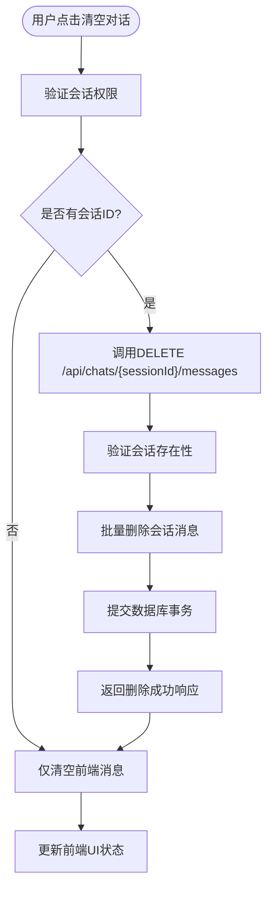

**图表来源**
- [backend/routers/chats.py:715-736](file://backend/routers/chats.py#L715-L736)
- [frontend/src/components/canvas/AIAssistantPanel.tsx:208-228](file://frontend/src/components/canvas/AIAssistantPanel.tsx#L208-L228)

**章节来源**
- [backend/routers/chats.py:715-736](file://backend/routers/chats.py#L715-L736)
- [frontend/src/components/canvas/AIAssistantPanel.tsx:208-228](file://frontend/src/components/canvas/AIAssistantPanel.tsx#L208-L228)

### 多智能体协作API
**新增章节** 系统现已提供完整的多智能体协作API：

- **编排路由**：`/api/orchestrate`，提供多智能体任务编排的完整REST API
- **任务执行**：支持创建多智能体任务执行，返回SSE流式响应
- **任务查询**：支持查询单个任务执行详情和任务执行列表
- **任务取消**：支持取消运行中的任务执行
- **实时进度**：通过SSE事件流提供任务执行的实时进度监控
- **策略支持**：支持管道、计划和讨论三种协作策略
- **子任务管理**：自动创建和管理子任务，支持并行和串行执行

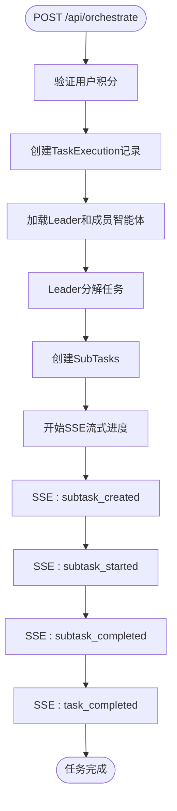

**图表来源**
- [backend/routers/orchestrate.py:26-71](file://backend/routers/orchestrate.py#L26-L71)
- [backend/services/orchestrator.py:581-619](file://backend/services/orchestrator.py#L581-L619)

**章节来源**
- [backend/routers/orchestrate.py:1-184](file://backend/routers/orchestrate.py#L1-L184)
- [backend/services/orchestrator.py:1-890](file://backend/services/orchestrator.py#L1-L890)

### 增强的SSE事件支持
**更新** 系统现已提供增强的SSE事件支持机制：

- **事件类型扩展**：支持text、skill_call、skill_loaded、tool_call、tool_result、canvas_updated、**subtask_*等多种事件类型
- **事件发送机制**：在工具调用开始和结束时发送对应事件，画布工具执行后发送canvas_updated事件，多智能体任务执行过程中发送subtask_*系列事件
- **事件格式**：每条事件包含事件类型和数据负载，前端通过parseSSELine解析
- **前端事件处理**：AI助手面板监听所有事件类型，提供相应的UI更新逻辑
- **错误处理**：支持error事件，向前端报告生成过程中的错误
- **完成标记**：使用done事件标记流式响应的结束
- **条件刷新**：仅当当前活跃的theater_id匹配时才刷新画布

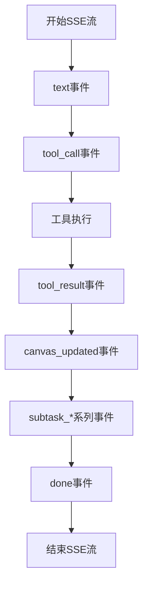

**图表来源**
- [backend/routers/chats.py:523-524](file://backend/routers/chats.py#L523-L524)
- [backend/routers/chats.py:549-560](file://backend/routers/chats.py#L549-L560)
- [backend/routers/chats.py:574-583](file://backend/routers/chats.py#L574-L583)
- [backend/routers/chats.py:585-593](file://backend/routers/chats.py#L585-L593)
- [backend/routers/orchestrate.py:58-61](file://backend/routers/orchestrate.py#L58-61)

**章节来源**
- [backend/routers/chats.py:523-524](file://backend/routers/chats.py#L523-L524)
- [backend/routers/chats.py:549-560](file://backend/routers/chats.py#L549-L560)
- [backend/routers/chats.py:574-583](file://backend/routers/chats.py#L574-L583)
- [backend/routers/chats.py:585-593](file://backend/routers/chats.py#L585-L593)
- [backend/routers/orchestrate.py:58-61](file://backend/routers/orchestrate.py#L58-61)

### 多智能体协作模式
**新增章节** 系统现已支持Leader多智能体协作模式：

- **Leader配置**：Agent模型新增`is_leader`、`coordination_modes`、`member_agent_ids`、`max_subtasks`、`enable_auto_review`等字段
- **策略选择**：支持pipeline（管道）、plan（计划）、discussion（讨论）三种协作策略
- **任务分解**：Leader智能体负责任务分解和成员分配
- **子任务管理**：自动创建和管理子任务，支持并行和串行执行
- **进度监控**：通过SSE事件流提供实时进度监控
- **结果汇总**：自动汇总各成员的结果，生成最终输出

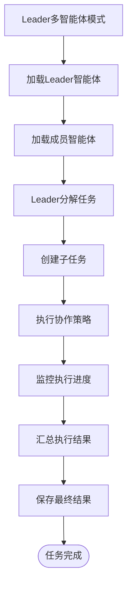

**图表来源**
- [backend/routers/chats.py:241-323](file://backend/routers/chats.py#L241-L323)
- [backend/models.py:231-245](file://backend/models.py#L231-L245)

**章节来源**
- [backend/routers/chats.py:241-323](file://backend/routers/chats.py#L241-L323)
- [backend/models.py:231-245](file://backend/models.py#L231-L245)

### 画布工具集成与SSE事件支持
**更新** 系统现已集成完整的画布工具支持和SSE事件机制：

- **画布工具定义**：在聊天路由中构建画布工具定义，支持五种基本操作
- **工具执行**：通过execute_canvas_tool函数执行画布操作，支持自动位置计算
- **SSE事件发送**：在工具执行完成后发送canvas_updated事件，通知前端刷新画布
- **前端事件处理**：AI助手面板监听canvas_updated事件，自动重新加载画布数据
- **权限控制**：仅当theater_id和agent.target_node_types存在时才启用画布工具
- **边缘处理**：删除节点时自动删除关联的边，保持数据一致性

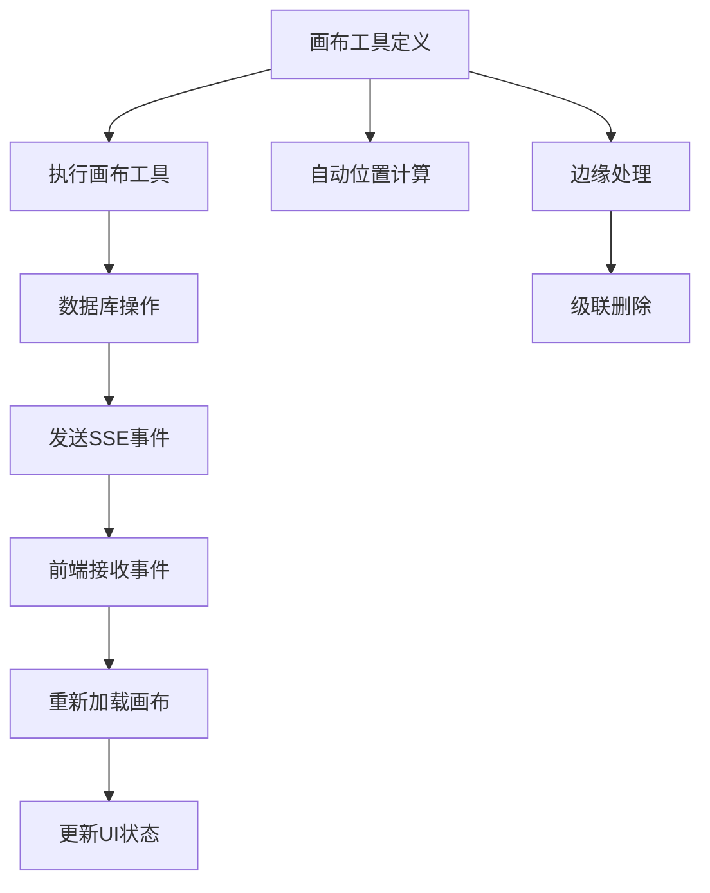

**图表来源**
- [backend/routers/chats.py:325-332](file://backend/routers/chats.py#L325-L332)
- [backend/routers/chats.py:585-593](file://backend/routers/chats.py#L585-L593)
- [backend/services/canvas_tools.py:42-171](file://backend/services/canvas_tools.py#L42-L171)

**章节来源**
- [backend/routers/chats.py:325-332](file://backend/routers/chats.py#L325-L332)
- [backend/routers/chats.py:585-593](file://backend/routers/chats.py#L585-L593)
- [backend/services/canvas_tools.py:42-171](file://backend/services/canvas_tools.py#L42-L171)

### 画布工具服务实现
**新增章节** 画布工具服务提供完整的画布节点CRUD操作：

- **工具定义**：生成五种标准画布工具定义，支持节点类型枚举限制
- **执行函数**：实现list_canvas_nodes、get_canvas_node、create_canvas_node、update_canvas_node、delete_canvas_node等操作
- **自动位置**：create_canvas_node支持自动位置计算，新节点位于现有节点右侧
- **权限验证**：确保节点类型在agent.target_node_types范围内
- **边缘处理**：delete_canvas_node自动删除关联的边，保持图结构完整性
- **结果序列化**：统一使用JSON序列化返回结果，支持错误处理

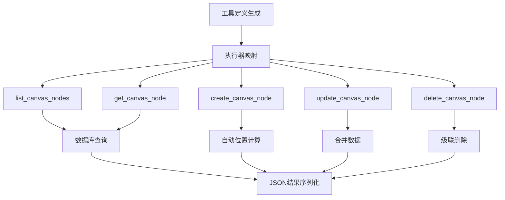

**图表来源**
- [backend/services/canvas_tools.py:42-171](file://backend/services/canvas_tools.py#L42-L171)
- [backend/services/canvas_tools.py:227-481](file://backend/services/canvas_tools.py#L227-L481)

**章节来源**
- [backend/services/canvas_tools.py:42-171](file://backend/services/canvas_tools.py#L42-L171)
- [backend/services/canvas_tools.py:227-481](file://backend/services/canvas_tools.py#L227-L481)

### 前端SSE事件处理
**更新** 系统现已支持完整的SSE事件处理机制：

- **事件解析**：parseSSELine函数解析SSE行格式，提取事件类型和数据
- **事件处理**：handleSSEEvent函数根据事件类型调用相应的处理器
- **画布更新**：canvas_updated事件触发useCanvasStore.loadTheater，重新加载画布数据
- **多智能体事件**：新增subtask_*系列事件处理，支持多智能体协作进度监控
- **状态更新**：text事件更新AI消息内容，done事件标记生成完成，error事件显示错误信息
- **条件刷新**：仅当当前活跃的theater_id匹配时才刷新画布，避免不必要的数据加载

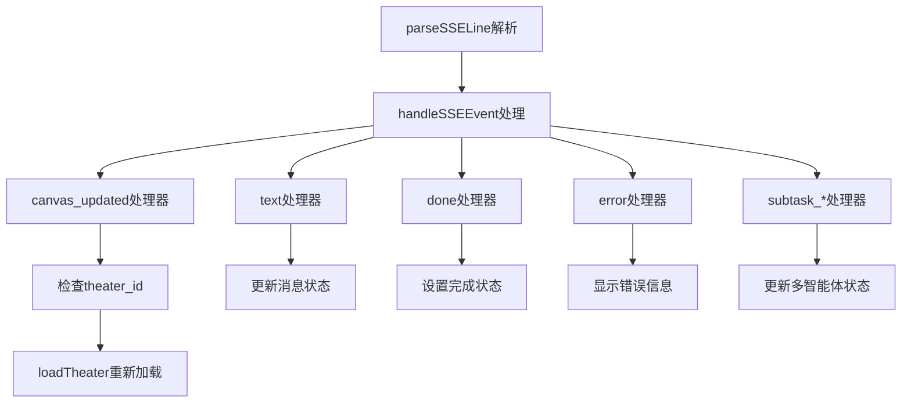

**图表来源**
- [frontend/src/components/canvas/AIAssistantPanel.tsx:86-93](file://frontend/src/components/canvas/AIAssistantPanel.tsx#L86-L93)
- [frontend/src/components/canvas/AIAssistantPanel.tsx:95-129](file://frontend/src/components/canvas/AIAssistantPanel.tsx#L95-L129)
- [frontend/src/components/canvas/AIAssistantPanel.tsx:448-455](file://frontend/src/components/canvas/AIAssistantPanel.tsx#L448-L455)
- [frontend/src/components/canvas/AIAssistantPanel.tsx:271-469](file://frontend/src/components/canvas/AIAssistantPanel.tsx#L271-L469)

**章节来源**
- [frontend/src/components/canvas/AIAssistantPanel.tsx:86-93](file://frontend/src/components/canvas/AIAssistantPanel.tsx#L86-L93)
- [frontend/src/components/canvas/AIAssistantPanel.tsx:95-129](file://frontend/src/components/canvas/AIAssistantPanel.tsx#L95-L129)
- [frontend/src/components/canvas/AIAssistantPanel.tsx:448-455](file://frontend/src/components/canvas/AIAssistantPanel.tsx#L448-L455)
- [frontend/src/components/canvas/AIAssistantPanel.tsx:271-469](file://frontend/src/components/canvas/AIAssistantPanel.tsx#L271-L469)

### 技能驱动架构与工具调用处理
- 技能索引构建：轻量级技能索引，仅包含技能名称和描述
- 技能内容加载：通过load_skill元工具按需加载完整技能内容
- 工具定义生成：为每个可用技能生成对应的工具定义
- 多轮执行管理：支持工具调用的多轮处理，动态更新可用技能列表
- 实时状态反馈：通过SSE事件流提供技能加载和工具执行状态
- 技能同步：支持内置技能和自定义技能的同步与管理

**更新** 新增画布工具集成，通过build_canvas_tool_defs函数生成画布工具定义，支持list_canvas_nodes、get_canvas_node、create_canvas_node、update_canvas_node、delete_canvas_node等操作。

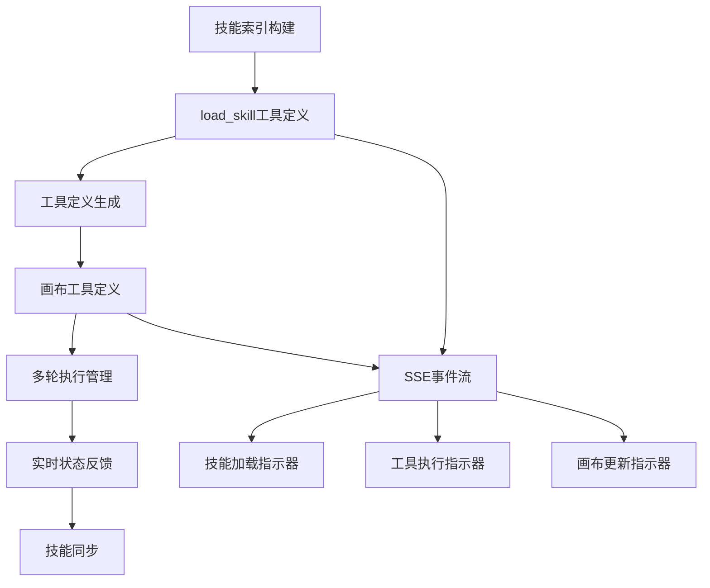

**图表来源**
- [backend/services/skill_tools.py:36-141](file://backend/services/skill_tools.py#L36-L141)
- [backend/routers/chats.py:486-499](file://backend/routers/chats.py#L486-L499)
- [backend/skills_manager.py:180-225](file://backend/skills_manager.py#L180-L225)

**章节来源**
- [backend/services/skill_tools.py:1-142](file://backend/services/skill_tools.py#L1-L142)
- [backend/routers/chats.py:486-499](file://backend/routers/chats.py#L486-L499)
- [backend/skills_manager.py:180-225](file://backend/skills_manager.py#L180-L225)

### 技能管理API与管理员界面
- 技能CRUD操作：支持技能的创建、读取、更新、删除
- 技能状态管理：支持技能的激活和停用状态切换
- 版本控制：支持技能版本管理和差异比较
- 自动启用：创建技能时可自动启用到活动技能目录
- 前端管理界面：提供完整的技能编辑和管理功能
- 安全验证：防止路径遍历和非法文件访问

**更新** 新增完整的技能管理API，支持技能的生命周期管理，包括创建、编辑、激活/停用和版本控制。

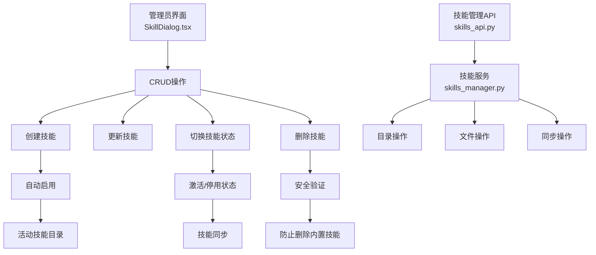

**图表来源**
- [backend/admin/src/app/admin/skills/SkillDialog.tsx:90-119](file://backend/admin/src/app/admin/skills/SkillDialog.tsx#L90-L119)
- [backend/routers/skills_api.py:140-206](file://backend/routers/skills_api.py#L140-L206)
- [backend/skills_manager.py:263-408](file://backend/skills_manager.py#L263-L408)

**章节来源**
- [backend/routers/skills_api.py:1-207](file://backend/routers/skills_api.py#L1-L207)
- [backend/admin/src/app/admin/skills/SkillDialog.tsx:1-235](file://backend/admin/src/app/admin/skills/SkillDialog.tsx#L1-L235)
- [backend/skills_manager.py:263-408](file://backend/skills_manager.py#L263-L408)

### 媒体文件服务与多模态支持
- 媒体路由：提供安全的媒体文件访问，支持PNG、JPG、JPEG、WEBP、GIF格式
- 文件名安全验证：使用正则表达式确保文件名符合UUID格式
- 内联图片处理：支持data URL格式的图片，自动保存为文件并返回访问路径
- 多模态消息：前端可以发送包含图片和文本的混合消息
- 批量图片生成：支持Gemini 3.1的批量图片生成功能，支持并发控制
- Gemini 3.1集成：支持图片生成、思考模式、Google搜索等功能

**更新** 系统仍支持多模态消息（文本和图片）的处理和渲染，包括图片上传、预览和编辑功能。

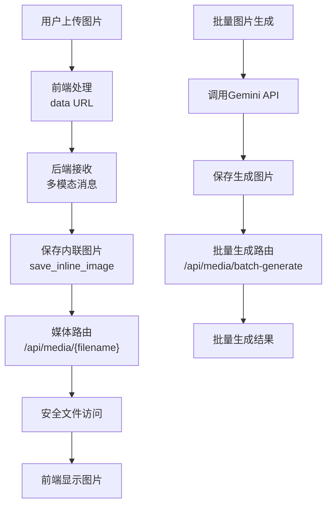

**图表来源**
- [backend/routers/media.py:39-130](file://backend/routers/media.py#L39-L130)
- [backend/services/media_utils.py:20-29](file://backend/services/media_utils.py#L20-L29)
- [backend/services/batch_image_gen.py:113-187](file://backend/services/batch_image_gen.py#L113-L187)
- [backend/services/llm_stream.py:261-292](file://backend/services/llm_stream.py#L261-L292)

**章节来源**
- [backend/routers/media.py:1-130](file://backend/routers/media.py#L1-L130)
- [backend/services/media_utils.py:1-29](file://backend/services/media_utils.py#L1-L29)
- [backend/services/batch_image_gen.py:1-187](file://backend/services/batch_image_gen.py#L1-L187)
- [backend/services/llm_stream.py:261-292](file://backend/services/llm_stream.py#L261-L292)

### 数据模型与关系
- ChatSession：会话表，包含标题、关联Agent、**theater_id**
- ChatMessage：消息表，包含会话ID、角色、内容（支持多模态JSON）、时间
- Agent：智能体表，包含模型、温度、上下文窗口、system提示、工具等，支持Gemini 3.1配置、**多智能体协作配置**
- LLMProvider：提供商表，包含类型、base_url、模型列表、状态等
- CreditTransaction：积分交易表，记录token使用和费用计算
- Skill：技能表，包含技能名称、描述、内容、来源、版本等信息
- TheaterNode：画布节点表，包含节点类型、位置、尺寸、数据等
- TheaterEdge：画布边表，包含源节点、目标节点、边类型等
- **TaskExecution**：多智能体任务执行表，包含Leader智能体、用户、会话、任务描述、状态等
- **SubTask**：子任务表，包含任务执行、智能体、描述、状态、令牌使用等

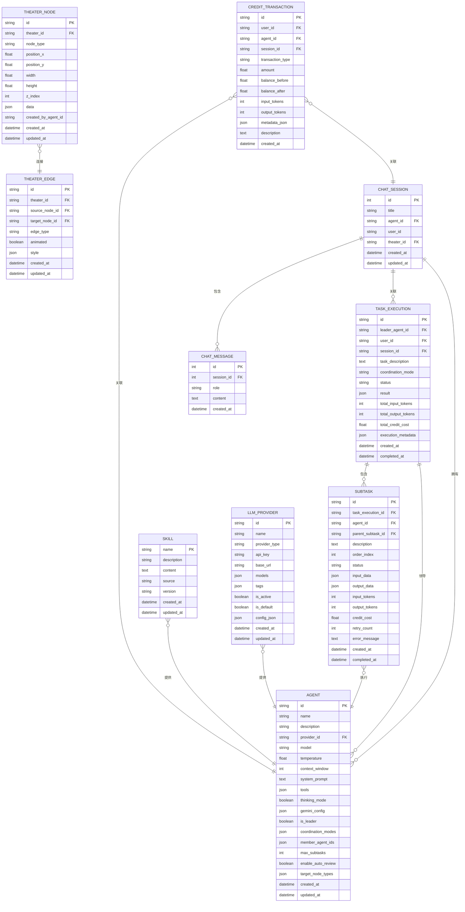

**图表来源**
- [backend/models.py:172-319](file://backend/models.py#L172-L319)

**章节来源**
- [backend/models.py:172-319](file://backend/models.py#L172-L319)

### 数据库与配置
- 异步引擎：SQLite/PostgreSQL可选，连接池与预检
- 会话工厂：AsyncSessionLocal
- 配置项：DATABASE_URL、REDIS_URL、各类API密钥、默认模型

**章节来源**
- [backend/database.py:8-23](file://backend/database.py#L8-L23)
- [backend/config.py:11-29](file://backend/config.py#L11-L29)

### 前端聊天界面与多模态渲染
- 会话列表：通过SWR拉取agent_id过滤的会话
- 消息列表：GET /api/chats/{session_id}/messages
- 发送消息：POST /api/chats/{session_id}/messages，使用fetch的ReadableStream增量解码
- 图片上传：支持多文件选择，预览并转换为data URL
- 多模态渲染：支持纯文本和图片混合消息的渲染
- 实时滚动：消息变更时自动滚动到底部
- 编辑模式：支持基于现有图片进行修改
- 技能加载指示器：实时显示技能加载状态
- 工具执行指示器：实时显示工具执行状态
- **SSE事件处理**：完整的SSE事件监听和处理机制，包括canvas_updated事件和多智能体协作事件
- **会话消息清除**：提供清空对话功能，调用DELETE /api/chats/{sessionId}/messages

**更新** 新增SSE事件处理支持，通过handleSSEEvent函数处理text、skill_call、skill_loaded、tool_call、tool_result、canvas_updated、**subtask_*等事件类型，实现完整的实时状态反馈。

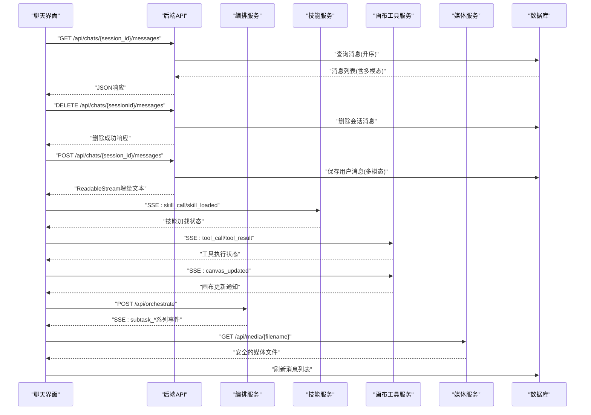

**图表来源**
- [backend/admin/src/components/admin/agents/ChatInterface.tsx:280-383](file://backend/admin/src/components/admin/agents/ChatInterface.tsx#L280-L383)
- [backend/routers/chats.py:63-70](file://backend/routers/chats.py#L63-L70)
- [backend/routers/chats.py:715-736](file://backend/routers/chats.py#L715-L736)
- [backend/routers/orchestrate.py:26-71](file://backend/routers/orchestrate.py#L26-L71)

**章节来源**
- [backend/admin/src/components/admin/agents/ChatInterface.tsx:280-711](file://backend/admin/src/components/admin/agents/ChatInterface.tsx#L280-L711)
- [backend/routers/chats.py:63-70](file://backend/routers/chats.py#L63-L70)
- [backend/routers/chats.py:715-736](file://backend/routers/chats.py#L715-L736)
- [backend/routers/orchestrate.py:26-71](file://backend/routers/orchestrate.py#L26-L71)

### WebSocket示例（概念性）
当前聊天API未使用WebSocket推送，而是通过HTTP流式响应实现近实时体验。WebSocket端点已存在，可用于后续扩展（如房间广播、状态通知）。

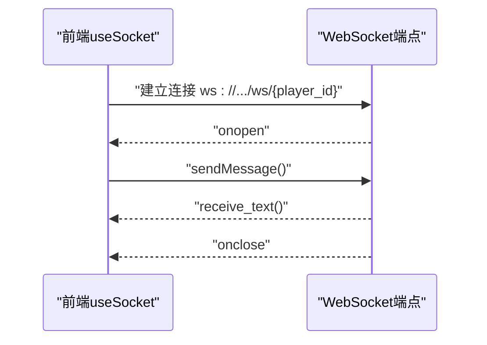

**图表来源**
- [frontend/src/hooks/useSocket.ts:8-33](file://frontend/src/hooks/useSocket.ts#L8-L33)
- [backend/main.py:157-169](file://backend/main.py#L157-L169)

**章节来源**
- [frontend/src/hooks/useSocket.ts:3-42](file://frontend/src/hooks/useSocket.ts#L3-L42)
- [backend/main.py:157-169](file://backend/main.py#L157-L169)

## 依赖关系分析
- 后端依赖：FastAPI、SQLAlchemy异步、Alembic、OpenAI SDK、DashScope SDK、AgentScope、Google Genai等
- 前端依赖：SWR、React、React Markdown、Tailwind UI组件库
- 数据库迁移：通过Alembic管理chat_sessions与chat_messages表，**新增task_executions与subtasks表**
- 媒体处理：依赖Google Genai SDK进行多模态处理和批量图片生成
- 批量生成：支持并发控制和错误处理
- 技能管理：依赖frontmatter库进行技能内容解析和管理
- **画布工具服务**：依赖SQLAlchemy进行数据库操作，支持自动位置计算和边缘处理
- **SSE事件支持**：依赖完整的SSE事件流机制和前端解析逻辑
- **多智能体编排**：依赖DynamicOrchestrator实现Leader多智能体协作

**更新** 系统现已集成了画布工具服务、SSE事件支持和多智能体编排功能，新增了画布节点CRUD操作、实时状态反馈机制和多智能体任务编排能力。

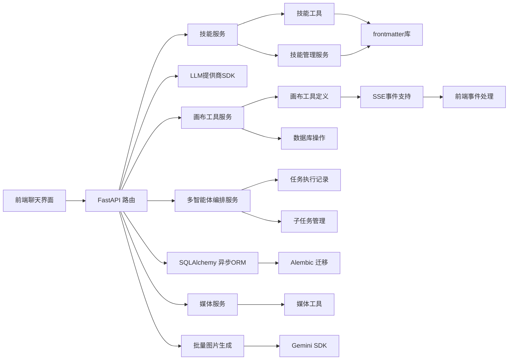

**图表来源**
- [backend/requirements.txt:1-20](file://backend/requirements.txt#L1-L20)
- [backend/admin/src/components/admin/agents/ChatInterface.tsx:1-711](file://backend/admin/src/components/admin/agents/ChatInterface.tsx#L1-L711)
- [backend/routers/chats.py:1-757](file://backend/routers/chats.py#L1-L757)
- [backend/routers/orchestrate.py:1-184](file://backend/routers/orchestrate.py#L1-L184)

**章节来源**
- [backend/requirements.txt:1-20](file://backend/requirements.txt#L1-L20)
- [backend/admin/src/components/admin/agents/ChatInterface.tsx:1-711](file://backend/admin/src/components/admin/agents/ChatInterface.tsx#L1-L711)
- [backend/routers/chats.py:1-757](file://backend/routers/chats.py#L1-L757)
- [backend/routers/orchestrate.py:1-184](file://backend/routers/orchestrate.py#L1-L184)

## 性能考虑
- 异步I/O：使用async/await与异步数据库连接，避免阻塞
- 连接池：合理设置pool_size与max_overflow，提升并发吞吐
- 流式传输：后端逐块yield，前端增量渲染，降低首屏延迟
- 上下文窗口：Agent的context_window限制历史长度，避免超限
- 缓存与索引：消息表按session_id建立索引，加速查询
- 多模态优化：图片使用data URL格式，避免额外的HTTP请求
- 媒体缓存：媒体文件设置长期缓存头，减少重复访问
- 批量生成优化：使用信号量控制并发数，避免API限制
- 技能索引优化：轻量级技能索引，按需加载完整内容
- SSE事件流：实时状态反馈，避免轮询开销
- **会话消息清除优化**：批量删除消息，避免逐条删除的性能开销
- **多智能体编排优化**：使用异步生成器处理子任务，支持并行执行
- **画布工具优化**：自动位置计算避免重复查询，边缘处理使用批量操作
- **SSE事件优化**：事件数据最小化，仅包含必要的更新信息

**更新** 系统现已考虑会话消息清除、多智能体编排和画布工具的性能优化，包括批量删除操作、异步子任务处理和自动位置计算。

**章节来源**
- [backend/database.py:8-23](file://backend/database.py#L8-L23)
- [backend/routers/chats.py:129-131](file://backend/routers/chats.py#L129-L131)
- [backend/main.py:20-28](file://backend/main.py#L20-L28)
- [backend/routers/chats.py:729-732](file://backend/routers/chats.py#L729-L732)

## 故障排查指南
- 会话不存在：检查session_id是否正确，确认Agent是否存在
- 提供商不可用：确认LLMProvider.is_active为True，API密钥有效
- 流式响应异常：查看后端日志中的错误信息，确认提供商SDK版本兼容性
- 数据库连接失败：检查DATABASE_URL与网络连通性，确认Alembic迁移成功
- 前端无法接收流：确认浏览器支持ReadableStream，检查CORS配置
- 媒体文件访问失败：检查文件名格式是否符合UUID格式，确认文件存在
- 多模态消息错误：检查消息内容格式是否符合多模态规范
- Gemini配置冲突：注意图片生成与思考模式不能同时启用
- 批量生成失败：检查并发数限制，确认Gemini API可用性
- 媒体目录权限：确保媒体目录有写入权限
- 技能加载失败：检查技能文件完整性，确认SKILL.md格式正确
- 工具调用错误：检查工具定义和参数格式，确认提供商支持相应工具
- **画布工具错误**：检查theater_id和agent.target_node_types配置，确认节点类型权限
- **SSE事件异常**：检查后端SSE事件生成和前端解析逻辑，确认事件格式正确
- **画布更新不生效**：检查canvas_updated事件的theater_id匹配，确认前端监听正确
- **会话消息清除失败**：检查会话权限验证，确认用户有权删除该会话
- **多智能体协作错误**：检查Leader智能体配置，确认成员智能体存在且可用
- **编排任务取消失败**：检查任务状态，确认只能取消pending或running状态的任务

**更新** 故障排查指南已扩展至会话消息清除、多智能体协作和SSE事件相关的错误处理。

**章节来源**
- [backend/routers/chats.py:27-28](file://backend/routers/chats.py#L27-L28)
- [backend/routers/chats.py:109-110](file://backend/routers/chats.py#L109-L110)
- [backend/main.py:85-91](file://backend/main.py#L85-L91)
- [backend/routers/chats.py:722-727](file://backend/routers/chats.py#L722-L727)
- [backend/routers/orchestrate.py:158-173](file://backend/routers/orchestrate.py#L158-L173)

## 结论
本聊天交互API通过异步流式响应实现了低延迟的实时聊天体验，并新增了强大的会话消息清除功能、多智能体协作API和增强的SSE事件支持。系统具备良好的扩展性与安全性，支持文本和图片的混合消息处理，以及Gemini 3.1的高级功能。新增的会话消息清除功能允许用户管理历史记录，多智能体协作API提供了完整的任务编排能力，增强的SSE事件支持通过canvas_updated事件实现画布操作后的自动刷新机制。

**更新** 系统现已支持会话消息清除功能、多智能体协作API和增强的SSE事件支持。会话消息清除端点允许用户清空历史消息记录，多智能体协作API提供了完整的任务编排能力，包括Leader多智能体模式和多种协作策略。增强的SSE事件支持通过canvas_updated事件实现画布工具执行后的自动刷新机制，为AI助手面板提供完整的画布管理能力。

未来可在以下方面进一步增强：
- 引入WebSocket用于房间广播与状态通知
- 增加消息内容过滤与安全检查
- 支持分页加载与游标分页
- 引入Redis缓存热点会话
- 增强多租户与权限控制
- 扩展更多多模态媒体类型支持
- 增加图片生成质量控制和审核功能
- 实现技能版本管理和依赖关系追踪
- 增强多轮执行的错误恢复机制
- 扩展更多LLM提供商的工具支持
- **优化多智能体编排的性能和资源管理**
- **增强SSE事件的可靠性和错误恢复机制**
- **扩展多智能体协作的监控和调试功能**

## 附录

### API定义概览
- 创建会话：POST /api/chats/
- 列出会话：GET /api/chats/?agent_id={id}&skip={n}&limit={m}
- 获取会话：GET /api/chats/{session_id}
- 删除会话：DELETE /api/chats/{session_id}
- 获取消息：GET /api/chats/{session_id}/messages
- 发送消息（流式）：POST /api/chats/{session_id}/messages
- **清空消息**：DELETE /api/chats/{session_id}/messages
- 媒体文件访问：GET /api/media/{filename}
- 批量图片生成：POST /api/media/batch-generate
- 技能列表：GET /api/admin/skills/
- 获取技能详情：GET /api/admin/skills/{skill_name}
- 创建技能：POST /api/admin/skills/
- 更新技能：PUT /api/admin/skills/{skill_name}
- 删除技能：DELETE /api/admin/skills/{skill_name}
- 切换技能状态：POST /api/admin/skills/{skill_name}/toggle
- **多智能体编排**：POST /api/orchestrate/
- **查询任务执行**：GET /api/orchestrate/{task_execution_id}
- **列出任务执行**：GET /api/orchestrate/
- **取消任务执行**：DELETE /api/orchestrate/{task_execution_id}

**更新** 系统现已提供完整的技能管理API和多智能体编排API，支持技能的全生命周期管理和多智能体任务的完整编排流程。

**章节来源**
- [backend/routers/chats.py:22-757](file://backend/routers/chats.py#L22-L757)
- [backend/routers/orchestrate.py:1-184](file://backend/routers/orchestrate.py#L1-L184)
- [backend/routers/media.py:24-130](file://backend/routers/media.py#L24-L130)
- [backend/routers/skills_api.py:123-206](file://backend/routers/skills_api.py#L123-L206)

### 消息格式规范
- 角色限定：user、assistant、system
- 内容字段：字符串或数组，支持多模态消息
- 多模态消息格式：`[{type: "text", text: "..."}, {type: "image_url", image_url: {url: "data:..."}}]`
- 时间字段：created_at（服务端自动生成）
- **技能调用格式**：`{"type": "skill_call", "skill_name": "..."}`

**更新** 消息格式规范已扩展至技能调用的支持，包括技能加载和工具执行的状态表示。

**章节来源**
- [backend/schemas.py:217-231](file://backend/schemas.py#L217-L231)
- [backend/models.py:90-99](file://backend/models.py#L90-L99)

### 权限与安全
- 输入校验：Pydantic模型限制字段长度与范围
- 角色约束：历史消息角色清洗为合法值
- 上下文窗口：防止过长历史导致超限
- CORS：严格限制允许的源
- 媒体安全：文件名安全验证，仅允许特定扩展名
- 多模态验证：确保消息内容格式正确
- 批量生成安全：限制并发数和请求频率
- 技能安全：防止路径遍历，验证技能文件完整性
- 工具调用安全：验证工具参数和权限控制
- **画布工具安全**：验证节点类型权限，防止越权操作
- **SSE事件安全**：确保事件数据的完整性和安全性
- **会话消息清除安全**：验证会话所有权，防止越权删除
- **多智能体协作安全**：验证Leader权限和成员智能体有效性

**更新** 权限与安全检查已扩展至会话消息清除和多智能体协作，包括会话所有权验证和Leader权限控制。

**章节来源**
- [backend/schemas.py:43-73](file://backend/schemas.py#L43-L73)
- [backend/routers/chats.py:124-127](file://backend/routers/chats.py#L124-L127)
- [backend/main.py:85-91](file://backend/main.py#L85-L91)
- [backend/routers/chats.py:722-727](file://backend/routers/chats.py#L722-L727)
- [backend/routers/orchestrate.py:37-42](file://backend/routers/orchestrate.py#L37-L42)

### 多模态功能特性
- 图片上传：支持PNG、JPG、JPEG、WEBP、GIF格式
- 内联图片：自动保存data URL格式的图片
- Gemini 3.1集成：支持图片生成、思考模式、Google搜索
- 批量图片生成：支持1-8张图片并行生成，可配置尺寸和比例
- 多模态消息：前后端统一的多模态消息格式
- 媒体缓存：长期缓存策略减少重复访问
- 编辑模式：支持基于现有图片进行修改

**更新** 多模态功能特性保持不变，继续支持文本和图片的处理和渲染。

**章节来源**
- [backend/services/media_utils.py:10-17](file://backend/services/media_utils.py#L10-L17)
- [backend/services/llm_stream.py:322-376](file://backend/services/llm_stream.py#L322-L376)
- [backend/services/batch_image_gen.py:17-37](file://backend/services/batch_image_gen.py#L17-L37)
- [backend/admin/src/components/admin/agents/ChatInterface.tsx:116-149](file://backend/admin/src/components/admin/agents/ChatInterface.tsx#L116-L149)

### 画布工具集成特性
**新增章节** 系统现在支持完整的画布工具集成：

- **工具定义**：支持list_canvas_nodes、get_canvas_node、create_canvas_node、update_canvas_node、delete_canvas_node五种标准操作
- **自动位置**：create_canvas_node支持自动位置计算，新节点位于现有节点右侧
- **权限控制**：仅当theater_id和agent.target_node_types存在时启用画布工具
- **边缘处理**：delete_canvas_node自动删除关联的边，保持数据一致性
- **SSE事件**：工具执行后发送canvas_updated事件，通知前端刷新画布
- **前端同步**：AI助手面板监听事件，自动重新加载画布数据
- **数据完整性**：支持节点类型枚举限制，防止越权操作

**章节来源**
- [backend/services/canvas_tools.py:42-171](file://backend/services/canvas_tools.py#L42-L171)
- [backend/services/canvas_tools.py:227-481](file://backend/services/canvas_tools.py#L227-L481)
- [backend/routers/chats.py:325-332](file://backend/routers/chats.py#L325-L332)
- [backend/routers/chats.py:585-593](file://backend/routers/chats.py#L585-L593)

### SSE事件支持特性
**更新** 系统现在支持完整的SSE事件机制：

- **事件类型**：支持text、skill_call、skill_loaded、tool_call、tool_result、canvas_updated、**subtask_*系列事件
- **事件格式**：每条事件包含事件类型和数据负载，前端通过parseSSELine解析
- **事件发送**：在工具调用开始和结束时发送对应事件，画布工具执行后发送canvas_updated事件，多智能体任务执行过程中发送subtask_*系列事件
- **前端处理**：AI助手面板监听所有事件类型，提供相应的UI更新逻辑
- **错误处理**：支持error事件，向前端报告生成过程中的错误
- **完成标记**：使用done事件标记流式响应的结束
- **条件刷新**：仅当当前活跃的theater_id匹配时才刷新画布

**章节来源**
- [backend/routers/chats.py:523-524](file://backend/routers/chats.py#L523-L524)
- [backend/routers/chats.py:549-560](file://backend/routers/chats.py#L549-L560)
- [backend/routers/chats.py:574-583](file://backend/routers/chats.py#L574-L583)
- [backend/routers/chats.py:585-593](file://backend/routers/chats.py#L585-L593)
- [backend/routers/orchestrate.py:58-61](file://backend/routers/orchestrate.py#L58-61)
- [frontend/src/components/canvas/AIAssistantPanel.tsx:86-93](file://frontend/src/components/canvas/AIAssistantPanel.tsx#L86-L93)
- [frontend/src/components/canvas/AIAssistantPanel.tsx:95-129](file://frontend/src/components/canvas/AIAssistantPanel.tsx#L95-L129)

### 多智能体协作特性
**新增章节** 系统现在支持完整的多智能体协作功能：

- **Leader配置**：Agent模型新增is_leader、coordination_modes、member_agent_ids、max_subtasks、enable_auto_review字段
- **策略支持**：支持pipeline（管道）、plan（计划）、discussion（讨论）三种协作策略
- **任务分解**：Leader智能体负责任务分解和成员分配
- **子任务管理**：自动创建和管理子任务，支持并行和串行执行
- **实时监控**：通过SSE事件流提供实时进度监控
- **结果汇总**：自动汇总各成员的结果，生成最终输出
- **SSE事件**：支持subtask_created、subtask_started、subtask_completed、task_completed等事件类型

**章节来源**
- [backend/models.py:231-245](file://backend/models.py#L231-L245)
- [backend/routers/chats.py:241-323](file://backend/routers/chats.py#L241-L323)
- [backend/services/orchestrator.py:581-619](file://backend/services/orchestrator.py#L581-L619)

### 技能驱动架构特性
- 技能索引：轻量级技能索引，仅包含名称和描述
- 动态加载：按需加载完整技能内容，节省token成本
- 工具定义：为每个技能生成对应的工具定义
- 多轮执行：支持工具调用的多轮处理和状态反馈
- 实时指示器：前端显示技能加载和工具执行状态
- 版本管理：支持技能版本控制和差异比较
- 目录管理：支持内置和自定义技能的目录结构
- 文件安全：防止路径遍历，验证文件访问权限

**更新** 新增画布工具集成，通过build_canvas_tool_defs函数生成画布工具定义，支持list_canvas_nodes、get_canvas_node、create_canvas_node、update_canvas_node、delete_canvas_node等操作。

**章节来源**
- [backend/services/skill_tools.py:1-142](file://backend/services/skill_tools.py#L1-L142)
- [backend/skills_manager.py:1-408](file://backend/skills_manager.py#L1-L408)
- [backend/admin/src/app/admin/skills/SkillDialog.tsx:1-235](file://backend/admin/src/app/admin/skills/SkillDialog.tsx#L1-L235)

### Gemini 3.1配置选项
- 思考模式：high、medium、low、minimal四个级别
- 媒体分辨率：ultra_high、high、medium、low四个级别
- 图片生成：支持aspect_ratio、image_size、output_format配置
- Google搜索：可启用文本搜索和图片搜索功能
- 并发控制：批量生成支持1-8的并发数限制

**更新** Gemini 3.1配置选项保持不变，专注于文本和图片的多模态处理。

**章节来源**
- [backend/schemas.py:170-191](file://backend/schemas.py#L170-L191)
- [backend/models.py:200-201](file://backend/models.py#L200-L201)
- [backend/services/llm_stream.py:225-233](file://backend/services/llm_stream.py#L225-L233)
- [backend/services/batch_image_gen.py:18-26](file://backend/services/batch_image_gen.py#L18-L26)

### 技能调用跟踪技术细节
**新增章节** 系统现在支持完整的技能调用跟踪机制：

- **序列化机制**：在保存助手消息时，将技能调用和工具调用信息序列化为JSON格式，包含技能名称、工具名称、参数和状态信息
- **反序列化机制**：在获取消息列表时，将JSON格式的技能调用和工具调用信息还原为结构化数据，支持前端直接使用
- **SSE事件流**：通过Server-Sent Events实时传输技能加载和工具执行状态，包括skill_call、skill_loaded、tool_call、tool_result等事件类型
- **前端可视化**：前端组件实时更新技能加载和工具执行的可视化状态，包括加载指示器、执行状态和完成状态
- **状态管理**：维护技能调用和工具调用的完整状态链，确保用户能够看到完整的执行过程

**章节来源**
- [backend/routers/chats.py:158-180](file://backend/routers/chats.py#L158-L180)
- [backend/routers/chats.py:581-590](file://backend/routers/chats.py#L581-L590)
- [backend/admin/src/components/admin/agents/ChatInterface.tsx:286-303](file://backend/admin/src/components/admin/agents/ChatInterface.tsx#L286-L303)

### 聊天路由优化技术细节
**新增章节** 系统现已实现聊天路由逻辑优化，在对话的最后轮次中智能避免传递工具定义，具体技术实现如下：

- **轮次控制**：MAX_TOOL_ROUNDS = 5，定义最大工具调用轮次
- **最后轮次检测**：`is_last_round = _round == MAX_TOOL_ROUNDS`判断是否为最后轮次
- **智能工具定义传递**：`current_tools = None if is_last_round else tool_defs`在最后轮次设置为None
- **性能优化效果**：避免最后轮次的工具定义传递，减少API调用开销和计算成本
- **兼容性保证**：不影响工具调用的完整执行流程，仅在最后轮次省略工具定义传递
- **逻辑完整性**：确保工具调用在最后轮次之前已完成，最终响应无需工具定义

**章节来源**
- [backend/routers/chats.py:485-495](file://backend/routers/chats.py#L485-L495)
- [backend/routers/chats.py:493-495](file://backend/routers/chats.py#L493-L495)

### 画布工具执行技术细节
**新增章节** 系统现已实现完整的画布工具执行机制：

- **工具识别**：通过CANVAS_TOOL_NAMES集合识别画布工具调用
- **执行流程**：execute_canvas_tool函数根据工具名称路由到对应执行器
- **权限验证**：仅当theater_id和agent.target_node_types存在时才执行画布工具
- **自动位置**：create_canvas_node支持自动位置计算，基于现有节点的最大x坐标
- **边缘处理**：delete_canvas_node自动删除关联的边，使用批量删除操作
- **结果序列化**：统一使用JSON序列化返回结果，支持错误处理和成功响应
- **事件通知**：工具执行完成后发送canvas_updated事件，包含theater_id和action信息

**章节来源**
- [backend/routers/chats.py:325-332](file://backend/routers/chats.py#L325-L332)
- [backend/routers/chats.py:585-593](file://backend/routers/chats.py#L585-L593)
- [backend/services/canvas_tools.py:428-481](file://backend/services/canvas_tools.py#L428-L481)
- [backend/services/canvas_tools.py:288-332](file://backend/services/canvas_tools.py#L288-L332)
- [backend/services/canvas_tools.py:395-412](file://backend/services/canvas_tools.py#L395-L412)

### 会话消息清除技术细节
**新增章节** 系统现已实现会话消息清除功能：

- **权限验证**：通过scoped_query确保会话属于当前用户
- **批量删除**：使用SQLAlchemy的delete语句批量删除会话消息，避免逐条删除的性能开销
- **事务处理**：在单个事务中完成删除操作，确保数据一致性
- **响应统计**：返回删除的消息数量，便于前端更新UI状态
- **前端集成**：AI助手面板提供清空对话按钮，调用后端API并清空前端显示

**章节来源**
- [backend/routers/chats.py:715-736](file://backend/routers/chats.py#L715-L736)
- [frontend/src/components/canvas/AIAssistantPanel.tsx:208-228](file://frontend/src/components/canvas/AIAssistantPanel.tsx#L208-L228)

### 多智能体编排技术细节
**新增章节** 系统现已实现完整的多智能体编排功能：

- **策略注册**：使用装饰器模式注册不同的协作策略（pipeline、plan、discussion）
- **任务分解**：Leader智能体根据任务描述和协作模式分解为子任务
- **子任务管理**：自动创建SubTask记录，支持并行和串行执行
- **实时监控**：通过SSE事件流提供子任务执行的实时进度
- **结果汇总**：自动汇总各成员的结果，生成最终输出
- **错误处理**：支持子任务失败重试和错误恢复机制

**章节来源**
- [backend/services/orchestrator.py:62-75](file://backend/services/orchestrator.py#L62-L75)
- [backend/services/orchestrator.py:110-126](file://backend/services/orchestrator.py#L110-L126)
- [backend/services/orchestrator.py:163-200](file://backend/services/orchestrator.py#L163-L200)