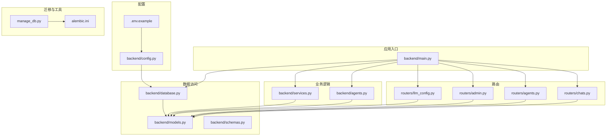
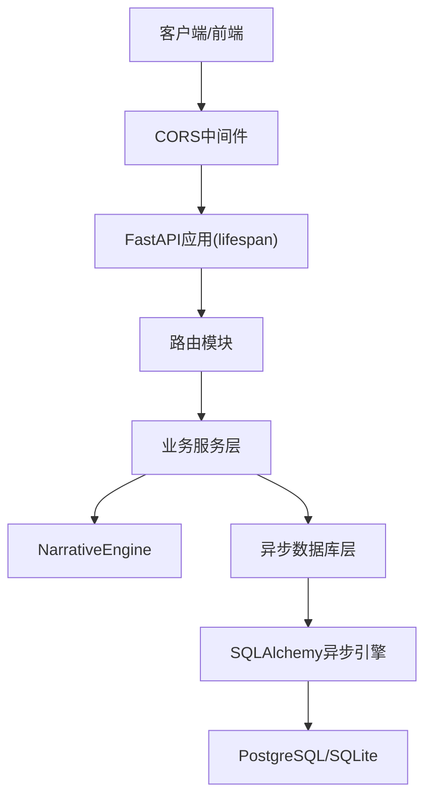
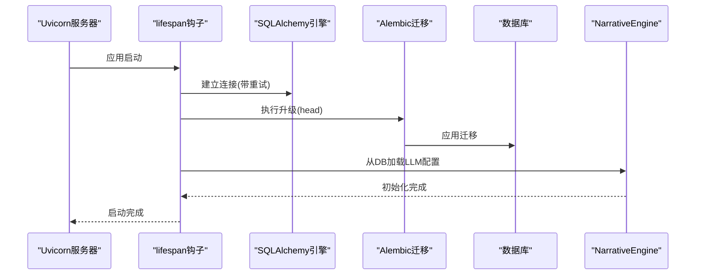
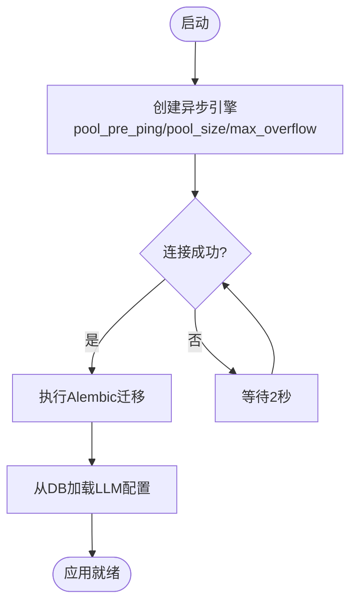
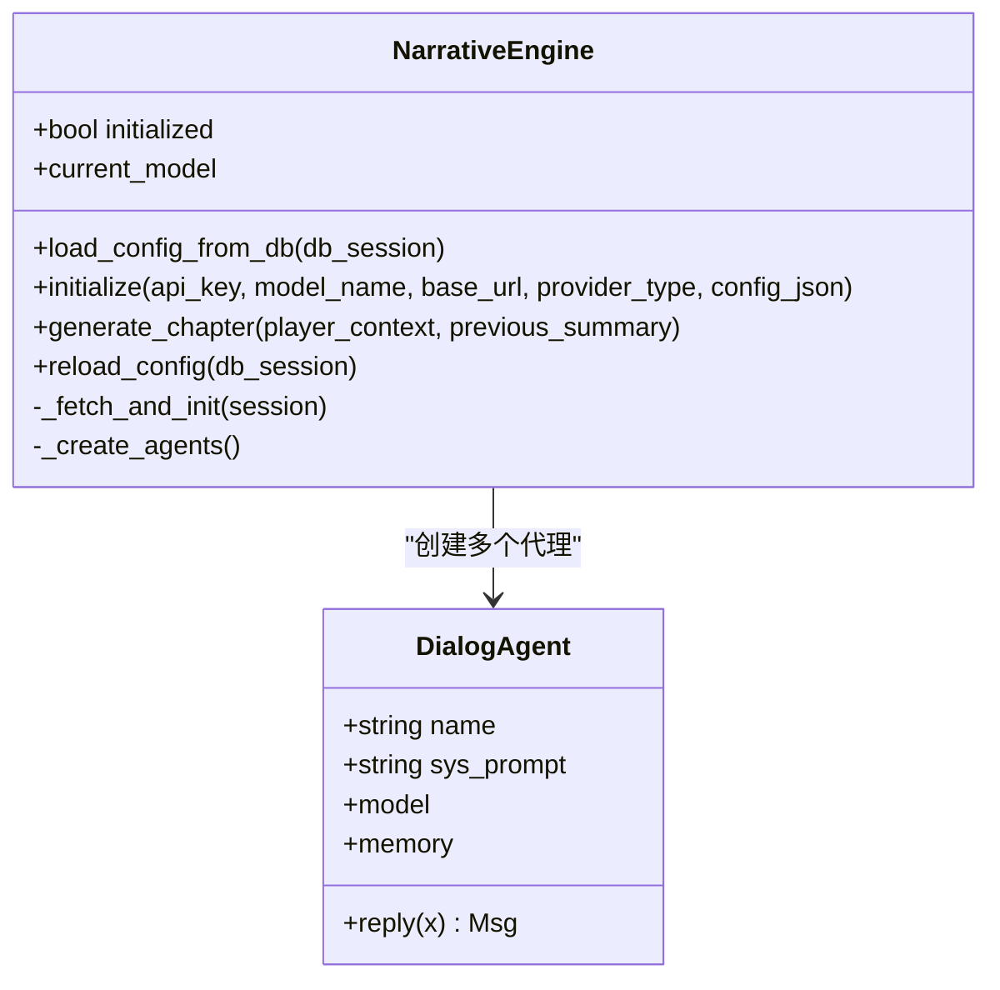
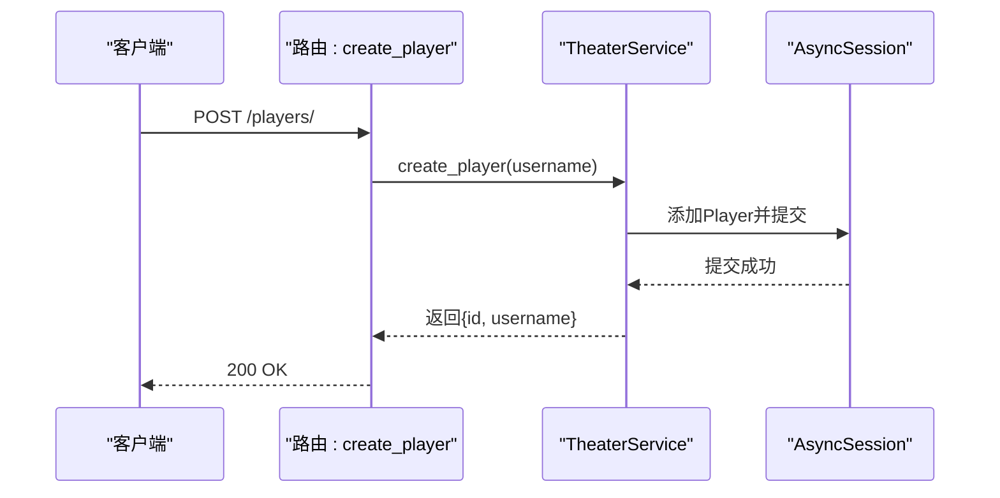
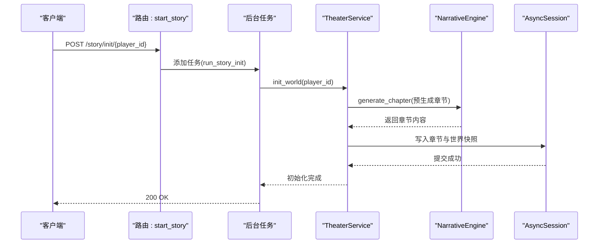
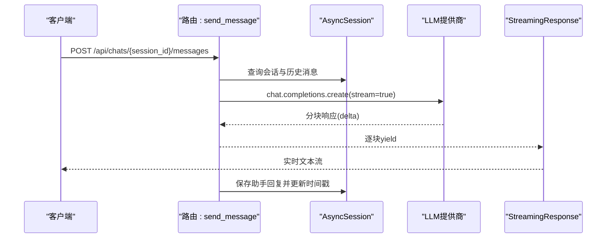
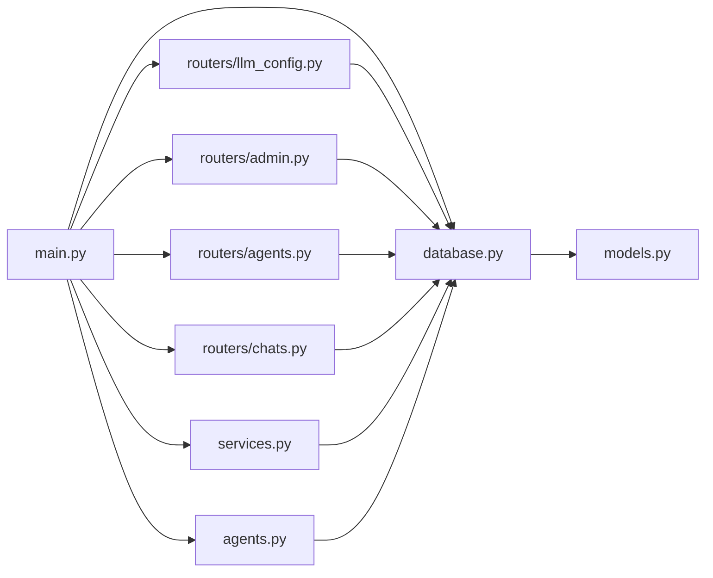

# FastAPI应用架构

<cite>
**本文档引用的文件**
- [backend/main.py](file://backend/main.py)
- [backend/config.py](file://backend/config.py)
- [backend/database.py](file://backend/database.py)
- [backend/models.py](file://backend/models.py)
- [backend/schemas.py](file://backend/schemas.py)
- [backend/services.py](file://backend/services.py)
- [backend/agents.py](file://backend/agents.py)
- [backend/manage_db.py](file://backend/manage_db.py)
- [backend/alembic.ini](file://backend/alembic.ini)
- [backend/routers/llm_config.py](file://backend/routers/llm_config.py)
- [backend/routers/admin.py](file://backend/routers/admin.py)
- [backend/routers/agents.py](file://backend/routers/agents.py)
- [backend/routers/chats.py](file://backend/routers/chats.py)
- [backend/requirements.txt](file://backend/requirements.txt)
- [backend/.env.example](file://backend/.env.example)
</cite>

## 目录
1. [简介](#简介)
2. [项目结构](#项目结构)
3. [核心组件](#核心组件)
4. [架构总览](#架构总览)
5. [详细组件分析](#详细组件分析)
6. [依赖关系分析](#依赖关系分析)
7. [性能考虑](#性能考虑)
8. [故障排除指南](#故障排除指南)
9. [结论](#结论)
10. [附录](#附录)

## 简介
本项目是一个基于FastAPI的无限叙事剧场后端服务，采用异步SQLAlchemy ORM进行数据持久化，支持多AI模型提供商（OpenAI、Azure、DashScope等），并通过NarrativeEngine实现故事生成与对话管理。系统通过生命周期钩子完成数据库连接重试、自动迁移和AI引擎初始化，并提供完善的CORS配置、日志配置与错误处理机制。

## 项目结构
后端采用分层与功能模块化组织：
- 核心入口：FastAPI应用定义与生命周期管理
- 配置层：环境变量与数据库URL配置
- 数据访问层：异步引擎、会话工厂与ORM基类
- 模型层：数据库表结构定义
- 路由层：按功能划分的API路由（管理员、代理、聊天、LLM配置）
- 业务服务层：剧场业务逻辑封装
- AI引擎：NarrativeEngine与对话代理
- 迁移工具：Alembic与自定义迁移管理脚本

**图表来源**
- [backend/main.py](file://backend/main.py#L1-L173)
- [backend/config.py](file://backend/config.py#L1-L34)
- [backend/database.py](file://backend/database.py#L1-L31)
- [backend/models.py](file://backend/models.py#L1-L122)
- [backend/schemas.py](file://backend/schemas.py#L1-L102)
- [backend/services.py](file://backend/services.py#L1-L66)
- [backend/agents.py](file://backend/agents.py#L1-L196)
- [backend/routers/llm_config.py](file://backend/routers/llm_config.py#L1-L203)
- [backend/routers/admin.py](file://backend/routers/admin.py#L1-L112)
- [backend/routers/agents.py](file://backend/routers/agents.py#L1-L141)
- [backend/routers/chats.py](file://backend/routers/chats.py#L1-L275)
- [backend/manage_db.py](file://backend/manage_db.py#L1-L67)
- [backend/alembic.ini](file://backend/alembic.ini#L1-L115)

**章节来源**
- [backend/main.py](file://backend/main.py#L1-L173)
- [backend/config.py](file://backend/config.py#L1-L34)
- [backend/database.py](file://backend/database.py#L1-L31)
- [backend/models.py](file://backend/models.py#L1-L122)
- [backend/schemas.py](file://backend/schemas.py#L1-L102)
- [backend/services.py](file://backend/services.py#L1-L66)
- [backend/agents.py](file://backend/agents.py#L1-L196)
- [backend/routers/llm_config.py](file://backend/routers/llm_config.py#L1-L203)
- [backend/routers/admin.py](file://backend/routers/admin.py#L1-L112)
- [backend/routers/agents.py](file://backend/routers/agents.py#L1-L141)
- [backend/routers/chats.py](file://backend/routers/chats.py#L1-L275)
- [backend/manage_db.py](file://backend/manage_db.py#L1-L67)
- [backend/alembic.ini](file://backend/alembic.ini#L1-L115)

## 核心组件
- 应用实例与生命周期：使用FastAPI lifespan钩子在启动阶段执行数据库连接重试、迁移与AI引擎初始化
- 异步数据库层：基于SQLAlchemy 2.0异步引擎，配置连接池参数与预检查
- 路由与中间件：注册CORS中间件，按功能模块化路由
- 业务服务：封装玩家创建、世界初始化、故事章节生成等业务逻辑
- AI引擎：NarrativeEngine负责从数据库加载活跃LLM配置并创建对话代理
- 迁移管理：Alembic配置与自定义命令行工具

**章节来源**
- [backend/main.py](file://backend/main.py#L45-L82)
- [backend/database.py](file://backend/database.py#L1-L31)
- [backend/agents.py](file://backend/agents.py#L43-L196)
- [backend/routers/llm_config.py](file://backend/routers/llm_config.py#L1-L203)

## 架构总览
系统采用“入口应用 → 中间件/CORS → 路由 → 业务服务 → 数据访问 → 数据库”的标准FastAPI架构。生命周期钩子确保数据库可用性与AI引擎就绪状态，路由层通过依赖注入获取异步会话，业务层调用AI引擎生成内容并持久化到数据库。

**图表来源**
- [backend/main.py](file://backend/main.py#L83-L91)
- [backend/main.py](file://backend/main.py#L45-L82)
- [backend/services.py](file://backend/services.py#L1-L66)
- [backend/agents.py](file://backend/agents.py#L43-L196)
- [backend/database.py](file://backend/database.py#L1-L31)

## 详细组件分析

### 应用初始化与生命周期管理
- 启动阶段任务
  - Windows事件循环与UTF-8编码兼容性处理
  - 全局日志级别配置（SQLAlchemy、Uvicorn、应用日志）
  - 数据库连接重试（最多5次，间隔2秒）
  - 执行Alembic迁移至最新版本
  - 从数据库加载LLM配置并初始化NarrativeEngine
- 生命周期钩子使用asynccontextmanager，确保资源正确释放

**图表来源**
- [backend/main.py](file://backend/main.py#L45-L82)
- [backend/agents.py](file://backend/agents.py#L49-L75)

**章节来源**
- [backend/main.py](file://backend/main.py#L1-L28)
- [backend/main.py](file://backend/main.py#L45-L82)

### 中间件与CORS配置
- 在应用实例上添加CORSMiddleware，允许本地开发源（localhost:3000/3001）跨域请求
- 支持凭据、所有方法与头字段
- 建议生产环境限制allow_origins范围并启用更严格的策略

**章节来源**
- [backend/main.py](file://backend/main.py#L85-L91)

### 数据库连接池与异步会话管理
- 异步引擎配置
  - echo=False：关闭SQL日志以减少噪声
  - pool_pre_ping=True：启用连接存活检测与自动重连
  - pool_size=10，max_overflow=20：合理设置连接池容量
  - SQLite场景下禁用多线程检查
- 会话工厂
  - AsyncSessionLocal：绑定引擎，expire_on_commit=False
  - get_db依赖：每次请求创建独立会话并自动释放
- 连接重试机制
  - 启动时最多重试5次，失败抛出异常
  - 建议在生产环境结合健康检查与熔断策略

**图表来源**
- [backend/database.py](file://backend/database.py#L8-L17)
- [backend/main.py](file://backend/main.py#L47-L73)

**章节来源**
- [backend/database.py](file://backend/database.py#L1-L31)
- [backend/main.py](file://backend/main.py#L47-L73)

### 数据库迁移策略
- Alembic配置
  - script_location=migrations，prepend_sys_path=.
  - 日志级别：root=WARN，sqlalchemy=WARN，alembic=INFO
- 迁移管理脚本
  - migrate：基于模型变更生成新修订
  - upgrade：应用到最新版本
  - downgrade：回滚一步
- 启动时迁移
  - 使用subprocess在独立进程中运行alembic，避免与FastAPI事件循环冲突

**章节来源**
- [backend/alembic.ini](file://backend/alembic.ini#L1-L115)
- [backend/manage_db.py](file://backend/manage_db.py#L1-L67)
- [backend/main.py](file://backend/main.py#L61-L64)

### NarrativeEngine初始化过程
- 加载逻辑
  - 优先查询is_active=true且按is_default降序排列的第一个提供者
  - 解析models字段（列表或JSON字符串），选择首个模型
  - 初始化AgentScope模型（DashScope或OpenAI/Azure）
  - 创建Director、Narrator、NPC_Manager三个对话代理
- 错误处理
  - 未找到活跃提供者时记录警告并回退到配置文件中的API Key
  - 初始化失败时记录错误并保持未就绪状态

**图表来源**
- [backend/agents.py](file://backend/agents.py#L43-L196)

**章节来源**
- [backend/agents.py](file://backend/agents.py#L43-L196)

### 错误处理机制
- 启动阶段
  - 数据库连接失败：最多重试5次，最终失败抛出异常
  - 迁移执行失败：捕获异常并打印错误信息
  - LLM配置加载失败：记录警告并跳过初始化
- 路由层
  - HTTP异常：统一返回HTTPException，包含明确错误码与消息
  - 流式响应：捕获异常并返回错误文本，同时记录日志
- 业务层
  - 玩家创建失败：捕获异常并转换为HTTP 400
  - 世界初始化：调用NarrativeEngine，若未初始化则返回占位内容

**章节来源**
- [backend/main.py](file://backend/main.py#L68-L73)
- [backend/routers/llm_config.py](file://backend/routers/llm_config.py#L107-L110)
- [backend/routers/chats.py](file://backend/routers/chats.py#L211-L215)
- [backend/main.py](file://backend/main.py#L144-L145)

### 日志配置与性能优化
- 日志配置
  - 应用日志：INFO级别，格式包含模块名、级别与消息
  - SQLAlchemy引擎与池：设置为WARNING，减少日志噪声
  - Uvicorn访问日志：仅WARNING以上级别，保留错误日志
- 性能优化建议
  - 连接池：根据并发请求量调整pool_size与max_overflow
  - 预检查：pool_pre_ping确保连接有效性，降低超时风险
  - 异常快速失败：启动阶段严格重试，避免应用在不完整状态下运行
  - 流式响应：聊天接口使用StreamingResponse，提升用户体验

**章节来源**
- [backend/main.py](file://backend/main.py#L14-L28)
- [backend/database.py](file://backend/database.py#L11-L16)
- [backend/routers/chats.py](file://backend/routers/chats.py#L113-L258)

### 安全配置最佳实践
- CORS策略：开发环境允许本地源，生产环境应限制allow_origins并启用HTTPS
- API密钥管理：通过环境变量注入（OPENAI_API_KEY等），避免硬编码
- 身份验证与授权：当前路由未实现认证，建议引入FastAPI Security组件（如OAuth2、JWT）
- 输入校验：Pydantic模型提供强类型校验，建议配合HTTPException返回统一错误格式

**章节来源**
- [backend/.env.example](file://backend/.env.example#L1-L4)
- [backend/schemas.py](file://backend/schemas.py#L1-L102)

### 路由与业务流程示例

#### 玩家创建流程

**图表来源**
- [backend/main.py](file://backend/main.py#L138-L145)
- [backend/services.py](file://backend/services.py#L12-L17)

#### 世界初始化与章节生成

**图表来源**
- [backend/main.py](file://backend/main.py#L147-L155)
- [backend/services.py](file://backend/services.py#L19-L58)
- [backend/agents.py](file://backend/agents.py#L154-L191)

#### 聊天流式响应

**图表来源**
- [backend/routers/chats.py](file://backend/routers/chats.py#L72-L258)

## 依赖关系分析
- 外部依赖
  - FastAPI、Uvicorn：Web框架与ASGI服务器
  - SQLAlchemy 2.0 + aiosqlite/asyncpg：异步ORM与驱动
  - AgentScope + OpenAI/DashScope：多提供商AI模型集成
  - Alembic：数据库迁移工具
- 内部模块耦合
  - main.py依赖database、services、agents、routers
  - routers依赖database、models、schemas
  - services依赖models与agents
  - agents依赖database与models

**图表来源**
- [backend/main.py](file://backend/main.py#L30-L42)
- [backend/routers/llm_config.py](file://backend/routers/llm_config.py#L1-L18)
- [backend/routers/admin.py](file://backend/routers/admin.py#L1-L14)
- [backend/routers/agents.py](file://backend/routers/agents.py#L1-L13)
- [backend/routers/chats.py](file://backend/routers/chats.py#L1-L20)
- [backend/database.py](file://backend/database.py#L1-L31)
- [backend/models.py](file://backend/models.py#L1-L122)

**章节来源**
- [backend/requirements.txt](file://backend/requirements.txt#L1-L20)
- [backend/main.py](file://backend/main.py#L30-L42)

## 性能考虑
- 连接池参数：根据QPS与并发会话数调整pool_size与max_overflow，避免连接饥饿
- 预检查与重连：pool_pre_ping提升连接稳定性，减少超时导致的失败
- 异常快速失败：启动阶段严格重试，避免在不完整状态下接受请求
- 流式响应：聊天接口使用StreamingResponse，降低首字节延迟
- 缓存与索引：为高频查询字段（如Player.username、StoryChapter.player_id）建立索引

## 故障排除指南
- 启动失败（数据库不可达）
  - 检查DATABASE_URL是否正确（.env中配置）
  - 查看启动日志中重试次数与最后一次错误
  - 确认数据库服务已启动且网络可达
- 迁移失败
  - 使用manage_db.py执行upgrade或查看具体错误
  - 确认Alembic配置与Python环境一致
- AI引擎未初始化
  - 检查LLMProvider表是否存在is_active=true的记录
  - 确认OPENAI_API_KEY等密钥已正确配置
- 聊天流式响应异常
  - 查看日志中错误信息与token统计
  - 检查提供商API密钥与模型名称

**章节来源**
- [backend/main.py](file://backend/main.py#L68-L73)
- [backend/manage_db.py](file://backend/manage_db.py#L30-L38)
- [backend/agents.py](file://backend/agents.py#L66-L75)
- [backend/routers/chats.py](file://backend/routers/chats.py#L211-L215)

## 结论
该FastAPI应用通过清晰的分层设计与生命周期管理，实现了从数据库连接、迁移、AI引擎初始化到业务路由的完整闭环。异步数据库层与流式响应提升了性能与用户体验；严格的错误处理与日志配置保障了系统的可观测性。建议在生产环境中进一步强化CORS策略、引入身份认证与授权，并对连接池参数进行压测调优。

## 附录
- 快速开始
  - 安装依赖：pip install -r backend/requirements.txt
  - 配置环境变量：复制.backend/.env.example为.backend/.env并填写密钥
  - 应用迁移：python backend/manage_db.py upgrade
  - 启动服务：uvicorn backend.main:app --host 0.0.0.0 --port 8000
- 常用命令
  - 新建迁移：python backend/manage_db.py migrate "描述变更"
  - 回滚迁移：python backend/manage_db.py downgrade
  - 升级迁移：python backend/manage_db.py upgrade

**章节来源**
- [backend/requirements.txt](file://backend/requirements.txt#L1-L20)
- [backend/.env.example](file://backend/.env.example#L1-L4)
- [backend/manage_db.py](file://backend/manage_db.py#L40-L63)