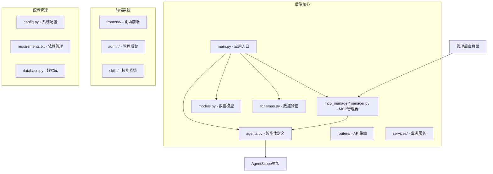
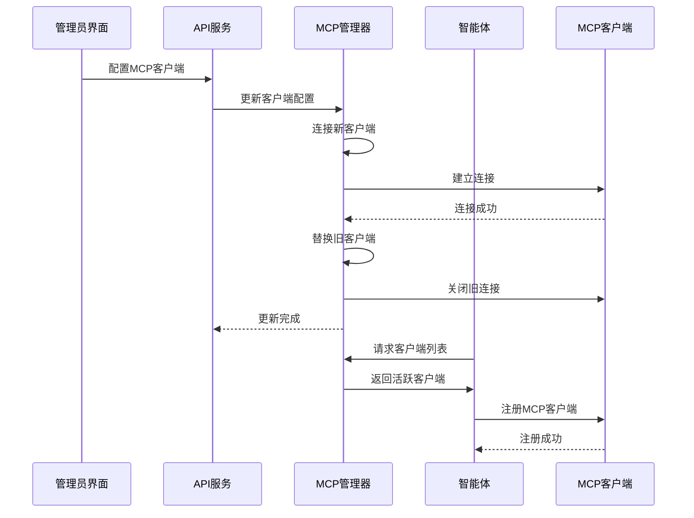
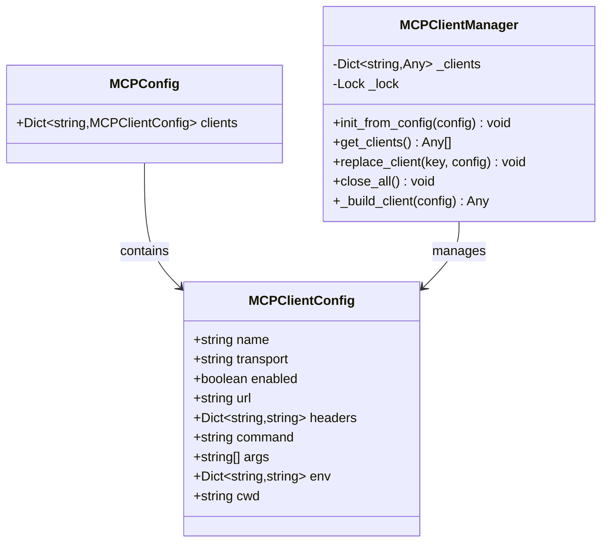
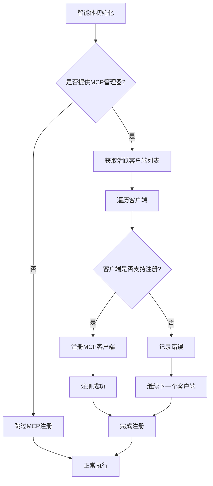
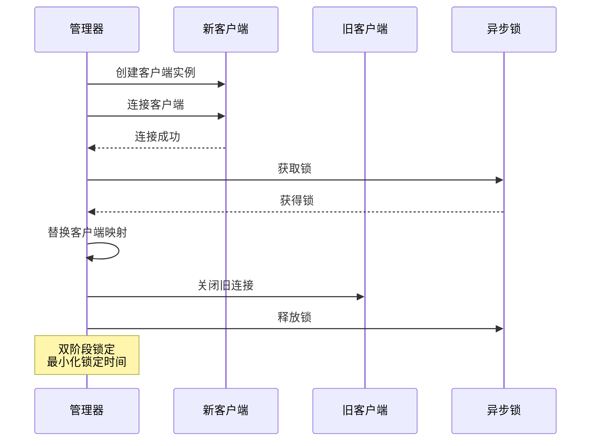
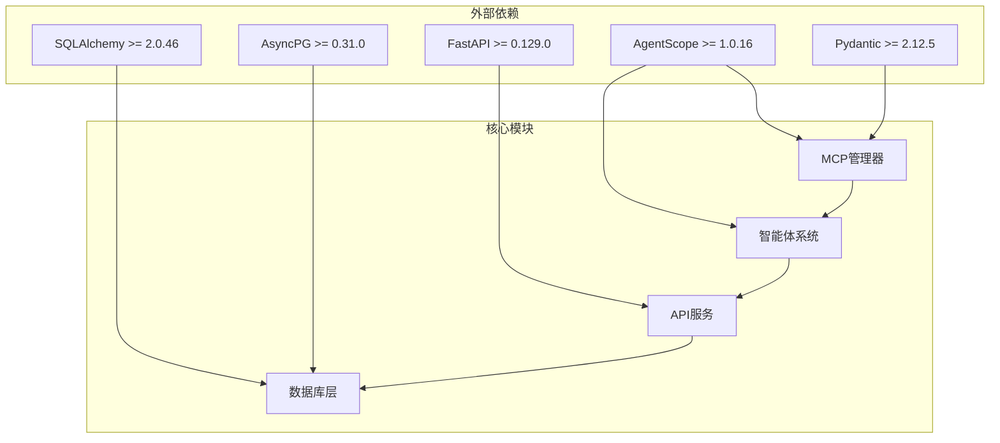

# MCP客户端管理器

<cite>
**本文档引用的文件**
- [manager.py](file://backend/mcp_manager/manager.py)
- [agents.py](file://backend/agents.py)
- [main.py](file://backend/main.py)
- [config.py](file://backend/config.py)
- [models.py](file://backend/models.py)
- [schemas.py](file://backend/schemas.py)
- [requirements.txt](file://backend/requirements.txt)
- [README.md](file://README.md)
- [page.tsx](file://backend/admin/src/app/admin/mcp/page.tsx)
</cite>

## 目录
1. [简介](#简介)
2. [项目结构](#项目结构)
3. [核心组件](#核心组件)
4. [架构概览](#架构概览)
5. [详细组件分析](#详细组件分析)
6. [依赖关系分析](#依赖关系分析)
7. [性能考虑](#性能考虑)
8. [故障排除指南](#故障排除指南)
9. [结论](#结论)

## 简介

MCP客户端管理器是Infinite Narrative Theater系统中的关键组件，基于AgentScope框架实现了Model Context Protocol (MCP)客户端的生命周期管理。该系统允许智能体动态连接到外部工具和数据源，支持无感热重载功能，为多智能体协作提供了强大的扩展能力。

系统采用前后端分离架构，后端使用FastAPI框架，前端使用Next.js，通过MCP协议实现了智能体与外部服务的无缝集成。管理员可以通过后台管理系统动态配置和管理MCP客户端，实现服务的热更新而无需重启整个系统。

## 项目结构

该项目采用模块化设计，主要包含以下核心模块：

**图表来源**
- [main.py:1-170](file://backend/main.py#L1-L170)
- [manager.py:1-139](file://backend/mcp_manager/manager.py#L1-L139)
- [agents.py:1-388](file://backend/agents.py#L1-L388)

**章节来源**
- [README.md:1-139](file://README.md#L1-L139)
- [main.py:1-170](file://backend/main.py#L1-L170)

## 核心组件

### MCP客户端管理器

MCP客户端管理器是系统的核心组件，负责管理MCP客户端的完整生命周期：

- **初始化管理**：从配置中加载MCP客户端
- **热重载支持**：支持运行时替换客户端配置
- **连接管理**：处理客户端连接和断开
- **错误恢复**：提供自动重连和错误处理机制

### 智能体集成

智能体通过MCP客户端管理器实现对外部工具的访问：

- **技能注册**：动态注册可用的技能和工具
- **内存管理**：维护对话历史和上下文
- **格式化器**：处理不同AI提供商的响应格式

### 配置系统

系统提供完整的配置管理机制：

- **传输方式**：支持STDIO和HTTP两种传输模式
- **环境变量**：支持环境变量替换
- **动态更新**：支持运行时配置更新

**章节来源**
- [manager.py:28-139](file://backend/mcp_manager/manager.py#L28-L139)
- [agents.py:40-175](file://backend/agents.py#L40-L175)

## 架构概览

系统采用分层架构设计，实现了清晰的关注点分离：

**图表来源**
- [manager.py:57-86](file://backend/mcp_manager/manager.py#L57-L86)
- [agents.py:70-84](file://backend/agents.py#L70-L84)

系统架构的关键特点：

1. **异步处理**：使用asyncio实现非阻塞I/O操作
2. **锁机制**：通过异步锁确保线程安全
3. **双阶段锁定**：最小化锁定时间，提高并发性能
4. **错误隔离**：每个客户端独立管理，避免级联故障

## 详细组件分析

### MCP客户端配置模型

**图表来源**
- [manager.py:10-26](file://backend/mcp_manager/manager.py#L10-L26)
- [manager.py:28-38](file://backend/mcp_manager/manager.py#L28-L38)

### 智能体MCP集成

智能体通过MCP客户端管理器实现对外部工具的访问：

**图表来源**
- [agents.py:70-84](file://backend/agents.py#L70-L84)

### 客户端连接流程

**图表来源**
- [manager.py:57-86](file://backend/mcp_manager/manager.py#L57-L86)

**章节来源**
- [manager.py:105-139](file://backend/mcp_manager/manager.py#L105-L139)
- [agents.py:114-175](file://backend/agents.py#L114-L175)

## 依赖关系分析

系统依赖关系图展示了各组件间的依赖关系：

**图表来源**
- [requirements.txt:1-28](file://backend/requirements.txt#L1-L28)

主要依赖特点：

1. **AgentScope集成**：深度集成AgentScope框架，支持MCP协议
2. **异步架构**：全面使用异步编程模型
3. **类型安全**：通过Pydantic实现强类型验证
4. **数据库抽象**：使用SQLAlchemy提供数据库抽象层

**章节来源**
- [requirements.txt:1-28](file://backend/requirements.txt#L1-L28)

## 性能考虑

### 并发性能优化

系统采用了多项性能优化策略：

1. **异步I/O**：所有网络操作都是异步的，避免阻塞
2. **连接池**：合理管理客户端连接，减少重复建立连接的开销
3. **缓存机制**：智能体和模型实例使用缓存减少重复创建
4. **双阶段锁定**：最小化锁持有时间，提高并发性能

### 内存管理

- **客户端缓存**：MCP客户端实例被缓存以避免重复创建
- **智能体复用**：DialogAgent实例在内存中复用
- **及时清理**：关闭连接时及时释放资源

### 错误处理策略

- **超时控制**：所有网络操作都有超时设置
- **重试机制**：关键操作具备重试能力
- **优雅降级**：部分功能失败不影响整体系统运行

## 故障排除指南

### 常见问题及解决方案

#### MCP客户端连接失败

**症状**：客户端无法连接到远程服务
**可能原因**：
1. 网络连接问题
2. 认证信息错误
3. 服务端配置不正确

**解决步骤**：
1. 检查网络连接状态
2. 验证URL和认证信息
3. 查看服务端日志
4. 测试基本连接

#### 智能体无法注册MCP客户端

**症状**：智能体无法使用外部工具
**可能原因**：
1. MCP管理器未正确初始化
2. 客户端未正确连接
3. 工具包不支持MCP注册

**解决步骤**：
1. 确认MCP管理器状态
2. 检查客户端连接状态
3. 验证工具包兼容性
4. 查看注册日志

#### 热重载失败

**症状**：更新客户端配置后系统异常
**可能原因**：
1. 新客户端连接失败
2. 旧客户端关闭异常
3. 锁竞争问题

**解决步骤**：
1. 检查新客户端配置
2. 确认旧客户端正确关闭
3. 查看锁状态
4. 重启服务作为最后手段

**章节来源**
- [manager.py:40-51](file://backend/mcp_manager/manager.py#L40-L51)
- [agents.py:78-83](file://backend/agents.py#L78-L83)

## 结论

MCP客户端管理器为Infinite Narrative Theater系统提供了强大的扩展能力。通过精心设计的架构和实现，系统实现了：

1. **高可用性**：支持无感热重载，确保服务连续性
2. **高性能**：异步架构和优化的并发处理
3. **易扩展**：灵活的配置管理和插件式架构
4. **可靠性**：完善的错误处理和恢复机制

该组件的成功实现为整个多智能体协作系统奠定了坚实的基础，使得智能体能够动态访问各种外部工具和服务，大大增强了系统的功能性和灵活性。

未来可以考虑的改进方向包括：
- 更丰富的监控和诊断功能
- 更细粒度的权限控制
- 更智能的自动故障转移
- 更完善的性能指标收集