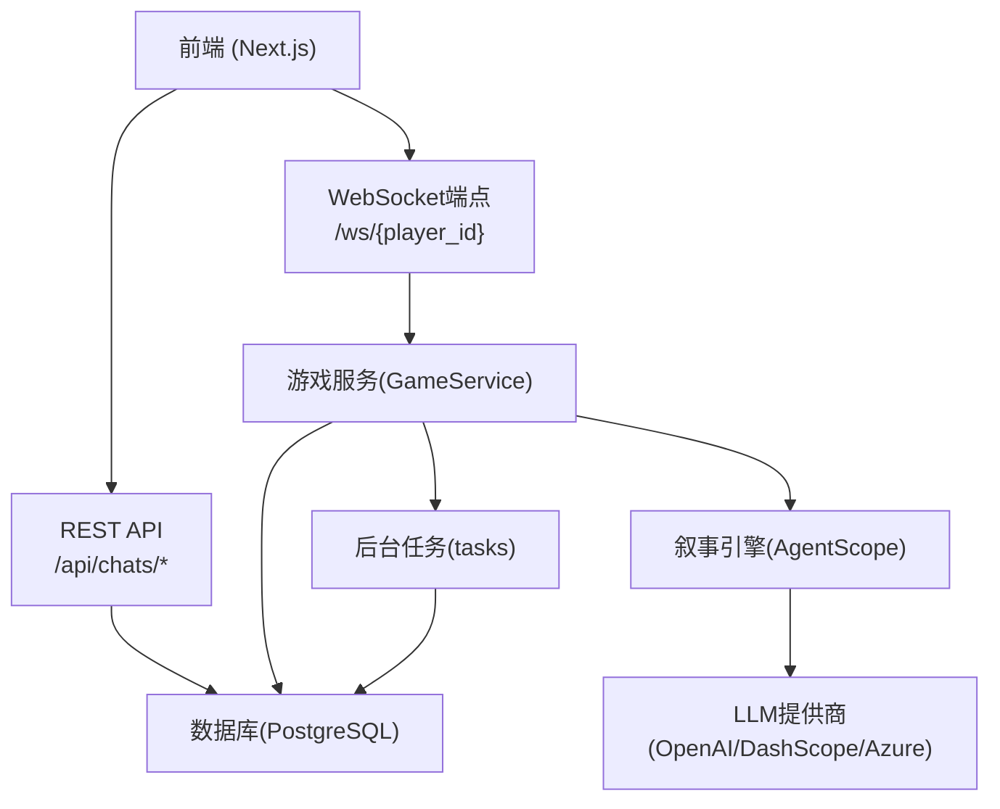
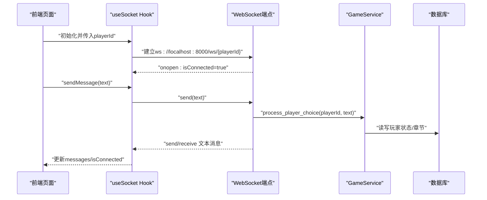
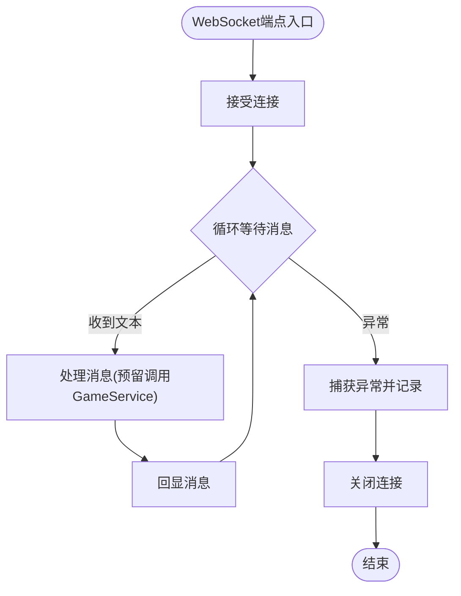
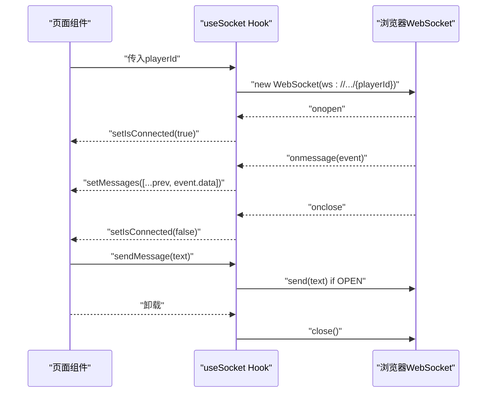
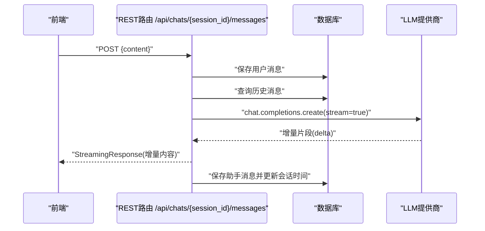
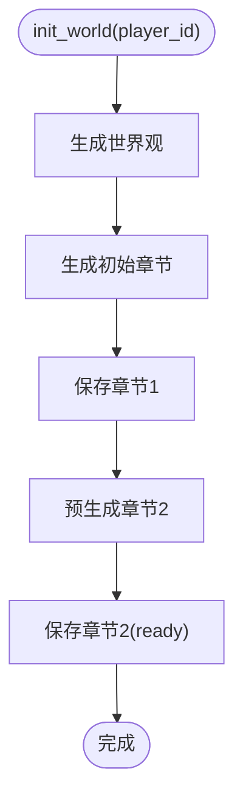
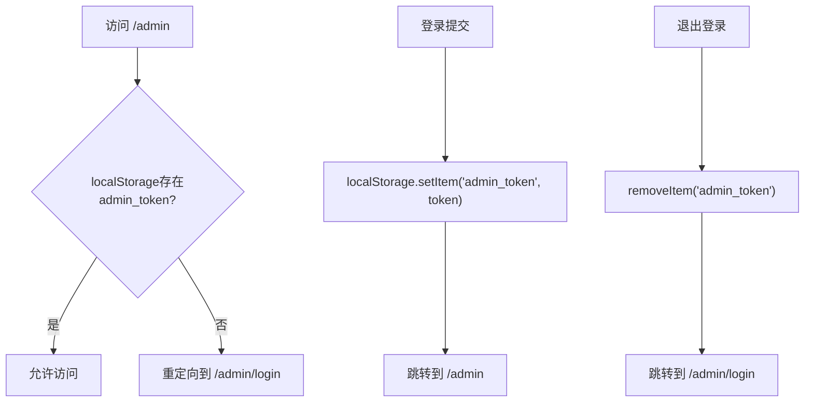
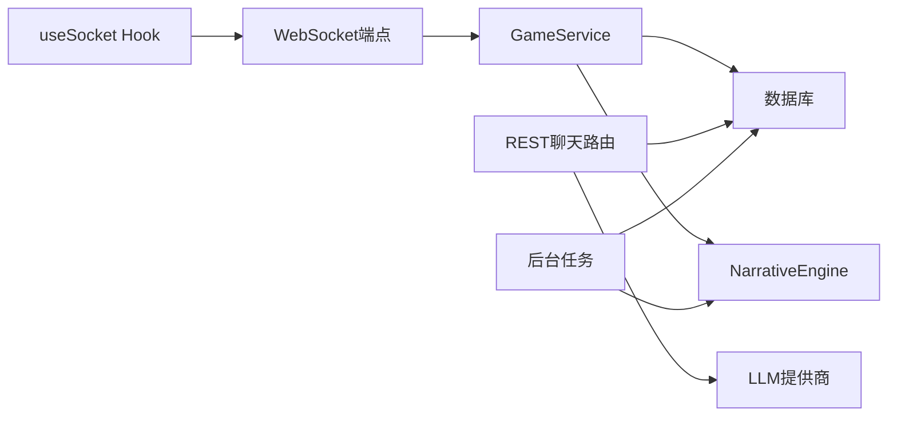

# WebSocket通信

<cite>
**本文引用的文件**
- [backend/main.py](file://backend/main.py)
- [frontend/src/hooks/useSocket.ts](file://frontend/src/hooks/useSocket.ts)
- [backend/routers/chats.py](file://backend/routers/chats.py)
- [backend/services.py](file://backend/services.py)
- [backend/models.py](file://backend/models.py)
- [backend/schemas.py](file://backend/schemas.py)
- [backend/tasks.py](file://backend/tasks.py)
- [docs/wiki/Frontend-Guide.md](file://docs/wiki/Frontend-Guide.md)
- [docs/wiki/Architecture.md](file://docs/wiki/Architecture.md)
- [docs/wiki/Requirements-Traceability.md](file://docs/wiki/Requirements-Traceability.md)
- [backend/admin/src/context/AuthContext.tsx](file://backend/admin/src/context/AuthContext.tsx)
- [backend/admin/src/app/page.tsx](file://backend/admin/src/app/page.tsx)
- [backend/requirements.txt](file://backend/requirements.txt)
</cite>

## 目录
1. [简介](#简介)
2. [项目结构](#项目结构)
3. [核心组件](#核心组件)
4. [架构总览](#架构总览)
5. [详细组件分析](#详细组件分析)
6. [依赖关系分析](#依赖关系分析)
7. [性能考量](#性能考量)
8. [故障排查指南](#故障排查指南)
9. [结论](#结论)
10. [附录](#附录)

## 简介
本文件围绕WebSocket通信系统进行深入技术说明，覆盖连接建立、消息传递、连接管理、实时通信协议设计、消息格式规范、事件处理流程、连接状态管理、错误恢复与断线重连策略，并给出WebSocket中间件、认证授权与消息队列的实现建议。同时提供前后端协同开发指南与调试技巧，帮助构建可靠的实时通信功能。

## 项目结构
本项目采用前后端分离架构：前端使用Next.js 16，后端使用FastAPI，WebSocket端点位于后端主应用中；聊天与流式响应由独立路由实现；叙事引擎与任务队列用于故事章节生成与多模态资产生成。

图表来源
- [backend/main.py](file://backend/main.py#L157-L170)
- [backend/routers/chats.py](file://backend/routers/chats.py#L1-L275)
- [backend/services.py](file://backend/services.py#L1-L66)
- [backend/tasks.py](file://backend/tasks.py#L1-L62)
- [docs/wiki/Architecture.md](file://docs/wiki/Architecture.md#L1-L44)

章节来源
- [backend/main.py](file://backend/main.py#L1-L173)
- [docs/wiki/Architecture.md](file://docs/wiki/Architecture.md#L1-L44)

## 核心组件
- WebSocket端点：负责与前端建立长连接，接收文本消息并回显，预留处理玩家输入与触发后续流程的空间。
- useSocket Hook：前端侧的WebSocket封装，负责连接生命周期管理、消息收发与连接状态维护。
- REST聊天路由：提供会话创建、消息查询、消息发送（含流式响应）等能力，支撑对话与内容生成。
- 游戏服务：封装玩家创建、世界初始化、章节生成与一致性检查等业务逻辑。
- 数据模型与Schema：定义玩家、章节、聊天会话与消息、LLM提供商与Agent等实体及请求/响应结构。
- 后台任务：负责章节预生成与多模态资产生成的异步处理。

章节来源
- [backend/main.py](file://backend/main.py#L157-L170)
- [frontend/src/hooks/useSocket.ts](file://frontend/src/hooks/useSocket.ts#L1-L43)
- [backend/routers/chats.py](file://backend/routers/chats.py#L1-L275)
- [backend/services.py](file://backend/services.py#L1-L66)
- [backend/models.py](file://backend/models.py#L1-L122)
- [backend/schemas.py](file://backend/schemas.py#L1-L102)
- [backend/tasks.py](file://backend/tasks.py#L1-L62)

## 架构总览
WebSocket通信在整体架构中承担“实时双向通道”的职责，与REST API、叙事引擎、数据库与后台任务形成闭环。前端通过useSocket建立连接，后端通过WebSocket端点与游戏服务协作，必要时触发后台任务以生成下一章内容或多媒体资源。

图表来源
- [frontend/src/hooks/useSocket.ts](file://frontend/src/hooks/useSocket.ts#L1-L43)
- [backend/main.py](file://backend/main.py#L157-L170)
- [backend/services.py](file://backend/services.py#L1-L66)

## 详细组件分析

### WebSocket端点与连接管理
- 连接建立：后端在WebSocket端点接受连接，进入循环等待消息。
- 消息处理：当前实现为回显收到的消息；预留位置用于调用游戏服务处理玩家输入。
- 异常处理：捕获异常并打印日志，最终关闭连接，避免资源泄漏。
- 生命周期：前端通过useSocket在组件卸载时主动关闭连接。

图表来源
- [backend/main.py](file://backend/main.py#L157-L170)

章节来源
- [backend/main.py](file://backend/main.py#L157-L170)

### 前端useSocket Hook
- 连接建立：根据playerId拼接URL并创建WebSocket实例。
- 事件处理：onopen/onmessage/onclose分别更新连接状态与消息数组。
- 发送消息：仅在连接处于OPEN状态时发送。
- 清理：组件卸载时关闭连接，防止内存泄漏。

图表来源
- [frontend/src/hooks/useSocket.ts](file://frontend/src/hooks/useSocket.ts#L1-L43)

章节来源
- [frontend/src/hooks/useSocket.ts](file://frontend/src/hooks/useSocket.ts#L1-L43)
- [docs/wiki/Frontend-Guide.md](file://docs/wiki/Frontend-Guide.md#L35-L44)

### REST聊天路由与流式响应
- 会话管理：创建、列出、查询、删除聊天会话。
- 消息管理：保存用户消息，准备历史上下文，按不同提供商类型调用流式生成。
- 流式输出：按增量片段返回，聚合统计信息并在完成后保存助手回复。
- 错误处理：捕获异常并记录日志，保证服务稳定性。

图表来源
- [backend/routers/chats.py](file://backend/routers/chats.py#L72-L258)

章节来源
- [backend/routers/chats.py](file://backend/routers/chats.py#L1-L275)

### 游戏服务与章节生成
- 玩家创建：插入玩家并返回标识。
- 世界初始化：通过叙事引擎生成世界观与初始章节，并预生成下一章。
- 章节状态：使用状态字段区分生成阶段，配合后台任务实现N+2预生成策略。
- 一致性检查：预留位置用于后续引入向量相似度等校验逻辑。

图表来源
- [backend/services.py](file://backend/services.py#L19-L59)

章节来源
- [backend/services.py](file://backend/services.py#L1-L66)
- [backend/tasks.py](file://backend/tasks.py#L1-L62)

### 数据模型与消息格式
- Player/StoryChapter：玩家与故事章节，章节包含状态、选择分支、摘要向量与世界快照等。
- ChatSession/ChatMessage：聊天会话与消息，支持用户、助手、系统角色。
- Agent/LLMProvider：Agent绑定LLM提供商与模型，支持温度、上下文窗口、工具等配置。
- Schema：Pydantic模型定义请求/响应结构，确保前后端契约一致。

```mermaid
erDiagram
PLAYERS {
string id PK
string username UK
datetime created_at
integer current_chapter
json personality_profile
json inventory
json relationships
}
STORY_CHAPTERS {
integer id PK
string player_id FK
integer chapter_number
string title
text content
string status
json choices
json summary_embedding
json world_state_snapshot
datetime created_at
}
CHAT_SESSIONS {
integer id PK
string agent_id FK
string title
datetime created_at
datetime updated_at
}
CHAT_MESSAGES {
integer id PK
integer session_id FK
string role
text content
datetime created_at
}
AGENTS {
string id PK
string name UK
string description
string provider_id FK
string model
float temperature
integer context_window
text system_prompt
json tools
boolean thinking_mode
datetime created_at
datetime updated_at
}
LLM_PROVIDERS {
string id PK
string name UK
string provider_type
string api_key
string base_url
json models
json tags
boolean is_active
boolean is_default
json config_json
datetime created_at
datetime updated_at
}
PLAYERS ||--o{ STORY_CHAPTERS : "拥有"
AGENTS ||--o{ CHAT_SESSIONS : "关联"
CHAT_SESSIONS ||--o{ CHAT_MESSAGES : "包含"
```

图表来源
- [backend/models.py](file://backend/models.py#L1-L122)
- [backend/schemas.py](file://backend/schemas.py#L1-L102)

章节来源
- [backend/models.py](file://backend/models.py#L1-L122)
- [backend/schemas.py](file://backend/schemas.py#L1-L102)

### 认证授权与后台管理
- 管理端鉴权：通过上下文提供者管理登录状态与路由守卫，未登录访问/admin路径将跳转至登录页。
- 登录流程：登录成功后写入本地存储令牌并跳转到管理页。
- 退出流程：移除令牌并强制跳转至登录页。

图表来源
- [backend/admin/src/context/AuthContext.tsx](file://backend/admin/src/context/AuthContext.tsx#L1-L54)
- [backend/admin/src/app/page.tsx](file://backend/admin/src/app/page.tsx#L1-L5)

章节来源
- [backend/admin/src/context/AuthContext.tsx](file://backend/admin/src/context/AuthContext.tsx#L1-L54)
- [backend/admin/src/app/page.tsx](file://backend/admin/src/app/page.tsx#L1-L5)

## 依赖关系分析
- WebSocket端点依赖FastAPI的WebSocket类，使用异步会话与数据库依赖注入。
- useSocket Hook依赖浏览器原生WebSocket API，React状态管理驱动UI更新。
- REST聊天路由依赖SQLAlchemy异步会话、LLM提供商SDK与流式响应。
- 游戏服务依赖叙事引擎与数据库会话，负责业务编排。
- 后台任务依赖叙事引擎与数据库，实现章节预生成与资产生成。

图表来源
- [backend/main.py](file://backend/main.py#L157-L170)
- [frontend/src/hooks/useSocket.ts](file://frontend/src/hooks/useSocket.ts#L1-L43)
- [backend/routers/chats.py](file://backend/routers/chats.py#L1-L275)
- [backend/services.py](file://backend/services.py#L1-L66)
- [backend/tasks.py](file://backend/tasks.py#L1-L62)

章节来源
- [backend/main.py](file://backend/main.py#L1-L173)
- [frontend/src/hooks/useSocket.ts](file://frontend/src/hooks/useSocket.ts#L1-L43)
- [backend/routers/chats.py](file://backend/routers/chats.py#L1-L275)
- [backend/services.py](file://backend/services.py#L1-L66)
- [backend/tasks.py](file://backend/tasks.py#L1-L62)

## 性能考量
- 流式传输：REST聊天路由已实现增量返回，建议在WebSocket中复用相同策略，降低首字延迟。
- 连接池与事件循环：后端已在Windows上设置事件循环策略，确保异步数据库驱动稳定。
- 背景任务：章节预生成与资产生成通过后台任务异步执行，避免阻塞主线程。
- 日志级别：后端对SQLAlchemy与Uvicorn访问日志进行了精细化控制，减少噪声。

章节来源
- [backend/routers/chats.py](file://backend/routers/chats.py#L144-L258)
- [backend/main.py](file://backend/main.py#L1-L28)
- [backend/tasks.py](file://backend/tasks.py#L1-L62)

## 故障排查指南
- WebSocket连接失败
  - 检查后端是否正确监听端口与路由，确认URL路径与playerId有效。
  - 查看后端日志中的异常信息，定位具体错误来源。
  - 前端确认onerror与onclose回调是否被触发，结合isConnected状态判断。
- 消息未送达或重复
  - 确认前端发送时机（仅在OPEN状态下），后端处理逻辑是否正确调用游戏服务。
  - 在WebSocket端点增加消息去重与幂等处理（建议）。
- 断线重连
  - 前端可在onclose中实现指数退避重连策略，并在重连成功后同步客户端状态。
  - 后端保持连接超时与心跳探测（建议）。
- 认证问题
  - 管理端未登录导致/admin重定向，确认本地存储令牌是否正确写入与清除。

章节来源
- [frontend/src/hooks/useSocket.ts](file://frontend/src/hooks/useSocket.ts#L1-L43)
- [backend/main.py](file://backend/main.py#L157-L170)
- [backend/admin/src/context/AuthContext.tsx](file://backend/admin/src/context/AuthContext.tsx#L1-L54)

## 结论
本项目的WebSocket通信已具备基础的连接建立、消息收发与连接管理能力。结合REST聊天路由的流式响应、游戏服务的业务编排与后台任务的异步生成，形成了较为完整的实时叙事系统。后续可在协议标准化、消息格式规范化、断线重连与认证授权完善等方面持续演进，以提升可靠性与可维护性。

## 附录

### 实时通信协议设计建议
- 协议版本：在握手阶段携带协议版本号，便于未来升级。
- 消息类型：区分控制消息（心跳、订阅、取消订阅）与业务消息（输入、事件、状态）。
- 心跳机制：固定间隔的心跳包与超时判定，避免长时间空闲连接被中间设备回收。
- 扩展字段：为消息附加时间戳、序列号、来源标识等元数据，便于追踪与审计。

### 消息格式规范
- 文本消息：UTF-8编码，长度限制与字符集校验。
- 结构化消息：JSON对象，包含type、payload、timestamp、signature等字段。
- 错误消息：统一错误码与错误描述，便于前端提示与日志归档。

### 事件处理流程
- 输入事件：前端将用户输入封装为消息并发送，后端解析并调用游戏服务处理。
- 状态事件：后端推送章节状态变更、新章节就绪等事件，前端更新UI。
- 错误事件：后端上报异常并触发前端提示，必要时发起重连。

### 连接状态管理与断线重连
- 状态机：Idle → Connecting → Connected → Reconnecting → Closed。
- 重连策略：指数退避（1s, 2s, 4s, 8s上限），最大重试次数与抖动因子。
- 状态同步：重连成功后请求服务器状态快照，补齐丢失的消息。

### WebSocket中间件与认证授权
- 中间件：在FastAPI中注册自定义中间件，统一处理跨域、日志、限流与压缩。
- 认证：在握手阶段校验令牌或Cookie，拒绝非法连接。
- 授权：按playerId绑定权限，限制对其他玩家资源的访问。

### 消息队列实现方案
- 任务队列：结合Redis实现后台任务队列，章节预生成与资产生成异步执行。
- 优先级：高优任务（即时章节）与低优任务（背景资产）分队列处理。
- 监控：队列长度、任务耗时与失败率监控，异常告警。

### 前后端协同开发指南
- 契约先行：先定义Schema与消息格式，再实现前后端逻辑。
- Mock与联调：前端使用Mock数据验证UI逻辑，后端提供测试接口与样例。
- 日志与追踪：前后端均输出结构化日志，关键链路打点，便于问题定位。
- 安全与合规：在系统提示词中加入内容安全约束，必要时接入第三方审核。

### 调试技巧
- 浏览器开发者工具：Network面板观察WebSocket帧，Console查看错误日志。
- 后端日志：调整日志级别，聚焦WebSocket与数据库操作。
- 压力测试：模拟多玩家并发连接与消息发送，评估吞吐与延迟。
- 环境隔离：本地、测试、生产环境使用不同配置，避免交叉污染。

章节来源
- [docs/wiki/Requirements-Traceability.md](file://docs/wiki/Requirements-Traceability.md#L30-L54)
- [backend/requirements.txt](file://backend/requirements.txt#L1-L20)