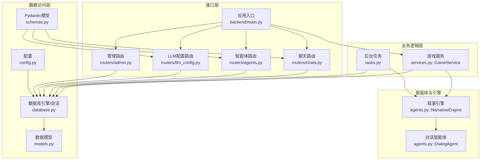
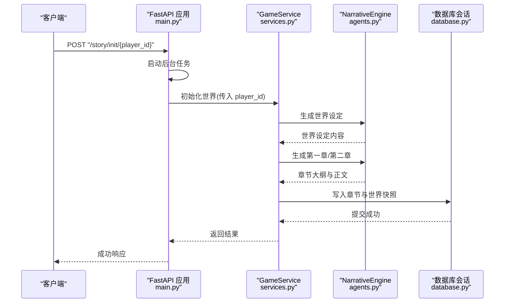
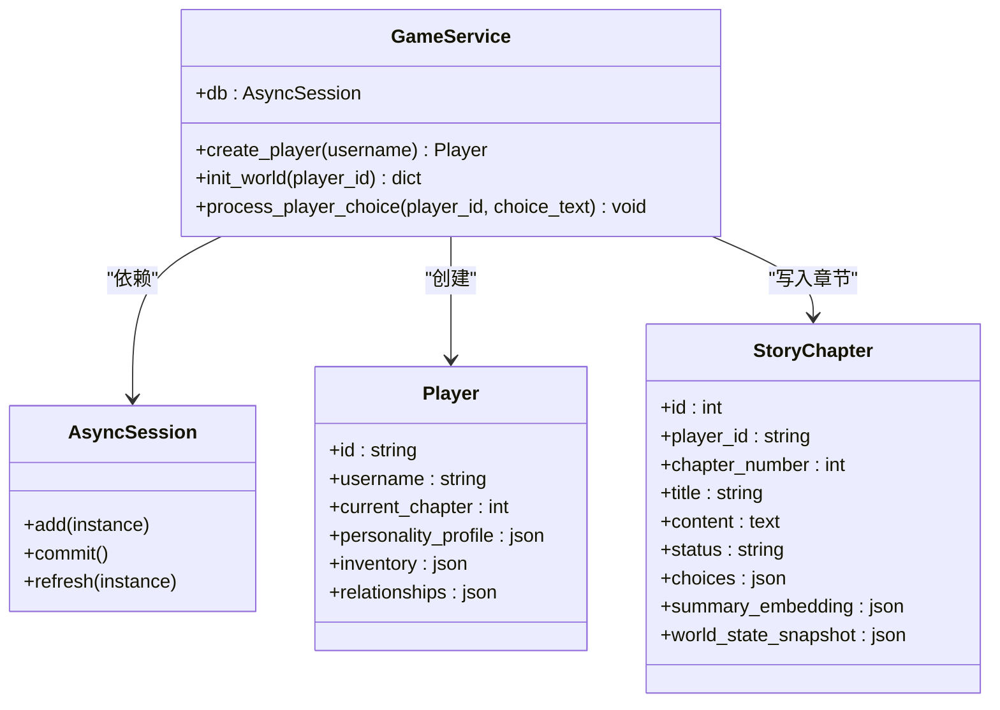
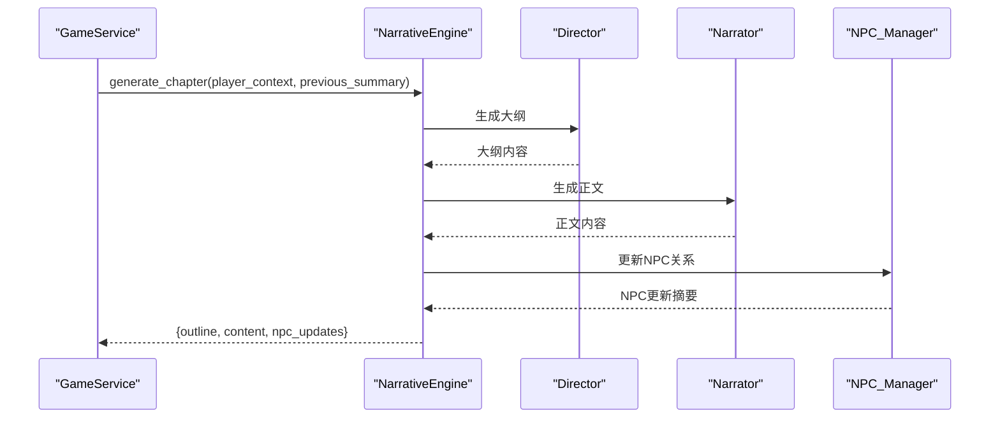
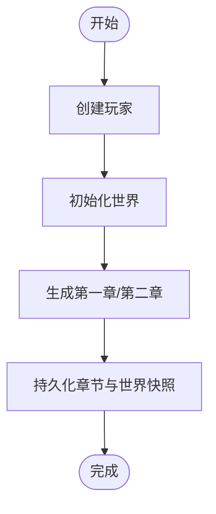
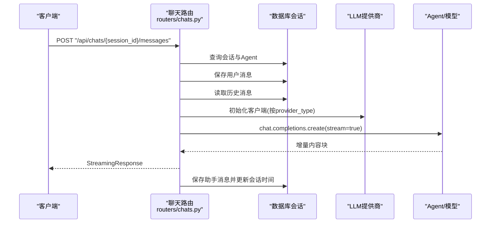
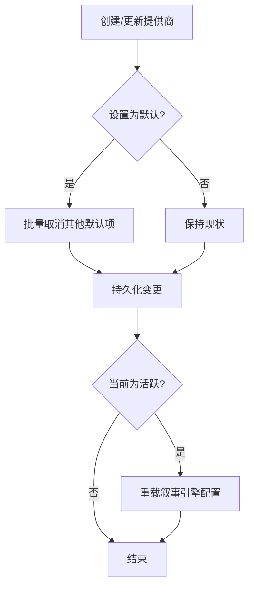
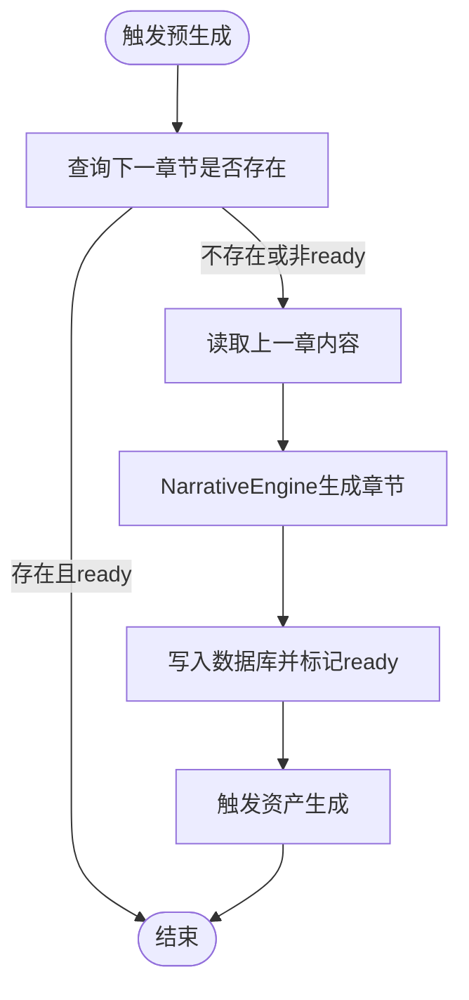
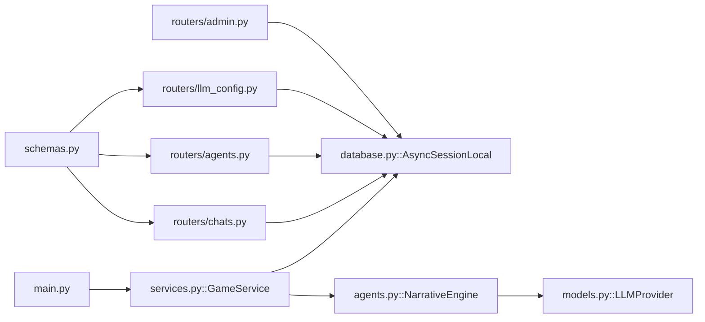

# 业务逻辑层

<cite>
**本文引用的文件列表**
- [backend/main.py](file://backend/main.py)
- [backend/services.py](file://backend/services.py)
- [backend/agents.py](file://backend/agents.py)
- [backend/tasks.py](file://backend/tasks.py)
- [backend/database.py](file://backend/database.py)
- [backend/models.py](file://backend/models.py)
- [backend/schemas.py](file://backend/schemas.py)
- [backend/routers/chats.py](file://backend/routers/chats.py)
- [backend/routers/agents.py](file://backend/routers/agents.py)
- [backend/routers/llm_config.py](file://backend/routers/llm_config.py)
- [backend/routers/admin.py](file://backend/routers/admin.py)
- [backend/config.py](file://backend/config.py)
</cite>

## 目录
1. [引言](#引言)
2. [项目结构](#项目结构)
3. [核心组件](#核心组件)
4. [架构总览](#架构总览)
5. [详细组件分析](#详细组件分析)
6. [依赖分析](#依赖分析)
7. [性能考量](#性能考量)
8. [故障排查指南](#故障排查指南)
9. [结论](#结论)
10. [附录](#附录)

## 引言
本指南聚焦于业务逻辑层，围绕 GameService 类的设计模式、方法职责划分与依赖注入机制展开，系统阐述玩家管理、故事生成、聊天处理与智能体协调的业务实现；并深入解析异步操作、事务管理与错误传播机制，给出业务规则验证、数据转换与 API 响应格式化的最佳实践，辅以可定位到源码路径的示例，帮助开发者正确实现业务逻辑与异常处理。

## 项目结构
后端采用 FastAPI + SQLAlchemy Async 的异步架构，业务逻辑集中在 services 层，配合 routers 提供 HTTP 接口，agents 定义叙事引擎与对话智能体，tasks 提供后台异步任务入口，database 与 models 定义数据模型与会话管理，schemas 提供 Pydantic 数据模型与校验。

图表来源
- [backend/main.py](file://backend/main.py#L30-L173)
- [backend/services.py](file://backend/services.py#L8-L66)
- [backend/agents.py](file://backend/agents.py#L43-L195)
- [backend/tasks.py](file://backend/tasks.py#L1-L62)
- [backend/database.py](file://backend/database.py#L1-L31)
- [backend/models.py](file://backend/models.py#L1-L122)
- [backend/schemas.py](file://backend/schemas.py#L1-L102)
- [backend/routers/chats.py](file://backend/routers/chats.py#L1-L275)
- [backend/routers/agents.py](file://backend/routers/agents.py#L1-L141)
- [backend/routers/llm_config.py](file://backend/routers/llm_config.py#L1-L203)
- [backend/routers/admin.py](file://backend/routers/admin.py#L1-L112)
- [backend/config.py](file://backend/config.py#L1-L34)

章节来源
- [backend/main.py](file://backend/main.py#L30-L173)
- [backend/database.py](file://backend/database.py#L1-L31)
- [backend/models.py](file://backend/models.py#L1-L122)
- [backend/schemas.py](file://backend/schemas.py#L1-L102)
- [backend/agents.py](file://backend/agents.py#L43-L195)
- [backend/services.py](file://backend/services.py#L8-L66)
- [backend/tasks.py](file://backend/tasks.py#L1-L62)
- [backend/routers/chats.py](file://backend/routers/chats.py#L1-L275)
- [backend/routers/agents.py](file://backend/routers/agents.py#L1-L141)
- [backend/routers/llm_config.py](file://backend/routers/llm_config.py#L1-L203)
- [backend/routers/admin.py](file://backend/routers/admin.py#L1-L112)
- [backend/config.py](file://backend/config.py#L1-L34)

## 核心组件
- GameService：封装玩家生命周期、世界初始化与故事章节生成的核心业务逻辑，负责与数据库会话与叙事引擎协作。
- NarrativeEngine：基于 AgentScope 的多智能体编排，负责章节大纲与正文生成、NPC状态更新等。
- DialogAgent：通用对话型智能体基类，承载记忆与消息格式化。
- 后台任务：章节预生成与资产生成的异步流程。
- 路由层：提供玩家创建、故事初始化、聊天会话与消息流式响应、智能体与 LLM 配置管理、后台统计与删除等接口。
- 数据层：Player、StoryChapter、Agent、LLMProvider、ChatSession、ChatMessage、Asset 等模型定义与 Pydantic Schema。

章节来源
- [backend/services.py](file://backend/services.py#L8-L66)
- [backend/agents.py](file://backend/agents.py#L11-L42)
- [backend/agents.py](file://backend/agents.py#L43-L195)
- [backend/tasks.py](file://backend/tasks.py#L1-L62)
- [backend/routers/chats.py](file://backend/routers/chats.py#L1-L275)
- [backend/routers/agents.py](file://backend/routers/agents.py#L1-L141)
- [backend/routers/llm_config.py](file://backend/routers/llm_config.py#L1-L203)
- [backend/routers/admin.py](file://backend/routers/admin.py#L1-L112)
- [backend/models.py](file://backend/models.py#L9-L122)
- [backend/schemas.py](file://backend/schemas.py#L1-L102)

## 架构总览
业务逻辑层通过依赖注入将 AsyncSession 注入 GameService，确保所有数据库操作在单次请求或任务内保持一致的事务上下文。NarrativeEngine 通过数据库加载当前活跃的 LLM 提供商配置，动态初始化模型与智能体，实现“运行时可切换”的叙事引擎。

图表来源
- [backend/main.py](file://backend/main.py#L147-L155)
- [backend/services.py](file://backend/services.py#L19-L59)
- [backend/agents.py](file://backend/agents.py#L154-L191)
- [backend/database.py](file://backend/database.py#L28-L31)

## 详细组件分析

### GameService 设计与职责
- 设计模式：服务对象模式，集中封装业务规则与跨实体操作；通过构造函数注入 AsyncSession，遵循依赖注入原则。
- 方法职责：
  - 创建玩家：创建 Player 实体并提交事务，刷新主键与时间戳。
  - 初始化世界：调用叙事引擎生成世界设定与初始章节，写入数据库并返回世界与章节摘要。
  - 处理玩家选择：预留扩展点，用于更新玩家状态、一致性检查与触发下一章节生成。
- 依赖注入：在 FastAPI 路由中通过依赖工厂 get_db 获取 AsyncSession，并注入 GameService。

图表来源
- [backend/services.py](file://backend/services.py#L8-L66)
- [backend/models.py](file://backend/models.py#L9-L44)

章节来源
- [backend/services.py](file://backend/services.py#L8-L66)
- [backend/main.py](file://backend/main.py#L138-L146)
- [backend/database.py](file://backend/database.py#L28-L31)
- [backend/models.py](file://backend/models.py#L9-L44)

### 叙事引擎与智能体协调
- NarrativeEngine：从数据库加载活跃 LLM 提供商，初始化模型与三个角色智能体（导演、旁白、NPC 管理器），对外提供章节生成能力。
- DialogAgent：统一的消息格式化与记忆维护，支持异步回复。
- 章节生成流程：导演先生成大纲，旁白根据大纲扩展为正文，NPC 管理器分析正文并更新 NPC 关系，最终返回三元组。

图表来源
- [backend/services.py](file://backend/services.py#L28-L58)
- [backend/agents.py](file://backend/agents.py#L154-L191)

章节来源
- [backend/agents.py](file://backend/agents.py#L43-L195)
- [backend/services.py](file://backend/services.py#L19-L59)

### 玩家管理与故事生成
- 玩家创建：路由层接收用户名，注入数据库会话，调用 GameService 创建玩家并返回标准化响应。
- 故事初始化：启动后台任务，使用独立会话实例化 GameService，生成世界设定与初始章节，写入数据库。
- 数据模型：Player 与 StoryChapter 承载玩家状态与章节内容、状态与世界快照等。

图表来源
- [backend/main.py](file://backend/main.py#L138-L155)
- [backend/services.py](file://backend/services.py#L12-L17)
- [backend/services.py](file://backend/services.py#L19-L59)

章节来源
- [backend/main.py](file://backend/main.py#L138-L155)
- [backend/models.py](file://backend/models.py#L9-L44)
- [backend/services.py](file://backend/services.py#L12-L17)
- [backend/services.py](file://backend/services.py#L19-L59)

### 聊天处理与流式响应
- 会话与消息：创建会话、列出会话、获取消息历史、发送消息。
- 流式生成：根据 Agent 的系统提示与历史消息构建消息数组，按提供商类型调用相应 SDK，逐块返回增量内容，最后保存助手消息并更新会话时间戳。
- 错误处理：捕获生成过程中的异常，记录日志并返回错误字符串，保证流式响应的健壮性。

图表来源
- [backend/routers/chats.py](file://backend/routers/chats.py#L72-L258)
- [backend/models.py](file://backend/models.py#L80-L99)

章节来源
- [backend/routers/chats.py](file://backend/routers/chats.py#L1-L275)
- [backend/models.py](file://backend/models.py#L80-L99)

### 智能体与 LLM 配置管理
- 智能体管理：创建、查询、更新、删除智能体，校验模型是否属于提供商可用模型列表。
- LLM 配置：创建/更新提供商时自动取消其他默认项；测试连接支持多种提供商类型；动态重载叙事引擎配置。
- 后台统计与清理：提供玩家与故事统计，删除玩家时清理关联资源。

图表来源
- [backend/routers/agents.py](file://backend/routers/agents.py#L15-L55)
- [backend/routers/llm_config.py](file://backend/routers/llm_config.py#L112-L138)
- [backend/routers/llm_config.py](file://backend/routers/llm_config.py#L160-L188)
- [backend/agents.py](file://backend/agents.py#L49-L99)

章节来源
- [backend/routers/agents.py](file://backend/routers/agents.py#L1-L141)
- [backend/routers/llm_config.py](file://backend/routers/llm_config.py#L1-L203)
- [backend/routers/admin.py](file://backend/routers/admin.py#L1-L112)
- [backend/agents.py](file://backend/agents.py#L49-L99)

### 后台任务与异步处理
- 章节预生成：检查下一章节是否存在且状态为 ready，否则根据上一章内容生成新章节并写入数据库，随后触发资产生成。
- 资产生成：根据章节内容提取场景/角色并调用外部图像生成 API（占位实现，待接入）。

图表来源
- [backend/tasks.py](file://backend/tasks.py#L7-L56)
- [backend/agents.py](file://backend/agents.py#L154-L191)

章节来源
- [backend/tasks.py](file://backend/tasks.py#L1-L62)
- [backend/agents.py](file://backend/agents.py#L154-L191)

## 依赖分析
- 控制反转与依赖注入：FastAPI 通过依赖工厂 get_db 提供 AsyncSession，GameService 在构造函数中接收该依赖，避免硬编码数据库连接。
- 路由到服务：main.py 中的路由函数创建 GameService 并调用其方法，确保每个请求拥有独立的服务实例与会话。
- 引擎与模型：NarrativeEngine 通过数据库加载 LLMProvider 并初始化 AgentScope 模型，支持运行时切换。
- 数据模型与 Schema：Pydantic Schema 用于请求/响应的数据校验与序列化，ORM 模型用于数据库映射。

图表来源
- [backend/main.py](file://backend/main.py#L36-L41)
- [backend/services.py](file://backend/services.py#L8-L11)
- [backend/database.py](file://backend/database.py#L19-L31)
- [backend/agents.py](file://backend/agents.py#L49-L99)
- [backend/models.py](file://backend/models.py#L58-L78)
- [backend/routers/chats.py](file://backend/routers/chats.py#L1-L20)
- [backend/routers/agents.py](file://backend/routers/agents.py#L1-L8)
- [backend/routers/llm_config.py](file://backend/routers/llm_config.py#L1-L13)
- [backend/routers/admin.py](file://backend/routers/admin.py#L1-L14)
- [backend/schemas.py](file://backend/schemas.py#L1-L102)

章节来源
- [backend/main.py](file://backend/main.py#L36-L41)
- [backend/services.py](file://backend/services.py#L8-L11)
- [backend/database.py](file://backend/database.py#L19-L31)
- [backend/agents.py](file://backend/agents.py#L49-L99)
- [backend/models.py](file://backend/models.py#L58-L78)
- [backend/routers/chats.py](file://backend/routers/chats.py#L1-L20)
- [backend/routers/agents.py](file://backend/routers/agents.py#L1-L8)
- [backend/routers/llm_config.py](file://backend/routers/llm_config.py#L1-L13)
- [backend/routers/admin.py](file://backend/routers/admin.py#L1-L14)
- [backend/schemas.py](file://backend/schemas.py#L1-L102)

## 性能考量
- 异步数据库：使用 SQLAlchemy AsyncSession 与异步引擎，避免阻塞事件循环，提升并发吞吐。
- 连接池与重连：启用 pool_pre_ping 与合理连接池参数，降低连接失效导致的失败率。
- 流式响应：聊天路由采用 StreamingResponse，边生成边返回，降低首字延迟与内存占用。
- 预生成策略：N+2 章节预生成结合后台任务，减少玩家等待时间。
- 缓存与去重：Asset 表的 content_hash 与 last_accessed 字段支持缓存与 LRU 策略，减少重复生成成本。

章节来源
- [backend/database.py](file://backend/database.py#L8-L23)
- [backend/routers/chats.py](file://backend/routers/chats.py#L144-L258)
- [backend/tasks.py](file://backend/tasks.py#L7-L56)
- [backend/models.py](file://backend/models.py#L45-L57)

## 故障排查指南
- 数据库连接失败：lifespan 中包含重试逻辑与 Alembic 升级，若仍失败检查 DATABASE_URL 与 .env 配置。
- LLM 配置未生效：确认 LLMProvider 是否为活跃且默认项，必要时通过 /api/admin/llm-providers/test-connection 测试连接。
- 聊天流式响应中断：检查提供商类型分支与 SDK 版本兼容性，关注日志中的 usage 与错误信息。
- WebSocket 交互：当前路由仅回显消息，实际业务逻辑需在回调中实现并注意异常捕获与关闭连接。
- 事务与一致性：所有写操作应在同一 AsyncSession 上提交，避免跨会话状态不一致；后台任务使用独立会话。

章节来源
- [backend/main.py](file://backend/main.py#L45-L82)
- [backend/routers/llm_config.py](file://backend/routers/llm_config.py#L20-L111)
- [backend/routers/chats.py](file://backend/routers/chats.py#L144-L258)
- [backend/main.py](file://backend/main.py#L157-L169)

## 结论
业务逻辑层通过清晰的职责划分与依赖注入，将玩家管理、故事生成、聊天处理与智能体协调整合为统一的服务层。借助异步数据库、流式响应与后台任务，系统在用户体验与性能之间取得平衡。建议后续完善一致性校验、NPC 行为分析与资产生成管线，并持续优化错误传播与可观测性。

## 附录

### 业务规则与数据转换最佳实践
- 输入校验：使用 Pydantic Schema 对请求体进行严格校验，避免脏数据进入业务层。
- 响应格式化：统一返回结构，错误时返回明确的状态码与错误信息，便于前端处理。
- 数据转换：在服务层进行必要的数据转换与聚合，保持路由层轻薄。
- 事务边界：将相关写操作置于同一事务中，失败时回滚，保证一致性。

章节来源
- [backend/schemas.py](file://backend/schemas.py#L1-L102)
- [backend/routers/chats.py](file://backend/routers/chats.py#L72-L258)
- [backend/main.py](file://backend/main.py#L138-L146)

### API 响应格式示例（路径定位）
- 玩家创建响应：参考 [backend/main.py](file://backend/main.py#L138-L146)
- 故事初始化响应：参考 [backend/main.py](file://backend/main.py#L147-L155)
- 聊天消息流式响应：参考 [backend/routers/chats.py](file://backend/routers/chats.py#L258-L258)