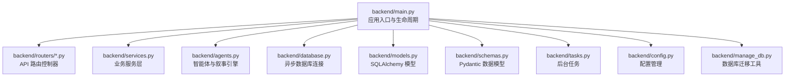
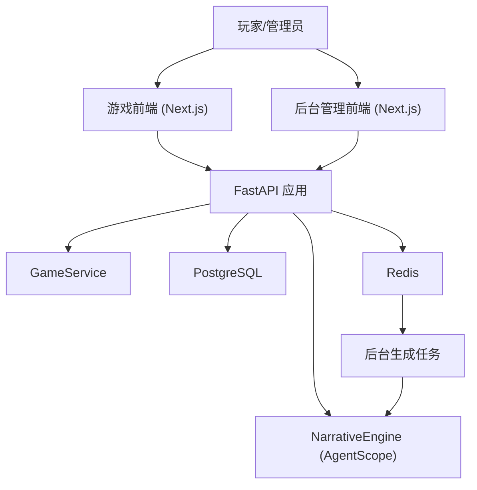
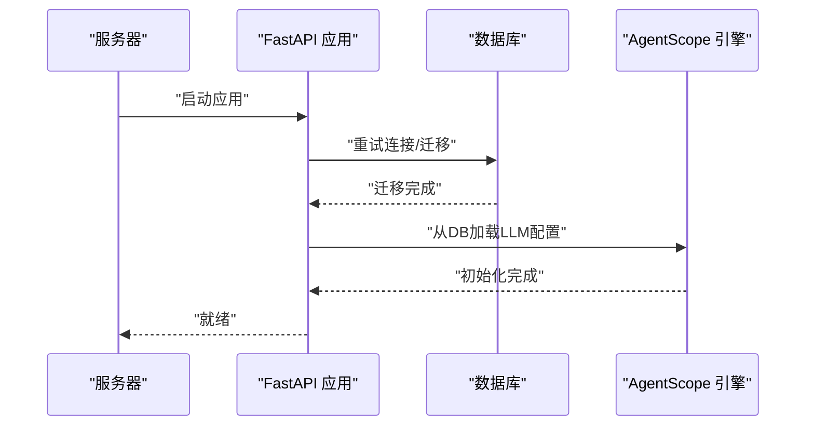
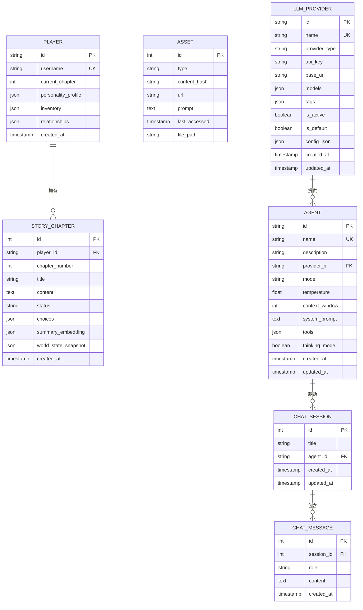
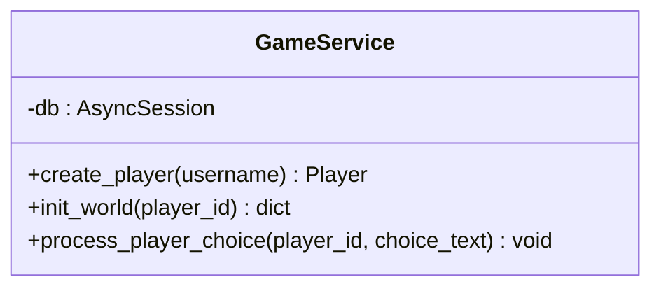
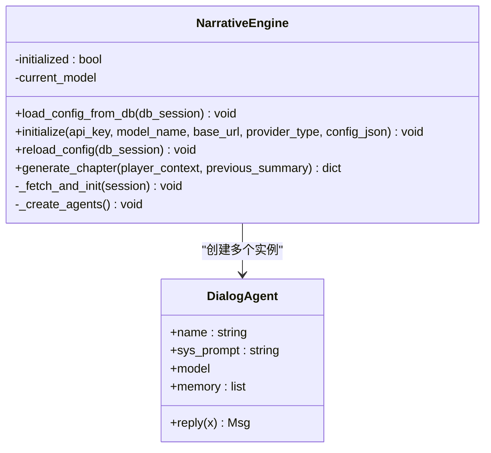
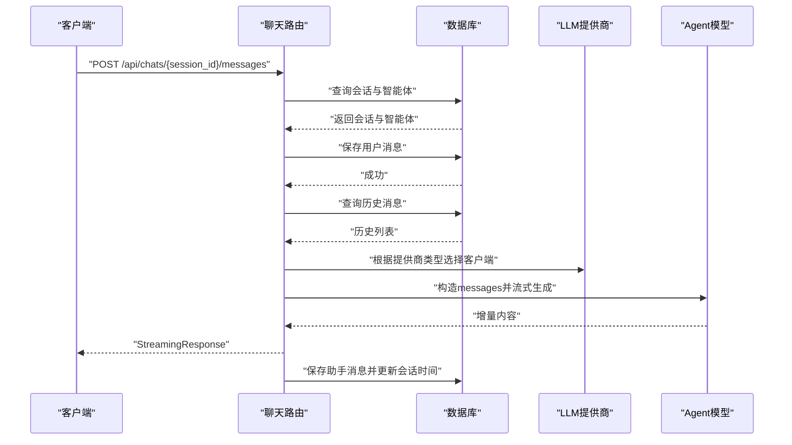
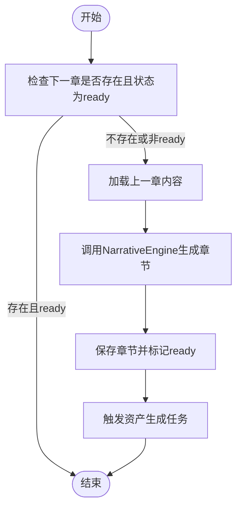
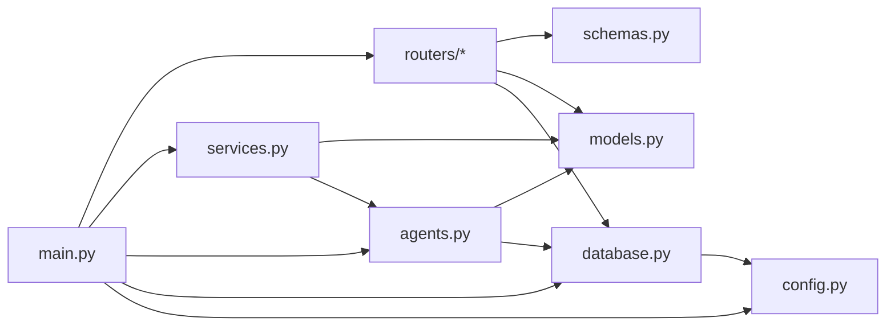

# 后端开发指南

<cite>
**本文引用的文件**
- [backend/main.py](file://backend/main.py)
- [backend/models.py](file://backend/models.py)
- [backend/database.py](file://backend/database.py)
- [backend/schemas.py](file://backend/schemas.py)
- [backend/services.py](file://backend/services.py)
- [backend/agents.py](file://backend/agents.py)
- [backend/config.py](file://backend/config.py)
- [backend/manage_db.py](file://backend/manage_db.py)
- [backend/tasks.py](file://backend/tasks.py)
- [backend/routers/agents.py](file://backend/routers/agents.py)
- [backend/routers/chats.py](file://backend/routers/chats.py)
- [backend/routers/admin.py](file://backend/routers/admin.py)
- [backend/routers/llm_config.py](file://backend/routers/llm_config.py)
- [docs/wiki/Backend-Guide.md](file://docs/wiki/Backend-Guide.md)
- [docs/wiki/Architecture.md](file://docs/wiki/Architecture.md)
- [README.md](file://README.md)
</cite>

## 目录
1. [简介](#简介)
2. [项目结构](#项目结构)
3. [核心组件](#核心组件)
4. [架构总览](#架构总览)
5. [详细组件分析](#详细组件分析)
6. [依赖关系分析](#依赖关系分析)
7. [性能考虑](#性能考虑)
8. [故障排查指南](#故障排查指南)
9. [结论](#结论)
10. [附录](#附录)

## 简介
本指南面向后端开发人员，系统讲解基于 FastAPI 的后端应用结构、API 路由设计原则与控制器实现模式；深入解析数据库模型设计、SQLAlchemy 异步 ORM 使用与数据访问层实现；阐述业务逻辑层的设计模式、服务类职责划分与依赖注入机制；重点介绍基于 AgentScope 的多智能体引擎实现、智能体生命周期管理与协作机制；并提供错误处理策略、性能优化技巧与安全最佳实践，辅以具体代码片段路径与常见问题解决方案。

## 项目结构
后端采用分层清晰的目录组织：入口文件负责应用生命周期与路由注册，routers 提供 API 控制器，models 定义数据模型，schemas 负责请求/响应校验，services 封装业务逻辑，agents 集成智能体引擎，tasks 提供后台任务，database 管理异步连接，config 提供配置，manage_db 提供迁移工具。

图表来源
- [backend/main.py](file://backend/main.py#L83-L98)
- [backend/routers/agents.py](file://backend/routers/agents.py#L1-L141)
- [backend/routers/chats.py](file://backend/routers/chats.py#L1-L275)
- [backend/routers/admin.py](file://backend/routers/admin.py#L1-L112)
- [backend/routers/llm_config.py](file://backend/routers/llm_config.py#L1-L203)
- [backend/services.py](file://backend/services.py#L1-L66)
- [backend/agents.py](file://backend/agents.py#L1-L196)
- [backend/database.py](file://backend/database.py#L1-L31)
- [backend/models.py](file://backend/models.py#L1-L122)
- [backend/schemas.py](file://backend/schemas.py#L1-L102)
- [backend/tasks.py](file://backend/tasks.py#L1-L62)
- [backend/config.py](file://backend/config.py#L1-L34)
- [backend/manage_db.py](file://backend/manage_db.py#L1-L67)

章节来源
- [README.md](file://README.md#L34-L51)
- [docs/wiki/Backend-Guide.md](file://docs/wiki/Backend-Guide.md#L3-L21)

## 核心组件
- 应用入口与生命周期：负责日志配置、CORS、数据库连接与迁移、智能体配置加载、路由注册与根端点。
- 数据库层：异步引擎、会话工厂、基础模型基类与依赖注入。
- 数据模型：玩家、章节、资产、LLM 提供商、聊天会话与消息、智能体。
- 数据验证：Pydantic 模型，覆盖创建、更新、查询与响应格式。
- 业务服务：GameService 封装玩家创建、世界初始化、章节生成与选择处理。
- 智能体引擎：NarrativeEngine 基于 AgentScope 的多智能体编排，支持动态配置加载与章节生成。
- 路由控制器：提供 LLM 供应商管理、聊天会话与消息、后台统计与玩家管理、智能体 CRUD。
- 后台任务：章节预生成与资产生成流水线。
- 配置与迁移：统一配置读取与 Alembic 迁移工具。

章节来源
- [backend/main.py](file://backend/main.py#L13-L28)
- [backend/main.py](file://backend/main.py#L45-L82)
- [backend/database.py](file://backend/database.py#L1-L31)
- [backend/models.py](file://backend/models.py#L9-L122)
- [backend/schemas.py](file://backend/schemas.py#L1-L102)
- [backend/services.py](file://backend/services.py#L8-L66)
- [backend/agents.py](file://backend/agents.py#L43-L196)
- [backend/routers/llm_config.py](file://backend/routers/llm_config.py#L1-L203)
- [backend/routers/chats.py](file://backend/routers/chats.py#L1-L275)
- [backend/routers/admin.py](file://backend/routers/admin.py#L1-L112)
- [backend/routers/agents.py](file://backend/routers/agents.py#L1-L141)
- [backend/tasks.py](file://backend/tasks.py#L1-L62)
- [backend/config.py](file://backend/config.py#L1-L34)
- [backend/manage_db.py](file://backend/manage_db.py#L1-L67)

## 架构总览
系统采用前后端分离与后台管理的三层架构：前端 Next.js 通过 HTTP/WebSocket 与后端 FastAPI 通信；后端通过 AgentScope 编排多智能体生成内容；数据持久化使用 PostgreSQL，Redis 用于任务队列与缓存；后台管理通过独立前端提供可视化运维能力。

图表来源
- [docs/wiki/Architecture.md](file://docs/wiki/Architecture.md#L7-L36)
- [backend/main.py](file://backend/main.py#L83-L98)
- [backend/agents.py](file://backend/agents.py#L43-L196)
- [backend/services.py](file://backend/services.py#L8-L66)
- [backend/tasks.py](file://backend/tasks.py#L1-L62)

## 详细组件分析

### FastAPI 应用与生命周期
- 生命周期钩子：启动时重试数据库连接、执行 Alembic 升级、从数据库加载 LLM 配置到智能体引擎。
- CORS 配置：允许本地开发跨域访问。
- 路由注册：注册 LLM 配置、后台管理、智能体、聊天相关路由。
- 根端点与示例接口：提供根消息、创建玩家、故事初始化（后台任务）、WebSocket 接入点。
- 日志策略：抑制 SQLAlchemy 与 Uvicorn 访问日志，保留应用日志。

图表来源
- [backend/main.py](file://backend/main.py#L45-L82)
- [backend/agents.py](file://backend/agents.py#L49-L76)

章节来源
- [backend/main.py](file://backend/main.py#L13-L28)
- [backend/main.py](file://backend/main.py#L83-L98)
- [backend/main.py](file://backend/main.py#L128-L173)

### 数据库模型与异步 ORM
- 异步引擎与会话：使用 aiopg/sqlite 异步驱动，连接池配置，会话过期策略。
- 基类与依赖：统一的 DeclarativeBase，依赖注入 get_db 提供 AsyncSession。
- 模型设计要点：
  - Player：UUID 主键、唯一索引、JSON 字段保存偏好与关系。
  - StoryChapter：章节状态机、分支选择、向量摘要与世界快照。
  - Asset：类型、内容哈希、URL、提示词与访问时间。
  - LLMProvider：名称唯一、类型、密钥、模型列表、标签、是否默认/激活、额外配置。
  - ChatSession/ChatMessage：会话与消息，含角色与时间戳。
  - Agent：名称唯一、提供商关联、温度、上下文窗口、系统提示、工具与思考模式。

图表来源
- [backend/models.py](file://backend/models.py#L9-L122)

章节来源
- [backend/database.py](file://backend/database.py#L1-L31)
- [backend/models.py](file://backend/models.py#L1-L122)

### 数据验证与序列化
- LLMProviderCreate/Update/Response：字段约束、默认值与 JSON 结构。
- AgentCreate/Update/Response：长度限制、数值范围、系统提示与工具列表。
- ChatSession/ChatMessage：基础字段与响应模型配置 from_attributes。
- 用途：路由层请求校验与响应序列化，保证 API 输入输出一致。

章节来源
- [backend/schemas.py](file://backend/schemas.py#L1-L102)

### 业务服务层（GameService）
- 职责边界：封装与数据库交互的业务流程，不直接处理路由细节。
- 核心方法：
  - create_player：创建玩家并刷新主键。
  - init_world：通过 NarrativeEngine 生成世界观与前两章，保存至数据库。
  - process_player_choice：占位，后续扩展为一致性校验与章节推进。
- 依赖注入：构造函数接收 AsyncSession，确保事务与作用域可控。

图表来源
- [backend/services.py](file://backend/services.py#L8-L66)

章节来源
- [backend/services.py](file://backend/services.py#L1-L66)

### 智能体引擎与多智能体协作（AgentScope）
- NarrativeEngine：
  - 加载配置：从数据库或环境变量初始化当前模型，创建 Director/Narrator/NPC_Manager。
  - 动态重载：当 LLM 提供商变更时可触发 reload_config。
  - 章节生成：协调三个智能体产出大纲、正文与 NPC 更新。
- DialogAgent：继承 AgentBase，维护记忆，组装 messages 调用模型，记录回复。
- 生命周期：懒加载，首次使用时才初始化；支持运行时切换提供商。

图表来源
- [backend/agents.py](file://backend/agents.py#L43-L196)

章节来源
- [backend/agents.py](file://backend/agents.py#L1-L196)

### API 路由设计与控制器实现
- LLM 配置管理（/api/admin/llm-providers）：
  - 测试连接：根据 provider_type 动态选择模型，发起一次对话测试。
  - CRUD：名称唯一性校验、默认提供商互斥、激活时触发引擎重载。
- 后台管理（/api/admin）：
  - 统计与玩家列表：聚合统计、分页查询。
  - 删除玩家：删除玩家与其故事（可扩展级联）。
  - 故事列表：支持按玩家过滤。
- 智能体管理（/api/agents）：
  - 创建：名称唯一、提供商存在、模型在提供商列表中。
  - 列表/详情/更新：搜索、分页、条件更新与唯一性校验。
  - 删除：审计打印并删除。
- 聊天（/api/chats）：
  - 会话：校验智能体存在、创建会话。
  - 消息：保存用户消息、准备历史、按提供商类型调用流式接口、保存助手回复、更新会话时间戳。
  - 列表/删除：按会话查询消息、删除会话并清理消息。

图表来源
- [backend/routers/chats.py](file://backend/routers/chats.py#L72-L258)

章节来源
- [backend/routers/llm_config.py](file://backend/routers/llm_config.py#L1-L203)
- [backend/routers/admin.py](file://backend/routers/admin.py#L1-L112)
- [backend/routers/agents.py](file://backend/routers/agents.py#L1-L141)
- [backend/routers/chats.py](file://backend/routers/chats.py#L1-L275)

### 后台任务与预生成策略
- 预生成下一章：避免用户等待，提前生成 N+2 章节，状态为 ready。
- 资产生成：章节内容分析后触发图像/音频生成，结果入库。
- 任务触发：可由定时器或事件驱动，当前示例展示异步会话内生成流程。

图表来源
- [backend/tasks.py](file://backend/tasks.py#L7-L56)

章节来源
- [backend/tasks.py](file://backend/tasks.py#L1-L62)

### 错误处理策略
- 路由层：对未找到、重复名称、模型不可用等场景抛出 HTTPException。
- 业务层：捕获异常并转为 HTTP 400，返回错误详情。
- WebSocket：异常记录并关闭连接，避免进程挂起。
- 日志：精细级别控制，屏蔽噪声日志，保留关键信息。

章节来源
- [backend/routers/agents.py](file://backend/routers/agents.py#L18-L50)
- [backend/routers/chats.py](file://backend/routers/chats.py#L211-L216)
- [backend/main.py](file://backend/main.py#L166-L169)

### 性能优化技巧
- 异步 I/O：数据库与外部 LLM 调用均使用异步，避免阻塞。
- 连接池：合理设置 pool_size 与 max_overflow，启用 pool_pre_ping。
- 流式响应：聊天接口使用 StreamingResponse，降低首字节延迟。
- 预生成策略：N+2 章节预生成，结合 Redis 队列异步执行。
- 缓存与去重：资产内容哈希去重，LRU 清理策略。

章节来源
- [backend/database.py](file://backend/database.py#L8-L23)
- [backend/routers/chats.py](file://backend/routers/chats.py#L113-L258)
- [backend/tasks.py](file://backend/tasks.py#L57-L62)

### 安全最佳实践
- CORS：仅允许受控域名，避免通配符暴露。
- API 密钥：LLM 提供商密钥存储在数据库中，建议加密或使用密钥管理服务。
- 输入校验：Pydantic 模型严格字段约束，防止越界与注入。
- 默认提供商：更新默认时互斥其他默认项，避免误配置。
- 审计日志：删除操作打印审计信息，便于追踪。

章节来源
- [backend/main.py](file://backend/main.py#L85-L91)
- [backend/routers/llm_config.py](file://backend/routers/llm_config.py#L122-L127)
- [backend/routers/agents.py](file://backend/routers/agents.py#L135-L137)

## 依赖关系分析
- 组件耦合：
  - main.py 依赖 routers、services、agents、database，形成高层控制与低层实现的清晰分层。
  - services 依赖 models 与 agents，承担业务编排。
  - routers 依赖 schemas、models、database，负责请求处理与数据持久化。
  - agents 依赖 database 与 models，动态加载配置。
- 外部依赖：
  - AgentScope：多智能体模型与消息协议。
  - SQLAlchemy 异步 ORM：数据库抽象与查询。
  - FastAPI：路由、依赖注入、响应模型。
  - Alembic：数据库迁移。

图表来源
- [backend/main.py](file://backend/main.py#L30-L42)
- [backend/services.py](file://backend/services.py#L1-L11)
- [backend/agents.py](file://backend/agents.py#L1-L10)
- [backend/routers/llm_config.py](file://backend/routers/llm_config.py#L1-L12)
- [backend/routers/chats.py](file://backend/routers/chats.py#L1-L14)
- [backend/routers/admin.py](file://backend/routers/admin.py#L1-L8)
- [backend/routers/agents.py](file://backend/routers/agents.py#L1-L7)
- [backend/database.py](file://backend/database.py#L1-L4)
- [backend/config.py](file://backend/config.py#L1-L34)

章节来源
- [backend/main.py](file://backend/main.py#L30-L42)
- [backend/services.py](file://backend/services.py#L1-L11)
- [backend/agents.py](file://backend/agents.py#L1-L10)
- [backend/routers/llm_config.py](file://backend/routers/llm_config.py#L1-L12)
- [backend/routers/chats.py](file://backend/routers/chats.py#L1-L14)
- [backend/routers/admin.py](file://backend/routers/admin.py#L1-L8)
- [backend/routers/agents.py](file://backend/routers/agents.py#L1-L7)
- [backend/database.py](file://backend/database.py#L1-L4)
- [backend/config.py](file://backend/config.py#L1-L34)

## 性能考虑
- 异步优先：数据库与外部 API 调用全部采用异步，避免阻塞事件循环。
- 连接池与超时：合理配置连接池大小与 pre_ping，提升稳定性。
- 流式输出：聊天接口使用流式响应，改善用户体验。
- 预生成与缓存：章节与资产预生成，减少实时计算压力。
- 分页与索引：列表接口使用分页与数据库索引，避免全表扫描。

## 故障排查指南
- 数据库连接失败：检查 DATABASE_URL、网络与权限；查看启动日志重试次数。
- 迁移失败：确认 Alembic 环境与 Python 解释器路径；使用 manage_db 工具手动升级。
- LLM 连接失败：核对 provider_type、base_url、api_key；使用测试连接接口验证。
- WebSocket 异常：捕获异常并记录，确保连接最终关闭，避免资源泄漏。
- 智能体未初始化：确认数据库存在激活的 LLM 提供商；检查 reload_config 触发时机。

章节来源
- [backend/main.py](file://backend/main.py#L48-L74)
- [backend/manage_db.py](file://backend/manage_db.py#L20-L39)
- [backend/routers/llm_config.py](file://backend/routers/llm_config.py#L20-L111)
- [backend/routers/chats.py](file://backend/routers/chats.py#L211-L216)
- [backend/agents.py](file://backend/agents.py#L49-L76)

## 结论
本项目以 FastAPI 为核心，结合 AgentScope 的多智能体编排与 PostgreSQL/Redis 的数据与任务体系，实现了可扩展的无限剧情游戏后端。通过清晰的分层设计、严格的依赖注入与完善的错误处理，既满足开发效率又兼顾运行时性能。建议在生产环境中进一步完善密钥管理、监控告警与自动化测试，持续演进智能体协作与内容生成策略。

## 附录
- 快速开始与迁移指南参见项目 README 与 Wiki 文档。
- 数据库迁移工具使用方式与命令行参数详见 manage_db。

章节来源
- [README.md](file://README.md#L53-L101)
- [docs/wiki/Backend-Guide.md](file://docs/wiki/Backend-Guide.md#L102-L108)
- [backend/manage_db.py](file://backend/manage_db.py#L40-L67)