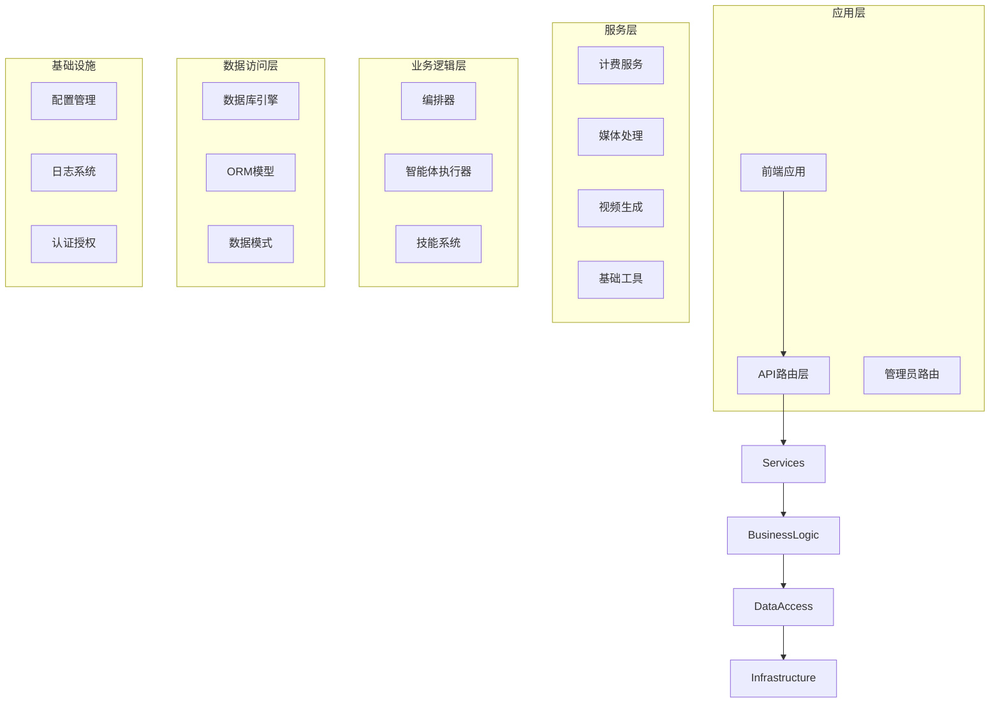
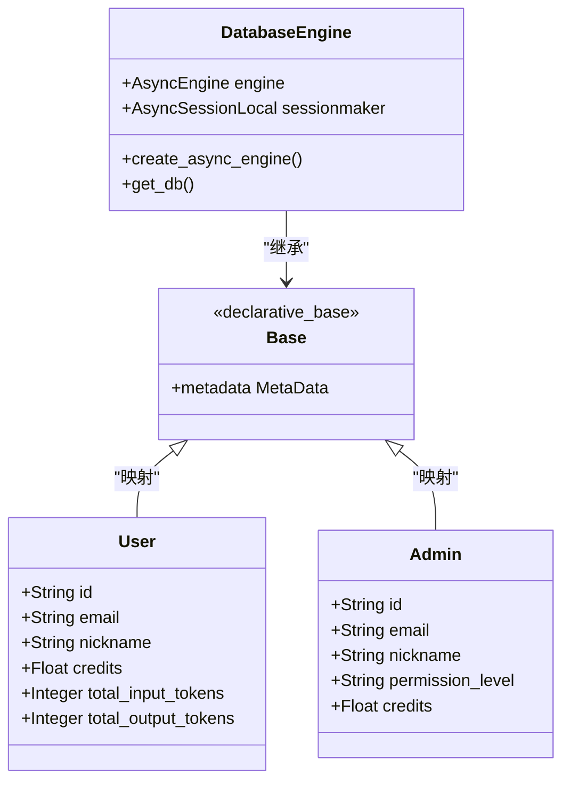
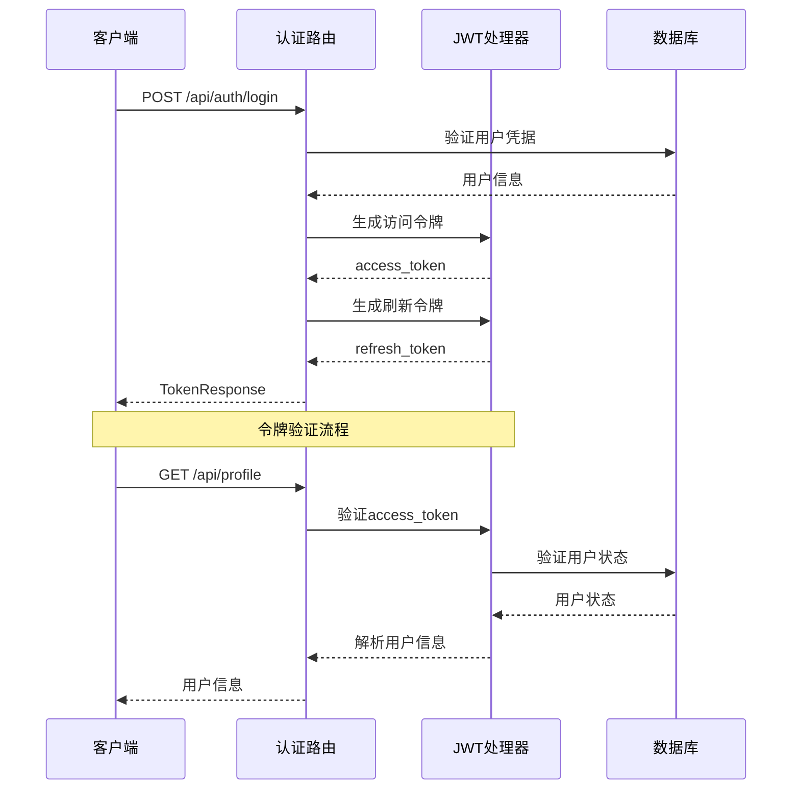
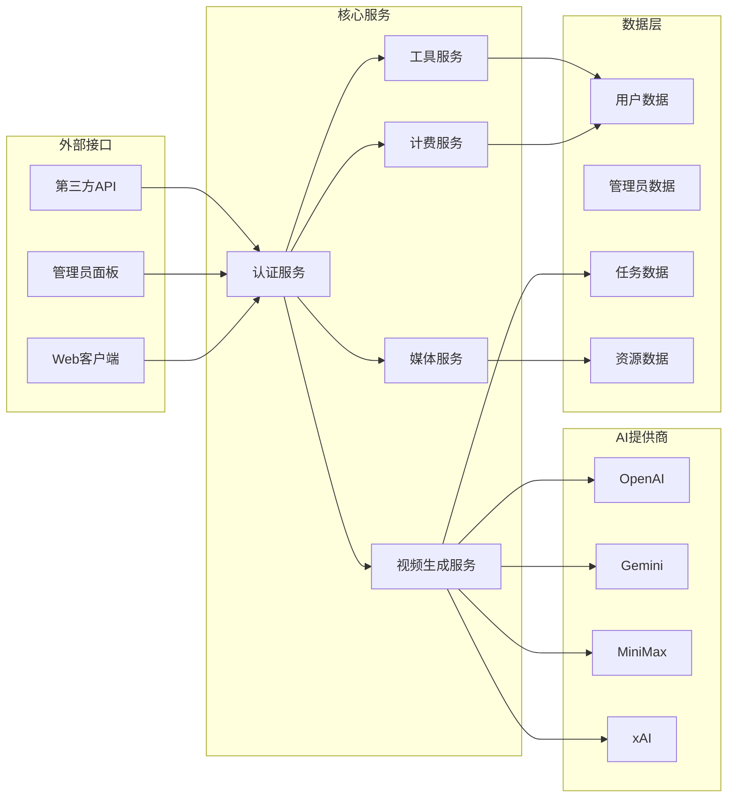
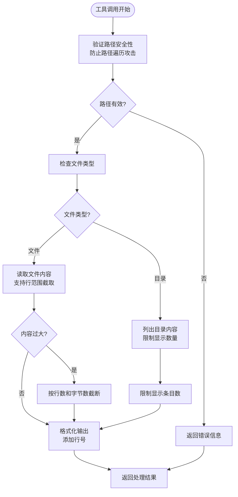
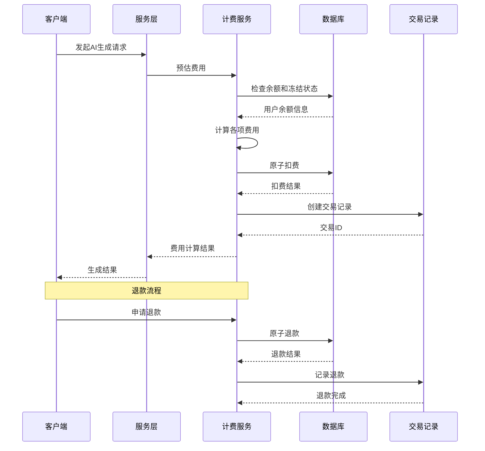
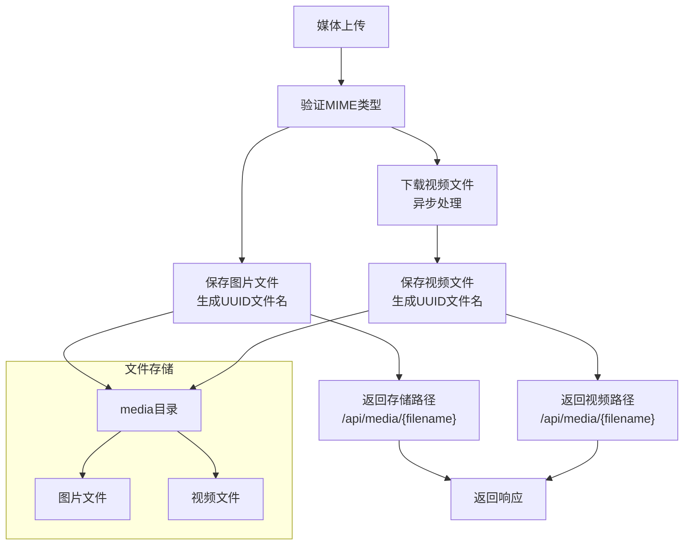
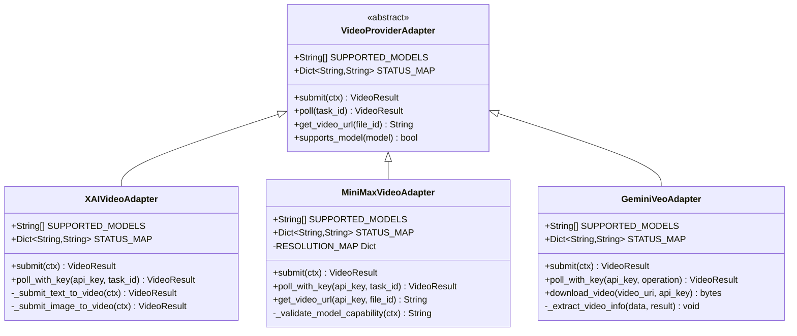
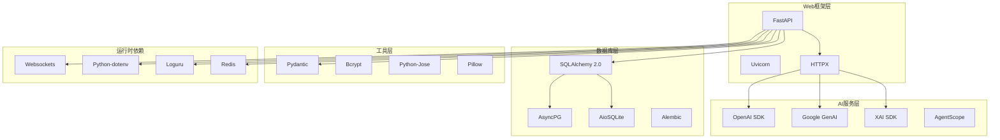

# 基础工具服务

<cite>
**本文档引用的文件**
- [main.py](file://backend/main.py)
- [config.py](file://backend/config.py)
- [database.py](file://backend/database.py)
- [models.py](file://backend/models.py)
- [schemas.py](file://backend/schemas.py)
- [base_tools.py](file://backend/services/base_tools.py)
- [billing.py](file://backend/services/billing.py)
- [media_utils.py](file://backend/services/media_utils.py)
- [video_generation.py](file://backend/services/video_generation.py)
- [admin.py](file://backend/routers/admin.py)
- [base.py](file://backend/services/video_providers/base.py)
- [xai_provider.py](file://backend/services/video_providers/xai_provider.py)
- [minimax_provider.py](file://backend/services/video_providers/minimax_provider.py)
- [gemini_provider.py](file://backend/services/video_providers/gemini_provider.py)
- [requirements.txt](file://backend/requirements.txt)
</cite>

## 目录
1. [简介](#简介)
2. [项目结构](#项目结构)
3. [核心组件](#核心组件)
4. [架构概览](#架构概览)
5. [详细组件分析](#详细组件分析)
6. [依赖分析](#依赖分析)
7. [性能考虑](#性能考虑)
8. [故障排除指南](#故障排除指南)
9. [结论](#结论)

## 简介

无限游戏项目是一个基于FastAPI的AI创意平台，提供了完整的视频生成、智能体协作和内容创作功能。该项目的核心是"基础工具服务"，这些服务为整个系统提供了基础设施支持，包括数据库管理、认证授权、计费系统、媒体处理和视频生成等关键功能。

该项目采用现代化的异步架构设计，支持多种AI模型提供商，具备完善的权限管理和计费系统，能够处理复杂的多智能体协作场景。

## 项目结构

项目采用清晰的分层架构，主要分为以下几个层次：



**图表来源**
- [main.py:110-149](file://backend/main.py#L110-L149)
- [database.py:1-31](file://backend/database.py#L1-L31)

**章节来源**
- [main.py:1-170](file://backend/main.py#L1-L170)
- [config.py:1-43](file://backend/config.py#L1-L43)

## 核心组件

### 数据库管理系统

系统采用SQLAlchemy异步ORM框架，支持SQLite和PostgreSQL两种数据库后端：



**图表来源**
- [database.py:1-31](file://backend/database.py#L1-L31)
- [models.py:35-73](file://backend/models.py#L35-L73)
- [models.py:10-33](file://backend/models.py#L10-L33)

### 认证授权系统

系统实现了双重认证机制，支持用户和管理员两个角色：



**图表来源**
- [main.py:136-148](file://backend/main.py#L136-L148)
- [models.py:35-73](file://backend/models.py#L35-L73)

**章节来源**
- [database.py:1-31](file://backend/database.py#L1-L31)
- [models.py:1-408](file://backend/models.py#L1-L408)
- [schemas.py:1-740](file://backend/schemas.py#L1-L740)

## 架构概览

系统采用模块化设计，各个组件通过清晰的接口进行交互：



**图表来源**
- [main.py:135-149](file://backend/main.py#L135-L149)
- [video_generation.py:47-75](file://backend/services/video_generation.py#L47-L75)

## 详细组件分析

### 基础工具服务

基础工具服务提供了智能体执行环境中的基本操作能力：



**图表来源**
- [base_tools.py:25-98](file://backend/services/base_tools.py#L25-L98)
- [base_tools.py:100-129](file://backend/services/base_tools.py#L100-L129)

该服务的主要特点：
- **安全性**：内置路径遍历防护机制
- **效率性**：支持大文件分段读取和内容截断
- **易用性**：提供简洁的OpenAI格式工具定义

**章节来源**
- [base_tools.py:1-217](file://backend/services/base_tools.py#L1-L217)

### 计费系统

计费系统实现了多维度的积分扣费机制：



**图表来源**
- [billing.py:45-94](file://backend/services/billing.py#L45-L94)
- [billing.py:187-335](file://backend/services/billing.py#L187-L335)

计费系统的特色功能：
- **多维度计费**：支持文本、图像、搜索等多种计费维度
- **原子操作**：使用数据库事务确保扣费的原子性
- **灵活扩展**：支持视频生成等新业务的计费需求

**章节来源**
- [billing.py:1-414](file://backend/services/billing.py#L1-L414)

### 媒体处理服务

媒体处理服务负责图片和视频的本地存储和管理：



**图表来源**
- [media_utils.py:20-28](file://backend/services/media_utils.py#L20-L28)
- [media_utils.py:31-50](file://backend/services/media_utils.py#L31-L50)

**章节来源**
- [media_utils.py:1-51](file://backend/services/media_utils.py#L1-L51)

### 视频生成服务

视频生成服务提供了统一的多供应商适配器接口：



**图表来源**
- [base.py:49-114](file://backend/services/video_providers/base.py#L49-L114)
- [xai_provider.py:22-46](file://backend/services/video_providers/xai_provider.py#L22-L46)
- [minimax_provider.py:30-51](file://backend/services/video_providers/minimax_provider.py#L30-L51)
- [gemini_provider.py:31-56](file://backend/services/video_providers/gemini_provider.py#L31-L56)

**章节来源**
- [video_generation.py:1-160](file://backend/services/video_generation.py#L1-L160)
- [base.py:1-114](file://backend/services/video_providers/base.py#L1-L114)
- [xai_provider.py:1-164](file://backend/services/video_providers/xai_provider.py#L1-L164)
- [minimax_provider.py:1-318](file://backend/services/video_providers/minimax_provider.py#L1-L318)
- [gemini_provider.py:1-276](file://backend/services/video_providers/gemini_provider.py#L1-L276)

### 管理员路由系统

管理员路由系统提供了完整的后台管理功能：

```mermaid
graph TB
subgraph "管理员管理"
AdminStats[统计信息]
AdminUsers[用户管理]
AdminCredits[积分管理]
AdminSubscriptions[订阅管理]
AdminAdmins[管理员管理]
end
subgraph "剧场管理"
TheaterList[剧场列表]
TheaterDetail[剧场详情]
end
subgraph "系统监控"
SystemAssets[资源监控]
SystemProviders[提供商监控]
end
AdminStats --> StatsAPI[/api/admin/stats]
AdminUsers --> UsersAPI[/api/admin/users]
AdminCredits --> CreditsAPI[/api/admin/users/{id}/credits]
AdminSubscriptions --> SubAPI[/api/admin/users/{id}/subscription]
AdminAdmins --> AdminsAPI[/api/admin/admins]
TheaterList --> TheaterAPI[/api/admin/theaters]
UsersAPI --> CRUD[CRUD操作]
CreditsAPI --> Adjust[积分调整]
SubAPI --> Assign[订阅分配]
AdminsAPI --> Manage[管理员管理]
```

**图表来源**
- [admin.py:29-47](file://backend/routers/admin.py#L29-L47)
- [admin.py:53-83](file://backend/routers/admin.py#L53-L83)

**章节来源**
- [admin.py:1-501](file://backend/routers/admin.py#L1-L501)

## 依赖分析

项目的核心依赖关系如下：



**图表来源**
- [requirements.txt:1-28](file://backend/requirements.txt#L1-L28)

**章节来源**
- [requirements.txt:1-28](file://backend/requirements.txt#L1-L28)

## 性能考虑

### 数据库性能优化

系统采用了多项数据库性能优化策略：

1. **连接池配置**：使用异步连接池，支持动态连接数调整
2. **预连接检查**：启用pool_pre_ping确保连接有效性
3. **索引优化**：为常用查询字段建立索引
4. **查询优化**：使用批量操作减少数据库往返

### 异步处理优化

1. **非阻塞I/O**：所有网络请求使用异步HTTP客户端
2. **并发控制**：合理设置连接池大小和超时时间
3. **内存管理**：大文件处理时采用流式读取
4. **缓存策略**：Redis用于热点数据缓存

### API性能监控

系统集成了详细的性能监控机制：

- **请求跟踪**：记录每个API请求的处理时间和错误
- **数据库查询**：监控慢查询和连接使用情况
- **AI服务调用**：跟踪模型调用次数和响应时间
- **资源使用**：监控内存和CPU使用情况

## 故障排除指南

### 常见问题及解决方案

#### 数据库连接问题
- **症状**：启动时数据库连接失败
- **原因**：SQLite文件权限或PostgreSQL配置错误
- **解决**：检查数据库URL配置和文件权限

#### 认证失败
- **症状**：用户登录失败或令牌验证错误
- **原因**：JWT密钥配置错误或过期
- **解决**：重新生成JWT密钥并更新配置

#### 视频生成失败
- **症状**：视频生成任务长时间处于pending状态
- **原因**：AI提供商API密钥错误或配额不足
- **解决**：检查API密钥配置和提供商账户状态

#### 计费异常
- **症状**：积分扣费失败或余额不正确
- **原因**：并发操作导致的竞态条件
- **解决**：使用数据库事务确保原子性操作

**章节来源**
- [main.py:49-108](file://backend/main.py#L49-L108)
- [billing.py:225-305](file://backend/services/billing.py#L225-L305)

## 结论

基础工具服务为无限游戏项目提供了坚实的基础设施支撑。通过模块化的架构设计和完善的错误处理机制，系统能够稳定地支持复杂的AI创意应用场景。

主要优势包括：
- **模块化设计**：清晰的职责分离便于维护和扩展
- **异步架构**：高效的并发处理能力
- **安全机制**：多层次的安全防护措施
- **监控完善**：全面的性能和错误监控
- **扩展性强**：支持新功能和服务的快速集成

未来可以考虑的改进方向：
- 增加更多的AI提供商支持
- 优化大规模并发场景的性能
- 加强数据备份和恢复机制
- 扩展更多类型的媒体处理能力