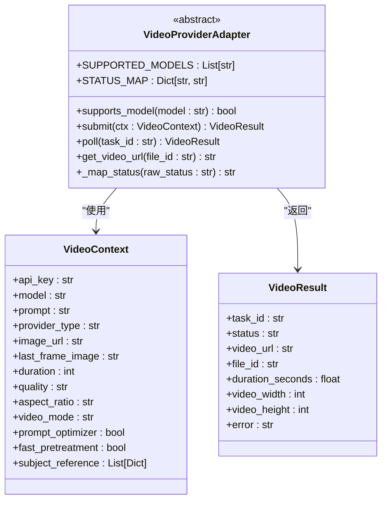
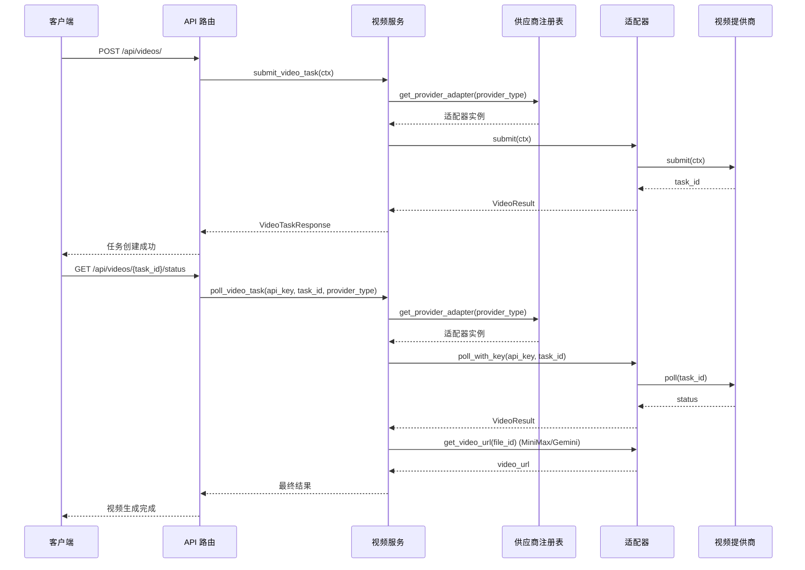
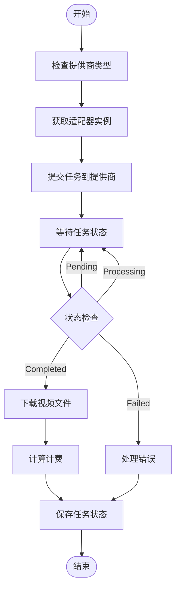
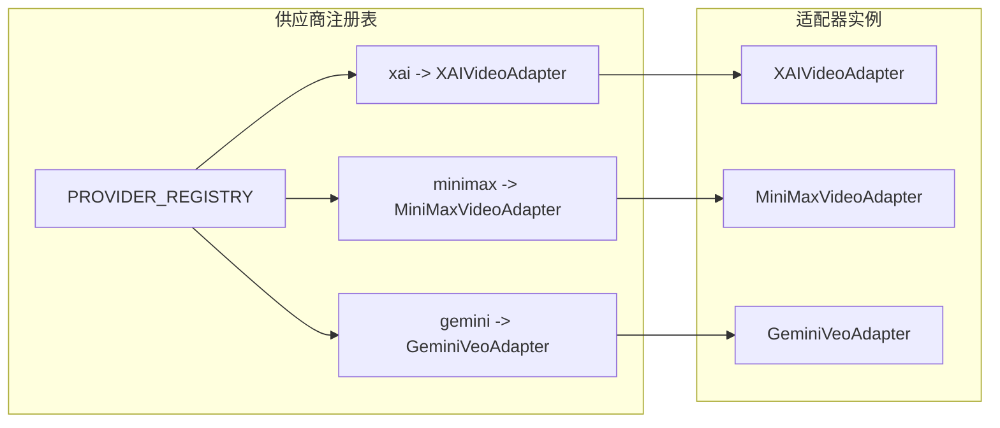
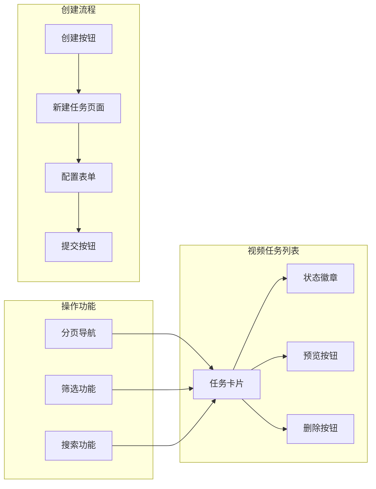
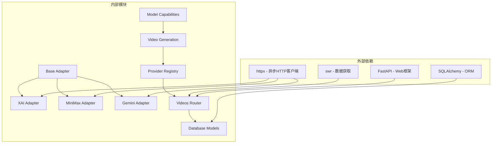

# 多提供商视频模型集成

<cite>
**本文档引用的文件**
- [backend/services/video_providers/base.py](file://backend/services/video_providers/base.py)
- [backend/services/video_providers/minimax_provider.py](file://backend/services/video_providers/minimax_provider.py)
- [backend/services/video_providers/xai_provider.py](file://backend/services/video_providers/xai_provider.py)
- [backend/services/video_providers/model_capabilities.py](file://backend/services/video_providers/model_capabilities.py)
- [backend/services/video_providers/__init__.py](file://backend/services/video_providers/__init__.py)
- [backend/services/video_generation.py](file://backend/services/video_generation.py)
- [backend/routers/videos.py](file://backend/routers/videos.py)
- [backend/main.py](file://backend/main.py)
- [backend/models.py](file://backend/models.py)
- [backend/admin/src/app/admin/videos/page.tsx](file://backend/admin/src/app/admin/videos/page.tsx)
- [backend/admin/src/app/admin/videos/new/page.tsx](file://backend/admin/src/app/admin/videos/new/page.tsx)
</cite>

## 更新摘要
**所做更改**
- 新增完整的多提供商适配器架构支持
- 添加 Gemini Veo 模型适配器实现
- 完善模型能力配置系统
- 增强供应商适配器注册和管理机制
- 扩展视频生成服务的多提供商支持

## 目录
1. [项目概述](#项目概述)
2. [项目结构](#项目结构)
3. [核心组件](#核心组件)
4. [架构概览](#架构概览)
5. [详细组件分析](#详细组件分析)
6. [依赖关系分析](#依赖关系分析)
7. [性能考虑](#性能考虑)
8. [故障排除指南](#故障排除指南)
9. [结论](#结论)

## 项目概述

这是一个基于 FastAPI 的多提供商视频生成系统，现已升级为完整的多提供商适配器架构，支持集成多个视频生成 AI 服务提供商，包括 xAI (Grok Video)、MiniMax (Hailuo) 和 Gemini (Veo) 系列模型。系统采用适配器模式设计，提供了统一的接口来管理不同提供商的视频生成服务。

该系统的核心特性包括：
- **多提供商支持**：统一管理 xAI、MiniMax 和 Gemini 视频生成服务
- **模型能力配置**：详细的模型参数和能力映射，支持 15+ 种视频生成模型
- **统一 API 接口**：简化前端集成和使用
- **完整的管理界面**：包含视频任务管理和配置管理
- **计费系统集成**：基于使用量的积分扣费机制
- **智能供应商推断**：根据模型名称自动识别供应商类型

## 项目结构

```mermaid
graph TB
subgraph "前端管理界面"
Admin[Admin Panel]
VideoList[视频任务列表]
CreateVideo[创建视频任务]
end
subgraph "后端服务"
FastAPI[FastAPI 应用]
Router[视频路由]
Service[视频服务层]
Adapter[适配器层]
Registry[供应商注册表]
end
subgraph "视频提供商"
XAI[xAI (Grok Video)]
MiniMax[MiniMax (Hailuo)]
Gemini[Gemini (Veo)]
end
subgraph "数据层"
Models[数据库模型]
Billing[计费系统]
Capabilities[模型配置]
end
Admin --> Router
Router --> Service
Service --> Registry
Registry --> Adapter
Adapter --> XAI
Adapter --> MiniMax
Adapter --> Gemini
Service --> Models
Service --> Billing
Service --> Capabilities
```

**图表来源**
- [backend/main.py:132](file://backend/main.py#L132)
- [backend/routers/videos.py:23](file://backend/routers/videos.py#L23)
- [backend/services/video_generation.py:47-51](file://backend/services/video_generation.py#L47-L51)

**章节来源**
- [backend/main.py:1-154](file://backend/main.py#L1-L154)
- [backend/routers/videos.py:1-338](file://backend/routers/videos.py#L1-L338)

## 核心组件

### 视频适配器基类

系统采用抽象基类设计，定义了所有视频提供商适配器必须实现的标准接口：



**图表来源**
- [backend/services/video_providers/base.py:49-114](file://backend/services/video_providers/base.py#L49-L114)

### 适配器实现

系统实现了三个主要的视频提供商适配器：

#### xAI 适配器
- 支持 grok-imagine-video 模型
- 支持文本生成视频和图片生成视频模式
- 集成内容审核机制
- 直接返回视频 URL

#### MiniMax 适配器
- 支持多种 Hailuo 系列模型
- 支持 T2V、I2V、S2V 等多种生成模式
- 首尾帧生成支持
- 需要额外的文件检索 API 获取下载链接

#### Gemini 适配器
- 支持 Veo 3.1 和 Veo 2.0 系列模型
- 支持原生音频、首尾帧、参考图片等高级功能
- 支持 4K 分辨率输出
- 长运行操作模式支持

**章节来源**
- [backend/services/video_providers/xai_provider.py:22-164](file://backend/services/video_providers/xai_provider.py#L22-L164)
- [backend/services/video_providers/minimax_provider.py:30-318](file://backend/services/video_providers/minimax_provider.py#L30-L318)

## 架构概览



**图表来源**
- [backend/services/video_generation.py:84-124](file://backend/services/video_generation.py#L84-L124)
- [backend/routers/videos.py:74-228](file://backend/routers/videos.py#L74-L228)

## 详细组件分析

### 视频生成服务层

视频生成服务层作为统一入口，负责协调不同提供商的服务：



**图表来源**
- [backend/services/video_generation.py:84-124](file://backend/services/video_generation.py#L84-L124)

### 模型能力配置系统

系统提供了详细的模型能力配置，确保正确的参数映射和验证：

| 模型类型 | 供应商 | 支持模式 | 时长限制 | 分辨率 | 首帧支持 | 尾帧支持 | 提示词优化 |
|---------|--------|---------|---------|-------|---------|---------|-----------|
| MiniMax-Hailuo-2.3 | MiniMax | 文本生成, 图片生成 | 6, 10秒 | 768P, 1080P | 是 | 否 | 是 |
| MiniMax-Hailuo-02 | MiniMax | 文本生成, 图片生成 | 6, 10秒 | 512P, 768P, 1080P | 是 | 是 | 是 |
| T2V-01 | MiniMax | 文本生成 | 6秒 | 720P | 否 | 否 | 是 |
| I2V-01 | MiniMax | 图片生成 | 6秒 | 720P | 是 | 否 | 是 |
| S2V-01 | MiniMax | 主题参考 | 6秒 | 720P | 否 | 否 | 是 |
| grok-imagine-video | xAI | 文本生成, 图片生成, 编辑 | 1-15秒 | 480P, 720P | 是 | 否 | 否 |
| veo-3.1-generate-preview | Gemini | 文本生成, 图片生成 | 4, 6, 8秒 | 720P, 1080P, 4K | 是 | 是 | 否 |
| veo-2.0-generate-001 | Gemini | 文本生成, 图片生成 | 5, 6, 8秒 | 720P | 是 | 否 | 否 |

**章节来源**
- [backend/services/video_providers/model_capabilities.py:22-223](file://backend/services/video_providers/model_capabilities.py#L22-L223)

### 供应商适配器注册表

系统通过注册表管理不同的适配器实例，支持动态扩展：



**图表来源**
- [backend/services/video_generation.py:47-75](file://backend/services/video_generation.py#L47-L75)

### 管理界面组件

#### 视频任务管理页面

管理界面提供了完整的视频任务管理功能：



**图表来源**
- [backend/admin/src/app/admin/videos/page.tsx:122-205](file://backend/admin/src/app/admin/videos/page.tsx#L122-L205)

**章节来源**
- [backend/admin/src/app/admin/videos/page.tsx:1-268](file://backend/admin/src/app/admin/videos/page.tsx#L1-L268)
- [backend/admin/src/app/admin/videos/new/page.tsx:1-420](file://backend/admin/src/app/admin/videos/new/page.tsx#L1-L420)

## 依赖关系分析



**图表来源**
- [backend/services/video_providers/xai_provider.py:13](file://backend/services/video_providers/xai_provider.py#L13)
- [backend/services/video_providers/minimax_provider.py:21](file://backend/services/video_providers/minimax_provider.py#L21)

### 核心依赖关系

系统的关键依赖关系包括：

1. **适配器模式**：所有提供商适配器都继承自统一的基类
2. **工厂模式**：通过注册表管理不同的适配器实例
3. **配置驱动**：模型能力配置决定 UI 表单的显示和验证
4. **异步处理**：使用 asyncio 处理并发的视频生成任务
5. **智能推断**：根据模型名称自动识别供应商类型

**章节来源**
- [backend/services/video_generation.py:44-71](file://backend/services/video_generation.py#L44-L71)
- [backend/services/video_providers/base.py:65-114](file://backend/services/video_providers/base.py#L65-L114)

## 性能考虑

### 并发处理
- 使用异步 HTTP 客户端处理多个提供商的并发请求
- 实现任务轮询的超时保护机制
- 优化数据库查询，使用批量操作减少往返次数

### 缓存策略
- 模型能力配置缓存，避免重复解析
- 任务状态缓存，减少频繁的状态查询
- 媒体文件缓存，支持断点续传和重复访问

### 错误处理
- 实现指数退避重试机制
- 网络异常的优雅降级
- 资源清理和超时处理

## 故障排除指南

### 常见问题及解决方案

#### 1. 提供商认证失败
- 检查 API 密钥是否正确配置
- 验证提供商账户状态和余额
- 确认网络连接和防火墙设置

#### 2. 模型参数错误
- 验证模型名称是否正确
- 检查分辨率和时长的组合是否支持
- 确认图片格式和大小要求

#### 3. 任务状态异常
- 检查任务轮询间隔设置
- 验证回调 URL 配置
- 查看提供商的速率限制

#### 4. 前端显示问题
- 确认 CORS 配置正确
- 检查静态资源路径
- 验证权限和认证状态

#### 5. 供应商推断错误
- 检查模型名称是否符合预期格式
- 验证供应商类型映射规则
- 确认模型能力配置正确

**章节来源**
- [backend/services/video_providers/xai_provider.py:91-103](file://backend/services/video_providers/xai_provider.py#L91-L103)
- [backend/services/video_providers/minimax_provider.py:203-237](file://backend/services/video_providers/minimax_provider.py#L203-L237)

## 结论

这个多提供商视频模型集成为视频生成领域提供了一个强大而灵活的解决方案。通过适配器模式的设计，系统能够轻松集成新的视频生成提供商，同时保持统一的 API 接口和用户体验。

### 主要优势

1. **统一接口**：简化了多提供商的集成和使用
2. **灵活扩展**：易于添加新的视频生成服务提供商
3. **完善的管理**：提供了完整的任务管理和配置功能
4. **可靠的架构**：异步处理和错误恢复机制确保系统的稳定性
5. **智能推断**：根据模型名称自动识别供应商类型
6. **丰富的模型支持**：涵盖 15+ 种视频生成模型

### 技术特色

- 基于 FastAPI 的高性能 Web 框架
- 完整的 TypeScript 前端管理界面
- 详细的模型能力配置系统
- 集成的计费和权限管理系统
- 动态供应商适配器注册机制

该系统为视频生成应用提供了一个坚实的技术基础，可以根据具体需求进行定制和扩展。