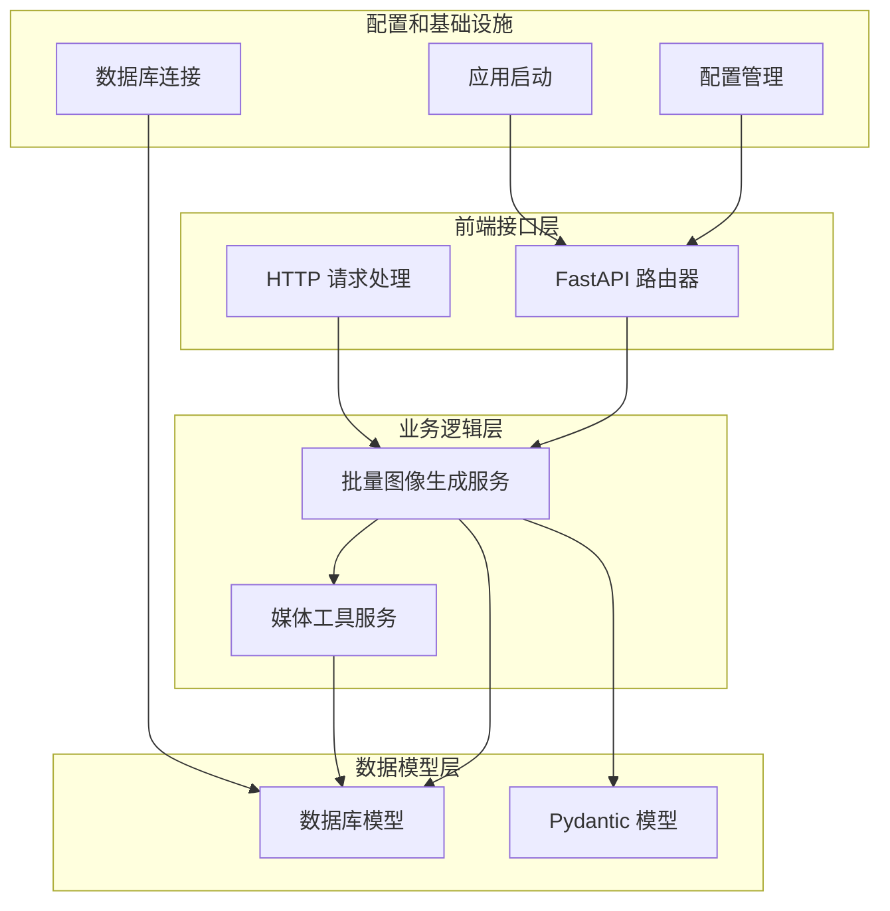
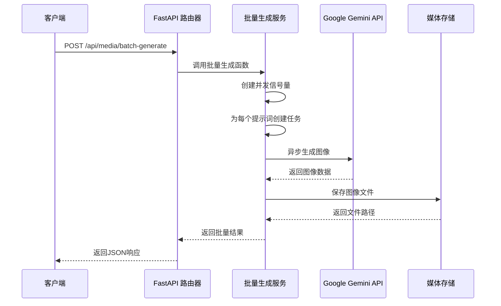
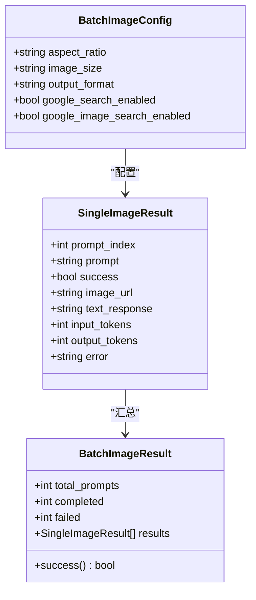
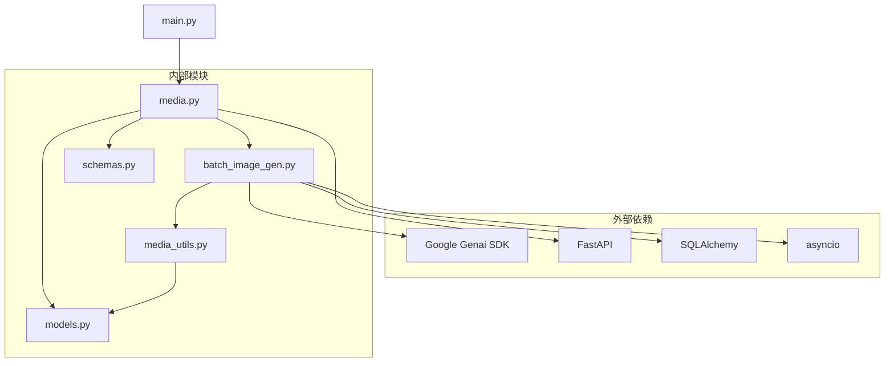

# 批量图像生成

<cite>
**本文档引用的文件**
- [backend/services/batch_image_gen.py](file://backend/services/batch_image_gen.py)
- [backend/routers/media.py](file://backend/routers/media.py)
- [backend/services/media_utils.py](file://backend/services/media_utils.py)
- [backend/schemas.py](file://backend/schemas.py)
- [backend/models.py](file://backend/models.py)
- [backend/main.py](file://backend/main.py)
- [backend/database.py](file://backend/database.py)
- [backend/config.py](file://backend/config.py)
- [batch_generate.py](file://batch_generate.py)
</cite>

## 目录
1. [简介](#简介)
2. [项目结构](#项目结构)
3. [核心组件](#核心组件)
4. [架构概览](#架构概览)
5. [详细组件分析](#详细组件分析)
6. [依赖关系分析](#依赖关系分析)
7. [性能考虑](#性能考虑)
8. [故障排除指南](#故障排除指南)
9. [结论](#结论)

## 简介

批量图像生成系统是 Infinite Game 项目中的一个核心功能模块，专门用于高效地从多个提示词批量生成图像。该系统基于 Google Gemini AI API，采用异步并发处理技术，能够同时处理多个图像生成请求，显著提高处理效率。

系统的主要特点包括：
- 支持异步并发处理，最多可同时处理 8 个图像生成任务
- 提供灵活的图像配置选项，包括纵横比、尺寸和输出格式
- 集成 Google 搜索和图像搜索功能
- 完整的错误处理和日志记录机制
- 安全的媒体文件存储和访问控制

## 项目结构

批量图像生成功能分布在项目的多个模块中，形成了清晰的分层架构：

**图表来源**
- [backend/routers/media.py](file://backend/routers/media.py#L1-L130)
- [backend/services/batch_image_gen.py](file://backend/services/batch_image_gen.py#L1-L187)
- [backend/services/media_utils.py](file://backend/services/media_utils.py#L1-L29)

**章节来源**
- [backend/main.py](file://backend/main.py#L1-L125)
- [backend/config.py](file://backend/config.py#L1-L40)

## 核心组件

批量图像生成系统由以下核心组件构成：

### 1. 批量图像生成服务
负责协调整个批量图像生成流程，包括并发控制、结果聚合和错误处理。

### 2. 媒体工具服务
提供图像文件的保存和访问功能，确保生成的图像能够安全地存储和检索。

### 3. FastAPI 路由器
作为系统的入口点，接收 HTTP 请求并调用相应的服务处理逻辑。

### 4. 数据模型和验证
使用 Pydantic 模型确保请求参数的有效性和一致性。

**章节来源**
- [backend/services/batch_image_gen.py](file://backend/services/batch_image_gen.py#L1-L187)
- [backend/services/media_utils.py](file://backend/services/media_utils.py#L1-L29)
- [backend/schemas.py](file://backend/schemas.py#L425-L464)

## 架构概览

系统采用分层架构设计，实现了关注点分离和模块化：

**图表来源**
- [backend/routers/media.py](file://backend/routers/media.py#L58-L130)
- [backend/services/batch_image_gen.py](file://backend/services/batch_image_gen.py#L113-L187)

## 详细组件分析

### 批量图像生成服务

该服务是整个系统的核心，负责处理并发图像生成请求：

#### 主要功能特性：
- **并发控制**：使用 asyncio.Semaphore 限制最大并发数（1-8）
- **配置管理**：支持多种图像生成配置选项
- **错误处理**：完整的异常捕获和错误报告机制
- **结果聚合**：将单个结果汇总为批量结果

#### 关键数据结构：

**图表来源**
- [backend/services/batch_image_gen.py](file://backend/services/batch_image_gen.py#L29-L63)

**章节来源**
- [backend/services/batch_image_gen.py](file://backend/services/batch_image_gen.py#L113-L187)

### FastAPI 路由器

路由器层负责处理 HTTP 请求和响应：

#### 主要路由功能：
- **批量生成接口**：`POST /api/media/batch-generate`
- **媒体文件服务**：`GET /api/media/{filename}`
- **智能体集成**：与 Agent 和 LLMProvider 模型关联

#### 安全机制：
- 文件名验证（UUID + 扩展名模式）
- MIME 类型检查
- 缓存控制头设置

**章节来源**
- [backend/routers/media.py](file://backend/routers/media.py#L1-L130)

### 媒体工具服务

提供图像文件的本地存储和访问功能：

#### 核心功能：
- **文件命名**：使用 UUID 生成唯一文件名
- **格式转换**：支持 PNG、JPEG、WEBP、GIF 格式
- **路径生成**：返回可访问的 API 路径
- **目录管理**：自动创建媒体目录

**章节来源**
- [backend/services/media_utils.py](file://backend/services/media_utils.py#L1-L29)

### 数据模型和验证

系统使用 Pydantic 模型确保数据完整性和类型安全：

#### 关键模型：
- **BatchImageConfigRequest**：批量生成配置请求
- **BatchImageGenerateRequest**：批量生成请求
- **SingleImageResultResponse**：单个结果响应
- **BatchImageGenerateResponse**：批量结果响应

**章节来源**
- [backend/schemas.py](file://backend/schemas.py#L425-L464)

## 依赖关系分析

系统各组件之间的依赖关系清晰明确：

**图表来源**
- [backend/routers/media.py](file://backend/routers/media.py#L1-L25)
- [backend/services/batch_image_gen.py](file://backend/services/batch_image_gen.py#L1-L14)

**章节来源**
- [backend/database.py](file://backend/database.py#L1-L31)
- [backend/config.py](file://backend/config.py#L1-L40)

## 性能考虑

批量图像生成系统在设计时充分考虑了性能优化：

### 并发处理
- **信号量控制**：使用 asyncio.Semaphore 限制并发数
- **异步 I/O**：避免阻塞操作，提高吞吐量
- **资源管理**：合理控制内存使用和连接数

### 缓存和存储
- **文件缓存**：生成的图像文件持久化存储
- **CDN 友好**：使用长期缓存头
- **安全存储**：文件名和路径的安全验证

### 错误处理
- **优雅降级**：单个任务失败不影响整体流程
- **详细日志**：完整的错误追踪和诊断信息
- **超时控制**：防止长时间阻塞

## 故障排除指南

### 常见问题及解决方案

#### 1. API 密钥配置问题
**症状**：批量生成请求返回认证错误
**解决方案**：
- 检查 `.env` 文件中的 `GEMINI_API_KEY`
- 验证 API 密钥的有效性和权限
- 确认网络连接正常

#### 2. 并发数限制问题
**症状**：超过 8 个并发请求被拒绝
**解决方案**：
- 调整 `max_concurrent` 参数到 1-8 范围内
- 检查系统资源使用情况
- 考虑分批处理大量请求

#### 3. 文件存储问题
**症状**：图像文件无法保存或访问
**解决方案**：
- 检查 `backend/media` 目录的写入权限
- 验证磁盘空间充足
- 确认文件名符合 UUID 格式要求

#### 4. 数据库连接问题
**症状**：智能体配置无法加载
**解决方案**：
- 检查数据库连接字符串
- 验证数据库服务正常运行
- 确认 Alembic 迁移已完成

**章节来源**
- [backend/main.py](file://backend/main.py#L78-L82)
- [backend/routers/media.py](file://backend/routers/media.py#L39-L55)

## 结论

批量图像生成系统是一个设计精良、功能完整的模块化解决方案。它成功地将复杂的异步并发处理、严格的输入验证、安全的文件管理和优雅的错误处理结合在一起。

### 主要优势
- **高性能**：异步并发处理显著提升吞吐量
- **可扩展性**：模块化设计便于功能扩展和维护
- **安全性**：完善的输入验证和文件访问控制
- **可靠性**：全面的错误处理和日志记录机制

### 技术亮点
- 基于 Google Gemini API 的高质量图像生成
- 灵活的配置选项满足不同需求
- 完善的监控和诊断能力
- 符合现代 Web 应用最佳实践

该系统为 Infinite Game 项目提供了强大的视觉内容生成能力，为用户创造沉浸式的叙事体验奠定了坚实基础。