# 技能管理系统

<cite>
**本文档引用的文件**
- [backend/main.py](file://backend/main.py)
- [backend/skills_manager.py](file://backend/skills_manager.py)
- [backend/models.py](file://backend/models.py)
- [backend/schemas.py](file://backend/schemas.py)
- [backend/routers/skills_api.py](file://backend/routers/skills_api.py)
- [backend/agents.py](file://backend/agents.py)
- [backend/skills/builtin_skills/file_reader/SKILL.md](file://backend/skills/builtin_skills/file_reader/SKILL.md)
- [backend/skills/customized_skills/found_SKILLs/SKILL.md](file://backend/skills/customized_skills/found_SKILLs/SKILL.md)
- [backend/skills/active_skills/found_SKILLs/SKILL.md](file://backend/skills/active_skills/found_SKILLs/SKILL.md)
- [frontend/src/components/canvas/AIAssistantPanel.tsx](file://frontend/src/components/canvas/AIAssistantPanel.tsx)
- [frontend/src/app/theater/[id]/page.tsx](file://frontend/src/app/theater/[id]/page.tsx)
- [README.md](file://README.md)
</cite>

## 更新摘要
**所做更改**
- 新增CoPaw对齐方法论章节，详细说明技能信息结构与CoPaw标准的对齐
- 更新技能分类体系，明确内置技能、活动技能、自定义技能的职责边界
- 完善技能生命周期管理，增加技能版本管理和冲突解决机制
- 新增技能注入服务章节，说明智能体技能注册和MCP客户端集成
- 更新API接口设计，增加版本控制和状态管理功能
- 补充前端集成细节，完善AI助手面板的技能管理功能

## 目录
1. [项目概述](#项目概述)
2. [系统架构](#系统架构)
3. [核心组件](#核心组件)
4. [技能管理架构](#技能管理架构)
5. [技能目录结构](#技能目录结构)
6. [技能生命周期管理](#技能生命周期管理)
7. [CoPaw对齐方法论](#copaw对齐方法论)
8. [技能注入服务](#技能注入服务)
9. [API接口设计](#api接口设计)
10. [前端集成](#前端集成)
11. [数据模型](#数据模型)
12. [性能考虑](#性能考虑)
13. [故障排除指南](#故障排除指南)
14. [总结](#总结)

## 项目概述

无限剧情剧场系统是一个基于AgentScope多智能体框架构建的动态叙事平台。该系统的核心创新在于其技能管理系统，允许用户动态管理和扩展智能体的能力。

### 主要特性

- **动态技能管理**：支持内置技能、自定义技能和活动技能的统一管理
- **多智能体协作**：导演、编剧、NPC管理器等角色协同工作
- **多模态内容生成**：集成多种AI模型进行文本、图像、视频生成
- **实时交互**：通过WebSocket实现实时剧情推送
- **灵活配置**：支持动态LLM提供商配置和切换
- **CoPaw对齐**：技能信息结构完全符合CoPaw标准规范

## 系统架构

系统采用前后端分离架构，后端基于FastAPI提供RESTful API，前端使用Next.js构建用户界面。

```mermaid
graph TB
subgraph "前端层"
FE[前端应用<br/>Next.js 16]
Admin[后台管理系统<br/>Next.js Admin]
AIAssistant[AI助手面板<br/>React组件]
end
subgraph "后端层"
API[FastAPI API<br/>RESTful服务]
SkillsMgr[技能管理器<br/>SkillService]
Agents[智能体系统<br/>AgentScope]
DB[(PostgreSQL)<br/>数据存储]
end
subgraph "AI服务层"
LLM[LLM提供商<br/>OpenAI/DashScope/Gemini]
Media[媒体生成<br/>图片/视频/TTS]
end
FE --> API
Admin --> API
AIAssistant --> FE
API --> SkillsMgr
API --> Agents
SkillsMgr --> DB
Agents --> LLM
Agents --> Media
API --> DB
```

**图表来源**
- [backend/main.py:110-148](file://backend/main.py#L110-L148)
- [backend/agents.py:176-383](file://backend/agents.py#L176-L383)

## 核心组件

### 后端核心组件

系统后端包含多个核心模块，每个模块负责特定的功能领域：

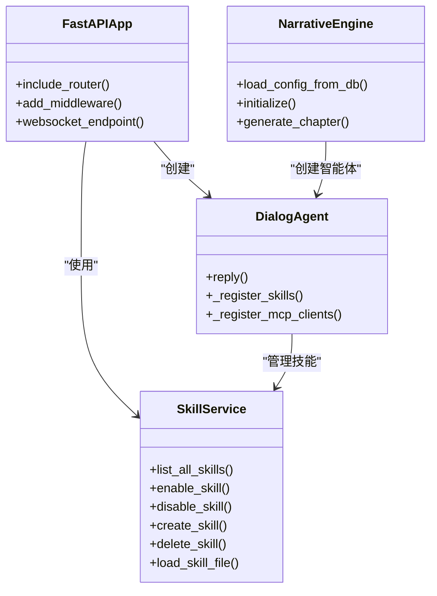

**图表来源**
- [backend/main.py:32-44](file://backend/main.py#L32-L44)
- [backend/skills_manager.py:263-408](file://backend/skills_manager.py#L263-L408)
- [backend/agents.py:40-174](file://backend/agents.py#L40-L174)

**章节来源**
- [backend/main.py:1-170](file://backend/main.py#L1-L170)
- [backend/skills_manager.py:1-408](file://backend/skills_manager.py#L1-L408)
- [backend/agents.py:1-388](file://backend/agents.py#L1-L388)

## 技能管理架构

技能管理系统是整个系统的核心创新点，它实现了技能的动态加载、管理和执行。

### 技能架构设计

```mermaid
graph TD
subgraph "技能存储层"
BuiltIn[内置技能<br/>builtin_skills/]
Custom[自定义技能<br/>customized_skills/]
Active[活动技能<br/>active_skills/]
end
subgraph "技能管理层"
SM[技能管理器<br/>SkillService]
Sync[同步器<br/>sync_skills()]
Loader[加载器<br/>list_available_skills]
end
subgraph "智能体集成"
Agent[DialogAgent]
Toolkit[工具包<br/>Toolkit]
MCP[MCP客户端<br/>MCPClientManager]
end
BuiltIn --> SM
Custom --> SM
SM --> Active
SM --> Sync
SM --> Loader
Loader --> Agent
Agent --> Toolkit
Agent --> MCP
```

**图表来源**
- [backend/skills_manager.py:180-257](file://backend/skills_manager.py#L180-L257)
- [backend/agents.py:85-113](file://backend/agents.py#L85-L113)

### 技能分类体系

系统支持三种不同类型的技能，每种类型都有明确的职责和管理方式：

1. **内置技能 (builtin_skills)**：系统预定义的标准技能，具有固定的版本号和元数据
2. **自定义技能 (customized_skills)**：用户创建和修改的技能，支持覆盖内置技能
3. **活动技能 (active_skills)**：当前正在使用的技能集合，由系统自动管理

**章节来源**
- [backend/skills_manager.py:43-63](file://backend/skills_manager.py#L43-L63)

## 技能目录结构

技能系统采用标准化的目录结构，每个技能都包含必要的元数据和脚本文件。

### 目录组织结构

```
skills/
├── builtin_skills/          # 内置技能目录
│   └── file_reader/         # 文件读取技能
│       ├── SKILL.md         # 技能元数据
│       ├── scripts/         # 脚本文件
│       │   └── read.py      # 读取逻辑实现
│       └── references/      # 参考文件
├── customized_skills/       # 自定义技能目录
│   └── found_SKILLs/        # 发现技能
│       ├── SKILL.md         # 技能元数据
│       └── scripts/         # 脚本文件
└── active_skills/           # 活动技能目录
    └── found_SKILLs/        # 当前启用的技能
        └── SKILL.md         # 技能元数据
```

### 技能元数据格式

每个技能都包含标准的元数据结构：

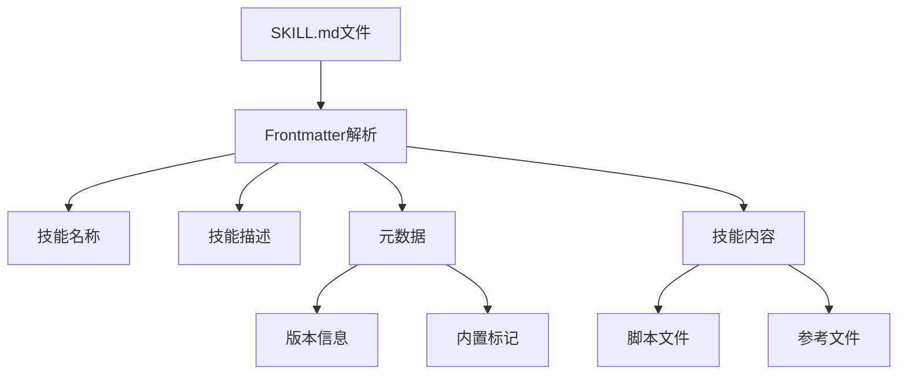

**图表来源**
- [backend/skills/builtin_skills/file_reader/SKILL.md:1-12](file://backend/skills/builtin_skills/file_reader/SKILL.md#L1-L12)
- [backend/skills/customized_skills/found_SKILLs/SKILL.md:1-152](file://backend/skills/customized_skills/found_SKILLs/SKILL.md#L1-L152)

**章节来源**
- [backend/skills/builtin_skills/file_reader/SKILL.md:1-12](file://backend/skills/builtin_skills/file_reader/SKILL.md#L1-L12)
- [backend/skills/customized_skills/found_SKILLs/SKILL.md:1-152](file://backend/skills/customized_skills/found_SKILLs/SKILL.md#L1-L152)
- [backend/skills/active_skills/found_SKILLs/SKILL.md:1-152](file://backend/skills/active_skills/found_SKILLs/SKILL.md#L1-L152)

## 技能生命周期管理

技能管理系统实现了完整的生命周期管理，包括技能的创建、启用、禁用和删除。

### 生命周期流程图

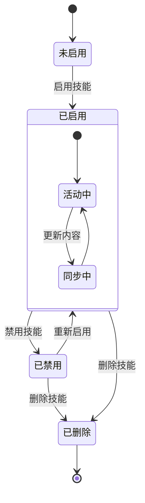

### 技能同步机制

系统提供了智能的技能同步机制，确保技能状态的一致性：

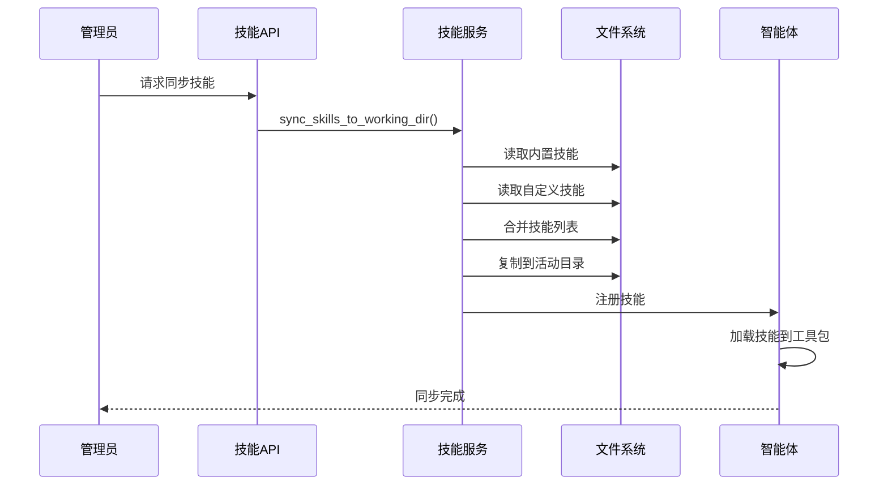

**图表来源**
- [backend/skills_manager.py:180-225](file://backend/skills_manager.py#L180-L225)
- [backend/agents.py:85-113](file://backend/agents.py#L85-L113)

**章节来源**
- [backend/skills_manager.py:180-257](file://backend/skills_manager.py#L180-L257)
- [backend/agents.py:85-113](file://backend/agents.py#L85-L113)

## CoPaw对齐方法论

技能管理系统完全遵循CoPaw（Common Operations and Patterns for AI Workers）方法论，确保技能信息结构的标准化和互操作性。

### CoPaw对齐原则

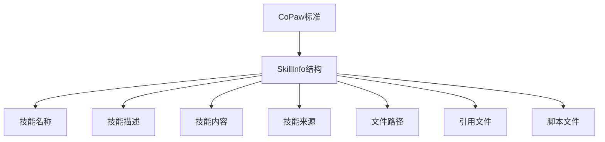

### 技能信息结构

SkillInfo类完全符合CoPaw标准，包含以下核心字段：

- **name**：技能唯一标识符，必须符合命名规范
- **description**：技能功能描述，支持空值
- **content**：完整的SKILL.md内容
- **source**：技能来源类型（builtin、customized、active）
- **path**：技能文件夹的绝对路径
- **references**：引用文件的树状结构
- **scripts**：脚本文件的树状结构

**章节来源**
- [backend/skills_manager.py:19-408](file://backend/skills_manager.py#L19-L408)

## 技能注入服务

技能注入服务是智能体系统的核心组件，负责将技能注册到AgentScope工具包中，并与MCP客户端进行集成。

### 技能注入流程

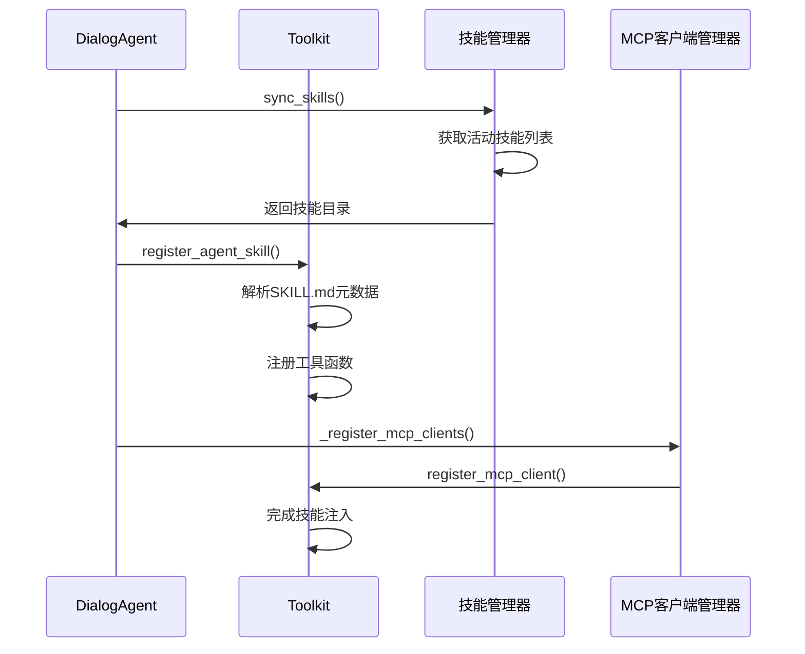

### 技能注册机制

智能体在初始化时会自动执行技能注入过程：

1. **技能同步**：调用`sync_skills()`确保技能目录是最新的
2. **技能发现**：通过`list_available_skills()`获取可用技能列表
3. **技能注册**：对每个技能调用`register_agent_skill()`进行注册
4. **MCP集成**：注册MCP客户端以支持外部工具集成

**章节来源**
- [backend/agents.py:85-113](file://backend/agents.py#L85-L113)

## API接口设计

技能管理API提供了完整的RESTful接口，支持技能的CRUD操作和状态管理。

### API端点设计

| 方法 | 端点 | 描述 | 权限 |
|------|------|------|------|
| GET | `/api/admin/skills/` | 列出所有技能 | 管理员 |
| GET | `/api/admin/skills/{skill_name}` | 获取技能详情 | 管理员 |
| POST | `/api/admin/skills/` | 创建新技能 | 管理员 |
| PUT | `/api/admin/skills/{skill_name}` | 更新技能 | 管理员 |
| DELETE | `/api/admin/skills/{skill_name}` | 删除技能 | 管理员 |
| POST | `/api/admin/skills/{skill_name}/toggle` | 切换技能状态 | 管理员 |

### 请求响应模型

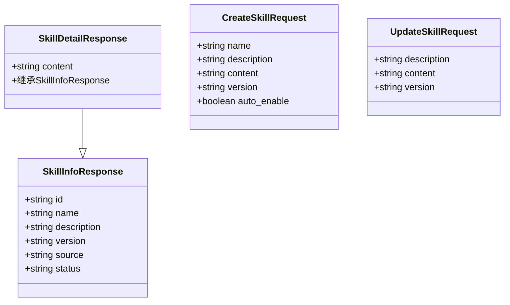

**图表来源**
- [backend/routers/skills_api.py:26-53](file://backend/routers/skills_api.py#L26-L53)

**章节来源**
- [backend/routers/skills_api.py:1-207](file://backend/routers/skills_api.py#L1-L207)

## 前端集成

前端系统集成了AI助手面板，为用户提供直观的技能管理界面。

### AI助手面板集成

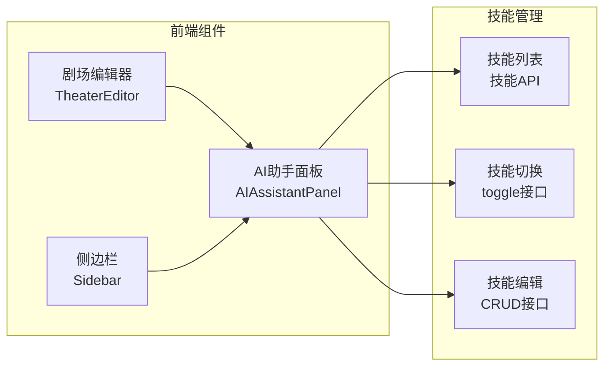

**图表来源**
- [frontend/src/components/canvas/AIAssistantPanel.tsx:1-229](file://frontend/src/components/canvas/AIAssistantPanel.tsx#L1-L229)
- [frontend/src/app/theater/[id]/page.tsx](file://frontend/src/app/theater/[id]/page.tsx#L395-L397)

### 前端组件架构

前端使用React和Next.js构建，AI助手面板作为独立组件集成到主界面中：

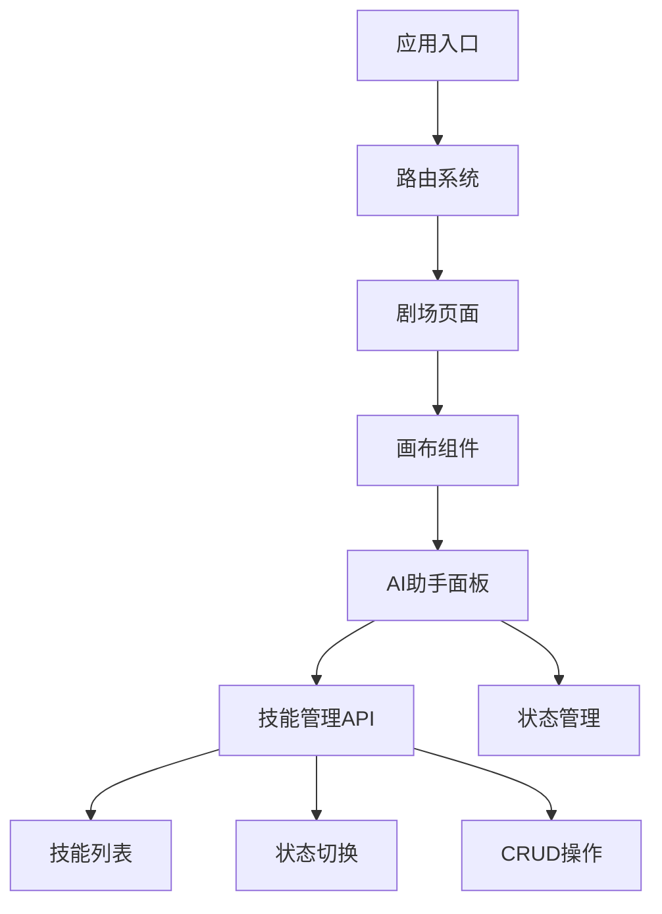

**图表来源**
- [frontend/src/app/theater/[id]/page.tsx](file://frontend/src/app/theater/[id]/page.tsx#L1-L438)

**章节来源**
- [frontend/src/components/canvas/AIAssistantPanel.tsx:1-229](file://frontend/src/components/canvas/AIAssistantPanel.tsx#L1-L229)
- [frontend/src/app/theater/[id]/page.tsx](file://frontend/src/app/theater/[id]/page.tsx#L1-L438)

## 数据模型

系统使用SQLAlchemy定义了完整的数据模型，支持复杂的业务逻辑。

### 核心数据模型

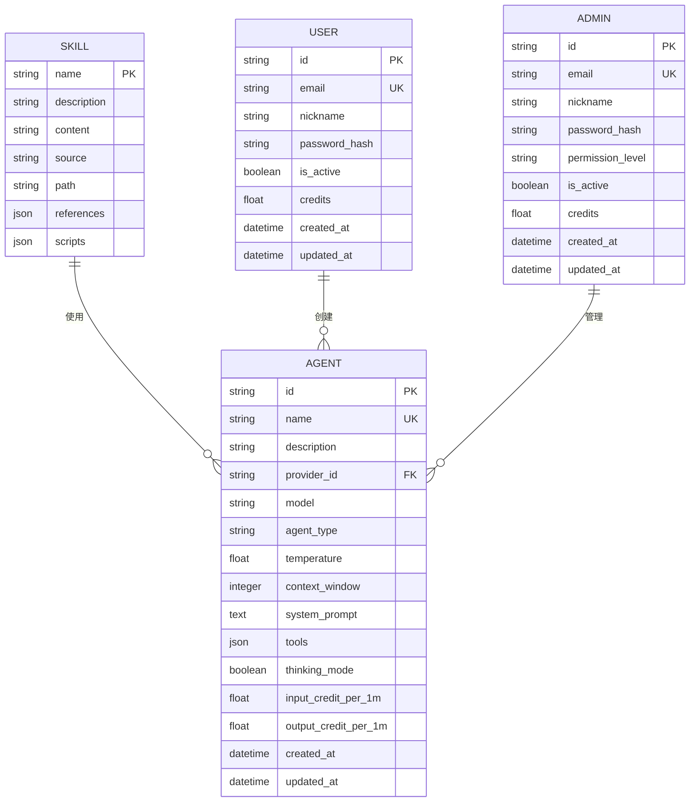

**图表来源**
- [backend/models.py:192-239](file://backend/models.py#L192-L239)

### 技能相关模型

技能系统还包含专门的数据模型来管理技能的状态和配置：

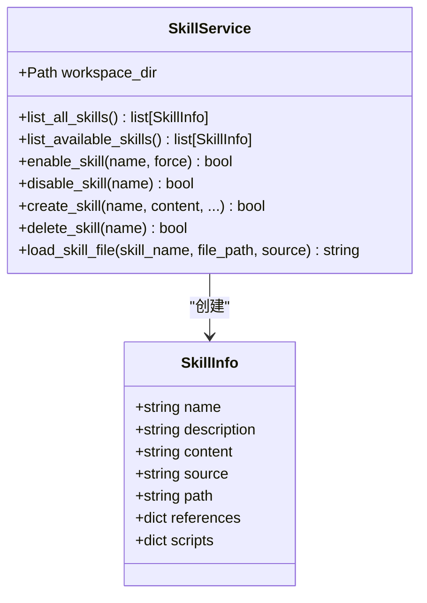

**图表来源**
- [backend/skills_manager.py:19-408](file://backend/skills_manager.py#L19-L408)

**章节来源**
- [backend/models.py:1-408](file://backend/models.py#L1-L408)
- [backend/schemas.py:1-740](file://backend/schemas.py#L1-L740)

## 性能考虑

技能管理系统在设计时充分考虑了性能优化，特别是在大量技能和并发访问场景下的表现。

### 性能优化策略

1. **懒加载机制**：技能只在需要时才加载到内存中
2. **缓存策略**：使用Redis缓存常用技能配置
3. **异步处理**：所有技能操作都是异步执行
4. **增量同步**：只同步发生变化的技能

### 内存管理

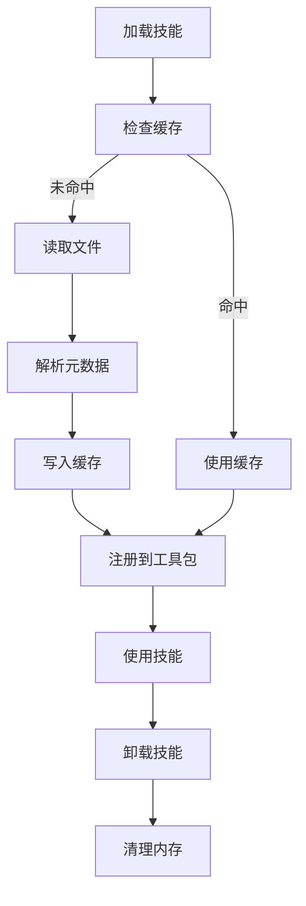

## 故障排除指南

### 常见问题及解决方案

1. **技能加载失败**
   - 检查SKILL.md文件格式是否正确
   - 验证技能目录权限
   - 确认依赖脚本是否存在

2. **API调用错误**
   - 验证管理员身份认证
   - 检查网络连接状态
   - 查看后端日志获取详细错误信息

3. **智能体无法识别技能**
   - 确认技能已正确启用
   - 检查工具包注册状态
   - 验证MCP客户端连接

### 调试技巧

- 启用详细日志记录
- 使用开发者工具检查API响应
- 验证文件系统权限
- 检查数据库连接状态

## 总结

技能管理系统是无限剧情剧场系统的核心创新，它提供了灵活、可扩展的技能管理能力。通过标准化的技能格式、智能的同步机制和完善的API接口，系统能够支持复杂的多智能体协作场景。

### 主要优势

1. **高度模块化**：技能以独立模块形式存在，便于维护和扩展
2. **动态配置**：支持运行时技能的启用和禁用
3. **统一管理**：提供完整的技能生命周期管理
4. **CoPaw对齐**：技能信息结构完全符合行业标准
5. **性能优化**：采用多种优化策略确保系统性能

### 未来发展方向

1. **技能商店**：建立技能共享和交易机制
2. **版本管理**：实现技能版本控制和回滚功能
3. **性能监控**：添加技能使用统计和性能分析
4. **自动化测试**：建立技能测试和验证机制
5. **MCP扩展**：增强MCP客户端管理和服务集成

这个技能管理系统为未来的AI应用开发提供了宝贵的参考，展示了如何构建灵活、可扩展的智能体技能管理框架。