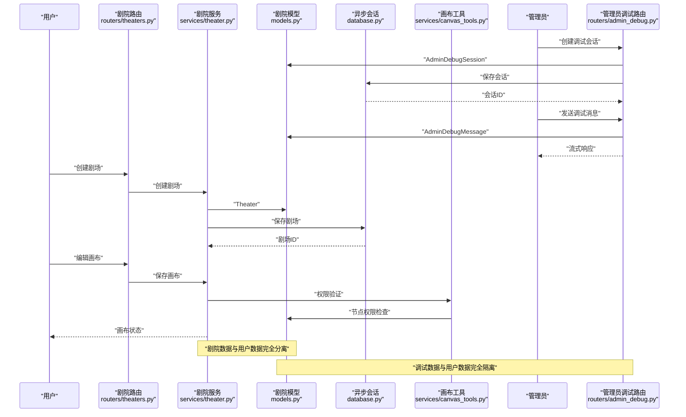
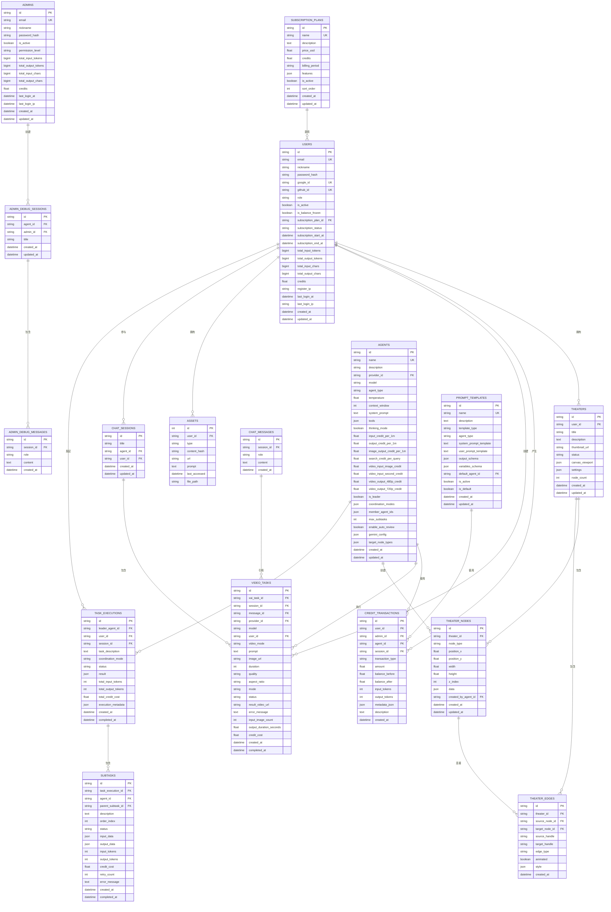
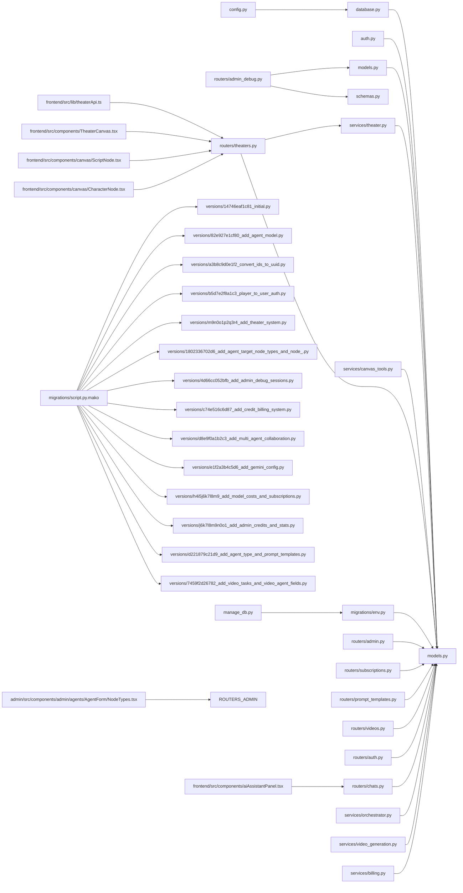

# 数据库模型设计

<cite>
**本文引用的文件**
- [backend/models.py](file://backend/models.py)
- [backend/database.py](file://backend/database.py)
- [backend/config.py](file://backend/config.py)
- [backend/manage_db.py](file://backend/manage_db.py)
- [backend/migrations/env.py](file://backend/migrations/env.py)
- [backend/migrations/script.py.mako](file://backend/migrations/script.py.mako)
- [backend/migrations/versions/14746eaf1c81_initial.py](file://backend/migrations/versions/14746eaf1c81_initial.py)
- [backend/migrations/versions/82e927e1cf80_add_agent_model.py](file://backend/migrations/versions/82e927e1cf80_add_agent_model.py)
- [backend/migrations/versions/a3b8c9d0e1f2_convert_ids_to_uuid.py](file://backend/migrations/versions/a3b8c9d0e1f2_convert_ids_to_uuid.py)
- [backend/migrations/versions/b5d7e2f8a1c3_player_to_user_auth.py](file://backend/migrations/versions/b5d7e2f8a1c3_player_to_user_auth.py)
- [backend/migrations/versions/c74e516c6d87_add_credit_billing_system.py](file://backend/migrations/versions/c74e516c6d87_add_credit_billing_system.py)
- [backend/migrations/versions/d8e9f0a1b2c3_add_multi_agent_collaboration.py](file://backend/migrations/versions/d8e9f0a1b2c3_add_multi_agent_collaboration.py)
- [backend/migrations/versions/e1f2a3b4c5d6_add_gemini_config.py](file://backend/migrations/versions/e1f2a3b4c5d6_add_gemini_config.py)
- [backend/migrations/versions/h4i5j6k7l8m9_add_model_costs_and_subscriptions.py](file://backend/migrations/versions/h4i5j6k7l8m9_add_model_costs_and_subscriptions.py)
- [backend/migrations/versions/j6k7l8m9n0o1_add_admin_credits_and_stats.py](file://backend/migrations/versions/j6k7l8m9n0o1_add_admin_credits_and_stats.py)
- [backend/migrations/versions/d221879c21d9_add_agent_type_and_prompt_templates.py](file://backend/migrations/versions/d221879c21d9_add_agent_type_and_prompt_templates.py)
- [backend/migrations/versions/7459f2d26782_add_video_tasks_and_video_agent_fields.py](file://backend/migrations/versions/7459f2d26782_add_video_tasks_and_video_agent_fields.py)
- [backend/migrations/versions/m9n0o1p2q3r4_add_theater_system.py](file://backend/migrations/versions/m9n0o1p2q3r4_add_theater_system.py)
- [backend/migrations/versions/1802336702d6_add_agent_target_node_types_and_node_.py](file://backend/migrations/versions/1802336702d6_add_agent_target_node_types_and_node_.py)
- [backend/migrations/versions/4d66cc052bfb_add_admin_debug_sessions.py](file://backend/migrations/versions/4d66cc052bfb_add_admin_debug_sessions.py)
- [backend/services/orchestrator.py](file://backend/services/orchestrator.py)
- [backend/services/theater.py](file://backend/services/theater.py)
- [backend/services/canvas_tools.py](file://backend/services/canvas_tools.py)
- [backend/routers/theaters.py](file://backend/routers/theaters.py)
- [backend/routers/admin.py](file://backend/routers/admin.py)
- [backend/routers/subscriptions.py](file://backend/routers/subscriptions.py)
- [backend/routers/prompt_templates.py](file://backend/routers/prompt_templates.py)
- [backend/routers/videos.py](file://backend/routers/videos.py)
- [backend/routers/auth.py](file://backend/routers/auth.py)
- [backend/routers/chats.py](file://backend/routers/chats.py)
- [backend/routers/admin_debug.py](file://backend/routers/admin_debug.py)
- [backend/services/video_generation.py](file://backend/services/video_generation.py)
- [backend/services/billing.py](file://backend/services/billing.py)
- [backend/schemas.py](file://backend/schemas.py)
- [backend/auth.py](file://backend/auth.py)
- [backend/admin/src/app/admin/prompt-templates/page.tsx](file://backend/admin/src/app/admin/prompt-templates/page.tsx)
- [backend/admin/src/app/admin/prompt-templates/PromptTemplateDialog.tsx](file://backend/admin/src/app/admin/prompt-templates/PromptTemplateDialog.tsx)
- [backend/admin/src/app/admin/players/page.tsx](file://backend/admin/src/app/admin/players/page.tsx)
- [backend/admin/src/components/admin/agents/AgentForm/NodeTypes.tsx](file://backend/admin/src/components/admin/agents/AgentForm/NodeTypes.tsx)
- [frontend/src/lib/theaterApi.ts](file://frontend/src/lib/theaterApi.ts)
- [frontend/src/components/TheaterCanvas.tsx](file://frontend/src/components/TheaterCanvas.tsx)
- [frontend/src/components/canvas/ScriptNode.tsx](file://frontend/src/components/canvas/ScriptNode.tsx)
- [frontend/src/components/canvas/CharacterNode.tsx](file://frontend/src/components/canvas/CharacterNode.tsx)
</cite>

## 更新摘要
**所做更改**
- 新增剧院系统相关的数据模型，包括 Theater、TheaterNode、TheaterEdge 模型
- 新增智能体节点类型权限追踪功能，通过 Agent 模型的 target_node_types 字段实现
- 新增管理员调试会话和消息的数据模型，确保与用户数据完全隔离
- 新增节点创建者追踪功能，通过 TheaterNode 模型的 created_by_agent_id 字段实现
- 更新迁移机制，支持剧院系统的完整数据模型演进

## 目录
1. [简介](#简介)
2. [项目结构](#项目结构)
3. [核心组件](#核心组件)
4. [架构总览](#架构总览)
5. [详细组件分析](#详细组件分析)
6. [依赖分析](#依赖分析)
7. [性能考虑](#性能考虑)
8. [故障排查指南](#故障排查指南)
9. [结论](#结论)
10. [附录](#附录)

## 简介
本文件面向数据库模型设计，围绕 SQLAlchemy 异步 ORM 的模型定义、字段类型选择、关系映射展开；重点阐释 User、Theater、TheaterNode、TheaterEdge、Agent 模型的字段、约束与索引设计；并系统讲解数据库迁移机制、Alembic 版本管理与数据模型演进策略；最后给出数据验证规则、业务规则实现与查询优化技巧，并提供模型扩展指南与常见数据操作模式。

**更新** 本次更新反映了应用的重大功能变更，新增了剧院系统、智能体节点类型权限追踪和管理员调试功能。剧院系统替代了原有的故事章节模型，支持用户创建和管理创意项目；智能体权限控制系统实现了基于节点类型的精细化权限控制；管理员调试功能提供了独立的调试会话管理，确保调试数据与用户数据完全隔离。

## 项目结构
后端以 FastAPI + SQLAlchemy 异步 ORM 架构为核心，数据库层通过 async/await 实现高并发读写；迁移体系基于 Alembic，提供脚本化版本管理与批量渲染能力；模型文件集中定义数据结构，路由层负责业务校验与数据流编排。新增的剧院系统通过专门的 theater 路由、服务层和模型定义实现完整的创意项目管理，包括剧场创建、节点编辑、边连接和画布同步。智能体画布控制权限追踪功能通过 canvas_tools 服务实现，支持基于节点类型的权限验证和节点创建追踪。管理员调试功能通过独立的 admin_debug 路由、服务层和 Schema 定义实现完整的调试会话管理，包括会话创建、消息记录、流式响应和计费统计。

```mermaid
graph TB
subgraph "后端"
CFG["配置<br/>config.py"]
DB["数据库引擎与会话<br/>database.py"]
MODELS["模型定义<br/>models.py"]
AUTH["认证系统<br/>auth.py & routers/auth.py"]
THEATER_ROUTER["剧院路由<br/>routers/theaters.py"]
THEATER_SERVICE["剧院服务<br/>services/theater.py"]
CANVAS_TOOLS["画布工具<br/>services/canvas_tools.py"]
ADMIN_DEBUG_ROUTER["管理员调试路由<br/>routers/admin_debug.py"]
ADMIN_DEBUG_MODELS["调试模型<br/>AdminDebugSession & AdminDebugMessage"]
ADMIN_DEBUG_SCHEMAS["调试Schema<br/>schemas.py"]
M_ENV["迁移环境<br/>migrations/env.py"]
M_SCRIPT["迁移模板<br/>migrations/script.py.mako"]
M_THEATER["剧院系统迁移<br/>versions/m9n0o1p2q3r4_add_theater_system.py"]
M_PERMISSION["权限追踪迁移<br/>versions/1802336702d6_add_agent_target_node_types_and_node_.py"]
M_DEBUG["调试功能迁移<br/>versions/4d66cc052bfb_add_admin_debug_sessions.py"]
SVC["业务服务<br/>services/orchestrator.py & services/video_generation.py & services/billing.py"]
ROUTERS["路由层<br/>routers/admin.py & routers/subscriptions.py & routers/prompt_templates.py & routers/videos.py & routers/auth.py & routers/chats.py"]
MAN_DB["迁移管理脚本<br/>manage_db.py"]
FRONTEND["前端界面<br/>frontend/src/*"]
ADMIN_FORM["智能体表单<br/>admin/src/components/admin/agents/AgentForm/NodeTypes.tsx"]
END
CFG --> DB
DB --> MODELS
AUTH --> MODELS
THEATER_ROUTER --> THEATER_SERVICE
THEATER_SERVICE --> MODELS
CANVAS_TOOLS --> MODELS
ADMIN_DEBUG_ROUTER --> ADMIN_DEBUG_MODELS
ADMIN_DEBUG_ROUTER --> ADMIN_DEBUG_SCHEMAS
ADMIN_DEBUG_ROUTER --> MODELS
M_ENV --> MODELS
M_SCRIPT --> M_THEATER
M_SCRIPT --> M_PERMISSION
M_SCRIPT --> M_DEBUG
SVC --> MODELS
ROUTERS --> MODELS
MAN_DB --> M_ENV
FRONTEND --> THEATER_ROUTER
ADMIN_FORM --> ROUTERS
```

**图表来源**
- [backend/config.py:1-40](file://backend/config.py#L1-L40)
- [backend/database.py:1-31](file://backend/database.py#L1-L31)
- [backend/models.py:1-440](file://backend/models.py#L1-L440)
- [backend/auth.py:1-229](file://backend/auth.py#L1-L229)
- [backend/routers/auth.py:1-136](file://backend/routers/auth.py#L1-L136)
- [backend/routers/theaters.py:1-110](file://backend/routers/theaters.py#L1-L110)
- [backend/services/theater.py:1-285](file://backend/services/theater.py#L1-L285)
- [backend/services/canvas_tools.py:1-481](file://backend/services/canvas_tools.py#L1-L481)
- [backend/migrations/env.py:1-105](file://backend/migrations/env.py#L1-L105)
- [backend/migrations/script.py.mako:1-27](file://backend/migrations/script.py.mako#L1-L27)
- [backend/migrations/versions/m9n0o1p2q3r4_add_theater_system.py:1-107](file://backend/migrations/versions/m9n0o1p2q3r4_add_theater_system.py#L1-L107)
- [backend/migrations/versions/1802336702d6_add_agent_target_node_types_and_node_.py:1-57](file://backend/migrations/versions/1802336702d6_add_agent_target_node_types_and_node_.py#L1-L57)
- [backend/migrations/versions/4d66cc052bfb_add_admin_debug_sessions.py:1-69](file://backend/migrations/versions/4d66cc052bfb_add_admin_debug_sessions.py#L1-L69)

**章节来源**
- [backend/config.py:1-40](file://backend/config.py#L1-L40)
- [backend/database.py:1-31](file://backend/database.py#L1-L31)
- [backend/models.py:1-440](file://backend/models.py#L1-L440)
- [backend/auth.py:1-229](file://backend/auth.py#L1-L229)
- [backend/routers/auth.py:1-136](file://backend/routers/auth.py#L1-L136)
- [backend/routers/theaters.py:1-110](file://backend/routers/theaters.py#L1-L110)
- [backend/services/theater.py:1-285](file://backend/services/theater.py#L1-L285)
- [backend/services/canvas_tools.py:1-481](file://backend/services/canvas_tools.py#L1-L481)
- [backend/migrations/env.py:1-105](file://backend/migrations/env.py#L1-L105)
- [backend/migrations/script.py.mako:1-27](file://backend/migrations/script.py.mako#L1-L27)

## 核心组件
- 异步引擎与会话：基于 async/await 的异步数据库引擎与会话工厂，支持连接池与线程安全（SQLite 在特定参数下启用）。
- 模型基类：统一继承 DeclarativeBase，便于 Alembic 自动发现元数据。
- 模型集合：包含 User、Theater、TheaterNode、TheaterEdge、Agent、CreditTransaction、TaskExecution、SubTask、SubscriptionPlan、Admin、PromptTemplate、VideoTask、AdminDebugSession、AdminDebugMessage 等。
- **新增** 剧院系统：完整的创意项目管理功能，包括剧场创建、节点编辑、边连接和画布同步。
- **新增** 智能体画布控制权限追踪功能：通过 agents 表的 target_node_types 字段和 theater_nodes 表的 created_by_agent_id 字段，实现了对画布节点操作的精细化权限控制。
- **新增** 管理员调试系统：完整的独立调试功能，支持管理员创建调试会话、发送消息、接收流式响应和计费统计。
- **新增** 调试模型：AdminDebugSession 和 AdminDebugMessage 两表关联，确保调试数据与用户数据完全隔离。
- **新增** 调试路由：提供独立的 /api/admin/debug 前缀 API 端点，包括会话管理、消息记录、流式响应等功能。
- **新增** 调试Schema：AdminDebugSessionCreate、AdminDebugSessionResponse、AdminDebugMessageCreate、AdminDebugMessageResponse 等数据验证和序列化定义。
- 迁移环境：注册模型元数据、支持离线/在线迁移、批量渲染。
- 迁移脚本：版本化管理，支持升级/降级。
- 迁移管理脚本：封装 migrate/upgrade/downgrade 命令，便于本地开发与 CI。
- 提示词模板系统：完整的模板管理、变量定义和渲染功能。
- 视频任务系统：完整的视频生成任务追踪、计费和状态管理功能。

**更新** 新增了剧院系统、智能体权限追踪和管理员调试功能，这些功能通过专门的模型、路由和服务实现完整的数据管理。

**章节来源**
- [backend/database.py:1-31](file://backend/database.py#L1-L31)
- [backend/models.py:75-130](file://backend/models.py#L75-L130)
- [backend/models.py:196-251](file://backend/models.py#L196-L251)
- [backend/models.py:417-440](file://backend/models.py#L417-L440)
- [backend/routers/theaters.py:1-110](file://backend/routers/theaters.py#L1-L110)
- [backend/routers/admin_debug.py:1-685](file://backend/routers/admin_debug.py#L1-L685)
- [backend/schemas.py:771-807](file://backend/schemas.py#L771-L807)
- [backend/migrations/versions/m9n0o1p2q3r4_add_theater_system.py:1-107](file://backend/migrations/versions/m9n0o1p2q3r4_add_theater_system.py#L1-L107)
- [backend/migrations/versions/1802336702d6_add_agent_target_node_types_and_node_.py:1-57](file://backend/migrations/versions/1802336702d6_add_agent_target_node_types_and_node_.py#L1-L57)
- [backend/migrations/versions/4d66cc052bfb_add_admin_debug_sessions.py:1-69](file://backend/migrations/versions/4d66cc052bfb_add_admin_debug_sessions.py#L1-L69)

## 架构总览
异步 ORM 架构围绕"配置 → 引擎 → 会话 → 模型 → 迁移"展开，路由层与服务层通过异步会话与模型交互，实现数据持久化与业务编排。新增的剧院系统通过专门的 theater 路由模块提供完整的创意项目管理功能，支持剧场创建、节点编辑、边连接和画布同步。智能体画布控制权限追踪功能通过 canvas_tools 服务实现，支持基于节点类型的权限验证和节点创建者追踪。管理员调试系统通过独立的 admin_debug 路由模块提供独立的调试功能，支持会话创建、消息记录、流式响应和计费统计。前端界面通过专门的剧院页面实现可视化的画布编辑体验，包括节点拖拽、边连接、属性编辑等功能。



**图表来源**
- [backend/routers/theaters.py:84-98](file://backend/routers/theaters.py#L84-L98)
- [backend/services/theater.py:108-228](file://backend/services/theater.py#L108-L228)
- [backend/services/canvas_tools.py:428-480](file://backend/services/canvas_tools.py#L428-L480)
- [backend/routers/admin_debug.py:100-248](file://backend/routers/admin_debug.py#L100-L248)
- [backend/models.py:75-130](file://backend/models.py#L75-L130)
- [backend/models.py:417-440](file://backend/models.py#L417-L440)
- [backend/database.py:1-31](file://backend/database.py#L1-L31)

## 详细组件分析

### User 模型
- 表名与主键
  - 表名："users"
  - 主键：字符串类型，长度 36，唯一标识符，默认值通过函数生成，建立索引以提升查询性能
- 字段与约束
  - email：字符串，唯一索引，保证邮箱全局唯一
  - nickname：字符串，非空，保证用户昵称存在
  - password_hash：字符串，非空，存储用户密码的哈希值
  - google_id/github_id：字符串，唯一索引，支持第三方社交登录
  - role：字符串，默认 "user"，枚举值包括 user/admin（已废弃，保留向后兼容）
  - is_active：布尔值，默认 True，用户账户激活状态
  - is_balance_frozen：布尔值，默认 False，资金冻结状态
  - subscription_plan_id：外键关联订阅计划表，支持用户订阅管理
  - subscription_status：字符串，默认 "inactive"，枚举值包括 inactive/active/expired
  - subscription_start_at/subscription_end_at：带时区的时间戳，订阅有效期
  - total_input_tokens/total_output_tokens：BigInteger，默认 0，统计输入输出token
  - total_input_chars/total_output_chars：BigInteger，默认 0，统计字符数
  - credits：浮点数，默认 0.0，用户积分余额
  - register_ip：字符串，长度 45，注册IP地址
  - last_login_at/last_login_ip：带时区的时间戳和IP地址，记录登录信息
- 索引设计
  - 主键索引（隐含）
  - id 索引（显式）
  - email 唯一索引
  - google_id 唯一索引
  - github_id 唯一索引
  - role 索引
- 业务意义
  - 记录用户身份、认证信息、订阅状态与游戏进度，支撑完整的用户生命周期管理
  - 支持双角色体系，为后续权限管理奠定基础

**章节来源**
- [backend/models.py:35-73](file://backend/models.py#L35-L73)

### Theater 模型
- 表名与主键
  - 表名："theaters"
  - 主键：字符串类型，长度 36，唯一标识符，默认值通过函数生成，建立索引以提升查询性能
- 外键关系
  - user_id → users.id，建立一对一/一对多关联，指向用户
- 字段与约束
  - title：字符串，长度 200，非空，默认 "未命名剧场"
  - description：文本，剧场描述
  - thumbnail_url：字符串，剧场缩略图URL
  - status：字符串，默认 "draft"，枚举值包括 draft/published/archived
  - canvas_viewport：JSON，默认空结构，存储画布视口状态 {x, y, zoom}
  - settings：JSON，默认空结构，剧场级别扩展配置
  - node_count：整数，默认 0，节点数量统计
  - created_at：带时区的时间戳，默认服务器时间
  - updated_at：带时区的时间戳，自动更新时间
- 索引设计
  - 主键索引（隐含）
  - id 索引（显式）
  - user_id 索引（显式）
  - status 索引（显式）
- 业务意义
  - 存储用户创建的创意项目元信息，支撑剧院系统的完整生命周期管理

**更新** 新增剧院模型，完全替代了原有的故事章节模型，支持用户创建和管理创意项目。

**章节来源**
- [backend/models.py:75-91](file://backend/models.py#L75-L91)

### TheaterNode 模型
- 表名与主键
  - 表名："theater_nodes"
  - 主键：字符串类型，长度 36，唯一标识符，默认值通过函数生成，建立索引以提升查询性能
- 外键关系
  - theater_id → theaters.id（级联删除），建立一对一/一对多关联，指向所属剧场
  - **新增** created_by_agent_id → agents.id（可选），指向创建该节点的智能体
- 字段与约束
  - node_type：字符串，长度 20，非空，节点类型（script/character/storyboard/video）
  - position_x/position_y：浮点数，默认 0，节点位置坐标
  - width/height：浮点数，节点尺寸
  - z_index：整数，默认 0，节点层级
  - data：JSON，默认空结构，节点业务数据（title、content、imageUrl 等）
  - **新增** created_by_agent_id：字符串，长度 36，外键关联agents表，可选字段，用于追踪节点创建者
  - created_at：带时区的时间戳，默认服务器时间
  - updated_at：带时区的时间戳，自动更新时间
- 索引设计
  - 主键索引（隐含）
  - id 索引（显式）
  - theater_id 索引（显式）
  - **新增** created_by_agent_id 索引（显式）
- 业务意义
  - 存储画布上的节点信息，支撑灵活的创意项目编辑和管理
  - **新增** 支持节点创建者追踪，实现智能体画布控制权限管理

**更新** 新增节点模型，支持多种节点类型和丰富的业务数据存储，以及节点创建者追踪功能。

**章节来源**
- [backend/models.py:93-112](file://backend/models.py#L93-L112)

### TheaterEdge 模型
- 表名与主键
  - 表名："theater_edges"
  - 主键：字符串类型，长度 36，唯一标识符，默认值通过函数生成，建立索引以提升查询性能
- 外键关系
  - theater_id → theaters.id（级联删除），指向所属剧场
  - source_node_id → theater_nodes.id（级联删除），指向源节点
  - target_node_id → theater_nodes.id（级联删除），指向目标节点
- 字段与约束
  - source_handle/target_handle：字符串，长度 50，节点连接句柄
  - edge_type：字符串，默认 "custom"，边类型
  - animated：布尔值，默认 True，动画效果
  - style：JSON，默认空结构，边样式配置
  - created_at：带时区的时间戳，默认服务器时间
- 索引设计
  - 主键索引（隐含）
  - id 索引（显式）
  - theater_id 索引（显式）
- 业务意义
  - 存储节点间的连接关系，支撑画布的可视化编辑和逻辑连接

**更新** 新增边模型，支持节点间的连接关系和样式配置。

**章节来源**
- [backend/models.py:114-130](file://backend/models.py#L114-L130)

### Agent 模型
- 表名与主键
  - 表名："agents"
  - 主键：字符串类型，长度 36，唯一标识符，默认值通过函数生成，建立索引以提升查询性能
- 字段与约束
  - name：字符串，唯一索引，保证智能体名称全局唯一
  - description：字符串，智能体描述
  - provider_id：外键关联 LLMProvider，指定使用的AI服务提供商
  - model：字符串，具体的模型名称
  - agent_type：字符串，默认 "text"，支持 text/image/multimodal/video 智能体类型
  - temperature：浮点数，默认 0.7，控制生成随机性
  - context_window：整数，默认 4096，上下文窗口大小
  - system_prompt：文本，系统提示词
  - tools：JSON，默认空数组，启用的工具列表
  - thinking_mode：布尔值，默认 False，开启深度思考模式
  - input_credit_per_1m：浮点数，默认 0.0，每1M输入tokens的积分费率
  - output_credit_per_1m：浮点数，默认 0.0，每1M输出tokens的积分费率
  - image_output_credit_per_1m：浮点数，默认 0.0，每1M图像输出tokens的积分费率
  - search_credit_per_query：浮点数，默认 0.0，每次搜索查询的积分费用
  - **新增** video_input_image_credit：浮点数，默认 0.0，每张输入图片的积分费用
  - **新增** video_input_second_credit：浮点数，默认 0.0，每秒输入视频的积分费用
  - **新增** video_output_480p_credit：浮点数，默认 0.0，每秒480p输出的积分费用
  - **新增** video_output_720p_credit：浮点数，默认 0.0，每秒720p输出的积分费用
  - is_leader：布尔值，默认 False，标记是否为领导者
  - coordination_modes：JSON，默认空数组，支持的协调模式列表
  - member_agent_ids：JSON，默认空数组，领导者可协调的智能体ID列表
  - max_subtasks：整数，默认 10，最大子任务数量
  - enable_auto_review：布尔值，默认 True，自动审核开关
  - gemini_config：JSON，默认空字典，Gemini 3.1高级配置
  - **新增** target_node_types：JSON，默认空数组，智能体可控制的画布节点类型列表
- 索引设计
  - 主键索引（隐含）
  - id 索引（显式）
  - name 唯一索引
  - agent_type 索引
- 业务意义
  - 支持多智能体协作、计费定价、智能体类型区分和Gemini配置管理
  - 支持视频生成智能体，具备完整的视频计费能力
  - **新增** 支持画布节点类型权限控制，实现智能体画布操作权限管理

**更新** 新增了四种视频计费字段，支持 text、image、multimodal、video 四种智能体类型，以及target_node_types字段实现画布权限控制。

**章节来源**
- [backend/models.py:196-251](file://backend/models.py#L196-L251)

### AdminDebugSession 模型
- 表名与主键
  - 表名："admin_debug_sessions"
  - 主键：字符串类型，长度 36，唯一标识符，默认值通过函数生成，建立索引以提升查询性能
- 外键关系
  - agent_id → agents.id，建立一对一/一对多关联，指向使用的智能体
  - admin_id → admins.id，建立一对一/一对多关联，指向创建的管理员
- 字段与约束
  - title：字符串，默认 "Debug Chat"，调试会话标题
  - created_at：带时区的时间戳，默认服务器时间
  - updated_at：带时区的时间戳，自动更新时间
- 索引设计
  - 主键索引（隐含）
  - id 索引（显式）
  - agent_id 索引（显式）
  - admin_id 索引（显式）
- 业务意义
  - 独立的管理员调试会话容器，确保调试数据与用户数据完全隔离
  - 支持管理员对智能体进行测试、问题排查和功能验证

**新增** 管理员调试会话的核心模型，实现独立的调试功能。

**章节来源**
- [backend/models.py:417-428](file://backend/models.py#L417-L428)

### AdminDebugMessage 模型
- 表名与主键
  - 表名："admin_debug_messages"
  - 主键：字符串类型，长度 36，唯一标识符，默认值通过函数生成，建立索引以提升查询性能
- 外键关系
  - session_id → admin_debug_sessions.id（级联删除），指向所属调试会话
- 字段与约束
  - session_id：外键关联调试会话表，指向所属会话
  - role：字符串，枚举值包括 user/assistant/system，消息角色
  - content：文本，消息内容，支持多模态数据的序列化存储
  - created_at：带时区的时间戳，默认服务器时间
- 索引设计
  - 主键索引（隐含）
  - id 索引（显式）
  - session_id 索引（显式）
- 业务意义
  - 独立的管理员调试消息存储，确保调试对话与用户对话完全分离
  - 支持多模态消息内容存储，包括文本、工具调用、技能调用等

**新增** 管理员调试消息的核心模型，实现完整的调试对话记录。

**章节来源**
- [backend/models.py:430-440](file://backend/models.py#L430-L440)

### VideoTask 模型
- 表名与主键
  - 表名："video_tasks"
  - 主键：字符串类型，长度 36，唯一标识符，默认值通过函数生成，建立索引以提升查询性能
- 外键关系
  - session_id → chat_sessions.id，关联聊天会话（可选）
  - message_id → chat_messages.id，关联聊天消息（可选）
  - provider_id → llm_providers.id，关联AI服务提供商
  - user_id → users.id，关联用户
- 字段与约束
  - xai_task_id：字符串，长度 255，外部 xAI 任务ID（索引）
  - video_mode：字符串，长度 20，支持 text_to_video/image_to_video/edit
  - prompt：文本，视频生成提示词
  - image_url：字符串，输入图片URL（可选）
  - duration：整数，默认 5，视频时长（1-15秒）
  - quality：字符串，长度 10，默认 "720p"，支持 480p/720p
  - aspect_ratio：字符串，长度 10，默认 "16:9"，宽高比
  - mode：字符串，长度 10，默认 "normal"，保留字段
  - status：字符串，长度 20，默认 "pending"，支持 pending/processing/completed/failed（索引）
  - result_video_url：字符串，结果视频URL（可选）
  - error_message：文本，错误信息（可选）
  - input_image_count：整数，默认 0，输入图片数量
  - output_duration_seconds：浮点数，默认 0.0，输出视频时长
  - credit_cost：浮点数，默认 0.0，积分费用
  - created_at：带时区的时间戳，默认服务器时间
  - completed_at：带时区的时间戳（可选）
- 索引设计
  - 主键索引（隐含）
  - id 索引（显式）
  - status 索引
  - user_id 索引
  - xai_task_id 索引
- 业务意义
  - 异步视频生成任务追踪，支持完整的视频生成生命周期管理
  - 集成计费系统，自动计算和记录视频生成费用

**新增** 视频任务系统的核心模型，支持异步视频生成、状态追踪和计费功能。

**章节来源**
- [backend/models.py:384-415](file://backend/models.py#L384-L415)

### PromptTemplate 模型
- 表名与主键
  - 表名："prompt_templates"
  - 主键：字符串类型，长度 36，唯一标识符，默认值通过函数生成，建立索引以提升查询性能
- 外键关系
  - default_agent_id → agents.id，关联默认使用的智能体（可选）
- 字段与约束
  - name：字符串，长度 100，唯一索引，保证模板名称全局唯一
  - description：文本，模板描述
  - template_type：字符串，长度 50，枚举值包括 story_basic/character/scene/storyboard/custom
  - agent_type：字符串，默认 "text"，支持 text/image/multimodal/video 智能体类型
  - system_prompt_template：文本，系统提示词模板（支持 Jinja2 变量语法）
  - user_prompt_template：文本，用户提示词模板（可选）
  - output_schema：JSON，默认空字典，输出格式定义（JSON Schema 或示例）
  - variables_schema：JSON，默认空数组，模板变量定义说明
  - is_active：布尔值，默认 True，模板状态
  - is_default：布尔值，默认 False，是否为该类型的默认模板
- 索引设计
  - 主键索引（隐含）
  - id 索引（显式）
  - name 唯一索引
  - template_type 索引
- 业务意义
  - 支持游戏创建等场景的 AI 生成任务，提供模板化提示词管理

**更新** 新增了 video 智能体类型支持，扩展了模板系统的能力范围。

**章节来源**
- [backend/models.py:325-360](file://backend/models.py#L325-L360)

### CreditTransaction 模型
- 表名与主键
  - 表名："credit_transactions"
  - 主键：字符串类型，长度 36，唯一标识符，默认值通过函数生成
- 外键关系
  - user_id → users.id，关联用户
  - admin_id → admins.id，关联管理员（可选）
  - agent_id → agents.id，关联智能体（可选）
  - session_id → chat_sessions.id，关联聊天会话（可选）
- 字段与约束
  - transaction_type：字符串，长度 20，枚举值包括 deduction/recharge/admin_adjust
  - amount：浮点数，正数表示充值，负数表示扣费
  - balance_before/balance_after：浮点数，记录交易前后余额
  - input_tokens/output_tokens：整数，记录使用的token数量
  - metadata_json：JSON，默认空字典，存储费率快照等扩展信息
  - description：文本，交易描述
  - created_at：带时区的时间戳，默认服务器时间
- 索引设计
  - 主键索引（隐含）
  - user_id 索引
  - admin_id 索引
- 业务意义
  - 完整记录所有积分交易，支持审计和财务统计

**新增** 这是信用点计费系统的核心模型，实现了完整的交易记录功能。

**章节来源**
- [backend/models.py:254-274](file://backend/models.py#L254-L274)

### TaskExecution 模型
- 表名与主键
  - 表名："task_executions"
  - 主键：字符串类型，长度 36，唯一标识符，默认值通过函数生成，建立索引以提升查询性能
- 外键关系
  - leader_agent_id → agents.id，关联领导者智能体
  - user_id → users.id，关联执行用户
  - session_id → chat_sessions.id，关联聊天会话（可选）
- 字段与约束
  - task_description：文本，任务描述
  - coordination_mode：字符串，长度 20，支持 auto/pipeline/plan/discussion
  - status：字符串，长度 20，默认 "pending"，枚举值包括 pending/running/completed/failed
  - total_input_tokens/total_output_tokens：整数，记录总token消耗
  - total_credit_cost：浮点数，记录总积分消耗
  - result：JSON，存储执行结果
  - execution_metadata：JSON，默认空字典，存储执行元数据
  - created_at/completed_at：带时区的时间戳
- 索引设计
  - 主键索引（隐含）
  - user_id 索引
  - status 索引
- 业务意义
  - 记录多智能体任务执行的完整生命周期

**新增** 支持多智能体协作的核心模型，实现了任务执行跟踪。

**章节来源**
- [backend/models.py:276-297](file://backend/models.py#L276-L297)

### SubTask 模型
- 表名与主键
  - 表名："subtasks"
  - 主键：字符串类型，长度 36，唯一标识符，默认值通过函数生成，建立索引以提升查询性能
- 外键关系
  - task_execution_id → task_executions.id，关联父任务执行
  - agent_id → agents.id，关联执行智能体
  - parent_subtask_id → subtasks.id，关联父子任务（自引用）
- 字段与约束
  - description：文本，子任务描述
  - order_index：整数，默认 0，记录执行顺序
  - status：字符串，长度 20，默认 "pending"
  - input_data/output_data：JSON，记录输入输出数据
  - input_tokens/output_tokens：整数，记录token消耗
  - credit_cost：浮点数，默认 0.0，记录积分消耗
  - retry_count：整数，默认 0，重试次数
  - error_message：文本，错误信息
  - created_at/completed_at：带时区的时间戳
- 索引设计
  - 主键索引（隐含）
  - task_execution_id 索引
- 业务意义
  - 记录多智能体任务中的具体执行单元

**新增** 多智能体协作的细粒度执行模型。

**章节来源**
- [backend/models.py:299-323](file://backend/models.py#L299-L323)

### SubscriptionPlan 模型
- 表名与主键
  - 表名："subscription_plans"
  - 主键：字符串类型，长度 36，唯一标识符，默认值通过函数生成，建立索引以提升查询性能
- 字段与约束
  - name：字符串，长度 100，唯一索引，保证套餐名称全局唯一
  - description：文本，套餐描述
  - price_usd：浮点数，必须大于 0，套餐价格（美元）
  - credits：浮点数，必须大于 0，包含的积分数
  - billing_period：字符串，长度 20，默认 "monthly"，枚举值包括 monthly/yearly/lifetime
  - features：JSON，默认空数组，套餐特性列表
  - is_active：布尔值，默认 True，套餐状态
  - sort_order：整数，默认 0，前端排序展示
  - created_at/updated_at：带时区的时间戳
- 索引设计
  - 主键索引（隐含）
  - name 唯一索引
- 业务意义
  - 定义完整的订阅套餐配置，支持积分包购买

**新增** 订阅计划管理的核心模型。

**章节来源**
- [backend/models.py:362-382](file://backend/models.py#L362-L382)

### Admin 模型
- 表名与主键
  - 表名："admins"
  - 主键：字符串类型，长度 36，唯一标识符，默认值通过函数生成，建立索引以提升查询性能
- 字段与约束
  - email：字符串，唯一索引，保证管理员邮箱全局唯一
  - nickname：字符串，非空，管理员昵称
  - password_hash：字符串，非空，管理员密码哈希
  - is_active：布尔值，默认 True，管理员账户激活状态
  - permission_level：字符串，默认 "admin"，管理员权限级别
  - total_input_tokens/total_output_tokens：BigInteger，默认 0，统计输入输出token
  - total_input_chars/total_output_chars：BigInteger，默认 0，统计字符数
  - credits：浮点数，默认 0.0，管理员积分余额
- 索引设计
  - 主键索引（隐含）
  - email 唯一索引
- 业务意义
  - 独立的管理员账户系统，支持积分管理和统计

**章节来源**
- [backend/models.py:10-33](file://backend/models.py#L10-L33)

### 关系映射与一致性
- User 与 Theater：一对多关系，通过 user_id 外键关联
- Theater 与 TheaterNode：一对多关系，通过 theater_id 外键关联（级联删除）
- Theater 与 TheaterEdge：一对多关系，通过 theater_id 外键关联（级联删除）
- TheaterNode 与 TheaterEdge：一对多关系，通过 source_node_id/target_node_id 外键关联（级联删除）
- Agent 与 CreditTransaction：一对多关系，通过 agent_id 外键关联
- User 与 CreditTransaction：一对多关系，通过 user_id 外键关联
- TaskExecution 与 SubTask：一对多关系，通过 task_execution_id 外键关联
- Agent 与 TaskExecution：一对多关系，通过 leader_agent_id 外键关联
- SubscriptionPlan 与 User：一对多关系，通过 subscription_plan_id 外键关联
- PromptTemplate 与 Agent：一对多关系，通过 default_agent_id 外键关联
- Agent 与 VideoTask：一对多关系，通过 agent_id 外键关联
- User 与 VideoTask：一对多关系，通过 user_id 外键关联
- ChatSession 与 VideoTask：一对多关系，通过 session_id 外键关联
- ChatMessage 与 VideoTask：一对多关系，通过 message_id 外键关联
- User 与 Asset：一对多关系，通过 user_id 外键关联
- User 与 ChatSession：一对多关系，通过 user_id 外键关联
- **新增** Agent 与 TheaterNode：一对多关系，通过 created_by_agent_id 外键关联（可选）
- **新增** Admin 与 AdminDebugSession：一对多关系，通过 admin_id 外键关联
- **新增** AdminDebugSession 与 AdminDebugMessage：一对多关系，通过 session_id 外键关联（级联删除）
- **新增** Agent 与 AdminDebugSession：一对多关系，通过 agent_id 外键关联
- 迁移中对 UUID 的转换：将主键从整型迁移到字符串 UUID，同时重建外键与索引，确保引用完整性
- **新增** 迁移中对 target_node_types 字段的添加：通过1802336702d6版本号实现智能体节点类型权限控制
- **新增** 迁移中对 created_by_agent_id 字段的添加：通过1802336702d6版本号实现节点创建者追踪
- **新增** 迁移中对节点索引的优化：为 theater_nodes 和 theater_edges 表添加 id 索引
- **新增** 迁移中对 Player 到 User 的替换：将旧的 Player 表完全替换为新的 User 表，包含认证字段和订阅管理
- **新增** 迁移中对剧院系统的添加：创建 theaters、theater_nodes、theater_edges 三表，删除旧的 story_chapters 表和用户遗留字段
- **新增** 迁移中对管理员调试功能的添加：创建 admin_debug_sessions 和 admin_debug_messages 两表，确保调试数据与用户数据完全隔离



**图表来源**
- [backend/models.py:1-440](file://backend/models.py#L1-L440)
- [backend/migrations/versions/m9n0o1p2q3r4_add_theater_system.py:22-77](file://backend/migrations/versions/m9n0o1p2q3r4_add_theater_system.py#L22-L77)
- [backend/migrations/versions/1802336702d6_add_agent_target_node_types_and_node_.py:21-36](file://backend/migrations/versions/1802336702d6_add_agent_target_node_types_and_node_.py#L21-L36)
- [backend/migrations/versions/4d66cc052bfb_add_admin_debug_sessions.py:23-50](file://backend/migrations/versions/4d66cc052bfb_add_admin_debug_sessions.py#L23-L50)

**章节来源**
- [backend/models.py:1-440](file://backend/models.py#L1-L440)
- [backend/migrations/versions/a3b8c9d0e1f2_convert_ids_to_uuid.py:78-172](file://backend/migrations/versions/a3b8c9d0e1f2_convert_ids_to_uuid.py#L78-L172)
- [backend/migrations/versions/b5d7e2f8a1c3_player_to_user_auth.py:94-149](file://backend/migrations/versions/b5d7e2f8a1c3_player_to_user_auth.py#L94-L149)
- [backend/migrations/versions/m9n0o1p2q3r4_add_theater_system.py:22-107](file://backend/migrations/versions/m9n0o1p2q3r4_add_theater_system.py#L22-L107)
- [backend/migrations/versions/1802336702d6_add_agent_target_node_types_and_node_.py:21-57](file://backend/migrations/versions/1802336702d6_add_agent_target_node_types_and_node_.py#L21-L57)
- [backend/migrations/versions/4d66cc052bfb_add_admin_debug_sessions.py:21-69](file://backend/migrations/versions/4d66cc052bfb_add_admin_debug_sessions.py#L21-L69)

### 字段类型选择与复杂度分析
- 字符串与文本
  - String/Text：适合标题、描述、提示词等可变长内容；Text 更适合大文本
  - String(255)/String(100)：用于邮箱、昵称等固定长度字段，提高索引效率
  - **新增** String(200)：用于剧场标题，支持较长的项目名称
  - **新增** String(20)/String(50)：用于节点类型和句柄标识，限制长度避免冗余
  - **新增** String(36)：用于UUID主键和外键，确保跨表引用一致性
  - **新增** String：用于调试会话标题和消息角色，支持灵活的字符串存储
- JSON
  - 用于存储结构化配置与动态数据（如 inventory、relationships、models、tags、tools、gemini_config、variables_schema、canvas_viewport、settings、data、style、target_node_types、content 等）；查询时可结合数据库 JSON 函数进行过滤与检索
  - **新增** JSON 默认值用于空结构化数据的占位，确保数据完整性
  - **新增** target_node_types字段存储节点类型权限列表，支持智能体权限控制
  - **新增** content字段存储多模态消息内容，支持文本、工具调用、技能调用等复杂数据结构
- 时间戳
  - DateTime(timezone=True) + server_default/ onupdate：确保时区一致性与自动维护更新时间
- 数值与布尔
  - Integer/Float/Boolean：用于数值型状态与开关型配置
  - BigInteger：用于大量统计数据的token计数
- 密码哈希
  - String(255)：存储bcrypt哈希后的密码，支持安全的密码验证
- 社交登录标识
  - String(255)：存储Google和GitHub的用户标识，支持第三方认证
- 索引与约束
  - 唯一索引（UK）用于 email、name、google_id、github_id 等唯一标识字段
  - 外键约束确保引用完整性，级联删除确保数据一致性
  - **新增** created_by_agent_id外键约束，确保节点创建者追踪的完整性
  - **新增** admin_debug_sessions和admin_debug_messages表的外键约束，确保调试数据的完整性
  - JSON 默认值用于空结构化数据的占位

**更新** 新增了管理员调试会话和消息的数据模型字段类型设计，包括独立的调试会话标题、消息角色和多模态内容存储。

**章节来源**
- [backend/models.py:1-440](file://backend/models.py#L1-L440)

### 数据验证规则与业务规则实现
- 路由层校验
  - 创建/更新 User 时，校验 email 唯一性；校验密码长度；支持第三方登录标识唯一性
  - 创建/更新 Agent 时，校验 name 唯一性；校验 provider_id 存在；校验 model 是否在 provider.models 列表内；**新增** 校验target_node_types字段的节点类型合法性
  - 管理员路由中，校验用户存在性；校验订阅计划名称唯一性
  - 提示词模板路由中，校验模板名称唯一性；支持模板类型和智能体类型验证
  - **新增** 剧院路由中，校验剧场状态枚举；校验节点类型合法性；校验边连接的有效性
  - **新增** 用户认证路由中，校验邮箱格式；验证密码强度；支持JWT令牌验证
  - **新增** 视频生成路由中，校验 Agent 存在性和 provider_id；校验视频模式有效性；校验配置参数范围
  - **新增** 管理员调试路由中，校验管理员权限；校验智能体存在性；支持流式响应和多模态消息处理
- 服务层校验
  - 创建用户时，使用bcrypt加密密码；直接插入并返回对象
  - 登录时，验证邮箱存在性和密码正确性；更新登录元数据
  - 初始化世界时，先生成世界观，再生成章节并保存
  - 多智能体协作中，校验领导者权限和成员资格
  - 信用点交易中，确保余额不为负数
  - 模板渲染中，使用 Jinja2 引擎进行变量替换和错误处理
  - **新增** 剧院服务中，实现节点和边的全量同步算法；校验节点类型和边连接关系
  - **新增** 画布工具执行中，实现节点类型权限验证；校验智能体target_node_types与节点类型匹配
  - **新增** 节点创建追踪中，记录created_by_agent_id字段，实现节点创建者追踪
  - **新增** JWT令牌管理，支持访问令牌和刷新令牌的创建与验证
  - **新增** 角色权限验证，支持user/admin双角色的权限控制
  - **新增** 视频生成中，校验输入图片数量；调用 xAI API 提交任务；处理轮询状态更新
  - **新增** 管理员调试中，实现独立的调试会话管理；支持流式响应和多模态消息序列化
  - **新增** 调试消息处理中，支持assistant消息的技能调用和工具调用信息提取
  - **新增** 调试计费中，支持管理员调试的积分扣费和统计更新
- 数据一致性
  - 使用 UUID 主键与外键，避免整型 ID 的冲突与暴露风险
  - 通过 JSON 字段存储动态数据，结合向量 embedding 与 world_state_snapshot 实现一致性检测
  - 通过 CreditTransaction 表确保所有积分变动都有审计记录
  - 模板默认状态管理，确保同一类型只有一个默认模板
  - **新增** 剧院系统中，使用级联删除确保节点和边的完整性
  - **新增** 剧院服务中，使用集合运算实现节点和边的高效同步
  - **新增** 用户认证一致性，确保邮箱唯一性和密码安全存储
  - **新增** 角色权限一致性，确保用户和管理员的权限隔离
  - **新增** 视频任务状态管理，确保异步任务的完整生命周期追踪
  - **新增** 智能体权限一致性，确保target_node_types字段的合法性和完整性
  - **新增** 节点创建者追踪，确保created_by_agent_id字段的正确性和一致性
  - **新增** 管理员调试数据隔离，确保admin_debug_sessions和admin_debug_messages表与用户数据完全分离
  - **新增** 调试会话一致性，确保管理员只能访问自己的调试会话和消息

**更新** 新增了管理员调试会话和消息的数据验证规则，包括独立的权限控制、数据隔离和流式响应处理。

**章节来源**
- [backend/routers/theaters.py:1-110](file://backend/routers/theaters.py#L1-L110)
- [backend/services/theater.py:108-228](file://backend/services/theater.py#L108-L228)
- [backend/services/canvas_tools.py:428-480](file://backend/services/canvas_tools.py#L428-L480)
- [backend/routers/auth.py:36-99](file://backend/routers/auth.py#L36-L99)
- [backend/auth.py:19-74](file://backend/auth.py#L19-L74)
- [backend/routers/admin.py:141-187](file://backend/routers/admin.py#L141-L187)
- [backend/routers/admin.py:190-200](file://backend/routers/admin.py#L190-L200)
- [backend/routers/subscriptions.py:21-37](file://backend/routers/subscriptions.py#L21-L37)
- [backend/routers/subscriptions.py:69-100](file://backend/routers/subscriptions.py#L69-L100)
- [backend/routers/prompt_templates.py:32-58](file://backend/routers/prompt_templates.py#L32-L58)
- [backend/routers/prompt_templates.py:99-138](file://backend/routers/prompt_templates.py#L99-L138)
- [backend/routers/videos.py:23-104](file://backend/routers/videos.py#L23-L104)
- [backend/services/orchestrator.py:128-162](file://backend/services/orchestrator.py#L128-L162)
- [backend/routers/admin_debug.py:100-248](file://backend/routers/admin_debug.py#L100-L248)

### 查询优化技巧
- 建立必要索引
  - 主键索引（隐含）
  - 唯一索引：email、name、google_id、github_id
  - 外键索引：session_id、user_id 等高频过滤字段
  - **新增** 剧院系统索引：theaters.user_id、theater_nodes.theater_id、theater_edges.theater_id
  - **新增** 用户认证索引：users.email、users.google_id、users.github_id
  - **新增** 权限追踪索引：theater_nodes.created_by_agent_id、agents.target_node_types
  - **新增** 节点类型索引：theater_nodes.node_type
  - **新增** 管理员调试索引：admin_debug_sessions.admin_id、admin_debug_sessions.agent_id、admin_debug_messages.session_id
- 使用 JSON 查询
  - 结合数据库 JSON 函数进行条件过滤与排序，避免全表扫描
  - **新增** 剧院系统中，使用 JSON 字段存储节点数据和边样式，支持灵活的查询
  - **新增** 智能体权限查询中，使用JSON函数验证节点类型权限，避免不必要的数据库往返
  - **新增** 管理员调试中，使用JSON字段存储多模态消息内容，支持复杂数据结构的查询
- 分页与过滤
  - 路由层支持 skip/limit 与模糊搜索，降低单次查询负载
  - **新增** 剧院系统中，支持按状态过滤剧场列表
  - **新增** 智能体权限查询中，支持按节点类型过滤可操作节点
  - **新增** 管理员调试中，支持按智能体过滤调试会话列表
- 异步批处理
  - 使用异步会话与批量插入/更新，提升吞吐量
  - **新增** 剧院服务中，使用批量操作实现节点和边的高效同步
  - **新增** 画布工具执行中，使用批量操作实现节点权限验证
  - **新增** 管理员调试中，使用异步会话处理流式响应和消息存储
  - 事务管理
  - 信用点交易使用原子性操作，确保数据一致性
  - 模板默认状态更新使用批量操作，避免竞态条件
  - **新增** 剧院系统使用原子性操作，确保画布同步的完整性
  - **新增** 用户认证使用原子性操作，确保邮箱唯一性
  - **新增** JWT令牌管理使用原子性操作，确保令牌安全性
  - **新增** 视频任务状态更新使用原子性操作，确保并发安全
  - **新增** 智能体权限追踪使用原子性操作，确保权限验证的准确性
  - **新增** 管理员调试使用原子性操作，确保调试数据的完整性和一致性

**更新** 新增了管理员调试会话和消息的索引优化建议和事务管理策略。

**章节来源**
- [backend/routers/theaters.py:31-42](file://backend/routers/theaters.py#L31-L42)
- [backend/services/theater.py:108-228](file://backend/services/theater.py#L108-L228)
- [backend/services/canvas_tools.py:428-480](file://backend/services/canvas_tools.py#L428-L480)
- [backend/routers/admin.py:53-83](file://backend/routers/admin.py#L53-L83)
- [backend/database.py:19-23](file://backend/database.py#L19-L23)
- [backend/routers/admin_debug.py:132-141](file://backend/routers/admin_debug.py#L132-L141)

### 模型扩展指南
- 新增表
  - 在 models.py 中定义模型，确保继承 Base 并设置 __tablename__
  - 如涉及外键，明确约束与索引
  - 为高频查询字段建立索引
  - **新增** 用户认证字段：email、password_hash、google_id、github_id
  - **新增** 用户状态字段：is_active、is_balance_frozen、role
  - **新增** 剧院系统字段：title、description、thumbnail_url、status、canvas_viewport、settings、node_count
  - **新增** 节点字段：node_type、position_x、position_y、width、height、z_index、data、**新增** created_by_agent_id
  - **新增** 边字段：source_handle、target_handle、edge_type、animated、style
  - **新增** 管理员调试字段：title、agent_id、admin_id、role、content
- 新增字段
  - 优先使用 JSON 存储动态结构，配合默认值与校验
  - 对于数值型计费字段，使用 Float 类型并设置默认值
  - 对于统计字段，使用 BigInteger 类型
  - 对于枚举类型，使用 String 类型并设置默认值
  - **新增** 密码哈希字段：使用String(255)存储bcrypt哈希
  - **新增** 第三方登录字段：使用String(255)存储用户标识
  - **新增** 节点类型字段：使用String(20)限制节点类型范围
  - **新增** 边样式字段：使用JSON存储样式配置
  - **新增** 节点权限字段：使用JSON存储target_node_types列表
  - **新增** 创建者追踪字段：使用String(36)存储agent_id
  - **新增** 调试会话标题字段：使用String存储会话标题
  - **新增** 调试消息角色字段：使用String存储消息角色
  - **新增** 多模态内容字段：使用Text存储序列化后的复杂数据结构
- 变更约束
  - 使用 Alembic 生成迁移脚本，避免直接修改数据库结构
  - 对 SQLite，注意批量渲染与列变更限制
  - **新增** 用户认证迁移：使用b5d7e2f8a1c3版本号
  - **新增** 剧院系统迁移：使用m9n0o1p2q3r4版本号，删除旧表并创建新表
  - **新增** 权限追踪迁移：使用1802336702d6版本号，添加target_node_types和created_by_agent_id字段
  - **新增** 管理员调试迁移：使用4d66cc052bfb版本号，创建admin_debug_sessions和admin_debug_messages表
- 信用点系统扩展
  - 新增计费字段时，同步更新 CreditTransaction 模型
  - 确保所有计费操作都有对应的交易记录
- 提示词模板系统扩展
  - 新增模板类型时，更新前端界面和路由验证
  - 模板变量定义遵循 JSON Schema 格式
  - 支持多种智能体类型和输出格式
- **新增** 用户认证系统扩展
  - 新增用户角色时，更新JWT令牌生成逻辑
  - 支持第三方登录集成
  - 扩展权限验证机制
- **新增** 剧院系统扩展
  - 新增节点类型时，更新前端节点组件和路由验证
  - 支持新的节点数据结构和样式配置
  - 扩展边连接类型和动画效果
  - **新增** 支持节点创建者追踪功能
- **新增** 智能体权限控制系统扩展
  - 新增节点类型时，更新target_node_types字段验证逻辑
  - 支持新的节点类型权限配置
  - 扩展画布工具定义，支持节点类型枚举限制
- **新增** 视频任务系统扩展
  - 新增视频模式时，更新服务层处理逻辑
  - 支持新的计费维度和质量规格
  - 扩展前端界面以支持视频生成配置
- **新增** 管理员调试系统扩展
  - 新增调试工具时，更新路由验证和消息处理逻辑
  - 支持新的多模态消息格式
  - 扩展计费维度和统计字段
  - **新增** 确保调试数据与用户数据完全隔离

**更新** 新增了管理员调试会话和消息的数据模型扩展指导原则，包括独立的调试功能设计和数据隔离策略。

**章节来源**
- [backend/models.py:1-440](file://backend/models.py#L1-L440)
- [backend/migrations/versions/c74e516c6d87_add_credit_billing_system.py:21-53](file://backend/migrations/versions/c74e516c6d87_add_credit_billing_system.py#L21-L53)
- [backend/migrations/versions/d8e9f0a1b2c3_add_multi_agent_collaboration.py:21-82](file://backend/migrations/versions/d8e9f0a1b2c3_add_multi_agent_collaboration.py#L21-L82)
- [backend/migrations/versions/d221879c21d9_add_agent_type_and_prompt_templates.py:21-84](file://backend/migrations/versions/d221879c21d9_add_agent_type_and_prompt_templates.py#L21-L84)
- [backend/migrations/versions/7459f2d26782_add_video_tasks_and_video_agent_fields.py:21-66](file://backend/migrations/versions/7459f2d26782_add_video_tasks_and_video_agent_fields.py#L21-L66)
- [backend/migrations/versions/b5d7e2f8a1c3_player_to_user_auth.py:23-109](file://backend/migrations/versions/b5d7e2f8a1c3_player_to_user_auth.py#L23-L109)
- [backend/migrations/versions/m9n0o1p2q3r4_add_theater_system.py:21-107](file://backend/migrations/versions/m9n0o1p2q3r4_add_theater_system.py#L21-L107)
- [backend/migrations/versions/1802336702d6_add_agent_target_node_types_and_node_.py:21-57](file://backend/migrations/versions/1802336702d6_add_agent_target_node_types_and_node_.py#L21-L57)
- [backend/migrations/versions/4d66cc052bfb_add_admin_debug_sessions.py:21-69](file://backend/migrations/versions/4d66cc052bfb_add_admin_debug_sessions.py#L21-L69)

## 依赖分析
- 组件耦合
  - models.py 依赖 database.Base，统一元数据注册
  - auth.py 依赖 models.User，实现用户认证功能
  - routers.auth.py 依赖 auth.py 与 models.User，实现认证路由
  - **新增** routers.admin_debug.py 依赖 services.billing 与 models.AdminDebugSession、AdminDebugMessage，实现管理员调试功能
  - **新增** models.AdminDebugSession 依赖 models.Agent、models.Admin，实现调试会话管理
  - **新增** models.AdminDebugMessage 依赖 models.AdminDebugSession，实现消息存储
  - **新增** schemas.AdminDebugSessionCreate/Response 依赖 models.AdminDebugSession，实现数据验证
  - **新增** schemas.AdminDebugMessageCreate/Response 依赖 models.AdminDebugMessage，实现数据验证
  - **新增** routers.theaters.py 依赖 services.theater 与 models.Theater，实现剧院功能
  - **新增** services.theater 依赖 models.Theater、TheaterNode、TheaterEdge，实现画布同步
  - **新增** services.canvas_tools 依赖 models.Agent、TheaterNode、TheaterEdge，实现画布权限控制
  - migrations.env.py 注册 models，确保 Alembic 能发现模型
  - routers.admin.py 依赖 models 与 schemas，实现管理员功能
  - routers.subcriptions.py 依赖 models 与 schemas，实现订阅管理
  - routers.prompt_templates.py 依赖 models 与 schemas，实现提示词模板管理
  - routers.videos.py 依赖 models 与 schemas，实现视频生成管理
  - routers.chats.py 依赖 models 与 schemas，实现聊天功能，支持画布工具注入
  - services.orchestrator.py 依赖 models，实现多智能体协作
  - services.video_generation 依赖 models 与 agents，实现视频生成服务
  - services.billing 依赖 models，实现计费计算
  - admin 页面依赖 routers 与 schemas，实现模板管理界面
  - admin 用户管理页面依赖 routers.auth 与 schemas，实现用户管理界面
  - **新增** admin智能体表单依赖 routers.admin 与 schemas，实现节点类型权限配置界面
  - **新增** 前端剧院界面依赖 routers.theaters 与 schemas，实现画布编辑功能
  - **新增** 前端AI助手面板依赖 routers.chats 与 schemas，实现画布工具调用
- 外部依赖
  - SQLAlchemy 异步引擎与会话
  - Alembic 迁移框架
  - FastAPI 路由与依赖注入
  - bcrypt 密码哈希库
  - JWT 令牌处理库
  - Jinja2 模板引擎（用于模板变量渲染）
  - **新增** xAI API（用于视频生成服务）
  - **新增** @xyflow/react（用于画布编辑）
  - **新增** pixi.js（用于画布渲染）
  - **新增** lucide-react（用于智能体表单图标）
  - **新增** SSE（Server-Sent Events，用于流式响应）



**图表来源**
- [backend/config.py:1-40](file://backend/config.py#L1-L40)
- [backend/database.py:1-31](file://backend/database.py#L1-L31)
- [backend/models.py:1-440](file://backend/models.py#L1-L440)
- [backend/auth.py:1-229](file://backend/auth.py#L1-L229)
- [backend/routers/auth.py:1-136](file://backend/routers/auth.py#L1-L136)
- [backend/routers/theaters.py:1-110](file://backend/routers/theaters.py#L1-L110)
- [backend/services/theater.py:1-285](file://backend/services/theater.py#L1-L285)
- [backend/services/canvas_tools.py:1-481](file://backend/services/canvas_tools.py#L1-L481)
- [backend/migrations/env.py:1-105](file://backend/migrations/env.py#L1-L105)
- [backend/migrations/script.py.mako:1-27](file://backend/migrations/script.py.mako#L1-L27)
- [backend/migrations/versions/m9n0o1p2q3r4_add_theater_system.py:1-107](file://backend/migrations/versions/m9n0o1p2q3r4_add_theater_system.py#L1-L107)
- [backend/migrations/versions/1802336702d6_add_agent_target_node_types_and_node_.py:1-57](file://backend/migrations/versions/1802336702d6_add_agent_target_node_types_and_node_.py#L1-L57)
- [backend/migrations/versions/4d66cc052bfb_add_admin_debug_sessions.py:1-69](file://backend/migrations/versions/4d66cc052bfb_add_admin_debug_sessions.py#L1-L69)
- [frontend/src/lib/theaterApi.ts:1-159](file://frontend/src/lib/theaterApi.ts#L1-L159)
- [frontend/src/components/TheaterCanvas.tsx:1-50](file://frontend/src/components/TheaterCanvas.tsx#L1-L50)
- [frontend/src/components/canvas/ScriptNode.tsx:1-341](file://frontend/src/components/canvas/ScriptNode.tsx#L1-L341)
- [frontend/src/components/canvas/CharacterNode.tsx:1-660](file://frontend/src/components/canvas/CharacterNode.tsx#L1-L660)
- [frontend/src/components/aiAssistantPanel.tsx:1-200](file://frontend/src/components/aiAssistantPanel.tsx#L1-L200)
- [backend/admin/src/components/admin/agents/AgentForm/NodeTypes.tsx:1-103](file://backend/admin/src/components/admin/agents/AgentForm/NodeTypes.tsx#L1-L103)

**章节来源**
- [backend/config.py:1-40](file://backend/config.py#L1-L40)
- [backend/database.py:1-31](file://backend/database.py#L1-L31)
- [backend/models.py:1-440](file://backend/models.py#L1-L440)
- [backend/auth.py:1-229](file://backend/auth.py#L1-L229)
- [backend/routers/auth.py:1-136](file://backend/routers/auth.py#L1-L136)
- [backend/routers/theaters.py:1-110](file://backend/routers/theaters.py#L1-L110)
- [backend/services/theater.py:1-285](file://backend/services/theater.py#L1-L285)
- [backend/services/canvas_tools.py:1-481](file://backend/services/canvas_tools.py#L1-L481)
- [backend/migrations/env.py:1-105](file://backend/migrations/env.py#L1-L105)
- [backend/migrations/script.py.mako:1-27](file://backend/migrations/script.py.mako#L1-L27)

## 性能考虑
- 连接池与异步
  - 异步引擎 + 连接池配置，减少阻塞与上下文切换开销
- 索引策略
  - 对高频过滤字段建立索引，避免全表扫描
  - **新增** 剧院系统索引：theaters.user_id、theater_nodes.theater_id、theater_edges.theater_id、theater_edges.source_node_id、theater_edges.target_node_id
  - **新增** 权限追踪索引：theater_nodes.created_by_agent_id、agents.target_node_types
  - **新增** 节点类型索引：theater_nodes.node_type
  - **新增** 管理员调试索引：admin_debug_sessions.admin_id、admin_debug_sessions.agent_id、admin_debug_messages.session_id
  - 新增：为 credit_transactions.user_id、task_executions.user_id、subtasks.task_execution_id、prompt_templates.template_type、video_tasks.status、video_tasks.user_id、video_tasks.xai_task_id、users.email、users.google_id、users.github_id 建立索引
- JSON 查询
  - 合理使用 JSON 默认值与结构化字段，避免过度嵌套
  - **新增** 剧院系统中，合理使用 JSON 字段存储节点数据和边样式
  - **新增** 智能体权限查询中，使用JSON函数进行节点类型权限验证，避免不必要的数据库往返
  - **新增** 管理员调试中，合理使用JSON字段存储多模态消息内容，支持复杂数据结构的高效查询
- 批量操作
  - 使用批量插入/更新与异步事务，提升吞吐量
  - **新增** 剧院服务中，使用批量操作实现节点和边的高效同步
  - **新增** 画布工具执行中，使用批量操作实现节点权限验证
  - **新增** 管理员调试中，使用异步会话处理流式响应和消息存储
  - 模板默认状态更新使用批量操作
  - 用户认证使用批量操作，确保邮箱唯一性
  - JWT令牌管理使用原子性操作，确保令牌安全性
  - 视频任务状态轮询使用异步处理，避免阻塞主线程
  - **新增** 智能体权限验证使用批量操作，提升权限检查效率
- SQLite 限制
  - 使用批量渲染模式应对 ALTER 限制，谨慎进行列变更
- 信用点计费优化
  - 使用原子性操作确保积分扣费的一致性
  - 缓存常用费率信息，减少数据库查询
  - 密码哈希使用bcrypt，确保密码安全存储
  - JWT令牌使用短有效期，定期刷新
  - 视频计费使用映射表驱动，避免复杂的 if-else 分支
- 模板渲染优化
  - 使用缓存机制存储常用模板
  - Jinja2 模板编译结果缓存
  - 模板变量验证提前进行，避免运行时错误
- **新增** 剧院系统优化
  - 使用集合运算实现节点和边的高效同步
  - 合理使用 JSON 字段避免过度嵌套
  - 级联删除确保数据一致性，避免孤儿记录
  - 画布视口状态使用 JSON 存储，支持灵活的视图控制
  - **新增** 节点权限验证使用JSON函数，提升查询效率
- **新增** 智能体权限控制优化
  - 使用JSON函数进行节点类型权限验证，避免多次数据库往返
  - 缓存智能体权限配置，减少重复查询
  - 批量验证节点类型权限，提升权限检查效率
  - **新增** 节点创建者追踪使用外键约束，确保数据一致性
- **新增** 用户认证优化
  - 密码哈希使用bcrypt，确保密码安全
  - JWT令牌使用短有效期，定期刷新
  - 第三方登录使用OAuth2协议，确保安全传输
  - 用户状态检查使用异步操作，避免阻塞
- **新增** 视频任务优化
  - 异步处理视频生成任务，避免阻塞主线程
  - 使用映射表驱动计费计算，避免复杂的 if-else 分支
  - 错误处理和重试机制确保任务可靠性
- **新增** 管理员调试优化
  - 使用异步会话处理流式响应，避免阻塞主线程
  - 合理使用JSON字段存储多模态消息，支持复杂数据结构
  - 级联删除确保调试会话和消息的完整性
  - 独立的索引策略确保调试数据查询效率
  - **新增** 数据隔离确保调试数据与用户数据完全分离

**更新** 新增了管理员调试会话和消息的性能优化建议，包括独立的索引策略、异步处理和数据隔离。

**章节来源**
- [backend/database.py:8-23](file://backend/database.py#L8-L23)
- [backend/models.py:1-440](file://backend/models.py#L1-L440)
- [backend/services/theater.py:108-228](file://backend/services/theater.py#L108-L228)
- [backend/services/canvas_tools.py:428-480](file://backend/services/canvas_tools.py#L428-L480)
- [backend/auth.py:19-74](file://backend/auth.py#L19-L74)
- [backend/services/billing.py:22-35](file://backend/services/billing.py#L22-L35)
- [backend/routers/admin_debug.py:161-203](file://backend/routers/admin_debug.py#L161-L203)

## 故障排查指南
- 数据库未升级
  - 现象：目标数据库不是最新版本
  - 处理：执行升级命令或重启后端服务
- SQLite 不支持的 ALTER
  - 现象：复杂列变更失败
  - 处理：检查迁移脚本是否启用批量渲染，必要时手动调整
- 多人协作产生分叉
  - 现象：出现多个 head
  - 处理：修改 down_revision 指向，或将迁移脚本合并
- UUID 迁移后数据丢失
  - 说明：UUID 迁移为破坏性操作，需确保备份与映射正确
- **新增** 权限追踪功能故障
  - 现象：智能体无法创建或编辑画布节点
  - 处理：检查agents.target_node_types字段是否包含相应节点类型；验证节点类型合法性；确认智能体权限配置正确
  - 现象：节点创建者追踪异常
  - 处理：检查theater_nodes.created_by_agent_id字段是否正确设置；验证agents表外键约束；确认节点创建流程正常
  - 现象：画布工具调用失败
  - 处理：检查router.chats.py中的画布工具注入逻辑；验证agent.target_node_types配置；确认工具定义中的节点类型枚举正确
- **新增** 管理员调试功能故障
  - 现象：管理员无法创建调试会话
  - 处理：检查管理员权限；验证智能体存在性；确认调试会话标题格式
  - 现象：调试消息发送失败或无响应
  - 处理：检查流式响应处理逻辑；验证智能体配置；确认计费系统正常工作
  - 现象：调试消息内容显示异常
  - 处理：检查多模态消息序列化/反序列化逻辑；验证content字段格式；确认消息角色合法性
  - 现象：调试数据与用户数据混淆
  - 处理：检查admin_debug_sessions和admin_debug_messages表的外键约束；验证管理员权限验证逻辑；确认数据隔离策略
  - 现象：调试会话列表为空或显示错误数据
  - 处理：检查admin_id外键约束；验证管理员权限；确认会话过滤逻辑
- **新增** 剧院系统故障
  - 现象：画布保存失败或节点丢失
  - 处理：检查节点类型合法性；验证边连接的有效性；确认级联删除配置
  - 现象：节点或边同步异常
  - 处理：检查集合运算逻辑；验证节点ID映射；确认批量操作的原子性
  - 现象：画布视口状态异常
  - 处理：检查 JSON 字段格式；验证视口参数范围；确认坐标变换逻辑
- **新增** 用户认证失败
  - 现象：用户无法登录或注册
  - 处理：检查邮箱唯一性；验证密码长度；确认用户状态为激活
- **新增** JWT令牌验证失败
  - 现象：访问受保护资源时返回401错误
  - 处理：检查令牌格式；验证令牌签名；确认令牌未过期；检查用户状态
- **新增** 第三方登录失败
  - 现象：Google或GitHub登录失败
  - 处理：检查第三方应用配置；验证回调URL；确认用户标识唯一性
- 路由校验失败
  - 现象：Agent 名称重复或模型不在提供者列表
  - 处理：检查提供者配置与模型列表格式
  - **新增** 现象：智能体节点类型权限配置无效
  - 处理：检查agents.target_node_types字段格式；验证节点类型枚举；确认JSON数组格式正确
  - **新增** 现象：管理员调试会话标题格式错误
  - 处理：检查AdminDebugSessionCreate Schema验证；确认标题长度限制；验证智能体ID格式
- 信用点交易异常
  - 现象：积分余额不正确或交易记录缺失
  - 处理：检查 CreditTransaction 表的外键约束和索引
- 多智能体协作失败
  - 现象：任务执行状态异常或子任务丢失
  - 处理：检查 TaskExecution 和 SubTask 的外键关系
- 提示词模板渲染失败
  - 现象：模板变量渲染错误或智能体选择失败
  - 处理：检查模板变量定义、Jinja2 模板语法和智能体类型匹配
- 模板默认状态冲突
  - 现象：同一类型多个默认模板
  - 处理：检查模板更新逻辑，确保默认状态互斥
- **新增** 视频任务生成失败
  - 现象：视频生成任务状态卡在 pending 或失败
  - 处理：检查 xAI API 配置；验证 Agent 的视频计费字段；检查网络连接
- **新增** 视频计费异常
  - 现象：视频费用计算错误或积分扣费失败
  - 处理：检查 Agent 的视频计费字段配置；验证视频时长和质量设置；确认用户余额充足
- **新增** 视频状态轮询问题
  - 现象：轮询接口返回错误或状态不更新
  - 处理：检查 xAI API 轮询端点；验证任务超时保护逻辑；检查错误日志

**更新** 新增了管理员调试会话和消息功能的故障排查指南，包括独立的调试功能问题和数据隔离验证。

**章节来源**
- [backend/routers/theaters.py:1-110](file://backend/routers/theaters.py#L1-L110)
- [backend/services/theater.py:108-228](file://backend/services/theater.py#L108-L228)
- [backend/services/canvas_tools.py:428-480](file://backend/services/canvas_tools.py#L428-L480)
- [backend/routers/auth.py:70-99](file://backend/routers/auth.py#L70-L99)
- [backend/auth.py:65-74](file://backend/auth.py#L65-L74)
- [backend/routers/admin.py:141-187](file://backend/routers/admin.py#L141-L187)
- [backend/routers/subscriptions.py:27-31](file://backend/routers/subscriptions.py#L27-L31)
- [backend/routers/prompt_templates.py:157-275](file://backend/routers/prompt_templates.py#L157-L275)
- [backend/routers/videos.py:107-185](file://backend/routers/videos.py#L107-L185)
- [backend/routers/chats.py:480-487](file://backend/routers/chats.py#L480-L487)
- [backend/migrations/versions/c74e516c6d87_add_credit_billing_system.py:55-66](file://backend/migrations/versions/c74e516c6d87_add_credit_billing_system.py#L55-L66)
- [backend/routers/admin_debug.py:100-248](file://backend/routers/admin_debug.py#L100-L248)

## 结论
本项目采用 SQLAlchemy 异步 ORM 与 Alembic 迁移体系，构建了可演进、可扩展的数据层。通过本次更新，系统新增了完整的管理员调试会话和消息的数据模型，确保与用户数据完全隔离，提供独立的管理员调试功能。新增的 AdminDebugSession 和 AdminDebugMessage 模型支撑了完整的调试会话管理，包括会话创建、消息记录、流式响应和计费统计。

**新增** 管理员调试系统通过合理的字段类型、约束与索引设计，实现了独立的调试功能，确保调试数据与用户数据完全分离。新增的 AdminDebugSession 和 AdminDebugMessage 模型支持智能体测试、问题排查和功能验证，包括多模态消息内容存储、流式响应处理和管理员计费统计。

智能体画布控制权限追踪功能通过agents表的target_node_types字段和theater_nodes表的created_by_agent_id字段，实现了对画布节点操作的精细化权限控制。NODE_TYPES常量定义了标准的节点类型枚举，确保权限验证的一致性。canvas_tools服务实现了节点类型权限验证和节点创建者追踪，支持基于智能体权限的画布操作控制。

剧院系统通过合理的字段类型、约束与索引设计，支撑灵活的画布编辑与可视化管理；新增的 CreditTransaction、TaskExecution、SubTask、SubscriptionPlan、Admin、PromptTemplate、User 和 VideoTask 模型完善了计费、协作、管理、认证、模板化、智能体类型区分和视频生成功能；迁移脚本与管理脚本提供了可控的版本演进路径；路由与服务层实现了数据验证与业务编排。

用户认证系统通过 User 模型支持邮箱密码登录、第三方社交登录、JWT令牌管理、角色权限控制等功能，为后续的功能扩展奠定了坚实的基础。视频任务系统通过 VideoTask 模型支持异步视频生成、状态追踪和计费功能，包括 text_to_video、image_to_video、edit 三种模式，支持时长、质量、宽高比等参数配置。计费系统使用映射表驱动的方式，避免复杂的 if-else 分支，支持输入图片计费、输出时长计费等多种计费维度。前端界面通过专门的剧院界面实现完整的画布编辑体验，包括节点拖拽、边连接、属性编辑、画布保存等功能。

建议在后续迭代中持续完善索引策略、JSON 查询与批量操作，特别是针对管理员调试系统的独立索引设计、流式响应处理、数据隔离验证等方面的性能优化，以进一步提升用户体验与系统稳定性。

## 附录
- 常见数据操作模式
  - 创建用户：服务层创建 User 并持久化，使用bcrypt加密密码
  - 用户登录：验证邮箱存在性和密码正确性，更新登录元数据
  - JWT令牌管理：创建访问令牌和刷新令牌，支持令牌验证和刷新
  - 初始化世界：生成世界观与章节，保存至 StoryChapter
  - Agent 校验：校验提供者存在与模型可用性
  - 积分交易：管理员手动调整用户积分并记录交易
  - 多智能体协作：领导者创建任务执行并分配子任务
  - 订阅管理：创建订阅计划并关联用户
  - 模板管理：创建、更新、删除提示词模板
  - 模板渲染：使用 Jinja2 引擎渲染模板变量
  - AI 生成：调用 LLM 接口生成内容并计算费用
  - **新增** 剧院创建：服务层创建 Theater 并持久化
  - **新增** 剧院编辑：使用 TheaterService 实现节点和边的全量同步
  - **新增** 节点管理：支持多种节点类型和业务数据存储
  - **新增** 边连接：管理节点间的连接关系和样式配置
  - **新增** 画布保存：实现画布状态的全量同步和增量更新
  - **新增** 用户认证：支持邮箱密码登录和第三方登录
  - **新增** 角色权限：支持user/admin双角色的权限控制
  - **新增** 视频生成：提交视频任务至 xAI API，异步轮询状态并计费
  - **新增** 视频计费：根据输入图片数量和输出时长计算积分费用
  - **新增** 智能体权限控制：验证target_node_types字段，实现节点类型权限管理
  - **新增** 节点创建者追踪：记录created_by_agent_id字段，实现节点操作追踪
  - **新增** 画布工具执行：基于智能体权限执行画布操作，支持节点类型枚举限制
  - **新增** 管理员调试会话：创建独立的调试会话，确保数据隔离
  - **新增** 管理员调试消息：记录调试对话，支持多模态内容存储
  - **新增** 管理员调试计费：计算调试过程中的积分消耗
  - **新增** 管理员调试流式响应：实时接收智能体响应，支持工具调用
- 迁移流程图


**图表来源**
- [backend/manage_db.py:20-38](file://backend/manage_db.py#L20-L38)