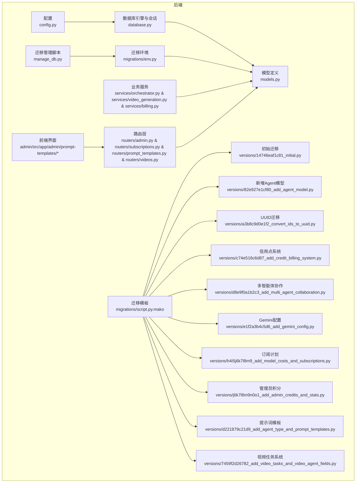
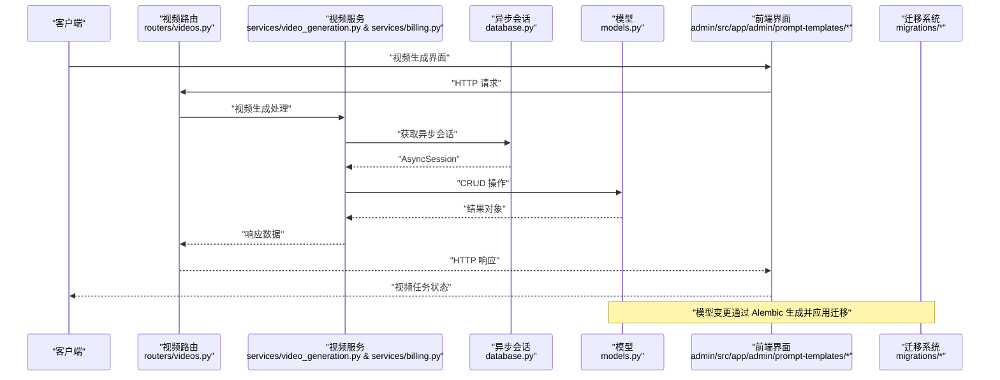
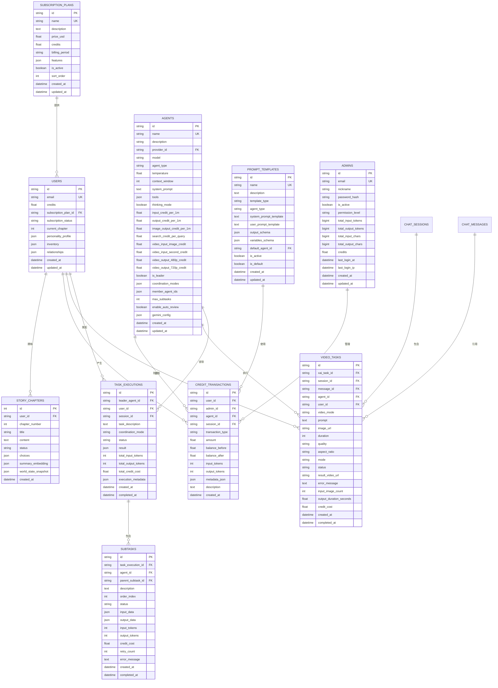
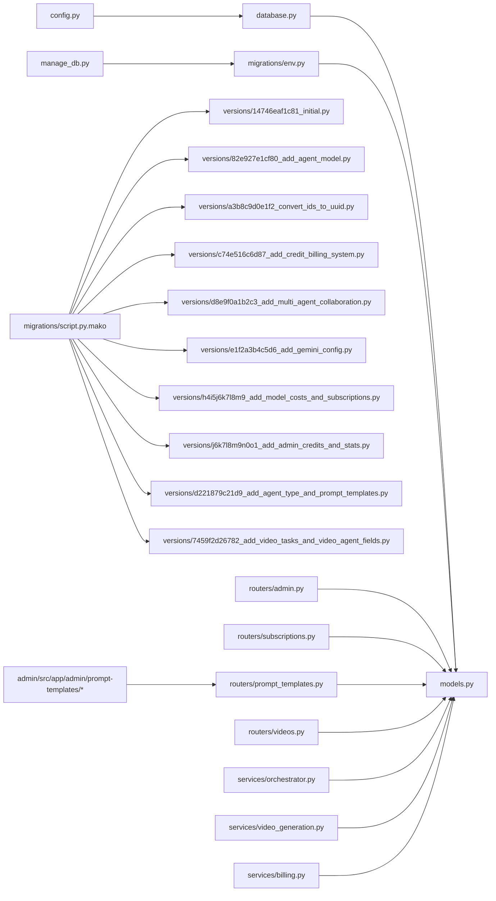
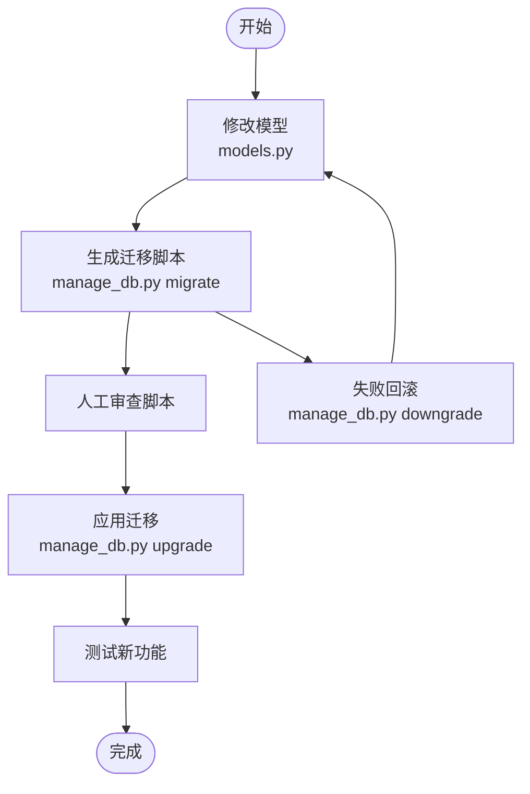

# 数据库模型设计

<cite>
**本文引用的文件**
- [backend/models.py](file://backend/models.py)
- [backend/database.py](file://backend/database.py)
- [backend/config.py](file://backend/config.py)
- [backend/manage_db.py](file://backend/manage_db.py)
- [backend/migrations/env.py](file://backend/migrations/env.py)
- [backend/migrations/script.py.mako](file://backend/migrations/script.py.mako)
- [backend/migrations/versions/14746eaf1c81_initial.py](file://backend/migrations/versions/14746eaf1c81_initial.py)
- [backend/migrations/versions/82e927e1cf80_add_agent_model.py](file://backend/migrations/versions/82e927e1cf80_add_agent_model.py)
- [backend/migrations/versions/a3b8c9d0e1f2_convert_ids_to_uuid.py](file://backend/migrations/versions/a3b8c9d0e1f2_convert_ids_to_uuid.py)
- [backend/migrations/versions/c74e516c6d87_add_credit_billing_system.py](file://backend/migrations/versions/c74e516c6d87_add_credit_billing_system.py)
- [backend/migrations/versions/d8e9f0a1b2c3_add_multi_agent_collaboration.py](file://backend/migrations/versions/d8e9f0a1b2c3_add_multi_agent_collaboration.py)
- [backend/migrations/versions/e1f2a3b4c5d6_add_gemini_config.py](file://backend/migrations/versions/e1f2a3b4c5d6_add_gemini_config.py)
- [backend/migrations/versions/h4i5j6k7l8m9_add_model_costs_and_subscriptions.py](file://backend/migrations/versions/h4i5j6k7l8m9_add_model_costs_and_subscriptions.py)
- [backend/migrations/versions/j6k7l8m9n0o1_add_admin_credits_and_stats.py](file://backend/migrations/versions/j6k7l8m9n0o1_add_admin_credits_and_stats.py)
- [backend/migrations/versions/d221879c21d9_add_agent_type_and_prompt_templates.py](file://backend/migrations/versions/d221879c21d9_add_agent_type_and_prompt_templates.py)
- [backend/migrations/versions/7459f2d26782_add_video_tasks_and_video_agent_fields.py](file://backend/migrations/versions/7459f2d26782_add_video_tasks_and_video_agent_fields.py)
- [backend/services/orchestrator.py](file://backend/services/orchestrator.py)
- [backend/routers/admin.py](file://backend/routers/admin.py)
- [backend/routers/subscriptions.py](file://backend/routers/subscriptions.py)
- [backend/routers/prompt_templates.py](file://backend/routers/prompt_templates.py)
- [backend/routers/videos.py](file://backend/routers/videos.py)
- [backend/services/video_generation.py](file://backend/services/video_generation.py)
- [backend/services/billing.py](file://backend/services/billing.py)
- [backend/schemas.py](file://backend/schemas.py)
- [backend/admin/src/app/admin/prompt-templates/page.tsx](file://backend/admin/src/app/admin/prompt-templates/page.tsx)
- [backend/admin/src/app/admin/prompt-templates/PromptTemplateDialog.tsx](file://backend/admin/src/app/admin/prompt-templates/PromptTemplateDialog.tsx)
</cite>

## 更新摘要
**所做更改**
- 新增 VideoTask 模型，支持异步视频生成任务追踪
- 新增视频计费系统，包括视频输入图片计费、视频输出时长计费
- 新增 Agent 模型中的视频计费字段，支持 text、image、multimodal、video 四种智能体类型
- 新增视频生成路由和相关服务，支持 text_to_video、image_to_video、edit 三种模式
- 新增视频配置和响应模型，支持时长、质量、宽高比等参数

## 目录
1. [简介](#简介)
2. [项目结构](#项目结构)
3. [核心组件](#核心组件)
4. [架构总览](#架构总览)
5. [详细组件分析](#详细组件分析)
6. [依赖分析](#依赖分析)
7. [性能考虑](#性能考虑)
8. [故障排查指南](#故障排查指南)
9. [结论](#结论)
10. [附录](#附录)

## 简介
本文件面向数据库模型设计，围绕 SQLAlchemy 异步 ORM 的模型定义、字段类型选择、关系映射展开；重点阐释 Player 与 StoryChapter 模型的字段、约束与索引设计；并系统讲解数据库迁移机制、Alembic 版本管理与数据模型演进策略；最后给出数据验证规则、业务规则实现与查询优化技巧，并提供模型扩展指南与常见数据操作模式。

**更新** 本次更新反映了应用的重大功能变更，包括新增信用点计费系统、多智能体协作、Gemini配置模型、订阅计划、管理员信用点管理、提示词模板系统以及全新的视频生成和计费功能。

## 项目结构
后端以 FastAPI + SQLAlchemy 异步 ORM 架构为核心，数据库层通过 async/await 实现高并发读写；迁移体系基于 Alembic，提供脚本化版本管理与批量渲染能力；模型文件集中定义数据结构，路由层负责业务校验与数据流编排。新增的视频生成系统通过专门的路由模块、服务层和前端界面实现完整的视频任务管理功能。

**图表来源**
- [backend/config.py](file://backend/config.py#L1-L40)
- [backend/database.py](file://backend/database.py#L1-L31)
- [backend/models.py](file://backend/models.py#L1-L382)
- [backend/migrations/env.py](file://backend/migrations/env.py#L1-L105)
- [backend/migrations/script.py.mako](file://backend/migrations/script.py.mako#L1-L27)
- [backend/migrations/versions/7459f2d26782_add_video_tasks_and_video_agent_fields.py](file://backend/migrations/versions/7459f2d26782_add_video_tasks_and_video_agent_fields.py#L1-L89)
- [backend/routers/videos.py](file://backend/routers/videos.py#L1-L232)
- [backend/services/video_generation.py](file://backend/services/video_generation.py#L1-L203)
- [backend/services/billing.py](file://backend/services/billing.py#L1-L324)

**章节来源**
- [backend/config.py](file://backend/config.py#L1-L40)
- [backend/database.py](file://backend/database.py#L1-L31)
- [backend/models.py](file://backend/models.py#L1-L382)
- [backend/migrations/env.py](file://backend/migrations/env.py#L1-L105)
- [backend/migrations/script.py.mako](file://backend/migrations/script.py.mako#L1-L27)

## 核心组件
- 异步引擎与会话：基于 async/await 的异步数据库引擎与会话工厂，支持连接池与线程安全（SQLite 在特定参数下启用）。
- 模型基类：统一继承 DeclarativeBase，便于 Alembic 自动发现元数据。
- 模型集合：包含 User、StoryChapter、Agent、CreditTransaction、TaskExecution、SubTask、SubscriptionPlan、Admin、PromptTemplate、VideoTask 等。
- 迁移环境：注册模型元数据、支持离线/在线迁移、批量渲染。
- 迁移脚本：版本化管理，支持升级/降级。
- 迁移管理脚本：封装 migrate/upgrade/downgrade 命令，便于本地开发与 CI。
- 提示词模板系统：完整的模板管理、变量定义和渲染功能。
- **新增** 视频任务系统：完整的视频生成任务追踪、计费和状态管理功能。

**更新** 新增了完整的视频任务系统，包括 VideoTask 模型、视频计费字段、视频生成路由和服务层实现。

**章节来源**
- [backend/database.py](file://backend/database.py#L1-L31)
- [backend/models.py](file://backend/models.py#L1-L382)
- [backend/migrations/env.py](file://backend/migrations/env.py#L1-L105)
- [backend/migrations/script.py.mako](file://backend/migrations/script.py.mako#L1-L27)
- [backend/manage_db.py](file://backend/manage_db.py#L1-L67)

## 架构总览
异步 ORM 架构围绕"配置 → 引擎 → 会话 → 模型 → 迁移"展开，路由层与服务层通过异步会话与模型交互，实现数据持久化与业务编排。新增的视频任务系统通过专门的路由模块提供完整的视频生成管理功能，支持异步任务追踪、计费和状态轮询。

**图表来源**
- [backend/routers/videos.py](file://backend/routers/videos.py#L1-L232)
- [backend/services/video_generation.py](file://backend/services/video_generation.py#L1-L203)
- [backend/services/billing.py](file://backend/services/billing.py#L1-L324)
- [backend/database.py](file://backend/database.py#L1-L31)
- [backend/models.py](file://backend/models.py#L352-L382)
- [backend/migrations/env.py](file://backend/migrations/env.py#L1-L105)

## 详细组件分析

### User 模型
- 表名与主键
  - 表名："users"
  - 主键：字符串类型，长度 36，唯一标识符，默认值通过函数生成，建立索引以提升查询性能
- 字段与约束
  - email：字符串，唯一索引，保证邮箱全局唯一
  - credits：浮点数，默认值 0.0，表示用户积分余额
  - subscription_plan_id：外键关联订阅计划表，支持用户订阅管理
  - subscription_status：字符串，默认 "inactive"，枚举值包括 inactive/active/expired
  - 剧场状态字段：current_chapter、personality_profile、inventory、relationships
- 索引设计
  - 主键索引（隐含）
  - id 索引（显式）
  - email 唯一索引
- 业务意义
  - 记录用户身份、积分余额、订阅状态与剧场进度，支撑完整的用户生命周期管理

**更新** 新增了积分余额字段和订阅计划关联，支持完整的计费系统。

**章节来源**
- [backend/models.py](file://backend/models.py#L35-L79)

### StoryChapter 模型
- 表名与主键
  - 表名："story_chapters"
  - 主键：整型自增
- 外键关系
  - user_id → users.id，建立一对一/一对多关联，指向用户
- 字段与约束
  - chapter_number：整型，章节序号
  - title：字符串，章节标题
  - content：文本，章节正文
  - status：字符串，默认 "pending"，枚举值包括 pending/generating/ready/completed
  - choices：JSON，默认空数组，记录分支选项
  - summary_embedding：JSON，向量表示，用于一致性检测
  - world_state_snapshot：JSON，记录世界状态快照
  - created_at：带时区的时间戳，默认服务器时间
- 索引设计
  - 主键索引（隐含）
  - id 索引（显式）
- 业务意义
  - 存储章节内容、状态与分支，支撑动态叙事与 N+2 预生成策略

**章节来源**
- [backend/models.py](file://backend/models.py#L81-L101)

### Agent 模型
- 表名与主键
  - 表名："agents"
  - 主键：字符串类型，长度 36，唯一标识符，默认值通过函数生成，建立索引以提升查询性能
- 字段与约束
  - name：字符串，唯一索引，保证智能体名称全局唯一
  - description：字符串，智能体描述
  - provider_id：外键关联 LLMProvider，指定使用的AI服务提供商
  - model：字符串，具体的模型名称
  - agent_type：字符串，默认 "text"，支持 text/image/multimodal/video 智能体类型
  - temperature：浮点数，默认 0.7，控制生成随机性
  - context_window：整数，默认 4096，上下文窗口大小
  - system_prompt：文本，系统提示词
  - tools：JSON，默认空数组，启用的工具列表
  - thinking_mode：布尔值，默认 False，开启深度思考模式
  - input_credit_per_1m：浮点数，默认 0.0，每1M输入tokens的积分费率
  - output_credit_per_1m：浮点数，默认 0.0，每1M输出tokens的积分费率
  - image_output_credit_per_1m：浮点数，默认 0.0，每1M图像输出tokens的积分费率
  - search_credit_per_query：浮点数，默认 0.0，每次搜索查询的积分费用
  - **新增** video_input_image_credit：浮点数，默认 0.0，每张输入图片的积分费用
  - **新增** video_input_second_credit：浮点数，默认 0.0，每秒输入视频的积分费用
  - **新增** video_output_480p_credit：浮点数，默认 0.0，每秒480p输出的积分费用
  - **新增** video_output_720p_credit：浮点数，默认 0.0，每秒720p输出的积分费用
  - is_leader：布尔值，默认 False，标记是否为领导者
  - coordination_modes：JSON，默认空数组，支持的协调模式列表
  - member_agent_ids：JSON，默认空数组，领导者可协调的智能体ID列表
  - max_subtasks：整数，默认 10，最大子任务数量
  - enable_auto_review：布尔值，默认 True，自动审核开关
  - gemini_config：JSON，默认空字典，Gemini 3.1高级配置
- 索引设计
  - 主键索引（隐含）
  - id 索引（显式）
  - name 唯一索引
  - agent_type 索引
- 业务意义
  - 支持多智能体协作、计费定价、智能体类型区分和Gemini配置管理
  - **新增** 支持视频生成智能体，具备完整的视频计费能力

**更新** 新增了四种视频计费字段，支持 text、image、multimodal、video 四种智能体类型。

**章节来源**
- [backend/models.py](file://backend/models.py#L167-L220)

### VideoTask 模型
- 表名与主键
  - 表名："video_tasks"
  - 主键：字符串类型，长度 36，唯一标识符，默认值通过函数生成，建立索引以提升查询性能
- 外键关系
  - session_id → chat_sessions.id，关联聊天会话（可选）
  - message_id → chat_messages.id，关联聊天消息（可选）
  - agent_id → agents.id，关联智能体
  - user_id → users.id，关联用户
- 字段与约束
  - xai_task_id：字符串，长度 255，外部 xAI 任务ID（索引）
  - video_mode：字符串，长度 20，支持 text_to_video/image_to_video/edit
  - prompt：文本，视频生成提示词
  - image_url：字符串，输入图片URL（可选）
  - duration：整数，默认 5，视频时长（1-15秒）
  - quality：字符串，长度 10，默认 "720p"，支持 480p/720p
  - aspect_ratio：字符串，长度 10，默认 "16:9"，宽高比
  - mode：字符串，长度 10，默认 "normal"，保留字段
  - status：字符串，长度 20，默认 "pending"，支持 pending/processing/completed/failed（索引）
  - result_video_url：字符串，结果视频URL（可选）
  - error_message：文本，错误信息（可选）
  - input_image_count：整数，默认 0，输入图片数量
  - output_duration_seconds：浮点数，默认 0.0，输出视频时长
  - credit_cost：浮点数，默认 0.0，积分费用
  - created_at：带时区的时间戳，默认服务器时间
  - completed_at：带时区的时间戳（可选）
- 索引设计
  - 主键索引（隐含）
  - id 索引（显式）
  - status 索引
  - user_id 索引
  - xai_task_id 索引
- 业务意义
  - 异步视频生成任务追踪，支持完整的视频生成生命周期管理
  - 集成计费系统，自动计算和记录视频生成费用

**新增** 视频任务系统的核心模型，支持异步视频生成、状态追踪和计费功能。

**章节来源**
- [backend/models.py](file://backend/models.py#L352-L382)

### PromptTemplate 模型
- 表名与主键
  - 表名："prompt_templates"
  - 主键：字符串类型，长度 36，唯一标识符，默认值通过函数生成，建立索引以提升查询性能
- 外键关系
  - default_agent_id → agents.id，关联默认使用的智能体（可选）
- 字段与约束
  - name：字符串，长度 100，唯一索引，保证模板名称全局唯一
  - description：文本，模板描述
  - template_type：字符串，长度 50，枚举值包括 story_basic/character/scene/storyboard/custom
  - agent_type：字符串，默认 "text"，支持 text/image/multimodal/video 智能体类型
  - system_prompt_template：文本，系统提示词模板（支持 Jinja2 变量语法）
  - user_prompt_template：文本，用户提示词模板（可选）
  - output_schema：JSON，默认空字典，输出格式定义（JSON Schema 或示例）
  - variables_schema：JSON，默认空数组，模板变量定义说明
  - is_active：布尔值，默认 True，模板状态
  - is_default：布尔值，默认 False，是否为该类型的默认模板
- 索引设计
  - 主键索引（隐含）
  - id 索引（显式）
  - name 唯一索引
  - template_type 索引
- 业务意义
  - 支持剧场创建等场景的 AI 生成任务，提供模板化提示词管理

**更新** 新增了 video 智能体类型支持，扩展了模板系统的能力范围。

**章节来源**
- [backend/models.py](file://backend/models.py#L287-L322)

### CreditTransaction 模型
- 表名与主键
  - 表名："credit_transactions"
  - 主键：字符串类型，长度 36，唯一标识符，默认值通过函数生成
- 外键关系
  - user_id → users.id，关联用户
  - admin_id → admins.id，关联管理员（可选）
  - agent_id → agents.id，关联智能体（可选）
  - session_id → chat_sessions.id，关联聊天会话（可选）
- 字段与约束
  - transaction_type：字符串，长度 20，枚举值包括 deduction/recharge/admin_adjust
  - amount：浮点数，正数表示充值，负数表示扣费
  - balance_before/balance_after：浮点数，记录交易前后余额
  - input_tokens/output_tokens：整数，记录使用的token数量
  - metadata_json：JSON，默认空字典，存储费率快照等扩展信息
  - description：文本，交易描述
  - created_at：带时区的时间戳，默认服务器时间
- 索引设计
  - 主键索引（隐含）
  - user_id 索引
  - admin_id 索引
- 业务意义
  - 完整记录所有积分交易，支持审计和财务统计

**新增** 这是信用点计费系统的核心模型，实现了完整的交易记录功能。

**章节来源**
- [backend/models.py](file://backend/models.py#L222-L242)

### TaskExecution 模型
- 表名与主键
  - 表名："task_executions"
  - 主键：字符串类型，长度 36，唯一标识符，默认值通过函数生成，建立索引以提升查询性能
- 外键关系
  - leader_agent_id → agents.id，关联领导者智能体
  - user_id → users.id，关联执行用户
  - session_id → chat_sessions.id，关联聊天会话（可选）
- 字段与约束
  - task_description：文本，任务描述
  - coordination_mode：字符串，长度 20，支持 auto/pipeline/plan/discussion
  - status：字符串，长度 20，默认 "pending"，枚举值包括 pending/running/completed/failed
  - total_input_tokens/total_output_tokens：整数，记录总token消耗
  - total_credit_cost：浮点数，记录总积分消耗
  - result：JSON，存储执行结果
  - execution_metadata：JSON，默认空字典，存储执行元数据
  - created_at/completed_at：带时区的时间戳
- 索引设计
  - 主键索引（隐含）
  - user_id 索引
  - status 索引
- 业务意义
  - 记录多智能体任务执行的完整生命周期

**新增** 支持多智能体协作的核心模型，实现了任务执行跟踪。

**章节来源**
- [backend/models.py](file://backend/models.py#L244-L265)

### SubTask 模型
- 表名与主键
  - 表名："subtasks"
  - 主键：字符串类型，长度 36，唯一标识符，默认值通过函数生成，建立索引以提升查询性能
- 外键关系
  - task_execution_id → task_executions.id，关联父任务执行
  - agent_id → agents.id，关联执行智能体
  - parent_subtask_id → subtasks.id，关联父子任务（自引用）
- 字段与约束
  - description：文本，子任务描述
  - order_index：整数，默认 0，记录执行顺序
  - status：字符串，长度 20，默认 "pending"
  - input_data/output_data：JSON，记录输入输出数据
  - input_tokens/output_tokens：整数，记录token消耗
  - credit_cost：浮点数，默认 0.0，记录积分消耗
  - retry_count：整数，默认 0，重试次数
  - error_message：文本，错误信息
  - created_at/completed_at：带时区的时间戳
- 索引设计
  - 主键索引（隐含）
  - task_execution_id 索引
- 业务意义
  - 记录多智能体任务中的具体执行单元

**新增** 多智能体协作的细粒度执行模型。

**章节来源**
- [backend/models.py](file://backend/models.py#L267-L291)

### SubscriptionPlan 模型
- 表名与主键
  - 表名："subscription_plans"
  - 主键：字符串类型，长度 36，唯一标识符，默认值通过函数生成，建立索引以提升查询性能
- 字段与约束
  - name：字符串，长度 100，唯一索引，保证套餐名称全局唯一
  - description：文本，套餐描述
  - price_usd：浮点数，必须大于 0，套餐价格（美元）
  - credits：浮点数，必须大于 0，包含的积分数
  - billing_period：字符串，长度 20，默认 "monthly"，枚举值包括 monthly/yearly/lifetime
  - features：JSON，默认空数组，套餐特性列表
  - is_active：布尔值，默认 True，套餐状态
  - sort_order：整数，默认 0，前端排序展示
  - created_at/updated_at：带时区的时间戳
- 索引设计
  - 主键索引（隐含）
  - name 唯一索引
- 业务意义
  - 定义完整的订阅套餐配置，支持积分包购买

**新增** 订阅计划管理的核心模型。

**章节来源**
- [backend/models.py](file://backend/models.py#L330-L350)

### Admin 模型
- 表名与主键
  - 表名："admins"
  - 主键：字符串类型，长度 36，唯一标识符，默认值通过函数生成，建立索引以提升查询性能
- 字段与约束
  - email：字符串，唯一索引，保证管理员邮箱全局唯一
  - credits：浮点数，默认 0.0，管理员积分余额
  - total_input_tokens/total_output_tokens：BigInteger，默认 0，统计输入输出token
  - total_input_chars/total_output_chars：BigInteger，默认 0，统计字符数
  - 权限字段：permission_level，默认 "admin"
- 索引设计
  - 主键索引（隐含）
  - email 唯一索引
- 业务意义
  - 独立的管理员账户系统，支持积分管理和统计

**更新** 新增了管理员积分余额和详细的统计字段。

**章节来源**
- [backend/models.py](file://backend/models.py#L10-L33)

### 关系映射与一致性
- User 与 StoryChapter：一对多关系，通过 user_id 外键关联
- Agent 与 CreditTransaction：一对多关系，通过 agent_id 外键关联
- User 与 CreditTransaction：一对多关系，通过 user_id 外键关联
- TaskExecution 与 SubTask：一对多关系，通过 task_execution_id 外键关联
- Agent 与 TaskExecution：一对多关系，通过 leader_agent_id 外键关联
- SubscriptionPlan 与 User：一对多关系，通过 subscription_plan_id 外键关联
- PromptTemplate 与 Agent：一对多关系，通过 default_agent_id 外键关联
- **新增** Agent 与 VideoTask：一对多关系，通过 agent_id 外键关联
- **新增** User 与 VideoTask：一对多关系，通过 user_id 外键关联
- **新增** ChatSession 与 VideoTask：一对多关系，通过 session_id 外键关联
- **新增** ChatMessage 与 VideoTask：一对多关系，通过 message_id 外键关联
- 迁移中对 UUID 的转换：将主键从整型迁移到字符串 UUID，同时重建外键与索引，确保引用完整性

**图表来源**
- [backend/models.py](file://backend/models.py#L1-L382)

**章节来源**
- [backend/models.py](file://backend/models.py#L1-L382)
- [backend/migrations/versions/a3b8c9d0e1f2_convert_ids_to_uuid.py](file://backend/migrations/versions/a3b8c9d0e1f2_convert_ids_to_uuid.py#L78-L172)

### 字段类型选择与复杂度分析
- 字符串与文本
  - String/Text：适合标题、描述、提示词等可变长内容；Text 更适合大文本
- JSON
  - 用于存储结构化配置与动态数据（如 inventory、relationships、models、tags、tools、gemini_config、variables_schema 等）；查询时可结合数据库 JSON 函数进行过滤与检索
- 时间戳
  - DateTime(timezone=True) + server_default/ onupdate：确保时区一致性与自动维护更新时间
- 数值与布尔
  - Integer/Float/Boolean：用于数值型状态与开关型配置
  - BigInteger：用于大量统计数据的token计数
- 索引与约束
  - 唯一索引（UK）用于 email、name 等唯一标识字段
  - 外键约束确保引用完整性
  - JSON 默认值用于空结构化数据的占位

**更新** 新增了浮点数类型的视频计费字段、JSON类型的配置字段和BigInteger类型的统计字段，以及新增的智能体类型字段。

**章节来源**
- [backend/models.py](file://backend/models.py#L1-L382)

### 数据验证规则与业务规则实现
- 路由层校验
  - 创建/更新 Agent 时，校验 name 唯一性；校验 provider_id 存在；校验 model 是否在 provider.models 列表内
  - 管理员路由中，校验用户存在性；校验订阅计划名称唯一性
  - 提示词模板路由中，校验模板名称唯一性；支持模板类型和智能体类型验证
  - **新增** 视频生成路由中，校验 Agent 存在性和 provider_id；校验视频模式有效性；校验配置参数范围
- 服务层校验
  - 创建用户时，直接插入并返回对象
  - 初始化世界时，先生成世界观，再生成章节并保存
  - 多智能体协作中，校验领导者权限和成员资格
  - 信用点交易中，确保余额不为负数
  - 模板渲染中，使用 Jinja2 引擎进行变量替换和错误处理
  - **新增** 视频生成中，校验输入图片数量；调用 xAI API 提交任务；处理轮询状态更新
- 数据一致性
  - 使用 UUID 主键与外键，避免整型 ID 的冲突与暴露风险
  - 通过 JSON 字段存储动态数据，结合向量 embedding 与 world_state_snapshot 实现一致性检测
  - 通过 CreditTransaction 表确保所有积分变动都有审计记录
  - 模板默认状态管理，确保同一类型只有一个默认模板
  - **新增** 视频任务状态管理，确保异步任务的完整生命周期追踪

**更新** 新增了视频任务系统的业务规则，包括 Agent 校验、配置验证、状态轮询和计费处理。

**章节来源**
- [backend/routers/admin.py](file://backend/routers/admin.py#L141-L187)
- [backend/routers/admin.py](file://backend/routers/admin.py#L190-L200)
- [backend/routers/subscriptions.py](file://backend/routers/subscriptions.py#L21-L37)
- [backend/routers/subscriptions.py](file://backend/routers/subscriptions.py#L69-L100)
- [backend/routers/prompt_templates.py](file://backend/routers/prompt_templates.py#L32-L58)
- [backend/routers/prompt_templates.py](file://backend/routers/prompt_templates.py#L99-L138)
- [backend/routers/videos.py](file://backend/routers/videos.py#L23-L104)
- [backend/services/orchestrator.py](file://backend/services/orchestrator.py#L128-L162)

### 查询优化技巧
- 建立必要索引
  - 主键索引（隐含）
  - 唯一索引：email、name
  - 外键索引：session_id、user_id 等高频过滤字段
  - 新增索引：credit_transactions.user_id、task_executions.user_id、subtasks.task_execution_id、prompt_templates.template_type、**video_tasks.status、video_tasks.user_id、video_tasks.xai_task_id**
- 使用 JSON 查询
  - 结合数据库 JSON 函数进行条件过滤与排序，避免全表扫描
- 分页与过滤
  - 路由层支持 skip/limit 与模糊搜索，降低单次查询负载
- 异步批处理
  - 使用异步会话与批量插入/更新，提升吞吐量
- 事务管理
  - 信用点交易使用原子性操作，确保数据一致性
  - 模板默认状态更新使用批量操作，避免竞态条件
  - **新增** 视频任务状态更新使用原子性操作，确保并发安全

**更新** 新增了针对视频任务模型的索引优化建议和事务管理策略。

**章节来源**
- [backend/routers/admin.py](file://backend/routers/admin.py#L53-L83)
- [backend/database.py](file://backend/database.py#L19-L23)

### 模型扩展指南
- 新增表
  - 在 models.py 中定义模型，确保继承 Base 并设置 __tablename__
  - 如涉及外键，明确约束与索引
  - 为高频查询字段建立索引
- 新增字段
  - 优先使用 JSON 存储动态结构，配合默认值与校验
  - 对于数值型计费字段，使用 Float 类型并设置默认值
  - 对于统计字段，使用 BigInteger 类型
  - 对于枚举类型，使用 String 类型并设置默认值
- 变更约束
  - 使用 Alembic 生成迁移脚本，避免直接修改数据库结构
  - 对 SQLite，注意批量渲染与列变更限制
- 信用点系统扩展
  - 新增计费字段时，同步更新 CreditTransaction 模型
  - 确保所有计费操作都有对应的交易记录
- 提示词模板系统扩展
  - 新增模板类型时，更新前端界面和路由验证
  - 模板变量定义遵循 JSON Schema 格式
  - 支持多种智能体类型和输出格式
- **新增** 视频任务系统扩展
  - 新增视频模式时，更新服务层处理逻辑
  - 支持新的计费维度和质量规格
  - 扩展前端界面以支持视频生成配置

**更新** 新增了视频任务系统和智能体类型扩展的指导原则。

**章节来源**
- [backend/models.py](file://backend/models.py#L1-L382)
- [backend/migrations/versions/c74e516c6d87_add_credit_billing_system.py](file://backend/migrations/versions/c74e516c6d87_add_credit_billing_system.py#L21-L53)
- [backend/migrations/versions/d8e9f0a1b2c3_add_multi_agent_collaboration.py](file://backend/migrations/versions/d8e9f0a1b2c3_add_multi_agent_collaboration.py#L21-L82)
- [backend/migrations/versions/d221879c21d9_add_agent_type_and_prompt_templates.py](file://backend/migrations/versions/d221879c21d9_add_agent_type_and_prompt_templates.py#L21-L84)
- [backend/migrations/versions/7459f2d26782_add_video_tasks_and_video_agent_fields.py](file://backend/migrations/versions/7459f2d26782_add_video_tasks_and_video_agent_fields.py#L21-L66)

## 依赖分析
- 组件耦合
  - models.py 依赖 database.Base，统一元数据注册
  - migrations/env.py 注册 models，确保 Alembic 能发现模型
  - routers/admin.py 依赖 models 与 schemas，实现管理员功能
  - routers/subscriptions.py 依赖 models 与 schemas，实现订阅管理
  - routers/prompt_templates.py 依赖 models 与 schemas，实现提示词模板管理
  - **新增** routers/videos.py 依赖 models 与 schemas，实现视频生成管理
  - services/orchestrator.py 依赖 models，实现多智能体协作
  - **新增** services.video_generation 依赖 models 与 agents，实现视频生成服务
  - **新增** services.billing 依赖 models，实现计费计算
  - admin 页面依赖 routers 和 schemas，实现模板管理界面
- 外部依赖
  - SQLAlchemy 异步引擎与会话
  - Alembic 迁移框架
  - FastAPI 路由与依赖注入
  - Jinja2 模板引擎（用于模板变量渲染）
  - **新增** xAI API（用于视频生成服务）

**图表来源**
- [backend/config.py](file://backend/config.py#L1-L40)
- [backend/database.py](file://backend/database.py#L1-L31)
- [backend/models.py](file://backend/models.py#L1-L382)
- [backend/migrations/env.py](file://backend/migrations/env.py#L1-L105)
- [backend/migrations/script.py.mako](file://backend/migrations/script.py.mako#L1-L27)
- [backend/routers/admin.py](file://backend/routers/admin.py#L1-L498)
- [backend/routers/subscriptions.py](file://backend/routers/subscriptions.py#L1-L119)
- [backend/routers/prompt_templates.py](file://backend/routers/prompt_templates.py#L1-L303)
- [backend/routers/videos.py](file://backend/routers/videos.py#L1-L232)
- [backend/admin/src/app/admin/prompt-templates/page.tsx](file://backend/admin/src/app/admin/prompt-templates/page.tsx#L1-L268)
- [backend/admin/src/app/admin/prompt-templates/PromptTemplateDialog.tsx](file://backend/admin/src/app/admin/prompt-templates/PromptTemplateDialog.tsx#L1-L416)
- [backend/services/orchestrator.py](file://backend/services/orchestrator.py#L1-L889)
- [backend/services/video_generation.py](file://backend/services/video_generation.py#L1-L203)
- [backend/services/billing.py](file://backend/services/billing.py#L1-L324)
- [backend/manage_db.py](file://backend/manage_db.py#L1-L67)

**章节来源**
- [backend/config.py](file://backend/config.py#L1-L40)
- [backend/database.py](file://backend/database.py#L1-L31)
- [backend/models.py](file://backend/models.py#L1-L382)
- [backend/migrations/env.py](file://backend/migrations/env.py#L1-L105)
- [backend/migrations/script.py.mako](file://backend/migrations/script.py.mako#L1-L27)

## 性能考虑
- 连接池与异步
  - 异步引擎 + 连接池配置，减少阻塞与上下文切换开销
- 索引策略
  - 对高频过滤字段建立索引，避免全表扫描
  - 新增：为 credit_transactions.user_id、task_executions.user_id、subtasks.task_execution_id、prompt_templates.template_type、**video_tasks.status、video_tasks.user_id、video_tasks.xai_task_id** 建立索引
- JSON 查询
  - 合理使用 JSON 默认值与结构化字段，避免过度嵌套
- 批量操作
  - 使用批量插入/更新与异步事务，提升吞吐量
  - 模板默认状态更新使用批量操作
  - **新增** 视频任务状态轮询使用异步处理，避免阻塞主线程
- SQLite 限制
  - 使用批量渲染模式应对 ALTER 限制，谨慎进行列变更
- 信用点计费优化
  - 使用原子性操作确保积分扣费的一致性
  - 缓存常用费率信息，减少数据库查询
  - **新增** 视频计费使用映射表驱动，避免复杂的 if-else 分支
- 模板渲染优化
  - 使用缓存机制存储常用模板
  - Jinja2 模板编译结果缓存
  - 模板变量验证提前进行，避免运行时错误
- **新增** 视频生成优化
  - 异步任务处理，避免阻塞 API 响应
  - 轮询超时保护，防止长时间挂起
  - 内容审核检查，确保生成内容合规

**更新** 新增了针对视频任务系统的性能优化建议，包括异步处理、轮询保护和内容审核。

**章节来源**
- [backend/database.py](file://backend/database.py#L8-L23)
- [backend/models.py](file://backend/models.py#L1-L382)
- [backend/services/billing.py](file://backend/services/billing.py#L22-L35)

## 故障排查指南
- 数据库未升级
  - 现象：目标数据库不是最新版本
  - 处理：执行升级命令或重启后端服务
- SQLite 不支持的 ALTER
  - 现象：复杂列变更失败
  - 处理：检查迁移脚本是否启用批量渲染，必要时手动调整
- 多人协作产生分叉
  - 现象：出现多个 head
  - 处理：修改 down_revision 指向，或将迁移脚本合并
- UUID 迁移后数据丢失
  - 说明：UUID 迁移为破坏性操作，需确保备份与映射正确
- 路由校验失败
  - 现象：Agent 名称重复或模型不在提供者列表
  - 处理：检查提供者配置与模型列表格式
- 信用点交易异常
  - 现象：积分余额不正确或交易记录缺失
  - 处理：检查 CreditTransaction 表的外键约束和索引
- 多智能体协作失败
  - 现象：任务执行状态异常或子任务丢失
  - 处理：检查 TaskExecution 和 SubTask 的外键关系
- 提示词模板渲染失败
  - 现象：模板变量渲染错误或智能体选择失败
  - 处理：检查模板变量定义、Jinja2 模板语法和智能体类型匹配
- 模板默认状态冲突
  - 现象：同一类型多个默认模板
  - 处理：检查模板更新逻辑，确保默认状态互斥
- **新增** 视频任务生成失败
  - 现象：视频生成任务状态卡在 pending 或失败
  - 处理：检查 xAI API 配置；验证 Agent 的视频计费字段；检查网络连接
- **新增** 视频计费异常
  - 现象：视频费用计算错误或积分扣费失败
  - 处理：检查 Agent 的视频计费字段配置；验证视频时长和质量设置；确认用户余额充足
- **新增** 视频状态轮询问题
  - 现象：轮询接口返回错误或状态不更新
  - 处理：检查 xAI API 轮询端点；验证任务超时保护逻辑；检查错误日志

**更新** 新增了视频任务系统相关的故障排查指南，包括 API 配置、计费计算和状态轮询问题。

**章节来源**
- [backend/routers/admin.py](file://backend/routers/admin.py#L141-L187)
- [backend/routers/subscriptions.py](file://backend/routers/subscriptions.py#L27-L31)
- [backend/routers/prompt_templates.py](file://backend/routers/prompt_templates.py#L157-L275)
- [backend/routers/videos.py](file://backend/routers/videos.py#L107-L185)
- [backend/migrations/versions/c74e516c6d87_add_credit_billing_system.py](file://backend/migrations/versions/c74e516c6d87_add_credit_billing_system.py#L55-L66)

## 结论
本项目采用 SQLAlchemy 异步 ORM 与 Alembic 迁移体系，构建了可演进、可扩展的数据层。通过本次更新，系统新增了完整的信用点计费系统、多智能体协作能力、Gemini配置支持、订阅计划管理、管理员信用点管理、提示词模板系统以及全新的视频生成和计费功能，形成了从用户管理到智能体协作再到模板化和视频生成的完整数据库架构。

User 与 StoryChapter 模型通过合理的字段类型、约束与索引设计，支撑动态叙事与一致性校验；新增的 CreditTransaction、TaskExecution、SubTask、SubscriptionPlan、Admin、PromptTemplate 和 **VideoTask** 模型完善了计费、协作、管理、模板化、智能体类型区分和视频生成功能；迁移脚本与管理脚本提供了可控的版本演进路径；路由与服务层实现了数据验证与业务编排。

视频任务系统通过 VideoTask 模型支持异步视频生成、状态追踪和计费功能，包括 text_to_video、image_to_video、edit 三种模式，支持时长、质量、宽高比等参数配置。计费系统使用映射表驱动的方式，避免复杂的 if-else 分支，支持输入图片计费、输出时长计费等多种计费维度。前端界面通过专门的视频生成界面实现完整的视频任务管理体验。

建议在后续迭代中持续完善索引策略、JSON 查询与批量操作，特别是针对视频任务系统的异步处理和计费计算，以进一步提升性能与可维护性。

## 附录
- 常见数据操作模式
  - 创建用户：服务层创建 User 并持久化
  - 初始化世界：生成世界观与章节，保存至 StoryChapter
  - Agent 校验：校验提供者存在与模型可用性
  - 积分交易：管理员手动调整用户积分并记录交易
  - 多智能体协作：领导者创建任务执行并分配子任务
  - 订阅管理：创建订阅计划并关联用户
  - 模板管理：创建、更新、删除提示词模板
  - 模板渲染：使用 Jinja2 引擎渲染模板变量
  - AI 生成：调用 LLM 接口生成内容并计算费用
  - **新增** 视频生成：提交视频任务至 xAI API，异步轮询状态并计费
  - **新增** 视频计费：根据输入图片数量和输出时长计算积分费用
- 迁移流程图

**图表来源**
- [backend/manage_db.py](file://backend/manage_db.py#L20-L38)