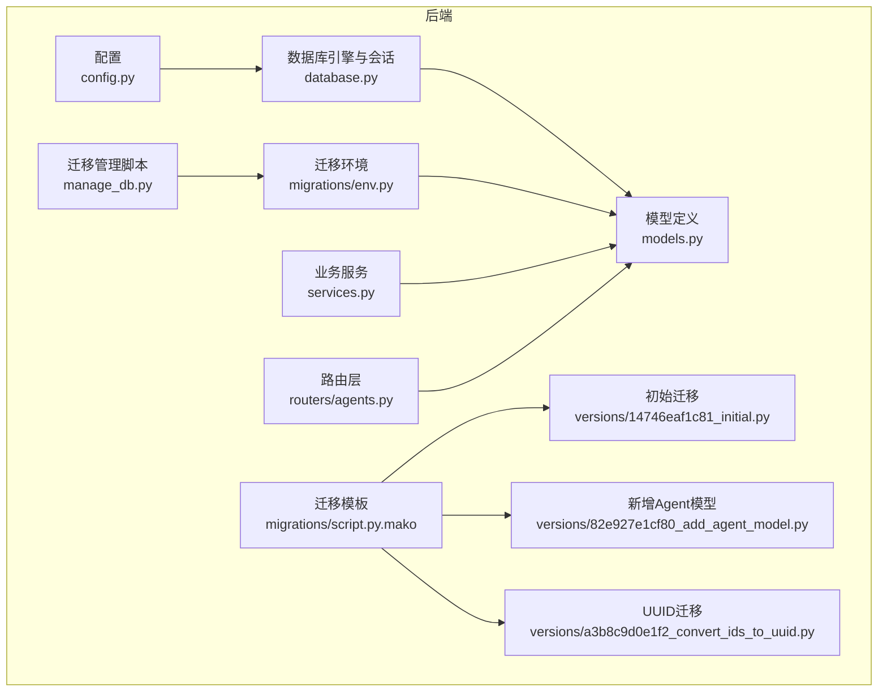
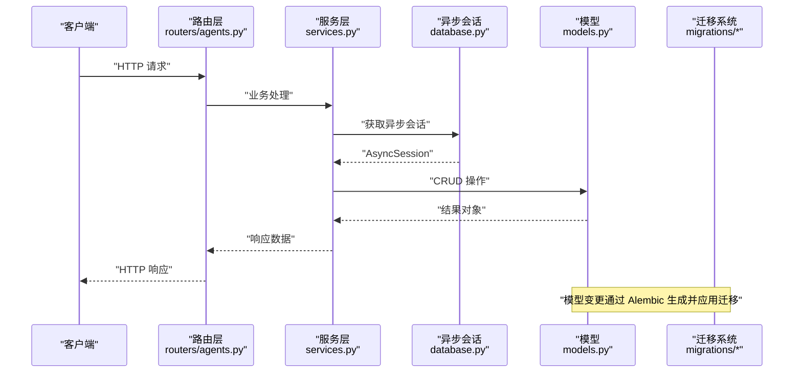
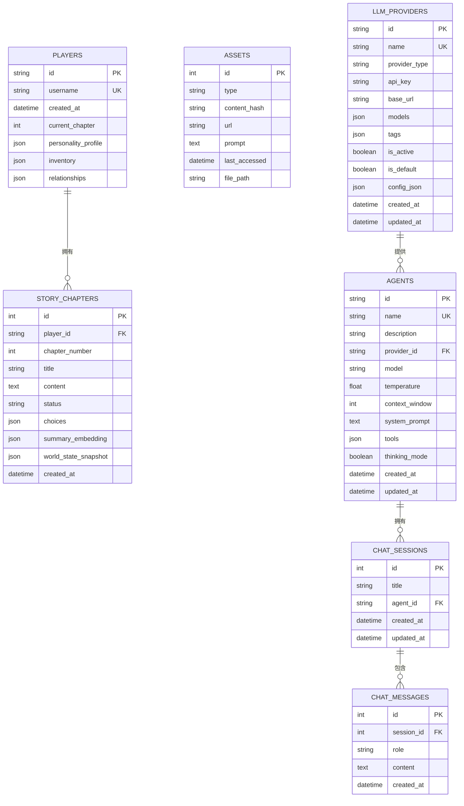
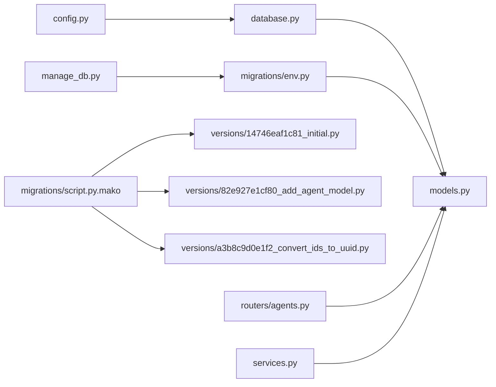
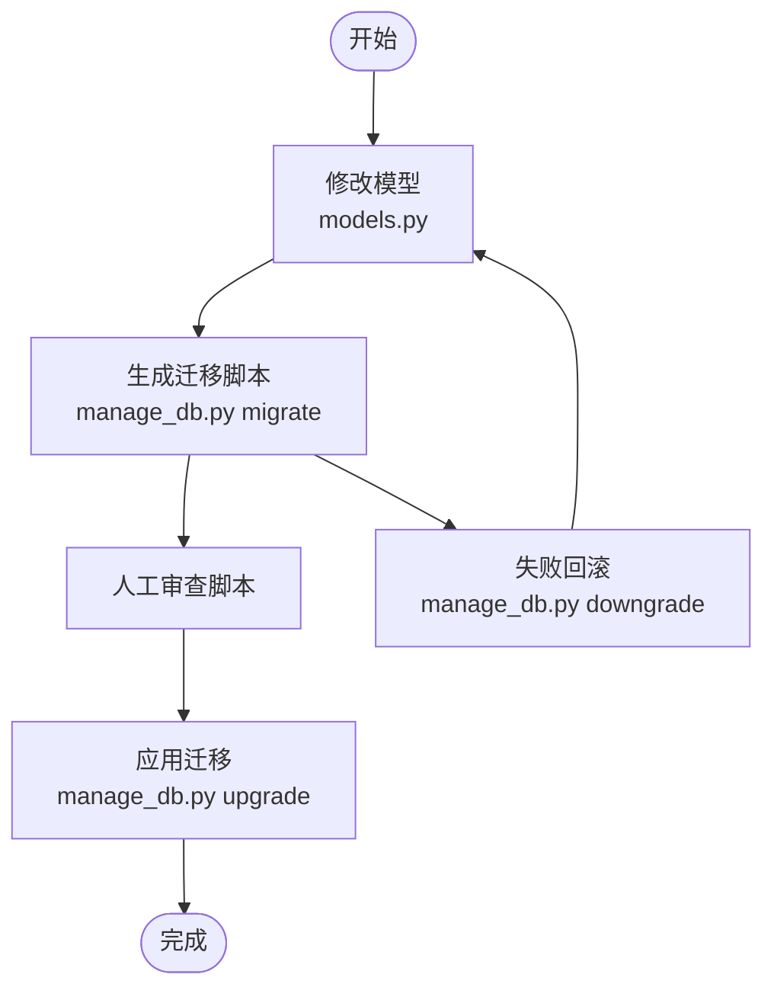

# 数据库模型设计

<cite>
**本文引用的文件**
- [backend/models.py](file://backend/models.py)
- [backend/database.py](file://backend/database.py)
- [backend/config.py](file://backend/config.py)
- [backend/manage_db.py](file://backend/manage_db.py)
- [backend/migrations/env.py](file://backend/migrations/env.py)
- [backend/migrations/script.py.mako](file://backend/migrations/script.py.mako)
- [backend/migrations/versions/14746eaf1c81_initial.py](file://backend/migrations/versions/14746eaf1c81_initial.py)
- [backend/migrations/versions/82e927e1cf80_add_agent_model.py](file://backend/migrations/versions/82e927e1cf80_add_agent_model.py)
- [backend/migrations/versions/a3b8c9d0e1f2_convert_ids_to_uuid.py](file://backend/migrations/versions/a3b8c9d0e1f2_convert_ids_to_uuid.py)
- [backend/services.py](file://backend/services.py)
- [backend/routers/agents.py](file://backend/routers/agents.py)
- [docs/wiki/Database-Migration.md](file://docs/wiki/Database-Migration.md)
- [docs/wiki/Backend-Guide.md](file://docs/wiki/Backend-Guide.md)
</cite>

## 目录
1. [简介](#简介)
2. [项目结构](#项目结构)
3. [核心组件](#核心组件)
4. [架构总览](#架构总览)
5. [详细组件分析](#详细组件分析)
6. [依赖分析](#依赖分析)
7. [性能考虑](#性能考虑)
8. [故障排查指南](#故障排查指南)
9. [结论](#结论)
10. [附录](#附录)

## 简介
本文件面向数据库模型设计，围绕 SQLAlchemy 异步 ORM 的模型定义、字段类型选择、关系映射展开；重点阐释 Player 与 StoryChapter 模型的字段、约束与索引设计；并系统讲解数据库迁移机制、Alembic 版本管理与数据模型演进策略；最后给出数据验证规则、业务规则实现与查询优化技巧，并提供模型扩展指南与常见数据操作模式。

## 项目结构
后端以 FastAPI + SQLAlchemy 异步 ORM 架构为核心，数据库层通过 async/await 实现高并发读写；迁移体系基于 Alembic，提供脚本化版本管理与批量渲染能力；模型文件集中定义数据结构，路由层负责业务校验与数据流编排。

**图表来源**
- [backend/config.py](file://backend/config.py#L1-L34)
- [backend/database.py](file://backend/database.py#L1-L31)
- [backend/models.py](file://backend/models.py#L1-L122)
- [backend/migrations/env.py](file://backend/migrations/env.py#L1-L105)
- [backend/migrations/script.py.mako](file://backend/migrations/script.py.mako#L1-L27)
- [backend/migrations/versions/14746eaf1c81_initial.py](file://backend/migrations/versions/14746eaf1c81_initial.py#L1-L43)
- [backend/migrations/versions/82e927e1cf80_add_agent_model.py](file://backend/migrations/versions/82e927e1cf80_add_agent_model.py#L1-L54)
- [backend/migrations/versions/a3b8c9d0e1f2_convert_ids_to_uuid.py](file://backend/migrations/versions/a3b8c9d0e1f2_convert_ids_to_uuid.py#L1-L327)
- [backend/services.py](file://backend/services.py#L1-L66)
- [backend/routers/agents.py](file://backend/routers/agents.py#L1-L141)
- [backend/manage_db.py](file://backend/manage_db.py#L1-L67)

**章节来源**
- [backend/config.py](file://backend/config.py#L1-L34)
- [backend/database.py](file://backend/database.py#L1-L31)
- [backend/models.py](file://backend/models.py#L1-L122)
- [backend/migrations/env.py](file://backend/migrations/env.py#L1-L105)
- [backend/migrations/script.py.mako](file://backend/migrations/script.py.mako#L1-L27)
- [backend/migrations/versions/14746eaf1c81_initial.py](file://backend/migrations/versions/14746eaf1c81_initial.py#L1-L43)
- [backend/migrations/versions/82e927e1cf80_add_agent_model.py](file://backend/migrations/versions/82e927e1cf80_add_agent_model.py#L1-L54)
- [backend/migrations/versions/a3b8c9d0e1f2_convert_ids_to_uuid.py](file://backend/migrations/versions/a3b8c9d0e1f2_convert_ids_to_uuid.py#L1-L327)
- [backend/services.py](file://backend/services.py#L1-L66)
- [backend/routers/agents.py](file://backend/routers/agents.py#L1-L141)
- [backend/manage_db.py](file://backend/manage_db.py#L1-L67)

## 核心组件
- 异步引擎与会话：基于 async/await 的异步数据库引擎与会话工厂，支持连接池与线程安全（SQLite 在特定参数下启用）。
- 模型基类：统一继承 DeclarativeBase，便于 Alembic 自动发现元数据。
- 模型集合：包含 Player、StoryChapter、Asset、LLMProvider、ChatSession、ChatMessage、Agent 等。
- 迁移环境：注册模型元数据、支持离线/在线迁移、批量渲染。
- 迁移脚本：版本化管理，支持升级/降级。
- 迁移管理脚本：封装 migrate/upgrade/downgrade 命令，便于本地开发与 CI。

**章节来源**
- [backend/database.py](file://backend/database.py#L1-L31)
- [backend/models.py](file://backend/models.py#L1-L122)
- [backend/migrations/env.py](file://backend/migrations/env.py#L1-L105)
- [backend/migrations/script.py.mako](file://backend/migrations/script.py.mako#L1-L27)
- [backend/manage_db.py](file://backend/manage_db.py#L1-L67)

## 架构总览
异步 ORM 架构围绕“配置 → 引擎 → 会话 → 模型 → 迁移”展开，路由层与服务层通过异步会话与模型交互，实现数据持久化与业务编排。

**图表来源**
- [backend/routers/agents.py](file://backend/routers/agents.py#L1-L141)
- [backend/services.py](file://backend/services.py#L1-L66)
- [backend/database.py](file://backend/database.py#L1-L31)
- [backend/models.py](file://backend/models.py#L1-L122)
- [backend/migrations/env.py](file://backend/migrations/env.py#L1-L105)

## 详细组件分析

### Player 模型
- 表名与主键
  - 表名："players"
  - 主键：字符串类型，长度 36，唯一标识符，默认值通过函数生成，建立索引以提升查询性能
- 字段与约束
  - username：字符串，唯一索引，保证用户名全局唯一
  - created_at：带时区的时间戳，默认服务器时间
  - current_chapter：整型，默认值 1，表示玩家当前进度
  - personality_profile：JSON，默认空字典，存储行为画像
  - inventory：JSON，默认空数组，存储物品栏
  - relationships：JSON，默认空字典，存储与 NPC 的关系矩阵
- 索引设计
  - 主键索引（隐含）
  - id 索引（显式）
  - username 唯一索引
- 业务意义
  - 记录玩家身份、进度、偏好与关系，支撑叙事引擎的个性化体验与一致性校验

**章节来源**
- [backend/models.py](file://backend/models.py#L9-L23)

### StoryChapter 模型
- 表名与主键
  - 表名："story_chapters"
  - 主键：整型自增
- 外键关系
  - player_id → players.id，建立一对一/一对多关联，指向玩家
- 字段与约束
  - chapter_number：整型，章节序号
  - title：字符串，章节标题
  - content：文本，章节正文
  - status：字符串，默认 "pending"，枚举值包括 pending/generating/ready/completed
  - choices：JSON，默认空数组，记录分支选项
  - summary_embedding：JSON，向量表示，用于一致性检测
  - world_state_snapshot：JSON，记录世界状态快照
  - created_at：带时区的时间戳，默认服务器时间
- 索引设计
  - 主键索引（隐含）
  - id 索引（显式）
- 业务意义
  - 存储章节内容、状态与分支，支撑动态叙事与 N+2 预生成策略

**章节来源**
- [backend/models.py](file://backend/models.py#L24-L44)

### 关系映射与一致性
- Player 与 StoryChapter：一对多关系，通过 player_id 外键关联
- LLMProvider 与 Agent：一对多关系，通过 provider_id 外键关联
- ChatSession 与 ChatMessage：一对多关系，通过 session_id 外键关联
- 迁移中对 UUID 的转换：将主键从整型迁移到字符串 UUID，同时重建外键与索引，确保引用完整性

**图表来源**
- [backend/models.py](file://backend/models.py#L9-L122)

**章节来源**
- [backend/models.py](file://backend/models.py#L9-L122)
- [backend/migrations/versions/a3b8c9d0e1f2_convert_ids_to_uuid.py](file://backend/migrations/versions/a3b8c9d0e1f2_convert_ids_to_uuid.py#L78-L172)

### 字段类型选择与复杂度分析
- 字符串与文本
  - String/Text：适合标题、描述、提示词等可变长内容；Text 更适合大文本
- JSON
  - 用于存储结构化配置与动态数据（如 inventory、relationships、models、tags、tools 等）；查询时可结合数据库 JSON 函数进行过滤与检索
- 时间戳
  - DateTime(timezone=True) + server_default/ onupdate：确保时区一致性与自动维护更新时间
- 数值与布尔
  - Integer/Float/Boolean：用于数值型状态与开关型配置
- 索引与约束
  - 唯一索引（UK）用于 username、name 等唯一标识字段
  - 外键约束确保引用完整性
  - JSON 默认值用于空结构化数据的占位

**章节来源**
- [backend/models.py](file://backend/models.py#L1-L122)

### 数据验证规则与业务规则实现
- 路由层校验
  - 创建/更新 Agent 时，校验 name 唯一性；校验 provider_id 存在；校验 model 是否在 provider.models 列表内
- 服务层校验
  - 创建玩家时，直接插入并返回对象
  - 初始化世界时，先生成世界观，再生成章节并保存
- 数据一致性
  - 使用 UUID 主键与外键，避免整型 ID 的冲突与暴露风险
  - 通过 JSON 字段存储动态数据，结合向量 embedding 与 world_state_snapshot 实现一致性检测

**章节来源**
- [backend/routers/agents.py](file://backend/routers/agents.py#L15-L55)
- [backend/routers/agents.py](file://backend/routers/agents.py#L81-L126)
- [backend/services.py](file://backend/services.py#L12-L59)
- [backend/migrations/versions/a3b8c9d0e1f2_convert_ids_to_uuid.py](file://backend/migrations/versions/a3b8c9d0e1f2_convert_ids_to_uuid.py#L22-L221)

### 查询优化技巧
- 建立必要索引
  - 主键索引（隐含）
  - 唯一索引：username、name
  - 外键索引：session_id 等高频过滤字段
- 使用 JSON 查询
  - 结合数据库 JSON 函数进行条件过滤与排序，避免全表扫描
- 分页与过滤
  - 路由层支持 skip/limit 与模糊搜索，降低单次查询负载
- 异步批处理
  - 使用异步会话与批量插入/更新，提升吞吐量

**章节来源**
- [backend/routers/agents.py](file://backend/routers/agents.py#L57-L71)
- [backend/database.py](file://backend/database.py#L19-L23)

### 模型扩展指南
- 新增表
  - 在 models.py 中定义模型，确保继承 Base 并设置 __tablename__
  - 如涉及外键，明确约束与索引
- 新增字段
  - 优先使用 JSON 存储动态结构，配合默认值与校验
  - 对高频查询字段建立索引
- 变更约束
  - 使用 Alembic 生成迁移脚本，避免直接修改数据库结构
  - 对 SQLite，注意批量渲染与列变更限制

**章节来源**
- [backend/models.py](file://backend/models.py#L1-L122)
- [backend/migrations/versions/14746eaf1c81_initial.py](file://backend/migrations/versions/14746eaf1c81_initial.py#L21-L30)
- [docs/wiki/Database-Migration.md](file://docs/wiki/Database-Migration.md#L1-L85)

## 依赖分析
- 组件耦合
  - models.py 依赖 database.Base，统一元数据注册
  - migrations/env.py 注册 models，确保 Alembic 能发现模型
  - routers/agents.py 依赖 models 与 schemas，实现业务校验与数据流
  - services.py 依赖 models 与 agents，封装业务逻辑
- 外部依赖
  - SQLAlchemy 异步引擎与会话
  - Alembic 迁移框架
  - FastAPI 路由与依赖注入

**图表来源**
- [backend/config.py](file://backend/config.py#L1-L34)
- [backend/database.py](file://backend/database.py#L1-L31)
- [backend/models.py](file://backend/models.py#L1-L122)
- [backend/migrations/env.py](file://backend/migrations/env.py#L1-L105)
- [backend/migrations/script.py.mako](file://backend/migrations/script.py.mako#L1-L27)
- [backend/migrations/versions/14746eaf1c81_initial.py](file://backend/migrations/versions/14746eaf1c81_initial.py#L1-L43)
- [backend/migrations/versions/82e927e1cf80_add_agent_model.py](file://backend/migrations/versions/82e927e1cf80_add_agent_model.py#L1-L54)
- [backend/migrations/versions/a3b8c9d0e1f2_convert_ids_to_uuid.py](file://backend/migrations/versions/a3b8c9d0e1f2_convert_ids_to_uuid.py#L1-L327)
- [backend/routers/agents.py](file://backend/routers/agents.py#L1-L141)
- [backend/services.py](file://backend/services.py#L1-L66)
- [backend/manage_db.py](file://backend/manage_db.py#L1-L67)

**章节来源**
- [backend/config.py](file://backend/config.py#L1-L34)
- [backend/database.py](file://backend/database.py#L1-L31)
- [backend/models.py](file://backend/models.py#L1-L122)
- [backend/migrations/env.py](file://backend/migrations/env.py#L1-L105)
- [backend/migrations/script.py.mako](file://backend/migrations/script.py.mako#L1-L27)
- [backend/migrations/versions/14746eaf1c81_initial.py](file://backend/migrations/versions/14746eaf1c81_initial.py#L1-L43)
- [backend/migrations/versions/82e927e1cf80_add_agent_model.py](file://backend/migrations/versions/82e927e1cf80_add_agent_model.py#L1-L54)
- [backend/migrations/versions/a3b8c9d0e1f2_convert_ids_to_uuid.py](file://backend/migrations/versions/a3b8c9d0e1f2_convert_ids_to_uuid.py#L1-L327)
- [backend/routers/agents.py](file://backend/routers/agents.py#L1-L141)
- [backend/services.py](file://backend/services.py#L1-L66)
- [backend/manage_db.py](file://backend/manage_db.py#L1-L67)

## 性能考虑
- 连接池与异步
  - 异步引擎 + 连接池配置，减少阻塞与上下文切换开销
- 索引策略
  - 对高频过滤字段建立索引，避免全表扫描
- JSON 查询
  - 合理使用 JSON 默认值与结构化字段，避免过度嵌套
- 批量操作
  - 使用批量插入/更新与异步事务，提升吞吐量
- SQLite 限制
  - 使用批量渲染模式应对 ALTER 限制，谨慎进行列变更

**章节来源**
- [backend/database.py](file://backend/database.py#L8-L23)
- [backend/models.py](file://backend/models.py#L1-L122)
- [docs/wiki/Database-Migration.md](file://docs/wiki/Database-Migration.md#L76-L78)

## 故障排查指南
- 数据库未升级
  - 现象：目标数据库不是最新版本
  - 处理：执行升级命令或重启后端服务
- SQLite 不支持的 ALTER
  - 现象：复杂列变更失败
  - 处理：检查迁移脚本是否启用批量渲染，必要时手动调整
- 多人协作产生分叉
  - 现象：出现多个 head
  - 处理：修改 down_revision 指向，或将迁移脚本合并
- UUID 迁移后数据丢失
  - 说明：UUID 迁移为破坏性操作，需确保备份与映射正确
- 路由校验失败
  - 现象：Agent 名称重复或模型不在提供者列表
  - 处理：检查提供者配置与模型列表格式

**章节来源**
- [docs/wiki/Database-Migration.md](file://docs/wiki/Database-Migration.md#L71-L85)
- [backend/routers/agents.py](file://backend/routers/agents.py#L17-L50)
- [backend/migrations/versions/a3b8c9d0e1f2_convert_ids_to_uuid.py](file://backend/migrations/versions/a3b8c9d0e1f2_convert_ids_to_uuid.py#L223-L231)

## 结论
本项目采用 SQLAlchemy 异步 ORM 与 Alembic 迁移体系，构建了可演进、可扩展的数据层。Player 与 StoryChapter 模型通过合理的字段类型、约束与索引设计，支撑动态叙事与一致性校验；迁移脚本与管理脚本提供了可控的版本演进路径；路由与服务层实现了数据验证与业务编排。建议在后续迭代中持续完善索引策略、JSON 查询与批量操作，以进一步提升性能与可维护性。

## 附录
- 常见数据操作模式
  - 创建玩家：服务层创建 Player 并持久化
  - 初始化世界：生成世界观与章节，保存至 StoryChapter
  - Agent 校验：校验提供者存在与模型可用性
- 迁移流程图

**图表来源**
- [backend/manage_db.py](file://backend/manage_db.py#L20-L38)
- [docs/wiki/Database-Migration.md](file://docs/wiki/Database-Migration.md#L30-L61)