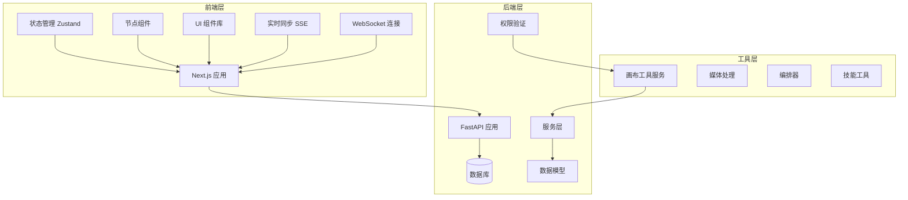
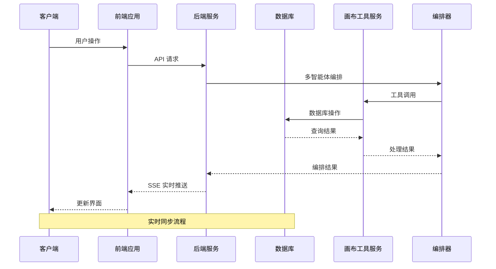
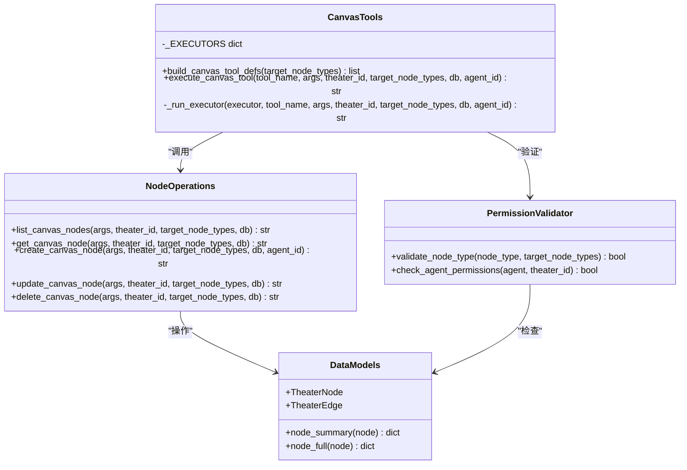
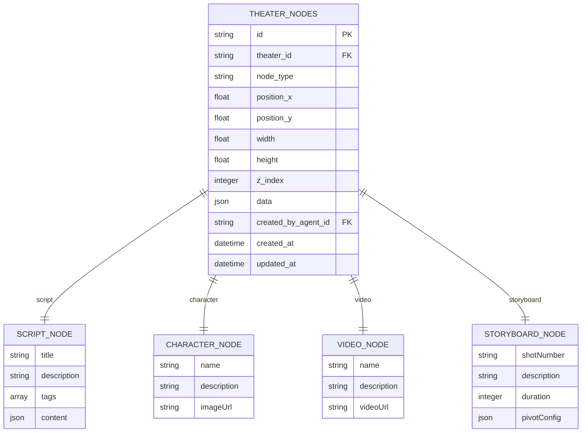
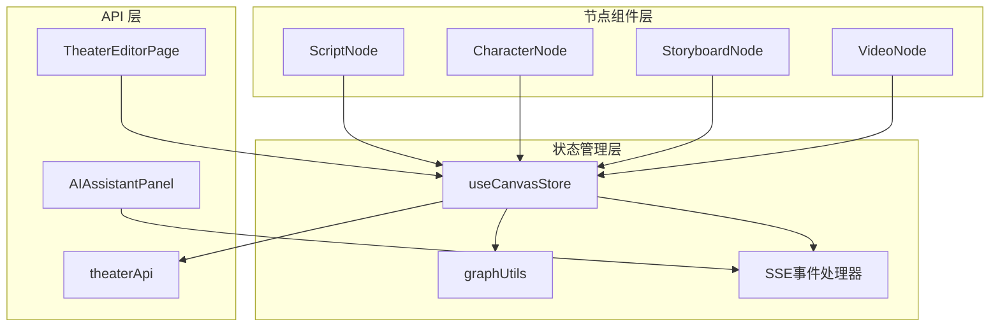
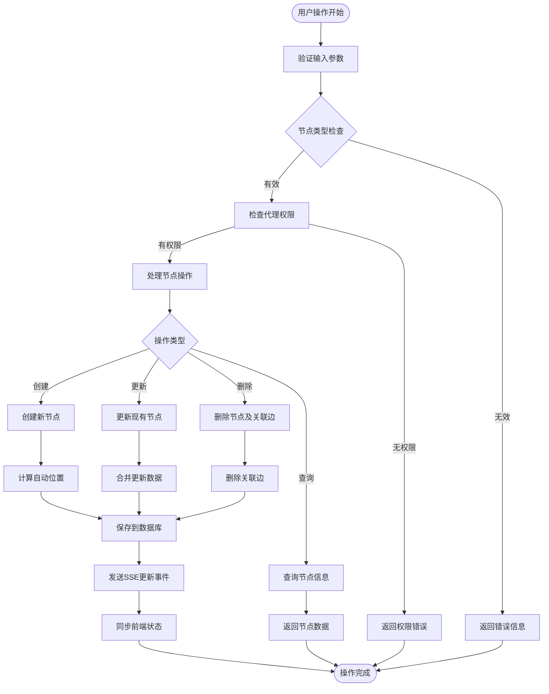

# 画布工具服务

<cite>
**本文档引用的文件**
- [canvas_tools.py](file://backend/services/canvas_tools.py)
- [chats.py](file://backend/routers/chats.py)
- [orchestrator.py](file://backend/services/orchestrator.py)
- [models.py](file://backend/models.py)
- [useCanvasStore.ts](file://frontend/src/store/useCanvasStore.ts)
- [AIAssistantPanel.tsx](file://frontend/src/components/canvas/AIAssistantPanel.tsx)
- [graphUtils.ts](file://frontend/src/lib/graphUtils.ts)
- [theaterApi.ts](file://frontend/src/lib/theaterApi.ts)
- [page.tsx](file://frontend/src/app/theater/[id]/page.tsx)
- [ScriptNode.tsx](file://frontend/src/components/canvas/ScriptNode.tsx)
- [CharacterNode.tsx](file://frontend/src/components/canvas/CharacterNode.tsx)
- [StoryboardNode.tsx](file://frontend/src/components/canvas/StoryboardNode.tsx)
- [VideoNode.tsx](file://frontend/src/components/canvas/VideoNode.tsx)
- [PivotEditor.tsx](file://frontend/src/components/canvas/pivot/PivotEditor.tsx)
- [useSocket.ts](file://frontend/src/hooks/useSocket.ts)
</cite>

## 更新摘要
**变更内容**
- 新增智能代理权限验证机制，支持目标节点类型限制
- 增强实时同步功能，集成Server-Sent Events (SSE)推送
- 扩展Canvas节点类型管理系统，支持动态节点类型配置
- 完善多智能体协作场景下的画布操作权限控制

## 目录
1. [简介](#简介)
2. [项目结构](#项目结构)
3. [核心组件](#核心组件)
4. [架构概览](#架构概览)
5. [详细组件分析](#详细组件分析)
6. [依赖关系分析](#依赖关系分析)
7. [性能考虑](#性能考虑)
8. [故障排除指南](#故障排除指南)
9. [结论](#结论)

## 简介

画布工具服务是 Infinite Narrative Theater 项目中的核心功能模块，提供了一个完整的可视化故事创作平台。该服务允许用户通过拖拽界面创建、编辑和管理各种类型的创作节点，包括文本节点、角色节点、视频节点和故事板节点。

系统采用前后端分离架构，后端基于 FastAPI 和 SQLAlchemy，前端使用 Next.js 和 React Flow 构建。画布工具服务支持实时协作、自动保存、撤销重做等功能，并提供了丰富的节点类型和编辑器。

**更新** 新增智能代理权限验证、实时同步(SSE)和Canvas节点类型管理功能，增强了系统的安全性和实时协作能力。

## 项目结构

项目采用清晰的分层架构设计：



**图表来源**
- [main.py:110-174](file://backend/main.py#L110-L174)
- [models.py:75-130](file://backend/models.py#L75-L130)

**章节来源**
- [main.py:110-174](file://backend/main.py#L110-L174)
- [models.py:75-130](file://backend/models.py#L75-L130)

## 核心组件

### 后端画布工具服务

画布工具服务是后端的核心模块，提供了完整的 CRUD 操作功能：

- **工具定义**: OpenAI 格式的函数定义，支持 5 种画布操作
- **执行函数**: 异步数据库操作，处理节点的增删改查
- **调度器**: 基于查找表的路由机制，避免条件判断链
- **权限验证**: 智能代理目标节点类型限制，确保操作安全性

主要节点类型支持：
- `script`: 文本节点，包含标题、描述、内容和标签
- `character`: 角色节点，包含名称、描述和图片 URL
- `video`: 视频节点，包含名称、描述和视频 URL
- `storyboard`: 故事板节点，包含镜头编号、描述、持续时间和透视配置

**更新** 新增智能代理权限验证机制，通过 `target_node_types` 字段限制代理可操作的节点类型，确保不同代理只能访问其授权范围内的画布操作。

**章节来源**
- [canvas_tools.py:25-32](file://backend/services/canvas_tools.py#L25-L32)
- [canvas_tools.py:42-171](file://backend/services/canvas_tools.py#L42-L171)
- [models.py:241-242](file://backend/models.py#L241-L242)

### 前端状态管理

前端使用 Zustand 进行状态管理，提供以下核心功能：

- **节点管理**: 添加、删除、更新节点
- **边管理**: 连接节点，防止循环依赖
- **历史记录**: 撤销重做功能
- **同步机制**: 与后端实时同步
- **本地存储**: 使用 localStorage 持久化状态
- **SSE集成**: 实时接收画布更新事件

**更新** 新增实时同步功能，通过 SSE 推送画布更新事件，实现多用户实时协作。

**章节来源**
- [useCanvasStore.ts:68-114](file://frontend/src/store/useCanvasStore.ts#L68-L114)
- [useCanvasStore.ts:185-461](file://frontend/src/store/useCanvasStore.ts#L185-L461)

### 实时同步系统

系统集成了完整的实时同步机制：

- **Server-Sent Events (SSE)**: 后端推送画布更新事件
- **多智能体协作**: 支持Leader代理协调多个子代理进行画布操作
- **事件驱动**: 基于事件的增量更新，减少全量同步开销
- **WebSocket支持**: 提供WebSocket作为备用通信方式

**新增** 完整的实时同步架构，支持多用户同时编辑画布内容。

**章节来源**
- [chats.py:27-30](file://backend/routers/chats.py#L27-L30)
- [chats.py:582-593](file://backend/routers/chats.py#L582-L593)
- [AIAssistantPanel.tsx:199-242](file://frontend/src/components/canvas/AIAssistantPanel.tsx#L199-L242)

## 架构概览

系统采用微服务架构，各组件职责明确：



**图表来源**
- [theaterApi.ts:107-158](file://frontend/src/lib/theaterApi.ts#L107-L158)
- [canvas_tools.py:428-481](file://backend/services/canvas_tools.py#L428-L481)
- [chats.py:241-323](file://backend/routers/chats.py#L241-L323)

## 详细组件分析

### 画布工具服务类图



**图表来源**
- [canvas_tools.py:42-171](file://backend/services/canvas_tools.py#L42-L171)
- [canvas_tools.py:227-481](file://backend/services/canvas_tools.py#L227-L481)
- [models.py:241-242](file://backend/models.py#L241-L242)

### 节点类型系统

系统支持四种主要节点类型，每种都有特定的数据结构和行为：



**更新** 新增智能代理权限验证，通过 `target_node_types` 字段限制代理可操作的节点类型，确保不同代理只能访问其授权范围内的画布操作。

**图表来源**
- [models.py:93-130](file://backend/models.py#L93-L130)
- [canvas_tools.py:27-32](file://backend/services/canvas_tools.py#L27-L32)
- [models.py:241-242](file://backend/models.py#L241-L242)

**章节来源**
- [models.py:93-130](file://backend/models.py#L93-L130)
- [canvas_tools.py:27-32](file://backend/services/canvas_tools.py#L27-L32)

### 前端节点组件架构



**图表来源**
- [ScriptNode.tsx:11-341](file://frontend/src/components/canvas/ScriptNode.tsx#L11-L341)
- [useCanvasStore.ts:185-461](file://frontend/src/store/useCanvasStore.ts#L185-L461)
- [AIAssistantPanel.tsx:199-242](file://frontend/src/components/canvas/AIAssistantPanel.tsx#L199-L242)

**章节来源**
- [ScriptNode.tsx:11-341](file://frontend/src/components/canvas/ScriptNode.tsx#L11-L341)
- [CharacterNode.tsx:12-660](file://frontend/src/components/canvas/CharacterNode.tsx#L12-L660)
- [StoryboardNode.tsx:11-308](file://frontend/src/components/canvas/StoryboardNode.tsx#L11-L308)
- [VideoNode.tsx:10-524](file://frontend/src/components/canvas/VideoNode.tsx#L10-L524)

### 数据流处理流程



**更新** 新增权限验证流程，在节点操作前检查代理的目标节点类型权限，确保操作的安全性。

**图表来源**
- [canvas_tools.py:227-481](file://backend/services/canvas_tools.py#L227-L481)
- [useCanvasStore.ts:388-427](file://frontend/src/store/useCanvasStore.ts#L388-L427)
- [chats.py:582-593](file://backend/routers/chats.py#L582-L593)

**章节来源**
- [canvas_tools.py:227-481](file://backend/services/canvas_tools.py#L227-L481)
- [useCanvasStore.ts:388-427](file://frontend/src/store/useCanvasStore.ts#L388-L427)

## 依赖关系分析

系统依赖关系清晰，模块间耦合度低：

```mermaid
graph LR
subgraph "外部依赖"
React[React 18+]
Zustand[Zustand]
XYFlow[@xyflow/react]
Antd[Ant Design]
SSE[Server-Sent Events]
WebSocket[WebSocket]
end
subgraph "后端依赖"
FastAPI[FastAPI]
SQLAlchemy[SQLAlchemy]
AsyncIO[AsyncIO]
UUID[UUID4]
Orchestrator[编排器]
end
subgraph "核心模块"
CanvasTools[canvas_tools.py]
CanvasStore[useCanvasStore.ts]
GraphUtils[graphUtils.ts]
TheaterApi[theaterApi.ts]
AssistantPanel[AIAssistantPanel.tsx]
PermissionValidator[权限验证]
end
React --> CanvasStore
Zustand --> CanvasStore
XYFlow --> CanvasStore
Antd --> CanvasStore
SSE --> AssistantPanel
WebSocket --> CanvasStore
FastAPI --> CanvasTools
SQLAlchemy --> CanvasTools
AsyncIO --> CanvasTools
UUID --> CanvasTools
CanvasStore --> TheaterApi
CanvasStore --> GraphUtils
CanvasTools --> PermissionValidator
AssistantPanel --> SSE
PermissionValidator --> CanvasTools
```

**更新** 新增SSE和WebSocket依赖，以及权限验证模块的依赖关系。

**图表来源**
- [useCanvasStore.ts:2-25](file://frontend/src/store/useCanvasStore.ts#L2-L25)
- [canvas_tools.py:1-19](file://backend/services/canvas_tools.py#L1-L19)
- [AIAssistantPanel.tsx:199-242](file://frontend/src/components/canvas/AIAssistantPanel.tsx#L199-L242)

**章节来源**
- [useCanvasStore.ts:2-25](file://frontend/src/store/useCanvasStore.ts#L2-L25)
- [canvas_tools.py:1-19](file://backend/services/canvas_tools.py#L1-L19)

## 性能考虑

系统在多个层面进行了性能优化：

### 数据库优化
- 使用异步 SQLAlchemy 连接池
- 查询结果缓存和批量操作
- 合理的索引设计（主键、外键、组合索引）

### 前端性能
- 虚拟滚动和懒加载
- 状态分片和选择性更新
- 组件记忆化（memo）优化
- 事件委托减少监听器数量
- SSE事件的高效处理机制

### 网络优化
- 自动保存去抖动（2秒延迟）
- 批量同步减少请求次数
- 增量更新而非全量刷新
- SSE推送减少轮询开销

### 权限验证优化
- 智能代理权限缓存
- 节点类型枚举预编译
- 权限检查的早期退出机制

**更新** 新增权限验证和实时同步的性能优化策略。

## 故障排除指南

### 常见问题及解决方案

**节点创建失败**
- 检查节点类型是否在允许列表中
- 验证位置参数的有效性
- 确认数据库连接状态
- 检查智能代理的权限配置

**节点更新冲突**
- 检查并发更新导致的数据竞争
- 实施乐观锁机制
- 使用版本号控制
- 验证SSE事件的处理顺序

**权限验证错误**
- 检查代理的 `target_node_types` 配置
- 验证智能代理的权限设置
- 确认节点类型是否在授权范围内
- 检查编排器的权限传递机制

**实时同步问题**
- 检查SSE连接状态
- 验证事件格式的正确性
- 确认前端事件处理器的注册
- 检查WebSocket备用连接

**内存泄漏问题**
- 确保事件监听器正确清理
- 及时释放文件对象 URL
- 监控组件卸载时的状态清理
- 检查SSE连接的正确关闭

**更新** 新增权限验证和实时同步相关的故障排除指南。

**章节来源**
- [canvas_tools.py:478-481](file://backend/services/canvas_tools.py#L478-L481)
- [useCanvasStore.ts:39-44](file://frontend/src/store/useCanvasStore.ts#L39-L44)
- [chats.py:582-593](file://backend/routers/chats.py#L582-L593)

## 结论

画布工具服务是一个功能完整、架构清晰的可视化创作平台。系统通过合理的分层设计、模块化的组件架构和完善的错误处理机制，为用户提供了流畅的创作体验。

**更新后的系统优势**：
- **模块化设计**: 清晰的职责分离，易于维护和扩展
- **实时协作**: 支持多用户同时编辑，数据同步可靠
- **丰富功能**: 支持多种节点类型和编辑器
- **性能优化**: 多层次的性能优化策略
- **用户体验**: 直观的界面和流畅的操作反馈
- **智能权限**: 基于代理的节点类型权限控制
- **实时同步**: SSE推送实现真正的实时协作
- **多智能体支持**: 完整的编排器集成，支持复杂协作场景

主要技术特性：
- 智能代理权限验证机制
- Server-Sent Events 实时同步
- 动态节点类型管理系统
- 多智能体协作编排
- WebSocket 备用通信方案
- 完整的错误处理和重试机制

未来可以考虑的功能增强：
- 更高级的节点连接规则
- 插件系统支持
- 更丰富的节点类型
- 导出和分享功能
- 移动端适配
- 更精细的权限粒度控制