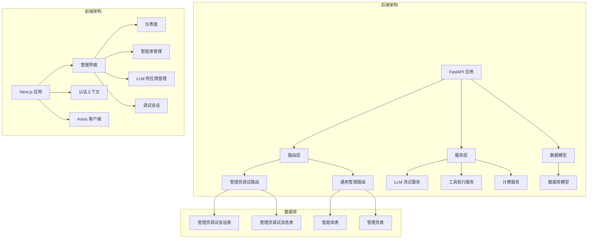
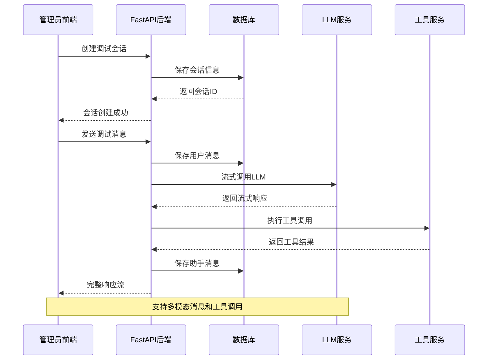
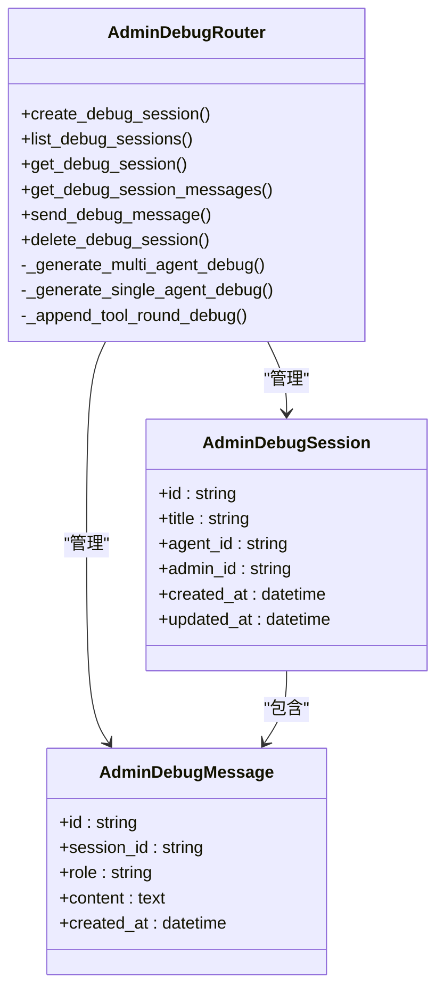
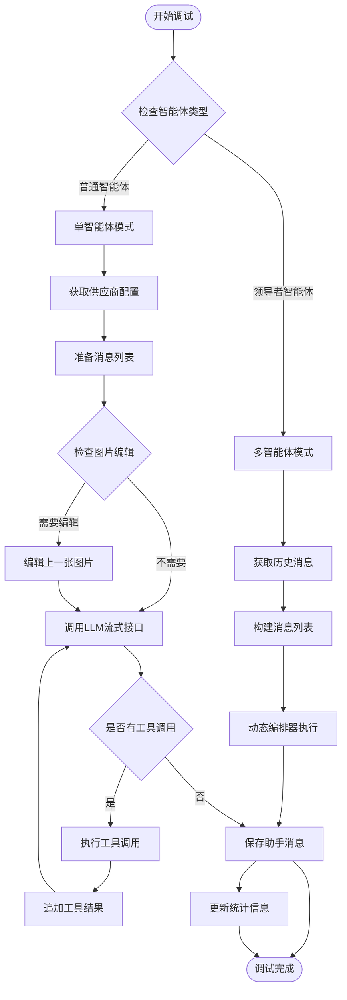
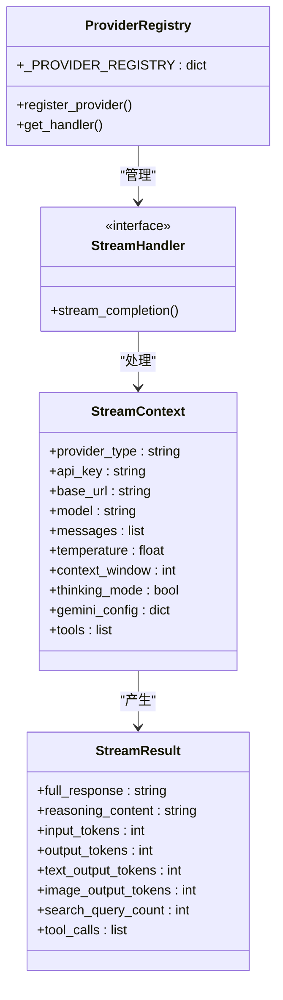
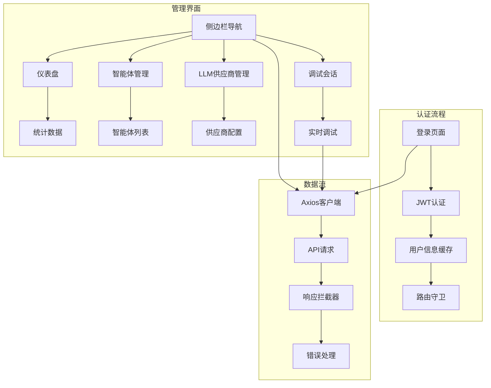
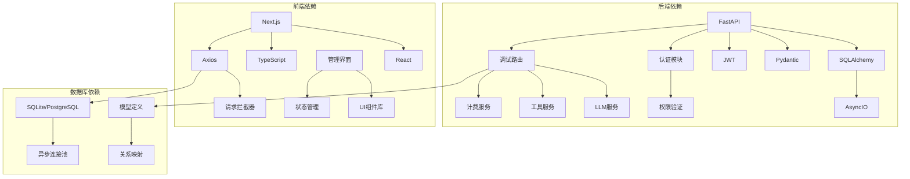

# 管理员调试系统

<cite>
**本文档引用的文件**
- [main.py](file://backend/main.py)
- [models.py](file://backend/models.py)
- [schemas.py](file://backend/schemas.py)
- [auth.py](file://backend/auth.py)
- [admin_debug.py](file://backend/routers/admin_debug.py)
- [llm_stream.py](file://backend/services/llm_stream.py)
- [AdminLayout.tsx](file://backend/admin/src/components/admin/AdminLayout.tsx)
- [page.tsx](file://backend/admin/src/app/admin/page.tsx)
- [page.tsx](file://backend/admin/src/app/admin/agents/page.tsx)
- [page.tsx](file://backend/admin/src/app/admin/llm/page.tsx)
- [page.tsx](file://backend/admin/src/app/admin/login/page.tsx)
- [AuthContext.tsx](file://backend/admin/src/context/AuthContext.tsx)
- [axios.ts](file://backend/admin/src/lib/axios.ts)
</cite>

## 目录
1. [简介](#简介)
2. [项目结构](#项目结构)
3. [核心组件](#核心组件)
4. [架构总览](#架构总览)
5. [详细组件分析](#详细组件分析)
6. [依赖关系分析](#依赖关系分析)
7. [性能考虑](#性能考虑)
8. [故障排除指南](#故障排除指南)
9. [结论](#结论)

## 简介
管理员调试系统是一个专为管理员设计的智能体调试平台，提供独立于普通用户会话的调试环境。系统支持单智能体和多智能体（领导者协调）两种调试模式，具备完整的流式响应、工具调用、图片生成、思维模式等功能，并通过严格的权限控制确保数据隔离。

## 项目结构
系统采用前后端分离架构，后端基于FastAPI，前端基于Next.js，采用TypeScript开发。

**图表来源**
- [main.py:110-152](file://backend/main.py#L110-L152)
- [models.py:417-440](file://backend/models.py#L417-L440)

**章节来源**
- [main.py:1-174](file://backend/main.py#L1-L174)
- [models.py:1-440](file://backend/models.py#L1-L440)

## 核心组件
管理员调试系统由以下核心组件构成：

### 后端核心组件
- **FastAPI 应用**：主应用入口，负责路由注册和中间件配置
- **管理员调试路由**：提供独立的调试API端点
- **LLM 流式服务**：统一的多供应商流式调用接口
- **工具执行服务**：支持多种工具的执行和管理
- **计费服务**：基于令牌使用的积分计算

### 前端核心组件
- **管理布局**：提供统一的管理界面导航和侧边栏
- **认证上下文**：管理管理员登录状态和权限
- **Axios 客户端**：封装API请求和响应拦截器
- **调试界面**：支持实时调试和会话管理

**章节来源**
- [admin_debug.py:93-97](file://backend/routers/admin_debug.py#L93-L97)
- [llm_stream.py:646-657](file://backend/services/llm_stream.py#L646-L657)
- [AdminLayout.tsx:37-198](file://backend/admin/src/components/admin/AdminLayout.tsx#L37-L198)

## 架构总览
系统采用分层架构设计，确保职责分离和可维护性。

**图表来源**
- [admin_debug.py:206-248](file://backend/routers/admin_debug.py#L206-L248)
- [llm_stream.py:646-701](file://backend/services/llm_stream.py#L646-L701)

## 详细组件分析

### 管理员调试路由系统
管理员调试路由提供了完整的调试功能，包括会话管理和消息处理。

**图表来源**
- [admin_debug.py:93-97](file://backend/routers/admin_debug.py#L93-L97)
- [models.py:417-440](file://backend/models.py#L417-L440)

#### 调试流程分析
系统支持两种调试模式：单智能体和多智能体模式。

**图表来源**
- [admin_debug.py:251-328](file://backend/routers/admin_debug.py#L251-L328)
- [admin_debug.py:330-581](file://backend/routers/admin_debug.py#L330-L581)

**章节来源**
- [admin_debug.py:100-121](file://backend/routers/admin_debug.py#L100-L121)
- [admin_debug.py:161-203](file://backend/routers/admin_debug.py#L161-L203)

### LLM流式服务系统
LLM流式服务提供了统一的多供应商接口，支持多种AI服务提供商。

**图表来源**
- [llm_stream.py:12-47](file://backend/services/llm_stream.py#L12-L47)
- [llm_stream.py:56-67](file://backend/services/llm_stream.py#L56-L67)

#### 多供应商支持
系统支持多种AI服务提供商，通过注册表模式实现统一接口。

| 供应商 | 支持的模型 | 特殊功能 |
|--------|------------|----------|
| OpenAI | gpt-4, gpt-3.5 | 工具调用, 思维模式 |
| Anthropic | claude-3 | 工具调用, 思维模式 |
| Gemini | gemini-pro | 图片生成, 搜索集成 |
| Azure | gpt-4, gpt-3.5 | 企业级部署 |
| DashScope | qwen-max | 阿里云生态 |

**章节来源**
- [llm_stream.py:77-144](file://backend/services/llm_stream.py#L77-L144)
- [llm_stream.py:179-248](file://backend/services/llm_stream.py#L179-L248)
- [llm_stream.py:430-641](file://backend/services/llm_stream.py#L430-L641)

### 前端管理界面
前端管理界面提供了直观的管理员操作界面。

**图表来源**
- [AuthContext.tsx:39-117](file://backend/admin/src/context/AuthContext.tsx#L39-L117)
- [axios.ts:12-24](file://backend/admin/src/lib/axios.ts#L12-L24)

**章节来源**
- [AdminLayout.tsx:48-99](file://backend/admin/src/components/admin/AdminLayout.tsx#L48-L99)
- [page.tsx:1-31](file://backend/admin/src/app/admin/llm/page.tsx#L1-L31)
- [page.tsx:1-254](file://backend/admin/src/app/admin/login/page.tsx#L1-L254)

## 依赖关系分析

**图表来源**
- [main.py:39-43](file://backend/main.py#L39-L43)
- [auth.py:1-229](file://backend/auth.py#L1-L229)
- [models.py:1-440](file://backend/models.py#L1-L440)

**章节来源**
- [main.py:41-43](file://backend/main.py#L41-L43)
- [auth.py:83-151](file://backend/auth.py#L83-L151)

## 性能考虑
管理员调试系统在设计时充分考虑了性能优化：

### 流式响应优化
- **异步流式处理**：使用AsyncGenerator实现真正的流式响应
- **内存管理**：及时释放中间结果，避免内存泄漏
- **并发控制**：限制工具调用轮次，防止无限循环

### 数据库优化
- **索引优化**：为常用查询字段建立索引
- **批量操作**：支持批量插入和更新
- **连接池**：使用异步连接池提高并发性能

### 缓存策略
- **会话缓存**：缓存活跃会话数据
- **配置缓存**：缓存智能体和供应商配置
- **响应缓存**：对重复请求进行缓存

## 故障排除指南

### 常见问题及解决方案

#### 认证问题
- **问题**：登录失败或Token过期
- **解决方案**：检查JWT密钥配置，验证Token刷新机制

#### 调试会话异常
- **问题**：会话无法创建或消息丢失
- **解决方案**：检查数据库连接，验证会话状态管理

#### LLM调用失败
- **问题**：API调用超时或响应异常
- **解决方案**：检查供应商API密钥，验证网络连接

#### 工具执行错误
- **问题**：工具调用失败或结果异常
- **解决方案**：检查工具定义，验证参数格式

**章节来源**
- [axios.ts:44-102](file://backend/admin/src/lib/axios.ts#L44-L102)
- [admin_debug.py:496-504](file://backend/routers/admin_debug.py#L496-L504)

## 结论
管理员调试系统是一个功能完整、架构清晰的智能体调试平台。系统通过严格的权限控制实现了管理员调试数据与普通用户数据的完全隔离，提供了灵活的调试模式和强大的工具集。前后端分离的设计确保了良好的用户体验和可维护性，而异步流式处理和多供应商支持则保证了系统的高性能和可扩展性。

系统的主要优势包括：
- **数据隔离**：独立的调试数据库表确保数据安全
- **灵活调试**：支持单智能体和多智能体两种模式
- **多供应商支持**：统一接口支持多家AI服务提供商
- **实时反馈**：流式响应提供即时调试体验
- **权限控制**：基于JWT的严格认证和授权机制

未来可以考虑的功能增强包括：更丰富的调试可视化工具、会话历史的版本管理、团队协作功能等。