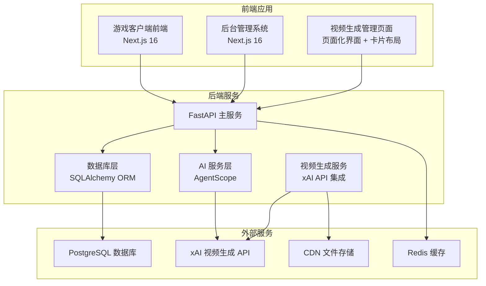
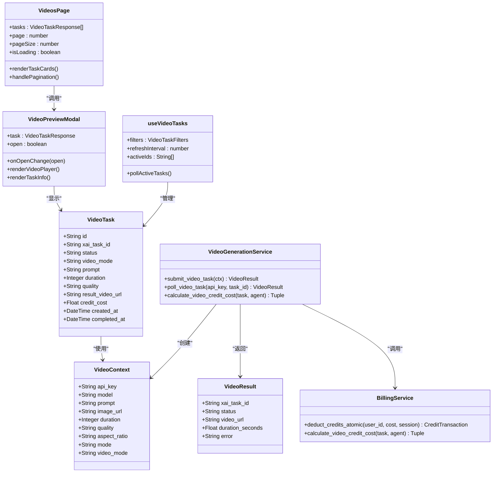
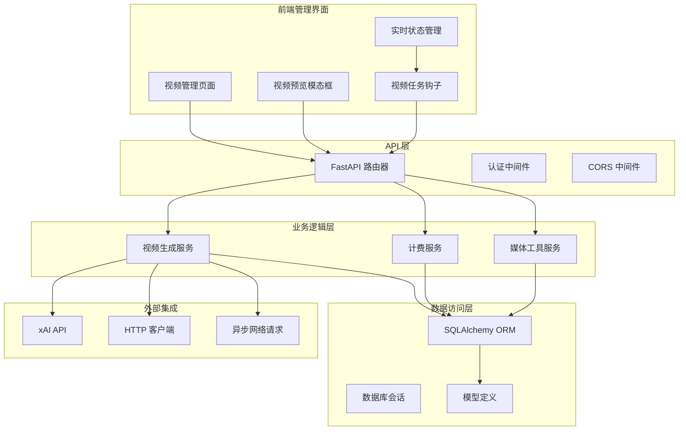
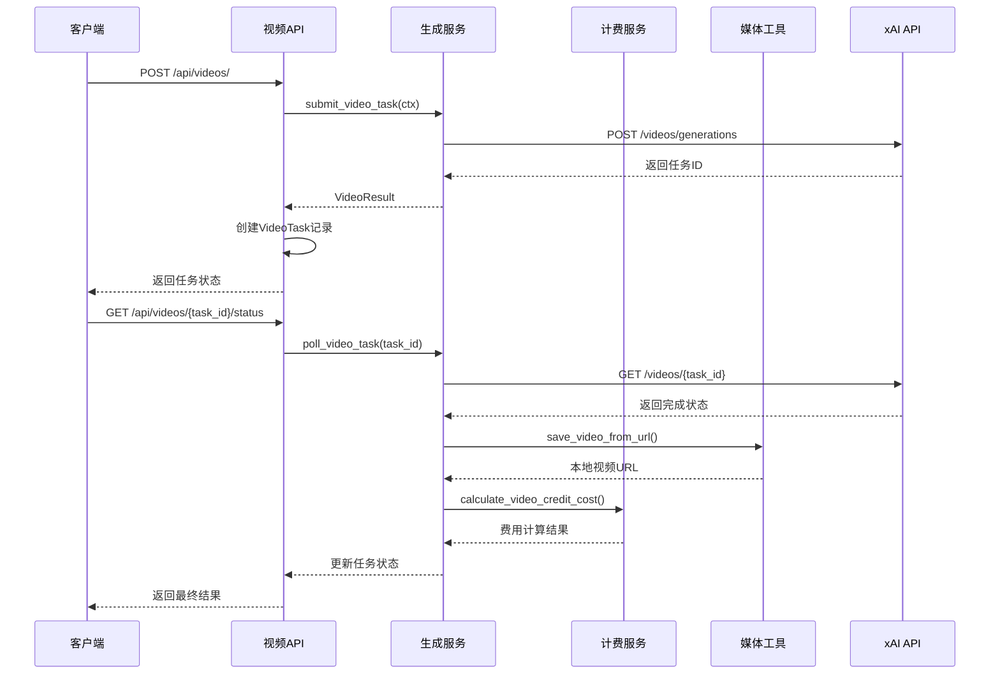
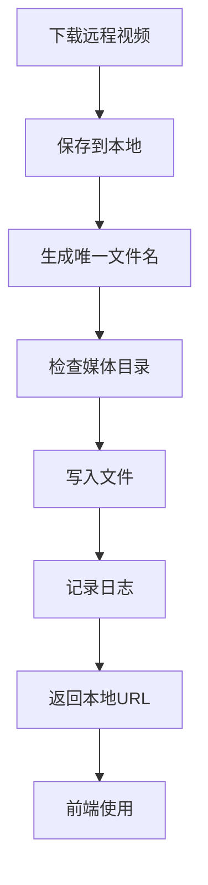
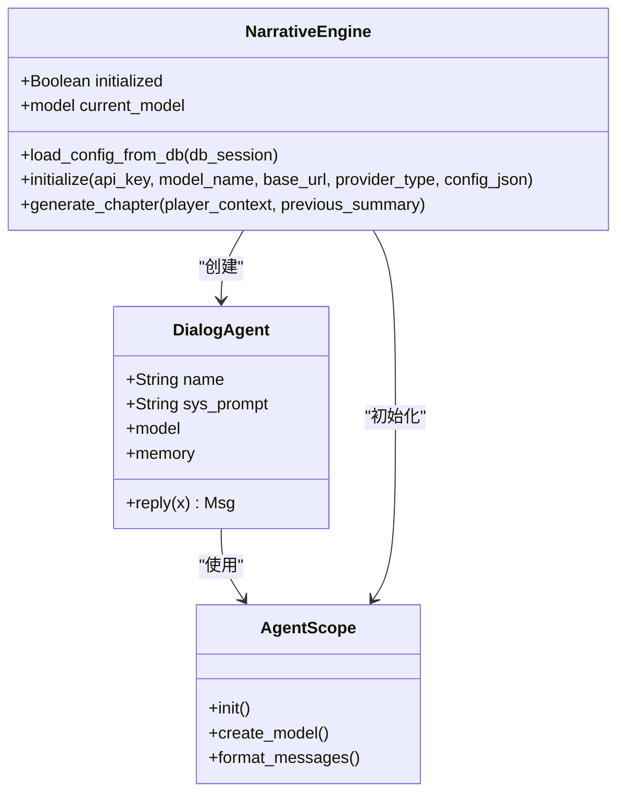
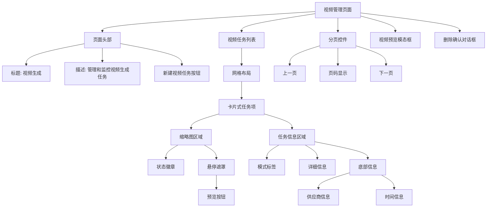
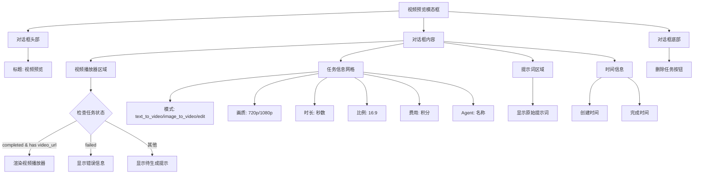
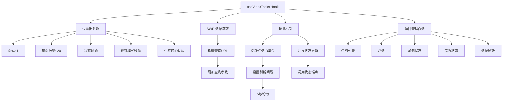
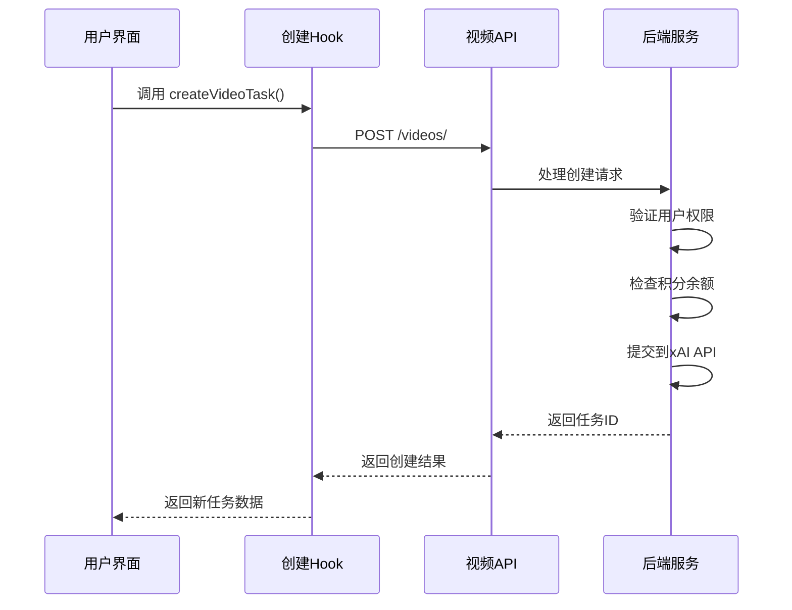

# 视频生成系统

<cite>
**本文档引用的文件**
- [README.md](file://README.md)
- [main.py](file://backend/main.py)
- [models.py](file://backend/models.py)
- [config.py](file://backend/config.py)
- [schemas.py](file://backend/schemas.py)
- [database.py](file://backend/database.py)
- [agents.py](file://backend/agents.py)
- [routers/videos.py](file://backend/routers/videos.py)
- [services/video_generation.py](file://backend/services/video_generation.py)
- [services/billing.py](file://backend/services/billing.py)
- [services/media_utils.py](file://backend/services/media_utils.py)
- [routers/llm_config.py](file://backend/routers/llm_config.py)
- [routers/admin.py](file://backend/routers/admin.py)
- [frontend/src/app/page.tsx](file://frontend/src/app/page.tsx)
- [backend/admin/src/app/admin/videos/page.tsx](file://backend/admin/src/app/admin/videos/page.tsx)
- [backend/admin/src/app/admin/videos/VideoPreviewModal.tsx](file://backend/admin/src/app/admin/videos/VideoPreviewModal.tsx)
- [backend/admin/src/hooks/useVideoTasks.ts](file://backend/admin/src/hooks/useVideoTasks.ts)
- [backend/admin/src/types/index.ts](file://backend/admin/src/types/index.ts)
- [backend/admin/src/lib/api-utils.ts](file://backend/admin/src/lib/api-utils.ts)
</cite>

## 更新摘要
**所做更改**
- 更新视频生成管理界面为全新的页面化架构，从对话框式界面迁移到独立页面
- 新增视频任务列表页面，提供卡片式布局和分页功能
- 重构视频预览模态框为独立组件，支持更丰富的预览功能
- 增强视频任务管理 Hook，支持过滤、分页和实时状态轮询
- 新增视频创建功能的类型定义和 API 接口

## 目录
1. [简介](#简介)
2. [项目结构](#项目结构)
3. [核心组件](#核心组件)
4. [架构概览](#架构概览)
5. [详细组件分析](#详细组件分析)
6. [视频生成管理界面](#视频生成管理界面)
7. [依赖关系分析](#依赖关系分析)
8. [性能考虑](#性能考虑)
9. [故障排除指南](#故障排除指南)
10. [结论](#结论)

## 简介

无限剧情游戏系统是一个基于 **AgentScope** 多智能体框架、**Next.js 16** 前端、**FastAPI** 后端和 **PostgreSQL** 数据库构建的无限剧情游戏平台。该系统的核心特色包括：

- **动态世界观与剧情生成**：基于 AgentScope 的多智能体协作（导演、编剧、NPC），实现剧情的无限延伸与逻辑自洽
- **多模态资产生成**：集成通义万象/即梦AI-图片生成4.0 生成场景与立绘，集成 TTS/MusicGen 生成语音与背景音乐
- **实时交互**：通过 WebSocket 实现低延迟的剧情推送与玩家互动
- **动态 LLM 配置**：支持通过 Admin 后台动态管理和切换 LLM 提供商（OpenAI, DashScope, Anthropic, Gemini 等），无需重启服务
- **后台管理系统**：提供可视化的玩家管理、剧情监控、资源管理和系统配置界面
- **数据持久化与一致性**：使用 PostgreSQL 存储结构化数据，结合向量检索（Embedding）确保长剧情的一致性
- **全新的页面化视频生成管理界面**：采用现代化的页面化架构，提供直观的任务列表、卡片式预览和增强的管理功能

## 项目结构

该项目采用前后端分离的架构设计，主要分为三个部分：



**图表来源**
- [main.py](file://backend/main.py#L84-L105)
- [database.py](file://backend/database.py#L1-L31)

**章节来源**
- [README.md](file://README.md#L37-L54)
- [main.py](file://backend/main.py#L1-L127)

## 核心组件

### 视频生成系统架构

视频生成系统是整个无限剧情游戏系统的重要组成部分，负责处理各种类型的视频生成任务：



**图表来源**
- [models.py](file://backend/models.py#L352-L382)
- [services/video_generation.py](file://backend/services/video_generation.py#L37-L60)
- [services/video_generation.py](file://backend/services/video_generation.py#L51-L60)
- [services/billing.py](file://backend/services/billing.py#L287-L324)
- [backend/admin/src/app/admin/videos/page.tsx](file://backend/admin/src/app/admin/videos/page.tsx#L63-L267)
- [backend/admin/src/app/admin/videos/VideoPreviewModal.tsx](file://backend/admin/src/app/admin/videos/VideoPreviewModal.tsx#L24-L115)
- [backend/admin/src/hooks/useVideoTasks.ts](file://backend/admin/src/hooks/useVideoTasks.ts#L17-L57)

### 核心数据模型

系统使用 SQLAlchemy ORM 定义了完整的数据模型体系：

| 模型名称 | 主要用途 | 关键字段 |
|---------|---------|---------|
| User | 前端用户管理 | id, email, nickname, credits, subscription_status |
| Agent | AI 智能体配置 | id, name, provider_id, model, agent_type, pricing |
| LLMProvider | LLM 供应商配置 | id, name, provider_type, api_key, base_url, models |
| VideoTask | 视频生成任务追踪 | id, user_id, agent_id, status, credit_cost |
| CreditTransaction | 积分交易记录 | id, user_id, amount, balance_before, balance_after |

**章节来源**
- [models.py](file://backend/models.py#L35-L79)
- [models.py](file://backend/models.py#L167-L214)
- [models.py](file://backend/models.py#L118-L142)
- [models.py](file://backend/models.py#L352-L382)

## 架构概览

视频生成系统采用分层架构设计，确保了系统的可扩展性和维护性：



**图表来源**
- [main.py](file://backend/main.py#L94-L105)
- [services/video_generation.py](file://backend/services/video_generation.py#L102-L132)
- [database.py](file://backend/database.py#L19-L31)

## 详细组件分析

### 视频生成 API 路由

视频生成功能通过专门的 API 路由实现，支持多种视频生成模式：



**图表来源**
- [routers/videos.py](file://backend/routers/videos.py#L23-L104)
- [routers/videos.py](file://backend/routers/videos.py#L107-L186)

#### 视频生成模式

系统支持三种视频生成模式：

| 模式 | 描述 | 输入参数 | 输出格式 |
|------|------|----------|----------|
| text_to_video | 文本转视频 | prompt, duration, quality | 视频URL |
| image_to_video | 图片转视频 | prompt, image_url, duration | 视频URL |
| edit | 视频编辑 | prompt, image_url, duration | 视频URL |

**章节来源**
- [services/video_generation.py](file://backend/services/video_generation.py#L87-L100)
- [routers/videos.py](file://backend/routers/videos.py#L23-L104)

### 计费系统

视频生成系统采用灵活的计费机制，支持多种计费维度：


**图表来源**
- [services/billing.py](file://backend/services/billing.py#L287-L324)
- [services/billing.py](file://backend/services/billing.py#L144-L244)

#### 计费维度映射表

系统使用映射表驱动的方式实现计费逻辑：

| 计费维度 | Agent 字段 | 缩放因子 | 说明 |
|---------|-----------|---------|------|
| video_input_image | video_input_image_credit | 1 | 每张输入图片 |
| video_input_second | video_input_second_credit | 1 | 每秒输入视频 |
| video_output_480p | video_output_480p_credit | 1 | 每秒480p输出 |
| video_output_720p | video_output_720p_credit | 1 | 每秒720p输出 |

**章节来源**
- [services/billing.py](file://backend/services/billing.py#L22-L36)
- [services/billing.py](file://backend/services/billing.py#L287-L324)

### 媒体处理服务

媒体处理服务负责视频文件的下载和本地存储：



**图表来源**
- [services/media_utils.py](file://backend/services/media_utils.py#L31-L46)

**章节来源**
- [services/media_utils.py](file://backend/services/media_utils.py#L1-L46)

### AI 智能体集成

系统集成了 AgentScope 框架，实现了多智能体协作：



**图表来源**
- [agents.py](file://backend/agents.py#L35-L109)
- [agents.py](file://backend/agents.py#L110-L167)
- [agents.py](file://backend/agents.py#L168-L232)

**章节来源**
- [agents.py](file://backend/agents.py#L1-L322)

## 视频生成管理界面

### 视频管理页面

视频管理页面是后台管理系统的核心组件，采用现代化的页面化架构设计：



**图表来源**
- [backend/admin/src/app/admin/videos/page.tsx](file://backend/admin/src/app/admin/videos/page.tsx#L63-L267)

#### 页面特性

视频管理页面具有以下关键特性：

- **卡片式布局**：采用响应式网格布局，支持1-4列显示
- **状态可视化**：通过颜色和图标直观显示任务状态
- **悬停交互**：提供预览和删除等操作按钮
- **分页功能**：支持大数据量的任务列表分页浏览
- **实时状态**：自动轮询活跃任务的状态更新

**章节来源**
- [backend/admin/src/app/admin/videos/page.tsx](file://backend/admin/src/app/admin/videos/page.tsx#L1-L268)

### 视频预览模态框组件

视频预览模态框是独立的组件，提供了丰富的视频预览和管理功能：



**图表来源**
- [backend/admin/src/app/admin/videos/VideoPreviewModal.tsx](file://backend/admin/src/app/admin/videos/VideoPreviewModal.tsx#L24-L115)

#### 组件特性

视频预览模态框具有以下关键特性：

- **状态感知渲染**：根据任务状态动态选择渲染方式
- **详细信息展示**：提供完整的任务元数据展示
- **错误处理**：优雅处理生成失败的情况
- **删除功能**：支持直接从模态框删除已完成或失败的任务

**章节来源**
- [backend/admin/src/app/admin/videos/VideoPreviewModal.tsx](file://backend/admin/src/app/admin/videos/VideoPreviewModal.tsx#L1-L116)

### 视频任务管理 Hook

useVideoTasks 是一个专门的 React Hook，提供了视频生成任务的完整管理功能：



**图表来源**
- [backend/admin/src/hooks/useVideoTasks.ts](file://backend/admin/src/hooks/useVideoTasks.ts#L17-L57)

#### 核心功能

- **智能轮询机制**：仅对活跃任务进行轮询，避免不必要的网络请求
- **动态刷新控制**：根据活跃任务数量动态调整轮询频率
- **多重过滤支持**：支持按状态、模式、供应商等条件过滤
- **并发状态更新**：使用 Promise.allSettled 并发更新多个任务状态
- **分页支持**：内置分页参数处理

**章节来源**
- [backend/admin/src/hooks/useVideoTasks.ts](file://backend/admin/src/hooks/useVideoTasks.ts#L1-L73)

### 视频创建功能

系统提供了完整的视频创建功能，包括类型定义和 API 接口：



**图表来源**
- [backend/admin/src/hooks/useVideoTasks.ts](file://backend/admin/src/hooks/useVideoTasks.ts#L59-L65)

**章节来源**
- [backend/admin/src/hooks/useVideoTasks.ts](file://backend/admin/src/hooks/useVideoTasks.ts#L59-L65)
- [backend/admin/src/types/index.ts](file://backend/admin/src/types/index.ts#L228-L239)

## 依赖关系分析

系统的主要依赖关系如下：

```mermaid
graph LR
subgraph "核心依赖"
A[FastAPI] --> B[SQLAlchemy]
B --> C[PostgreSQL]
A --> D[httpx]
D --> E[xAI API]
end
subgraph "AI 框架"
F[AgentScope] --> G[OpenAI]
F --> H[DashScope]
F --> I[Anthropic]
F --> J[Gemini]
end
subgraph "前端依赖"
K[Next.js] --> L[Tailwind CSS]
M[React] --> N[TypeScript]
K --> O[SWR]
K --> P[React Hook Form]
K --> Q[Lucide React]
end
subgraph "开发工具"
R[Pydantic] --> S[Settings]
T[Alembic] --> U[数据库迁移]
end
subgraph "管理界面依赖"
V[卡片组件] --> W[徽章组件]
X[对话框组件] --> Y[按钮组件]
Z[分页组件] --> AA[导航组件]
AB[视频播放器] --> AC[状态管理]
AD[删除确认] --> AE[Toast通知]
```

**图表来源**
- [main.py](file://backend/main.py#L32-L46)
- [config.py](file://backend/config.py#L1-L40)

**章节来源**
- [main.py](file://backend/main.py#L1-L127)
- [config.py](file://backend/config.py#L1-L40)

## 性能考虑

### 异步处理优化

系统广泛采用异步编程模式来提升性能：

- **异步数据库操作**：使用 SQLAlchemy AsyncSession 提供非阻塞数据库访问
- **异步 HTTP 请求**：通过 httpx.AsyncClient 处理外部 API 调用
- **异步文件操作**：视频下载和保存采用异步方式
- **并发状态轮询**：使用 Promise.allSettled 并发更新多个任务状态

### 连接池管理

数据库连接池配置优化：

- **连接池大小**：10个基础连接，20个溢出连接
- **自动重连**：启用 pool_pre_ping 确保连接有效性
- **线程安全**：SQLite 连接设置 check_same_thread=False

### 缓存策略

系统采用多层缓存策略：

- **Redis 缓存**：用于会话状态和临时数据存储
- **本地文件缓存**：生成的媒体文件本地存储
- **数据库缓存**：频繁访问的数据缓存到内存
- **前端缓存**：SWR 提供的智能缓存机制

### 实时状态管理

视频生成管理界面采用了高效的实时状态管理机制：

- **智能轮询**：仅对活跃任务进行轮询，避免不必要的网络请求
- **动态刷新间隔**：根据活跃任务数量动态调整轮询频率
- **并发状态更新**：使用并发请求减少总等待时间
- **状态缓存**：利用 SWR 的缓存机制避免重复请求

## 故障排除指南

### 常见问题及解决方案

#### 1. 数据库连接问题

**症状**：启动时数据库连接失败
**解决方案**：
- 检查 DATABASE_URL 配置
- 确认 PostgreSQL 服务正常运行
- 验证数据库凭据正确性

#### 2. 视频生成失败

**症状**：视频任务状态长时间为 pending
**解决方案**：
- 检查 xAI API 密钥有效性
- 验证网络连接和防火墙设置
- 查看日志中的具体错误信息
- 检查后端服务的轮询机制是否正常工作

#### 3. 积分扣费异常

**症状**：用户余额显示异常
**解决方案**：
- 检查 CreditTransaction 表数据完整性
- 验证并发扣费的原子性
- 确认冻结状态检查逻辑

#### 4. 管理界面显示问题

**症状**：视频管理页面无法正常显示
**解决方案**：
- 检查视频 URL 是否有效
- 验证 CORS 配置
- 确认 CDN 文件存储配置
- 检查浏览器兼容性
- 验证分页参数传递

**章节来源**
- [main.py](file://backend/main.py#L50-L82)
- [services/billing.py](file://backend/services/billing.py#L144-L244)

### 日志监控

系统提供了完善的日志记录机制：

- **应用日志**：详细的应用运行信息
- **SQL 日志**：数据库操作记录（可关闭）
- **错误日志**：异常和错误信息
- **性能日志**：关键操作的耗时统计
- **管理界面日志**：用户操作和界面交互记录

## 结论

视频生成系统作为无限剧情游戏平台的核心组件，展现了现代 AI 应用的完整架构设计。系统通过模块化的设计、清晰的分层架构和完善的错误处理机制，为用户提供了一个稳定可靠的视频生成服务。

### 主要优势

1. **高度模块化**：清晰的组件划分便于维护和扩展
2. **异步架构**：充分利用异步编程提升系统性能
3. **灵活计费**：支持多种计费模式适应不同业务需求
4. **完整监控**：完善的日志和监控机制确保系统稳定性
5. **现代化管理界面**：全新的页面化架构提供了直观的操作体验
6. **智能状态管理**：高效的轮询机制确保任务状态的及时更新
7. **响应式设计**：支持多种屏幕尺寸的适配
8. **易于集成**：标准化的 API 设计便于第三方集成

### 技术创新点

1. **页面化架构**：从对话框式界面迁移到独立页面，提供更好的用户体验
2. **卡片式布局**：采用现代化的网格布局设计
3. **智能轮询机制**：根据活跃任务数量动态调整轮询频率，优化资源使用
4. **并发状态更新**：使用 Promise.allSettled 并发处理多个任务状态更新
5. **响应式管理界面**：提供直观的视频预览和详细的任务信息展示
6. **多维度过滤**：支持按状态、模式、Agent 等多种条件精确筛选任务
7. **分页功能**：支持大数据量的任务列表分页浏览

### 发展建议

1. **性能优化**：可以考虑引入 CDN 加速视频文件传输
2. **弹性扩展**：增加负载均衡和自动扩缩容能力
3. **监控增强**：添加更详细的性能指标和告警机制
4. **安全加固**：加强 API 安全和数据加密措施
5. **用户体验**：进一步优化管理界面的交互体验
6. **扩展功能**：考虑添加批量操作和导出功能
7. **移动端适配**：优化移动端的显示效果和交互体验

该系统为构建复杂的 AI 驱动应用提供了良好的参考架构，其设计理念和实现方式值得类似项目借鉴。全新的页面化视频生成管理界面显著提升了系统的可用性和管理效率，为后续的功能扩展奠定了坚实基础。