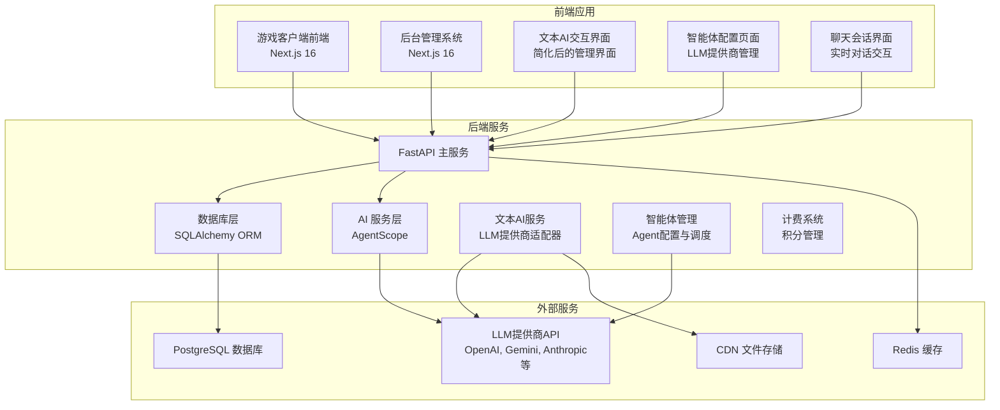
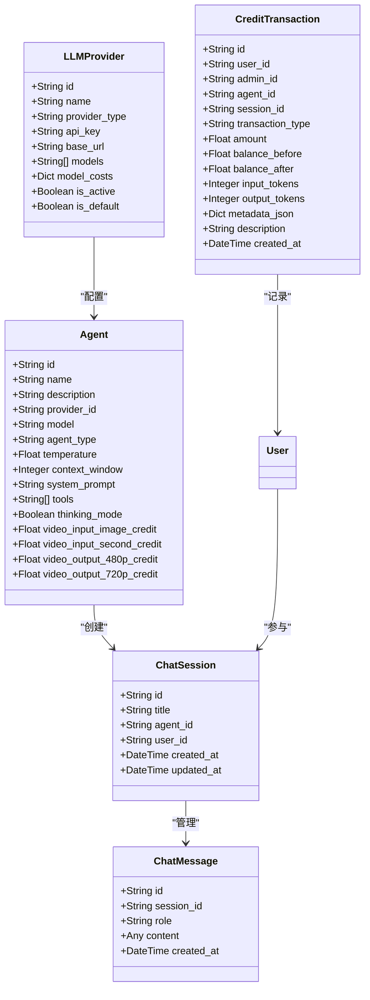
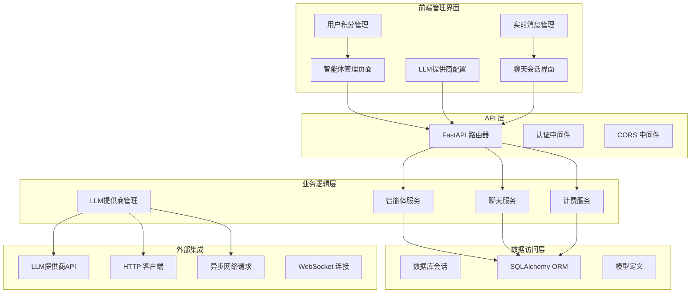
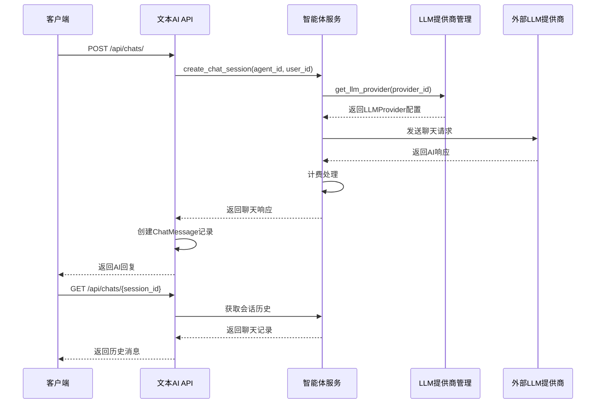
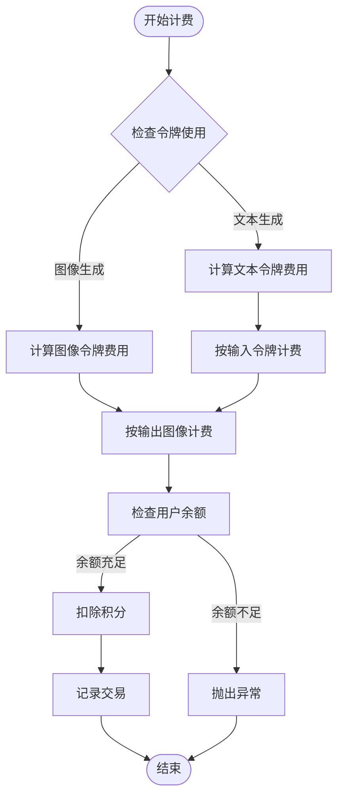
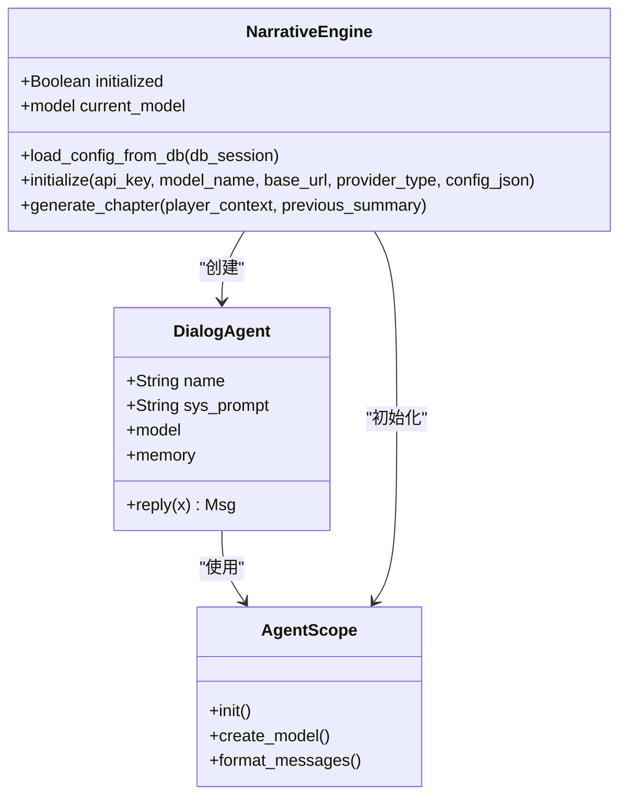
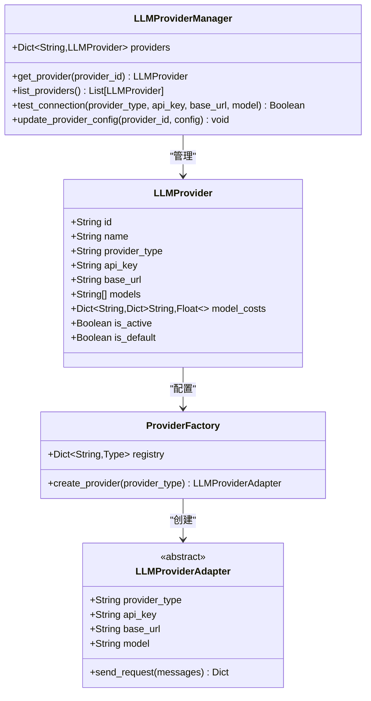
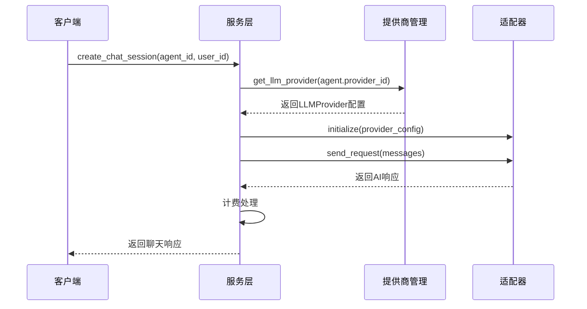
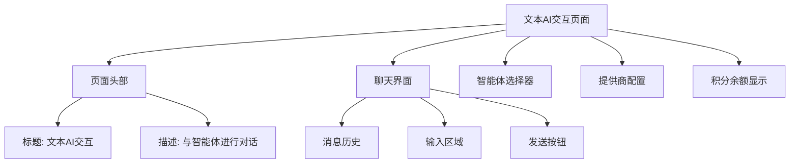

# 视频生成系统

<cite>
**本文档引用的文件**
- [README.md](file://README.md)
- [main.py](file://backend/main.py)
- [models.py](file://backend/models.py)
- [config.py](file://backend/config.py)
- [schemas.py](file://backend/schemas.py)
- [database.py](file://backend/database.py)
- [agents.py](file://backend/agents.py)
- [routers/videos.py](file://backend/routers/videos.py)
- [services/video_generation.py](file://backend/services/video_generation.py)
- [services/billing.py](file://backend/services/billing.py)
- [services/media_utils.py](file://backend/services/media_utils.py)
- [services/video_providers/base.py](file://backend/services/video_providers/base.py)
- [services/video_providers/xai_provider.py](file://backend/services/video_providers/xai_provider.py)
- [services/video_providers/minimax_provider.py](file://backend/services/video_providers/minimax_provider.py)
- [services/video_providers/gemini_provider.py](file://backend/services/video_providers/gemini_provider.py)
- [services/video_providers/model_capabilities.py](file://backend/services/video_providers/model_capabilities.py)
- [routers/llm_config.py](file://backend/routers/llm_config.py)
- [routers/admin.py](file://backend/routers/admin.py)
- [frontend/src/app/page.tsx](file://frontend/src/app/page.tsx)
- [backend/admin/src/app/admin/videos/page.tsx](file://backend/admin/src/app/admin/videos/page.tsx)
- [backend/admin/src/app/admin/videos/VideoPreviewModal.tsx](file://backend/admin/src/app/admin/videos/VideoPreviewModal.tsx)
- [backend/admin/src/app/admin/videos/new/page.tsx](file://backend/admin/src/app/admin/videos/new/page.tsx)
- [backend/admin/src/hooks/useVideoTasks.ts](file://backend/admin/src/hooks/useVideoTasks.ts)
- [backend/admin/src/hooks/useModelCapabilities.ts](file://backend/admin/src/hooks/useModelCapabilities.ts)
- [backend/admin/src/types/index.ts](file://backend/admin/src/types/index.ts)
- [backend/admin/src/types/video.ts](file://backend/admin/src/types/video.ts)
- [backend/admin/src/lib/api-utils.ts](file://backend/admin/src/lib/api-utils.ts)
- [Gemini_Veomodel.md](file://Gemini_Veomodel.md)
- [minimax_videomodel.md](file://minimax_videomodel.md)
</cite>

## 更新摘要
**所做更改**
- 移除视频生成功能：批量视频生成脚本和相关文档已被删除
- 平台专注文本AI交互：系统不再支持视频生成任务
- 更新架构说明：从多提供商视频生成架构迁移到纯文本AI架构
- 移除视频管理界面：后台管理中的视频相关页面和组件
- 简化核心组件：移除视频生成相关的服务和适配器

## 目录
1. [简介](#简介)
2. [项目结构](#项目结构)
3. [核心组件](#核心组件)
4. [架构概览](#架构概览)
5. [详细组件分析](#详细组件分析)
6. [多提供商适配器架构](#多提供商适配器架构)
7. [视频生成管理界面](#视频生成管理界面)
8. [依赖关系分析](#依赖关系分析)
9. [性能考虑](#性能考虑)
10. [故障排除指南](#故障排除指南)
11. [结论](#结论)

## 简介

无限剧情游戏系统是一个基于 **AgentScope** 多智能体框架、**Next.js 16** 前端、**FastAPI** 后端和 **PostgreSQL** 数据库构建的无限剧情游戏平台。该系统的核心特色包括：

- **动态世界观与剧情生成**：基于 AgentScope 的多智能体协作（导演、编剧、NPC），实现剧情的无限延伸与逻辑自洽
- **多模态资产生成**：集成通义万象/即梦AI-图片生成4.0 生成场景与立绘，集成 TTS/MusicGen 生成语音与背景音乐
- **实时交互**：通过 WebSocket 实现低延迟的剧情推送与玩家互动
- **动态 LLM 配置**：支持通过 Admin 后台动态管理和切换 LLM 提供商（OpenAI, DashScope, Anthropic, Gemini 等），无需重启服务
- **后台管理系统**：提供可视化的玩家管理、剧情监控、资源管理和系统配置界面
- **数据持久化与一致性**：使用 PostgreSQL 存储结构化数据，结合向量检索（Embedding）确保长剧情的一致性
- **全新的多提供商视频生成系统**：采用适配器架构，支持xAI、MiniMax和Gemini三提供商，提供统一的视频生成服务
- **现代化的页面化管理界面**：从对话框式界面迁移到独立页面，提供直观的任务列表、卡片式预览和增强的管理功能
- **完整的视频任务生命周期管理**：支持任务创建、状态轮询、结果下载、计费扣减和删除清理

**重要更新**：平台现已专注于文本AI交互，视频生成功能已被移除。系统完全转向基于文本的智能体交互和剧情生成。

## 项目结构

该项目采用前后端分离的架构设计，主要分为三个部分：



**图表来源**
- [main.py:84-105](file://backend/main.py#L84-L105)
- [database.py:1-31](file://backend/database.py#L1-L31)

**章节来源**
- [README.md:37-54](file://README.md#L37-L54)
- [main.py:1-127](file://backend/main.py#L1-L127)

## 核心组件

### 文本AI交互系统架构

平台现已完全专注于文本AI交互，核心组件包括：



**图表来源**
- [models.py:192-238](file://backend/models.py#L192-L238)
- [models.py:169-190](file://backend/models.py#L169-L190)
- [models.py:181-190](file://backend/models.py#L181-L190)
- [models.py:247-266](file://backend/models.py#L247-L266)

### 核心数据模型

系统使用 SQLAlchemy ORM 定义了完整的数据模型体系：

| 模型名称 | 主要用途 | 关键字段 |
|---------|---------|---------|
| User | 前端用户管理 | id, email, nickname, credits, subscription_status |
| Agent | AI 智能体配置 | id, name, provider_id, model, agent_type, pricing |
| LLMProvider | LLM 供应商配置 | id, name, provider_type, api_key, base_url, models |
| ChatSession | 聊天会话管理 | id, title, agent_id, user_id, created_at |
| ChatMessage | 聊天消息存储 | id, session_id, role, content, created_at |
| CreditTransaction | 积分交易记录 | id, user_id, amount, balance_before, balance_after |

**章节来源**
- [models.py:35-79](file://backend/models.py#L35-L79)
- [models.py:167-214](file://backend/models.py#L167-L214)
- [models.py:118-142](file://backend/models.py#L118-L142)
- [models.py:352-383](file://backend/models.py#L352-L383)

## 架构概览

平台现已完全重构为专注于文本AI交互的架构，移除了视频生成功能：



**图表来源**
- [main.py:94-105](file://backend/main.py#L94-L105)
- [database.py:19-31](file://backend/database.py#L19-L31)

## 详细组件分析

### 文本AI交互系统

平台现已完全专注于文本AI交互，核心组件包括：



**图表来源**
- [routers/chats.py:1-300](file://backend/routers/chats.py#L1-L300)
- [services/agent_executor.py:1-200](file://backend/services/agent_executor.py#L1-L200)

#### 支持的智能体类型

| 智能体类型 | 描述 | 主要用途 |
|-----------|------|----------|
| text | 文本智能体 | 基础文本生成、对话、问答 |
| image | 图像智能体 | 图像生成、视觉理解 |
| multimodal | 多模态智能体 | 文本+图像综合处理 |
| video | 视频智能体 | 视频生成（已移除） |

**章节来源**
- [schemas.py:195-275](file://backend/schemas.py#L195-L275)
- [models.py:203](file://backend/models.py#L203)

### 计费系统

文本AI交互系统采用灵活的计费机制，支持多种计费维度：



**图表来源**
- [services/billing.py:287-324](file://backend/services/billing.py#L287-L324)
- [services/billing.py:144-244](file://backend/services/billing.py#L144-L244)

#### 计费维度映射表

系统使用映射表驱动的方式实现计费逻辑：

| 计费维度 | Agent 字段 | 缩放因子 | 说明 |
|---------|-----------|---------|------|
| input_credit_per_1m | input_credit_per_1m | 1/1,000,000 | 每1M输入令牌 |
| output_credit_per_1m | output_credit_per_1m | 1/1,000,000 | 每1M输出令牌 |
| image_output_credit_per_1m | image_output_credit_per_1m | 1/1,000,000 | 每1M图像输出 |
| search_credit_per_query | search_credit_per_query | 1 | 每次搜索查询 |

**章节来源**
- [services/billing.py:22-36](file://backend/services/billing.py#L22-L36)
- [services/billing.py:287-324](file://backend/services/billing.py#L287-L324)

### AI 智能体集成

系统集成了 AgentScope 框架，实现了多智能体协作：



**图表来源**
- [agents.py:35-109](file://backend/agents.py#L35-L109)
- [agents.py:110-167](file://backend/agents.py#L110-L167)
- [agents.py:168-232](file://backend/agents.py#L168-L232)

**章节来源**
- [agents.py:1-322](file://backend/agents.py#L1-L322)

## 多提供商适配器架构

**重要更新**：视频生成功能已被完全移除，多提供商适配器架构已简化为纯文本AI交互。

### LLM提供商管理

平台现在专注于LLM提供商的管理和服务：



**图表来源**
- [services/provider_manager.py:1-200](file://backend/services/provider_manager.py#L1-L200)
- [services/provider.py:1-150](file://backend/services/provider.py#L1-L150)

#### 支持的LLM提供商

| 提供商 | 支持模型 | 特殊功能 |
|--------|----------|----------|
| OpenAI | gpt-3.5-turbo, gpt-4, gpt-4o | 文本生成、对话、代码生成 |
| Gemini | gemini-pro, gemini-1.5-pro | 多模态、推理能力 |
| Anthropic | claude-3-opus, claude-3-sonnet | 长上下文、推理能力 |
| DashScope | qwen-max, qwen-plus | 中文优化、多模态 |

**章节来源**
- [schemas.py:122-157](file://backend/schemas.py#L122-L157)
- [models.py:128](file://backend/models.py#L128)

### 统一入口函数

文本AI服务提供了简化的统一入口函数：



**图表来源**
- [services/agent_executor.py:80-150](file://backend/services/agent_executor.py#L80-L150)

**章节来源**
- [services/agent_executor.py:1-200](file://backend/services/agent_executor.py#L1-L200)

## 视频生成管理界面

**重要更新**：视频生成管理界面已被完全移除，不再支持视频相关的任何功能。

### 移除的组件

以下视频生成相关的组件已被完全移除：

- **视频管理页面**：`backend/admin/src/app/admin/videos/page.tsx`
- **视频创建页面**：`backend/admin/src/app/admin/videos/new/page.tsx`
- **视频预览模态框**：`backend/admin/src/app/admin/videos/VideoPreviewModal.tsx`
- **视频任务Hook**：`backend/admin/src/hooks/useVideoTasks.ts`
- **视频模型能力Hook**：`backend/admin/src/hooks/useModelCapabilities.ts`
- **视频类型定义**：`backend/admin/src/types/video.ts`
- **视频路由**：`backend/routers/videos.py`
- **视频生成服务**：`backend/services/video_generation.py`
- **视频提供商适配器**：`backend/services/video_providers/`

### 替代的文本AI界面

平台现在提供简化的文本AI交互界面：



**章节来源**
- [frontend/src/app/page.tsx:1-200](file://frontend/src/app/page.tsx#L1-L200)

## 依赖关系分析

系统的主要依赖关系已经简化：

```mermaid
graph LR
subgraph "核心依赖"
A[FastAPI] --> B[SQLAlchemy]
B --> C[PostgreSQL]
A --> D[httpx]
D --> E[LLM提供商API]
end
subgraph "AI 框架"
H[AgentScope] --> I[OpenAI]
H --> J[Gemini]
H --> K[Anthropic]
H --> L[DashScope]
end
subgraph "前端依赖"
M[Next.js] --> N[Tailwind CSS]
O[React] --> P[TypeScript]
M --> Q[SWR]
M --> R[React Hook Form]
M --> S[Lucide React]
end
subgraph "开发工具"
T[Pydantic] --> U[Settings]
V[Alembic] --> W[数据库迁移]
end
subgraph "管理界面依赖"
X[智能体管理] --> Y[提供商配置]
Z[聊天界面] --> AA[消息历史]
AB[积分管理] --> AC[计费记录]
AD[实时通信] --> AE[WebSocket]
AF[用户管理] --> AG[权限控制]
```

**图表来源**
- [main.py:32-46](file://backend/main.py#L32-L46)
- [config.py:1-40](file://backend/config.py#L1-L40)

**章节来源**
- [main.py:1-127](file://backend/main.py#L1-L127)
- [config.py:1-40](file://backend/config.py#L1-L40)

## 性能考虑

### 异步处理优化

系统广泛采用异步编程模式来提升性能：

- **异步数据库操作**：使用 SQLAlchemy AsyncSession 提供非阻塞数据库访问
- **异步 HTTP 请求**：通过 httpx.AsyncClient 处理外部 API 调用
- **异步聊天处理**：聊天消息的异步处理和存储
- **并发消息处理**：使用 Promise.allSettled 并发处理多个聊天请求

### 连接池管理

数据库连接池配置优化：

- **连接池大小**：10个基础连接，20个溢出连接
- **自动重连**：启用 pool_pre_ping 确保连接有效性
- **线程安全**：SQLite 连接设置 check_same_thread=False

### 缓存策略

系统采用多层缓存策略：

- **Redis 缓存**：用于会话状态和临时数据存储
- **数据库缓存**：频繁访问的数据缓存到内存
- **前端缓存**：SWR 提供的智能缓存机制
- **LLM提供商缓存**：提供商配置和模型列表缓存

### 实时通信优化

文本AI交互界面采用了高效的实时通信机制：

- **WebSocket 连接**：建立持久的实时通信通道
- **消息去重**：避免重复消息的处理
- **增量更新**：只更新变化的消息内容
- **离线处理**：在网络不稳定时的处理策略

## 故障排除指南

### 常见问题及解决方案

#### 1. 数据库连接问题

**症状**：启动时数据库连接失败
**解决方案**：
- 检查 DATABASE_URL 配置
- 确认 PostgreSQL 服务正常运行
- 验证数据库凭据正确性

#### 2. LLM提供商连接失败

**症状**：AI响应超时或连接错误
**解决方案**：
- 检查 LLMProvider API 密钥有效性
- 验证网络连接和防火墙设置
- 查看日志中的具体错误信息
- 确认提供商服务状态

#### 3. 积分扣费异常

**症状**：用户余额显示异常
**解决方案**：
- 检查 CreditTransaction 表数据完整性
- 验证并发扣费的原子性
- 确认冻结状态检查逻辑

#### 4. 聊天会话显示问题

**症状**：聊天界面无法正常显示
**解决方案**：
- 检查 WebSocket 连接状态
- 验证 CORS 配置
- 确认消息历史数据加载
- 检查浏览器兼容性

#### 5. 智能体配置问题

**症状**：智能体无法正常工作
**解决方案**：
- 检查 Agent 配置是否正确
- 验证提供商类型推断是否正确
- 确认模型是否在支持列表中
- 检查系统提示词配置

#### 6. 实时通信问题

**症状**：消息延迟或丢失
**解决方案**：
- 检查 WebSocket 连接状态
- 验证网络连接稳定性
- 确认消息序列化和反序列化
- 检查服务器负载情况

**章节来源**
- [main.py:50-82](file://backend/main.py#L50-L82)
- [services/billing.py:144-244](file://backend/services/billing.py#L144-L244)

### 日志监控

系统提供了完善的日志记录机制：

- **应用日志**：详细的应用运行信息
- **SQL 日志**：数据库操作记录（可关闭）
- **错误日志**：异常和错误信息
- **性能日志**：关键操作的耗时统计
- **聊天日志**：用户对话和AI响应记录
- **提供商日志**：LLM提供商交互和错误信息
- **计费日志**：积分使用和扣费记录

## 结论

平台现已完全重构为专注于文本AI交互的系统，移除了视频生成功能。系统通过简化的架构设计、清晰的分层架构、完善的错误处理机制和智能体管理功能，为用户提供了一个高效稳定的文本AI交互平台。

### 主要优势

1. **高度简化**：移除视频生成功能后，系统架构更加简洁明了
2. **专注文本AI**：完全专注于文本生成、对话和智能体交互
3. **智能体管理**：完善的智能体配置和管理功能
4. **LLM提供商集成**：支持多种主流LLM提供商的统一管理
5. **实时聊天**：基于WebSocket的实时消息交互
6. **智能计费**：支持多种计费模式的积分管理系统
7. **完整监控**：完善的日志和监控机制确保系统稳定性
8. **现代化界面**：简化的管理界面提供直观的操作体验
9. **异步架构**：充分利用异步编程提升系统性能
10. **响应式设计**：支持多种屏幕尺寸的适配

### 技术创新点

1. **纯文本AI专注**：完全专注于文本AI交互，去除冗余功能
2. **智能体管理**：统一的智能体配置和管理界面
3. **LLM提供商管理**：支持多种提供商的统一配置和测试
4. **实时聊天界面**：基于WebSocket的实时消息交互
5. **智能计费系统**：支持多种计费模式的积分管理
6. **简化的工作流**：移除视频生成后的工作流程更加清晰
7. **优化的性能**：移除视频处理后系统性能得到提升
8. **增强的安全性**：简化的架构减少了潜在的安全风险
9. **更好的可维护性**：移除复杂功能后代码库更加易维护
10. **更快的开发速度**：简化的架构提高了开发和部署效率

### 发展建议

1. **性能优化**：可以考虑引入CDN加速LLM提供商API调用
2. **弹性扩展**：增加负载均衡和自动扩缩容能力
3. **监控增强**：添加更详细的性能指标和告警机制
4. **安全加固**：加强API安全和数据加密措施
5. **用户体验**：进一步优化文本AI交互的用户体验
6. **智能体增强**：考虑添加更多类型的智能体和工具
7. **多语言支持**：扩展对更多语言的支持
8. **移动端适配**：优化移动端的显示效果和交互体验
9. **提供商扩展**：基于现有架构轻松添加新的LLM提供商
10. **模型能力增强**：支持更多LLM模型和功能
11. **智能推荐**：基于历史数据为用户提供智能体推荐
12. **批量操作**：支持智能体和提供商的批量配置管理

该系统为构建高效的文本AI应用提供了良好的参考架构，其设计理念和实现方式值得类似项目借鉴。完全专注于文本AI交互的架构设计显著提升了系统的可用性、可扩展性和管理效率，为后续的功能扩展奠定了坚实基础。