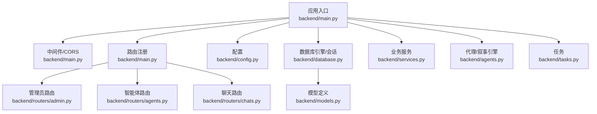
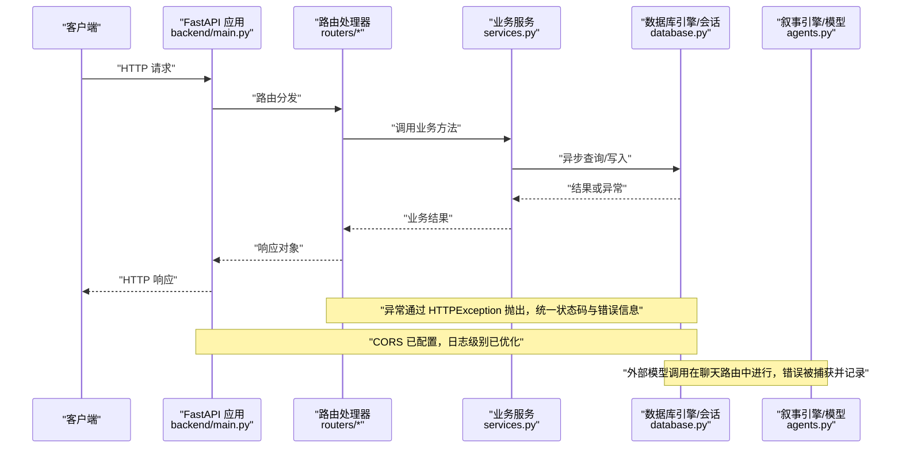
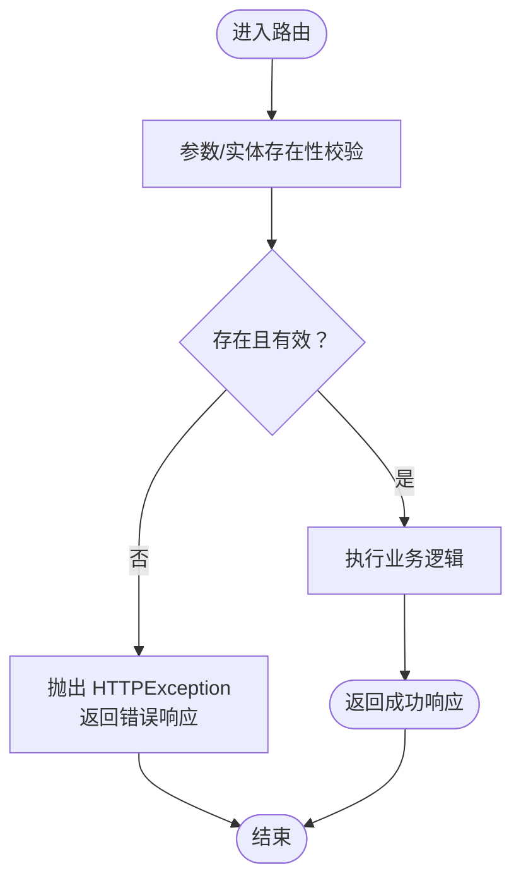
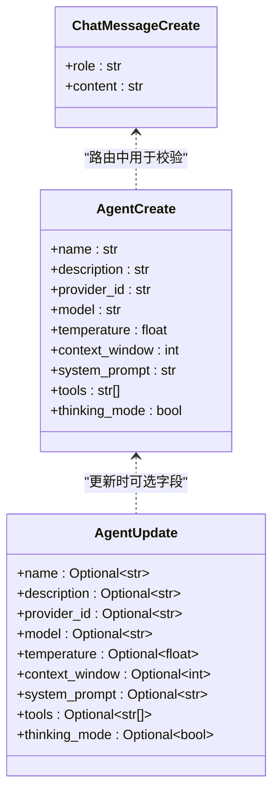
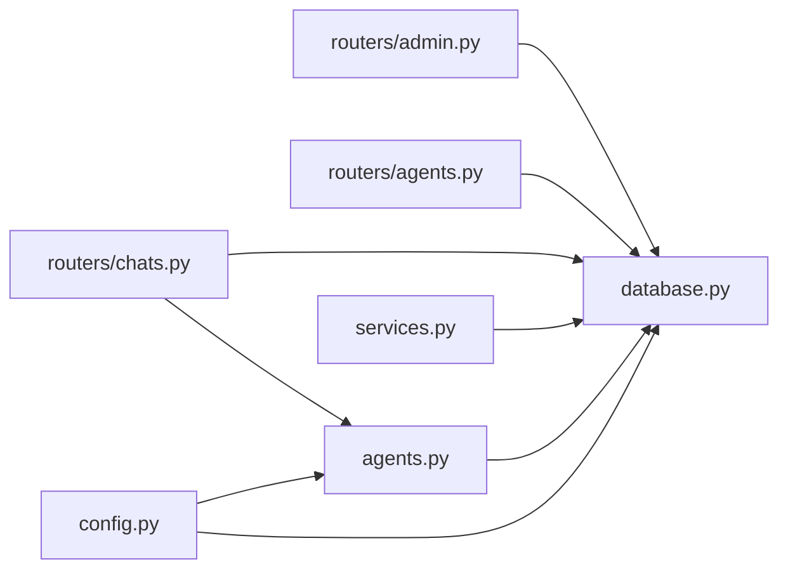

# 错误处理与安全

<cite>
**本文引用的文件**
- [backend/main.py](file://backend/main.py)
- [backend/config.py](file://backend/config.py)
- [backend/database.py](file://backend/database.py)
- [backend/models.py](file://backend/models.py)
- [backend/schemas.py](file://backend/schemas.py)
- [backend/routers/admin.py](file://backend/routers/admin.py)
- [backend/routers/agents.py](file://backend/routers/agents.py)
- [backend/routers/chats.py](file://backend/routers/chats.py)
- [backend/services.py](file://backend/services.py)
- [backend/tasks.py](file://backend/tasks.py)
- [backend/agents.py](file://backend/agents.py)
- [backend/.env.example](file://backend/.env.example)
- [backend/requirements.txt](file://backend/requirements.txt)
</cite>

## 目录
1. [引言](#引言)
2. [项目结构](#项目结构)
3. [核心组件](#核心组件)
4. [架构总览](#架构总览)
5. [详细组件分析](#详细组件分析)
6. [依赖关系分析](#依赖关系分析)
7. [性能考量](#性能考量)
8. [故障排查指南](#故障排查指南)
9. [结论](#结论)
10. [附录](#附录)

## 引言
本指南聚焦于后端系统的错误处理与安全机制，覆盖以下主题：
- HTTP 异常处理与统一错误响应格式
- CORS 配置与跨域策略
- 输入验证与参数校验
- SQL 注入防护与数据库访问模式
- XSS 防范与前端渲染策略
- 敏感数据保护（密钥、数据库 URL）
- 日志记录、审计跟踪与安全监控建议
- 安全最佳实践清单与常见漏洞预防

本指南以仓库现有实现为基础，结合可扩展的安全增强建议，帮助开发者在不破坏现有功能的前提下提升系统安全性与可靠性。

## 项目结构
后端采用 FastAPI + SQLAlchemy Async 架构，模块化组织如下：
- 应用入口与中间件：FastAPI 应用、CORS 中间件、生命周期钩子
- 配置管理：环境变量读取与设置项
- 数据层：异步引擎、会话工厂、ORM 模型
- 路由层：管理员、智能体、聊天等 API 路由
- 业务服务：剧场服务封装
- 任务与代理：叙事引擎与后台任务
- 安全相关：CORS 配置、异常抛出、日志级别控制

图表来源
- [backend/main.py](file://backend/main.py#L83-L98)
- [backend/routers/admin.py](file://backend/routers/admin.py#L10-L14)
- [backend/routers/agents.py](file://backend/routers/agents.py#L9-L13)
- [backend/routers/chats.py](file://backend/routers/chats.py#L16-L20)
- [backend/config.py](file://backend/config.py#L7-L33)
- [backend/database.py](file://backend/database.py#L8-L23)
- [backend/models.py](file://backend/models.py#L9-L122)
- [backend/services.py](file://backend/services.py#L8-L17)
- [backend/agents.py](file://backend/agents.py#L43-L100)
- [backend/tasks.py](file://backend/tasks.py#L7-L22)

章节来源
- [backend/main.py](file://backend/main.py#L83-L98)
- [backend/config.py](file://backend/config.py#L7-L33)
- [backend/database.py](file://backend/database.py#L8-L23)
- [backend/models.py](file://backend/models.py#L9-L122)
- [backend/schemas.py](file://backend/schemas.py#L1-L102)
- [backend/routers/admin.py](file://backend/routers/admin.py#L10-L14)
- [backend/routers/agents.py](file://backend/routers/agents.py#L9-L13)
- [backend/routers/chats.py](file://backend/routers/chats.py#L16-L20)
- [backend/services.py](file://backend/services.py#L8-L17)
- [backend/agents.py](file://backend/agents.py#L43-L100)
- [backend/tasks.py](file://backend/tasks.py#L7-L22)

## 核心组件
- 应用与中间件
  - FastAPI 应用实例、生命周期钩子、CORS 中间件配置
  - 全局日志级别控制与 SQLAlchemy/uvicorn 日志抑制
- 配置与环境
  - 设置类集中管理项目名、版本、数据库 URL、Redis URL、AI 密钥与模型名称
  - .env 示例文件展示敏感配置占位
- 数据层
  - 异步引擎与会话工厂；SQLite/PostgreSQL 支持；连接池与预检测
  - ORM 模型涵盖玩家、故事章节、资产、LLM 提供商、对话会话与消息
- 路由与业务
  - 管理员统计、玩家列表与删除、故事查询
  - 智能体创建/更新/查询/删除与模型可用性校验
  - 聊天会话创建、消息流式生成与使用量统计
- 代理与任务
  - 叙述引擎按数据库配置动态初始化模型
  - 后台任务预生成下一章内容与资源生成

章节来源
- [backend/main.py](file://backend/main.py#L14-L28)
- [backend/main.py](file://backend/main.py#L85-L91)
- [backend/config.py](file://backend/config.py#L7-L33)
- [backend/database.py](file://backend/database.py#L8-L23)
- [backend/models.py](file://backend/models.py#L9-L122)
- [backend/routers/admin.py](file://backend/routers/admin.py#L16-L31)
- [backend/routers/agents.py](file://backend/routers/agents.py#L15-L55)
- [backend/routers/chats.py](file://backend/routers/chats.py#L22-L37)
- [backend/agents.py](file://backend/agents.py#L49-L99)
- [backend/tasks.py](file://backend/tasks.py#L7-L22)

## 架构总览
下图展示请求从客户端到数据库与外部模型服务的典型路径，并标注安全与错误处理要点。

图表来源
- [backend/main.py](file://backend/main.py#L85-L91)
- [backend/routers/chats.py](file://backend/routers/chats.py#L72-L258)
- [backend/services.py](file://backend/services.py#L12-L17)
- [backend/database.py](file://backend/database.py#L28-L30)
- [backend/agents.py](file://backend/agents.py#L101-L125)

## 详细组件分析

### HTTP 异常处理与统一错误响应
- 统一异常抛出
  - 路由层广泛使用 HTTPException 抛出明确的状态码与错误描述，便于客户端识别与处理
  - 示例：管理员删除不存在的玩家、聊天路由中会话/智能体不存在、模型不可用等场景
- 错误响应格式
  - 当前未强制统一错误响应结构，建议在应用层增加统一的错误响应模型与异常拦截器，确保错误字段一致（如 code、message、details）
- WebSocket 错误处理
  - WebSocket 处理中捕获异常并打印日志，随后关闭连接；建议补充更详细的错误类型与客户端提示

图表来源
- [backend/routers/admin.py](file://backend/routers/admin.py#L60-L81)
- [backend/routers/agents.py](file://backend/routers/agents.py#L15-L55)
- [backend/routers/chats.py](file://backend/routers/chats.py#L72-L87)
- [backend/main.py](file://backend/main.py#L144-L145)

章节来源
- [backend/routers/admin.py](file://backend/routers/admin.py#L60-L81)
- [backend/routers/agents.py](file://backend/routers/agents.py#L15-L55)
- [backend/routers/chats.py](file://backend/routers/chats.py#L72-L87)
- [backend/main.py](file://backend/main.py#L144-L145)

### CORS 配置与跨域策略
- 当前配置
  - 允许本地开发域名与凭证传递，通配方法与头
- 安全建议
  - 生产环境应限制 allow_origins 列表，避免使用通配符
  - 明确允许的 HTTP 方法与头，最小化暴露面
  - 如需支持复杂请求，谨慎开启 credentials 并确保同源策略

章节来源
- [backend/main.py](file://backend/main.py#L85-L91)

### 输入验证与参数校验
- Pydantic 模型与字段约束
  - schemas 中对智能体与聊天消息等进行长度、范围与必填约束
  - 路由层接收 Pydantic 模型作为请求体，自动完成类型转换与校验
- 路由层二次校验
  - 路由中对实体存在性、唯一性、关联有效性进行检查，并抛出相应异常
- 建议
  - 对所有外部输入保持“先校验、后使用”的原则
  - 对路径参数与查询参数同样进行显式校验

图表来源
- [backend/schemas.py](file://backend/schemas.py#L43-L73)
- [backend/schemas.py](file://backend/schemas.py#L93-L94)
- [backend/routers/agents.py](file://backend/routers/agents.py#L15-L55)
- [backend/routers/chats.py](file://backend/routers/chats.py#L72-L87)

章节来源
- [backend/schemas.py](file://backend/schemas.py#L4-L102)
- [backend/routers/agents.py](file://backend/routers/agents.py#L15-L55)
- [backend/routers/chats.py](file://backend/routers/chats.py#L72-L87)

### SQL 注入防护与数据库访问
- 防护措施
  - 使用 SQLAlchemy ORM 查询，避免原生 SQL 拼接
  - 使用异步会话工厂与上下文管理，确保事务一致性
- 建议
  - 对用户可控的排序、过滤与分页参数，采用白名单枚举或严格校验
  - 对需要 LIKE 的搜索，对特殊字符进行转义或使用 ESCAPE 子句

章节来源
- [backend/database.py](file://backend/database.py#L28-L30)
- [backend/models.py](file://backend/models.py#L9-L122)
- [backend/routers/admin.py](file://backend/routers/admin.py#L16-L31)
- [backend/routers/agents.py](file://backend/routers/agents.py#L57-L71)

### XSS 攻击防范
- 现状
  - 路由返回文本内容，未见专门的 HTML 转义或内容安全策略（CSP）配置
- 建议
  - 对所有用户生成内容在存储前进行净化或白名单过滤
  - 在响应头中添加 CSP，限制脚本执行与内联代码
  - 对富文本输出采用安全渲染策略（如仅允许特定标签）

章节来源
- [backend/routers/chats.py](file://backend/routers/chats.py#L112-L258)

### 敏感数据保护
- 环境变量与密钥
  - .env.example 展示了数据库 URL、AI 密钥与 Redis URL 的占位
  - 配置类从 .env 加载，建议在生产环境使用只读权限的部署账户
- 建议
  - 将密钥与数据库 URL 存储于受控密钥管理服务
  - 禁止将敏感信息提交至版本库，使用 .gitignore 与 CI 安全扫描
  - 对日志输出进行脱敏，避免打印密钥与完整数据库 URL

章节来源
- [backend/.env.example](file://backend/.env.example#L1-L4)
- [backend/config.py](file://backend/config.py#L7-L33)

### 日志记录、审计跟踪与安全监控
- 日志
  - 应用日志级别为 INFO，SQLAlchemy 与 uvicorn 访问日志降级
  - 聊天路由中记录会话、历史、令牌用量等信息，便于排障与成本分析
- 审计
  - 删除智能体时在控制台打印审计信息；建议迁移到专用审计表与异步写入
- 监控
  - 建议集成指标采集（如 Prometheus）、分布式追踪（如 OpenTelemetry）与告警
  - 对异常率、响应时间、数据库连接池状态与外部模型调用失败率进行监控

章节来源
- [backend/main.py](file://backend/main.py#L14-L28)
- [backend/routers/chats.py](file://backend/routers/chats.py#L133-L234)
- [backend/routers/agents.py](file://backend/routers/agents.py#L135-L136)

### 跨站攻击防护（CSRF、点击劫持等）
- CSRF
  - 当前未见 CSRF 令牌机制；建议在需要 Cookie 认证的场景引入 CSRF 保护
- 点击劫持
  - 建议设置 X-Frame-Options 与 Content-Security-Policy
- 建议
  - 对关键写操作（新增、修改、删除）启用 CSRF 校验
  - 对静态资源与 API 响应头进行安全加固

章节来源
- [backend/main.py](file://backend/main.py#L85-L91)

## 依赖关系分析
- 组件耦合
  - 路由依赖数据库会话工厂与模型；业务服务封装数据库操作；代理依赖配置与外部模型
- 外部依赖
  - FastAPI、SQLAlchemy Async、AgentScope、OpenAI/DashScope SDK 等
- 潜在风险
  - 外部模型调用失败需降级与重试策略
  - 数据库连接池与并发写入需配合事务与锁策略

图表来源
- [backend/routers/admin.py](file://backend/routers/admin.py#L1-L14)
- [backend/routers/agents.py](file://backend/routers/agents.py#L1-L13)
- [backend/routers/chats.py](file://backend/routers/chats.py#L1-L20)
- [backend/services.py](file://backend/services.py#L1-L11)
- [backend/agents.py](file://backend/agents.py#L1-L10)
- [backend/database.py](file://backend/database.py#L1-L4)
- [backend/config.py](file://backend/config.py#L1-L6)

章节来源
- [backend/requirements.txt](file://backend/requirements.txt#L1-L20)

## 性能考量
- 数据库
  - 连接池大小与溢出配置需根据并发与资源情况调整
  - 预检测与自动重连有助于提升稳定性
- 流式响应
  - 聊天路由采用流式生成，注意客户端缓冲与网络中断处理
- 外部模型
  - 增加重试与超时策略，避免阻塞请求线程
- 日志
  - 控制日志级别与输出频率，避免 I/O 成为瓶颈

章节来源
- [backend/database.py](file://backend/database.py#L8-L23)
- [backend/routers/chats.py](file://backend/routers/chats.py#L112-L258)
- [backend/main.py](file://backend/main.py#L14-L28)

## 故障排查指南
- 常见问题定位
  - 数据库连接失败：检查 DATABASE_URL、网络与凭据；查看生命周期迁移日志
  - CORS 问题：确认 allow_origins 是否包含客户端地址
  - 外部模型调用失败：检查 API Key、模型名称与提供商类型
- 错误处理
  - 统一捕获异常并记录详细上下文，包括会话 ID、用户 ID、输入摘要
  - 对客户端返回明确的错误码与可理解的错误信息
- 审计与回溯
  - 将关键操作（删除、修改）写入审计日志，支持回滚与溯源

章节来源
- [backend/main.py](file://backend/main.py#L45-L81)
- [backend/routers/chats.py](file://backend/routers/chats.py#L211-L215)
- [backend/routers/agents.py](file://backend/routers/agents.py#L135-L136)

## 结论
本项目在错误处理与安全方面具备良好基础：统一的异常抛出、严格的输入校验、CORS 配置与日志控制。为进一步提升安全性与可靠性，建议：
- 统一错误响应结构与异常拦截器
- 生产环境收紧 CORS 与响应头安全策略
- 引入 CSRF 保护与内容安全策略
- 强化敏感数据管理与日志脱敏
- 增加审计表与异步审计写入
- 完善外部模型调用的重试与降级策略
- 部署指标与告警体系

## 附录

### 安全最佳实践清单
- 输入与输出
  - 所有外部输入必须校验与净化；输出内容进行 HTML/CSP 清洗
- 认证与授权
  - 对关键接口启用鉴权；对写操作启用 CSRF 校验
- 配置与密钥
  - 使用密钥管理服务；禁止硬编码敏感信息；最小权限原则
- 日志与审计
  - 记录关键操作；脱敏敏感信息；定期审计
- 监控与告警
  - 监控异常率、响应时间、数据库连接池与外部调用失败率
- 依赖与补丁
  - 定期更新依赖；关注安全公告与补丁

### 常见安全漏洞与预防
- SQL 注入
  - 使用 ORM 与参数化查询；避免拼接 SQL
- XSS
  - 内容净化与 CSP；富文本白名单
- CSRF
  - 引入 CSRF 令牌与 SameSite Cookie
- 信息泄露
  - 环境变量与日志脱敏；最小暴露面
- 外部依赖风险
  - 限流与熔断；超时与重试；降级策略