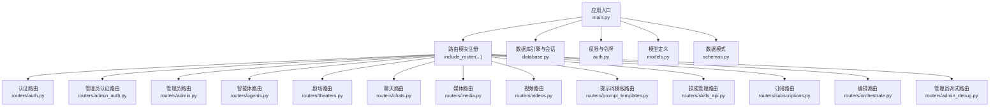
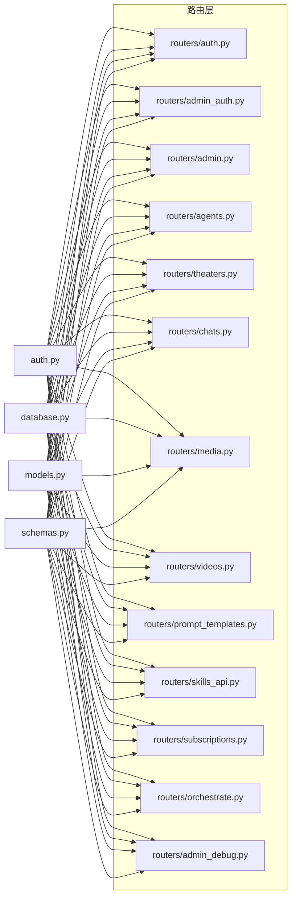
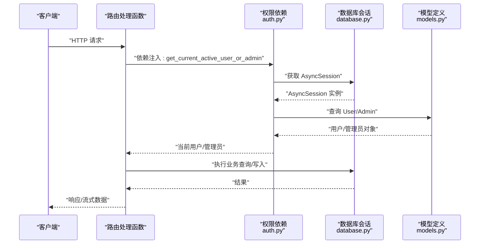

# API路由层

<cite>
**本文引用的文件**
- [main.py](file://backend/main.py)
- [auth.py](file://backend/auth.py)
- [database.py](file://backend/database.py)
- [models.py](file://backend/models.py)
- [schemas.py](file://backend/schemas.py)
- [routers/auth.py](file://backend/routers/auth.py)
- [routers/admin_auth.py](file://backend/routers/admin_auth.py)
- [routers/admin.py](file://backend/routers/admin.py)
- [routers/agents.py](file://backend/routers/agents.py)
- [routers/theaters.py](file://backend/routers/theaters.py)
- [routers/chats.py](file://backend/routers/chats.py)
- [routers/media.py](file://backend/routers/media.py)
- [routers/videos.py](file://backend/routers/videos.py)
- [routers/prompt_templates.py](file://backend/routers/prompt_templates.py)
- [routers/skills_api.py](file://backend/routers/skills_api.py)
- [routers/subscriptions.py](file://backend/routers/subscriptions.py)
- [routers/orchestrate.py](file://backend/routers/orchestrate.py)
- [routers/admin_debug.py](file://backend/routers/admin_debug.py)
</cite>

## 目录
1. [简介](#简介)
2. [项目结构](#项目结构)
3. [核心组件](#核心组件)
4. [架构总览](#架构总览)
5. [详细组件分析](#详细组件分析)
6. [依赖分析](#依赖分析)
7. [性能考虑](#性能考虑)
8. [故障排查指南](#故障排查指南)
9. [结论](#结论)
10. [附录](#附录)

## 简介
本文件系统性梳理 Infinite Game 后端的 API 路由层，覆盖认证路由、剧场管理、智能体管理、媒体处理、视频生成、提示词模板、技能管理、订阅管理、编排调度以及管理员调试等模块。文档重点阐述：
- 路由组织结构与模块化设计
- 每个路由模块的职责、URL 模式、HTTP 方法映射与请求处理逻辑
- 依赖注入机制（数据库会话、权限验证、数据序列化）
- 完整的 API 端点清单（请求参数、响应格式、错误码）
- 实际调用示例与最佳实践

## 项目结构
后端采用 FastAPI 应用，入口在 main.py 中注册各模块路由，并通过中间件实现 CORS 与调试日志。数据库使用 SQLAlchemy AsyncEngine，配合依赖注入提供会话管理。

图示来源
- [main.py:138-152](file://backend/main.py#L138-L152)
- [routers/auth.py:1-136](file://backend/routers/auth.py#L1-L136)
- [routers/admin_auth.py:1-136](file://backend/routers/admin_auth.py#L1-L136)
- [routers/admin.py:1-501](file://backend/routers/admin.py#L1-L501)
- [routers/agents.py:1-151](file://backend/routers/agents.py#L1-L151)
- [routers/theaters.py:1-110](file://backend/routers/theaters.py#L1-L110)
- [routers/chats.py:1-807](file://backend/routers/chats.py#L1-L807)
- [routers/media.py:1-244](file://backend/routers/media.py#L1-L244)
- [routers/videos.py:1-343](file://backend/routers/videos.py#L1-L343)
- [routers/prompt_templates.py:1-320](file://backend/routers/prompt_templates.py#L1-L320)
- [routers/skills_api.py:1-207](file://backend/routers/skills_api.py#L1-L207)
- [routers/subscriptions.py:1-119](file://backend/routers/subscriptions.py#L1-L119)
- [routers/orchestrate.py:1-184](file://backend/routers/orchestrate.py#L1-L184)
- [routers/admin_debug.py:1-713](file://backend/routers/admin_debug.py#L1-L713)

章节来源
- [main.py:138-152](file://backend/main.py#L138-L152)

## 核心组件
- 应用入口与生命周期：main.py 负责初始化日志、数据库连接与迁移、CORS、WebSocket、路由注册与调试中间件。
- 权限与令牌：auth.py 提供用户与管理员的 JWT 创建、解码、校验与依赖注入；支持通用用户/管理员依赖。
- 数据库与会话：database.py 定义异步引擎、会话工厂与依赖注入 get_db。
- 模型与模式：models.py 定义用户、管理员、剧场、节点、边、资产、LLM 提供商、聊天会话/消息、智能体、订阅计划、视频任务等；schemas.py 定义请求/响应模式。
- 路由模块：按功能域拆分为多个 APIRouter，统一前缀与标签，集中注册到主应用。

章节来源
- [main.py:110-174](file://backend/main.py#L110-L174)
- [auth.py:19-200](file://backend/auth.py#L19-L200)
- [database.py:1-31](file://backend/database.py#L1-L31)
- [models.py:1-200](file://backend/models.py#L1-L200)
- [schemas.py:1-200](file://backend/schemas.py#L1-L200)

## 架构总览
下图展示路由层与核心组件的交互关系，包括依赖注入、权限校验与数据序列化。

```mermaid
graph TB
subgraph "应用层"
APP["FastAPI 应用<br/>main.py"]
WS["WebSocket 端点<br/>/ws/{user_id}"]
end
subgraph "路由层"
RA["用户认证路由<br/>/api/auth/*"]
RAA["管理员认证路由<br/>/api/admin/auth/*"]
RADM["管理员路由<br/>/api/admin/*"]
RAG["智能体路由<br/>/api/agents/*"]
RTHEA["剧场路由<br/>/api/theaters/*"]
RCHAT["聊天路由<br/>/api/chats/*"]
RMED["媒体路由<br/>/api/media/*"]
RVID["视频路由<br/>/api/videos/*"]
RPROMPT["提示词模板路由<br/>/api/prompt-templates/*"]
RSK["技能管理路由<br/>/api/admin/skills/*"]
RSUB["订阅路由<br/>/api/admin/subscriptions/*"]
RORCH["编排路由<br/>/api/orchestrate/*"]
RAD["管理员调试路由<br/>/api/admin/debug/*"]
end
subgraph "基础设施"
AUTH["权限与令牌<br/>auth.py"]
DB["数据库引擎与会话<br/>database.py"]
MODELS["模型定义<br/>models.py"]
SCHEMAS["数据模式<br/>schemas.py"]
end
APP --> RA
APP --> RAA
APP --> RADM
APP --> RAG
APP --> RTHEA
APP --> RCHAT
APP --> RMED
APP --> RVID
APP --> RPROMPT
APP --> RSK
APP --> RSUB
APP --> RORCH
APP --> RAD
APP --> WS
RA --> AUTH
RAA --> AUTH
RADM --> AUTH
RAG --> AUTH
RTHEA --> AUTH
RCHAT --> AUTH
RMED --> AUTH
RVID --> AUTH
RPROMPT --> AUTH
RSK --> AUTH
RSUB --> AUTH
RORCH --> AUTH
RAD --> AUTH
RA --> DB
RAA --> DB
RADM --> DB
RAG --> DB
RTHEA --> DB
RCHAT --> DB
RMED --> DB
RVID --> DB
RPROMPT --> DB
RSK --> DB
RSUB --> DB
RORCH --> DB
RAD --> DB
RA --> MODELS
RAA --> MODELS
RADM --> MODELS
RAG --> MODELS
RTHEA --> MODELS
RCHAT --> MODELS
RMED --> MODELS
RVID --> MODELS
RPROMPT --> MODELS
RSK --> MODELS
RSUB --> MODELS
RORCH --> MODELS
RAD --> MODELS
RA --> SCHEMAS
RAA --> SCHEMAS
RADM --> SCHEMAS
RAG --> SCHEMAS
RTHEA --> SCHEMAS
RCHAT --> SCHEMAS
RMED --> SCHEMAS
RVID --> SCHEMAS
RPROMPT --> SCHEMAS
RSK --> SCHEMAS
RSUB --> SCHEMAS
RORCH --> SCHEMAS
RAD --> SCHEMAS
```

图示来源
- [main.py:138-152](file://backend/main.py#L138-L152)
- [auth.py:83-200](file://backend/auth.py#L83-L200)
- [database.py:28-31](file://backend/database.py#L28-L31)
- [models.py:10-200](file://backend/models.py#L10-L200)
- [schemas.py:10-200](file://backend/schemas.py#L10-L200)

## 详细组件分析

### 认证路由
- 用户认证
  - POST /api/auth/register：注册新用户，参数为 UserRegister，返回 UserResponse。
  - POST /api/auth/login：邮箱+密码登录，返回 TokenResponse。
  - POST /api/auth/refresh：刷新访问令牌，返回 AccessTokenResponse。
  - GET /api/auth/me：获取当前用户资料，返回 UserResponse。
- 管理员认证
  - POST /api/admin/auth/login：管理员登录，返回 AdminTokenResponse。
  - POST /api/admin/auth/refresh：管理员刷新访问令牌，返回 AccessTokenResponse。
  - GET /api/admin/auth/me：获取当前管理员信息，返回 AdminResponse。

处理逻辑要点
- 密码哈希与校验使用 bcrypt。
- JWT 载荷包含 sub、role、subject_type、type、exp 等字段。
- 依赖注入 get_current_active_user/get_current_active_admin 保证账户状态有效。
- 登录成功后更新最近登录时间与 IP。

章节来源
- [routers/auth.py:36-136](file://backend/routers/auth.py#L36-L136)
- [routers/admin_auth.py:36-136](file://backend/routers/admin_auth.py#L36-L136)
- [auth.py:19-75](file://backend/auth.py#L19-L75)
- [auth.py:83-151](file://backend/auth.py#L83-L151)
- [auth.py:162-200](file://backend/auth.py#L162-L200)

### 管理员路由（仪表盘与运营）
- 统计数据
  - GET /api/admin/stats：返回用户、剧场、资产、提供商、管理员数量。
- 用户管理
  - GET /api/admin/users：分页列出用户基础信息。
  - GET /api/admin/users/{user_id}：获取用户详情。
  - DELETE /api/admin/users/{user_id}：删除用户及其关联数据。
- 积分管理
  - POST /api/admin/users/{user_id}/credits/adjust：管理员手动调整用户积分，返回余额前后值。
  - GET /api/admin/users/{user_id}/credits/history：获取积分变动历史。
- 订阅管理
  - PUT /api/admin/users/{user_id}/subscription：设置用户订阅并可自动发放积分。
  - DELETE /api/admin/users/{user_id}/subscription：取消用户订阅。
- 管理员管理
  - GET /api/admin/admins：分页列出管理员。
  - POST /api/admin/admins：创建管理员。
  - GET /api/admin/admins/{admin_id}：获取管理员详情。
  - PUT /api/admin/admins/{admin_id}：更新管理员信息。
  - DELETE /api/admin/admins/{admin_id}：删除管理员（不可删除自己）。
- 管理员积分
  - POST /api/admin/admins/{admin_id}/credits/adjust：管理员积分调整。
- 剧场管理
  - GET /api/admin/theaters：分页列出剧场，支持按 user_id 过滤。

章节来源
- [routers/admin.py:29-501](file://backend/routers/admin.py#L29-L501)

### 智能体路由
- POST /api/agents：创建智能体，需管理员权限；校验提供商标识与模型可用性。
- GET /api/agents：分页列出智能体，支持按名称模糊搜索。
- GET /api/agents/{agent_id}：获取智能体详情。
- PUT /api/agents/{agent_id}：更新智能体，校验名称唯一与模型可用性。
- DELETE /api/agents/{agent_id}：删除智能体。

章节来源
- [routers/agents.py:16-151](file://backend/routers/agents.py#L16-L151)

### 剧场路由
- POST /api/theaters：创建剧场。
- GET /api/theaters：分页列出当前用户的剧场，支持按状态过滤。
- GET /api/theaters/{theater_id}：获取剧场详情（含节点与边）。
- PUT /api/theaters/{theater_id}：更新剧场元信息。
- DELETE /api/theaters/{theater_id}：删除剧场（级联删除节点与边）。
- PUT /api/theaters/{theater_id}/canvas：保存画布状态（全量同步节点与边）。
- POST /api/theaters/{theater_id}/duplicate：复制剧场（含节点与边）。

章节来源
- [routers/theaters.py:20-110](file://backend/routers/theaters.py#L20-L110)

### 聊天路由（流式响应）
- POST /api/chats：创建会话。
- GET /api/chats：分页列出会话，支持按 agent_id 与 theater_id 过滤。
- GET /api/chats/{session_id}：获取会话详情。
- GET /api/chats/{session_id}/messages：获取会话消息列表（反序列化多模态内容与工具调用）。
- POST /api/chats/{session_id}/messages：发送消息，返回 Server-Sent Events 流，包含文本增量、工具调用开始/结束、计费信息、完成事件等。
- DELETE /api/chats/{session_id}/messages：清空会话消息。
- DELETE /api/chats/{session_id}：删除会话。

处理逻辑要点
- 单智能体模式：构建消息列表，注入工具定义（技能、基础工具、画布工具、图像生成），支持 Anthropic/OpenAI 格式工具调用循环。
- 多智能体模式：通过动态编排器执行任务，实时推送事件。
- 计费：计算输入/输出令牌与图像输出，原子扣费，支持余额不足与冻结处理。
- 画布桥接：图像生成后自动创建/更新画布节点。

章节来源
- [routers/chats.py:100-807](file://backend/routers/chats.py#L100-L807)

### 媒体路由
- GET /api/media/{filename}：安全提供媒体文件，支持带扩展名精确匹配与 UUID 回退查找。
- POST /api/media/upload：上传媒体文件，返回可访问 URL。
- POST /api/media/batch-generate：批量图片生成，支持 Gemini 与 xAI，返回批次生成结果。

章节来源
- [routers/media.py:54-244](file://backend/routers/media.py#L54-L244)

### 视频路由
- GET /api/videos：分页查询视频任务列表，支持按状态、视频模式、提供商过滤。
- POST /api/videos：提交视频生成任务，返回任务信息。
- GET /api/videos/{task_id}/status：轮询任务状态，完成后下载视频、计算计费并插入聊天消息。
- GET /api/videos/session/{session_id}：获取会话的视频任务列表。
- GET /api/videos/model-capabilities/{model_name}：获取指定视频模型能力配置。
- DELETE /api/videos/{task_id}：删除已完成或失败的任务及其本地视频文件。

章节来源
- [routers/videos.py:26-343](file://backend/routers/videos.py#L26-L343)

### 提示词模板路由
- POST /api/prompt-templates：创建模板，若设为默认则取消同类其他模板默认标记。
- GET /api/prompt-templates：按类型/智能体类型/激活状态分页查询模板。
- GET /api/prompt-templates/{template_id}：获取模板详情。
- PUT /api/prompt-templates/{template_id}：更新模板，支持默认模板切换。
- DELETE /api/prompt-templates/{template_id}：删除模板。
- POST /api/prompt-templates/{template_id}/generate：使用模板渲染变量并调用 LLM 生成内容，返回 JSON 结果与计费信息。
- GET /api/prompt-templates/types/list：获取模板类型列表。

章节来源
- [routers/prompt_templates.py:32-320](file://backend/routers/prompt_templates.py#L32-L320)

### 技能管理路由（管理员）
- GET /api/admin/skills：列出所有技能及其状态。
- GET /api/admin/skills/{skill_name}：获取技能详情（含 Markdown 正文）。
- POST /api/admin/skills：创建自定义技能，可自动启用。
- PUT /api/admin/skills/{skill_name}：更新技能内容，必要时重新启用。
- DELETE /api/admin/skills/{skill_name}：删除自定义技能（内置技能不可删除）。
- POST /api/admin/skills/{skill_name}/toggle：切换技能启用状态。

章节来源
- [routers/skills_api.py:123-207](file://backend/routers/skills_api.py#L123-L207)

### 订阅路由（管理员）
- POST /api/admin/subscriptions：创建订阅套餐。
- GET /api/admin/subscriptions：按排序与创建时间分页查询。
- GET /api/admin/subscriptions/{plan_id}：获取套餐详情。
- PUT /api/admin/subscriptions/{plan_id}：更新套餐，校验名称唯一。
- DELETE /api/admin/subscriptions/{plan_id}：删除套餐。

章节来源
- [routers/subscriptions.py:21-119](file://backend/routers/subscriptions.py#L21-L119)

### 编排路由
- POST /api/orchestrate：执行多智能体编排任务，返回 SSE 流。
- GET /api/orchestrate/{task_execution_id}：获取任务执行详情与子任务列表。
- GET /api/orchestrate：分页列出当前用户的任务执行记录。
- DELETE /api/orchestrate/{task_execution_id}：取消运行中的任务执行。

章节来源
- [routers/orchestrate.py:26-184](file://backend/routers/orchestrate.py#L26-L184)

### 管理员调试路由
- 会话管理：POST /api/admin/debug/sessions、GET /api/admin/debug/sessions、GET /api/admin/debug/sessions/{session_id}、DELETE /api/admin/debug/sessions/{session_id}。
- 消息管理：GET /api/admin/debug/sessions/{session_id}/messages、POST /api/admin/debug/sessions/{session_id}/messages（返回 SSE 流）、支持工具调用与图像编辑。
- 与普通聊天路由类似，但使用独立的 AdminDebugSession/AdminDebugMessage 表，确保调试数据与用户数据隔离。

章节来源
- [routers/admin_debug.py:113-713](file://backend/routers/admin_debug.py#L113-L713)

## 依赖分析
- 依赖注入
  - 数据库会话：database.py 的 AsyncSessionLocal 通过 get_db 依赖注入到各路由，确保事务一致性与连接池复用。
  - 权限验证：auth.py 的依赖函数（如 get_current_active_user、get_current_active_admin、require_admin、get_current_user_or_admin）在路由层以 Depends 使用，实现细粒度权限控制。
  - 数据序列化：schemas.py 的 Pydantic 模型负责请求/响应的序列化与校验，贯穿所有路由。
- 组件耦合
  - 路由层对 models 的依赖集中在查询与写入；对 services 的依赖通过服务类（如 TheaterService、DynamicOrchestrator、Billing 等）解耦。
  - 跨模块共享：聊天与调试路由共享工具链（技能、基础工具、画布工具、图像生成工具）与计费逻辑。

图示来源
- [auth.py:83-200](file://backend/auth.py#L83-L200)
- [database.py:28-31](file://backend/database.py#L28-L31)
- [models.py:10-200](file://backend/models.py#L10-L200)
- [schemas.py:10-200](file://backend/schemas.py#L10-L200)

章节来源
- [auth.py:83-200](file://backend/auth.py#L83-L200)
- [database.py:28-31](file://backend/database.py#L28-L31)
- [models.py:10-200](file://backend/models.py#L10-L200)
- [schemas.py:10-200](file://backend/schemas.py#L10-L200)

## 性能考虑
- 数据库连接池：连接池大小与溢出配置已在数据库层设置，建议根据并发峰值合理调整。
- SSE 流式响应：聊天与编排路由使用 StreamingResponse，注意客户端缓冲与网络稳定性。
- 工具调用循环：单智能体模式限制最大轮次，避免过长对话导致资源占用。
- 计费与扣费：采用原子扣费，减少并发冲突；对余额不足与冻结进行显式处理。
- 文件访问：媒体路由对文件名进行严格校验与回退查找，避免路径穿越风险。

## 故障排查指南
常见错误与定位
- 认证失败
  - 用户/管理员登录失败：检查邮箱是否存在、密码校验、账户是否激活。
  - 令牌无效或过期：确认 JWT 解码与过期时间，使用刷新接口获取新令牌。
- 数据访问异常
  - 404：资源不存在或越权访问；检查 ID 与行级隔离策略。
  - 403/401：权限不足或账户被禁用；确认依赖注入的当前用户/管理员状态。
- 数据库连接
  - 连接失败：检查 DATABASE_URL、连接池配置与迁移状态；查看启动日志。
- SSE 流中断
  - 客户端断开或网络波动：服务端会捕获异常并返回错误事件；客户端需重连与恢复状态。
- 媒体文件
  - 400/404：文件名不合法或不存在；确认扩展名与 UUID 回退规则。
- 视频任务
  - 轮询超时：检查供应商 SDK 与网络；确认任务状态与错误信息。
- 技能管理
  - 内置技能不可删除：遵循源类型限制。
- 订阅与积分
  - 余额不足：前端应在调用前检查余额；管理员可手动调整积分。

章节来源
- [routers/auth.py:63-136](file://backend/routers/auth.py#L63-L136)
- [routers/admin_auth.py:36-136](file://backend/routers/admin_auth.py#L36-L136)
- [routers/chats.py:202-807](file://backend/routers/chats.py#L202-L807)
- [routers/media.py:54-106](file://backend/routers/media.py#L54-L106)
- [routers/videos.py:149-343](file://backend/routers/videos.py#L149-L343)
- [routers/skills_api.py:172-187](file://backend/routers/skills_api.py#L172-L187)
- [main.py:49-108](file://backend/main.py#L49-L108)

## 结论
本路由层通过模块化设计清晰划分功能边界，结合依赖注入与权限体系，实现了认证、剧场、智能体、媒体、视频、模板、技能、订阅、编排与调试等完整能力。建议在生产环境中强化速率限制、审计日志与监控告警，持续优化数据库与 SSE 的性能表现。

## 附录

### 依赖注入与权限流程（序列图）

图示来源
- [auth.py:162-200](file://backend/auth.py#L162-L200)
- [database.py:28-31](file://backend/database.py#L28-L31)
- [models.py:10-200](file://backend/models.py#L10-L200)

### API 端点清单与最佳实践
- 认证
  - POST /api/auth/register：必填 email、nickname、password；返回用户信息。
  - POST /api/auth/login：必填 email、password；返回 access_token、refresh_token、expires_in。
  - POST /api/auth/refresh：必填 refresh_token；返回新的 access_token。
  - GET /api/auth/me：返回当前用户资料。
  - 管理员认证同理，前缀为 /api/admin/auth。
- 管理员路由
  - 用户管理：分页查询、详情、删除；删除会级联清理关联数据。
  - 积分管理：调整金额可正可负，余额不低于 0；记录交易明细。
  - 订阅管理：设置/取消订阅，可联动发放积分。
- 智能体
  - 创建/更新需校验提供商标识与模型可用性；名称唯一。
- 剧场
  - 画布保存为全量同步，适合前端一次性提交；复制剧场保留所有节点与边。
- 聊天
  - 发送消息返回 SSE 流，客户端需处理 text、tool_call、tool_result、billing、done 等事件。
  - 工具调用循环限制最大轮次；图像生成后可桥接到画布节点。
- 媒体
  - 上传支持多种图片/视频格式；批量生成支持 Gemini/xAI。
- 视频
  - 提交任务后轮询状态；完成后自动下载并计费；支持删除终态任务。
- 提示词模板
  - 渲染变量使用 Jinja2；默认智能体按模板 agent_type 查找。
- 技能管理
  - 自定义技能可自动启用；内置技能不可删除。
- 订阅
  - 套餐名称唯一；排序字段控制展示顺序。
- 编排
  - 多智能体协作，支持流水线/评审等模式；可取消运行中任务。
- 管理员调试
  - 独立会话与消息表，调试过程同样支持工具调用与计费。

最佳实践
- 前端在发起高耗时操作（如批量生成、视频生成、编排任务）前先检查余额与额度。
- SSE 客户端需实现断线重连与事件去重。
- 管理员操作建议开启审计日志与二次确认。
- 媒体文件命名与扩展名严格校验，避免路径穿越与非法扩展。