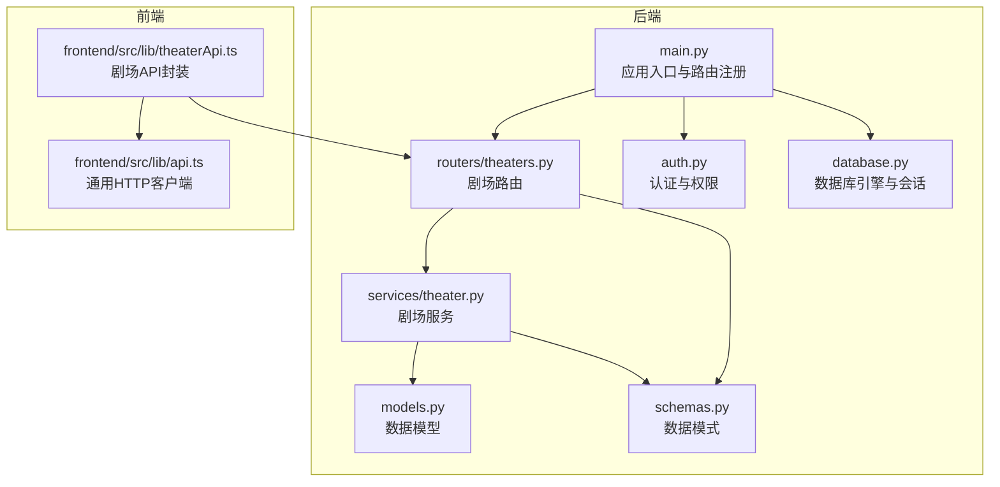
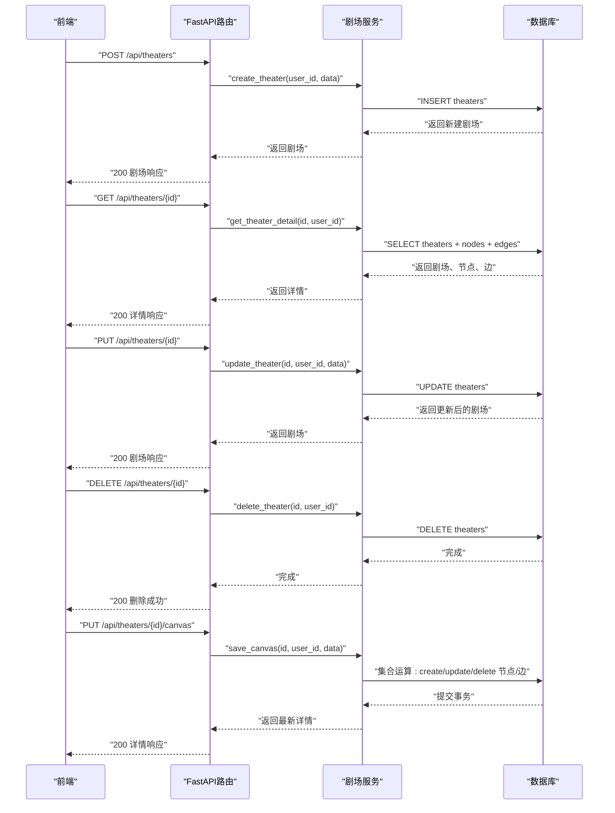
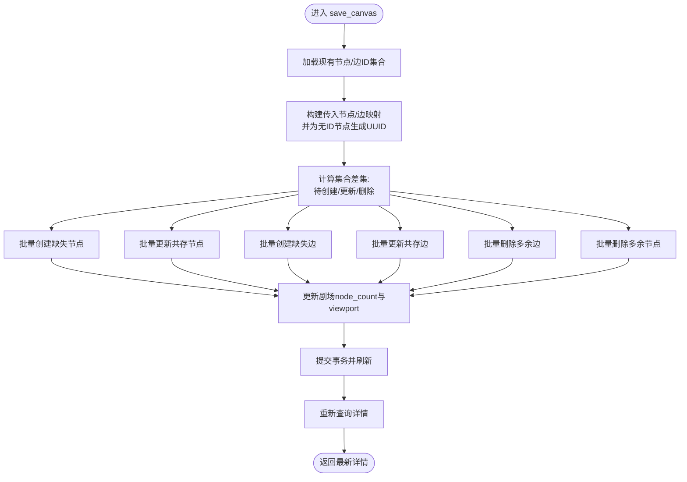
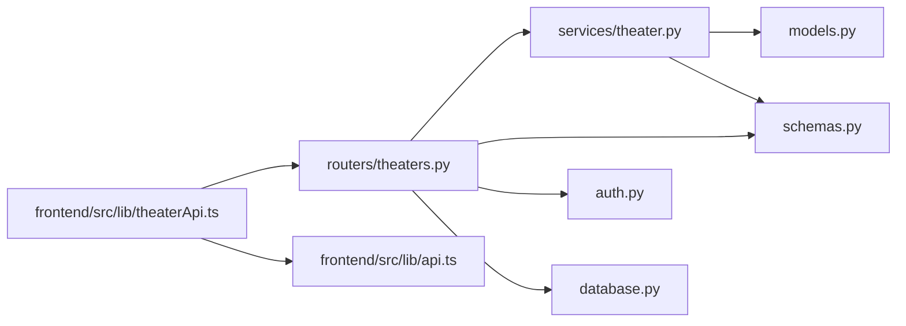

# 剧场管理路由

<cite>
**本文引用的文件**
- [main.py](file://backend/main.py)
- [theaters.py](file://backend/routers/theaters.py)
- [theater.py](file://backend/services/theater.py)
- [models.py](file://backend/models.py)
- [schemas.py](file://backend/schemas.py)
- [auth.py](file://backend/auth.py)
- [database.py](file://backend/database.py)
- [theaterApi.ts](file://frontend/src/lib/theaterApi.ts)
- [api.ts](file://frontend/src/lib/api.ts)
</cite>

## 目录
1. [简介](#简介)
2. [项目结构](#项目结构)
3. [核心组件](#核心组件)
4. [架构总览](#架构总览)
5. [详细组件分析](#详细组件分析)
6. [依赖关系分析](#依赖关系分析)
7. [性能考量](#性能考量)
8. [故障排查指南](#故障排查指南)
9. [结论](#结论)
10. [附录](#附录)

## 简介
本文件面向“剧场管理路由”模块，系统性梳理后端FastAPI路由、服务层、数据模型与前端API封装之间的关系，重点覆盖：
- 剧场CRUD操作的完整流程（创建、读取、更新、删除）
- 节点与连接（边）的管理与同步策略
- 权限控制机制（基于JWT的用户认证与资源隔离）
- 完整端点清单、请求/响应结构与错误处理
- 实际API调用示例与数据模型说明

## 项目结构
后端采用分层架构：路由层负责HTTP端点与参数校验；服务层封装业务逻辑；模型层定义数据库表结构；模式层定义请求/响应数据结构；认证模块提供JWT解析与依赖注入；数据库模块提供异步会话。

图表来源
- [main.py:138-152](file://backend/main.py#L138-L152)
- [theaters.py:14-17](file://backend/routers/theaters.py#L14-L17)
- [theater.py:13-16](file://backend/services/theater.py#L13-L16)
- [models.py:75-130](file://backend/models.py#L75-L130)
- [schemas.py:693-820](file://backend/schemas.py#L693-L820)
- [auth.py:83-113](file://backend/auth.py#L83-L113)
- [database.py:28-31](file://backend/database.py#L28-L31)
- [theaterApi.ts:107-158](file://frontend/src/lib/theaterApi.ts#L107-L158)
- [api.ts:3-84](file://frontend/src/lib/api.ts#L3-L84)

章节来源
- [main.py:138-152](file://backend/main.py#L138-L152)
- [theaters.py:14-17](file://backend/routers/theaters.py#L14-L17)
- [theater.py:13-16](file://backend/services/theater.py#L13-L16)
- [models.py:75-130](file://backend/models.py#L75-L130)
- [schemas.py:693-820](file://backend/schemas.py#L693-L820)
- [auth.py:83-113](file://backend/auth.py#L83-L113)
- [database.py:28-31](file://backend/database.py#L28-L31)
- [theaterApi.ts:107-158](file://frontend/src/lib/theaterApi.ts#L107-L158)
- [api.ts:3-84](file://frontend/src/lib/api.ts#L3-L84)

## 核心组件
- 路由器：定义剧场相关HTTP端点，负责参数解析与依赖注入
- 服务层：封装业务逻辑，执行数据库操作与集合运算
- 数据模型：定义剧场、节点、边的表结构及外键约束
- 数据模式：定义请求/响应结构，含节点类型、位置信息、连接关系
- 认证与权限：基于JWT的用户认证，资源级隔离（用户只能访问自己的剧场）

章节来源
- [theaters.py:20-110](file://backend/routers/theaters.py#L20-L110)
- [theater.py:17-285](file://backend/services/theater.py#L17-L285)
- [models.py:75-130](file://backend/models.py#L75-L130)
- [schemas.py:693-820](file://backend/schemas.py#L693-L820)
- [auth.py:83-113](file://backend/auth.py#L83-L113)

## 架构总览
下图展示从HTTP请求到数据库写入的端到端流程，涵盖创建、读取、更新、删除与画布全量同步。

图表来源
- [theaters.py:20-110](file://backend/routers/theaters.py#L20-L110)
- [theater.py:17-285](file://backend/services/theater.py#L17-L285)

## 详细组件分析

### 路由层（routers/theaters.py）
- 前缀与标签：统一前缀“/api/theaters”，标签“theaters”
- 端点概览
  - POST “/”：创建剧场
  - GET “/”：分页列出当前用户剧场（支持status过滤）
  - GET “/{theater_id}”：获取剧场详情（含节点与边）
  - PUT “/{theater_id}”：更新剧场元信息
  - DELETE “/{theater_id}”：删除剧场（物理删除）
  - PUT “/{theater_id}/canvas”：全量同步画布（节点与边）
  - POST “/{theater_id}/duplicate”：复制剧场（含节点与边）

章节来源
- [theaters.py:14-110](file://backend/routers/theaters.py#L14-L110)

### 服务层（services/theater.py）
- 资源隔离：通过“归属校验”确保用户只能操作自己的剧场
- 列表与筛选：按status过滤、分页、排序
- 详情查询：一次性返回剧场、节点、边三部分
- 更新策略：仅更新提供的字段（排除未传字段）
- 画布同步：使用集合运算对节点与边进行create/update/delete，保证一致性
- 复制剧场：深拷贝剧场、节点与边，并重映射边的source/target

图表来源
- [theater.py:108-228](file://backend/services/theater.py#L108-L228)

章节来源
- [theater.py:17-285](file://backend/services/theater.py#L17-L285)

### 数据模型（models.py）
- 剧场表（Theater）：用户ID、标题、描述、缩略图、状态、画布视口、设置、节点计数
- 节点表（TheaterNode）：节点类型（脚本/角色/故事板/视频）、位置坐标、尺寸、层级、业务数据
- 边表（TheaterEdge）：起止节点、句柄、边类型、动画、样式
- 外键与级联：节点与边均受剧场级联删除保护

章节来源
- [models.py:75-130](file://backend/models.py#L75-L130)

### 数据模式（schemas.py）
- 剧场模式：创建、更新、响应、详情、列表、画布保存请求
- 节点模式：创建、更新、响应
- 边模式：创建、响应
- 节点类型常量：脚本、角色、故事板、视频

章节来源
- [schemas.py:693-820](file://backend/schemas.py#L693-L820)

### 认证与权限（auth.py）
- JWT解码与校验：Access Token必须有效且类型为“access”
- 用户依赖：get_current_active_user确保账户激活
- 资源隔离辅助：scoped_query根据主体类型自动添加user_id过滤

章节来源
- [auth.py:83-113](file://backend/auth.py#L83-L113)
- [auth.py:221-229](file://backend/auth.py#L221-L229)

### 数据库与会话（database.py）
- 异步引擎与会话工厂
- 连接池配置与SQLite线程安全适配

章节来源
- [database.py:8-31](file://backend/database.py#L8-L31)

### 前端API封装（frontend/src/lib/theaterApi.ts）
- 提供创建、列表、详情、更新、删除、保存画布、复制剧场等方法
- 请求参数与响应类型与后端模式保持一致

章节来源
- [theaterApi.ts:107-158](file://frontend/src/lib/theaterApi.ts#L107-L158)

### 通用HTTP客户端（frontend/src/lib/api.ts）
- 基础URL指向“/api”
- 自动附加Authorization头
- 401拦截与刷新令牌队列处理

章节来源
- [api.ts:3-84](file://frontend/src/lib/api.ts#L3-L84)

## 依赖关系分析
- 路由依赖认证：所有端点均依赖“当前活跃用户”依赖项
- 服务依赖数据库：使用异步会话执行查询与事务
- 模式依赖：路由与服务共享Pydantic模式，确保请求/响应一致性
- 前端依赖后端：前端API封装直接调用后端路由

图表来源
- [theaters.py:1-12](file://backend/routers/theaters.py#L1-L12)
- [theater.py:1-11](file://backend/services/theater.py#L1-L11)
- [models.py:1-4](file://backend/models.py#L1-L4)
- [schemas.py:1-4](file://backend/schemas.py#L1-L4)
- [auth.py:1-12](file://backend/auth.py#L1-L12)
- [database.py:1-4](file://backend/database.py#L1-L4)
- [theaterApi.ts:1-1](file://frontend/src/lib/theaterApi.ts#L1-L1)
- [api.ts:1-1](file://frontend/src/lib/api.ts#L1-L1)

章节来源
- [theaters.py:1-12](file://backend/routers/theaters.py#L1-L12)
- [theater.py:1-11](file://backend/services/theater.py#L1-L11)
- [models.py:1-4](file://backend/models.py#L1-L4)
- [schemas.py:1-4](file://backend/schemas.py#L1-L4)
- [auth.py:1-12](file://backend/auth.py#L1-L12)
- [database.py:1-4](file://backend/database.py#L1-L4)
- [theaterApi.ts:1-1](file://frontend/src/lib/theaterApi.ts#L1-L1)
- [api.ts:1-1](file://frontend/src/lib/api.ts#L1-L1)

## 性能考量
- 集合运算：画布同步采用集合差集计算，减少逐条比对开销
- 批量操作：节点与边的create/update/delete均使用批量SQL，降低往返次数
- 分页与排序：列表接口支持分页与排序，避免一次性加载过多数据
- 连接池：异步引擎配置连接池参数，提升并发能力
- 级联删除：节点与边的外键级联删除，简化删除流程

[本节为通用性能建议，不直接分析具体文件]

## 故障排查指南
- 401未授权：确认前端已正确设置Authorization头，且Token未过期
- 403禁止访问：账户被禁用或非活跃状态
- 404未找到：剧场不存在或不属于当前用户
- 画布不同步：检查前端传入节点/边是否包含重复ID或非法ID；服务端会为无ID节点生成UUID
- 数据库连接失败：检查DATABASE_URL与连接池配置

章节来源
- [auth.py:95-113](file://backend/auth.py#L95-L113)
- [theater.py:33-41](file://backend/services/theater.py#L33-L41)
- [database.py:8-31](file://backend/database.py#L8-L31)

## 结论
剧场管理路由模块以清晰的分层设计实现了完整的CRUD与画布同步能力，结合JWT认证与资源隔离，确保了安全性与一致性。服务层的集合运算与批量操作提升了性能，前端API封装与通用HTTP客户端提供了良好的开发体验。

[本节为总结性内容，不直接分析具体文件]

## 附录

### 端点一览与规范
- 创建剧场
  - 方法与路径：POST /api/theaters
  - 认证：需要当前活跃用户
  - 请求体：参见“剧场创建请求”
  - 响应：剧场响应
  - 错误：422参数校验失败；401/403认证/权限问题
- 列出剧场
  - 方法与路径：GET /api/theaters
  - 查询参数：page、page_size、status
  - 认证：需要当前活跃用户
  - 响应：剧场列表响应
  - 错误：401/403
- 获取剧场详情
  - 方法与路径：GET /api/theaters/{theater_id}
  - 认证：需要当前活跃用户
  - 响应：剧场详情响应（含nodes、edges）
  - 错误：404剧场不存在或不属于当前用户；401/403
- 更新剧场
  - 方法与路径：PUT /api/theaters/{theater_id}
  - 请求体：剧场更新请求（可选字段）
  - 认证：需要当前活跃用户
  - 响应：剧场响应
  - 错误：404/401/403
- 删除剧场
  - 方法与路径：DELETE /api/theaters/{theater_id}
  - 认证：需要当前活跃用户
  - 响应：删除成功消息
  - 错误：404/401/403
- 保存画布
  - 方法与路径：PUT /api/theaters/{theater_id}/canvas
  - 请求体：画布保存请求（nodes、edges、可选canvas_viewport）
  - 认证：需要当前活跃用户
  - 响应：剧场详情响应
  - 错误：404/401/403
- 复制剧场
  - 方法与路径：POST /api/theaters/{theater_id}/duplicate
  - 认证：需要当前活跃用户
  - 响应：新剧场响应
  - 错误：404/401/403

章节来源
- [theaters.py:20-110](file://backend/routers/theaters.py#L20-L110)
- [schemas.py:764-820](file://backend/schemas.py#L764-L820)

### 数据模型说明
- 剧场（Theater）
  - 关键字段：user_id、title、description、thumbnail_url、status、canvas_viewport、settings、node_count
  - 状态：draft、published、archived
- 节点（TheaterNode）
  - 关键字段：node_type（script、character、storyboard、video）、position_x/y、width/height、z_index、data
- 边（TheaterEdge）
  - 关键字段：source_node_id、target_node_id、source_handle、target_handle、edge_type、animated、style

章节来源
- [models.py:75-130](file://backend/models.py#L75-L130)

### 权限控制机制
- 认证：JWT Access Token，需携带Authorization头
- 资源隔离：服务层通过“归属校验”确保用户只能访问自己的剧场
- 依赖注入：路由层统一依赖“当前活跃用户”，未通过校验的请求直接拒绝

章节来源
- [auth.py:83-113](file://backend/auth.py#L83-L113)
- [theater.py:33-41](file://backend/services/theater.py#L33-L41)

### API调用示例（前端）
- 创建剧场
  - theaterApi.createTheater({ title: "我的剧场", status: "draft" })
- 列出剧场
  - theaterApi.listTheaters(1, 20, "draft")
- 获取剧场详情
  - theaterApi.getTheater("THEATER_ID")
- 更新剧场
  - theaterApi.updateTheater("THEATER_ID", { title: "新标题", status: "published" })
- 删除剧场
  - theaterApi.deleteTheater("THEATER_ID")
- 保存画布
  - theaterApi.saveCanvas("THEATER_ID", { nodes, edges, canvas_viewport })
- 复制剧场
  - theaterApi.duplicateTheater("THEATER_ID")

章节来源
- [theaterApi.ts:107-158](file://frontend/src/lib/theaterApi.ts#L107-L158)