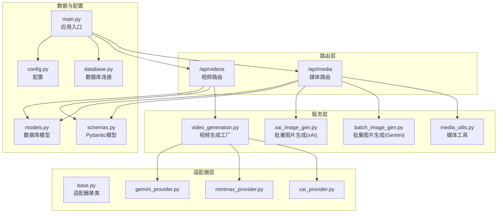
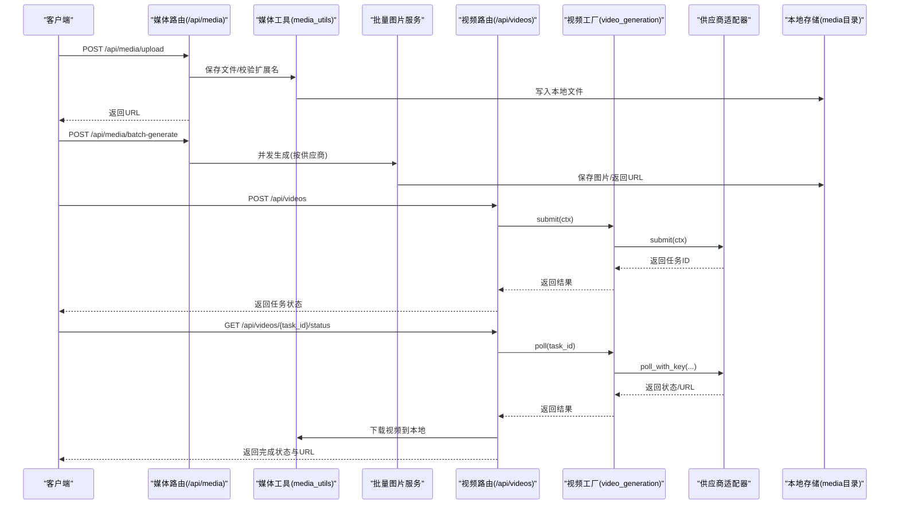
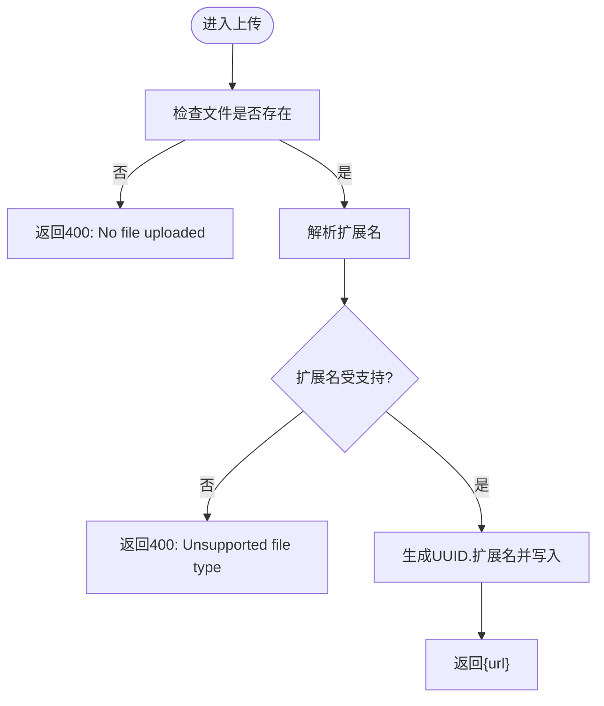
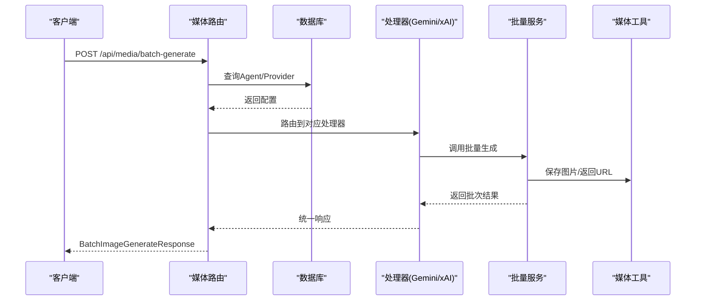
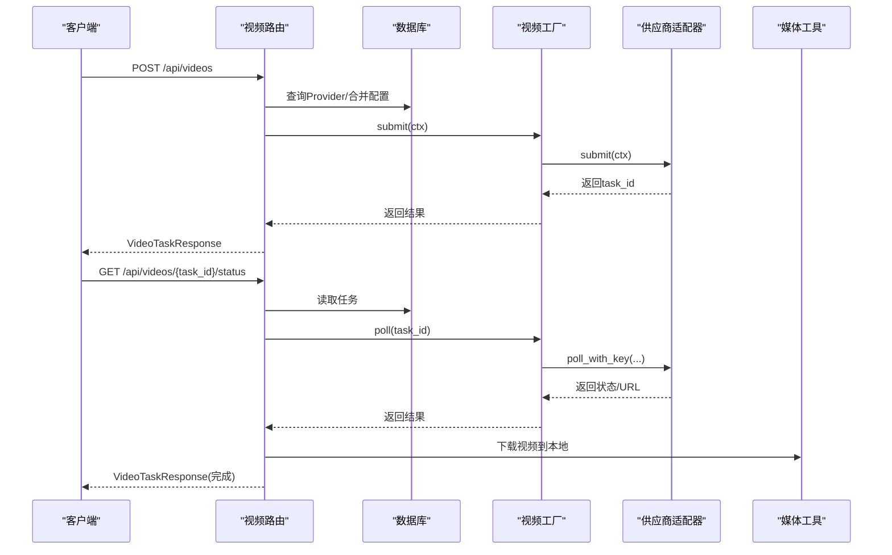
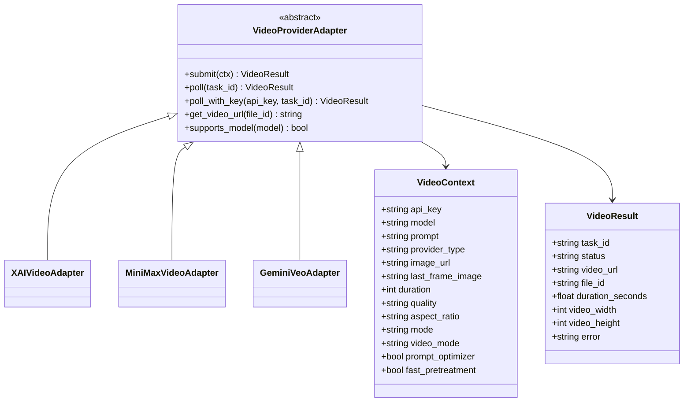
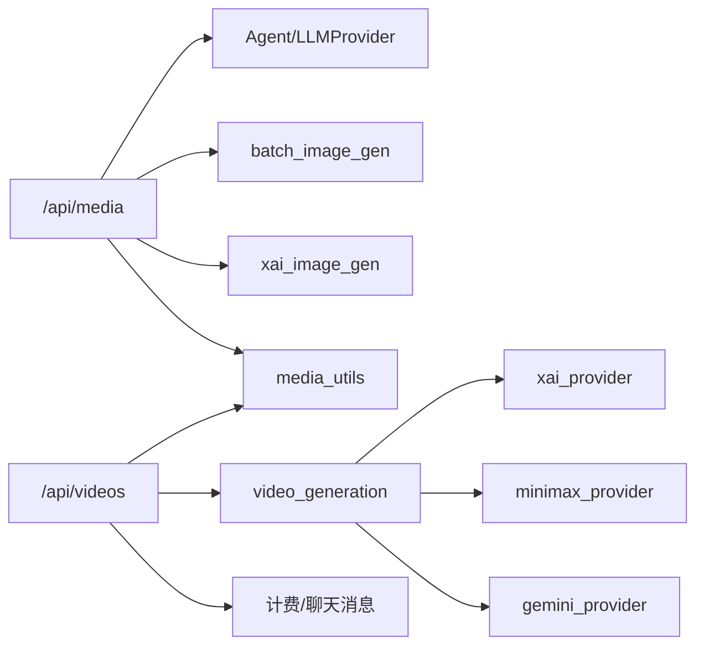

# 媒体处理路由

<cite>
**本文引用的文件**
- [backend/routers/media.py](file://backend/routers/media.py)
- [backend/services/media_utils.py](file://backend/services/media_utils.py)
- [backend/services/batch_image_gen.py](file://backend/services/batch_image_gen.py)
- [backend/services/xai_image_gen.py](file://backend/services/xai_image_gen.py)
- [backend/services/video_generation.py](file://backend/services/video_generation.py)
- [backend/routers/videos.py](file://backend/routers/videos.py)
- [backend/services/video_providers/base.py](file://backend/services/video_providers/base.py)
- [backend/services/video_providers/xai_provider.py](file://backend/services/video_providers/xai_provider.py)
- [backend/services/video_providers/minimax_provider.py](file://backend/services/video_providers/minimax_provider.py)
- [backend/services/video_providers/gemini_provider.py](file://backend/services/video_providers/gemini_provider.py)
- [backend/schemas.py](file://backend/schemas.py)
- [backend/models.py](file://backend/models.py)
- [backend/main.py](file://backend/main.py)
- [backend/database.py](file://backend/database.py)
- [backend/config.py](file://backend/config.py)
</cite>

## 目录
1. [简介](#简介)
2. [项目结构](#项目结构)
3. [核心组件](#核心组件)
4. [架构总览](#架构总览)
5. [详细组件分析](#详细组件分析)
6. [依赖分析](#依赖分析)
7. [性能考虑](#性能考虑)
8. [故障排查指南](#故障排查指南)
9. [结论](#结论)
10. [附录](#附录)

## 简介
本文件面向“媒体处理路由”模块，系统化梳理图像生成、视频生成与文件上传下载的API设计与实现，涵盖质量控制、格式转换、存储管理、批量处理与异步任务、进度跟踪与状态查询、端点规范、错误处理以及性能优化建议。目标读者既包括后端开发者，也包括需要理解API行为的前端与产品人员。

## 项目结构
媒体处理相关的核心代码分布在以下模块：
- 路由层：负责HTTP接口定义与鉴权依赖注入
- 服务层：封装具体业务逻辑（批量图片生成、视频生成、媒体工具）
- 适配器层：供应商适配器（xAI、MiniMax、Gemini Veo）
- 数据模型与Schema：统一请求/响应结构与数据库实体
- 应用入口与数据库：FastAPI应用注册、数据库连接与静态资源挂载

图表来源
- [backend/routers/media.py:1-244](file://backend/routers/media.py#L1-L244)
- [backend/routers/videos.py:1-343](file://backend/routers/videos.py#L1-L343)
- [backend/services/media_utils.py:1-79](file://backend/services/media_utils.py#L1-L79)
- [backend/services/batch_image_gen.py:1-187](file://backend/services/batch_image_gen.py#L1-L187)
- [backend/services/xai_image_gen.py:1-191](file://backend/services/xai_image_gen.py#L1-L191)
- [backend/services/video_generation.py:1-160](file://backend/services/video_generation.py#L1-L160)
- [backend/services/video_providers/base.py:1-114](file://backend/services/video_providers/base.py#L1-L114)
- [backend/services/video_providers/xai_provider.py:1-164](file://backend/services/video_providers/xai_provider.py#L1-L164)
- [backend/services/video_providers/minimax_provider.py:1-318](file://backend/services/video_providers/minimax_provider.py#L1-L318)
- [backend/services/video_providers/gemini_provider.py:1-276](file://backend/services/video_providers/gemini_provider.py#L1-L276)
- [backend/schemas.py:516-800](file://backend/schemas.py#L516-L800)
- [backend/models.py:131-447](file://backend/models.py#L131-L447)
- [backend/main.py:138-152](file://backend/main.py#L138-L152)
- [backend/database.py:1-31](file://backend/database.py#L1-L31)
- [backend/config.py:1-43](file://backend/config.py#L1-L43)

章节来源
- [backend/routers/media.py:1-244](file://backend/routers/media.py#L1-L244)
- [backend/routers/videos.py:1-343](file://backend/routers/videos.py#L1-L343)
- [backend/main.py:138-152](file://backend/main.py#L138-L152)

## 核心组件
- 媒体路由（/api/media）
  - 文件上传：接收multipart/form-data，校验扩展名，保存至本地media目录，返回可访问URL
  - 文件下载：按安全规则解析UUID或带扩展名的文件名，支持无扩展名回退查找，返回FileResponse
  - 批量图片生成：根据智能体与供应商类型，路由到Gemini或xAI的批量生成处理器，返回批次统计与逐条结果
- 视频路由（/api/videos）
  - 任务提交：校验供应商与模型能力，创建VideoTask记录，返回任务状态
  - 状态轮询：根据供应商类型自动适配轮询，完成后下载视频、计费、写入聊天消息
  - 任务列表与详情：分页查询、按会话查询、删除终态任务及本地文件
- 媒体工具
  - 保存内联图片：根据MIME类型推断扩展名，写入本地media目录
  - 从URL下载图片/视频：异步HTTP客户端，支持超时与重定向
- 批量图片生成服务
  - Gemini：基于Google GenAI SDK，支持并发信号量、Google Search工具、Token统计
  - xAI：基于OpenAI AsyncOpenAI，支持宽高比、分辨率、响应格式等参数
- 视频生成服务与适配器
  - 工厂：根据供应商类型选择适配器，统一submit/poll接口
  - 适配器：xAI、MiniMax、Gemini Veo，分别实现提交、轮询、下载与能力映射

章节来源
- [backend/routers/media.py:54-244](file://backend/routers/media.py#L54-L244)
- [backend/services/media_utils.py:20-79](file://backend/services/media_utils.py#L20-L79)
- [backend/services/batch_image_gen.py:113-187](file://backend/services/batch_image_gen.py#L113-L187)
- [backend/services/xai_image_gen.py:125-191](file://backend/services/xai_image_gen.py#L125-L191)
- [backend/services/video_generation.py:84-160](file://backend/services/video_generation.py#L84-L160)
- [backend/routers/videos.py:74-233](file://backend/routers/videos.py#L74-L233)

## 架构总览
媒体处理采用“路由-服务-适配器-供应商”的分层架构，路由负责协议与鉴权，服务负责业务编排，适配器屏蔽供应商差异，供应商提供具体API。

图表来源
- [backend/routers/media.py:83-139](file://backend/routers/media.py#L83-L139)
- [backend/services/media_utils.py:31-79](file://backend/services/media_utils.py#L31-L79)
- [backend/services/batch_image_gen.py:113-187](file://backend/services/batch_image_gen.py#L113-L187)
- [backend/services/xai_image_gen.py:125-191](file://backend/services/xai_image_gen.py#L125-L191)
- [backend/routers/videos.py:74-233](file://backend/routers/videos.py#L74-L233)
- [backend/services/video_generation.py:84-124](file://backend/services/video_generation.py#L84-L124)
- [backend/services/video_providers/base.py:49-114](file://backend/services/video_providers/base.py#L49-L114)

## 详细组件分析

### 媒体路由（/api/media）
- 文件上传
  - 方法：POST /api/media/upload
  - 请求：multipart/form-data，字段file
  - 校验：扩展名必须在支持列表；若无扩展名则拒绝
  - 存储：生成UUID.扩展名，写入本地media目录
  - 响应：{ url: "/api/media/{uuid}.{ext}" }
  - 错误：400（无文件/不支持类型）、500（保存失败）
- 文件下载
  - 方法：GET /api/media/{filename}
  - 安全策略：严格匹配带扩展名的UUID；若仅UUID则按回退顺序尝试常见扩展名
  - 缓存：设置Cache-Control公共缓存一年
  - 错误：400（无效文件名）、404（文件不存在）

图表来源
- [backend/routers/media.py:83-105](file://backend/routers/media.py#L83-L105)

章节来源
- [backend/routers/media.py:54-106](file://backend/routers/media.py#L54-L106)

### 批量图片生成（/api/media/batch-generate）
- 方法：POST /api/media/batch-generate
- 请求体：BatchImageGenerateRequest
  - agent_id：智能体ID
  - prompts：1-8条提示词
  - config：BatchImageConfigRequest（可选）
  - max_concurrent：并发数1-8
- 供应商路由
  - Gemini：读取Agent与LLMProvider配置，调用batch_generate_images
  - xAI：读取Agent的xai_image_config，调用batch_generate_xai_images
- 响应：BatchImageGenerateResponse
  - success、total_prompts、completed、failed、results[]
- 错误：404（Agent/Provider不存在）、400（不支持的供应商）

图表来源
- [backend/routers/media.py:108-139](file://backend/routers/media.py#L108-L139)
- [backend/services/batch_image_gen.py:113-187](file://backend/services/batch_image_gen.py#L113-L187)
- [backend/services/xai_image_gen.py:125-191](file://backend/services/xai_image_gen.py#L125-L191)
- [backend/services/media_utils.py:20-28](file://backend/services/media_utils.py#L20-L28)

章节来源
- [backend/routers/media.py:108-244](file://backend/routers/media.py#L108-L244)
- [backend/schemas.py:516-554](file://backend/schemas.py#L516-L554)
- [backend/services/batch_image_gen.py:1-187](file://backend/services/batch_image_gen.py#L1-L187)
- [backend/services/xai_image_gen.py:1-191](file://backend/services/xai_image_gen.py#L1-L191)
- [backend/services/media_utils.py:1-79](file://backend/services/media_utils.py#L1-L79)

### 视频生成（/api/videos）
- 任务提交（POST /api/videos）
  - 请求体：VideoGenerateRequest
    - provider_id、model、video_mode、prompt、image_url/last_frame_image、config
  - 校验：查询LLMProvider，合并VideoConfig，推断供应商类型
  - 提交：submit_video_task(ctx)，创建VideoTask记录
  - 响应：VideoTaskResponse
- 状态轮询（GET /api/videos/{task_id}/status）
  - 若任务处于终态，直接返回缓存
  - 否则根据供应商类型轮询，完成后下载视频、计算积分、扣费、插入聊天消息
- 任务列表（GET /api/videos）
  - 分页查询，支持按status、video_mode、provider_id过滤
- 会话任务（GET /api/videos/session/{session_id}）
  - 按会话ID查询视频任务
- 删除任务（DELETE /api/videos/{task_id}）
  - 仅允许删除终态任务，同时删除本地文件与关联消息

图表来源
- [backend/routers/videos.py:74-233](file://backend/routers/videos.py#L74-L233)
- [backend/services/video_generation.py:84-160](file://backend/services/video_generation.py#L84-L160)
- [backend/services/video_providers/base.py:49-114](file://backend/services/video_providers/base.py#L49-L114)
- [backend/services/video_providers/xai_provider.py:47-164](file://backend/services/video_providers/xai_provider.py#L47-L164)
- [backend/services/video_providers/minimax_provider.py:90-318](file://backend/services/video_providers/minimax_provider.py#L90-L318)
- [backend/services/video_providers/gemini_provider.py:80-276](file://backend/services/video_providers/gemini_provider.py#L80-L276)
- [backend/services/media_utils.py:31-50](file://backend/services/media_utils.py#L31-L50)

章节来源
- [backend/routers/videos.py:1-343](file://backend/routers/videos.py#L1-L343)
- [backend/schemas.py:629-690](file://backend/schemas.py#L629-L690)
- [backend/models.py:391-422](file://backend/models.py#L391-L422)
- [backend/services/video_generation.py:1-160](file://backend/services/video_generation.py#L1-L160)

### 供应商适配器（抽象与实现）
- 抽象基类
  - VideoContext：统一请求上下文（模型、提示词、时长、分辨率、宽高比、模式、图片等）
  - VideoResult：统一结果（任务ID、状态、URL、文件ID、时长、尺寸、错误）
  - 适配器接口：submit、poll、get_video_url（部分供应商需要）
- 适配器实现
  - xAI：支持Groik系列模型，提交/轮询端点明确，内容审核失败映射为failed
  - MiniMax：支持Hailuo/T2V/I2V/S2V系列，首尾帧、主题参考、快速预处理等特性
  - Gemini Veo：支持Veo系列，长运行操作、API Key鉴权、原生音频与扩展能力

图表来源
- [backend/services/video_providers/base.py:15-114](file://backend/services/video_providers/base.py#L15-L114)
- [backend/services/video_providers/xai_provider.py:22-164](file://backend/services/video_providers/xai_provider.py#L22-L164)
- [backend/services/video_providers/minimax_provider.py:30-318](file://backend/services/video_providers/minimax_provider.py#L30-L318)
- [backend/services/video_providers/gemini_provider.py:31-276](file://backend/services/video_providers/gemini_provider.py#L31-L276)

章节来源
- [backend/services/video_providers/base.py:1-114](file://backend/services/video_providers/base.py#L1-L114)
- [backend/services/video_providers/xai_provider.py:1-164](file://backend/services/video_providers/xai_provider.py#L1-L164)
- [backend/services/video_providers/minimax_provider.py:1-318](file://backend/services/video_providers/minimax_provider.py#L1-L318)
- [backend/services/video_providers/gemini_provider.py:1-276](file://backend/services/video_providers/gemini_provider.py#L1-L276)

### 媒体工具与存储
- save_inline_image：根据MIME类型推断扩展名，写入本地media目录，返回/api/media/{uuid}.{ext}
- save_image_from_url/save_video_from_url：异步HTTP下载，支持Content-Type推断与Gemini API Key头
- 媒体目录：应用启动时确保存在，上传/下载均在此目录下进行

章节来源
- [backend/services/media_utils.py:20-79](file://backend/services/media_utils.py#L20-L79)
- [backend/main.py:104-106](file://backend/main.py#L104-L106)

## 依赖分析
- 路由依赖
  - /api/media依赖数据库（查询Agent/Provider）、批量图片服务（Gemini/xAI）、媒体工具
  - /api/videos依赖视频工厂、适配器、媒体工具、计费与聊天消息插入
- 服务依赖
  - 批量图片服务依赖Google GenAI SDK与OpenAI AsyncOpenAI
  - 视频工厂依赖适配器注册表与模型能力推断
- 数据模型
  - Agent/LLMProvider用于智能体与供应商配置
  - VideoTask用于异步任务追踪与计费

图表来源
- [backend/routers/media.py:108-139](file://backend/routers/media.py#L108-L139)
- [backend/routers/videos.py:74-147](file://backend/routers/videos.py#L74-L147)
- [backend/services/video_generation.py:47-76](file://backend/services/video_generation.py#L47-L76)

章节来源
- [backend/routers/media.py:1-244](file://backend/routers/media.py#L1-L244)
- [backend/routers/videos.py:1-343](file://backend/routers/videos.py#L1-L343)
- [backend/services/video_generation.py:1-160](file://backend/services/video_generation.py#L1-L160)
- [backend/models.py:196-253](file://backend/models.py#L196-L253)

## 性能考虑
- 并发控制
  - 批量图片生成使用信号量限制并发（1-8），避免供应商限流与资源争用
- 异步I/O
  - 媒体下载与视频轮询均使用异步HTTP客户端，提升吞吐
- 缓存与重定向
  - 文件下载设置长期缓存头，减少重复请求
- 数据库连接池
  - 异步引擎配置连接池与预检测，降低连接开销
- 建议
  - 对高频上传/下载增加CDN前置与缩略图策略
  - 对视频生成任务引入队列与重试机制，结合Redis实现可靠调度
  - 对Gemini/Veo等长运行任务设置超时与重试上限，避免阻塞

[本节为通用指导，不直接分析具体文件]

## 故障排查指南
- 上传失败
  - 检查扩展名是否在支持列表；确认文件存在且可写；查看保存异常日志
- 下载失败
  - 校验文件名是否符合安全规则；确认文件存在；检查缓存头与权限
- 批量图片生成异常
  - 查看供应商API Key与模型可用性；关注并发数与Token统计；检查网络与SDK异常
- 视频任务长时间pending
  - 检查供应商轮询状态映射；确认任务是否因内容审核失败；查看超时保护逻辑
- 计费与积分
  - 确认模型费率配置；检查扣费事务与异常回滚；核对任务完成时间与时长

章节来源
- [backend/routers/media.py:83-105](file://backend/routers/media.py#L83-L105)
- [backend/routers/videos.py:149-233](file://backend/routers/videos.py#L149-L233)
- [backend/services/batch_image_gen.py:160-187](file://backend/services/batch_image_gen.py#L160-L187)
- [backend/services/xai_image_gen.py:161-191](file://backend/services/xai_image_gen.py#L161-L191)

## 结论
媒体处理路由模块以清晰的分层设计实现了图像与视频的统一接入，通过供应商适配器屏蔽差异，配合异步I/O与并发控制保障性能。建议在生产环境中进一步完善队列化、CDN与监控告警体系，持续优化供应商集成与成本控制。

[本节为总结性内容，不直接分析具体文件]

## 附录

### API端点一览与规范
- 媒体上传
  - 方法：POST /api/media/upload
  - 请求体：multipart/form-data
    - file: 文件（必填）
  - 响应：{ url: "/api/media/{uuid}.{ext}" }
  - 错误：400（无文件/不支持类型）、500（保存失败）
- 媒体下载
  - 方法：GET /api/media/{filename}
  - 支持：带扩展名UUID与无扩展名UUID回退
  - 响应：FileResponse（带缓存头）
  - 错误：400（无效文件名）、404（文件不存在）
- 批量图片生成
  - 方法：POST /api/media/batch-generate
  - 请求体：BatchImageGenerateRequest
    - agent_id: 智能体ID（必填）
    - prompts: 提示词数组（1-8）
    - config: 批量配置（可选）
    - max_concurrent: 并发数（1-8）
  - 响应：BatchImageGenerateResponse
  - 错误：404（Agent/Provider不存在）、400（不支持供应商）
- 视频任务提交
  - 方法：POST /api/videos
  - 请求体：VideoGenerateRequest
    - provider_id、model、video_mode、prompt、image_url/last_frame_image、config
  - 响应：VideoTaskResponse
- 视频任务状态轮询
  - 方法：GET /api/videos/{task_id}/status
  - 响应：VideoTaskResponse（完成后包含video_url与计费信息）
- 视频任务列表
  - 方法：GET /api/videos
  - 查询参数：page/page_size/status/video_mode/provider_id
  - 响应：VideoTaskListResponse
- 会话视频任务
  - 方法：GET /api/videos/session/{session_id}
  - 响应：VideoTaskResponse[]
- 删除视频任务
  - 方法：DELETE /api/videos/{task_id}
  - 仅允许终态任务删除，同时清理本地文件与关联消息

章节来源
- [backend/routers/media.py:54-139](file://backend/routers/media.py#L54-L139)
- [backend/routers/videos.py:26-297](file://backend/routers/videos.py#L26-L297)
- [backend/schemas.py:516-690](file://backend/schemas.py#L516-L690)

### 数据模型与Schema要点
- 批量图片
  - BatchImageConfigRequest/BatchImageGenerateRequest/BatchImageGenerateResponse
- 视频
  - VideoGenerateRequest/VideoTaskResponse/VideoTaskListResponse/VideoConfig
- 供应商与智能体
  - Agent/LLMProvider/VideoTask

章节来源
- [backend/schemas.py:516-690](file://backend/schemas.py#L516-L690)
- [backend/models.py:196-422](file://backend/models.py#L196-L422)