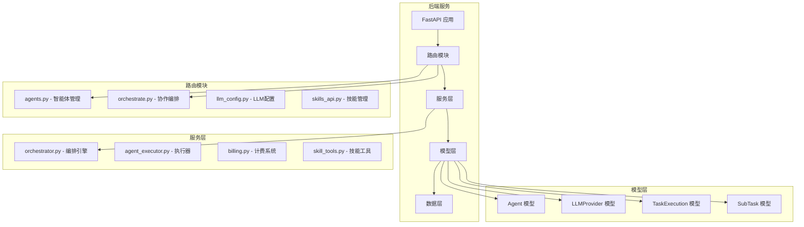
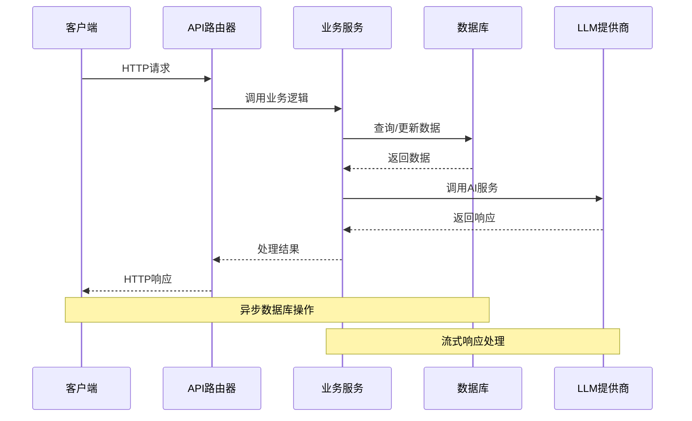
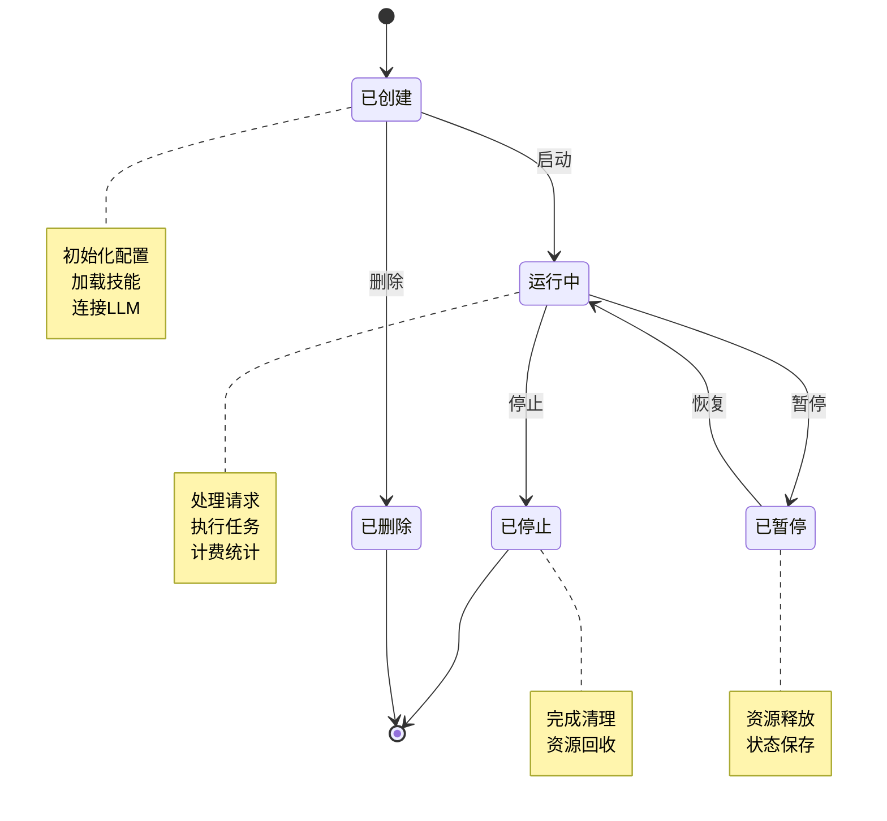
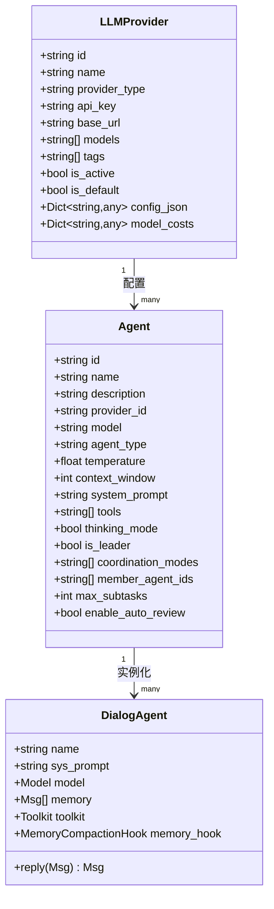
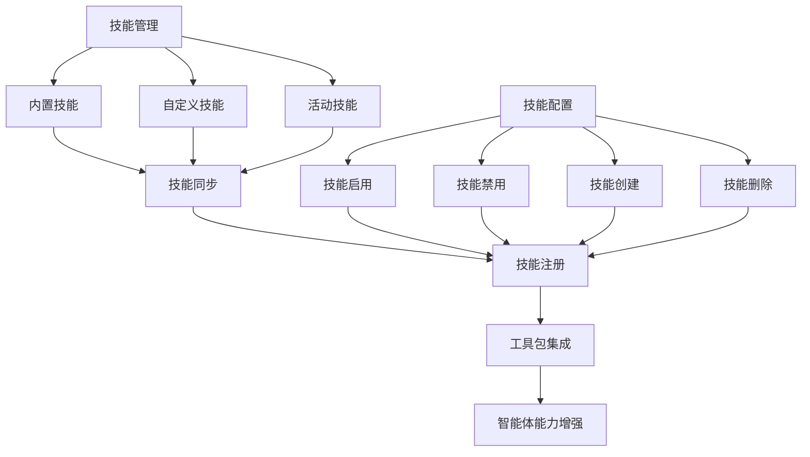
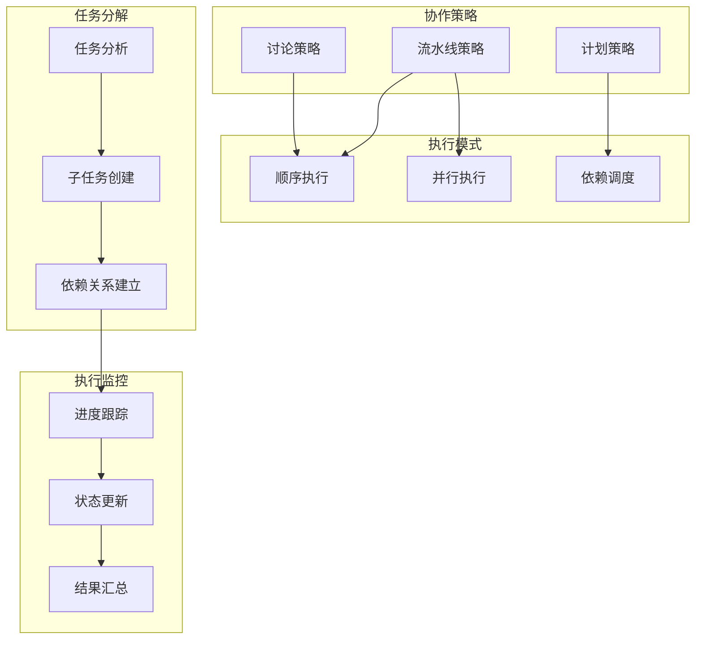
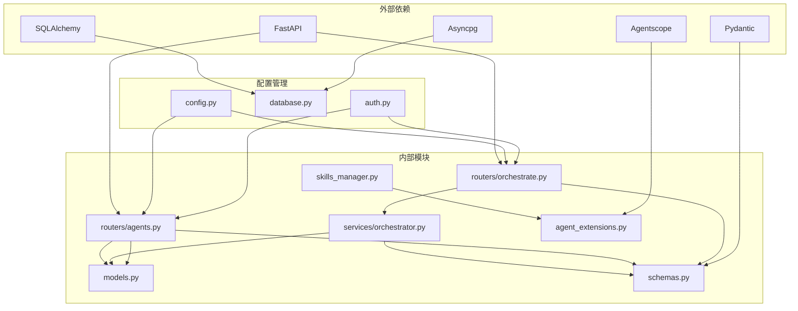

# 智能体管理路由

<cite>
**本文档引用的文件**
- [agents.py](file://backend/routers/agents.py)
- [orchestrate.py](file://backend/routers/orchestrate.py)
- [schemas.py](file://backend/schemas.py)
- [models.py](file://backend/models.py)
- [agents.py](file://backend/agents.py)
- [orchestrator.py](file://backend/services/orchestrator.py)
- [skills_manager.py](file://backend/skills_manager.py)
- [agent_extensions.py](file://backend/agent_extensions.py)
- [main.py](file://backend/main.py)
- [page.tsx](file://backend/admin/src/app/admin/agents/page.tsx)
- [AgentForm/index.tsx](file://backend/admin/src/components/admin/agents/AgentForm/index.tsx)
- [agent.ts](file://backend/admin/src/constants/agent.ts)
</cite>

## 目录
1. [简介](#简介)
2. [项目结构](#项目结构)
3. [核心组件](#核心组件)
4. [架构概览](#架构概览)
5. [详细组件分析](#详细组件分析)
6. [依赖关系分析](#依赖关系分析)
7. [性能考虑](#性能考虑)
8. [故障排除指南](#故障排除指南)
9. [结论](#结论)
10. [附录](#附录)

## 简介

智能体管理路由模块是 Infinite Game 项目的核心功能之一，负责管理 AI 智能体的完整生命周期。该模块提供了完整的 REST API 接口，支持智能体的创建、查询、更新、删除操作，以及多智能体协作的高级功能。

本模块基于 FastAPI 构建，采用现代化的异步编程模式，集成了 LLM 提供商配置、技能系统集成、多智能体协作策略等多种先进技术。通过统一的 API 接口，用户可以轻松管理各种类型的智能体，包括文本智能体、图像生成智能体、多模态智能体和视频生成智能体。

## 项目结构

智能体管理路由模块在项目中的组织结构如下：



**图表来源**
- [main.py:138-152](file://backend/main.py#L138-L152)
- [agents.py:10-14](file://backend/routers/agents.py#L10-L14)

**章节来源**
- [main.py:138-152](file://backend/main.py#L138-L152)
- [agents.py:10-14](file://backend/routers/agents.py#L10-L14)

## 核心组件

### 智能体管理路由 (Agents Router)

智能体管理路由提供了完整的 CRUD 操作接口：

- **POST /api/agents** - 创建新智能体
- **GET /api/agents** - 获取智能体列表
- **GET /api/agents/{agent_id}** - 获取特定智能体详情
- **PUT /api/agents/{agent_id}** - 更新智能体配置
- **DELETE /api/agents/{agent_id}** - 删除智能体

### 多智能体协作路由 (Orchestration Router)

协作路由支持复杂的多智能体任务编排：

- **POST /api/orchestrate** - 执行多智能体协作任务
- **GET /api/orchestrate/{task_execution_id}** - 获取任务执行详情
- **GET /api/orchestrate** - 列出任务执行记录
- **DELETE /api/orchestrate/{task_execution_id}** - 取消任务执行

### 数据模型和验证

系统使用 Pydantic 模型进行数据验证和序列化，确保 API 请求和响应的一致性。

**章节来源**
- [agents.py:16-150](file://backend/routers/agents.py#L16-L150)
- [orchestrate.py:26-184](file://backend/routers/orchestrate.py#L26-L184)
- [schemas.py:237-350](file://backend/schemas.py#L237-L350)

## 架构概览

智能体管理路由模块采用分层架构设计，确保了良好的可维护性和扩展性：



**图表来源**
- [agents.py:16-150](file://backend/routers/agents.py#L16-L150)
- [orchestrator.py:581-673](file://backend/services/orchestrator.py#L581-L673)

### 核心设计原则

1. **异步编程**: 全面采用 async/await 模式，提升并发性能
2. **数据验证**: 使用 Pydantic 模型进行严格的输入验证
3. **错误处理**: 统一的异常处理机制和错误响应格式
4. **安全控制**: 基于角色的访问控制和权限验证
5. **流式处理**: 支持实时数据流和 SSE 事件推送

**章节来源**
- [agents.py:16-150](file://backend/routers/agents.py#L16-L150)
- [orchestrator.py:581-673](file://backend/services/orchestrator.py#L581-L673)

## 详细组件分析

### 智能体生命周期管理

智能体生命周期管理涵盖了从创建到销毁的完整流程：



**图表来源**
- [models.py:196-253](file://backend/models.py#L196-L253)
- [agents.py:40-174](file://backend/agents.py#L40-L174)

#### 创建流程

智能体创建过程包含多个验证步骤：

1. **名称唯一性检查**
2. **LLM 提供商验证**
3. **模型可用性验证**
4. **配置完整性检查**

#### 更新流程

智能体更新支持选择性字段更新，包含：

1. **名称变更验证**
2. **提供商/模型变更验证**
3. **配置字段更新**
4. **状态一致性维护**

#### 删除流程

智能体删除包含审计日志记录和资源清理：

1. **存在性验证**
2. **关联关系检查**
3. **审计日志记录**
4. **数据库记录清理**

**章节来源**
- [agents.py:16-150](file://backend/routers/agents.py#L16-L150)
- [models.py:196-253](file://backend/models.py#L196-L253)

### LLM 提供商配置

系统支持多种 LLM 提供商的统一配置管理：



**图表来源**
- [models.py:146-169](file://backend/models.py#L146-L169)
- [models.py:196-253](file://backend/models.py#L196-L253)
- [agents.py:40-174](file://backend/agents.py#L40-L174)

#### 支持的提供商类型

系统支持多种 LLM 提供商，包括：

- **OpenAI 兼容**: OpenAI、Azure、DeepSeek、vLLM、xAI
- **Anthropic 兼容**: Anthropic、Minimax
- **专用提供商**: DashScope、Gemini、Ollama

#### 配置验证机制

每个 LLM 提供商都有一套完整的配置验证机制：

1. **API 密钥验证**
2. **模型列表验证**
3. **连接测试**
4. **成本配置**

**章节来源**
- [agents.py:234-297](file://backend/agents.py#L234-L297)
- [schemas.py:124-162](file://backend/schemas.py#L124-L162)

### 技能系统集成

智能体技能系统提供了强大的扩展能力：



**图表来源**
- [skills_manager.py:180-225](file://backend/skills_manager.py#L180-L225)
- [agents.py:85-113](file://backend/agents.py#L85-L113)

#### 技能类型

系统支持三种类型的技能：

1. **内置技能**: 预定义的标准功能
2. **自定义技能**: 用户创建的专用技能
3. **活动技能**: 当前可用的技能集合

#### 技能管理功能

- **技能同步**: 自动同步技能到工作目录
- **技能启用/禁用**: 动态控制技能可用性
- **技能创建/删除**: 支持技能的生命周期管理
- **技能版本控制**: 支持技能版本管理和冲突解决

**章节来源**
- [skills_manager.py:263-408](file://backend/skills_manager.py#L263-L408)
- [agents.py:85-113](file://backend/agents.py#L85-L113)

### 多智能体协作策略

系统实现了三种主要的多智能体协作策略：



**图表来源**
- [orchestrator.py:254-530](file://backend/services/orchestrator.py#L254-L530)
- [orchestrator.py:560-800](file://backend/services/orchestrator.py#L560-L800)

#### 流水线策略 (Pipeline)

适用于简单的顺序或并行任务执行：

- **顺序模式**: 严格按顺序执行子任务
- **并行模式**: 同时执行多个独立子任务
- **Fan-out 扩展**: 一个输入同时触发多个处理分支

#### 计划策略 (Plan)

支持复杂的任务依赖关系和动态调度：

- **依赖图构建**: 建立子任务间的依赖关系
- **拓扑排序**: 自动确定执行顺序
- **动态调整**: 根据执行结果调整后续任务

#### 讨论策略 (Discussion)

模拟多智能体的多轮讨论协作：

- **多轮对话**: 支持多轮交互讨论
- **角色扮演**: 每个智能体扮演特定角色
- **共识达成**: 通过多轮讨论达成最终结论

**章节来源**
- [orchestrator.py:254-530](file://backend/services/orchestrator.py#L254-L530)
- [orchestrator.py:560-800](file://backend/services/orchestrator.py#L560-L800)

### API 接口设计

#### 智能体管理 API

| 方法 | 端点 | 描述 | 权限 |
|------|------|------|------|
| POST | `/api/agents` | 创建新智能体 | 管理员 |
| GET | `/api/agents` | 获取智能体列表 | 用户/管理员 |
| GET | `/api/agents/{agent_id}` | 获取智能体详情 | 用户/管理员 |
| PUT | `/api/agents/{agent_id}` | 更新智能体配置 | 管理员 |
| DELETE | `/api/agents/{agent_id}` | 删除智能体 | 管理员 |

#### 协作编排 API

| 方法 | 端点 | 描述 | 权限 |
|------|------|------|------|
| POST | `/api/orchestrate` | 执行多智能体任务 | 用户 |
| GET | `/api/orchestrate/{task_execution_id}` | 获取任务详情 | 用户 |
| GET | `/api/orchestrate` | 列出任务记录 | 用户 |
| DELETE | `/api/orchestrate/{task_execution_id}` | 取消任务 | 用户 |

#### 请求和响应格式

所有 API 响应都遵循统一的格式规范，包含状态码、数据内容和错误信息。

**章节来源**
- [agents.py:16-150](file://backend/routers/agents.py#L16-L150)
- [orchestrate.py:26-184](file://backend/routers/orchestrate.py#L26-L184)
- [schemas.py:333-350](file://backend/schemas.py#L333-L350)

## 依赖关系分析

智能体管理路由模块的依赖关系呈现清晰的分层结构：



**图表来源**
- [main.py:41-42](file://backend/main.py#L41-L42)
- [agents.py:1-24](file://backend/agents.py#L1-L24)

### 核心依赖

1. **FastAPI**: Web 框架和路由管理
2. **SQLAlchemy**: ORM 和数据库抽象
3. **Asyncpg**: 异步 PostgreSQL 驱动
4. **Pydantic**: 数据验证和序列化
5. **Agentscope**: AI 智能体框架

### 内部模块依赖

- **路由层** 依赖 **模型层** 进行数据持久化
- **服务层** 依赖 **路由层** 提供的业务逻辑
- **工具层** 为 **服务层** 提供通用功能

**章节来源**
- [main.py:41-42](file://backend/main.py#L41-L42)
- [agents.py:1-24](file://backend/agents.py#L1-L24)

## 性能考虑

### 异步数据库操作

系统全面采用异步数据库操作，通过 SQLAlchemy AsyncSession 提升并发性能：

- **连接池管理**: 自动连接池管理和复用
- **事务处理**: 异步事务支持和自动提交
- **查询优化**: 原生 SQL 查询和批量操作

### 流式响应处理

多智能体协作任务支持流式响应，提供实时的进度反馈：

- **Server-Sent Events**: 实时事件推送
- **增量响应**: 分块传输处理结果
- **内存优化**: 流式数据处理减少内存占用

### 缓存策略

系统实现了多层次的缓存机制：

- **模型缓存**: LLM 模型实例缓存
- **配置缓存**: LLM 提供商配置缓存
- **技能缓存**: 活动技能目录缓存

### 性能监控

- **指标收集**: 自动收集关键性能指标
- **日志记录**: 详细的执行日志和错误追踪
- **资源监控**: 内存使用和连接池状态监控

## 故障排除指南

### 常见问题和解决方案

#### 数据库连接问题

**症状**: 应用启动时数据库连接失败

**解决方案**:
1. 检查数据库连接字符串配置
2. 验证数据库服务状态
3. 查看连接池配置和超时设置

#### LLM 提供商配置错误

**症状**: 智能体无法正常工作或返回错误

**解决方案**:
1. 验证 API 密钥的有效性
2. 检查模型名称和提供商兼容性
3. 确认网络连接和防火墙设置

#### 技能加载失败

**症状**: 智能体缺少预期的功能或工具

**解决方案**:
1. 检查技能目录结构和权限
2. 验证 SKILL.md 文件格式
3. 确认技能同步状态

#### 协作任务执行异常

**症状**: 多智能体任务执行中断或结果不正确

**解决方案**:
1. 检查领导智能体配置
2. 验证成员智能体可用性
3. 查看任务执行日志

**章节来源**
- [agents.py:60-64](file://backend/routers/agents.py#L60-L64)
- [orchestrator.py:660-673](file://backend/services/orchestrator.py#L660-L673)

### 调试技巧

1. **启用详细日志**: 设置日志级别为 DEBUG 获取详细信息
2. **使用调试中间件**: 监控请求和响应数据
3. **性能分析**: 使用性能分析工具识别瓶颈
4. **数据库查询分析**: 监控慢查询和连接使用情况

## 结论

智能体管理路由模块是一个功能完整、架构清晰的 AI 智能体管理系统。通过合理的分层设计和模块化组织，该模块提供了强大的智能体生命周期管理能力和灵活的多智能体协作功能。

### 主要优势

1. **完整的生命周期管理**: 从创建到销毁的全链路支持
2. **灵活的协作策略**: 支持多种协作模式和执行方式
3. **强大的扩展性**: 技能系统和提供商配置的灵活扩展
4. **高性能设计**: 异步架构和流式处理提升性能
5. **完善的错误处理**: 统一的错误处理和恢复机制

### 发展方向

1. **增强监控能力**: 添加更详细的性能监控和告警机制
2. **优化用户体验**: 改进前端界面和交互体验
3. **扩展功能**: 支持更多类型的智能体和协作模式
4. **安全性加强**: 增强访问控制和数据保护机制

## 附录

### API 调用示例

#### 创建智能体

```bash
curl -X POST "http://localhost:8000/api/agents" \
  -H "Content-Type: application/json" \
  -H "Authorization: Bearer YOUR_TOKEN" \
  -d '{
    "name": "Storyteller",
    "description": "AI story writer",
    "provider_id": "provider-id",
    "model": "gpt-4",
    "system_prompt": "You are a creative storyteller...",
    "temperature": 0.7,
    "context_window": 4096,
    "tools": ["search", "image_generator"]
  }'
```

#### 启动多智能体协作

```bash
curl -N -X POST "http://localhost:8000/api/orchestrate" \
  -H "Content-Type: application/json" \
  -H "Authorization: Bearer YOUR_TOKEN" \
  -d '{
    "task_description": "Write a story about adventure",
    "leader_agent_id": "leader-agent-id",
    "coordination_mode": "pipeline",
    "options": {
      "max_iterations": 3,
      "enable_review": true
    }
  }'
```

### 最佳实践

1. **配置验证**: 始终验证 LLM 提供商配置的有效性
2. **错误处理**: 实现完善的错误处理和重试机制
3. **资源管理**: 合理管理内存和连接资源
4. **安全考虑**: 实施适当的访问控制和数据保护
5. **性能优化**: 使用缓存和异步处理提升性能

**章节来源**
- [agents.py:16-150](file://backend/routers/agents.py#L16-L150)
- [orchestrate.py:26-184](file://backend/routers/orchestrate.py#L26-L184)