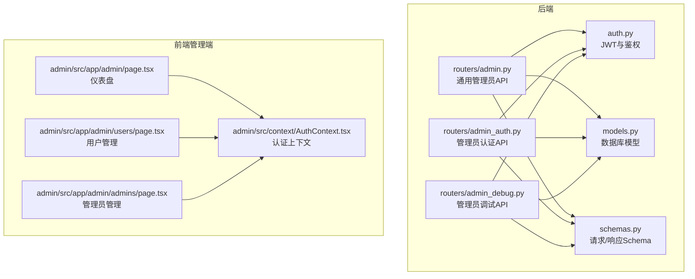
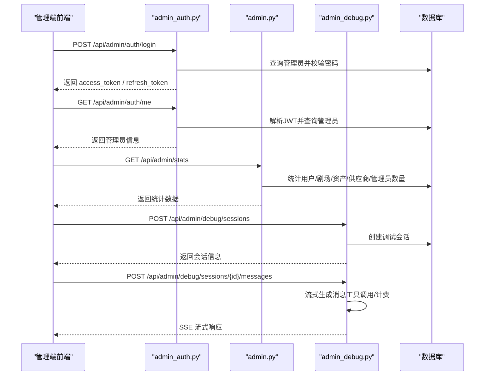
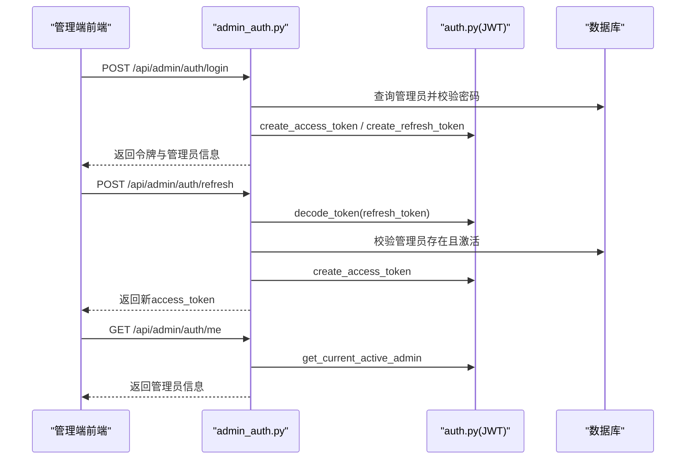
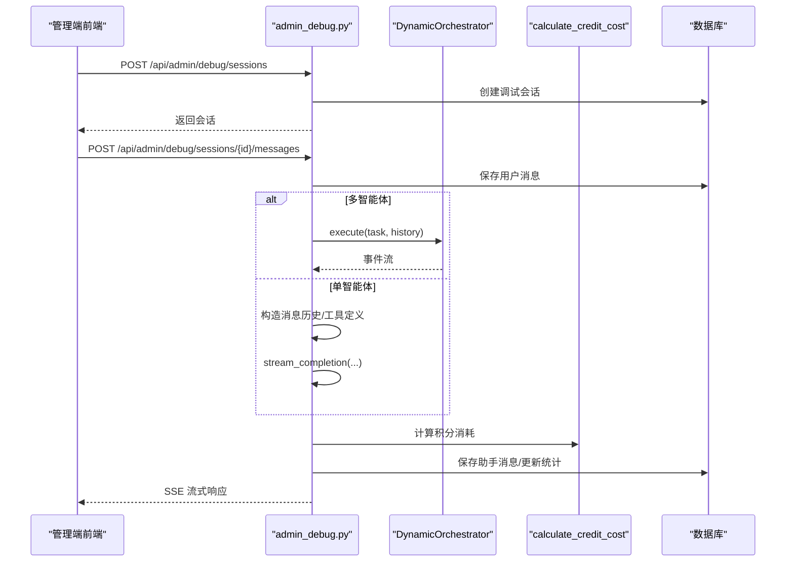
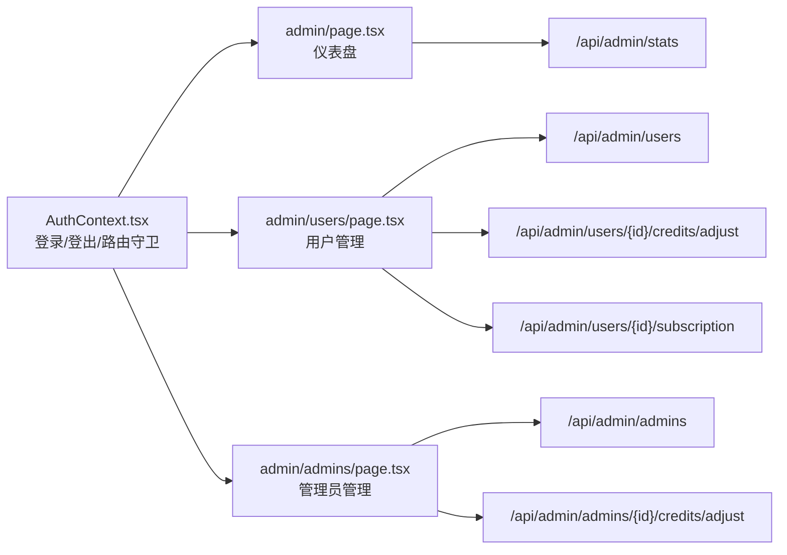
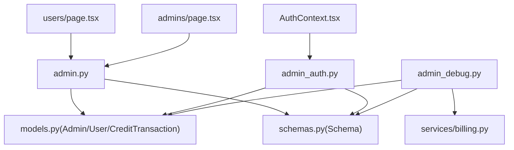

# 管理员路由

<cite>
**本文档引用的文件**
- [backend/routers/admin.py](file://backend/routers/admin.py)
- [backend/routers/admin_auth.py](file://backend/routers/admin_auth.py)
- [backend/routers/admin_debug.py](file://backend/routers/admin_debug.py)
- [backend/auth.py](file://backend/auth.py)
- [backend/models.py](file://backend/models.py)
- [backend/schemas.py](file://backend/schemas.py)
- [backend/admin/src/app/admin/page.tsx](file://backend/admin/src/app/admin/page.tsx)
- [backend/admin/src/context/AuthContext.tsx](file://backend/admin/src/context/AuthContext.tsx)
- [backend/admin/src/app/admin/users/page.tsx](file://backend/admin/src/app/admin/users/page.tsx)
- [backend/admin/src/app/admin/admins/page.tsx](file://backend/admin/src/app/admin/admins/page.tsx)
</cite>

## 目录
1. [简介](#简介)
2. [项目结构](#项目结构)
3. [核心组件](#核心组件)
4. [架构总览](#架构总览)
5. [详细组件分析](#详细组件分析)
6. [依赖分析](#依赖分析)
7. [性能考虑](#性能考虑)
8. [故障排除指南](#故障排除指南)
9. [结论](#结论)
10. [附录](#附录)

## 简介
本文件系统性梳理管理员路由模块的设计与实现，覆盖以下关键领域：
- 管理员功能API：用户管理、订阅与积分管理、管理员自身管理、剧场管理
- 权限验证与审计：JWT令牌体系、管理员鉴权依赖、登录与刷新流程
- 调试与运维：独立管理员调试会话、流式响应、计费与统计
- 管理端UI集成：仪表盘、用户管理、管理员管理页面
- 安全最佳实践：令牌安全、最小权限原则、审计日志与操作记录

## 项目结构
管理员路由模块由后端FastAPI路由、认证与授权、数据库模型与Pydantic Schema构成，并配套Next.js管理端前端页面。

**图表来源**
- [backend/routers/admin.py:1-501](file://backend/routers/admin.py#L1-L501)
- [backend/routers/admin_auth.py:1-136](file://backend/routers/admin_auth.py#L1-L136)
- [backend/routers/admin_debug.py:1-713](file://backend/routers/admin_debug.py#L1-L713)
- [backend/auth.py:1-229](file://backend/auth.py#L1-L229)
- [backend/models.py:1-447](file://backend/models.py#L1-L447)
- [backend/schemas.py:1-859](file://backend/schemas.py#L1-L859)
- [backend/admin/src/app/admin/page.tsx:1-109](file://backend/admin/src/app/admin/page.tsx#L1-L109)
- [backend/admin/src/context/AuthContext.tsx:1-117](file://backend/admin/src/context/AuthContext.tsx#L1-L117)
- [backend/admin/src/app/admin/users/page.tsx:1-450](file://backend/admin/src/app/admin/users/page.tsx#L1-L450)
- [backend/admin/src/app/admin/admins/page.tsx:1-530](file://backend/admin/src/app/admin/admins/page.tsx#L1-L530)

**章节来源**
- [backend/routers/admin.py:1-501](file://backend/routers/admin.py#L1-L501)
- [backend/routers/admin_auth.py:1-136](file://backend/routers/admin_auth.py#L1-L136)
- [backend/routers/admin_debug.py:1-713](file://backend/routers/admin_debug.py#L1-L713)
- [backend/admin/src/app/admin/page.tsx:1-109](file://backend/admin/src/app/admin/page.tsx#L1-L109)
- [backend/admin/src/context/AuthContext.tsx:1-117](file://backend/admin/src/context/AuthContext.tsx#L1-L117)
- [backend/admin/src/app/admin/users/page.tsx:1-450](file://backend/admin/src/app/admin/users/page.tsx#L1-L450)
- [backend/admin/src/app/admin/admins/page.tsx:1-530](file://backend/admin/src/app/admin/admins/page.tsx#L1-L530)

## 核心组件
- 管理员通用API路由：仪表盘统计、用户管理、订阅与积分、管理员自身管理、剧场管理
- 管理员认证路由：登录、刷新令牌、获取当前管理员信息
- 管理员调试路由：独立调试会话、消息流式响应、工具调用、计费与统计
- 认证与授权：JWT令牌签发与解码、管理员鉴权依赖、刷新令牌校验
- 数据模型与Schema：Admin、User、CreditTransaction、Agent、ChatSession等
- 管理端UI：仪表盘、用户管理、管理员管理页面及认证上下文

**章节来源**
- [backend/routers/admin.py:29-501](file://backend/routers/admin.py#L29-L501)
- [backend/routers/admin_auth.py:36-136](file://backend/routers/admin_auth.py#L36-L136)
- [backend/routers/admin_debug.py:113-713](file://backend/routers/admin_debug.py#L113-L713)
- [backend/auth.py:30-156](file://backend/auth.py#L30-L156)
- [backend/models.py:10-447](file://backend/models.py#L10-L447)
- [backend/schemas.py:68-121](file://backend/schemas.py#L68-L121)

## 架构总览
管理员路由模块采用分层架构：
- 路由层：FastAPI路由定义，按功能域划分（通用、认证、调试）
- 鉴权层：JWT令牌解析与管理员身份校验，依赖数据库模型
- 服务层：计费、工具调用、消息流式生成等（在调试路由中体现）
- 数据层：SQLAlchemy模型与事务管理
- 前端层：Next.js管理端页面，通过Axios调用后端API

**图表来源**
- [backend/routers/admin_auth.py:36-136](file://backend/routers/admin_auth.py#L36-L136)
- [backend/routers/admin.py:29-47](file://backend/routers/admin.py#L29-L47)
- [backend/routers/admin_debug.py:113-261](file://backend/routers/admin_debug.py#L113-L261)
- [backend/auth.py:119-156](file://backend/auth.py#L119-L156)

## 详细组件分析

### 管理员通用API（用户、订阅、积分、管理员、剧场）
- 仪表盘统计：获取用户、剧场、资产、供应商、管理员数量
- 用户管理：分页列出用户、获取用户详情、删除用户（级联删除相关数据）
- 积分管理：用户积分调整（充值/扣除）、查看积分历史
- 订阅管理：设置用户订阅、取消订阅、自动发放积分与交易记录
- 管理员管理：列出管理员、创建管理员、获取/更新/删除管理员（禁止删除自己）
- 管理员积分：管理员自身积分调整（充值/扣除）
- 剧场管理：分页列出剧场、按用户过滤

```mermaid
flowchart TD
Start(["管理员请求"]) --> Route{"路由选择"}
Route --> |统计| Stats["GET /api/admin/stats"]
Route --> |用户列表| ListUsers["GET /api/admin/users"]
Route --> |用户详情| GetUser["GET /api/admin/users/{user_id}"]
Route --> |删除用户| DeleteUser["DELETE /api/admin/users/{user_id}"]
Route --> |积分调整| AdjustCredits["POST /api/admin/users/{user_id}/credits/adjust"]
Route --> |积分历史| CreditsHistory["GET /api/admin/users/{user_id}/credits/history"]
Route --> |订阅设置| AssignSub["PUT /api/admin/users/{user_id}/subscription"]
Route --> |取消订阅| CancelSub["DELETE /api/admin/users/{user_id}/subscription"]
Route --> |管理员列表| ListAdmins["GET /api/admin/admins"]
Route --> |创建管理员| CreateAdmin["POST /api/admin/admins"]
Route --> |管理员详情| GetAdmin["GET /api/admin/admins/{admin_id}"]
Route --> |更新管理员| UpdateAdmin["PUT /api/admin/admins/{admin_id}"]
Route --> |删除管理员| DeleteAdmin["DELETE /api/admin/admins/{admin_id}"]
Route --> |管理员积分调整| AdminCredits["POST /api/admin/admins/{admin_id}/credits/adjust"]
Route --> |剧场列表| ListTheaters["GET /api/admin/theaters"]
Stats --> End(["响应"])
ListUsers --> End
GetUser --> End
DeleteUser --> End
AdjustCredits --> End
CreditsHistory --> End
AssignSub --> End
CancelSub --> End
ListAdmins --> End
CreateAdmin --> End
GetAdmin --> End
UpdateAdmin --> End
DeleteAdmin --> End
AdminCredits --> End
ListTheaters --> End
```

**图表来源**
- [backend/routers/admin.py:29-501](file://backend/routers/admin.py#L29-L501)

**章节来源**
- [backend/routers/admin.py:29-501](file://backend/routers/admin.py#L29-L501)

### 管理员认证与权限验证
- 登录：邮箱+密码校验，更新最近登录时间与IP，签发access/refresh令牌
- 刷新：校验refresh token类型与主体类型，重新签发access token
- 当前管理员：获取当前登录管理员信息
- 权限依赖：require_admin确保管理员身份与激活状态

**图表来源**
- [backend/routers/admin_auth.py:36-136](file://backend/routers/admin_auth.py#L36-L136)
- [backend/auth.py:30-156](file://backend/auth.py#L30-L156)

**章节来源**
- [backend/routers/admin_auth.py:36-136](file://backend/routers/admin_auth.py#L36-L136)
- [backend/auth.py:119-156](file://backend/auth.py#L119-L156)

### 管理员调试与运维（独立会话、流式响应、计费）
- 会话管理：创建、列出、获取、删除调试会话
- 消息交互：保存用户消息、流式生成助手消息、多模态内容序列化/反序列化
- 多智能体与单智能体两种模式：动态编排、工具调用、计费统计
- 计费与统计：计算token成本、更新管理员统计、记录交易

**图表来源**
- [backend/routers/admin_debug.py:113-603](file://backend/routers/admin_debug.py#L113-L603)
- [backend/services/billing.py:242-304](file://backend/services/billing.py#L242-L304)

**章节来源**
- [backend/routers/admin_debug.py:113-713](file://backend/routers/admin_debug.py#L113-L713)

### 管理端UI与认证上下文
- 仪表盘：拉取统计并可视化展示
- 用户管理：分页列表、积分调整、订阅设置、删除用户
- 管理员管理：创建/编辑/删除管理员、积分调整
- 认证上下文：本地存储令牌与用户信息、路由守卫、登录/登出

**图表来源**
- [backend/admin/src/context/AuthContext.tsx:39-116](file://backend/admin/src/context/AuthContext.tsx#L39-L116)
- [backend/admin/src/app/admin/page.tsx:12-108](file://backend/admin/src/app/admin/page.tsx#L12-L108)
- [backend/admin/src/app/admin/users/page.tsx:87-449](file://backend/admin/src/app/admin/users/page.tsx#L87-L449)
- [backend/admin/src/app/admin/admins/page.tsx:87-529](file://backend/admin/src/app/admin/admins/page.tsx#L87-L529)

**章节来源**
- [backend/admin/src/context/AuthContext.tsx:1-117](file://backend/admin/src/context/AuthContext.tsx#L1-L117)
- [backend/admin/src/app/admin/page.tsx:1-109](file://backend/admin/src/app/admin/page.tsx#L1-L109)
- [backend/admin/src/app/admin/users/page.tsx:1-450](file://backend/admin/src/app/admin/users/page.tsx#L1-L450)
- [backend/admin/src/app/admin/admins/page.tsx:1-530](file://backend/admin/src/app/admin/admins/page.tsx#L1-L530)

## 依赖分析
- 路由依赖：admin.py依赖require_admin进行管理员鉴权；admin_auth.py依赖JWT工具与管理员模型；admin_debug.py依赖工具链与计费服务
- 数据模型：Admin、User、CreditTransaction、Agent、ChatSession等
- 前后端交互：前端通过Axios调用后端API，后端通过依赖注入获取数据库会话

**图表来源**
- [backend/routers/admin.py:1-17](file://backend/routers/admin.py#L1-L17)
- [backend/routers/admin_auth.py:1-25](file://backend/routers/admin_auth.py#L1-L25)
- [backend/routers/admin_debug.py:1-38](file://backend/routers/admin_debug.py#L1-L38)
- [backend/models.py:10-447](file://backend/models.py#L10-L447)
- [backend/schemas.py:68-121](file://backend/schemas.py#L68-L121)
- [backend/admin/src/context/AuthContext.tsx:1-117](file://backend/admin/src/context/AuthContext.tsx#L1-L117)
- [backend/admin/src/app/admin/users/page.tsx:1-450](file://backend/admin/src/app/admin/users/page.tsx#L1-L450)
- [backend/admin/src/app/admin/admins/page.tsx:1-530](file://backend/admin/src/app/admin/admins/page.tsx#L1-L530)

**章节来源**
- [backend/routers/admin.py:1-17](file://backend/routers/admin.py#L1-L17)
- [backend/routers/admin_auth.py:1-25](file://backend/routers/admin_auth.py#L1-L25)
- [backend/routers/admin_debug.py:1-38](file://backend/routers/admin_debug.py#L1-L38)
- [backend/models.py:10-447](file://backend/models.py#L10-L447)
- [backend/schemas.py:68-121](file://backend/schemas.py#L68-L121)
- [backend/admin/src/context/AuthContext.tsx:1-117](file://backend/admin/src/context/AuthContext.tsx#L1-L117)

## 性能考虑
- 分页与限制：用户与管理员列表默认限制每页50条，避免一次性加载过多数据
- 统计查询：仪表盘统计使用聚合查询，减少往返次数
- 流式响应：调试消息采用Server-Sent Events，降低内存占用
- 计费与事务：调试计费在会话保存后进行，避免重复计算
- 建议：对高频查询增加索引（如用户/管理员创建时间、订阅状态），缓存静态配置，合理设置令牌过期时间

[本节为通用指导，无需具体文件来源]

## 故障排除指南
- 认证失败
  - 现象：登录返回401或403
  - 排查：检查邮箱是否存在、密码是否正确、管理员是否激活
  - 参考：[登录流程:36-91](file://backend/routers/admin_auth.py#L36-L91)
- 令牌无效或过期
  - 现象：调用受保护接口返回401
  - 排查：使用refresh接口刷新access token，确认JWT密钥与算法配置
  - 参考：[刷新令牌:93-127](file://backend/routers/admin_auth.py#L93-L127)
- 管理员权限不足
  - 现象：调用admin路由返回401/403
  - 排查：确认令牌subject_type为"admin"，管理员账户激活
  - 参考：[管理员鉴权依赖:119-156](file://backend/auth.py#L119-L156)
- 删除用户失败
  - 现象：删除用户报错或未删除
  - 排查：确认用户存在、检查级联删除逻辑
  - 参考：[删除用户:116-135](file://backend/routers/admin.py#L116-L135)
- 调试会话异常
  - 现象：无法创建/获取/删除会话或消息流中断
  - 排查：检查会话归属管理员、智能体可用性、工具调用结果
  - 参考：[调试会话:113-171](file://backend/routers/admin_debug.py#L113-L171)

**章节来源**
- [backend/routers/admin_auth.py:36-127](file://backend/routers/admin_auth.py#L36-L127)
- [backend/auth.py:119-156](file://backend/auth.py#L119-L156)
- [backend/routers/admin.py:116-135](file://backend/routers/admin.py#L116-L135)
- [backend/routers/admin_debug.py:113-171](file://backend/routers/admin_debug.py#L113-L171)

## 结论
管理员路由模块以清晰的分层设计实现了用户管理、订阅与积分、管理员自身管理、剧场管理以及独立调试能力。配合JWT鉴权与前端认证上下文，形成完整的管理端生态。建议在生产环境中强化令牌安全策略、完善审计日志与监控告警，并持续优化查询性能与用户体验。

[本节为总结，无需具体文件来源]

## 附录

### 管理员端点一览（按功能域）
- 通用管理
  - GET /api/admin/stats：获取仪表盘统计
  - GET /api/admin/users：分页列出用户
  - GET /api/admin/users/{user_id}：获取用户详情
  - DELETE /api/admin/users/{user_id}：删除用户
  - POST /api/admin/users/{user_id}/credits/adjust：用户积分调整
  - GET /api/admin/users/{user_id}/credits/history：用户积分历史
  - PUT /api/admin/users/{user_id}/subscription：设置用户订阅
  - DELETE /api/admin/users/{user_id}/subscription：取消用户订阅
  - GET /api/admin/admins：列出管理员
  - POST /api/admin/admins：创建管理员
  - GET /api/admin/admins/{admin_id}：管理员详情
  - PUT /api/admin/admins/{admin_id}：更新管理员
  - DELETE /api/admin/admins/{admin_id}：删除管理员
  - POST /api/admin/admins/{admin_id}/credits/adjust：管理员积分调整
  - GET /api/admin/theaters：列出剧场
- 管理员认证
  - POST /api/admin/auth/login：管理员登录
  - POST /api/admin/auth/refresh：刷新令牌
  - GET /api/admin/auth/me：当前管理员信息
- 管理员调试
  - POST /api/admin/debug/sessions：创建调试会话
  - GET /api/admin/debug/sessions：列出调试会话
  - GET /api/admin/debug/sessions/{session_id}：获取调试会话
  - GET /api/admin/debug/sessions/{session_id}/messages：获取消息列表
  - POST /api/admin/debug/sessions/{session_id}/messages：发送消息并流式响应
  - DELETE /api/admin/debug/sessions/{session_id}：删除调试会话

**章节来源**
- [backend/routers/admin.py:29-501](file://backend/routers/admin.py#L29-L501)
- [backend/routers/admin_auth.py:36-136](file://backend/routers/admin_auth.py#L36-L136)
- [backend/routers/admin_debug.py:113-713](file://backend/routers/admin_debug.py#L113-L713)

### 安全最佳实践
- 令牌安全
  - 使用强JWT密钥与安全算法
  - 合理设置access/refresh过期时间
  - 仅在HTTPS环境下传输令牌
- 最小权限
  - 严格使用require_admin依赖
  - 禁止管理员删除自己
- 审计与日志
  - 记录管理员登录、操作、积分调整、订阅变更
  - 对高风险操作（删除用户、调整大额积分）增加二次确认与审计
- 输入校验
  - 使用Pydantic Schema进行请求参数校验
  - 对敏感字段（密码）进行哈希存储

[本节为通用指导，无需具体文件来源]