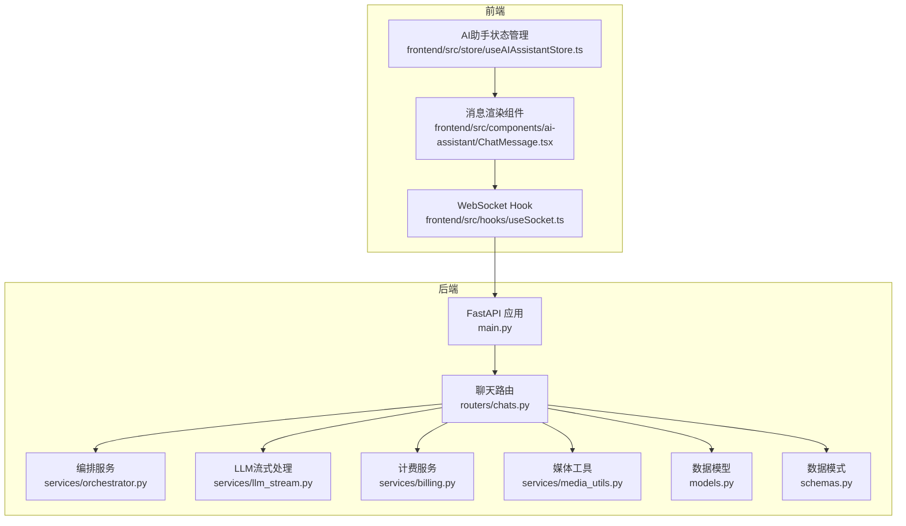
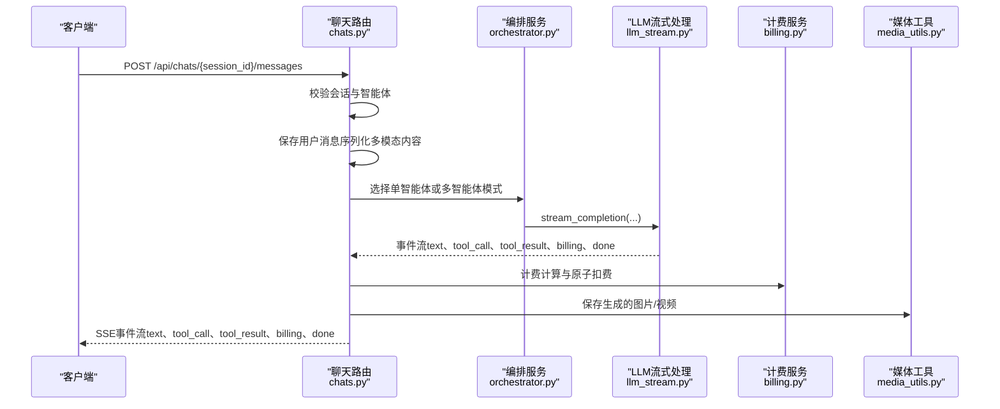
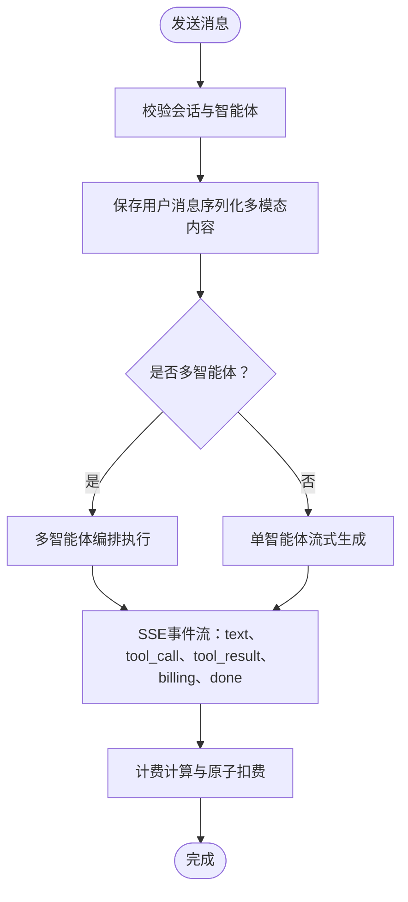
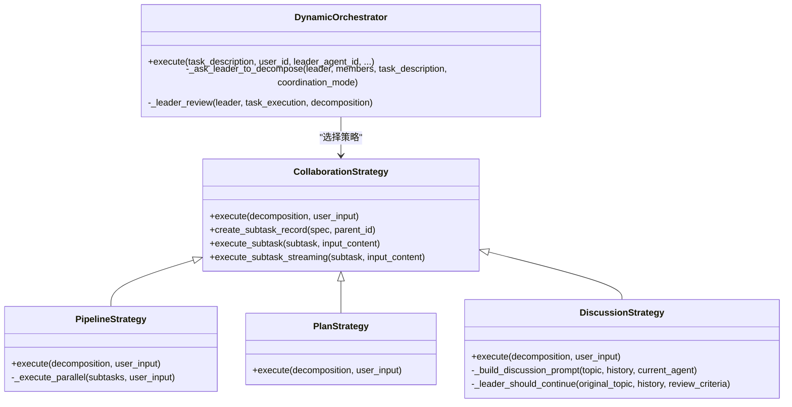
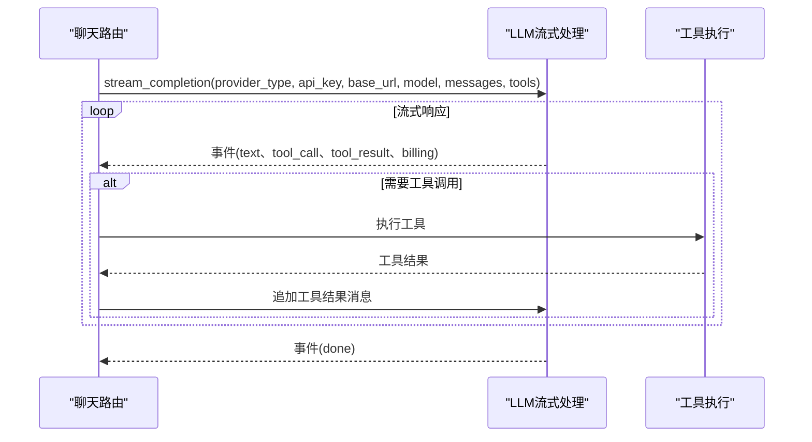
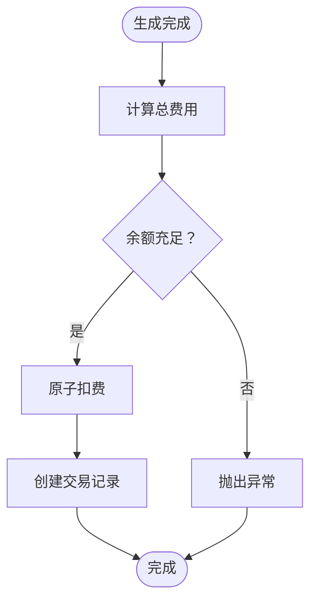
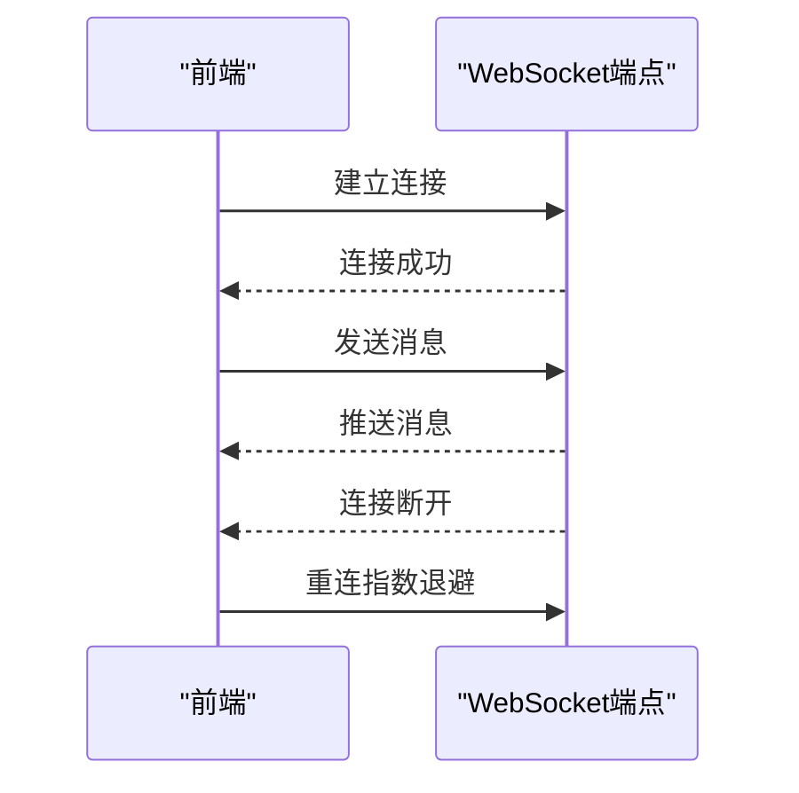
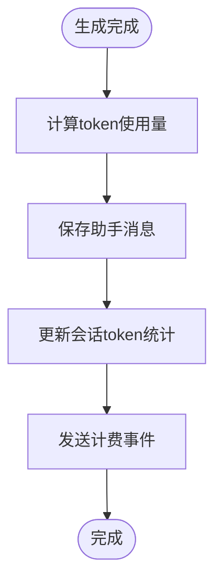
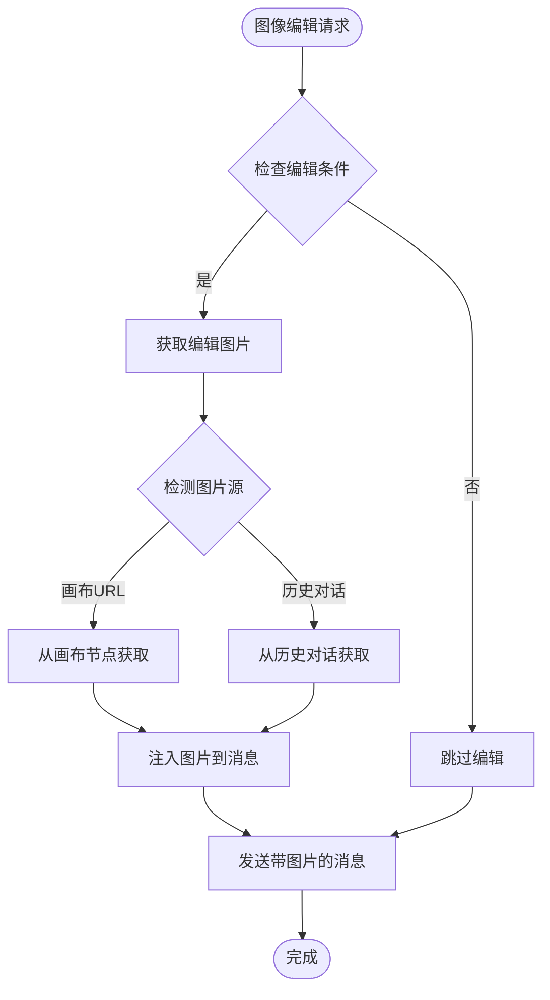
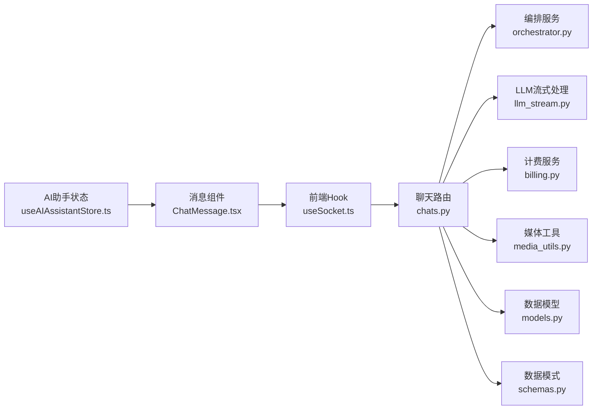

# 聊天对话路由

<cite>
**本文引用的文件**
- [chats.py](file://backend/routers/chats.py)
- [orchestrator.py](file://backend/services/orchestrator.py)
- [models.py](file://backend/models.py)
- [schemas.py](file://backend/schemas.py)
- [llm_stream.py](file://backend/services/llm_stream.py)
- [billing.py](file://backend/services/billing.py)
- [media_utils.py](file://backend/services/media_utils.py)
- [main.py](file://backend/main.py)
- [useSocket.ts](file://frontend/src/hooks/useSocket.ts)
- [ChatMessage.tsx](file://frontend/src/components/ai-assistant/ChatMessage.tsx)
- [useAIAssistantStore.ts](file://frontend/src/store/useAIAssistantStore.ts)
</cite>

## 更新摘要
**变更内容**
- 增强多智能体消息保存功能，支持token使用参数处理
- 新增图像编辑上下文注入功能，支持从画布节点和历史对话中获取编辑图片
- 完善token使用统计和累计机制
- 优化计费系统中的token使用参数处理

## 目录
1. [简介](#简介)
2. [项目结构](#项目结构)
3. [核心组件](#核心组件)
4. [架构概览](#架构概览)
5. [详细组件分析](#详细组件分析)
6. [依赖关系分析](#依赖关系分析)
7. [性能考虑](#性能考虑)
8. [故障排查指南](#故障排查指南)
9. [结论](#结论)

## 简介
本文件面向"聊天对话路由"模块，系统性阐述实时聊天消息的API设计与实现，涵盖消息发送、接收与历史查询；WebSocket连接的建立与维护机制；聊天会话的状态管理（创建、参与者与权限控制）；以及完整的聊天API接口说明（消息格式、事件类型与实时通信协议）。文档同时提供实际API调用示例与实时通信最佳实践，帮助开发者快速理解并正确集成。

## 项目结构
聊天对话路由位于后端FastAPI应用中，主要由以下层次构成：
- 路由层：负责HTTP接口定义与请求参数校验
- 服务层：负责多智能体编排、LLM流式处理、计费与媒体处理
- 模型层：负责数据库表结构与关系
- 前端集成：负责WebSocket连接与消息渲染

图表来源
- [main.py:160-171](file://backend/main.py#L160-L171)
- [chats.py:93-97](file://backend/routers/chats.py#L93-L97)
- [orchestrator.py:560-673](file://backend/services/orchestrator.py#L560-L673)
- [llm_stream.py:58-68](file://backend/services/llm_stream.py#L58-L68)
- [billing.py:310-350](file://backend/services/billing.py#L310-L350)
- [media_utils.py:20-28](file://backend/services/media_utils.py#L20-L28)
- [models.py:172-194](file://backend/models.py#L172-L194)
- [schemas.py:354-392](file://backend/schemas.py#L354-L392)
- [useSocket.ts:3-42](file://frontend/src/hooks/useSocket.ts#L3-L42)
- [ChatMessage.tsx:52-125](file://frontend/src/components/ai-assistant/ChatMessage.tsx#L52-L125)
- [useAIAssistantStore.ts:104-147](file://frontend/src/store/useAIAssistantStore.ts#L104-L147)

章节来源
- [main.py:110-174](file://backend/main.py#L110-L174)
- [chats.py:93-97](file://backend/routers/chats.py#L93-L97)

## 核心组件
- 聊天路由模块：提供会话创建、查询、消息发送与历史查询等接口，支持多模态消息与工具调用
- 多智能体编排器：支持流水线、计划与讨论三种协作模式，动态任务分解与执行
- LLM流式处理：统一供应商抽象，支持OpenAI、Anthropic、Gemini、xAI等，提供工具调用与推理模式
- 计费系统：基于积分的精细化计费，支持文本、图像、搜索与视频等多维度计费
- 媒体工具：图片与视频的本地存储与URL生成
- WebSocket：前端实时连接，用于推送系统消息（当前示例为占位）

章节来源
- [chats.py:100-258](file://backend/routers/chats.py#L100-L258)
- [orchestrator.py:560-673](file://backend/services/orchestrator.py#L560-L673)
- [llm_stream.py:58-68](file://backend/services/llm_stream.py#L58-L68)
- [billing.py:310-350](file://backend/services/billing.py#L310-L350)
- [media_utils.py:20-28](file://backend/services/media_utils.py#L20-L28)
- [useSocket.ts:3-42](file://frontend/src/hooks/useSocket.ts#L3-L42)

## 架构概览
聊天对话路由采用"HTTP + SSE + WebSocket"的混合实时通信架构：
- HTTP接口：会话管理与消息历史查询
- SSE流：消息发送接口返回Server-Sent Events，前端逐字流式接收
- WebSocket：用于系统级消息推送（当前示例为占位，可扩展为实时状态推送）

图表来源
- [chats.py:202-258](file://backend/routers/chats.py#L202-L258)
- [chats.py:442-762](file://backend/routers/chats.py#L442-L762)
- [orchestrator.py:570-673](file://backend/services/orchestrator.py#L570-L673)
- [llm_stream.py:58-68](file://backend/services/llm_stream.py#L58-L68)
- [billing.py:310-350](file://backend/services/billing.py#L310-L350)
- [media_utils.py:20-28](file://backend/services/media_utils.py#L20-L28)

## 详细组件分析

### 聊天路由模块（HTTP接口）
- 会话管理
  - 创建会话：POST /api/chats
  - 列出会话：GET /api/chats
  - 获取会话详情：GET /api/chats/{session_id}
  - 清空会话消息：DELETE /api/chats/{session_id}/messages
  - 删除会话：DELETE /api/chats/{session_id}
- 消息管理
  - 发送消息：POST /api/chats/{session_id}/messages（返回SSE流）
  - 获取历史消息：GET /api/chats/{session_id}/messages
- 权限与作用域
  - 使用scoped_query按用户或管理员权限过滤会话
  - 支持管理员调试会话与普通用户会话隔离

图表来源
- [chats.py:202-258](file://backend/routers/chats.py#L202-L258)
- [chats.py:261-343](file://backend/routers/chats.py#L261-L343)
- [chats.py:442-762](file://backend/routers/chats.py#L442-L762)

章节来源
- [chats.py:100-258](file://backend/routers/chats.py#L100-L258)
- [chats.py:160-199](file://backend/routers/chats.py#L160-L199)

### 多智能体编排器
- 协作策略
  - Pipeline：流水线（串行/并行）
  - Plan：计划（依赖图，可并行同层）
  - Discussion：多轮讨论，Leader主导
- 事件流
  - subtask_created、subtask_started、subtask_chunk、subtask_completed、subtask_failed
  - pipeline_completed、plan_completed、discussion_started、discussion_completed、task_completed、task_failed
- 任务分解
  - 基于Leader智能体的系统提示词，将任务分解为子任务并分配给成员智能体

图表来源
- [orchestrator.py:82-108](file://backend/services/orchestrator.py#L82-L108)
- [orchestrator.py:254-318](file://backend/services/orchestrator.py#L254-L318)
- [orchestrator.py:325-406](file://backend/services/orchestrator.py#L325-L406)
- [orchestrator.py:413-530](file://backend/services/orchestrator.py#L413-L530)
- [orchestrator.py:560-673](file://backend/services/orchestrator.py#L560-L673)

章节来源
- [orchestrator.py:560-673](file://backend/services/orchestrator.py#L560-L673)

### LLM流式处理与工具调用
- 供应商抽象
  - 注册表模式：统一处理OpenAI、Azure、Anthropic、Minimax、Gemini、xAI等
  - 支持推理模式（thinking mode）、工具调用（tool calling）
- 多模态消息
  - 支持文本与图片（data URL）混合消息
  - 图像生成与编辑（xAI）
- 事件类型
  - text：增量文本
  - tool_call/tool_result：工具调用开始/结束
  - billing：计费信息
  - done：生成完成

图表来源
- [llm_stream.py:58-68](file://backend/services/llm_stream.py#L58-L68)
- [chats.py:557-635](file://backend/routers/chats.py#L557-L635)

章节来源
- [llm_stream.py:58-68](file://backend/services/llm_stream.py#L58-L68)
- [chats.py:557-635](file://backend/routers/chats.py#L557-L635)

### 计费系统
- 计费维度
  - 输入tokens、文本输出tokens、图像输出tokens、搜索查询、图像生成（xAI按张计费）
- 原子扣费
  - 使用UPDATE ... WHERE ...确保并发安全，失败时抛出余额不足或冻结异常
- 交易记录
  - 记录余额前后、类型、元数据（包含各维度用量与费率）

图表来源
- [billing.py:310-350](file://backend/services/billing.py#L310-L350)
- [billing.py:178-308](file://backend/services/billing.py#L178-L308)

章节来源
- [billing.py:310-350](file://backend/services/billing.py#L310-L350)
- [billing.py:178-308](file://backend/services/billing.py#L178-L308)

### 媒体工具与图片桥接
- 图片保存
  - inline data保存与远端URL下载
- 图片注入
  - 将图片data URL注入到用户消息content，支持多模态消息
- 画布桥接
  - 图像生成后自动创建/更新画布节点（当启用目标节点类型与图像生成）

章节来源
- [media_utils.py:20-28](file://backend/services/media_utils.py#L20-L28)
- [chats.py:49-64](file://backend/routers/chats.py#L49-L64)
- [chats.py:82-91](file://backend/routers/chats.py#L82-L91)
- [chats.py:736-762](file://backend/routers/chats.py#L736-L762)

### WebSocket连接与维护
- 连接建立
  - 后端提供WebSocket端点，前端通过useSocket hook建立连接
- 连接状态
  - 简单的onopen/onmessage/onclose处理，当前示例为占位
- 错误重连策略
  - 前端可基于readyState与定时器实现指数退避重连
  - 建议在应用层封装统一的重连与心跳机制

图表来源
- [main.py:160-171](file://backend/main.py#L160-L171)
- [useSocket.ts:3-42](file://frontend/src/hooks/useSocket.ts#L3-L42)

章节来源
- [main.py:160-171](file://backend/main.py#L160-L171)
- [useSocket.ts:3-42](file://frontend/src/hooks/useSocket.ts#L3-L42)

### 聊天会话状态管理
- 会话创建
  - 保存title、agent_id、user_id、theater_id
- 参与者管理
  - 支持用户与管理员两类主体，权限通过scoped_query过滤
- 权限控制
  - 会话查询与删除均需校验归属关系
  - 管理员调试会话与普通会话隔离

章节来源
- [models.py:172-183](file://backend/models.py#L172-L183)
- [chats.py:100-120](file://backend/routers/chats.py#L100-L120)
- [chats.py:123-143](file://backend/routers/chats.py#L123-L143)
- [chats.py:146-157](file://backend/routers/chats.py#L146-L157)
- [chats.py:789-800](file://backend/routers/chats.py#L789-L800)

### 增强的token使用参数处理

**更新** 新增对token使用参数的增强处理，包括多智能体消息保存时的token累计机制

- 多智能体消息保存
  - `_save_multi_agent_message`函数现在支持`tokens_used`参数，用于累计token使用量
  - 在保存助手消息的同时更新会话的`total_tokens_used`字段
- 单智能体消息保存
  - 在`_generate_single_agent`函数中，保存助手消息时累计`input_tokens + output_tokens`
  - 更新会话的`total_tokens_used`字段，确保token使用统计的准确性
- 计费事件
  - 发送`billing`事件时包含累计token使用量和上下文窗口信息
  - 支持实时显示token使用情况和剩余配额

图表来源
- [chats.py:302-322](file://backend/routers/chats.py#L302-L322)
- [chats.py:754-760](file://backend/routers/chats.py#L754-L760)
- [chats.py:790-796](file://backend/routers/chats.py#L790-L796)
- [chats.py:829-835](file://backend/routers/chats.py#L829-L835)

章节来源
- [chats.py:302-322](file://backend/routers/chats.py#L302-L322)
- [chats.py:754-760](file://backend/routers/chats.py#L754-L760)
- [chats.py:790-796](file://backend/routers/chats.py#L790-L796)
- [chats.py:829-835](file://backend/routers/chats.py#L829-L835)

### 图像编辑上下文注入功能

**更新** 新增图像编辑上下文注入功能，支持从画布节点和历史对话中获取编辑图片

- 图像编辑检测
  - 根据供应商类型判断是否启用图像编辑功能
  - 支持Gemini和xAI供应商的图像生成配置
- 图像源选择
  - 优先使用画布节点提供的`edit_image_url`
  - 回退到历史对话中的最后一张图片
- 图像注入
  - 将图片data URL注入到最后一条用户消息
  - 支持多模态消息格式（text + image_url）
- 前端集成
  - 前端状态管理支持`imageEditContext`字段
  - 支持清理图像编辑上下文

图表来源
- [chats.py:582-605](file://backend/routers/chats.py#L582-L605)
- [chats.py:358-392](file://backend/routers/chats.py#L358-L392)
- [useAIAssistantStore.ts:106-147](file://frontend/src/store/useAIAssistantStore.ts#L106-L147)

章节来源
- [chats.py:582-605](file://backend/routers/chats.py#L582-L605)
- [chats.py:358-392](file://backend/routers/chats.py#L358-L392)
- [useAIAssistantStore.ts:106-147](file://frontend/src/store/useAIAssistantStore.ts#L106-L147)

## 依赖关系分析
- 路由依赖服务层：编排器、LLM流式处理、计费与媒体工具
- 服务层依赖模型层：数据库表结构与关系
- 前端依赖后端：WebSocket连接与SSE事件流

图表来源
- [chats.py:93-97](file://backend/routers/chats.py#L93-L97)
- [orchestrator.py:560-673](file://backend/services/orchestrator.py#L560-L673)
- [llm_stream.py:58-68](file://backend/services/llm_stream.py#L58-L68)
- [billing.py:310-350](file://backend/services/billing.py#L310-L350)
- [media_utils.py:20-28](file://backend/services/media_utils.py#L20-L28)
- [models.py:172-194](file://backend/models.py#L172-L194)
- [schemas.py:354-392](file://backend/schemas.py#L354-L392)
- [useSocket.ts:3-42](file://frontend/src/hooks/useSocket.ts#L3-L42)
- [ChatMessage.tsx:52-125](file://frontend/src/components/ai-assistant/ChatMessage.tsx#L52-L125)
- [useAIAssistantStore.ts:104-147](file://frontend/src/store/useAIAssistantStore.ts#L104-L147)

章节来源
- [chats.py:93-97](file://backend/routers/chats.py#L93-L97)
- [models.py:172-194](file://backend/models.py#L172-L194)
- [schemas.py:354-392](file://backend/schemas.py#L354-L392)

## 性能考虑
- SSE流式输出
  - 使用StreamingResponse与text/event-stream，逐字节推送，降低首字节延迟
- 工具调用循环
  - 最大轮次限制（MAX_TOOL_ROUNDS），避免无限循环
- 计费与数据库
  - 原子扣费与事务提交，确保一致性
- 媒体处理
  - 异步下载与保存，避免阻塞主流程
- WebSocket
  - 建议实现心跳与指数退避重连，提升稳定性
- token使用统计
  - 实时累计token使用量，避免重复计算
  - 优化数据库更新操作，减少写入压力

## 故障排查指南
- 余额不足
  - 现象：发送消息时报错"积分余额不足"
  - 处理：检查用户/管理员余额与冻结状态，充值后重试
- 供应商不可用
  - 现象：返回"Error: Agent provider is not available"
  - 处理：检查智能体关联的LLM供应商状态
- 工具调用失败
  - 现象：tool_call事件后无tool_result
  - 处理：检查工具定义与参数，确认工具可用性
- 计费异常
  - 现象：billing事件缺失或余额未变化
  - 处理：核对计费维度与费率配置，检查原子扣费是否成功
- 图像编辑失败
  - 现象：图像编辑上下文注入失败
  - 处理：检查图片URL格式，确认文件存在，验证供应商配置

章节来源
- [chats.py:466-468](file://backend/routers/chats.py#L466-L468)
- [billing.py:178-308](file://backend/services/billing.py#L178-L308)

## 结论
聊天对话路由模块通过HTTP接口与SSE流实现了高效的实时聊天体验，结合多智能体编排与工具调用，支持复杂的多模态交互。计费系统确保消费透明可控，媒体工具保障生成内容的持久化与可访问性。WebSocket作为可扩展的系统消息通道，为后续推送与状态同步提供了基础。

**新增功能增强了系统的实用性和用户体验**：
- 增强的token使用参数处理确保了准确的使用统计和计费
- 图像编辑上下文注入功能提供了更灵活的图像编辑能力
- 完善的错误处理和状态管理提升了系统的稳定性

整体架构清晰、模块职责明确，适合进一步扩展与集成。