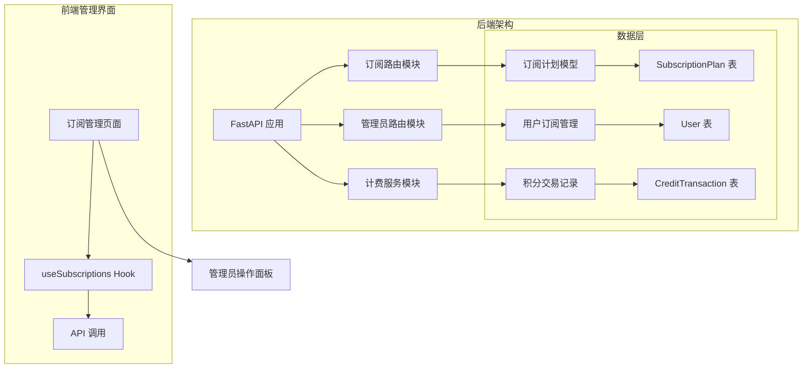
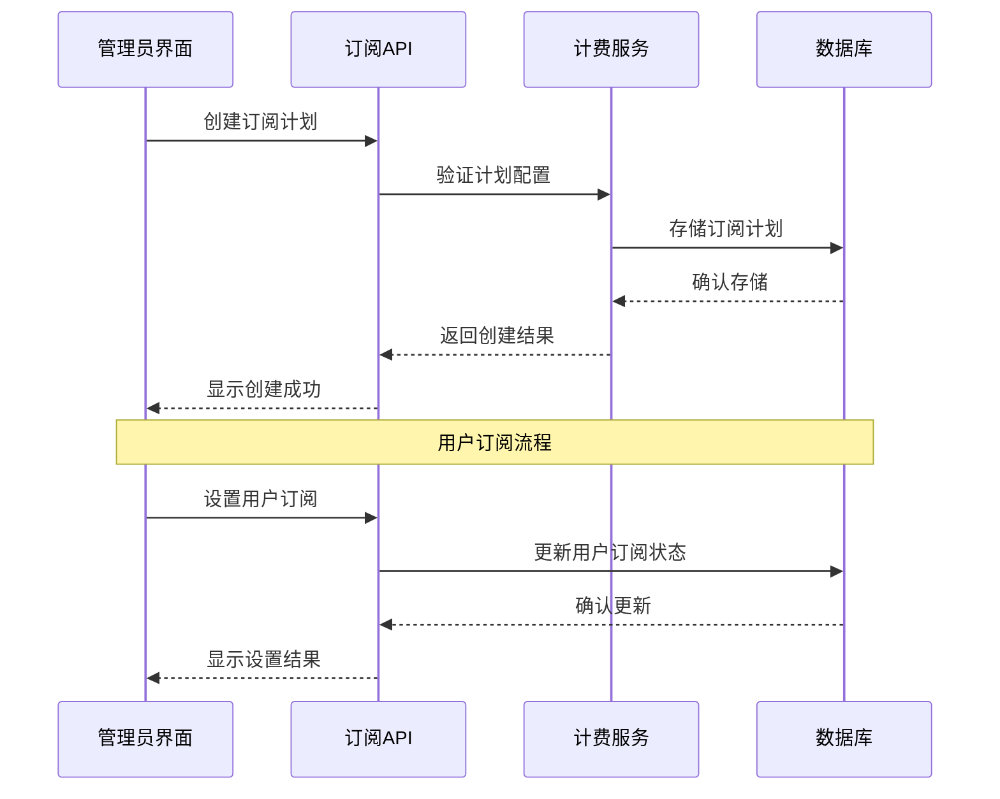
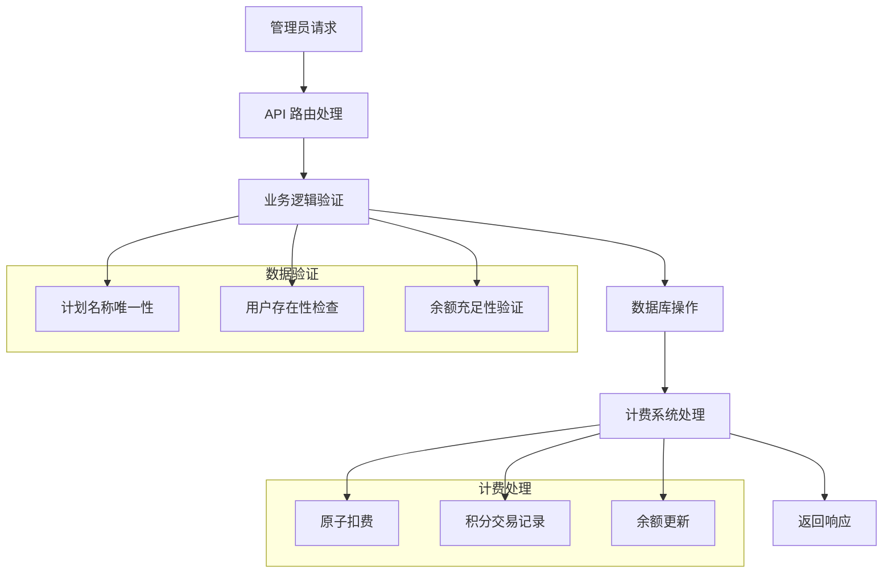
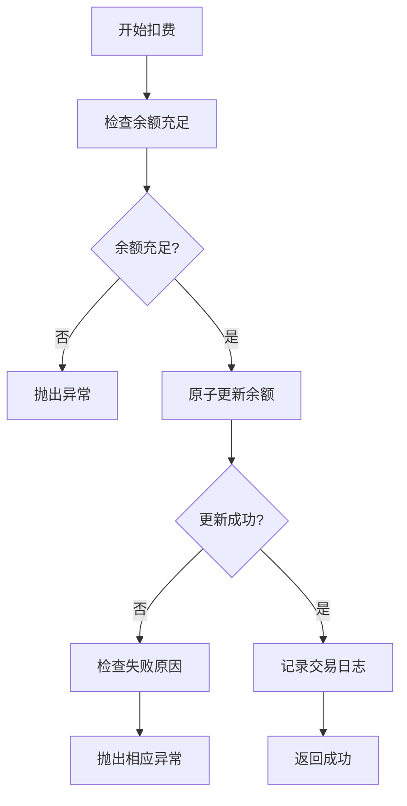
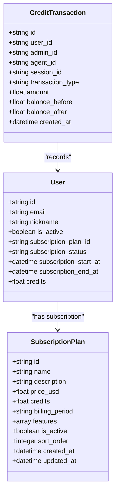
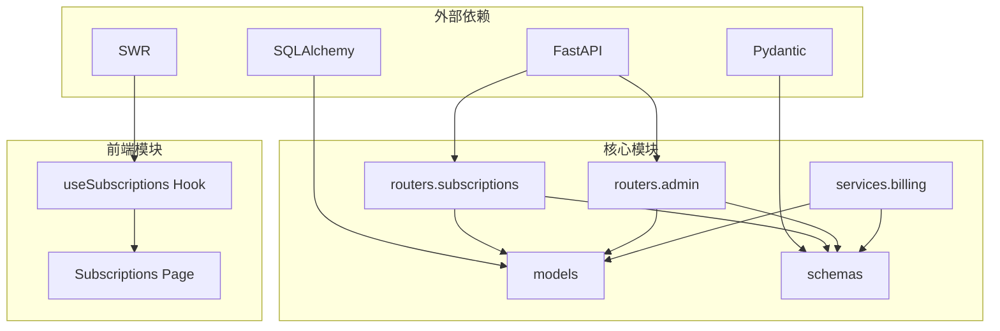
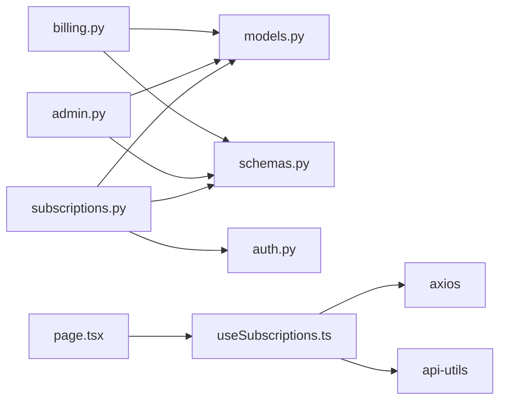

# 订阅管理路由

<cite>
**本文档引用的文件**
- [subscriptions.py](file://backend/routers/subscriptions.py)
- [admin.py](file://backend/routers/admin.py)
- [billing.py](file://backend/services/billing.py)
- [models.py](file://backend/models.py)
- [schemas.py](file://backend/schemas.py)
- [main.py](file://backend/main.py)
- [page.tsx](file://backend/admin/src/app/admin/subscriptions/page.tsx)
- [useSubscriptions.ts](file://backend/admin/src/hooks/useSubscriptions.ts)
- [BILLING_REVIEW.md](file://backend/docs/BILLING_REVIEW.md)
</cite>

## 目录
1. [简介](#简介)
2. [项目结构](#项目结构)
3. [核心组件](#核心组件)
4. [架构概览](#架构概览)
5. [详细组件分析](#详细组件分析)
6. [依赖关系分析](#依赖关系分析)
7. [性能考虑](#性能考虑)
8. [故障排除指南](#故障排除指南)
9. [结论](#结论)
10. [附录](#附录)

## 简介

订阅管理路由模块是 Infinite Game 项目中负责处理用户订阅计划管理的核心模块。该模块实现了完整的订阅生命周期管理，包括订阅计划的创建、查询、更新、删除，以及用户订阅状态的管理。

本模块采用 FastAPI 构建，提供了 RESTful API 接口，支持管理员对订阅计划进行全生命周期管理。同时集成了积分计费系统，实现了自动续费、退款处理和余额管理等功能。

## 项目结构

订阅管理模块主要由以下几个部分组成：



**图表来源**
- [main.py:138-152](file://backend/main.py#L138-L152)
- [subscriptions.py:14-18](file://backend/routers/subscriptions.py#L14-L18)

**章节来源**
- [main.py:138-152](file://backend/main.py#L138-L152)
- [subscriptions.py:14-18](file://backend/routers/subscriptions.py#L14-L18)

## 核心组件

### 订阅计划管理模块

订阅计划管理模块提供了完整的 CRUD 操作接口，支持管理员对订阅套餐进行管理：

| 组件 | 功能描述 | 端点 |
|------|----------|------|
| 订阅计划创建 | 创建新的订阅套餐 | POST `/api/admin/subscriptions` |
| 订阅计划列表 | 获取所有订阅套餐列表 | GET `/api/admin/subscriptions` |
| 订阅计划详情 | 获取特定订阅套餐详情 | GET `/api/admin/subscriptions/{plan_id}` |
| 订阅计划更新 | 更新现有订阅套餐信息 | PUT `/api/admin/subscriptions/{plan_id}` |
| 订阅计划删除 | 删除订阅套餐 | DELETE `/api/admin/subscriptions/{plan_id}` |

### 用户订阅管理模块

用户订阅管理模块负责处理用户订阅状态的变更：

| 组件 | 功能描述 | 端点 |
|------|----------|------|
| 设置用户订阅 | 为用户分配订阅套餐 | PUT `/api/admin/users/{user_id}/subscription` |
| 取消用户订阅 | 取消用户的订阅状态 | DELETE `/api/admin/users/{user_id}/subscription` |

### 积分计费系统

积分计费系统提供了原子化的扣费和退款机制：

| 组件 | 功能描述 | 方法 |
|------|----------|------|
| 余额检查 | 检查用户余额是否充足 | `check_balance_sufficient()` |
| 原子扣费 | 安全地扣除用户积分 | `deduct_credits_atomic()` |
| 原子退款 | 安全地退还用户积分 | `refund_credits_atomic()` |
| 成本计算 | 计算任务消耗的积分 | `calculate_credit_cost()` |

**章节来源**
- [subscriptions.py:21-118](file://backend/routers/subscriptions.py#L21-L118)
- [admin.py:230-301](file://backend/routers/admin.py#L230-L301)
- [billing.py:45-308](file://backend/services/billing.py#L45-L308)

## 架构概览

订阅管理模块采用分层架构设计，确保了良好的可维护性和扩展性：



**图表来源**
- [subscriptions.py:21-37](file://backend/routers/subscriptions.py#L21-L37)
- [admin.py:230-279](file://backend/routers/admin.py#L230-L279)

### 数据流架构



**图表来源**
- [billing.py:178-308](file://backend/services/billing.py#L178-L308)
- [admin.py:240-279](file://backend/routers/admin.py#L240-L279)

## 详细组件分析

### 订阅计划管理 API

#### 订阅计划创建接口

订阅计划创建接口提供了完整的订阅套餐创建功能：

**请求格式**
```json
{
  "name": "string",
  "description": "string",
  "price_usd": 0,
  "credits": 0,
  "billing_period": "monthly|yearly|lifetime",
  "features": ["string"],
  "is_active": true,
  "sort_order": 0
}
```

**响应结构**
```json
{
  "id": "string",
  "name": "string",
  "description": "string",
  "price_usd": 0,
  "credits": 0,
  "billing_period": "monthly|yearly|lifetime",
  "features": ["string"],
  "is_active": true,
  "sort_order": 0,
  "created_at": "string",
  "updated_at": "string"
}
```

#### 订阅计划更新接口

订阅计划更新接口支持部分字段更新：

**请求格式**
```json
{
  "name": "string",
  "description": "string",
  "price_usd": 0,
  "credits": 0,
  "billing_period": "monthly|yearly|lifetime",
  "features": ["string"],
  "is_active": true,
  "sort_order": 0
}
```

**章节来源**
- [subscriptions.py:21-118](file://backend/routers/subscriptions.py#L21-L118)
- [schemas.py:481-512](file://backend/schemas.py#L481-L512)

### 用户订阅管理 API

#### 设置用户订阅接口

设置用户订阅接口实现了订阅状态的自动化管理：

**请求格式**
```json
{
  "plan_id": "string",
  "start_at": "datetime",
  "end_at": "datetime",
  "auto_grant_credits": true
}
```

**响应结构**
```json
{
  "ok": true,
  "plan_id": "string",
  "plan_name": "string",
  "credits_granted": 0,
  "subscription_status": "active"
}
```

#### 取消用户订阅接口

取消用户订阅接口提供了简单的订阅终止功能：

**响应结构**
```json
{
  "ok": true
}
```

**章节来源**
- [admin.py:230-301](file://backend/routers/admin.py#L230-L301)

### 计费系统组件

#### 原子扣费机制

原子扣费机制确保了并发环境下的数据一致性：



**图表来源**
- [billing.py:178-308](file://backend/services/billing.py#L178-L308)

#### 积分成本计算

积分成本计算模块提供了灵活的计费算法：

**计费维度**
- 输入令牌计费：按 1M 令牌计算
- 输出令牌计费：按 1M 令牌计算  
- 图像输出计费：按 1M 令牌计算
- 搜索查询计费：按次计算
- 图像生成计费：按张计算

**章节来源**
- [billing.py:310-387](file://backend/services/billing.py#L310-L387)

### 数据模型设计

#### 订阅计划模型

订阅计划模型定义了完整的套餐信息结构：



**图表来源**
- [models.py:369-388](file://backend/models.py#L369-L388)
- [models.py:35-73](file://backend/models.py#L35-L73)
- [models.py:261-281](file://backend/models.py#L261-L281)

**章节来源**
- [models.py:369-388](file://backend/models.py#L369-L388)
- [models.py:35-73](file://backend/models.py#L35-L73)

## 依赖关系分析

订阅管理模块的依赖关系体现了清晰的分层架构：



**图表来源**
- [main.py:41-42](file://backend/main.py#L41-L42)
- [useSubscriptions.ts:1-39](file://backend/admin/src/hooks/useSubscriptions.ts#L1-L39)

### 内部依赖关系

订阅管理模块内部的依赖关系如下：



**图表来源**
- [subscriptions.py:1-12](file://backend/routers/subscriptions.py#L1-L12)
- [admin.py:1-10](file://backend/routers/admin.py#L1-L10)
- [billing.py:1-10](file://backend/services/billing.py#L1-L10)

**章节来源**
- [main.py:41-42](file://backend/main.py#L41-L42)
- [useSubscriptions.ts:1-39](file://backend/admin/src/hooks/useSubscriptions.ts#L1-L39)

## 性能考虑

### 并发安全设计

订阅管理模块采用了多种机制确保并发环境下的数据一致性：

1. **原子操作**：所有积分操作都使用原子 SQL 更新，避免竞态条件
2. **余额预检查**：在执行扣费前先检查余额充足性
3. **事务管理**：使用数据库事务确保操作的原子性

### 性能优化策略

1. **索引优化**：在关键查询字段上建立适当的数据库索引
2. **缓存策略**：前端使用 SWR 进行数据缓存和同步
3. **批量操作**：支持批量订阅状态更新操作

### 扩展性考虑

1. **模块化设计**：清晰的模块分离便于功能扩展
2. **配置驱动**：计费规则通过配置文件管理
3. **插件架构**：支持新的支付网关和计费方式

## 故障排除指南

### 常见问题及解决方案

#### 订阅计划创建失败

**问题描述**：创建订阅计划时出现错误

**可能原因**：
1. 计划名称重复
2. 价格或积分配置无效
3. 数据库连接问题

**解决方法**：
1. 检查计划名称唯一性
2. 验证数值字段的有效性
3. 确认数据库连接正常

#### 用户订阅设置失败

**问题描述**：为用户设置订阅时出现异常

**可能原因**：
1. 用户不存在
2. 订阅计划不存在
3. 时间范围配置错误

**解决方法**：
1. 验证用户 ID 的有效性
2. 检查订阅计划 ID
3. 确认开始和结束时间的逻辑关系

#### 积分扣费异常

**问题描述**：积分扣费过程中出现错误

**可能原因**：
1. 余额不足
2. 数据库更新失败
3. 并发冲突

**解决方法**：
1. 检查用户当前余额
2. 查看数据库日志
3. 重试操作或检查并发控制

**章节来源**
- [billing.py:45-84](file://backend/services/billing.py#L45-L84)
- [admin.py:230-301](file://backend/routers/admin.py#L230-L301)

## 结论

订阅管理路由模块是一个设计完善的订阅管理系统，具有以下特点：

1. **完整的功能覆盖**：实现了从订阅计划创建到用户订阅管理的全流程
2. **安全可靠**：采用原子操作和多重验证机制确保数据一致性
3. **易于扩展**：模块化设计支持功能扩展和定制
4. **用户体验良好**：前后端配合提供直观的操作界面

该模块为 Infinite Game 项目提供了坚实的订阅管理基础，支持未来的业务发展和功能扩展。

## 附录

### API 调用示例

#### 创建订阅计划
```bash
curl -X POST "/api/admin/subscriptions" \
  -H "Content-Type: application/json" \
  -d '{
    "name": "基础套餐",
    "price_usd": 9.99,
    "credits": 1000,
    "billing_period": "monthly",
    "features": ["1000 积分/月", "基础功能访问"]
  }'
```

#### 设置用户订阅
```bash
curl -X PUT "/api/admin/users/{user_id}/subscription" \
  -H "Content-Type: application/json" \
  -d '{
    "plan_id": "plan_id",
    "start_at": "2024-01-01T00:00:00Z",
    "end_at": "2024-12-31T23:59:59Z",
    "auto_grant_credits": true
  }'
```

### 最佳实践

1. **数据验证**：始终在前端和后端进行双重数据验证
2. **错误处理**：实现完善的错误处理和用户反馈机制
3. **日志记录**：记录关键操作的日志便于审计和排查
4. **安全防护**：实施适当的权限控制和安全防护措施
5. **监控告警**：建立系统监控和异常告警机制